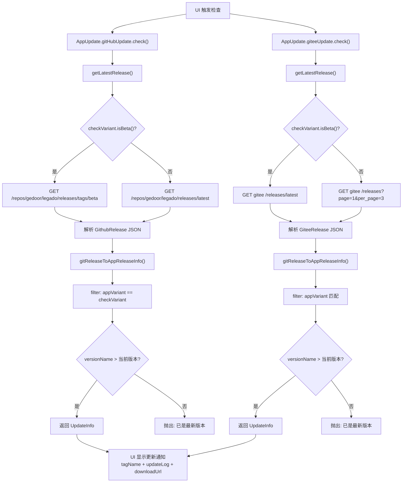
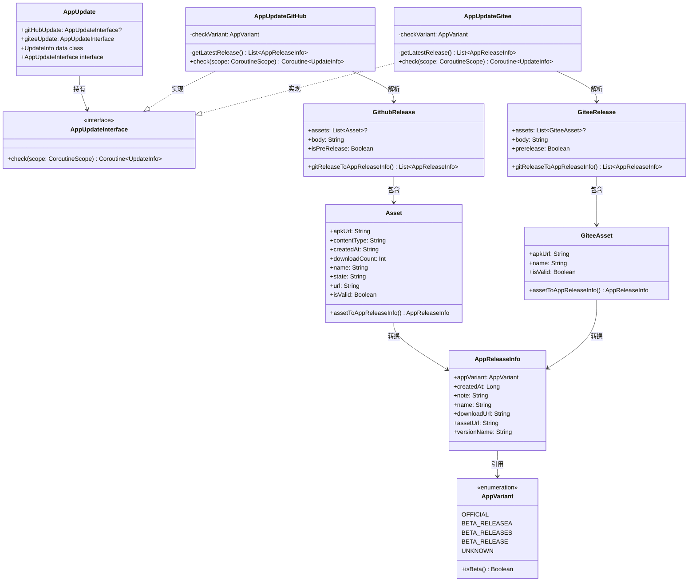

# 应用更新系统

> **核心问题**：Legado 同时发布 GitHub 和 Gitee 两个渠道的 APK，用户可能无法访问其中之一；且存在官方版与多种 Beta 变体（releaseA/releaseS/release），更新检查需精确匹配变体。
>
> **答案**：采用策略模式，`AppUpdate` 作为门面持有 `AppUpdateInterface` 接口的双实现——`AppUpdateGitHub` 和 `AppUpdateGitee`，各自调用对应 Git 托管平台的 REST API 获取发行版信息，通过 `AppVariant` 枚举精确匹配变体，再用字符串比较版本号决定是否提示更新。

---

## 1. 更新检查流程



### 关键步骤说明

| 步骤 | 位置 | 说明 |
|------|------|------|
| 变体判定 | `checkVariant` 属性 | 根据 `AppConfig.updateToVariant` 配置决定检查哪种变体，未配置时回退到 `AppConst.appInfo.appVariant` |
| API 路由 | `getLatestRelease()` | Beta 变体请求 `releases/tags/beta`；官方版请求 `releases/latest`（GitHub）或取前 3 条再过滤非预发布（Gitee） |
| 版本比较 | `it.versionName > AppConst.appInfo.versionName` | 纯字符串字典序比较，依赖 APK 文件名中的版本号字段 |
| 超时保护 | `.timeout(10000)` | 两个实现均在 `check()` 返回的 Coroutine 上设置 10 秒超时 |

---

## 2. 策略模式架构



---

## 3. AppReleaseInfo 数据结构

### 3.1 核心数据类

[AppReleaseInfo.kt](file:///f:/myself/github/WeAgentChat/temp/legado/app/src/main/java/io/legado/app/help/update/AppReleaseInfo.kt#L8)

```kotlin
// L8-L17
data class AppReleaseInfo(
    val appVariant: AppVariant,     // 应用变体类型
    val createdAt: Long,            // 发布时间戳（毫秒）
    val note: String,               // 更新日志（Release body）
    val name: String,               // APK 文件名（含变体与版本信息）
    val downloadUrl: String,        // 浏览器下载地址
    val assetUrl: String            // Asset API 地址（Gitee 为空字符串）
) {
    val versionName: String = name.split("_").getOrNull(2)?.dropLast(2) ?: ""
    // 版本号提取规则：文件名按 "_" 分割取第 3 段，去掉最后 2 字符（".apk" 去掉后缀的尾缀）
}
```

### 3.2 AppVariant 枚举

[AppReleaseInfo.kt](file:///f:/myself/github/WeAgentChat/temp/legado/app/src/main/java/io/legado/app/help/update/AppReleaseInfo.kt#L19)

| 枚举值 | 含义 | `isBeta()` |
|--------|------|-----------|
| `OFFICIAL` | 官方正式版 | false |
| `BETA_RELEASEA` | Beta A 版（arm64） | true |
| `BETA_RELEASES` | Beta S 版（通用） | true |
| `BETA_RELEASE` | Beta 标准版 | true |
| `UNKNOWN` | 未知 | false |

### 3.3 版本号提取逻辑

文件名格式：`legado_<变体>_<版本号>.apk`，例如 `legado_releaseA_3.24.apk`

- `name.split("_")` → `["legado", "releaseA", "3.24.apk"]`
- `.getOrNull(2)` → `"3.24.apk"`
- `.dropLast(2)` → `"3.24"`（去掉 "pk"，注意这里实际去掉的是最后 2 个字符，即 `.apk` 去掉后缀的逻辑存在歧义）

> **注意**：`dropLast(2)` 去掉的是 `"pk"` 而非 `".apk"`，这意味着版本号提取依赖 APK 文件名中版本号与 `.apk` 之间的精确格式。若文件名为 `legado_releaseA_3.24.apk`，`getOrNull(2)` 得到 `3.24.apk`，`dropLast(2)` 得到 `3.24.`（含尾部点号），实际版本比较可能不如预期。此处设计意图应为 `dropLast(4)` 去掉 `.apk`。

### 3.4 Asset 转换对比

| 项目 | GitHub Asset | Gitee Asset |
|------|-------------|-------------|
| 类名 | [Asset](file:///f:/myself/github/WeAgentChat/temp/legado/app/src/main/java/io/legado/app/help/update/AppReleaseInfo.kt#L62) | [GiteeAsset](file:///f:/myself/github/WeAgentChat/temp/legado/app/src/main/java/io/legado/app/help/update/AppReleaseInfo.kt#L95) |
| 有效性判断 | `contentType == "application/vnd.android.package-archive" && state == "uploaded"` (L76-L77) | `apkUrl.contains(".apk")` (L101-L102) |
| 时间戳 | `Instant.parse(createdAt).toEpochMilli()` (L80-L81) | 固定为 `0`（Gitee Asset 无时间字段）(L113) |
| assetUrl | 传入 Asset 的 `url` 字段 | 传入空字符串 `""` (L113) |
| 变体判定 | 依赖 `preRelease` 标志 + 文件名 (L83-L88) | 仅依赖文件名，忽略 `preRelease` (L106-L111) |

---

## 4. 双更新源差异

| 维度 | AppUpdateGitHub | AppUpdateGitee |
|------|----------------|----------------|
| 源文件 | [AppUpdateGitHub.kt](file:///f:/myself/github/WeAgentChat/temp/legado/app/src/main/java/io/legado/app/help/update/AppUpdateGitHub.kt#L1) | [AppUpdateGitee.kt](file:///f:/myself/github/WeAgentChat/temp/legado/app/src/main/java/io/legado/app/help/update/AppUpdateGitee.kt#L1) |
| 仓库 | `gedoor/legado` | `lyc486/legado` |
| Beta API | `/releases/tags/beta`（标签页） | `/releases/latest`（最新一条） |
| 正式 API | `/releases/latest` | `/releases?page=1&per_page=3&direction=desc`（取前 3 条过滤） |
| JSON 解析 | `fromJsonObject<GithubRelease>` | 正式版用 `fromJsonArray<GiteeRelease>`；Beta 用 `fromJsonObject<GiteeRelease>` |
| 变体过滤 | `it.appVariant == checkVariant` | BETA_RELEASE 时不切版本（保持当前变体）；其他情况用 `checkVariant` |
| 超时 | 10 秒 (L68) | 10 秒 (L84) |
| 可空性 | `AppUpdateInterface?`（可能为 null） | `AppUpdateInterface`（非空） |

### Gitee 正式版的特殊处理

Gitee 的正式版 API 返回的是 Release 列表（非单条），需额外过滤：

```kotlin
// AppUpdateGitee.kt L45-L52
if (!checkVariant.isBeta()) {
    return GSON.fromJsonArray<GiteeRelease>(body)
        .getOrElse { ... }
        .first { !it.prerelease }         // 过滤掉预发布
        .gitReleaseToAppReleaseInfo()
        .sortedByDescending { it.createdAt }
}
```

---

## 5. 源文件索引

| 文件 | 行数 | 职责 |
|------|------|------|
| [AppUpdate.kt](file:///f:/myself/github/WeAgentChat/temp/legado/app/src/main/java/io/legado/app/help/update/AppUpdate.kt#L1) | 29 行 | 门面对象，定义 `AppUpdateInterface` 接口和 `UpdateInfo` 数据类 |
| [AppUpdateGitHub.kt](file:///f:/myself/github/WeAgentChat/temp/legado/app/src/main/java/io/legado/app/help/update/AppUpdateGitHub.kt#L1) | 70 行 | GitHub 更新源实现 |
| [AppUpdateGitee.kt](file:///f:/myself/github/WeAgentChat/temp/legado/app/src/main/java/io/legado/app/help/update/AppUpdateGitee.kt#L1) | 86 行 | Gitee 更新源实现 |
| [AppReleaseInfo.kt](file:///f:/myself/github/WeAgentChat/temp/legado/app/src/main/java/io/legado/app/help/update/AppReleaseInfo.kt#L1) | 115 行 | 数据类群：`AppReleaseInfo`、`AppVariant`、`GithubRelease`、`GiteeRelease`、`Asset`、`GiteeAsset` |

### 关键行号速查

| 元素 | 文件 | 行号 |
|------|------|------|
| `AppUpdate` 对象定义 | AppUpdate.kt | L6 |
| `gitHubUpdate` 懒加载 | AppUpdate.kt | L8 |
| `giteeUpdate` 懒加载 | AppUpdate.kt | L11 |
| `UpdateInfo` 数据类 | AppUpdate.kt | L16-L21 |
| `AppUpdateInterface` 接口 | AppUpdate.kt | L23-L27 |
| `AppUpdateGitHub.checkVariant` | AppUpdateGitHub.kt | L19-L26 |
| `AppUpdateGitHub.getLatestRelease()` | AppUpdateGitHub.kt | L28-L50 |
| `AppUpdateGitHub.check()` | AppUpdateGitHub.kt | L52-L69 |
| `AppUpdateGitee.checkVariant` | AppUpdateGitee.kt | L20-L27 |
| `AppUpdateGitee.getLatestRelease()` | AppUpdateGitee.kt | L29-L60 |
| `AppUpdateGitee.check()` | AppUpdateGitee.kt | L62-L85 |
| `AppReleaseInfo` 数据类 | AppReleaseInfo.kt | L8-L17 |
| `AppVariant` 枚举 | AppReleaseInfo.kt | L19-L30 |
| `GithubRelease` 数据类 | AppReleaseInfo.kt | L33-L45 |
| `GiteeRelease` 数据类 | AppReleaseInfo.kt | L47-L59 |
| `Asset` 数据类 | AppReleaseInfo.kt | L62-L92 |
| `GiteeAsset` 数据类 | AppReleaseInfo.kt | L95-L115 |
