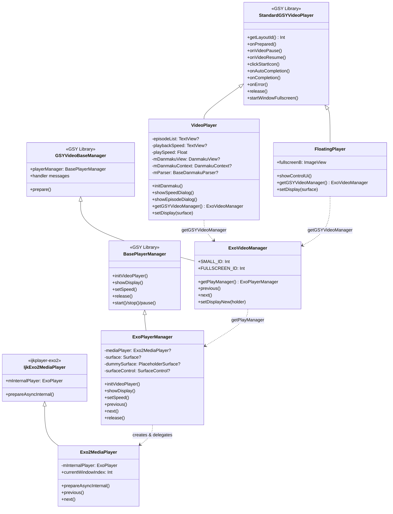

# 视频播放模块（GSY + ExoPlayer）

源码目录：`app/src/main/java/io/legado/app/help/gsyVideo/`（UI/管理层）、`app/src/main/java/io/legado/app/help/exoplayer/`（引擎层）、`app/src/main/java/io/legado/app/ui/video/`（页面/增强/手势）

基于 GSYVideoPlayer 库封装的视频播放子系统，采用四层架构从 UI 到播放引擎逐层解耦，同时集成了弹幕渲染、选集切换和倍速播放功能；引擎层由 `help/exoplayer/` 提供 11 个支撑类（实例池/预加载/嗅探/密钥/画质增强）。

> 主索引：[glide-video-webview.md](./glide-video-webview.md)（三模块拆分后本文件为视频模块权威文档）

## 1. 四层架构继承体系



### 各层职责

| 层级 | 类 | 职责 |
|------|-----|------|
| UI层 | `VideoPlayer` / `FloatingPlayer` | 布局渲染、手势交互、弹幕控制、全屏切换 |
| 管理层 | `ExoVideoManager` | 播放器生命周期管理、消息派发、上下集切换、音轨查询/切换、画质增强注入 |
| 适配层 | `ExoPlayerManager` | Surface 管理、缓存策略、静音/音量控制 |
| 引擎层 | `Exo2MediaPlayer` + `help/exoplayer/` 11 类 | ExoPlayer 实例创建与配置、多窗口(Timeline)切换、实例池化与预加载（见 §6） |

### 源文件引用

- [VideoPlayer.kt](file:///f:/myself/github/WeAgentChat/temp/legado/app/src/main/java/io/legado/app/help/gsyVideo/VideoPlayer.kt#L34) — `class VideoPlayer` 定义（L34-L553）
- [FloatingPlayer.kt](file:///f:/myself/github/WeAgentChat/temp/legado/app/src/main/java/io/legado/app/help/gsyVideo/FloatingPlayer.kt#L16) — `class FloatingPlayer` 定义（L16-L171）
- [ExoVideoManager.kt](file:///f:/myself/github/WeAgentChat/temp/legado/app/src/main/java/io/legado/app/help/gsyVideo/ExoVideoManager.kt#L15) — `class ExoVideoManager` 定义（L15-L137）
- [ExoPlayerManager.kt](file:///f:/myself/github/WeAgentChat/temp/legado/app/src/main/java/io/legado/app/help/gsyVideo/ExoPlayerManager.kt#L25) — `class ExoPlayerManager` 定义（L25-L277）
- [Exo2MediaPlayer.kt](file:///f:/myself/github/WeAgentChat/temp/legado/app/src/main/java/io/legado/app/help/gsyVideo/Exo2MediaPlayer.kt#L27) — `class Exo2MediaPlayer` 定义（L27-L130）

---

## 2. VideoPlayer 主播放器

### 核心功能

**弹幕生命周期**（与播放器状态同步）：

| 播放器事件 | 弹幕操作 | 代码位置 |
|-----------|----------|----------|
| `onPrepared` | `mDanmakuView.prepare(parser, context)` | L143-L153 / L339-L346 |
| `onVideoPause` | `mDanmakuView.pause()` | L156-L163 |
| `onVideoResume` | `mDanmakuView.resume()` | L166-L174 |
| `onCompletion` | `mDanmakuView.release()` | L190-L196 |
| `onSeekComplete` | `mDanmakuView.seekTo(time)` | L199-L208 |
| 全屏切换 | 同步 `mDanmakuStartSeekPosition` | L456-L490 |

**手势交互**（L92-L123，GSY 层回调）：

- 双击 → `touchDoubleUp`
- 单击 → `onClickUiToggle`（非拖拽/调音量/调亮度时）
- 长按 → `VideoPlay.longPressSpeed / 10.0f` 倍速播放（L110-L113）

> R3 手势重构后，抖音风格手势统一在 `VideoFragment` 层重新实现（GSY 内部 onLongPress/onDoubleTap 收不到事件），详见 §8 视频手势体系。

**选集切换**（L376-L395）：

- `showEpisodeDialog()` 弹出 `ChoiceEpisodeDialog`
- 回调中设置 `VideoPlay.chapterInVolumeIndex` 并调用 `VideoPlay.startPlay`

**倍速选择**（L397-L422）：

- 支持 0.5X ~ 3.0X 共 8 档（L403）
- 变速时同步调整弹幕滚动速度 `mDanmakuContext.setScrollSpeedFactor`（L138）

**onPrepared 挂钩**（L322-L338）：

- 音轨检查：`getAudioTracks()` 多音轨时显示音轨按钮（L329-L332）
- 画质增强：`post { ImageEnhanceController.apply(this) }`（L335，A 期色彩滤镜）+ `post { ImageEnhanceController.applyEffectsToPlayer() }`（L337，B 期效果链，见 §7）

### Surface 管理

`setDisplay()` (L515-L524) 根据 View 类型选择不同的 Surface 设置方式：
- `SurfaceView` → `gsyVideoManager.setDisplayNew(surfaceView)`
- 其他 → `gsyVideoManager.setDisplay(surface)`
- null → `gsyVideoManager.setDisplayNew(null)`

### 播放器转移

`setSurfaceToPlay()` (L529-L533) 用于浮窗/全屏切换时转移播放器所有权：添加 TextureView → 设置 Listener → 校验状态。

---

## 3. FloatingPlayer 浮窗播放器

### 源文件

[FloatingPlayer.kt](file:///f:/myself/github/WeAgentChat/temp/legado/app/src/main/java/io/legado/app/help/gsyVideo/FloatingPlayer.kt#L16) — `class FloatingPlayer` 定义（L16-L171）

### 与 VideoPlayer 的差异

| 特性 | VideoPlayer | FloatingPlayer |
|------|-------------|----------------|
| 布局 | `video_layout_controller` / `video_layout_controller_full` | `video_layout_floating` |
| 弹幕 | 完整弹幕生命周期 | 无弹幕 |
| 全屏 | 支持 `startWindowFullscreen` | 不支持 (`getFullWindowPlayer` 返回 null) |
| 进度条 | 完整进度+时间显示 | 仅底部进度条（L88-L97） |
| 控制 UI | 双击/长按/选集/倍速 | 仅显示/隐藏控制按钮（L99-L105） |

`showControlUi()` (L99-L105) 实现简单的 UI 切换：`mStartButton` 不可见时显示全部控件，否则隐藏。

---

## 4. 弹幕系统

### 源文件

- [DanmakuAdapter.kt](file:///f:/myself/github/WeAgentChat/temp/legado/app/src/main/java/io/legado/app/help/gsyVideo/DanmakuAdapter.kt#L20) — `class DanmakuAdapter` 定义（L20-L78）
- [BiliDanmukuParser.kt](file:///f:/myself/github/WeAgentChat/temp/legado/app/src/main/java/io/legado/app/help/gsyVideo/BiliDanmukuParser.kt#L24) — `class BiliDanmukuParser` 定义（L24-L287）

### DanmakuAdapter

继承 `BaseCacheStuffer.Proxy`，负责图文混排弹幕的绘制准备：

- `prepareDrawing()` (L24-L55)：检查弹幕是否含 `Spanned`，若是则异步加载远程图片（B站 favicon），创建 `ImageSpan` 混排内容
- `releaseResource()` (L60-L62)：清理 `ImageSpan` 占用资源——**源码现状仍为 TODO 空实现**（未主动回收远程图片 drawable，依赖 GC；基类回收钩子未落地，2026-08-30 源码核验）
- `createSpannable()` (L64-L77)：构建图文混排 SpannableStringBuilder，附加背景色

### BiliDanmukuParser

继承 `BaseDanmakuParser`，解析 B站 XML 格式弹幕：

**SAX 解析流程**：

| 回调 | 逻辑 | 行号 |
|------|------|------|
| `startElement` | 解析 `<d p="...">` 标签的 `p` 属性 | L72-L110 |
| `characters` | 填充弹幕文本，处理特殊弹幕（TYPE_SPECIAL） | L131-L254 |
| `endElement` | 将完整弹幕加入 `Danmakus` 集合 | L114-L129 |

**`p` 属性格式**（L81-L89）：

```
<d p="23.826,1,25,16777215,1422201084,0,057075e9,757076900">弹幕文本</d>
```

| 索引 | 含义 |
|------|------|
| 0 | 出现时间（秒） |
| 1 | 类型（1=右→左滚动，5=顶端固定，4=底端固定，7=高级弹幕） |
| 2 | 字号 |
| 3 | 颜色 |
| 4 | 时间戳 |
| 5 | 弹幕池 ID |
| 6 | 用户 hash |
| 7 | 弹幕 ID |

**特殊弹幕（TYPE_SPECIAL）**：以 JSON 数组格式 `[beginX, beginY, alpha, duration, text, ...]` 表示（L138-L253），支持位移动画、旋转、路径运动等高级效果。

---

## 5. 选集与倍速对话框

### ChoiceEpisodeDialog

[ChoiceEpisodeDialog.kt](file:///f:/myself/github/WeAgentChat/temp/legado/app/src/main/java/io/legado/app/help/gsyVideo/ChoiceEpisodeDialog.kt#L17) — `class ChoiceEpisodeDialog` 定义（L17-L80）

- 数据类型：`List<BookChapter>`
- 列表项显示：`item.title`（L55）
- 布局：`switch_episode_video_dialog`，宽度 40% 屏幕，右侧对齐
- 回调：`onItemClick(position)` 和 `finishDialog()`
- 支持初始选中位置：`setSelectionFromTop(initialSelection, 0)`（L58）

### ChoiceSpeedDialog

[ChoiceSpeedDialog.kt](file:///f:/myself/github/WeAgentChat/temp/legado/app/src/main/java/io/legado/app/help/gsyVideo/ChoiceSpeedDialog.kt#L15) — `class ChoiceSpeedDialog` 定义（L15-L73)

- 数据类型：`List<Float>`
- 列表项显示：`item.toString() + "X"`（L51）
- 布局：`switch_speed_video_dialog`，宽度 30% 屏幕，右侧对齐
- 回调：`onItemClick(value: Float)` 和 `finishDialog()`

### SwitchVideoAdapter

[SwitchVideoAdapter.kt](file:///f:/myself/github/WeAgentChat/temp/legado/app/src/main/java/io/legado/app/help/gsyVideo/SwitchVideoAdapter.kt#L11) — `class SwitchVideoAdapter` 定义（L11-L24）

通用列表适配器，支持泛型 `<T>` 和自定义 `titleProvider` 闭包，两个对话框共用。

---

## 6. ExoPlayer 引擎层（help/exoplayer/，11 类）

引擎层支撑类全景（全部经源码核验，2026-08-30）：

| 类 | 形态 | 核心职责 |
|----|------|----------|
| [ExoPlayerHelper.kt](file:///f:/myself/github/WeAgentChat/temp/legado/app/src/main/java/io/legado/app/help/exoplayer/ExoPlayerHelper.kt#L62) | object (L62) | 请求基础设施：`BROWSER_UA` 浏览器 UA（L74，部分站点 CDN 拒绝非浏览器 UA）+ Referer/Cookie/UA 防盗链注入；`bandwidthMeter` 全局单例（L95）+ `BandwidthTier` 弱/中/好三档（L102），prepare 前按档位构建 LoadControl（LoadControl 只能在 player 构建时设置，运行时不可热切换的工程折中） |
| [PlayerInstancePool.kt](file:///f:/myself/github/WeAgentChat/temp/legado/app/src/main/java/io/legado/app/help/exoplayer/PlayerInstancePool.kt#L42) | object (L42) | ExoPlayer 重量级实例池（`MAX_POOL_SIZE=3`，LRU），解决 ViewPager2 快速滑动时反复 release/build 的内存抖动与 30-100ms 起播延迟；**TrackSelector 每实例独立**（V-P0-1：共享单例并发 acquire 二次 init 抛 IllegalStateException，真机 5 次 FATAL 实证）；生命周期绑定 VideoPlayerActivity.onDestroy → clear() |
| [VideoPreloader.kt](file:///f:/myself/github/WeAgentChat/temp/legado/app/src/main/java/io/legado/app/help/exoplayer/VideoPreloader.kt#L30) | object (L30) | 下一视频 256KB 预加载（抖音官方方案）：当前播放进度 50% 触发，`Range: bytes=0-262143`；WiFi 最多预加载 3 个 / 4G 仅 1 个，LRU 淘汰；预加载字节数按用户配置或设备档位（HIGH=10MB/MID=5MB，上限 20MB 防 OOM） |
| [FirstFramePreloader.kt](file:///f:/myself/github/WeAgentChat/temp/legado/app/src/main/java/io/legado/app/help/exoplayer/FirstFramePreloader.kt#L33) | object (L33) | 首帧 I-frame 预加载（快手官方方案）：对位置 ±1 的视频 Range 拉取前 ~1MB（MP4 moov box + 首个 I-frame / m3u8 清单+首分片头），写入 ExoPlayer 缓存层；`PREWARM_BYTES=64KB`（L36）点击瞬间预热 TCP+DNS；目标首帧命中率 ≥80% |
| [InputStreamDataSource.kt](file:///f:/myself/github/WeAgentChat/temp/legado/app/src/main/java/io/legado/app/help/exoplayer/InputStreamDataSource.kt#L15) | class (L15) | `BaseDataSource` 包装 `() -> InputStream` supplier，嗅探/解密得到的字节流直接喂给 ExoPlayer |
| [M3u8PreCheckDataSource.kt](file:///f:/myself/github/WeAgentChat/temp/legado/app/src/main/java/io/legado/app/help/exoplayer/M3u8PreCheckDataSource.kt#L43) | class (L43) | m3u8 HEAD 预检（P0-5）：HlsMediaSource 创建前验证可达性 + 获取重定向 finalUrl；方案A HEAD（200/206 校验 Content-Type、302 跟随最多 5 次、403 加 UA 重试）/ 方案B 降级读前 1KB 校验 `#EXTM3U`；OkHttp+Cronet 接入（BoringSSL TLS 指纹 + QUIC）；connect 5s / read 3s |
| [HlsKeyDataSourceFactory.kt](file:///f:/myself/github/WeAgentChat/temp/legado/app/src/main/java/io/legado/app/help/exoplayer/HlsKeyDataSourceFactory.kt#L40) | class (L40) | HLS AES-128 密钥请求防盗链头注入（P1-8）：`wrap()` 包装 upstream DataSource.Factory，open 时按 URL 路径含 key 判断密钥请求并注入 `VideoPlay.currentPlayHeaders`；已知上限：路径判断准确率约 80% |
| [MimeSniffer.kt](file:///f:/myself/github/WeAgentChat/temp/legado/app/src/main/java/io/legado/app/help/exoplayer/MimeSniffer.kt#L26) | object (L26) | Magic Number 签名表 17 项（对齐 WHATWG §6.2）+ 主动 Probe（isReallyM3u8 / isReallyMpd / detectMoovPosition）；`SNIFF_LENGTH=8KB` Range 嗅探；WebM/MKV 按 EBML DocType 区分、RIFF 容器二次校验 |
| [MimeSnifferCache.kt](file:///f:/myself/github/WeAgentChat/temp/legado/app/src/main/java/io/legado/app/help/exoplayer/MimeSnifferCache.kt#L24) | object (L24) | URL→mimeType LRU 缓存：容量 100 / TTL 1 小时；key 为**完整 URL 含 query**（去 query 曾致不同 id 视频缓存串用 → 3002 错误，R2 修订） |
| [DeviceInfoHelper.kt](file:///f:/myself/github/WeAgentChat/temp/legado/app/src/main/java/io/legado/app/help/exoplayer/DeviceInfoHelper.kt#L22) | object (L22) | 设备档位检测（R3）：HIGH（内存≥6GB 且 CPU≥8核 且 磁盘≥10GB）/ MID；已移除 LOW 档，检测失败降级 HIGH（默认中高端参数）；结果缓存 |
| [ImageEnhanceEffects.kt](file:///f:/myself/github/WeAgentChat/temp/legado/app/src/main/java/io/legado/app/help/exoplayer/ImageEnhanceEffects.kt#L21) | object (L21) + `SharpenEffect` (L67) | media3-effect 画质增强效果链（详见 §7） |

---

## 7. 画质增强体系

### 7.1 A 期 — 色彩调节（ImageEnhanceController）

[ImageEnhanceController.kt](file:///f:/myself/github/WeAgentChat/temp/legado/app/src/main/java/io/legado/app/ui/video/ImageEnhanceController.kt#L24)（`ui/video/`，object，L24-L166）

- **四参数合成单一 ColorMatrix**（`buildColorMatrix()` L61-L105）：亮度/对比度/饱和度/色温，像素作用顺序 **色温 → 饱和度 → 对比度+亮度（合并矩阵）**；参数为十倍整值（亮度/对比度/色温 -500~500，饱和度 -1000~1000），持久化于 `VideoPlay.enhanceBrightness/Contrast/Saturation/ColorTemp`（VideoPlay.kt L113-L134）
- **应用通道**：`apply()`（L112-L130）实时遍历 view 树查找 TextureView（AD-02，不缓存引用，GSY 默认渲染 sRenderType=TEXTURE），`tv.setLayerType(LAYER_TYPE_HARDWARE, paint)` 硬件层 Paint Filter 应用（K2 实测生效）
- **性能守卫**（AD-04）：四参数指纹 `enhanceFingerprint()`（L133-L137，b/c/s/t 打包 16bit×4）+ `cachedPaint` 复用 + `lastAppliedView` 比对，参数未变且视图未重建时短路，消除滑条拖动帧级硬件层重建
- **回退**：`reset()`（L140-L144）`setLayerType(LAYER_TYPE_NONE, null)` 移除滤镜层

### 7.2 B 期 — 锐化/降噪（ImageEnhanceEffects，media3-effect 1.10.1）

[ImageEnhanceEffects.kt](file:///f:/myself/github/WeAgentChat/temp/legado/app/src/main/java/io/legado/app/help/exoplayer/ImageEnhanceEffects.kt#L21)（object L21 + 自研 `SharpenEffect` L67-L80）

- **技术路线**：全部基于 media3-effect 1.10.1 公开效果类组装，零手写 GL shader（规避 BaseGlShaderProgram 纹理池管理风险）；K7：API 签名按 1.10.1 字节码核实（1.10.1 无 SinglePassGlEffect/VideoInfo）
- **效果链顺序：降噪 → 锐化**（先除噪再锐化，防噪点被锐化放大）
  - 降噪：`GaussianBlur(sigma)`，档位 1→0.5 / 2→1.0（`denoiseSigma` L32-L36）
  - 锐化：自研 `SharpenEffect(k) : SeparableConvolution`，1D 核 **[-k, 1+2k, -k]**（`getConvolution()` 分段表达 3-tap 核，横竖各卷积一次合成边缘增强，sum=1 亮度守恒），档位 1→0.15 / 2→0.30 / 3→0.50（`sharpenK` L24-L29）
- **总开关**：`VideoPlay.enhanceEnabled`（VideoPlay.kt L107-L110，默认 false）；`buildEffects()` 单点守卫——关闭时返回空列表，覆盖 onPrepared 重建路径与所有调用方，保证「关闭时完全回退原画渲染」

### 7.3 注入链与挂钩点

```
ImageEnhanceController.applyEffectsToPlayer() (L152-L154)
  → VideoPlay.videoManager (VideoPlay.kt L288, lazy ExoVideoManager)
    → ExoVideoManager.applyImageEnhanceEffects() (ExoVideoManager.kt L120-L135)
      → playerManager(protected) → getMediaPlayer() → exoPlayerInstance
        → player.setVideoEffects(effects)
```

- **访问链在管理器内部完成**：`playerManager` 为 protected，故注入方法挂在 ExoVideoManager 上（同 getAudioTracks/releaseSniffResources 先例）
- **K4 防残留**：档位全关时 `setVideoEffects(空列表)` 显式清空，防池化实例跨会话残留效果链
- **挂钩点**：
  1. `VideoPlayer.onPrepared`（VideoPlayer.kt L335 色彩滤镜 apply / L337 效果链 applyEffectsToPlayer），切集/重播均触发
  2. 设置面板 `VideoSettingsPanelContent.kt`（L321/L568/L588），滑条实时预览热更新

### 7.4 已知坑

- **GSY 状态变化会重置渲染视图**：色彩滤镜必须**重新 apply**——只在 onViewCreated 一次性应用会被 GSY 重建的 TextureView 冲掉；onPrepared 钩子保证每次播放管线重建后重新挂滤镜（A1.3 实证）
- **效果生效时机**：media3 语义下效果在下一次视频管线构建时生效，onPrepared 钩子保证每次播放都会重建应用
- **线程约束**：`applyEffectsToPlayer()` 必须主线程调用（ExoPlayer verifyApplicationThread）
- **兜底**：`setVideoEffects` 注入失败仅 AppLog 记录，不影响播放（media3 管线异常兜底）

---

## 8. 视频手势体系（video-gesture-overhaul）

实现在 [VideoFragment.kt](file:///f:/myself/github/WeAgentChat/temp/legado/app/src/main/java/io/legado/app/ui/video/VideoFragment.kt#L974)（`initGestureDetector` L974-L1081 + `handlePlayerTouchEvent` L1093 起）：

| 手势 | 实现 | 要点 |
|------|------|------|
| 上下滑切视频 | ViewPager2 页面滑动 | 文章模式单指垂直滑动交给 ViewPager2 拦截（L1059 `handleArticleModeTouchEvent`）；列表由 VideoPagerAdapter 承载 |
| 左右滑 seek（R2） | ACTION_DOWN 记录 `slideSeekStartX` + `slideSeekStartPos`（L1098-L1105） | 起点记录播放位置防 seek 预览漂移；MOVE `handleSlideSeekMove` / UP `handleSlideSeekRelease`；长按倍速期间抑制 |
| 长按倍速（R1） | `onLongPress`（L1008-L1016） | `VideoPlay.longPressSpeed / 10.0f`（默认 30 → 3.0x），`ACTION_UP` 恢复原速（L1136） |
| 双击暂停/播放（R4） | `onDoubleTap`（L1019-L1026） | PLAYING↔PAUSE 切换 |
| 单击 | `onSingleTapConfirmed`（L976-L1003） | PURE/NORMAL/FULLSCREEN 三态控件显隐，显示后 3 秒自动隐藏（F2） |
| 双指缩放 | `ScaleGestureDetector`（L1030-L1040） | `scaleFactor > 1.2` 触发全屏 |
| 双指左右滑 | ACTION_MOVE 双指同向检测（L1114-L1125） | 隐藏控件进 PURE 态 |

**关键实现约束**：
- 触摸目标重定向（F2 根因修复）：GSY 对 `surface_container` 同时设置了 onClickListener+onTouchListener，事件被其直接消费——OnTouchListener 必须设在 `surface_container` 上（L1050-L1051）并**始终返回 true** 统一消费
- R3 抖音风格**禁用** GSY 内置亮度/音量/进度滑动手势，进度 seek 由 R2 自研路径接管
- WebView 播放模式：`WebViewVideoPlayer.onInterceptTouchEvent()` 拦截垂直滑动（FrameLayout 的 OnTouchListener 收不到 WebView 消费的事件），保证 ViewPager2 可上下滑

---

## 文件索引

### GSY 视频播放模块（help/gsyVideo/，10 文件）

| 文件 | 类型 | 核心职责 |
|------|------|----------|
| [VideoPlayer.kt](file:///f:/myself/github/WeAgentChat/temp/legado/app/src/main/java/io/legado/app/help/gsyVideo/VideoPlayer.kt#L34) | StandardGSYVideoPlayer | 主视频播放器+弹幕+手势 |
| [FloatingPlayer.kt](file:///f:/myself/github/WeAgentChat/temp/legado/app/src/main/java/io/legado/app/help/gsyVideo/FloatingPlayer.kt#L16) | StandardGSYVideoPlayer | 浮窗播放器 |
| [SwitchVideoAdapter.kt](file:///f:/myself/github/WeAgentChat/temp/legado/app/src/main/java/io/legado/app/help/gsyVideo/SwitchVideoAdapter.kt#L11) | ArrayAdapter | 通用列表适配器 |
| [ExoVideoManager.kt](file:///f:/myself/github/WeAgentChat/temp/legado/app/src/main/java/io/legado/app/help/gsyVideo/ExoVideoManager.kt#L15) | GSYVideoBaseManager | 播放器管理器+画质增强注入 |
| [ExoPlayerManager.kt](file:///f:/myself/github/WeAgentChat/temp/legado/app/src/main/java/io/legado/app/help/gsyVideo/ExoPlayerManager.kt#L25) | BasePlayerManager | ExoPlayer 适配层 |
| [Exo2MediaPlayer.kt](file:///f:/myself/github/WeAgentChat/temp/legado/app/src/main/java/io/legado/app/help/gsyVideo/Exo2MediaPlayer.kt#L27) | IjkExo2MediaPlayer | ExoPlayer 引擎封装 |
| [DanmakuAdapter.kt](file:///f:/myself/github/WeAgentChat/temp/legado/app/src/main/java/io/legado/app/help/gsyVideo/DanmakuAdapter.kt#L20) | BaseCacheStuffer.Proxy | 弹幕图文混排适配 |
| [BiliDanmukuParser.kt](file:///f:/myself/github/WeAgentChat/temp/legado/app/src/main/java/io/legado/app/help/gsyVideo/BiliDanmukuParser.kt#L24) | BaseDanmakuParser | B站 XML 弹幕解析器 |
| [ChoiceSpeedDialog.kt](file:///f:/myself/github/WeAgentChat/temp/legado/app/src/main/java/io/legado/app/help/gsyVideo/ChoiceSpeedDialog.kt#L15) | Dialog | 倍速选择对话框 |
| [ChoiceEpisodeDialog.kt](file:///f:/myself/github/WeAgentChat/temp/legado/app/src/main/java/io/legado/app/help/gsyVideo/ChoiceEpisodeDialog.kt#L17) | Dialog | 选集对话框 |

### ExoPlayer 引擎层（help/exoplayer/，11 文件）

| 文件 | 类型 | 核心职责 |
|------|------|----------|
| [ExoPlayerHelper.kt](file:///f:/myself/github/WeAgentChat/temp/legado/app/src/main/java/io/legado/app/help/exoplayer/ExoPlayerHelper.kt#L62) | object | UA/防盗链头注入 + 带宽档位 |
| [PlayerInstancePool.kt](file:///f:/myself/github/WeAgentChat/temp/legado/app/src/main/java/io/legado/app/help/exoplayer/PlayerInstancePool.kt#L42) | object | ExoPlayer 实例池（LRU×3） |
| [VideoPreloader.kt](file:///f:/myself/github/WeAgentChat/temp/legado/app/src/main/java/io/legado/app/help/exoplayer/VideoPreloader.kt#L30) | object | 下一视频 256KB 预加载 |
| [FirstFramePreloader.kt](file:///f:/myself/github/WeAgentChat/temp/legado/app/src/main/java/io/legado/app/help/exoplayer/FirstFramePreloader.kt#L33) | object | 首帧 I-frame 预加载 |
| [InputStreamDataSource.kt](file:///f:/myself/github/WeAgentChat/temp/legado/app/src/main/java/io/legado/app/help/exoplayer/InputStreamDataSource.kt#L15) | class | InputStream→DataSource 适配 |
| [M3u8PreCheckDataSource.kt](file:///f:/myself/github/WeAgentChat/temp/legado/app/src/main/java/io/legado/app/help/exoplayer/M3u8PreCheckDataSource.kt#L43) | class | m3u8 HEAD 预检+重定向 |
| [HlsKeyDataSourceFactory.kt](file:///f:/myself/github/WeAgentChat/temp/legado/app/src/main/java/io/legado/app/help/exoplayer/HlsKeyDataSourceFactory.kt#L40) | class | HLS 密钥请求防盗链注入 |
| [MimeSniffer.kt](file:///f:/myself/github/WeAgentChat/temp/legado/app/src/main/java/io/legado/app/help/exoplayer/MimeSniffer.kt#L26) | object | Magic Number 嗅探（17 项签名表） |
| [MimeSnifferCache.kt](file:///f:/myself/github/WeAgentChat/temp/legado/app/src/main/java/io/legado/app/help/exoplayer/MimeSnifferCache.kt#L24) | object | 嗅探结果 LRU 缓存 |
| [DeviceInfoHelper.kt](file:///f:/myself/github/WeAgentChat/temp/legado/app/src/main/java/io/legado/app/help/exoplayer/DeviceInfoHelper.kt#L22) | object | 设备档位 HIGH/MID |
| [ImageEnhanceEffects.kt](file:///f:/myself/github/WeAgentChat/temp/legado/app/src/main/java/io/legado/app/help/exoplayer/ImageEnhanceEffects.kt#L21) | object+class | media3-effect 锐化/降噪效果链 |
