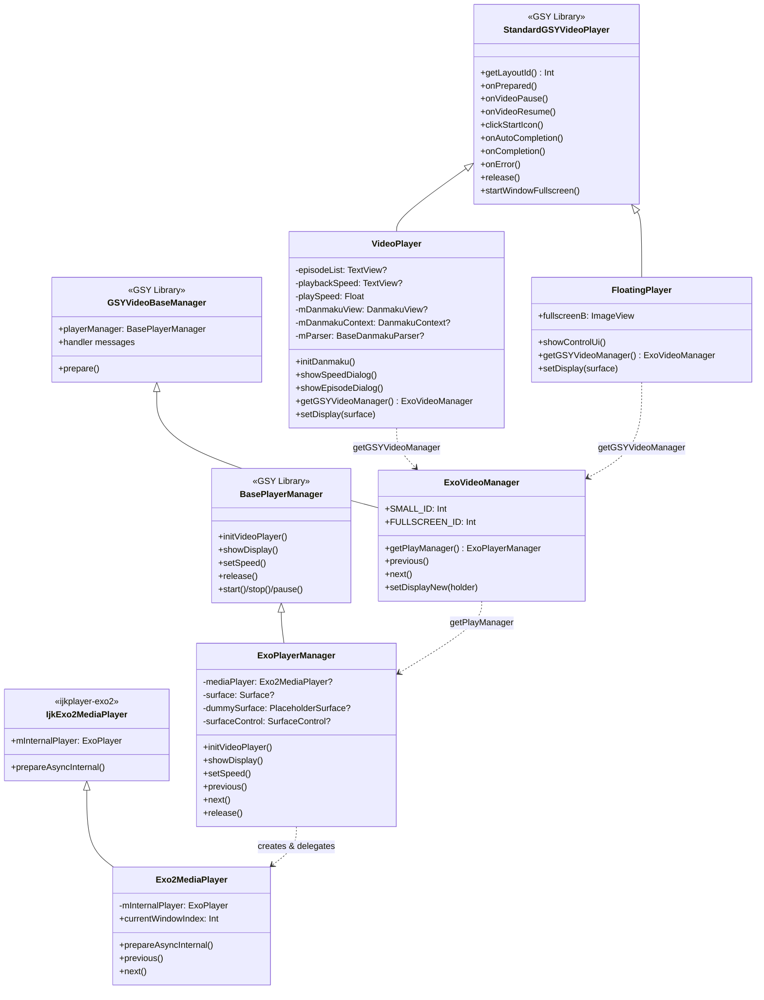

# 视频播放模块（GSY + ExoPlayer）

源码目录：`app/src/main/java/io/legado/app/help/gsyVideo/`（UI/管理层）、`app/src/main/java/io/legado/app/help/exoplayer/`（引擎层）、`app/src/main/java/io/legado/app/ui/video/`（页面/增强/手势）

基于 GSYVideoPlayer 库封装的视频播放子系统，采用四层架构从 UI 到播放引擎逐层解耦，同时集成了弹幕渲染、选集切换和倍速播放功能；引擎层由 `help/exoplayer/` 提供 12 个支撑类（预填/实例池/嗅探/密钥/画质增强）。

文档分两大板块：§1-§8 为**底层组件层**（四层架构/播放器/弹幕/引擎/画质/手势），§9-§12 为**功能能力层**（嗅探链路/播放采集与错误恢复/上下滑连续播放/沉浸式传统双布局），功能层全部按 2026-09-06 源码核验撰写。

> 行号基准：全文行号以 2026-09-06 源码核验为准，源码演进后以文中函数名为准检索。

> 主索引：[glide-video-webview.md](./glide-video-webview.md)（三模块拆分后本文件为视频模块权威文档）

## 1. 四层架构继承体系



### 各层职责

| 层级 | 类 | 职责 |
|------|-----|------|
| UI层 | `VideoPlayer` / `FloatingPlayer` | 布局渲染、手势交互、弹幕控制、全屏切换 |
| 管理层 | `ExoVideoManager` | 播放器生命周期管理、消息派发、上下集切换、音轨查询/切换、画质增强注入 |
| 适配层 | `ExoPlayerManager` | Surface 管理、缓存策略、静音/音量控制 |
| 引擎层 | `Exo2MediaPlayer` + `help/exoplayer/` 12 类 | ExoPlayer 实例创建与配置、多窗口(Timeline)切换、预填与实例管理（见 §6） |

### 源文件引用

- [VideoPlayer.kt](file:///f:/myself/github/WeAgentChat/temp/legado/app/src/main/java/io/legado/app/help/gsyVideo/VideoPlayer.kt#L46) — `class VideoPlayer` 定义（L46 起，全文件 925 行）
- [FloatingPlayer.kt](file:///f:/myself/github/WeAgentChat/temp/legado/app/src/main/java/io/legado/app/help/gsyVideo/FloatingPlayer.kt#L16) — `class FloatingPlayer` 定义（L16-L176）
- [ExoVideoManager.kt](file:///f:/myself/github/WeAgentChat/temp/legado/app/src/main/java/io/legado/app/help/gsyVideo/ExoVideoManager.kt#L15) — `class ExoVideoManager` 定义（L15-L144）
- [ExoPlayerManager.kt](file:///f:/myself/github/WeAgentChat/temp/legado/app/src/main/java/io/legado/app/help/gsyVideo/ExoPlayerManager.kt#L27) — `class ExoPlayerManager` 定义（L27-L322）
- [Exo2MediaPlayer.kt](file:///f:/myself/github/WeAgentChat/temp/legado/app/src/main/java/io/legado/app/help/gsyVideo/Exo2MediaPlayer.kt#L46) — `class Exo2MediaPlayer` 定义（L46 起，全文件 1450 行）

---

## 2. VideoPlayer 主播放器

### 核心功能

**弹幕生命周期**（与播放器状态同步，2026-09-06 行号核验）：

| 播放器事件 | 弹幕操作 | 代码位置 |
|-----------|----------|----------|
| `onPrepared` | `mDanmakuView.prepare(parser, context)` | L337 起 |
| `onVideoPause` | `mDanmakuView.pause()` | L365 |
| `onVideoResume` | `mDanmakuView.resume()` | L375 |
| `onCompletion` | `mDanmakuView.release()` | L399 |
| `onSeekComplete` | `mDanmakuView.seekTo(time)` | L408 |
| 全屏切换 | 同步 `mDanmakuStartSeekPosition` | L824-L836 |

**手势交互**（GSY 层回调）：

- 双击 → `touchDoubleUp`
- 单击 → `onClickUiToggle`（非拖拽/调音量/调亮度时）
- 长按 → `VideoPlay.longPressSpeed / 10.0f` 倍速播放（L296）

> R3 手势重构后，抖音风格手势统一在 `VideoFragment` 层重新实现（GSY 内部 onLongPress/onDoubleTap 收不到事件），详见 §8 视频手势体系。

**选集切换**：

- `showEpisodeDialog()` 弹出 `ChoiceEpisodeDialog`
- 回调中设置 `VideoPlay.chapterInVolumeIndex` 并调用 `VideoPlay.startPlay`

**倍速选择**：

- 支持 0.5X ~ 15X 共 11 档（L705，倒序排列）
- 变速时同步调整弹幕滚动速度 `mDanmakuContext.setScrollSpeedFactor`

**onPrepared 挂钩**（L337 起）：

- 音轨检查：`getAudioTracks()` 多音轨时显示音轨按钮（L345）
- 画质增强：`post { ImageEnhanceController.apply(this) }`（L350，A 期色彩滤镜）+ `post { ImageEnhanceController.applyEffectsToPlayer() }`（L354，B 期效果链，见 §7）

### Surface 管理

`setDisplay()` (L887) 根据 View 类型选择不同的 Surface 设置方式：
- `SurfaceView` → `gsyVideoManager.setDisplayNew(surfaceView)`
- 其他 → `gsyVideoManager.setDisplay(surface)`
- null → `gsyVideoManager.setDisplayNew(null)`

### 播放器转移

`setSurfaceToPlay()` (L901) 用于浮窗/全屏切换时转移播放器所有权：添加 TextureView → 设置 Listener → 校验状态。

---

## 3. FloatingPlayer 浮窗播放器

### 源文件

[FloatingPlayer.kt](file:///f:/myself/github/WeAgentChat/temp/legado/app/src/main/java/io/legado/app/help/gsyVideo/FloatingPlayer.kt#L16) — `class FloatingPlayer` 定义（L16-L171）

### 与 VideoPlayer 的差异

| 特性 | VideoPlayer | FloatingPlayer |
|------|-------------|----------------|
| 布局 | `video_layout_controller` / `video_layout_controller_full` | `video_layout_floating` |
| 弹幕 | 完整弹幕生命周期 | 无弹幕 |
| 全屏 | 支持 `startWindowFullscreen` | 不支持 (`getFullWindowPlayer` 返回 null) |
| 进度条 | 完整进度+时间显示 | 仅底部进度条（L88-L97） |
| 控制 UI | 双击/长按/选集/倍速 | 仅显示/隐藏控制按钮（L104） |

`showControlUi()` (L104) 实现简单的 UI 切换：`mStartButton` 不可见时显示全部控件，否则隐藏。

---

## 4. 弹幕系统

### 源文件

- [DanmakuAdapter.kt](file:///f:/myself/github/WeAgentChat/temp/legado/app/src/main/java/io/legado/app/help/gsyVideo/DanmakuAdapter.kt#L21) — `class DanmakuAdapter` 定义（L21 起）
- [BiliDanmukuParser.kt](file:///f:/myself/github/WeAgentChat/temp/legado/app/src/main/java/io/legado/app/help/gsyVideo/BiliDanmukuParser.kt#L25) — `class BiliDanmukuParser` 定义（L25 起）

### DanmakuAdapter

继承 `BaseCacheStuffer.Proxy`，负责图文混排弹幕的绘制准备：

- `prepareDrawing()` (L24-L55)：检查弹幕是否含 `Spanned`，若是则异步加载远程图片（B站 favicon），创建 `ImageSpan` 混排内容
- `releaseResource()` (L60-L62)：清理 `ImageSpan` 占用资源——**源码现状仍为 TODO 空实现**（未主动回收远程图片 drawable，依赖 GC；基类回收钩子未落地，2026-08-30 源码核验）
- `createSpannable()` (L64-L77)：构建图文混排 SpannableStringBuilder，附加背景色

### BiliDanmukuParser

继承 `BaseDanmakuParser`，解析 B站 XML 格式弹幕：

**SAX 解析流程**：

| 回调 | 逻辑 | 行号 |
|------|------|------|
| `startElement` | 解析 `<d p="...">` 标签的 `p` 属性 | L72-L110 |
| `characters` | 填充弹幕文本，处理特殊弹幕（TYPE_SPECIAL） | L131-L254 |
| `endElement` | 将完整弹幕加入 `Danmakus` 集合 | L114-L129 |

**`p` 属性格式**（L81-L89）：

```
<d p="23.826,1,25,16777215,1422201084,0,057075e9,757076900">弹幕文本</d>
```

| 索引 | 含义 |
|------|------|
| 0 | 出现时间（秒） |
| 1 | 类型（1=右→左滚动，5=顶端固定，4=底端固定，7=高级弹幕） |
| 2 | 字号 |
| 3 | 颜色 |
| 4 | 时间戳 |
| 5 | 弹幕池 ID |
| 6 | 用户 hash |
| 7 | 弹幕 ID |

**特殊弹幕（TYPE_SPECIAL）**：以 JSON 数组格式 `[beginX, beginY, alpha, duration, text, ...]` 表示（L138-L253），支持位移动画、旋转、路径运动等高级效果。

---

## 5. 选集与倍速对话框

### ChoiceEpisodeDialog

[ChoiceEpisodeDialog.kt](file:///f:/myself/github/WeAgentChat/temp/legado/app/src/main/java/io/legado/app/help/gsyVideo/ChoiceEpisodeDialog.kt#L20) — `class ChoiceEpisodeDialog` 定义（L20 起）

- 数据类型：`List<BookChapter>`
- 列表项显示：titleProvider 闭包取 `item.title`（L69）
- 布局：`switch_episode_video_dialog`，宽度 40% 屏幕，右侧对齐
- 回调：`onItemClick(position)` 和 `finishDialog()`
- 支持初始选中位置：`setSelectionFromTop(initialSelection, 0)`（L72）

### ChoiceSpeedDialog

[ChoiceSpeedDialog.kt](file:///f:/myself/github/WeAgentChat/temp/legado/app/src/main/java/io/legado/app/help/gsyVideo/ChoiceSpeedDialog.kt#L25) — `class ChoiceSpeedDialog` 定义（L25 起）

- 数据类型：`List<Float>`
- 列表项显示：`item.toString() + "X"`（L51）
- 布局：`switch_speed_video_dialog`，宽度 30% 屏幕，右侧对齐
- 回调：`onItemClick(value: Float)` 和 `finishDialog()`
- **已改用私有 inner `SpeedAdapter`（L122），不再与选集对话框共用 SwitchVideoAdapter**（2026-09-06 源码核验）

### SwitchVideoAdapter

[SwitchVideoAdapter.kt](file:///f:/myself/github/WeAgentChat/temp/legado/app/src/main/java/io/legado/app/help/gsyVideo/SwitchVideoAdapter.kt#L19) — `class SwitchVideoAdapter` 定义（L19 起）

通用列表适配器，支持泛型 `<T>` 和自定义 `titleProvider` 闭包，当前仅 ChoiceEpisodeDialog 使用。

---

## 6. ExoPlayer 引擎层（help/exoplayer/，12 类）

引擎层支撑类全景（全部经源码核验，2026-09-06 复核）：

| 类 | 形态 | 核心职责 |
|----|------|----------|
| [ExoPlayerHelper.kt](file:///f:/myself/github/WeAgentChat/temp/legado/app/src/main/java/io/legado/app/help/exoplayer/ExoPlayerHelper.kt#L62) | object (L62) | 请求基础设施：`BROWSER_UA` 浏览器 UA（L74，部分站点 CDN 拒绝非浏览器 UA）+ Referer/Cookie/UA 防盗链注入；`bandwidthMeter` 全局单例（L95）+ `BandwidthTier` 弱/中/好三档（L102），prepare 前按档位构建 LoadControl（LoadControl 只能在 player 构建时设置，运行时不可热切换的工程折中） |
| [PlayerInstancePool.kt](file:///f:/myself/github/WeAgentChat/temp/legado/app/src/main/java/io/legado/app/help/exoplayer/PlayerInstancePool.kt#L42) | object (L42) | ExoPlayer 重量级实例池（`MAX_POOL_SIZE=3`，LRU），解决 ViewPager2 快速滑动时反复 release/build 的内存抖动与 30-100ms 起播延迟；**TrackSelector 每实例独立**（V-P0-1：共享单例并发 acquire 二次 init 抛 IllegalStateException，真机 5 次 FATAL 实证）；生命周期绑定 VideoPlayerActivity.onDestroy → clear()。**2026-09-06 起总开关 `POOL_ENABLED=false`（L52）降级直建直毁**：真机铁证池内实例被外部路径 release 成死实例（prepare 报 "Ignoring messages after release"）导致全部视频不可播，复用逻辑保留待根因定位后恢复；污染隔离（taintedPool 注入过 effects 的实例用完即毁）仍生效 |
| [VideoPreloader.kt](file:///f:/myself/github/WeAgentChat/temp/legado/app/src/main/java/io/legado/app/help/exoplayer/VideoPreloader.kt#L30) | object (L30) | ~~下一视频 256KB 预加载（抖音官方方案）~~ **已禁用（NPE 未修，禁止带病复活）**，预填职责由 VideoPrefiller 接管（见下行） |
| [FirstFramePreloader.kt](file:///f:/myself/github/WeAgentChat/temp/legado/app/src/main/java/io/legado/app/help/exoplayer/FirstFramePreloader.kt#L33) | object (L33) | ~~首帧 I-frame 预加载（快手官方方案）~~ **已禁用（NPE 未修，禁止带病复活）**，预填职责由 VideoPrefiller 接管 |
| [VideoPrefiller.kt](file:///f:/myself/github/WeAgentChat/temp/legado/app/src/main/java/io/legado/app/help/exoplayer/VideoPrefiller.kt#L39) | object (L39) | **现役预填组件**（替代上述两个禁用预加载器承担 SimpleCache 预填）：预嗅探下一集 + 以 finalUrl 为 cache key 预填首分片（8KB）；按设备档位 5/10MB、上限 20MB 防 OOM；独立局部 DataSource 工厂防预填头污染主链；调用链 `playRssEpisode onStarted → triggerPreload → prefill`（仅 WiFi/以太网，见 §11.3） |
| [InputStreamDataSource.kt](file:///f:/myself/github/WeAgentChat/temp/legado/app/src/main/java/io/legado/app/help/exoplayer/InputStreamDataSource.kt#L15) | class (L15) | `BaseDataSource` 包装 `() -> InputStream` supplier，嗅探/解密得到的字节流直接喂给 ExoPlayer |
| [M3u8PreCheckDataSource.kt](file:///f:/myself/github/WeAgentChat/temp/legado/app/src/main/java/io/legado/app/help/exoplayer/M3u8PreCheckDataSource.kt#L43) | class (L43) | m3u8 HEAD 预检（P0-5）：HlsMediaSource 创建前验证可达性 + 获取重定向 finalUrl；方案A HEAD（200/206 校验 Content-Type、302 跟随最多 5 次、403 加 UA 重试）/ 方案B 降级读前 1KB 校验 `#EXTM3U`；OkHttp+Cronet 接入（BoringSSL TLS 指纹 + QUIC）；connect 5s / read 3s |
| [HlsKeyDataSourceFactory.kt](file:///f:/myself/github/WeAgentChat/temp/legado/app/src/main/java/io/legado/app/help/exoplayer/HlsKeyDataSourceFactory.kt#L40) | class (L40) | HLS AES-128 密钥请求防盗链头注入（P1-8）：`wrap()` 包装 upstream DataSource.Factory，open 时按 URL 路径含 key 判断密钥请求并注入 `VideoPlay.currentPlayHeaders`；已知上限：路径判断准确率约 80% |
| [MimeSniffer.kt](file:///f:/myself/github/WeAgentChat/temp/legado/app/src/main/java/io/legado/app/help/exoplayer/MimeSniffer.kt#L26) | object (L26) | Magic Number 签名表 17 项（对齐 WHATWG §6.2）+ 主动 Probe（isReallyM3u8 / isReallyMpd / detectMoovPosition）；`SNIFF_LENGTH=8KB` Range 嗅探；WebM/MKV 按 EBML DocType 区分、RIFF 容器二次校验 |
| [MimeSnifferCache.kt](file:///f:/myself/github/WeAgentChat/temp/legado/app/src/main/java/io/legado/app/help/exoplayer/MimeSnifferCache.kt#L24) | object (L24) | URL→mimeType LRU 缓存：容量 100 / TTL 1 小时；key 为**完整 URL 含 query**（去 query 曾致不同 id 视频缓存串用 → 3002 错误，R2 修订） |
| [DeviceInfoHelper.kt](file:///f:/myself/github/WeAgentChat/temp/legado/app/src/main/java/io/legado/app/help/exoplayer/DeviceInfoHelper.kt#L22) | object (L22) | 设备档位检测（R3）：HIGH（内存≥6GB 且 CPU≥8核 且 磁盘≥10GB）/ MID；已移除 LOW 档，检测失败降级 HIGH（默认中高端参数）；结果缓存 |
| [ImageEnhanceEffects.kt](file:///f:/myself/github/WeAgentChat/temp/legado/app/src/main/java/io/legado/app/help/exoplayer/ImageEnhanceEffects.kt#L21) | object (L21) + `SharpenEffect` (L67) | media3-effect 画质增强效果链（详见 §7） |

---

## 7. 画质增强体系

### 7.1 A 期 — 色彩调节（ImageEnhanceController）

[ImageEnhanceController.kt](file:///f:/myself/github/WeAgentChat/temp/legado/app/src/main/java/io/legado/app/ui/video/ImageEnhanceController.kt#L24)（`ui/video/`，object，L24-L166）

- **四参数合成单一 ColorMatrix**（`buildColorMatrix()` L61-L105）：亮度/对比度/饱和度/色温，像素作用顺序 **色温 → 饱和度 → 对比度+亮度（合并矩阵）**；参数为十倍整值（亮度/对比度/色温 -500~500，饱和度 -1000~1000），持久化于 `VideoPlay.enhanceBrightness/Contrast/Saturation/ColorTemp`（VideoPlay.kt L122 起）
- **应用通道**：`apply()`（L112-L130）实时遍历 view 树查找 TextureView（AD-02，不缓存引用，GSY 默认渲染 sRenderType=TEXTURE），`tv.setLayerType(LAYER_TYPE_HARDWARE, paint)` 硬件层 Paint Filter 应用（K2 实测生效）
- **性能守卫**（AD-04）：四参数指纹 `enhanceFingerprint()`（L132 起，b/c/s/t 打包 16bit×4）+ `cachedPaint` 复用 + `lastAppliedView` 比对，参数未变且视图未重建时短路，消除滑条拖动帧级硬件层重建
- **回退**：`reset()`（L139 起）`setLayerType(LAYER_TYPE_NONE, null)` 移除滤镜层

### 7.2 B 期 — 锐化/降噪（ImageEnhanceEffects，media3-effect 1.10.1）

[ImageEnhanceEffects.kt](file:///f:/myself/github/WeAgentChat/temp/legado/app/src/main/java/io/legado/app/help/exoplayer/ImageEnhanceEffects.kt#L21)（object L21 + 自研 `SharpenEffect` L67-L80）

- **技术路线**：全部基于 media3-effect 1.10.1 公开效果类组装，零手写 GL shader（规避 BaseGlShaderProgram 纹理池管理风险）；K7：API 签名按 1.10.1 字节码核实（1.10.1 无 SinglePassGlEffect/VideoInfo）
- **效果链顺序：降噪 → 锐化**（先除噪再锐化，防噪点被锐化放大）
  - 降噪：`GaussianBlur(sigma)`，档位 1→0.5 / 2→1.0（`denoiseSigma` L32-L36）
  - 锐化：自研 `SharpenEffect(k) : SeparableConvolution`，1D 核 **[-k, 1+2k, -k]**（`getConvolution()` 分段表达 3-tap 核，横竖各卷积一次合成边缘增强，sum=1 亮度守恒），档位 1→0.15 / 2→0.30 / 3→0.50（`sharpenK` L24-L29）
- **总开关**：`VideoPlay.enhanceEnabled`（VideoPlay.kt L116-L119，默认 false）；`buildEffects()` 单点守卫——关闭时返回空列表，覆盖 onPrepared 重建路径与所有调用方，保证「关闭时完全回退原画渲染」

### 7.3 注入链与挂钩点

```
ImageEnhanceController.applyEffectsToPlayer() (L151)
  → VideoPlay.videoManager (VideoPlay.kt L294, lazy ExoVideoManager)
    → ExoVideoManager.applyImageEnhanceEffects() (ExoVideoManager.kt L121 起)
      → playerManager(protected) → getMediaPlayer() → exoPlayerInstance
        → player.setVideoEffects(effects)
```

- **访问链在管理器内部完成**：`playerManager` 为 protected，故注入方法挂在 ExoVideoManager 上（同 getAudioTracks/releaseSniffResources 先例）
- **K4 防残留**：档位全关时 `setVideoEffects(空列表)` 显式清空，防池化实例跨会话残留效果链
- **挂钩点**：
  1. `VideoPlayer.onPrepared`（VideoPlayer.kt L350 色彩滤镜 apply / L354 效果链 applyEffectsToPlayer），切集/重播均触发
  2. 设置面板 `VideoSettingsPanelContent.kt`（enhance 状态与回调 L92-L101），滑条实时预览热更新

### 7.4 已知坑

- **GSY 状态变化会重置渲染视图**：色彩滤镜必须**重新 apply**——只在 onViewCreated 一次性应用会被 GSY 重建的 TextureView 冲掉；onPrepared 钩子保证每次播放管线重建后重新挂滤镜（A1.3 实证）
- **效果生效时机**：media3 语义下效果在下一次视频管线构建时生效，onPrepared 钩子保证每次播放都会重建应用
- **线程约束**：`applyEffectsToPlayer()` 必须主线程调用（ExoPlayer verifyApplicationThread）
- **兜底**：`setVideoEffects` 注入失败仅 AppLog 记录，不影响播放（media3 管线异常兜底）

---

## 8. 视频手势体系（video-gesture-overhaul，2026-09-06 行号核验）

实现在 [VideoFragment.kt](file:///f:/myself/github/WeAgentChat/temp/legado/app/src/main/java/io/legado/app/ui/video/VideoFragment.kt)（`initGestureDetector` L929 起 + `handlePlayerTouchEvent` L1064 起）：

| 手势 | 实现 | 要点 |
|------|------|------|
| 上下滑切视频（书源） | 垂直 fling（L987-L1002）→ `Activity.onBookVerticalFling`（VideoPlayerActivity L1076-L1089，见 §11.2） | 书源单页化（AD-01）后 ViewPager2 禁滑，跨影片切换由手势 fling 驱动；ViewPager2 页面滑动仅剩订阅源文章/集数模式 |
| 左右滑 seek（R2） | ACTION_DOWN 记录 `slideSeekStartX`（L1071/L1148）+ 方向锁定（\|dx\|>\|dy\| 且 >30） | 单指 L1070-1114 / 双指 L1141-1212 / MOVE `handleSlideSeekMove`（L1232）；起点记录播放位置防 seek 预览漂移；长按倍速期间抑制 |
| 长按倍速（R1） | `onLongPress`（L963 起） | `VideoPlay.longPressSpeed / 10.0f`（默认 30 → 3.0x），`ACTION_UP` 恢复原速 |
| 双击暂停/播放（R4） | `onDoubleTap`（L974 起） | PLAYING↔PAUSE 切换 |
| 单击 | `onSingleTapConfirmed`（L931 起） | PURE/NORMAL/FULLSCREEN 三态控件显隐，显示后 3 秒自动隐藏（F2） |
| 双指缩放 | `ScaleGestureDetector`（L1006 起） | `scaleFactor > 1.2` 触发全屏 |
| 双指左右滑 | ACTION_MOVE 双指同向检测（L1077-L1085） | 隐藏控件进 PURE 态 |

**关键实现约束**：
- 触摸目标重定向（F2 根因修复）：GSY 对 `surface_container` 同时设置了 onClickListener+onTouchListener，事件被其直接消费——OnTouchListener 必须设在 `surface_container` 上（L1026/L1376）并**始终返回 true** 统一消费
- R3 抖音风格**禁用** GSY 内置亮度/音量/进度滑动手势，进度 seek 由 R2 自研路径接管
- WebView 播放模式：`WebViewVideoPlayer.onInterceptTouchEvent()` 拦截垂直滑动（FrameLayout 的 OnTouchListener 收不到 WebView 消费的事件），保证 ViewPager2 可上下滑

---

## 9. 嗅探能力链路（2026-09-06 源码核验）

### 9.1 层级顺序（从快到慢）

入口 [SniffEngine.kt](file:///f:/myself/github/WeAgentChat/temp/legado/app/src/main/java/io/legado/app/help/video/engine/SniffEngine.kt)（`execute` L44-75，门面不重复造轮子，委托 VideoUrlExtractor）→ [VideoUrlExtractor.kt](file:///f:/myself/github/WeAgentChat/temp/legado/app/src/main/java/io/legado/app/help/video/VideoUrlExtractor.kt) `extractVideoUrlForEpisode`（L629-722）：

| 层级 | 实现 | 要点 |
|------|------|------|
| L0 直链 | `isDirectVideoStreamUrl` L551-561 | .m3u8/.mpd/.mp4/.flv/.mkv/.webm 后缀直接返回（排除 .ts） |
| 缓存 | `playerPageCache` L83 | FR-8 预解析缓存，TTL 5 分钟 |
| 第一层 | MacCMS 播放页解析 `extractPlayerAaaaUrl` L587-597 | player_aaaa JS 变量，6s 超时，成功入缓存 |
| 第二层 | DOM 解析 `extract` L208-214 | 复用第一层 HTML，video/source 标签+OG/Meta+script JSON+JS 变量 |
| 第三层 | WebView 抓包：public 入口 `extractWithWebView` L234-291 → 私有实现 `extractWithWebViewInternal` L299-355 | BackstageWebView + 五路 hook（fetch/XHR/mediaElement.src/createObjectURL/addSourceBuffer）+ Performance API 兜底；`R5_TIMEOUT=15000ms` |

静态精确方法 `extractPrecise` L179-199（播放前 HTML 解析）：四类定位 + ⑤正则兜底 `extractByRegex` L458-467（`isStrictVideoUrl` L488 严格过滤）。播放器页 `?url=` 解码 `resolvePlayerPageUrl` L535-537（防 3003）。

### 9.2 评分与并发治理

- **评分选优**（`SniffEngine.score` L156-179）：类型权重 清单65 > 直链50 > 音频40 > 分片.ts 25 > 未知10，+ 时序新近度 ≤10 + URL 启发（/index.m3u8 +8、master +5）；日志经 `pathOnly` 脱敏
- **并发去重**：`SniffEngine.inFlight`（key=intent:targetUrl 共享 Deferred，MAX_IN_FLIGHT=16 满则 clearAll）；`r5InProgress` L70 R5 去重锁
- **缓存失效**：`SniffEngine.invalidate` L88-94（页面切换清缓存，switchToArticle/playBookChapter/playEpisode 调用）
- **统一头收口**：[HeaderResolver.kt](file:///f:/myself/github/WeAgentChat/temp/legado/app/src/main/java/io/legado/app/help/video/engine/HeaderResolver.kt) `merge` L39-64 三层：源配置 headerMap 打底 → 嗅探上下文覆盖 → Referer 兜底链 + CookieManager 域内 Cookie 兜底；`summarize` 只输出键名+长度（脱敏）

### 9.3 DNS 与 token 竞态

- **DoH 熔断**（[DohDns.kt](file:///f:/myself/github/WeAgentChat/temp/legado/app/src/main/java/io/legado/app/help/http/DohDns.kt)）：全局连续 3 次失败熔断 5 分钟走系统 DNS；冷启动失败熔断 30s + 异步预热探测恢复；服务器级连续 5 次失败熔断本会话、成功自愈；负缓存 10s，成功缓存 TTL 5min
- **token 竞态**（VideoPlay.kt L308-310）：`switchTokenCounter` AtomicLong，切换入口递增（startPlay/startPlayBookChapter/playRssEpisode/switchToArticle），异步回调 setUp 前校验过期丢弃（Pipeline.setUpAndPlay L271-274），防旧影片异步结果污染新会话

---

## 10. 播放采集链与错误恢复（2026-09-06 源码核验）

### 10.1 公共采集链

[VideoPlaybackPipeline.kt](file:///f:/myself/github/WeAgentChat/temp/legado/app/src/main/java/io/legado/app/help/video/VideoPlaybackPipeline.kt)（video-booksource-align-rss AD-03，书源/订阅源唯一实现）：

```
直链判定（L0 快速路径）→ 解析（WebBook.getContent / 三层嗅探）
→ MPD 落盘（正文以 < 开头当 MPD 文本 MD5 命名）→ HeaderResolver.merge 三层头合并
→ token 校验 → resolvePlayerPageUrl（防 3003）→ 主线程 setUp → startPlayLogic
```

- `playBookChapter` L79-174（书源章节链）+ `playEpisode` L212-256（订阅源集链，失败不回退非视频流 URL，onStarted hook 触发预加载）
- **短路重放** `replayBookChapter` L183-205 + `VideoPlay.resolvedChapterUrl`（L386-392）：同章节复用已解析地址免全量采集（切布局秒级起播的基础），12s 看门狗超时回退全量链

### 10.2 错误码 → 恢复动作映射（[Exo2MediaPlayer.kt](file:///f:/myself/github/WeAgentChat/temp/legado/app/src/main/java/io/legado/app/help/gsyVideo/Exo2MediaPlayer.kt) `onPlayerError` L791-1215）

| 错误/条件 | 恢复动作 |
|---|---|
| BehindLiveWindowException（直播追帧超窗） | seekToDefaultPosition + prepare，不计数 |
| HTTP 416 | 清缓存后重试（<5 次） |
| HTTP 403/410/451 | 快速补头重试：CookieManager 实时 Cookie 注入后立即 prepare（不进退避） |
| 7001 VideoFrameProcessingFailed | 污染旧实例 + 全新实例重建（MAX 2 次）→ 降级链 |
| 4003 解码失败 | 同 7001 重建链（MAX 1 次）→ 降级链 |
| 网络错误（2001 CONNECTION_FAILED / 2002 TIMEOUT / 2000 UNSPECIFIED，SSL 排除） | 指数退避 1s/2s/4s/8s/16s（MAX_RETRY=5） |
| SSL 握手失败 | 确定性错误，直接 VIDEO_PLAY_ERROR（不重试） |
| 解析错误 3002/3003/3004 / UnrecognizedInputFormat | 先降级链；末端直接错误提示 |
| 不可恢复累计 ≥3 | VIDEO_PLAY_ERROR 统一提示 |
| BUFFERING 超时 | 首次 25s（CDN 冷启动）/ 后续 12s → 降级链 |

**降级链** `buildFallbackTypes` L237-289：按容器类型构建备选（如 HLS→[HLS,Progressive]；UNKNOWN+HTML→[HLS,OTHER]），`tryNextFallback` L408-437 耗尽后发 VIDEO_PLAY_ERROR 并清 resolvedChapterUrl。

> **WebView 播放兜底已删除**（video-sniff-403-and-rss-classic-fix Phase 2）：原 `VIDEO_FALLBACK_WEBVIEW` 事件仅剩 EventBus 定义无发送方，所有降级场景由 VIDEO_PLAY_ERROR 统一提示承接。WebView 仅参与**嗅探**（第三层抓包），不参与播放。

### 10.3 引擎生命周期与实例池

- 创建：`ExoPlayerManager.initVideoPlayer` L40-106 → Exo2MediaPlayer（Header 双保险：setDefaultHeaders 全局 + currentHeaders per-request）
- 实例池：**POOL_ENABLED=false 直建直毁**（见 §6），7001/4003 重建链走 markTainted + clear
- 释放链：Activity onDestroy → ExoVideoManager.releaseSniffResources（取消嗅探协程）→ ExoPlayerManager.release → Exo2MediaPlayer.release（isReleased/isScopeCancelled 双标志 + 停渲染管线）

---

## 11. 上下滑连续播放（2026-09-06 源码核验）

### 11.1 播放队列与注入入口

[VideoPlaylistHolder.kt](file:///f:/myself/github/WeAgentChat/temp/legado/app/src/main/java/io/legado/app/help/video/VideoPlaylistHolder.kt)（书源跨影片轻量列表）：`set`（注入+重置消费标记）/ `containsBookUrl` / `neighborOf`（±1 邻居）/ `clear`。

**注入入口矩阵（8 处）**——列表页注入完整队列，详情页仅兜底：

| 入口 | 位置 | 列表来源 |
|------|------|----------|
| 搜索页 | [SearchActivity.kt](file:///f:/myself/github/WeAgentChat/temp/legado/app/src/main/java/io/legado/app/ui/book/search/SearchActivity.kt#L617) L617-632 | 同源视频结果子序列 |
| 特色书 | [MyFeatureBooksActivity.kt](file:///f:/myself/github/WeAgentChat/temp/legado/app/src/main/java/io/legado/app/ui/main/my/MyFeatureBooksActivity.kt#L98) L98-112 | videos 全表 |
| 发现页 | [ExploreFragment.kt](file:///f:/myself/github/WeAgentChat/temp/legado/app/src/main/java/io/legado/app/ui/main/explore/ExploreFragment.kt#L3703) L3703-3718 | 所属列表过滤 isVideo（防混排落入文本书） |
| 书架样式1/2 | BookshelfFragment1 L136-144 / BookshelfFragment2 L121-129 | 可见书过滤 isVideo |
| 发现分类列表 | [ExploreShowActivity.kt](file:///f:/myself/github/WeAgentChat/temp/legado/app/src/main/java/io/legado/app/ui/book/explore/ExploreShowActivity.kt#L211) L211-224 | composeBooks 过滤 isVideo |
| 详情页兜底 ×2 | [BookInfoActivity.kt](file:///f:/myself/github/WeAgentChat/temp/legado/app/src/main/java/io/legado/app/ui/book/info/BookInfoActivity.kt#L1254) L1254-1266 / [BookInfoComposeActivity.kt](file:///f:/myself/github/WeAgentChat/temp/legado/app/src/main/java/io/legado/app/ui/book/info/BookInfoComposeActivity.kt#L753) L753-754 | 仅 Holder 无当前 bookUrl 时注入单元素（**严禁覆盖列表页完整队列**，0906 修订） |

防残留三机制：入口每次 set 覆盖 + 详情页 containsBookUrl 守卫 + Activity onDestroy clear。`consume()` 一次性消费语义当前无调用方（休眠）；[VideoPlaybackQueue.kt](file:///f:/myself/github/WeAgentChat/temp/legado/app/src/main/java/io/legado/app/model/VideoPlaybackQueue.kt) 组件化脚手架（QueueUnit 状态机/扁平位映射/generation 守卫）仅 onDestroy clear 一处引用，未接线。

### 11.2 统一切换语义（跨影片 → 集内 → 边界 toast）

书源与订阅源、沉浸式与传统布局共享同一降级链：

| 驱动 | 实现 | 链路 |
|------|------|------|
| 沉浸式上滑/下滑 | [VideoFragment.kt](file:///f:/myself/github/WeAgentChat/temp/legado/app/src/main/java/io/legado/app/ui/video/VideoFragment.kt) fling L987-L1002 → [VideoPlayerActivity.kt](file:///f:/myself/github/WeAgentChat/temp/legado/app/src/main/java/io/legado/app/ui/video/VideoPlayerActivity.kt) `onBookVerticalFling` L1076-1089 | velocityY<0（上滑）=下一部 |
| 传统布局按钮 | `switchLegacyFilm` L911-947 | ①队列邻居跨影片 ②无邻居降级集内 ③订阅源 switchToArticle ④边界 toast |
| 按钮可见性 | `upNextFilmVisible` L955-983 | 沉浸式隐藏；传统布局跨影片**或**集内邻居任一存在即显示 |

核心函数（[VideoPlay.kt](file:///f:/myself/github/WeAgentChat/temp/legado/app/src/main/java/io/legado/app/model/VideoPlay.kt)）：
- `switchToBookFromList` L467-525：switchBookAppending 防重 → neighborOf 取邻居 → 无邻居降级 `upDurIndex`（注释明示禁止回投防互递归）→ 越界 toast"已是最后一个视频/已到开头"；有邻居 cancel 前任务 + token 双保险 → IO 线程 initSource 全链重建 → VIDEO_BOOK_UNIT_SWITCHED
- `upDurIndex` L1312-1329：集内切换；**末集越界反向转投 switchToBookFromList**（末集连播 → 列表下一部，REQ-9）
- `switchToArticle` L1679-1738：订阅源文章切换（重置集数/线路 → 同步 source → 查收藏/记录 → startPlay）

### 11.3 预加载协同（2026-09-06 核验：现役链为 VideoPrefiller）

现役预填链：`playRssEpisode` onStarted hook（L1899）→ `triggerPreload`（L1924-1969，仅 WiFi/以太网）→ [VideoPrefiller.prefill](file:///f:/myself/github/WeAgentChat/temp/legado/app/src/main/java/io/legado/app/help/exoplayer/VideoPrefiller.kt#L53)：预嗅探下一集 + 以 finalUrl 为 cache key 预填首分片（8KB，设备档位 5/10MB、上限 20MB），实现滑动即播。

> 历史方案 VideoPreloader（256KB 抖音方案）与 FirstFramePreloader（首帧 I-frame 快手方案）因 NPE 未修**已禁用**（源码注释明示禁止带病复活），预填职责由 VideoPrefiller 统一承担（§6）。

---

## 12. 沉浸式/传统双布局（2026-09-06 源码核验）

### 12.1 模式判定与切换

- 判定：`useViewPagerMode` L171 = `VideoPlay.layoutMode == 0`（0=沉浸式默认 / 1=传统），[VideoPlay.kt](file:///f:/myself/github/WeAgentChat/temp/legado/app/src/main/java/io/legado/app/model/VideoPlay.kt) L359-366 videoPrefs 持久化（异常值容错回落 0）
- 分发：`dispatchLayoutMode` L617-623 统一入口，实际调用 **2 处**（新会话 initFromIntent L478 / 悬浮窗恢复 L493）；onNewIntent 场景直接 `if(useViewPagerMode)` 分支处理，未走统一入口（VideoPlay.kt L357 注释声明的"四分发点"与实况不符，以源码实况为准）
- **切换六步时序契约** `switchLayoutMode` L854-903：直读 position → layoutSwitchInProgress 短路定时保存 → 主线程串行释放旧容器 → 退全屏 → savePlayHistory(force) → 挂载新容器 + restorePlayHistory → 清标记
- **秒级起播**：切换布局复用 resolvedChapterUrl 已解析地址（短路重采集），地址失效自动回退全量采集链

### 12.2 两形态结构

| 维度 | 沉浸式（ViewPager2） | 传统（Legacy） |
|------|---------------------|----------------|
| 承载 | [VideoPagerAdapter.kt](file:///f:/myself/github/WeAgentChat/temp/legado/app/src/main/java/io/legado/app/ui/video/VideoPagerAdapter.kt) `getItemCount` L23-42：书源恒 1 页（AD-01 单页化禁滑，切换靠手势层）> 单URL 1 页 > rssArticles.size > rssEpisodes.size 兜底 | `setupLegacyMode` L632-642：上播放器下信息区 |
| 切换驱动 | 手势 fling（§11.2） | 上一部/下一部按钮 + 下载/收藏/悬浮窗/设置（`bindLegacyActions` L648-673） |
| 信息区 | 左下角线路/集数信息 | `bindLegacyInfo` L728-785 三分支：书源（卷/集选择器）/ 订阅源（名称+副行"第N篇/共M篇"+简介去标签+封面 image←**rssArticle.image 优先**，episode.cover 为恒空预留兜底）/ 单URL 仅标题降级 |
| 切集后刷新 | VIDEO_BOOK_UNIT_SWITCHED → deactivate → notifyDataSetChanged → setCurrentItem(0) → 显式 activatePlayer（L2088-2101，currentItem 已在 0 不触发 onPageSelected） | 同事件 → bindLegacyInfo + upNextFilmVisible + 标题刷新（L2080-2086） |

- 稳定 ID 与防收缩越界：getItemId=position + containsItem 校验（L44-55，防 notifyDataSetChanged 后 IndexOutOfBoundsException）
- 布局设置写持久化唯一点：switchLayoutMode L858（播页内切换即时写 prefs）；入口：顶栏配置菜单 SettingsDialog + VideoSettingsPanel BottomSheet

---

## 13. 周边能力链路（2026-09-06 源码核验补全）

| 能力 | 入口 | 要点 |
|------|------|------|
| 播放历史与进度记忆 | [PlayHistoryStore.kt](file:///f:/myself/github/WeAgentChat/temp/legado/app/src/main/java/io/legado/app/data/PlayHistoryStore.kt) | 跨会话恢复：position>10s 才恢复 + 延迟 2s seek（VideoPlayerActivity L276-300）；切布局/切影片 force 保存（§12.1 第 5 步 savePlayHistory） |
| 悬浮窗播放 | `startFloatingWindow()`（[VideoPlayerActivity.kt](file:///f:/myself/github/WeAgentChat/temp/legado/app/src/main/java/io/legado/app/ui/video/VideoPlayerActivity.kt#L1904)，入口绑定 L670/L1191） | 播放状态经 `VideoPlay.clonePlayState`（VideoPlay.kt L1091）转移，返回恢复标志 `isResumeFromFloat`（VideoPlay.kt L369）走 dispatchLayoutMode（§12.1）；GSY UI 层浮窗播放器见 §3 |
| 视频下载 | `Download.start`（`bindLegacyActions` L649-661） | HLS/DIRECT 分型采集；请求头经 HeaderResolver `toJsonHeaders/fromJsonHeaders`（L90-107）持久化，续传时还原防盗链头（§9.2 统一头收口的下载侧出口） |
| 弹幕数据来源 | `VideoPlay.playBookChapter` L162-165 `chapter.getDanmaku()` | 书源章节 danmakuStr/danmakuFile 字段 → B站 XML 解析（§4），弹幕生命周期随播放器状态同步（§2） |
| 订阅源换源 | [RssSearchSourceHolder.kt](file:///f:/myself/github/WeAgentChat/temp/legado/app/src/main/java/io/legado/app/ui/rss/search/RssSearchSourceHolder.kt) + ChangeRssArticleSourceDialog | 多源映射换源，播放页换源入口 VideoPlayerActivity L1179；onDestroy 清理防跨文章串数据（L2307） |

---

## 文件索引

### GSY 视频播放模块（help/gsyVideo/，10 文件）

| 文件 | 类型 | 核心职责 |
|------|------|----------|
| [VideoPlayer.kt](file:///f:/myself/github/WeAgentChat/temp/legado/app/src/main/java/io/legado/app/help/gsyVideo/VideoPlayer.kt#L46) | StandardGSYVideoPlayer | 主视频播放器+弹幕+手势 |
| [FloatingPlayer.kt](file:///f:/myself/github/WeAgentChat/temp/legado/app/src/main/java/io/legado/app/help/gsyVideo/FloatingPlayer.kt#L16) | StandardGSYVideoPlayer | 浮窗播放器 |
| [SwitchVideoAdapter.kt](file:///f:/myself/github/WeAgentChat/temp/legado/app/src/main/java/io/legado/app/help/gsyVideo/SwitchVideoAdapter.kt#L19) | ArrayAdapter | 通用列表适配器（选集对话框用） |
| [ExoVideoManager.kt](file:///f:/myself/github/WeAgentChat/temp/legado/app/src/main/java/io/legado/app/help/gsyVideo/ExoVideoManager.kt#L15) | GSYVideoBaseManager | 播放器管理器+画质增强注入 |
| [ExoPlayerManager.kt](file:///f:/myself/github/WeAgentChat/temp/legado/app/src/main/java/io/legado/app/help/gsyVideo/ExoPlayerManager.kt#L27) | BasePlayerManager | ExoPlayer 适配层 |
| [Exo2MediaPlayer.kt](file:///f:/myself/github/WeAgentChat/temp/legado/app/src/main/java/io/legado/app/help/gsyVideo/Exo2MediaPlayer.kt#L46) | IjkExo2MediaPlayer | ExoPlayer 引擎封装（含错误恢复，§10.2） |
| [DanmakuAdapter.kt](file:///f:/myself/github/WeAgentChat/temp/legado/app/src/main/java/io/legado/app/help/gsyVideo/DanmakuAdapter.kt#L21) | BaseCacheStuffer.Proxy | 弹幕图文混排适配 |
| [BiliDanmukuParser.kt](file:///f:/myself/github/WeAgentChat/temp/legado/app/src/main/java/io/legado/app/help/gsyVideo/BiliDanmukuParser.kt#L25) | BaseDanmakuParser | B站 XML 弹幕解析器 |
| [ChoiceSpeedDialog.kt](file:///f:/myself/github/WeAgentChat/temp/legado/app/src/main/java/io/legado/app/help/gsyVideo/ChoiceSpeedDialog.kt#L25) | Dialog | 倍速选择对话框 |
| [ChoiceEpisodeDialog.kt](file:///f:/myself/github/WeAgentChat/temp/legado/app/src/main/java/io/legado/app/help/gsyVideo/ChoiceEpisodeDialog.kt#L20) | Dialog | 选集对话框 |

### ExoPlayer 引擎层（help/exoplayer/，12 文件）

| 文件 | 类型 | 核心职责 |
|------|------|----------|
| [ExoPlayerHelper.kt](file:///f:/myself/github/WeAgentChat/temp/legado/app/src/main/java/io/legado/app/help/exoplayer/ExoPlayerHelper.kt#L62) | object | UA/防盗链头注入 + 带宽档位 |
| [PlayerInstancePool.kt](file:///f:/myself/github/WeAgentChat/temp/legado/app/src/main/java/io/legado/app/help/exoplayer/PlayerInstancePool.kt#L42) | object | ExoPlayer 实例池（LRU×3） |
| [VideoPreloader.kt](file:///f:/myself/github/WeAgentChat/temp/legado/app/src/main/java/io/legado/app/help/exoplayer/VideoPreloader.kt#L30) | object | ~~256KB 预加载~~ **已禁用（NPE 未修）**，由 VideoPrefiller 接管 |
| [FirstFramePreloader.kt](file:///f:/myself/github/WeAgentChat/temp/legado/app/src/main/java/io/legado/app/help/exoplayer/FirstFramePreloader.kt#L33) | object | ~~首帧 I-frame 预加载~~ **已禁用（NPE 未修）**，由 VideoPrefiller 接管 |
| [VideoPrefiller.kt](file:///f:/myself/github/WeAgentChat/temp/legado/app/src/main/java/io/legado/app/help/exoplayer/VideoPrefiller.kt#L39) | object | **现役预填**：预嗅探下一集+finalUrl 键预填首分片（§11.3） |
| [InputStreamDataSource.kt](file:///f:/myself/github/WeAgentChat/temp/legado/app/src/main/java/io/legado/app/help/exoplayer/InputStreamDataSource.kt#L15) | class | InputStream→DataSource 适配 |
| [M3u8PreCheckDataSource.kt](file:///f:/myself/github/WeAgentChat/temp/legado/app/src/main/java/io/legado/app/help/exoplayer/M3u8PreCheckDataSource.kt#L43) | class | m3u8 HEAD 预检+重定向 |
| [HlsKeyDataSourceFactory.kt](file:///f:/myself/github/WeAgentChat/temp/legado/app/src/main/java/io/legado/app/help/exoplayer/HlsKeyDataSourceFactory.kt#L40) | class | HLS 密钥请求防盗链注入 |
| [MimeSniffer.kt](file:///f:/myself/github/WeAgentChat/temp/legado/app/src/main/java/io/legado/app/help/exoplayer/MimeSniffer.kt#L26) | object | Magic Number 嗅探（17 项签名表） |
| [MimeSnifferCache.kt](file:///f:/myself/github/WeAgentChat/temp/legado/app/src/main/java/io/legado/app/help/exoplayer/MimeSnifferCache.kt#L24) | object | 嗅探结果 LRU 缓存 |
| [DeviceInfoHelper.kt](file:///f:/myself/github/WeAgentChat/temp/legado/app/src/main/java/io/legado/app/help/exoplayer/DeviceInfoHelper.kt#L22) | object | 设备档位 HIGH/MID |
| [ImageEnhanceEffects.kt](file:///f:/myself/github/WeAgentChat/temp/legado/app/src/main/java/io/legado/app/help/exoplayer/ImageEnhanceEffects.kt#L21) | object+class | media3-effect 锐化/降噪效果链 |

### 功能能力层（嗅探/采集/切换/布局，见 §9-§12）

| 文件 | 类型 | 核心职责 |
|------|------|----------|
| [SniffEngine.kt](file:///f:/myself/github/WeAgentChat/temp/legado/app/src/main/java/io/legado/app/help/video/engine/SniffEngine.kt) | object | 嗅探门面：并发去重 + 评分选优（§9.2） |
| [HeaderResolver.kt](file:///f:/myself/github/WeAgentChat/temp/legado/app/src/main/java/io/legado/app/help/video/engine/HeaderResolver.kt) | object | 三层请求头收口合并（§9.2） |
| [VideoUrlExtractor.kt](file:///f:/myself/github/WeAgentChat/temp/legado/app/src/main/java/io/legado/app/help/video/VideoUrlExtractor.kt) | object | 四层嗅探流水线 + 静态精确解析（§9.1） |
| [VideoPlaybackPipeline.kt](file:///f:/myself/github/WeAgentChat/temp/legado/app/src/main/java/io/legado/app/help/video/VideoPlaybackPipeline.kt) | object | 公共采集链（书源/订阅源唯一实现，§10.1） |
| [VideoPlaylistHolder.kt](file:///f:/myself/github/WeAgentChat/temp/legado/app/src/main/java/io/legado/app/help/video/VideoPlaylistHolder.kt) | object | 书源跨影片播放队列（8 入口注入，§11.1） |
| [VideoPlay.kt](file:///f:/myself/github/WeAgentChat/temp/legado/app/src/main/java/io/legado/app/model/VideoPlay.kt) | object | 全局播放单例：切换核心/状态持久化/布局模式（§11.2/§12.1） |
| [VideoPlaybackQueue.kt](file:///f:/myself/github/WeAgentChat/temp/legado/app/src/main/java/io/legado/app/model/VideoPlaybackQueue.kt) | class | 组件化队列脚手架（未接线，§11.1） |
| [VideoPlayerActivity.kt](file:///f:/myself/github/WeAgentChat/temp/legado/app/src/main/java/io/legado/app/ui/video/VideoPlayerActivity.kt) | Activity | 播放页宿主：双布局切换/传统按钮与信息区（§11.2/§12） |
| [VideoPagerAdapter.kt](file:///f:/myself/github/WeAgentChat/temp/legado/app/src/main/java/io/legado/app/ui/video/VideoPagerAdapter.kt) | FragmentStateAdapter | 沉浸式页面适配（书源单页化，§12.2） |
| [VideoFragment.kt](file:///f:/myself/github/WeAgentChat/temp/legado/app/src/main/java/io/legado/app/ui/video/VideoFragment.kt) | Fragment | 沉浸式单页：手势体系+播放激活（§8/§11.2） |
| [DohDns.kt](file:///f:/myself/github/WeAgentChat/temp/legado/app/src/main/java/io/legado/app/help/http/DohDns.kt) | object | DoH 多级熔断与恢复（§9.3） |
| [MacCmsNormalizer.kt](file:///f:/myself/github/WeAgentChat/temp/legado/app/src/main/java/io/legado/app/help/video/MacCmsNormalizer.kt) | object | MacCMS 路由/章节归一化（help/video/） |
| [SniffCandidate.kt](file:///f:/myself/github/WeAgentChat/temp/legado/app/src/main/java/io/legado/app/help/video/SniffCandidate.kt) | data class | 嗅探候选数据模型（help/video/） |
| [PlayHistoryStore.kt](file:///f:/myself/github/WeAgentChat/temp/legado/app/src/main/java/io/legado/app/data/PlayHistoryStore.kt) | object | 播放历史/进度跨会话存取（§13） |
