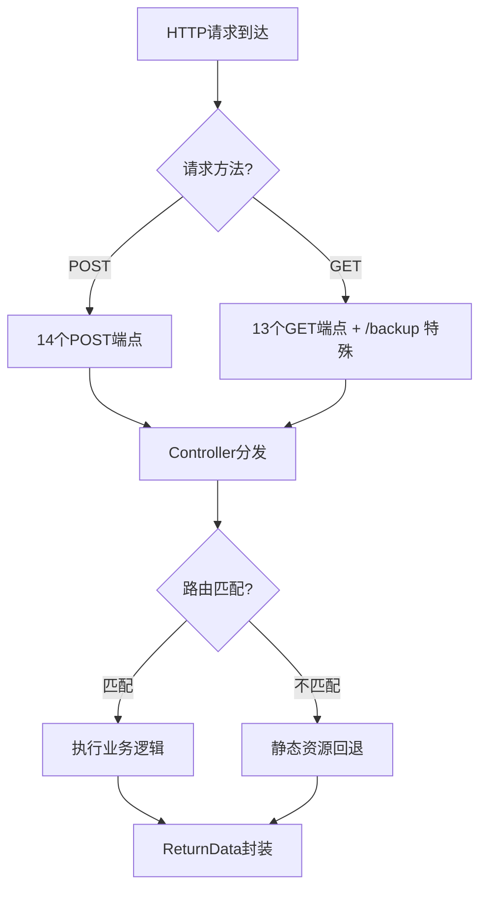
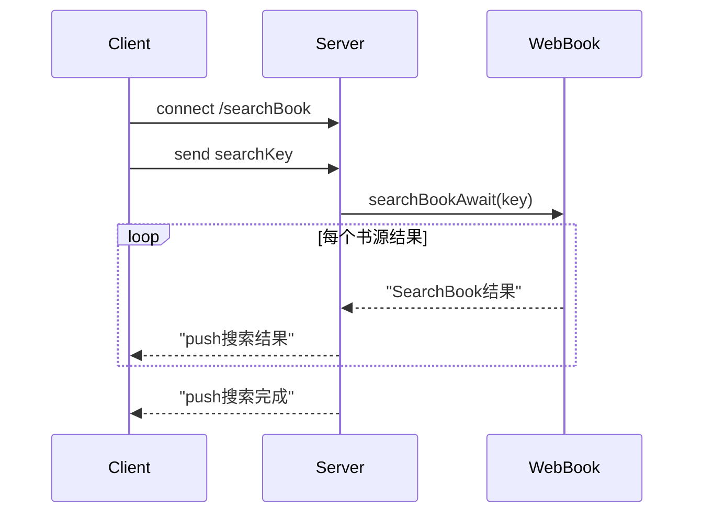
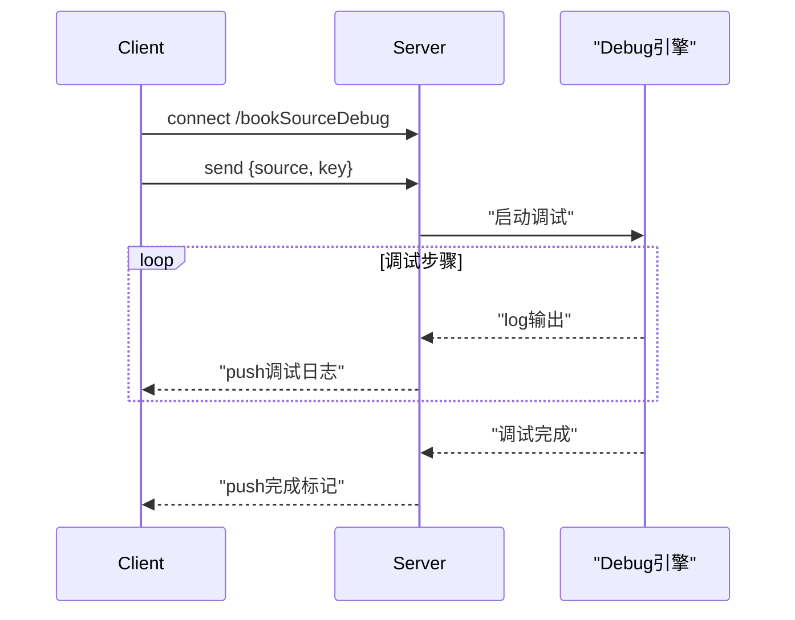

# Web 服务 — REST API 规范

> 由 [modules/web-service.md](web-service.md) 拆分（2026-08-30）。本文件为 Web 服务 **API 层**唯一权威源：HttpServer 路由分发、REST 端点、WebSocket 协议、ReturnData 响应格式、静态资源服务、Beacon API、Vue3 前端对照、Controller 实现细节。
> 服务生命周期（WebService/WebTileService/ReaderProvider/ShortCuts/WiFi 传书等）见 [web-service-lifecycle.md](web-service-lifecycle.md)；Python 重构参考见 [../python-ref/web-service.md](../python-ref/web-service.md)。
---
## 1. 服务概览

| 服务类型 | 端口 | 技术栈 | 用途 |
|---------|------|--------|------|
| HTTP Server | 1122（可配置） | NanoHTTPD | REST API + 静态文件 |
| WebSocket Server | 1123（HTTP端口+1） | NanoWSD | 搜索书源、调试书源/RSS |

### 静态文件服务

- URI 以 `/` 结尾时自动追加 `index.html`
- 从 APK assets 的 `web/` 目录提供前端静态页面
- 未匹配到 API 路由的请求统一由 `AssetsWeb` 处理

---

## 2. HttpServer 路由分发

[HttpServer.kt:22-146](file:///f:/myself/github/WeAgentChat/temp/legado/app/src/main/java/io/legado/app/web/HttpServer.kt#L22-L146)

### 2.1 路由机制

```
serve(session):
  1. 解析请求 URI 和方法
  2. OPTIONS → CORS 预检响应
  3. POST 路由匹配 (14个端点)
  4. GET 路由匹配 (12个端点)
  5. 未匹配 → 静态资源回退 (AssetsWeb)
```

### 2.2 CORS 全支持

[HttpServer.kt:39-46](file:///f:/myself/github/WeAgentChat/temp/legado/app/src/main/java/io/legado/app/web/HttpServer.kt#L39-L46)

```
OPTIONS 预检自动响应:
  Access-Control-Allow-Origin: 回显请求Origin
  Access-Control-Allow-Methods: GET, POST
  Access-Control-Allow-Headers: content-type
```

- CORS 的 `Origin` 设置为请求头中的 `origin` 值（动态来源）
- OPTIONS 预检请求返回空响应并设置 CORS 头

### 2.3 POST 路由（14个）

[HttpServer.kt:48-72](file:///f:/myself/github/WeAgentChat/temp/legado/app/src/main/java/io/legado/app/web/HttpServer.kt#L48-L72)

| # | 路由 | 控制器方法 | 参数 |
|---|------|-----------|------|
| 1 | `/saveBookSource` | `BookSourceController.saveSource(postData)` | `postData: String?`（JSON Body） |
| 2 | `/saveBookSources` | `BookSourceController.saveSources(postData)` | `postData: String?` |
| 3 | `/deleteBookSources` | `BookSourceController.deleteSources(postData)` | `postData: String?` |
| 4 | `/saveBook` | `BookController.saveBook(postData)` | `postData: String?` |
| 5 | `/deleteBook` | `BookController.deleteBook(postData)` | `postData: String?` |
| 6 | `/saveBookProgress` | `BookController.saveBookProgress(postData)` | `postData: String?` |
| 7 | `/addLocalBook` | `BookController.addLocalBook(parameters, files)` | `parameters` + `files`（文件上传） |
| 8 | `/saveReadConfig` | `BookController.saveWebReadConfig(postData)` | `postData: String?` |
| 9 | `/saveRssSource` | `RssSourceController.saveSource(postData)` | `postData: String?` |
| 10 | `/saveRssSources` | `RssSourceController.saveSources(postData)` | `postData: String?` |
| 11 | `/deleteRssSources` | `RssSourceController.deleteSources(postData)` | `postData: String?` |
| 12 | `/saveReplaceRule` | `ReplaceRuleController.saveRule(postData)` | `postData: String?` |
| 13 | `/deleteReplaceRule` | `ReplaceRuleController.delete(postData)` | `postData: String?` |
| 14 | `/testReplaceRule` | `ReplaceRuleController.testRule(postData)` | `postData: String?` |

所有 POST handler 在 `runBlocking` 协程作用域内执行。

### 2.4 GET 路由（13个 + `/backup` 特殊端点）

[HttpServer.kt:75-102](file:///f:/myself/github/WeAgentChat/temp/legado/app/src/main/java/io/legado/app/web/HttpServer.kt#L75-L102)

| # | 路由 | 控制器方法 | 查询参数 |
|---|------|-----------|----------|
| 1 | `/getBookSource` | `BookSourceController.getSource(parameters)` | `url` |
| 2 | `/getBookSources` | `BookSourceController.sources` | 无 |
| 3 | `/getBookshelf` | `BookController.bookshelf` | 无 |
| 4 | `/getChapterList` | `BookController.getChapterList(parameters)` | `url` |
| 5 | `/refreshToc` | `BookController.refreshToc(parameters)` | `url` |
| 6 | `/getBookContent` | `BookController.getBookContent(parameters)` | `url`, `index` |
| 7 | `/cover` | `BookController.getCover(parameters)` | `path`（封面路径） |
| 8 | `/image` | `BookController.getImg(parameters)` | `url`（bookUrl）, `path`（图片链接）, `width`（可选，默认640） |
| 9 | `/getReadConfig` | `BookController.getWebReadConfig()` | 无 |
| 10 | `/getRssSource` | `RssSourceController.getSource(parameters)` | `url` |
| 11 | `/getRssSources` | `RssSourceController.sources` | 无 |
| 12 | `/getReplaceRules` | `ReplaceRuleController.allRules` | 无 |
| 13 | `/backupPreview` | `BackupController.getBackupPreview()` | 无（F-P0-2 备份选择器） |

**`/backup` 特殊端点**（HttpServer.kt L78-84，F-P0-2）：GET `/backup` 在 when 分发之前单独处理，由 `BackupController.backup()` 直接返回 **ZIP 文件响应**（非 ReturnData JSON），并附带 CORS 头。

> 行数核验：2026-08-30 对照 `web/HttpServer.kt` 实际路由（POST 14 个、GET when 分支 13 个 + `/backup` 特殊处理）修正，原文档记载"GET 12 个"且缺失 `/backupPreview` 与 `/backup`。

### 2.5 静态资源回退

[HttpServer.kt:107-111](file:///f:/myself/github/WeAgentChat/temp/legado/app/src/main/java/io/legado/app/web/HttpServer.kt#L107-L111)

```
未匹配任何 API 路由的请求 → AssetsWeb.serveFile()
  - URI 以 / 结尾 → 自动追加 index.html
  - 从 APK assets/web/ 目录提供静态文件
  - MIME 类型根据文件扩展名自动识别
```

### 2.6 HTTP 路由流程图



---

## 3. 统一响应格式 — ReturnData

[ReturnData.kt](file:///f:/myself/github/WeAgentChat/temp/legado/app/src/main/java/io/legado/app/api/ReturnData.kt)

### ReturnData.kt 源码

```kotlin
class ReturnData {
    var isSuccess: Boolean = false      // 是否成功
    var errorMsg: String = "未知错误,请联系开发者!"  // 错误信息
    var data: Any? = null               // 响应数据

    fun setErrorMsg(errorMsg: String): ReturnData {
        this.isSuccess = false
        this.errorMsg = errorMsg
        return this
    }

    fun setData(data: Any): ReturnData {
        this.isSuccess = true
        this.errorMsg = ""
        this.data = data
        return this
    }
}
```

### 响应字段说明

| 字段 | 类型 | 说明 |
|------|------|------|
| `isSuccess` | boolean | `true` 表示成功，`false` 表示失败 |
| `errorMsg` | string | 成功时为空字符串 `""`，失败时为错误描述 |
| `data` | any | 成功时包含响应数据，类型取决于具体 API |

### 异常特殊情况

当服务器内部抛出异常时，直接返回 `e.message` 纯文本（非 JSON 格式），Content-Type 为 `text/plain`。

**响应 JSON 格式：**
```json
{
    "isSuccess": true,      // true=成功, false=失败
    "errorMsg": "",         // 成功时为空, 失败时为错误描述
    "data": ...             // 响应数据
}
```

---

## 4. REST API 端点详细规范

### 4.1 书籍相关

#### 4.1.1 获取书架

> 源码：[BookController.kt#L46-L64](file:///f:/myself/github/WeAgentChat/temp/legado/app/src/main/java/io/legado/app/api/controller/BookController.kt#L46-L64) — `bookshelf`

- **路径**：`GET /getBookshelf`
- **参数**：无
- **说明**：获取书架上的所有书籍，按书架排序规则排列

**请求示例**：

```
GET http://127.0.0.1:1122/getBookshelf
```

**响应示例**：

```json
{
    "isSuccess": true,
    "data": [
        {
            "bookUrl": "https://example.com/book/123",
            "tocUrl": "https://example.com/toc/123",
            "origin": "https://example.com",
            "originName": "示例书源",
            "name": "三体",
            "author": "刘慈欣",
            "kind": "科幻",
            "coverUrl": "https://example.com/cover.jpg",
            "intro": "文化大革命...",
            "type": 0,
            "group": 0,
            "latestChapterTitle": "死神永生",
            "latestChapterTime": 1700000000000,
            "totalChapterNum": 100,
            "durChapterTitle": "黑暗森林",
            "durChapterIndex": 50,
            "durChapterPos": 1200,
            "durChapterTime": 1700000000000,
            "wordCount": "100万",
            "canUpdate": true,
            "order": 0,
            "originOrder": 0,
            "variable": null,
            "readConfig": null,
            "syncTime": 0
        }
    ],
    "errorMsg": ""
}
```

**空书架响应**：

```json
{
    "isSuccess": false,
    "data": null,
    "errorMsg": "还没有添加小说"
}
```

---

#### 4.1.2 获取章节列表

> 源码：[BookController.kt#L159-L170](file:///f:/myself/github/WeAgentChat/temp/legado/app/src/main/java/io/legado/app/api/controller/BookController.kt#L159-L170) — `getChapterList()`

- **路径**：`GET /getChapterList`
- **参数**：

| 参数 | 类型 | 必需 | 说明 |
|------|------|------|------|
| `url` | string | ✅ | 书籍的 `bookUrl` |

- **说明**：获取指定书籍的章节列表。如果本地数据库无缓存，会自动调用 `refreshToc` 刷新目录。

**请求示例**：

```
GET http://127.0.0.1:1122/getChapterList?url=https://example.com/book/123
```

**响应示例**：

```json
{
    "isSuccess": true,
    "data": [
        {
            "url": "https://example.com/chapter/1",
            "title": "第一章",
            "isVolume": false,
            "baseUrl": "https://example.com",
            "bookUrl": "https://example.com/book/123",
            "index": 0,
            "isVip": false,
            "isPay": false,
            "resourceUrl": null,
            "tag": null,
            "wordCount": "5000",
            "variable": null,
            "imgUrl": null
        }
    ],
    "errorMsg": ""
}
```

**错误响应**：

```json
{
    "isSuccess": false,
    "data": null,
    "errorMsg": "参数url不能为空，请指定书籍地址"
}
```

---

#### 4.1.3 刷新目录

> 源码：[BookController.kt#L122-L154](file:///f:/myself/github/WeAgentChat/temp/legado/app/src/main/java/io/legado/app/api/controller/BookController.kt#L122-L154) — `refreshToc()`

- **路径**：`GET /refreshToc`
- **参数**：

| 参数 | 类型 | 必需 | 说明 |
|------|------|------|------|
| `url` | string | ✅ | 书籍的 `bookUrl` |

- **说明**：强制从网络或本地重新获取章节列表，更新数据库后返回。本地书籍调用 `LocalBook.getChapterList`，网络书籍调用 `WebBook.getChapterListAwait`。

---

#### 4.1.4 获取正文内容

> 源码：[BookController.kt#L175-L223](file:///f:/myself/github/WeAgentChat/temp/legado/app/src/main/java/io/legado/app/api/controller/BookController.kt#L175-L223) — `getBookContent()`

- **路径**：`GET /getBookContent`
- **参数**：

| 参数 | 类型 | 必需 | 说明 |
|------|------|------|------|
| `url` | string | ✅ | 书籍的 `bookUrl` |
| `index` | int | ✅ | 章节索引序号（从 0 开始） |

- **说明**：获取指定书籍指定章节的纯文本内容。优先从本地缓存读取，缓存不存在则从网络获取。返回的内容经过 `ContentProcessor` 处理，**不包含标题**（`includeTitle = false`）。

**请求示例**：

```
GET http://127.0.0.1:1122/getBookContent?url=https://example.com/book/123&index=0
```

**响应示例**：

```json
{
    "isSuccess": true,
    "data": "这是正文内容的第一行文字。\n这是第二行文字。",
    "errorMsg": ""
}
```

---

#### 4.1.5 获取封面图片

> 源码：[BookController.kt#L69-L94](file:///f:/myself/github/WeAgentChat/temp/legado/app/src/main/java/io/legado/app/api/controller/BookController.kt#L69-L94) — `getCover()`

- **路径**：`GET /cover`
- **参数**：

| 参数 | 类型 | 必需 | 说明 |
|------|------|------|------|
| `path` | string | ✅ | 封面路径（书籍封面 URL） |

- **说明**：返回 PNG 格式的封面图片（84x112 缩放，`centerCrop`）。响应 Content-Type 为 `image/png`，非 JSON 格式。封面加载失败时返回默认封面图片。

**请求示例**：

```
GET http://127.0.0.1:1122/cover?path=https://example.com/cover.jpg
```

**响应**：二进制 PNG 图片流（Content-Type: `image/png`）。

---

#### 4.1.6 获取正文图片

> 源码：[BookController.kt#L99-L117](file:///f:/myself/github/WeAgentChat/temp/legado/app/src/main/java/io/legado/app/api/controller/BookController.kt#L99-L117) — `getImg()`

- **路径**：`GET /image`
- **参数**：

| 参数 | 类型 | 必需 | 说明 |
|------|------|------|------|
| `url` | string | ✅ | 书籍的 `bookUrl`，用于查找书籍和书源 |
| `path` | string | ✅ | 图片链接（正文中的图片 URL） |
| `width` | int | ❌ | 图片宽度（默认 640px） |

- **说明**：获取书籍正文中的插图图片。通过 `ImageProvider` 缓存并处理图片，支持通过 `bookUrl` 关联书源的解密规则。

**请求示例**：

```
GET http://127.0.0.1:1122/image?url=https://example.com/book/123&path=https://example.com/img/001.jpg&width=640
```

**响应**：二进制图片流（Content-Type 由图片格式决定）。

---

#### 4.1.7 获取阅读配置

> 源码：[BookController.kt#L318-L323](file:///f:/myself/github/WeAgentChat/temp/legado/app/src/main/java/io/legado/app/api/controller/BookController.kt#L318-L323) — `getWebReadConfig()`

- **路径**：`GET /getReadConfig`
- **参数**：无
- **说明**：获取 Web 阅读界面的配置（存储于 `CacheManager` 中，非数据库持久化）。

**请求示例**：

```
GET http://127.0.0.1:1122/getReadConfig
```

**响应示例**：

```json
{
    "isSuccess": true,
    "data": "{\"fontSize\":18,\"lineHeight\":1.5,\"bgColor\":\"#FFFFFF\"}",
    "errorMsg": ""
}
```

> **注意**：`data` 字段为 JSON 字符串（String 类型），而非 JSON 对象。

---

#### 4.1.8 保存书籍

> 源码：[BookController.kt#L228-L236](file:///f:/myself/github/WeAgentChat/temp/legado/app/src/main/java/io/legado/app/api/controller/BookController.kt#L228-L236) — `saveBook()`

- **路径**：`POST /saveBook`
- **Content-Type**：`application/json`
- **参数**：Request Body 为 `Book` 对象的 JSON 字符串
- **说明**：添加或更新书籍到书架。使用 `bookUrl` 作为唯一键（若存在则更新，否则插入）。同时会将书籍进度同步到 WebDAV。

**请求示例**：

```json
POST http://127.0.0.1:1122/saveBook
Content-Type: application/json

{
    "bookUrl": "https://example.com/book/123",
    "name": "三体",
    "author": "刘慈欣",
    "origin": "https://example.com",
    "originName": "示例书源",
    "kind": "科幻",
    "coverUrl": "https://example.com/cover.jpg",
    "intro": "文化大革命...",
    "type": 0,
    "tocUrl": "",
    "durChapterIndex": 0,
    "durChapterPos": 0,
    "durChapterTime": 1700000000000,
    "totalChapterNum": 0,
    "latestChapterTitle": null,
    "latestChapterTime": 1700000000000,
    "canUpdate": true
}
```

**成功响应**：

```json
{
    "isSuccess": true,
    "data": "",
    "errorMsg": ""
}
```

**错误响应**：

```json
{
    "isSuccess": false,
    "data": null,
    "errorMsg": "格式不对"
}
```

---

#### 4.1.9 删除书籍

> 源码：[BookController.kt#L241-L248](file:///f:/myself/github/WeAgentChat/temp/legado/app/src/main/java/io/legado/app/api/controller/BookController.kt#L241-L248) — `deleteBook()`

- **路径**：`POST /deleteBook`
- **Content-Type**：`application/json`
- **参数**：Request Body 为 `Book` 对象的 JSON 字符串
- **说明**：从书架上删除书籍。如果该书籍正在阅读中，会清空 `ReadBook.book` 引用。

**请求示例**：

```json
POST http://127.0.0.1:1122/deleteBook
Content-Type: application/json

{
    "bookUrl": "https://example.com/book/123"
}
```

---

#### 4.1.10 保存书籍进度

> 源码：[BookController.kt#L253-L278](file:///f:/myself/github/WeAgentChat/temp/legado/app/src/main/java/io/legado/app/api/controller/BookController.kt#L253-L278) — `saveBookProgress()`

- **路径**：`POST /saveBookProgress`
- **Content-Type**：`application/json`
- **参数**：Request Body 为 `BookProgress` 对象的 JSON 字符串

**BookProgress 数据结构**：

| 字段 | 类型 | 说明 |
|------|------|------|
| `name` | string | 书籍名称 |
| `author` | string | 作者名称 |
| `durChapterIndex` | int | 当前章节索引 |
| `durChapterPos` | int | 当前阅读进度位置 |
| `durChapterTime` | long | 阅读时间戳 |
| `durChapterTitle` | string? | 当前章节标题 |

**请求示例**：

```json
POST http://127.0.0.1:1122/saveBookProgress
Content-Type: application/json

{
    "name": "三体",
    "author": "刘慈欣",
    "durChapterIndex": 50,
    "durChapterPos": 1200,
    "durChapterTime": 1700000000000,
    "durChapterTitle": "黑暗森林"
}
```

---

#### 4.1.11 保存阅读配置

> 源码：[BookController.kt#L307-L313](file:///f:/myself/github/WeAgentChat/temp/legado/app/src/main/java/io/legado/app/api/controller/BookController.kt#L307-L313) — `saveWebReadConfig()`

- **路径**：`POST /saveReadConfig`
- **Content-Type**：`application/json`
- **参数**：Request Body 为任意 JSON 字符串（无固定 Schema，完全由前端定义）
- **说明**：保存 Web 阅读界面的配置到 `CacheManager`。传递空 body 时删除配置。

**请求示例**：

```json
POST http://127.0.0.1:1122/saveReadConfig
Content-Type: application/json

{
    "fontSize": 18,
    "lineHeight": 1.5,
    "bgColor": "#F5F5DC"
}
```

---

#### 4.1.12 添加本地书籍

> 源码：[BookController.kt#L283-L302](file:///f:/myself/github/WeAgentChat/temp/legado/app/src/main/java/io/legado/app/api/controller/BookController.kt#L283-L302) — `addLocalBook()`

- **路径**：`POST /addLocalBook`
- **Content-Type**：`multipart/form-data`
- **参数**：

| 参数 | 类型 | 必需 | 说明 |
|------|------|------|------|
| `fileName` | string | ✅ | 文件名（包含扩展名，如 `三体.txt`） |
| `fileData` | file | ✅ | 文件二进制数据 |

- **说明**：上传本地书籍文件（支持 txt、epub 等格式）。文件通过 `LocalBook.saveBookFile()` 保存到书籍目录，然后通过 `LocalBook.importFile()` 导入。

**请求示例**：

```
POST http://127.0.0.1:1122/addLocalBook
Content-Type: multipart/form-data

fileName: 三体.txt
fileData: (binary file content)
```

---

### 4.2 书源相关

#### 4.2.1 获取单个书源

> 源码：[BookSourceController.kt#L59-L68](file:///f:/myself/github/WeAgentChat/temp/legado/app/src/main/java/io/legado/app/api/controller/BookSourceController.kt#L59-L68) — `getSource()`

- **路径**：`GET /getBookSource`
- **参数**：

| 参数 | 类型 | 必需 | 说明 |
|------|------|------|------|
| `url` | string | ✅ | 书源的 `bookSourceUrl` |

**请求示例**：

```
GET http://127.0.0.1:1122/getBookSource?url=https://example.com/bookSource
```

**响应示例**：

```json
{
    "isSuccess": true,
    "data": {
        "bookSourceUrl": "https://example.com/bookSource",
        "bookSourceName": "示例书源",
        "bookSourceGroup": "精选,小说",
        "bookSourceType": 0,
        "bookUrlPattern": null,
        "customOrder": 0,
        "enabled": true,
        "enabledExplore": true,
        "enabledCookieJar": true,
        "concurrentRate": null,
        "header": null,
        "loginUrl": null,
        "loginUi": null,
        "loginCheckJs": null,
        "coverDecodeJs": null,
        "bookSourceComment": "测试用书源",
        "lastUpdateTime": 1700000000000,
        "respondTime": 180000,
        "weight": 0,
        "exploreUrl": null,
        "searchUrl": null,
        "ruleSearch": null,
        "ruleBookInfo": null,
        "ruleToc": null,
        "ruleContent": null
    },
    "errorMsg": ""
}
```

---

#### 4.2.2 获取所有书源

> 源码：[BookSourceController.kt#L15-L22](file:///f:/myself/github/WeAgentChat/temp/legado/app/src/main/java/io/legado/app/api/controller/BookSourceController.kt#L15-L22) — `sources`

- **路径**：`GET /getBookSources`
- **参数**：无

**空列表响应**：

```json
{
    "isSuccess": false,
    "data": null,
    "errorMsg": "设备源列表为空"
}
```

---

#### 4.2.3 保存单个书源

> 源码：[BookSourceController.kt#L24-L39](file:///f:/myself/github/WeAgentChat/temp/legado/app/src/main/java/io/legado/app/api/controller/BookSourceController.kt#L24-L39) — `saveSource()`

- **路径**：`POST /saveBookSource`
- **Content-Type**：`application/json`
- **参数**：Request Body 为 `BookSource` 对象的 JSON 字符串

**请求示例**：

```json
POST http://127.0.0.1:1122/saveBookSource
Content-Type: application/json

{
    "bookSourceUrl": "https://example.com/bookSource",
    "bookSourceName": "示例书源",
    "bookSourceGroup": "精选",
    "bookSourceType": 0,
    "enabled": true,
    "enabledExplore": true,
    "searchUrl": "https://example.com/search?key={{key}}",
    "ruleSearch": {
        "bookList": ".result-list>div",
        "name": "a.title@text",
        "author": "a.author@text",
        "kind": "span.type@text",
        "coverUrl": "img@src",
        "bookUrl": "a@href"
    }
}
```

> **校验规则**：`bookSourceName` 和 `bookSourceUrl` 均不能为空。

---

#### 4.2.4 批量保存书源

> 源码：[BookSourceController.kt#L41-L57](file:///f:/myself/github/WeAgentChat/temp/legado/app/src/main/java/io/legado/app/api/controller/BookSourceController.kt#L41-L57) — `saveSources()`

- **路径**：`POST /saveBookSources`
- **Content-Type**：`application/json`
- **参数**：Request Body 为 `BookSource` 对象的 JSON **数组**
- **说明**：批量导入书源。跳过名称或 URL 为空的无效条目。

**请求示例**：

```json
POST http://127.0.0.1:1122/saveBookSources
Content-Type: application/json

[
    {
        "bookSourceUrl": "https://source1.com",
        "bookSourceName": "书源1",
        "enabled": true
    },
    {
        "bookSourceUrl": "https://source2.com",
        "bookSourceName": "书源2",
        "enabled": true
    }
]
```

---

#### 4.2.5 批量删除书源

> 源码：[BookSourceController.kt#L70-L79](file:///f:/myself/github/WeAgentChat/temp/legado/app/src/main/java/io/legado/app/api/controller/BookSourceController.kt#L70-L79) — `deleteSources()`

- **路径**：`POST /deleteBookSources`
- **Content-Type**：`application/json`
- **参数**：Request Body 为 `BookSource` 对象的 JSON **数组**
- **说明**：通过 `SourceHelp.deleteBookSources()` 批量删除书源。

**请求示例**：

```json
POST http://127.0.0.1:1122/deleteBookSources
Content-Type: application/json

[
    { "bookSourceUrl": "https://source1.com" },
    { "bookSourceUrl": "https://source2.com" }
]
```

---

### 4.3 RSS 相关

#### 4.3.1 获取单个 RSS 源

> 源码：[RssSourceController.kt#L57-L66](file:///f:/myself/github/WeAgentChat/temp/legado/app/src/main/java/io/legado/app/api/controller/RssSourceController.kt#L57-L66) — `getSource()`

- **路径**：`GET /getRssSource`
- **参数**：

| 参数 | 类型 | 必需 | 说明 |
|------|------|------|------|
| `url` | string | ✅ | RSS 源的 `sourceUrl` |

**请求示例**：

```
GET http://127.0.0.1:1122/getRssSource?url=https://example.com/rss
```

---

#### 4.3.2 获取所有 RSS 源

- **路径**：`GET /getRssSources`
- **参数**：无

---

#### 4.3.3 保存单个 RSS 源

- **路径**：`POST /saveRssSource`
- **Content-Type**：`application/json`
- **参数**：Request Body 为 `RssSource` 对象的 JSON 字符串

**请求示例**：

```json
POST http://127.0.0.1:1122/saveRssSource
Content-Type: application/json

{
    "sourceUrl": "https://example.com/rss",
    "sourceName": "示例RSS源",
    "sourceGroup": "新闻",
    "enabled": true,
    "sortUrl": "https://example.com/rss?page={{page}}",
    "ruleArticles": "item",
    "ruleTitle": "title@text",
    "ruleLink": "link@text",
    "rulePubDate": "pubDate@text"
}
```

> **校验规则**：`sourceName` 和 `sourceUrl` 均不能为空。

---

#### 4.3.4 批量保存 RSS 源

- **路径**：`POST /saveRssSources`
- **Content-Type**：`application/json`
- **参数**：Request Body 为 `RssSource` 对象的 JSON **数组**

---

#### 4.3.5 批量删除 RSS 源

- **路径**：`POST /deleteRssSources`
- **Content-Type**：`application/json`
- **参数**：Request Body 为 `RssSource` 对象的 JSON **数组**

---

### 4.4 替换规则相关

#### 4.4.1 获取所有替换规则

> 源码：[ReplaceRuleController.kt#L13-L19](file:///f:/myself/github/WeAgentChat/temp/legado/app/src/main/java/io/legado/app/api/controller/ReplaceRuleController.kt#L13-L19) — `allRules`

- **路径**：`GET /getReplaceRules`
- **参数**：无
- **说明**：返回所有替换规则。注意：`data` 字段为 JSON **字符串**（GSON 序列化后的规则数组），而非直接数组。

**响应示例**：

```json
{
    "isSuccess": true,
    "data": "[{\"id\":123,\"name\":\"去除广告\",\"group\":\"净化\",\"pattern\":\"<广告>.*?</广告>\",\"replacement\":\"\",\"isRegex\":true,\"isEnabled\":true,\"scope\":\"正文\",\"scopeTitle\":false,\"scopeContent\":true,\"timeoutMillisecond\":3000,\"order\":1}]",
    "errorMsg": ""
}
```

---

#### 4.4.2 保存替换规则

> 源码：[ReplaceRuleController.kt#L22-L35](file:///f:/myself/github/WeAgentChat/temp/legado/app/src/main/java/io/legado/app/api/controller/ReplaceRuleController.kt#L22-L35) — `saveRule()`

- **路径**：`POST /saveReplaceRule`
- **Content-Type**：`application/json`
- **参数**：Request Body 为 `ReplaceRule` 对象的 JSON 字符串

**ReplaceRule 数据结构**：

| 字段 | 类型 | 必需 | 默认值 | 说明 |
|------|------|------|--------|------|
| `id` | long | ❌ | `System.currentTimeMillis()` | 规则 ID，自动生成 |
| `name` | string | ❌ | `""` | 规则名称 |
| `group` | string? | ❌ | null | 分组名称 |
| `pattern` | string | ❌ | `""` | 替换内容（正则或普通文本） |
| `replacement` | string | ❌ | `""` | 替换为 |
| `isRegex` | boolean | ❌ | `true` | 是否启用正则 |
| `isEnabled` | boolean | ❌ | `true` | 是否启用 |
| `scope` | string? | ❌ | null | 作用范围（书名筛选） |
| `scopeTitle` | boolean | ❌ | `false` | 作用于标题 |
| `scopeContent` | boolean | ❌ | `true` | 作用于正文 |
| `excludeScope` | string? | ❌ | null | 排除范围 |
| `timeoutMillisecond` | long | ❌ | `3000` | 正则替换超时时间（毫秒） |
| `order` | int | ❌ | `Int.MIN_VALUE` | 排序序号 |

---

#### 4.4.3 删除替换规则

- **路径**：`POST /deleteReplaceRule`
- **Content-Type**：`application/json`
- **参数**：Request Body 为 `ReplaceRule` 对象的 JSON 字符串（只需包含 `id` 字段）

**请求示例**：

```json
POST http://127.0.0.1:1122/deleteReplaceRule
Content-Type: application/json

{
    "id": 1234567890
}
```

---

#### 4.4.4 测试替换规则

> 源码：[ReplaceRuleController.kt#L57-L96](file:///f:/myself/github/WeAgentChat/temp/legado/app/src/main/java/io/legado/app/api/controller/ReplaceRuleController.kt#L57-L96) — `testRule()`

- **路径**：`POST /testReplaceRule`
- **Content-Type**：`application/json`
- **参数**：Request Body 格式为 `{"rule": ReplaceRule, "text": "待替换的文本"}`
- **说明**：测试替换规则的效果。如果 `isRegex=true`，使用正则替换并带超时控制；否则使用普通字符串替换。

**请求示例**：

```json
POST http://127.0.0.1:1122/testReplaceRule
Content-Type: application/json

{
    "rule": {
        "pattern": "广告",
        "replacement": "",
        "isRegex": false
    },
    "text": "这里是广告内容，需要去除广告"
}
```

**响应示例**：

```json
{
    "isSuccess": true,
    "data": "这里是内容，需要去除",
    "errorMsg": ""
}
```

---

## 5. WebSocket 协议完整规范

[WebSocketServer.kt](file:///f:/myself/github/WeAgentChat/temp/legado/app/src/main/java/io/legado/app/web/WebSocketServer.kt) — 端口=HTTP端口+1（默认1123）

| WS 路径 | WebSocket 类 | 用途 |
|---------|-------------|------|
| `/searchBook` | `BookSearchWebSocket` | 书籍搜索 |
| `/bookSourceDebug` | `BookSourceDebugWebSocket` | 书源规则调试 |
| `/rssSourceDebug` | `RssSourceDebugWebSocket` | RSS源规则调试 |

### 通用行为

- **心跳 Ping**：服务端每 30 秒发送一次 ping 帧
- **连接超时**：30 秒无通信超时
- **编码**：所有消息为 UTF-8 文本帧

### 5.1 搜索 WebSocket — `/searchBook`

> 源码：[BookSearchWebSocket.kt](file:///f:/myself/github/WeAgentChat/temp/legado/app/src/main/java/io/legado/app/web/socket/BookSearchWebSocket.kt)

#### 搜索时序图



#### 协议流程

```
客户端 → 服务端     : 发送搜索关键词 JSON
服务端 → 客户端     : 每批结果到达时发送 JSON 数组
服务端 → 客户端     : 搜索完成后关闭连接（NormalClosure, "Search finish"）
```

#### 客户端 → 服务端消息

```json
{
    "key": "三体"
}
```

#### 服务端 → 客户端消息

每次有搜索结果到达时，以 JSON 数组形式发送：

```json
[
    {
        "bookUrl": "https://source1.com/book/123",
        "origin": "https://source1.com",
        "originName": "书源1",
        "type": 0,
        "name": "三体",
        "author": "刘慈欣",
        "kind": "科幻",
        "coverUrl": "https://source1.com/cover.jpg",
        "intro": "文化大革命...",
        "wordCount": "100万",
        "latestChapterTitle": "死神永生",
        "tocUrl": "https://source1.com/toc/123",
        "time": 1700000000000,
        "variable": null,
        "originOrder": 0,
        "respondTime": 500
    }
]
```

#### 搜索完成

搜索完成后，服务端以 `NormalClosure`（1000）关闭连接，关闭原因为 `"Search finish"`。

#### 错误处理

- 收到非 JSON 消息 → 发送 `"数据必须为Json格式"` → 关闭连接
- `key` 为空 → 发送 `"不能为空"` → 关闭连接

#### 搜索取消

`onSearchCancel` 被调用时，以 `NormalClosure` 和异常信息作为关闭原因关闭连接。

---

### 5.2 书源调试 WebSocket — `/bookSourceDebug`

> 源码：[BookSourceDebugWebSocket.kt](file:///f:/myself/github/WeAgentChat/temp/legado/app/src/main/java/io/legado/app/web/socket/BookSourceDebugWebSocket.kt)

#### 调试时序图



#### 协议流程

```
客户端 → 服务端     : 发送调试请求 JSON
服务端 → 客户端     : 逐行发送调试日志文本
服务端 → 客户端     : state == -1 或 state == 1000 时关闭连接
```

#### 客户端 → 服务端消息

```json
{
    "tag": "https://example.com/bookSource",
    "key": "三体"
}
```

**参数说明**：

| 字段 | 说明 |
|------|------|
| `tag` | 书源 URL（`bookSourceUrl`），用于从数据库查找书源 |
| `key` | 调试关键词，根据前缀不同执行不同调试流程 |

**key 前缀行为**（参见 [Debug.kt](file:///f:/myself/github/WeAgentChat/temp/legado/app/src/main/java/io/legado/app/model/Debug.kt#L230-L274)）：

| key 格式 | 行为 |
|----------|------|
| 普通文本（如 `"三体"`） | 搜索调试 |
| 绝对 URL（如 `"https://..."`） | 详情页调试 |
| 含 `::` 的字符串（如 `"分类名::https://..."`） | 发现页调试 |
| 以 `++` 开头（如 `"++https://..."`） | 目录页调试 |
| 以 `--` 开头（如 `"--https://..."`） | 正文页调试 |

#### 服务端 → 客户端消息

逐行发送纯文本调试日志。日志格式示例：

```
[mm:ss.SSS] 开始搜索...
[mm:ss.SSS] 搜索URL: https://example.com/search?key=三体
[mm:ss.SSS] ≡获取成功:https://example.com/book/123
[mm:ss.SSS] ┌获取正文内容
[mm:ss.SSS] └
[mm:ss.SSS] 内容...
[mm:ss.SSS] 第2页完成
[mm:ss.SSS] ◇本章总页数:3
[mm:ss.SSS] 搜索完成
```

#### 特殊状态码

| state 值 | 含义 |
|----------|------|
| `-1` | 调试出错，关闭连接 |
| `1000` | 调试正常完成，关闭连接 |
| `10, 20, 30, 40` | 不发送给客户端（内部状态） |

#### 调试结束

当 `printLog` 接收到的 `state == -1` 或 `state == 1000` 时：
1. 调用 `Debug.cancelDebug(true)` 清理调试状态
2. 以 `NormalClosure` 关闭连接，关闭原因为 `"调试结束"`

#### 单例管理

Debug 对象是单例的。生命周期管理：

- `Debug.callback = this` — 设置 WebSocket 实例为当前调试回调
- `Debug.startDebug(this, it, key)` — 开始调试
- `Debug.cancelDebug(true)` — 取消调试并清除回调

---

### 5.3 RSS 源调试 WebSocket — `/rssSourceDebug`

> 源码：[RssSourceDebugWebSocket.kt](file:///f:/myself/github/WeAgentChat/temp/legado/app/src/main/java/io/legado/app/web/socket/RssSourceDebugWebSocket.kt)

#### 协议流程

与书源调试基本一致，但调试对象为 RSS 源。

#### 客户端 → 服务端消息

```json
{
    "tag": "https://example.com/rss"
}
```

> **注意**：RSS 源调试**不需要** `key` 字段，直接对源全文解析。与书源调试不同，RSS 调试的 `Debug.startDebug(this, it)` 只接收 `RssSource` 参数，无 `key`。

#### 服务端 → 客户端消息

调试日志示例：

```
[mm:ss.SSS] ︾开始解析
[mm:ss.SSS] ⇒列表页解析成功，不为空
[mm:ss.SSS] ︽列表页解析完成
[mm:ss.SSS] ︾开始解析内容页
[mm:ss.SSS] (文章内容)
[mm:ss.SSS] ︽内容页解析完成
```

#### 特殊日志前缀符号

| 符号 | 含义 |
|------|------|
| `︾` | 开始某一阶段解析 |
| `︽` | 完成某一阶段解析 |
| `⇒` | 信息提示/状态更新 |
| `≡` | 跳过了某一步骤 |

---

## 6. HTTP 服务器配置

### 端口配置

| 配置项 | 默认值 | 说明 |
|--------|--------|------|
| `webPort`（PreferKey） | `1122` | HTTP 服务端口，有效范围 `1024~65530` |
| WebSocket 端口 | HTTP端口 + 1 | 自动计算，不可独立配置 |

### CORS 配置

```
Access-Control-Allow-Origin: <请求来源>
Access-Control-Allow-Methods: GET, POST
Access-Control-Allow-Headers: content-type
```

- CORS 的 `Origin` 设置为请求头中的 `origin` 值（动态来源）
- OPTIONS 预检请求返回空响应并设置 CORS 头

### 静态文件

- 根目录：assets 中的 `web/` 目录
- URI 以 `/` 结尾时自动返回 `index.html`
- 未匹配 API 的请求回退到静态文件服务

---

## 7. 大数据流式响应

[HttpServer.kt:117-128](file:///f:/myself/github/WeAgentChat/temp/legado/app/src/main/java/io/legado/app/web/HttpServer.kt#L117-L128)

```
当响应数据 > 3000 条时:
  - 使用 NanoHTTPD ChunkedTransfer 或 Pipe 分块传输
  - 减少内存峰值
  - 渐进式渲染
```

---

## 8. 控制器清单

当前实际控制器（4个）：

| 控制器 | 文件 | 类定义行 | 核心方法 |
|--------|------|----------|----------|
| BookController | [BookController.kt](file:///f:/myself/github/WeAgentChat/temp/legado/app/src/main/java/io/legado/app/api/controller/BookController.kt) | L36 | bookshelf:46, getChapterList:159, getBookContent:175, saveBook:228, saveBookProgress:253, addLocalBook:283, refreshToc:122, getCover:69, getImg:99, getWebReadConfig:318, saveWebReadConfig:307, deleteBook:241 |
| BookSourceController | [BookSourceController.kt](file:///f:/myself/github/WeAgentChat/temp/legado/app/src/main/java/io/legado/app/api/controller/BookSourceController.kt) | L13 | sources:15, getSource:59, saveSource:24, saveSources:41, deleteSources:70 |
| RssSourceController | [RssSourceController.kt](file:///f:/myself/github/WeAgentChat/temp/legado/app/src/main/java/io/legado/app/api/controller/RssSourceController.kt) | L13 | sources:15, getSource:57, saveSource:24, saveSources:40, deleteSources:68 |
| ReplaceRuleController | [ReplaceRuleController.kt](file:///f:/myself/github/WeAgentChat/temp/legado/app/src/main/java/io/legado/app/api/controller/ReplaceRuleController.kt) | L11 | allRules:13, saveRule:22, delete:38, testRule:57 |

---

## 9. 错误处理

### 异常处理流程

```
请求 → try 块 → 成功 → 返回 JSON
                ↓
              catch (Exception) → 返回 e.message 纯文本
```

### 日志记录

每条请求记录日志：

```
${METHOD} - ${URI} - ${QueryParams} - Start($timestamp)
${METHOD} - ${URI} - ${QueryParams} - End($timestamp)        // 成功
${METHOD} - ${URI} - ${QueryParams} - Error End($timestamp)   // 失败
```

日志使用 `LogUtils.d(TAG)` 输出，TAG 为 `"HttpServer"`。

### 特殊响应类型

| 条件 | Content-Type | 说明 |
|------|-------------|------|
| `data is Bitmap` | `image/png` | 封面/图片响应 |
| `data is List && size > 3000` | `application/json`（chunked） | 大数据量流式响应 |
| 其他正常响应 | `application/json` | 标准 JSON 响应 |
| 异常响应 | `text/plain` | 纯文本错误消息 |

---

## 10. Vue3 前端对照（集成 × 架构 × 基础设施）

> 原 §10 / §21 / §28 三处 Vue3 前端内容集中合并（2026-08-30 拆分），本章为 Vue3 前端与 Web 服务对照的唯一权威源。前端源码：[modules/web/](file:///f:/myself/github/WeAgentChat/temp/legado/modules/web/)（Vue3 + Vite）。

### 10.1 集成总览与构建流程
```
前端源码: modules/web/src/ (Vue3 + Vite)
构建产物: app/src/main/assets/web/

构建流程:
  1. cd modules/web && npm install
  2. npm run build  (vite build)
  3. scripts/sync.js → 自动同步到 assets/web/
  4. ./gradlew assembleDebug → 打包进 APK

运行时:
  HttpServer 从 assets/web/ 读取静态文件
  使用 Vue History 模式，所有非 API 请求回退到 index.html
```
### 10.2 技术栈
| 维度 | 技术 |
|------|------|
| 框架 | Vue 3 + TypeScript |
| 构建 | Vite |
| UI 库 | Element Plus |
| 状态管理 | Pinia |
| HTTP 客户端 | Axios |
| 路由 | Vue Router (hash 模式) |
### 10.3 API 层架构
[api.ts](file:///f:/myself/github/WeAgentChat/temp/legado/modules/web/src/api/api.ts)

```typescript
// 入口点配置
setApiEntryPoint(http_url, webSocket_url)
  → legado_http_entry_point = new URL(http_url).toString()
  → legado_webSocket_entry_point = new URL(webSocket_url).toString()
  → ajax.defaults.baseURL = legado_http_entry_point
```
### 10.4 API 函数映射表
| 前端函数 | HTTP 方法 | 后端端点 | 说明 |
|---------|----------|---------|------|
| `getReadConfig()` | GET | `/getReadConfig` | 获取 Web 阅读配置 |
| `saveReadConfig(config)` | POST | `/saveReadConfig` | 保存 Web 阅读配置 |
| `saveBookProgress(progress)` | POST | `/saveBookProgress` | 保存阅读进度（已废弃） |
| `saveBookProgressWithBeacon(progress)` | BEACON | `/saveBookProgress` | 可靠保存阅读进度 |
| `getBookShelf()` | GET | `/getBookshelf` | 获取书架 |
| `getChapterList(url)` | GET | `/getChapterList?url=` | 获取章节列表 |
| `getBookContent(url, index)` | GET | `/getBookContent?url=&index=` | 获取正文内容 |
| `search(key, onReceive, onFinish)` | WS | `/searchBook` | WebSocket 搜索 |
| `saveBook(book)` | POST | `/saveBook` | 保存书籍 |
| `deleteBook(book)` | POST | `/deleteBook` | 删除书籍 |
| `getSources()` | GET | `/getBookSources` 或 `/getRssSources` | 获取源列表 |
| `saveSource(data)` | POST | `/saveBookSource` 或 `/saveRssSource` | 保存单个源 |
| `saveSources(data)` | POST | `/saveBookSources` 或 `/saveRssSources` | 批量保存源 |
| `deleteSource(data)` | POST | `/deleteBookSources` 或 `/deleteRssSources` | 批量删除源 |
| `debug(sourceUrl, key, onReceive, onFinish)` | WS | `/bookSourceDebug` 或 `/rssSourceDebug` | WebSocket 调试 |
| `getProxyCoverUrl(coverUrl)` | - | `/cover?path=` | 封面代理 URL |
| `getProxyImageUrl(bookUrl, src, width)` | - | `/image?path=&url=&width=` | 图片代理 URL |
### 10.5 源类型自动判断
```typescript
const isBookSource = /bookSource/i.test(location.href)
```

- 根据 URL 中是否包含 `bookSource` 自动判断当前是书源还是 RSS 源模式
- 影响 `getSources`/`saveSource`/`saveSources`/`deleteSource`/`debug` 的端点选择
### 10.6 Axios 实例配置

[axios.ts](file:///f:/myself/github/WeAgentChat/temp/legado/modules/web/src/api/axios.ts)

```typescript
const ajax = axios.create({
  baseURL:
    import.meta.env.VITE_API ||                    // 1. 环境变量
    localStorage.getItem('remoteUrl') ||            // 2. localStorage 自定义地址
    location.origin,                                // 3. 当前页面 origin
  timeout: 120 * 1000,                             // 120秒超时
})
```
### 10.7 URL 自动推导

[index.ts](file:///f:/myself/github/WeAgentChat/temp/legado/modules/web/src/api/index.ts)

```typescript
parseLeagdoHttpUrlWithDefault(http_url):
  1. 验证 http_url 是否合法
  2. 合法则使用，否则回退到 location.origin
  3. WebSocket 端口 = HTTP 端口 + 1
  4. 无显式端口时：HTTP 默认 80 → WS 81，HTTPS 默认 443 → WSS 444
  5. 协议推导：https → wss，http → ws
```

| HTTP 协议 | HTTP 默认端口 | WS 协议 | WS 默认端口 |
|-----------|-------------|---------|------------|
| http | 80 | ws | 81 |
| https | 443 | wss | 444 |
### 10.8 响应拦截器

```typescript
// 成功响应 → 检查 ReturnData 格式
responseCheckInterceptor:
  1. 检查 resp.data 是否包含 isSuccess/errorMsg 字段
  2. isSuccess=true 时检查是否包含 data 字段
  3. 格式错误 → ElMessage.warning("后端返回内容格式错误")
  4. 格式正确 → connectionStore.setConnectType('primary')

// 错误响应 → 连接失败
axiosErrorInterceptor:
  1. ElMessage.error("后端连接失败，请检查阅读WEB服务或者设置其它可用链接")
  2. connectionStore.setConnectType('danger')
### 10.9 前端 Store 层

| Store | 文件 | 核心职责 |
|-------|------|---------|
| **connectionStore** | `store/connectionStore.ts` | 连接状态管理（primary/danger）、状态文本显示 |
| **bookStore** | `store/bookStore.ts` | 书架/目录/阅读状态、缓存策略、进度保存 |
### 10.10 前端路由定义

| 路由路径 | 组件 | 说明 |
|---------|------|------|
| `/` | BookShelf | 书架页面 |
| `/chapter` | BookChapter | 阅读页面 |
| `/bookSource` | SourceEditor | 书源编辑器 |
| `/rssSource` | SourceEditor | RSS源编辑器 |

- 路由模式：hash（`#/bookSource`）
### 10.11 前端组件清单

| 组件 | 功能 |
|------|------|
| `BookShelf.vue` | 书架页面主组件 |
| `BookChapter.vue` | 阅读页面主组件 |
| `SourceEditor.vue` | 源编辑器页面主组件 |
| `BookItems.vue` | 书架书籍列表项 |
| `ChapterContent.vue` | 章节正文渲染 |
| `CatalogItem.vue` | 目录列表项 |
| `PopCatalog.vue` | 目录弹窗 |
| `ReadSettings.vue` | 阅读设置面板 |
| `ToolBar.vue` | 工具栏 |
| `SourceList.vue` | 源列表 |
| `SourceItem.vue` | 源列表项 |
| `SourceTabTools.vue` | 源编辑标签工具 |
| `SourceTabForm.vue` | 源编辑表单 |
| `SourceJson.vue` | 源 JSON 编辑器 |
| `SourceHelp.vue` | 源帮助文档 |
| `SourceDebug.vue` | 源调试面板（WebSocket） |
| `App.vue` | 根组件 |

---

## 11. 相关代码锚点

| 功能 | 文件 | 行号 |
|------|------|------|
| HttpServer 类定义 | [HttpServer.kt](file:///f:/myself/github/WeAgentChat/temp/legado/app/src/main/java/io/legado/app/web/HttpServer.kt) | L22 |
| serve() 路由分发 | [HttpServer.kt](file:///f:/myself/github/WeAgentChat/temp/legado/app/src/main/java/io/legado/app/web/HttpServer.kt) | L26-156 |
| CORS OPTIONS | [HttpServer.kt](file:///f:/myself/github/WeAgentChat/temp/legado/app/src/main/java/io/legado/app/web/HttpServer.kt) | L40-47 |
| POST 路由 | [HttpServer.kt](file:///f:/myself/github/WeAgentChat/temp/legado/app/src/main/java/io/legado/app/web/HttpServer.kt) | L49-73 |
| GET 路由 | [HttpServer.kt](file:///f:/myself/github/WeAgentChat/temp/legado/app/src/main/java/io/legado/app/web/HttpServer.kt) | L75-102 |
| /backup 特殊端点 | [HttpServer.kt](file:///f:/myself/github/WeAgentChat/temp/legado/app/src/main/java/io/legado/app/web/HttpServer.kt) | L78-84 |
| 静态资源回退 | [HttpServer.kt](file:///f:/myself/github/WeAgentChat/temp/legado/app/src/main/java/io/legado/app/web/HttpServer.kt) | L107-111 |
| Bitmap/流式响应 | [HttpServer.kt](file:///f:/myself/github/WeAgentChat/temp/legado/app/src/main/java/io/legado/app/web/HttpServer.kt) | L113-142 |
| ReturnData | [ReturnData.kt](file:///f:/myself/github/WeAgentChat/temp/legado/app/src/main/java/io/legado/app/api/ReturnData.kt) | L1 |
| BookController | [BookController.kt](file:///f:/myself/github/WeAgentChat/temp/legado/app/src/main/java/io/legado/app/api/controller/BookController.kt) | L36 |
| WebSocketServer | [WebSocketServer.kt](file:///f:/myself/github/WeAgentChat/temp/legado/app/src/main/java/io/legado/app/web/WebSocketServer.kt) | L1 |
| BookSearchWebSocket | [BookSearchWebSocket.kt](file:///f:/myself/github/WeAgentChat/temp/legado/app/src/main/java/io/legado/app/web/socket/BookSearchWebSocket.kt) | L1 |
| BookSourceDebugWebSocket | [BookSourceDebugWebSocket.kt](file:///f:/myself/github/WeAgentChat/temp/legado/app/src/main/java/io/legado/app/web/socket/BookSourceDebugWebSocket.kt) | L1 |
| RssSourceDebugWebSocket | [RssSourceDebugWebSocket.kt](file:///f:/myself/github/WeAgentChat/temp/legado/app/src/main/java/io/legado/app/web/socket/RssSourceDebugWebSocket.kt) | L1 |
| Debug 逻辑 | [Debug.kt](file:///f:/myself/github/WeAgentChat/temp/legado/app/src/main/java/io/legado/app/model/Debug.kt) | L1 |
| 端口配置 | [WebService.kt#L185-L189](file:///f:/myself/github/WeAgentChat/temp/legado/app/src/main/java/io/legado/app/service/WebService.kt#L185-L189) | L185 |

---

## 12. 源码映射

| API 端点 | 源码位置 | 函数 |
|----------|---------|------|
| `GET /getBookshelf` | [BookController.kt#L46-L64](file:///f:/myself/github/WeAgentChat/temp/legado/app/src/main/java/io/legado/app/api/controller/BookController.kt#L46) | `bookshelf` |
| `GET /getChapterList` | [BookController.kt#L159-L170](file:///f:/myself/github/WeAgentChat/temp/legado/app/src/main/java/io/legado/app/api/controller/BookController.kt#L159) | `getChapterList()` |
| `GET /refreshToc` | [BookController.kt#L122-L154](file:///f:/myself/github/WeAgentChat/temp/legado/app/src/main/java/io/legado/app/api/controller/BookController.kt#L122) | `refreshToc()` |
| `GET /getBookContent` | [BookController.kt#L175-L223](file:///f:/myself/github/WeAgentChat/temp/legado/app/src/main/java/io/legado/app/api/controller/BookController.kt#L175) | `getBookContent()` |
| `GET /cover` | [BookController.kt#L69-L94](file:///f:/myself/github/WeAgentChat/temp/legado/app/src/main/java/io/legado/app/api/controller/BookController.kt#L69) | `getCover()` |
| `GET /image` | [BookController.kt#L99-L117](file:///f:/myself/github/WeAgentChat/temp/legado/app/src/main/java/io/legado/app/api/controller/BookController.kt#L99) | `getImg()` |
| `GET /getReadConfig` | [BookController.kt#L318-L323](file:///f:/myself/github/WeAgentChat/temp/legado/app/src/main/java/io/legado/app/api/controller/BookController.kt#L318) | `getWebReadConfig()` |
| `POST /saveBook` | [BookController.kt#L228-L236](file:///f:/myself/github/WeAgentChat/temp/legado/app/src/main/java/io/legado/app/api/controller/BookController.kt#L228) | `saveBook()` |
| `POST /deleteBook` | [BookController.kt#L241-L248](file:///f:/myself/github/WeAgentChat/temp/legado/app/src/main/java/io/legado/app/api/controller/BookController.kt#L241) | `deleteBook()` |
| `POST /saveBookProgress` | [BookController.kt#L253-L278](file:///f:/myself/github/WeAgentChat/temp/legado/app/src/main/java/io/legado/app/api/controller/BookController.kt#L253) | `saveBookProgress()` |
| `POST /saveReadConfig` | [BookController.kt#L307-L313](file:///f:/myself/github/WeAgentChat/temp/legado/app/src/main/java/io/legado/app/api/controller/BookController.kt#L307) | `saveWebReadConfig()` |
| `POST /addLocalBook` | [BookController.kt#L283-L302](file:///f:/myself/github/WeAgentChat/temp/legado/app/src/main/java/io/legado/app/api/controller/BookController.kt#L283) | `addLocalBook()` |
| `GET /getBookSource` | [BookSourceController.kt#L59-L68](file:///f:/myself/github/WeAgentChat/temp/legado/app/src/main/java/io/legado/app/api/controller/BookSourceController.kt#L59) | `getSource()` |
| `GET /getBookSources` | [BookSourceController.kt#L15-L22](file:///f:/myself/github/WeAgentChat/temp/legado/app/src/main/java/io/legado/app/api/controller/BookSourceController.kt#L15) | `sources` |
| `POST /saveBookSource` | [BookSourceController.kt#L24-L39](file:///f:/myself/github/WeAgentChat/temp/legado/app/src/main/java/io/legado/app/api/controller/BookSourceController.kt#L24) | `saveSource()` |
| `POST /saveBookSources` | [BookSourceController.kt#L41-L57](file:///f:/myself/github/WeAgentChat/temp/legado/app/src/main/java/io/legado/app/api/controller/BookSourceController.kt#L41) | `saveSources()` |
| `POST /deleteBookSources` | [BookSourceController.kt#L70-L79](file:///f:/myself/github/WeAgentChat/temp/legado/app/src/main/java/io/legado/app/api/controller/BookSourceController.kt#L70) | `deleteSources()` |
| `GET /getRssSource` | [RssSourceController.kt#L57-L66](file:///f:/myself/github/WeAgentChat/temp/legado/app/src/main/java/io/legado/app/api/controller/RssSourceController.kt#L57) | `getSource()` |
| `GET /getRssSources` | [RssSourceController.kt#L15-L22](file:///f:/myself/github/WeAgentChat/temp/legado/app/src/main/java/io/legado/app/api/controller/RssSourceController.kt#L15) | `sources` |
| `POST /saveRssSource` | [RssSourceController.kt#L24-L38](file:///f:/myself/github/WeAgentChat/temp/legado/app/src/main/java/io/legado/app/api/controller/RssSourceController.kt#L24) | `saveSource()` |
| `POST /saveRssSources` | [RssSourceController.kt#L40-L55](file:///f:/myself/github/WeAgentChat/temp/legado/app/src/main/java/io/legado/app/api/controller/RssSourceController.kt#L40) | `saveSources()` |
| `POST /deleteRssSources` | [RssSourceController.kt#L68-L76](file:///f:/myself/github/WeAgentChat/temp/legado/app/src/main/java/io/legado/app/api/controller/RssSourceController.kt#L68) | `deleteSources()` |
| `GET /getReplaceRules` | [ReplaceRuleController.kt#L13-L19](file:///f:/myself/github/WeAgentChat/temp/legado/app/src/main/java/io/legado/app/api/controller/ReplaceRuleController.kt#L13) | `allRules` |
| `GET /backupPreview` | [BackupController.kt](file:///f:/myself/github/WeAgentChat/temp/legado/app/src/main/java/io/legado/app/api/controller/BackupController.kt) | `getBackupPreview()`（F-P0-2） |
| `GET /backup`（ZIP 直返） | [BackupController.kt](file:///f:/myself/github/WeAgentChat/temp/legado/app/src/main/java/io/legado/app/api/controller/BackupController.kt) | `backup()`（F-P0-2，非 ReturnData） |
| `POST /saveReplaceRule` | [ReplaceRuleController.kt#L22-L35](file:///f:/myself/github/WeAgentChat/temp/legado/app/src/main/java/io/legado/app/api/controller/ReplaceRuleController.kt#L22) | `saveRule()` |
| `POST /deleteReplaceRule` | [ReplaceRuleController.kt#L38-L48](file:///f:/myself/github/WeAgentChat/temp/legado/app/src/main/java/io/legado/app/api/controller/ReplaceRuleController.kt#L38) | `delete()` |
| `POST /testReplaceRule` | [ReplaceRuleController.kt#L57-L96](file:///f:/myself/github/WeAgentChat/temp/legado/app/src/main/java/io/legado/app/api/controller/ReplaceRuleController.kt#L57) | `testRule()` |
| `WS /searchBook` | [BookSearchWebSocket.kt](file:///f:/myself/github/WeAgentChat/temp/legado/app/src/main/java/io/legado/app/web/socket/BookSearchWebSocket.kt) | `BookSearchWebSocket` |
| `WS /bookSourceDebug` | [BookSourceDebugWebSocket.kt](file:///f:/myself/github/WeAgentChat/temp/legado/app/src/main/java/io/legado/app/web/socket/BookSourceDebugWebSocket.kt) | `BookSourceDebugWebSocket` |
| `WS /rssSourceDebug` | [RssSourceDebugWebSocket.kt](file:///f:/myself/github/WeAgentChat/temp/legado/app/src/main/java/io/legado/app/web/socket/RssSourceDebugWebSocket.kt) | `RssSourceDebugWebSocket` |
| 统一响应格式 | [ReturnData.kt](file:///f:/myself/github/WeAgentChat/temp/legado/app/src/main/java/io/legado/app/api/ReturnData.kt) | `ReturnData` |
| 路由分发 | [HttpServer.kt](file:///f:/myself/github/WeAgentChat/temp/legado/app/src/main/java/io/legado/app/web/HttpServer.kt) | `serve()` |
| WS 路由分发 | [WebSocketServer.kt](file:///f:/myself/github/WeAgentChat/temp/legado/app/src/main/java/io/legado/app/web/WebSocketServer.kt) | `openWebSocket()` |
## 13. Beacon API 详细规范

### 13.1 设计背景

[api.ts#L58-L70](file:///f:/myself/github/WeAgentChat/temp/legado/modules/web/src/api/api.ts#L58-L70)

```typescript
/** @deprecated: 使用 API.saveBookProgressWithBeacon 以确保在页面或者直接关闭的情况下保存进度 */
const saveBookProgress = (bookProgress: BookProgress) =>
  ajax.post('saveBookProgress', bookProgress)

/** 主要在直接关闭浏览器情况下可靠发送书籍进度 */
const saveBookProgressWithBeacon = (bookProgress: BookProgress) => {
  if (!bookProgress) return
  navigator.sendBeacon(
    new URL('saveBookProgress', legado_http_entry_point),
    JSON.stringify(bookProgress),
  )
}
```

### 13.2 为什么使用 Beacon API

| 场景 | `ajax.post` | `navigator.sendBeacon` |
|------|-------------|----------------------|
| 正常页面切换 | ✅ 可靠 | ✅ 可靠 |
| 关闭浏览器标签 | ❌ 请求被取消 | ✅ 请求可靠发送 |
| 页面 unload 事件 | ❌ 可能被取消 | ✅ 异步可靠发送 |
| 跨页面导航 | ❌ 可能被取消 | ✅ 可靠发送 |

### 13.3 请求格式

```
POST /saveBookProgress
Content-Type: text/plain  (sendBeacon 默认)

Body (JSON):
{
  "name": "书名",
  "author": "作者",
  "durChapterIndex": 5,
  "durChapterPos": 1024,
  "durChapterTime": 1700000000000,
  "durChapterTitle": "第五章 标题"
}
```

### 13.4 注意事项

- `sendBeacon` 发送的请求 Content-Type 为 `text/plain`，非 `application/json`
- 后端 `BookController.saveBookProgress()` 需兼容 `text/plain` 格式的 JSON body
- `sendBeacon` 不支持读取响应，属于"发射后不管"模式
- `if (!bookProgress) return` 防止空数据发送
## 14. AssetsWeb 静态资源服务完整规范

> 源码：[AssetsWeb.kt](file:///f:/myself/github/WeAgentChat/temp/legado/app/src/main/java/io/legado/app/web/utils/AssetsWeb.kt)

### 14.1 工作机制

```kotlin
class AssetsWeb(rootPath: String = "web") {
    // 从 APK AssetManager 读取 assets/web/ 目录下的文件
    fun getResponse(path: String): NanoHTTPD.Response {
        val fullPath = (rootPath + path).replace("/+".toRegex(), File.separator)
        val inputStream = assetManager.open(fullPath)
        return NanoHTTPD.newChunkedResponse(Status.OK, getMimeType(fullPath), inputStream)
    }
}
```

### 14.2 路由回退逻辑

[HttpServer.kt#L97-L101](file:///f:/myself/github/WeAgentChat/temp/legado/app/src/main/java/io/legado/app/web/HttpServer.kt#L97-L101)

```
请求 URI
  ├─ 匹配 API 路由 → 返回 ReturnData JSON
  └─ 未匹配 API 路由
       ├─ URI 以 "/" 结尾 → 追加 "index.html"
       └─ AssetsWeb.getResponse(uri) → 从 assets/web/ 读取文件
```

### 14.3 MIME 类型映射

| 文件后缀 | MIME 类型 | 状态 |
|---------|----------|------|
| `.html` / `.htm` | `text/html` | ✅ 已实现 |
| `.js` | `text/javascript` | ✅ 已实现 |
| `.css` | `text/css` | ✅ 已实现 |
| `.ico` | `image/x-icon` | ✅ 已实现 |
| `.jpg` | `image/jpg` | ✅ 已实现 |
| `.png` | `text/html` | ❌ 缺失，回退到 text/html |
| `.gif` | `text/html` | ❌ 缺失，回退到 text/html |
| `.svg` | `text/html` | ❌ 缺失，回退到 text/html |
| `.json` | `text/html` | ❌ 缺失，回退到 text/html |
| `.woff` / `.woff2` | `text/html` | ❌ 缺失，回退到 text/html |
| `.ttf` | `text/html` | ❌ 缺失，回退到 text/html |
| `.map` | `text/html` | ❌ 缺失，回退到 text/html |
| 其他 | `text/html` | 默认回退 |

> **已知问题**：MIME 类型映射不完整，`.png`/`.gif`/`.svg`/`.json`/字体文件等均回退到 `text/html`，可能导致浏览器渲染异常。实际运行中因 Vue3 构建产物内联了大部分资源，影响有限。

### 14.4 静态资源目录结构

```
assets/web/
├── index.html              ← 导航首页
├── assets/                 ← 导航首页资源（CSS/JS/图片）
├── vue/                    ← Vue3 SPA
│   └── index.html          ← SPA 入口
├── uploadBook/             ← WiFi 传书
│   ├── index.html
│   ├── css/
│   └── js/
│       └── jquery-1.4.2.min.js
└── help/                   ← 帮助文档
    ├── appHelp.md
    ├── debugHelp.md
    ├── dictRuleHelp.md
    ├── ExtensionContentType.md
    ├── httpTTSHelp.md
    ├── jsHelp.md
    ├── readMenuHelp.md
    ├── regexHelp.md
    ├── replaceRuleHelp.md
    ├── rssRuleHelp.md
    ├── ruleHelp.md
    ├── SourceMBookHelp.md
    ├── SourceMRssHelp.md
    ├── txtTocRuleHelp.md
    ├── webDavBookHelp.md
    ├── webDavHelp.md
    └── xpathHelp.md
```
## 15. Controller 实现细节补充

### 15.1 HttpServer ContentType UTF-8 修正

[HttpServer.kt#L28-L29](file:///f:/myself/github/WeAgentChat/temp/legado/app/src/main/java/io/legado/app/web/HttpServer.kt#L28)

```kotlin
val ct = ContentType(session.headers["content-type"]).tryUTF8()
session.headers["content-type"] = ct.contentTypeHeader
```

- 每个请求进入时，对 Content-Type 头进行 UTF-8 编码修正
- 确保POST body 中的中文内容正确解析
- `tryUTF8()` 方法在 NanoHTTPD 的 ContentType 类中，尝试将编码设置为 UTF-8

### 15.2 BookController.getBookContent 30秒重试机制

[BookController.kt](file:///f:/myself/github/WeAgentChat/temp/legado/app/src/main/java/io/legado/app/api/controller/BookController.kt)

```kotlin
var wait = 0
while (chapter == null && wait < 30) {
    delay(1000)
    chapter = appDb.bookChapterDao.getChapter(bookUrl, index)
    wait++
}
```

- 当请求的章节在数据库中不存在时，每秒轮询一次，最多等待 30 秒
- **性能影响**：`/getBookContent` 请求可能阻塞最多 30 秒
- **触发场景**：书籍刚添加、目录正在刷新时

### 15.3 BookController.saveBookProgress ReadBook 同步

```kotlin
ReadBook.book?.let {
    if (it.name == bookProgress.name && it.author == bookProgress.author) {
        ReadBook.webBookProgress = bookProgress
    }
}
```

- Web 端保存进度时，若当前正在阅读同一本书，同步更新 `ReadBook.webBookProgress`
- **效果**：App 端阅读界面实时感知 Web 端的进度变化

### 15.4 BookController.addLocalBook SecurityException 处理

```kotlin
is SecurityException -> returnData.setErrorMsg("需重新设置书籍保存位置!")
```

- Android 存储权限变更（如 scoped storage 限制）导致文件保存失败时，返回特定错误提示
- **前端需处理**：收到此错误时引导用户重新设置保存路径

### 15.5 BookSearchWebSocket 搜索范围配置

```kotlin
override fun getSearchScope(): SearchScope = SearchScope(AppConfig.searchScope)
```

- 搜索范围由 `AppConfig.searchScope` 配置控制
- 影响搜索时使用哪些书源（如仅搜索已启用的书源）

### 15.6 ReplaceRuleController.testRule 双格式支持

```kotlin
val rule = map["rule"]?.let {
    if (it is String) {
        GSON.fromJsonObject<ReplaceRule>(it).getOrNull()
    } else {
        GSON.fromJsonObject<ReplaceRule>(GSON.toJson(it)).getOrNull()
    }
}
```

- `rule` 字段支持两种格式：JSON 字符串或内嵌 JSON 对象
- 兼容不同前端提交方式
