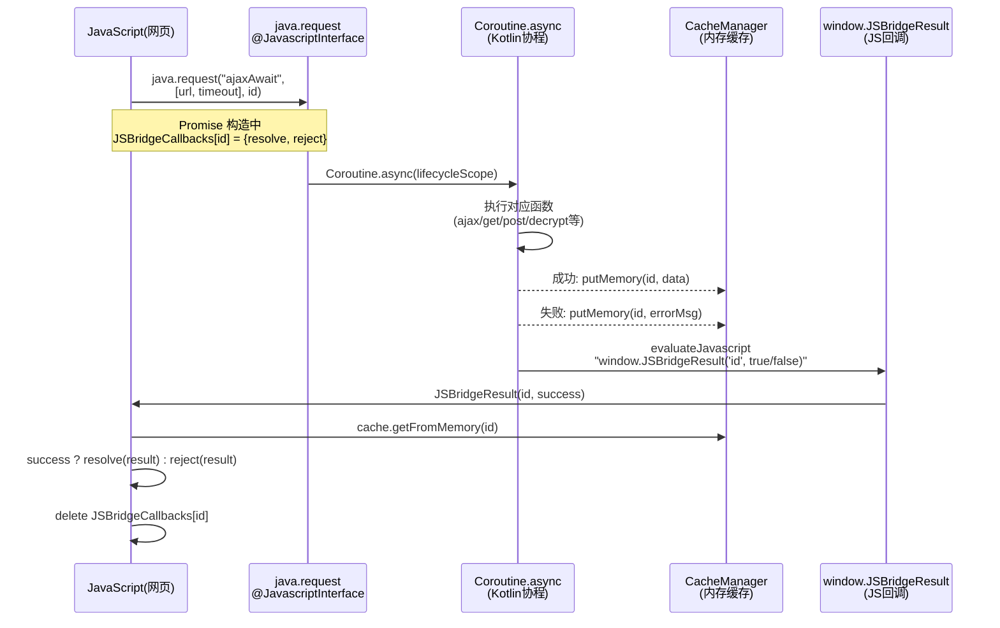

# WebView池化与JS桥接模块

源码目录：`app/src/main/java/io/legado/app/help/webView/`

WebView 实例创建和销毁开销巨大（每个实例约 30-50MB 内存），Legado 通过**Scope 分层对象池**复用 WebView 实例，并通过 `MutableContextWrapper` 实现动态上下文切换，通过变量名随机化防止 JS 注入攻击。

> 主索引：[glide-video-webview.md](./glide-video-webview.md)（三模块拆分后本文件为 WebView 模块权威文档）

## 1. WebViewPool 对象池机制

### 源文件

[WebViewPool.kt](file:///f:/myself/github/WeAgentChat/temp/legado/app/src/main/java/io/legado/app/help/webView/WebViewPool.kt#L32) — `object WebViewPool` 定义（L32-L368，2026-08-30 源码核验）

### Scope 分层池机制（本项目演进核心）

```kotlin
enum class Scope {          // L36-L40
    GLOBAL,                 // 全局池（书源解析等）
    DISCOVERY,              // 发现页池
    RSS                     // 订阅页池（RssFragment 使用）
}
```

- **ScopePool**（L42-L54）：每个 Scope 独立持有 `idlePool`（Stack 闲置栈）/ `inUsePool` / `resettingPool`（重置中）/ `cleanupJob` / `destroyJob`
- **池参数**（L59-L63）：GLOBAL 池容量 `globalMaxCached = max(updateCacheThreadCount/10, 5)`（L59）；scoped 池（DISCOVERY/RSS）`SCOPED_WEB_VIEW_MAX_NUM=2`、`SCOPED_IDLE_TIME_OUT=30s`（L62-L63）
- **定时清理**（`startCleanupTimer` L334-L367）：协程每 30 秒扫描 idlePool，栈底（index=0）用 30 分钟超时（lastIdleTimeout）、其余用 5 分钟超时；清空后取消定时器并重置 `needInitialize`
- **进程级 API 守卫**（sniff-regression-rss-image-crash 修复，回归 bbc9d0a89）：`pauseTimers()/resumeTimers()` 是进程级 API——acquire 时**无条件** `resumeTimers()`（L108-L110，防其他 scope 的 pauseTimers 误冻结本实例）；release 时仅当 `isGlobalIdle()`（L87-L89，**跨全部 scope** 的 inUsePool 均为空）才 `pauseTimers()`（L178-L184），避免发现页/订阅页释放误冻结 GLOBAL 池中正在嗅探的 WebView
- **Scope 级销毁**：`scheduleDestroyScope(scope, delay)`（L202-L211，默认延迟 30s，重复调用重置计时）与 `destroyScope(scope)`（L213-L232，清空 idle/inUse/resetting 三池并逐个销毁）——RssFragment 离开订阅页时调用 `scheduleDestroyScope(WebViewPool.Scope.RSS)`（RssFragment.kt L321）/ `destroyScope(WebViewPool.Scope.RSS)`（L337），GLOBAL 池不受影响
- **内存压力**：`trimMemory()`（L235-L247，B13）清空所有 scope 的 idlePool
- **主线程销毁**：`destroyOnMainThread()`（L282-L300，P1-C）WebView.destroy() 必须主线程调用，非主线程 post 回主线程，最多重试 3 次（真机多次 "destroy failed after 3 attempts" 实证）

### acquire/release 流程

```mermaid
flowchart TD
    subgraph "acquire(context, scope)"
        A["WebViewPool.acquire(context, scope=GLOBAL)"] --> B{scope 池 idlePool 非空?}
        B -- 是 --> C["idlePool.pop()<br/>复用闲置实例<br/>L98"]
        B -- 否 --> D{needInitialize?}
        D -- 是 --> E["needInitialize = false<br/>startCleanupTimer()<br/>L100-L102"]
        D -- 否 --> F["createNewWebView(scope)<br/>创建新实例<br/>L104"]
        E --> F
        C --> G["pooledWebView.upContext(context)<br/>切换到调用方 Context<br/>L106"]
        F --> G
        G --> H["settings.setDarkeningAllowed<br/>设置夜间模式<br/>L107"]
        H --> I["resumeTimers() 无条件恢复<br/>进程级 API 守卫<br/>L110"]
        I --> J["isInUse = true<br/>inUsePool[id] = pooledWebView<br/>L112-L114"]
    end

    subgraph "release(pooledWebView)"
        M["WebViewPool.release(pooledWebView)"] --> N{inUsePool.remove 成功?}
        N -- 否 --> O["destroyOnMainThread<br/>直接销毁<br/>L124-L128"]
        N -- 是 --> P["入 resettingPool<br/>重置 WebView 状态<br/>移除父视图/停止加载/清除焦点<br/>移除 JS 接口/表单/匹配/动画<br/>L130-L155"]
        P --> Q["upContext(appCtx)<br/>切换回应用全局 Context<br/>L156"]
        Q --> R{池满?<br/>idlePool.size >= maxCached - inUsePool.size}
        R -- 是 --> S["destroyOnMainThread<br/>池满销毁<br/>L157-L163"]
        R -- 否 --> T["设置 WebViewClient<br/>onPageFinished 时重置 JS 环境<br/>L164-L197"]
        T --> U["loadUrl(BLANK_HTML)<br/>加载空白页触发重置<br/>L198"]
        U --> V["onPageFinished 回调<br/>JS 禁用→启用重置<br/>isGlobalIdle 才 pauseTimers<br/>idlePool.push<br/>L166-L196"]
    end
```



### onPageFinished 重置细节（L166-L196）

- 仅处理 `BLANK_HTML`（`about:blank`）回调（L167）
- JS 环境重置：`javaScriptEnabled = false` 再 `= true`（L170-L171，需禁用 JS 的订阅源要再次执行）
- 网络图片/缓存模式/宽视口/textZoom 复位（L172-L176）
- JS 桥接接口摘除：release 重置阶段 `removeJavascriptInterface(nameBasic/nameJava/nameSource/nameCache)`（L148-L151）

### WebView 预初始化

`preInitWebView()` (L314-L331) 配置：
- `javaScriptEnabled = true`
- `mixedContentMode = MIXED_CONTENT_ALWAYS_ALLOW`
- `domStorageEnabled = true`
- `mediaPlaybackRequiresUserGesture = false`
- `builtInZoomControls = true` + `displayZoomControls = false`
- `textZoom = 100`
- `LAYER_TYPE_HARDWARE` + 背景色 TRANSPARENT（L329-L330）

实例创建：`createNewWebView()`（L302-L306）`VisibleWebView(MutableContextWrapper(appCtx))`；实例 id 格式 `web_{scope}_{timestamp}_{random}`（`generateId` L308-L310）。

---

## 2. PooledWebView 动态Context切换

### 源文件

[PooledWebView.kt](file:///f:/myself/github/WeAgentChat/temp/legado/app/src/main/java/io/legado/app/help/webView/PooledWebView.kt#L7) — `class PooledWebView` 定义（L7-L25）

### 核心机制

```kotlin
fun upContext(context: Context): PooledWebView {   // L17-L24
    (realWebView.context as MutableContextWrapper).let {
        if (it.baseContext != context) {
            it.baseContext = context  // L20
        }
    }
    return this
}
```

**问题**：WebView 创建时绑定的 Context 不可更改（Android WebView 限制），但 WebViewPool 需要在不同 Activity 间复用 WebView 实例。

**解决方案**：创建 WebView 时传入 `MutableContextWrapper(appCtx)`（WebViewPool.kt L303），这是 Android 提供的 Context 包装器，允许运行时替换 `baseContext`。当 `acquire` 时切换到调用方 Activity 的 Context，`release` 时切回 `appCtx`。

### 字段

| 字段 | 类型 | 说明 | 行号 |
|------|------|------|------|
| `realWebView` | `VisibleWebView` | 真正的 WebView 实例 | L8 |
| `id` | `String` | 唯一标识，格式 `web_{scope}_{timestamp}_{random}` | L9 |
| `scope` | `WebViewPool.Scope` | 所属池（GLOBAL/DISCOVERY/RSS），release 时按此归池 | L10 |
| `isInUse` | `Boolean` | 是否正在被使用 | L12 |
| `lastUseTime` | `Long` | 最后使用时间戳 | L13 |
| `resetToken` | `Int` | 重置令牌 | L14 |
| `isDestroyed` | `Boolean` | 已销毁标志（release/destroy 防重入） | L15 |

---

## 3. WebJsExtensions JS-Native桥接

### 源文件

[WebJsExtensions.kt](file:///f:/myself/github/WeAgentChat/temp/legado/app/src/main/java/io/legado/app/help/webView/WebJsExtensions.kt#L19) — `class WebJsExtensions` 定义（L19-L420)

### 继承关系

`WebJsExtensions` 继承 `RssJsExtensions`，在 RSS 扩展基础上增加了 `upConfig` 回调和 `request` 异步桥接方法。

### JS-Native 异步桥接时序



### 变量名随机化

每次进程启动时，所有 JS 桥接变量名都会重新随机生成（WebJsExtensions.kt companion object，L211-L419），防止恶意网页猜测变量名进行注入：

| 属性 | 生成规则 | 用途 | 行号 |
|------|----------|------|------|
| `uuid` | `UUID.randomUUID().replace('-', randomLetter()).chunked(6)` | 基础随机 ID | L216-L218 |
| `uuid2` | 同上 | 二级随机 ID | L219-L221 |
| `nameUrl` | `"https://" + uuid[0] + ".com/" + uuid2[0] + ".js"` | 伪装脚本 URL | L222 |
| `nameJava` | `randomLetter() + uuid[1] + uuid2[1]` | Java 桥接对象名 | L223 |
| `nameCache` | `randomLetter() + uuid[2] + uuid2[2]` | 缓存对象名 | L224 |
| `nameSource` | `randomLetter() + uuid[3] + uuid2[3]` | 书源对象名 | L225 |
| `nameBasic` | `randomLetter() + uuid[4] + uuid2[4]` | 基础功能对象名 | L226 |
| `JSBridgeResult` | `randomLetter() + uuid[5] + uuid2[5]` | 结果回调函数名 | L227 |

### JS_INJECTION 注入脚本

`JS_INJECTION` (L234-L367) 是注入到 WebView 的完整 JS 环境，包含：

1. **变量迁移**：从 `window` 上取出 `java`/`source`/`cache` 并删除原引用（L238-L243），防止网页直接访问
2. **异步函数**：每个 `xxxAwait` 函数返回 `Promise`，通过 `requestId` 生成唯一请求 ID，注册到 `JSBridgeCallbacks`（L244-L355）
3. **结果回调**：`window.JSBridgeResult(id, success)` 从 `CacheManager` 取结果，resolve/reject 对应 Promise（L356-L367）

### request() Native 端分发

`request(funName, jsParam, id)` (L42-L161) 是 JS 调用 Native 的统一入口：

| funName | 对应操作 | 参数 | 行号 |
|---------|---------|------|------|
| `run` | `analyzeRule.evalJS(p0)` | jsCode | L53-L57 |
| `ajaxAwait` | `ajax(url, timeout)` | url, timeout | L59-L63 |
| `connectAwait` | `connect(url, header, timeout)` | url, header, timeout | L65-L70 |
| `getAwait` | `get(url, header, timeout)` | url, header, timeout | L72-L78 |
| `headAwait` | `head(url, header, timeout)` | url, header, timeout | L80-L86 |
| `postAwait` | `post(url, body, header, timeout)` | url, body, header, timeout | L88-L94 |
| `webViewAwait` | `webView(url, header, js, newTab)` | url, header, js, newTab | L96-L101 |
| `webViewGetSourceAwait` | `webViewGetSource(...)` | 多参数 | L103-L110 |
| `decryptStrAwait` | `createSymmetricCrypto().decryptStr()` | transformation, key, iv, data | L112-L117 |
| `encryptBase64Await` | `createSymmetricCrypto().encryptBase64()` | transformation, key, iv, data | L119-L124 |
| `encryptHexAwait` | `createSymmetricCrypto().encryptHex()` | transformation, key, iv, data | L126-L131 |
| `createSignHexAwait` | `createSign().signHex()` | algorithm, publicKey, privateKey, data | L133-L138 |
| `downloadFileAwait` | `downloadFile(url)` | url | L140-L142 |
| `readTxtFileAwait` | `readTxtFile(path)` | path | L144-L146 |
| `importScriptAwait` | `importScript(path)` | path | L148-L150 |
| `getStringAwait` | `analyzeRule.getString(rule, content)` | rule, content | L152-L154 |

### JS_INJECTION2 精简版

`JS_INJECTION2` (L370-L395) 仅包含 `run` 函数和回调机制，用于不需要完整扩展能力的场景。

### basicJs 基础注入

`basicJs` (L398-L418) 注入 `screen.orientation.lock/unlock` 和 `window.close` 的兼容实现，通过 `nameBasic` 对象桥接到 Native。

---

## 文件索引（3 文件）

| 文件 | 类型 | 核心职责 |
|------|------|----------|
| [WebViewPool.kt](file:///f:/myself/github/WeAgentChat/temp/legado/app/src/main/java/io/legado/app/help/webView/WebViewPool.kt#L32) | object | Scope 分层对象池（acquire/release/Scope 销毁/trimMemory） |
| [PooledWebView.kt](file:///f:/myself/github/WeAgentChat/temp/legado/app/src/main/java/io/legado/app/help/webView/PooledWebView.kt#L7) | class | 池化 WebView 包装 + 动态 Context + scope 归属 |
| [WebJsExtensions.kt](file:///f:/myself/github/WeAgentChat/temp/legado/app/src/main/java/io/legado/app/help/webView/WebJsExtensions.kt#L19) | RssJsExtensions | JS-Native 桥接+变量名随机化 |
