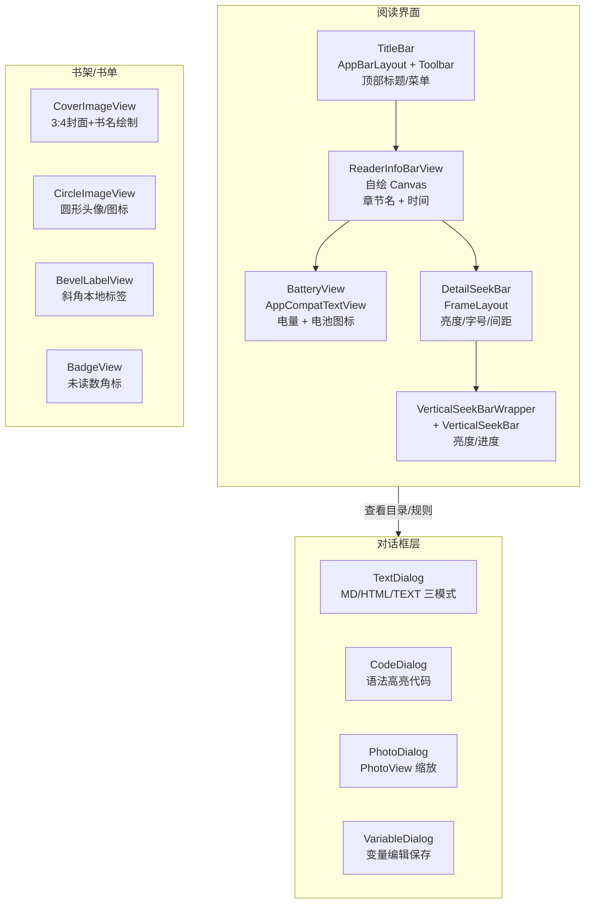
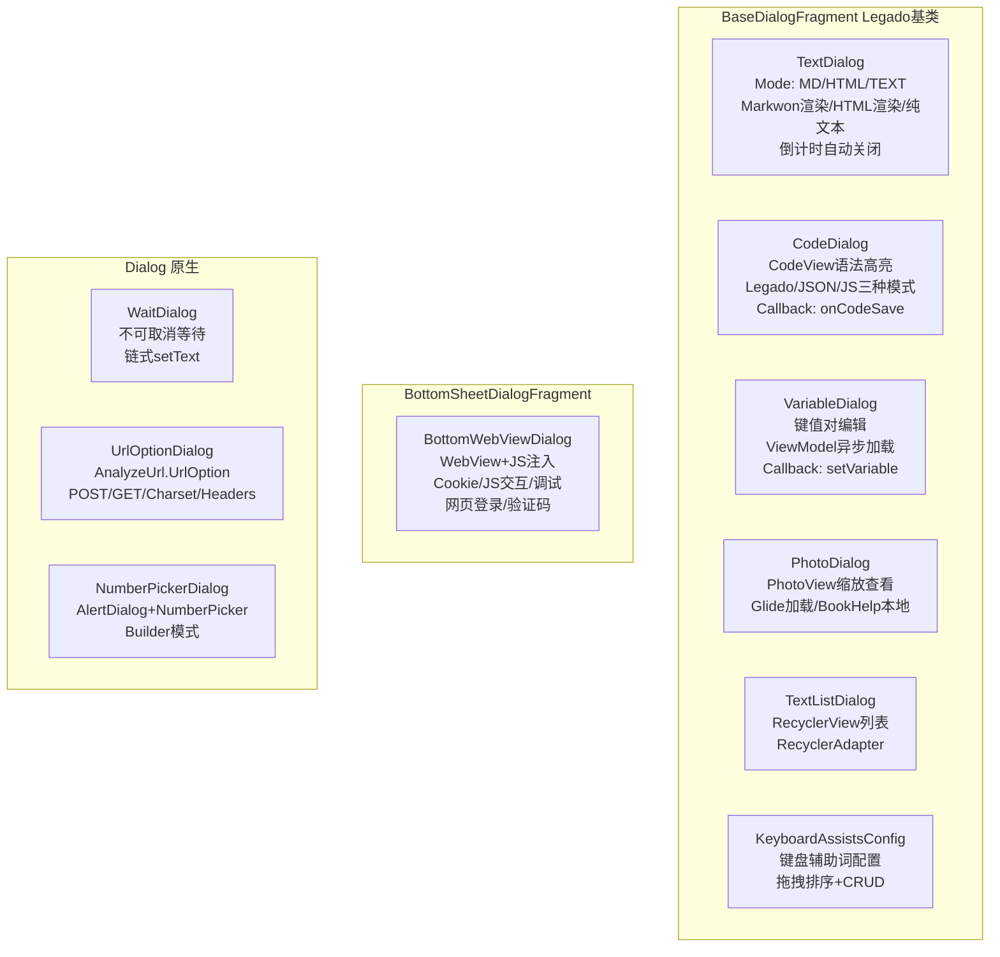

# Legado 自定义控件体系

> **核心问题**：Legado 的 70+ 自定义控件如何组织，它们为阅读器提供了哪些能力？
>
> **答案**：控件按 8 个子包组织——text（14 个文本变体）、image（6 个图片变体）、recycler（11 个列表扩展）、dialog（8 个对话框）、code（3 个代码编辑器）、anima（6 个动画）、seekbar（3 个滑动条）、其他（10 个顶层控件）。核心设计原则是「主题感知」：几乎所有控件在 init 块中即读取 ThemeStore/accentColor 自动着色，XML 声明即可使用无需代码设置颜色。阅读界面依赖 ReaderInfoBarView + BatteryView + DetailSeekBar + VerticalSeekBar 组合实现状态栏/进度条/亮度调节。

---

## 1. 控件继承体系

```mermaid
classDiagram
    direction TB

    class AppCompatTextView {
        <<AndroidX>>
    }
    class AppCompatImageView {
        <<AndroidX>>
    }
    class AppCompatSeekBar {
        <<AndroidX>>
    }
    class RecyclerView {
        <<AndroidX>>
    }
    class BaseDialogFragment {
        <<Legado>>
    }
    class View {
        <<Android>>
    }
    class FrameLayout {
        <<Android>>
    }
    class AppBarLayout {
        <<Material>>
    }

    AppCompatTextView <|-- AccentTextView : accent色文字
    AppCompatTextView <|-- PrimaryTextView : 主色文字
    AppCompatTextView <|-- SecondaryTextView : 次色文字
    AppCompatTextView <|-- StrokeTextView : 描边标签
    AppCompatTextView <|-- AccentStrokeTextView : accent描边
    AppCompatTextView <|-- AccentBgTextView : accent背景
    AppCompatTextView <|-- ScrollTextView : 嵌套滚动
    AppCompatTextView <|-- BadgeView : 角标
    AppCompatTextView <|-- BatteryView : 电池

    AppCompatImageView <|-- PhotoView : 缩放旋转
    AppCompatImageView <|-- CoverImageView : 封面
    AppCompatImageView <|-- CircleImageView : 圆形
    AppCompatImageView <|-- FilletImageView : 圆角
    AppCompatImageView <|-- ImageButton : 禁用透明

    View <|-- BevelLabelView : 斜角标签
    View <|-- ArcView : 弧形装饰
    View <|-- ReaderInfoBarView : 阅读信息栏
    View <|-- RotateLoading : 旋转加载
    View <|-- RefreshProgressBar : 刷新进度
    View <|-- SmoothCheckBox : 动画勾选

    AppCompatSeekBar <|-- VerticalSeekBar : 垂直滑动
    FrameLayout <|-- VerticalSeekBarWrapper : 垂直包装
    FrameLayout <|-- DetailSeekBar : 带标签滑动
    FrameLayout <|-- SelectActionBar : 多选操作栏
    FrameLayout <|-- LoadMoreView : 加载更多
    FrameLayout <|-- ShadowLayout : 阴影容器
    FrameLayout <|-- DynamicFrameLayout : 动态内容

    AppBarLayout <|-- TitleBar : 标题栏
    RecyclerView <|-- FastScrollRecyclerView : 快速滚动
    RecyclerView <|-- RecyclerViewAtPager2 : ViewPager2兼容

    BaseDialogFragment <|-- TextDialog : 文本查看
    BaseDialogFragment <|-- CodeDialog : 代码查看
    BaseDialogFragment <|-- VariableDialog : 变量编辑
    BaseDialogFragment <|-- PhotoDialog : 图片查看
    BaseDialogFragment <|-- TextListDialog : 列表对话框
    BaseDialogFragment <|-- KeyboardAssistsConfig : 键盘辅助

    ScrollMultiAutoCompleteTextView <|-- CodeView : 代码编辑
```

---

## 2. 阅读界面控件组合

---

## 3. 对话框体系层次

---

## 4. 文本控件（text/，14 个）

| 控件 | 源文件 | 父类 | 核心API | 用途 |
|------|--------|------|---------|------|
| AccentTextView | `text/AccentTextView.kt:10` | AppCompatTextView | init 自动设置 accentColor | 强调色文字，书源标签等 |
| PrimaryTextView | `text/PrimaryTextView.kt:12` | AppCompatTextView | init 自动设置 textColorPrimary | 主色文字 |
| SecondaryTextView | `text/SecondaryTextView.kt` | AppCompatTextView | init 自动设置 textColorSecondary | 次色文字，辅助信息 |
| AccentBgTextView | `text/AccentBgTextView.kt:14` | AppCompatTextView | `setRadius(Int)` | accent色背景圆角标签，LabelsBar内部使用 |
| AccentStrokeTextView | `text/AccentStrokeTextView.kt:14` | AppCompatTextView | init 设置 accent描边+文字 | accent描边标签 |
| StrokeTextView | `text/StrokeTextView.kt:13` | AppCompatTextView | `setRadius(Int)` | 通用描边标签，支持 selected 状态变色 |
| ScrollTextView | `text/ScrollTextView.kt:23` | AppCompatTextView | 嵌套惯性滚动 | 长文本嵌套滚动，阅读说明等 |
| ScrollMultiAutoCompleteTextView | `text/ScrollMultiAutoCompleteTextView.kt` | MultiAutoCompleteTextView | 嵌套滚动 | CodeView 的父类 |
| BadgeView | `text/BadgeView.kt:28` | AppCompatTextView | `setBadgeCount(Int)` `setTargetView(View)` `incrementBadgeCount(Int)` | 角标，未读数/倒计时 |
| BevelLabelView | `text/BevelLabelView.kt:20` | View | `setMode(BevelLabelMode)` `setBgColor(Int)` | 斜角标签，8 种角落模式 |
| MultilineTextView | `text/MultilineTextView.kt` | AppCompatTextView | 自动多行 | 固定多行显示 |
| EditEntity | `text/EditEntity.kt` | -- | 数据类 | 文本编辑实体封装 |
| TextInputLayout | `text/TextInputLayout.kt` | TextInputLayout | 扩展 | 输入框布局扩展 |
| AutoCompleteTextView | `text/AutoCompleteTextView.kt` | AppCompatAutoCompleteTextView | 扩展 | 自动补全扩展 |

**主题感知设计**：AccentTextView（L10-18）在 init 块中直接读取 `context.accentColor` 设置文字色；StrokeTextView（L13-88）根据 `isBottomBackground` 属性切换配色方案，支持 selected/disabled 状态的 Selector 着色。

---

## 5. 图片控件（image/，6 个）

| 控件 | 源文件 | 父类 | 核心API | 用途 |
|------|--------|------|---------|------|
| PhotoView | `image/PhotoView.kt:32` | AppCompatImageView | 缩放/旋转/双击/惯性滚动 | 图片查看器，PhotoDialog 内使用 |
| CoverImageView | `image/CoverImageView.kt:51` | AppCompatImageView | `load(Book/SearchBook)` `bitmapPath` | 书籍封面，3:4 比例，加载失败自动绘制书名 |
| CircleImageView | `image/CircleImageView.kt:27` | AppCompatImageView | `setText()` `borderWidth` `borderColor` | 圆形图片+文字，书源图标/头像 |
| FilletImageView | `image/FilletImageView.kt:13` | AppCompatImageView | 四角独立圆角配置 | 通用圆角图片 |
| ArcView | `image/ArcView.kt:12` | View | `setBgColor(Int)` arcHeight/arcDirectionTop | 弧形装饰，个人中心顶部 |
| ImageButton | `image/ImageButton.kt:7` | AppCompatImageView | `setEnabled(Boolean)` 透明度变化 | 带禁用效果的图标按钮 |

**CoverImageView 详解**（`image/CoverImageView.kt:51-361`）：
- 宽高比固定 3:4（L84-91 onMeasure）
- Glide 加载封面，失败时异步绘制书名+作者（L103-121 onDraw）
- LruCache 缓存书名 Bitmap（L56-58），避免重复渲染
- 协程异步生成封面图（L128-154 generateCoverAsync），带超时 1200ms

**PhotoView 手势体系**（`image/PhotoView.kt:32`）：
- ScaleGestureDetector 缩放
- GestureDetector 单击/双击/长按
- RotateGestureDetector 双指旋转
- OverScroller 惯性滚动
- photo/Info.kt 存储图片位置/缩放/旋转状态快照

---

## 6. RecyclerView 扩展（recycler/，11 个）

| 控件 | 源文件 | 核心能力 | 用途 |
|------|--------|---------|------|
| FastScrollRecyclerView | `recycler/scroller/FastScrollRecyclerView.kt:15` | 内嵌 FastScroller | 书源列表快速定位 |
| FastScroller | `recycler/scroller/FastScroller.kt` | 滚动条+气泡指示器 | 快速滚动组件 |
| FastScrollStateChangeListener | `recycler/scroller/FastScrollStateChangeListener.kt:3` | onFastScrollStart/Stop | 滚动状态监听接口 |
| RecyclerViewAtPager2 | `recycler/RecyclerViewAtPager2.kt:9` | 水平滑动事件分发 | ViewPager2 内嵌列表 |
| ItemTouchCallback | `recycler/ItemTouchCallback.kt:14` | 拖拽排序+滑动删除 | 书源排序、书架排序 |
| DragSelectTouchHelper | `recycler/DragSelectTouchHelper.kt:16` | 长按拖拽多选 | 批量选择书源 |
| LoadMoreView | `recycler/LoadMoreView.kt:17` | isLoading/hasMore/error | 列表底部加载更多 |
| UpLinearLayoutManager | `recycler/UpLinearLayoutManager.kt:8` | SNAP_TO_START 平滑滚动 | 阅读页章节列表 |
| NoChildScrollLinearLayoutManager | `recycler/NoChildScrollLinearLayoutManager.kt:9` | onRequestChildFocus 返回 true | 阻止子焦点滚动 |
| VerticalDivider | `recycler/VerticalDivider.kt` | 垂直分割线 | Grid 列表分割 |
| DividerNoLast | `recycler/DividerNoLast.kt` | 最后项无分割线 | 列表分割 |
| HeaderAdapterDataObserver | `recycler/HeaderAdapterDataObserver.kt` | Header 数据观察 | 带头部 Adapter |
| ViewPager2Container | `recycler/ViewPager2Container.kt` | 嵌套滑动处理 | ViewPager2 容器 |

**ItemTouchCallback**（`recycler/ItemTouchCallback.kt:14-148`）：
- 支持 Grid/Linear 两种 LayoutManager 的拖拽方向判断（L48-75）
- `isCanDrag`/`isCanSwipe` 控制拖拽/滑动开关
- Callback 接口：`swap()`/`onSwiped()`/`onClearView()`
- 拖拽时自动禁用 SwipeRefreshLayout（L109-111）

---

## 7. 对话框（dialog/，8 个）

| 对话框 | 源文件 | 基类 | 核心能力 | 用途 |
|--------|--------|------|---------|------|
| TextDialog | `dialog/TextDialog.kt:34` | BaseDialogFragment | MD/HTML/TEXT 三模式，Markwon 渲染，倒计时关闭 | 规则说明、免责声明 |
| CodeDialog | `dialog/CodeDialog.kt:19` | BaseDialogFragment | CodeView 语法高亮，Legado/JSON/JS 模式，Callback 保存 | 书源规则查看/编辑 |
| VariableDialog | `dialog/VariableDialog.kt:19` | BaseDialogFragment | 键值对编辑，ViewModel 异步加载 | 环境变量编辑 |
| PhotoDialog | `dialog/PhotoDialog.kt:25` | BaseDialogFragment | PhotoView 缩放，Glide 加载，本地书籍图片 | 查看封面/插图 |
| TextListDialog | `dialog/TextListDialog.kt:18` | BaseDialogFragment | RecyclerView + RecyclerAdapter | 日志列表 |
| BottomWebViewDialog | `dialog/BottomWebViewDialog.kt` | BottomSheetDialogFragment | WebView + JS 注入，Cookie 管理，调试控制台 | 网页登录/验证码 |
| WaitDialog | `dialog/WaitDialog.kt:9` | Dialog | 不可取消，链式 setText() | 等待加载 |
| UrlOptionDialog | `dialog/UrlOptionDialog.kt:14` | Dialog | AnalyzeUrl.UrlOption 编辑 | URL 选项配置 |
| NumberPickerDialog | `number/NumberPickerDialog.kt:10` | AlertDialog | Builder 模式，NumberPicker | 数值选择 |

**TextDialog 详解**（`dialog/TextDialog.kt:34-147`）：
- 三种渲染模式（L36-38 Mode 枚举）：MD（Markwon + Glide + Table + HTML）、HTML（setHtml 扩展）、TEXT（纯文本截断 32KB）
- 倒计时自动关闭（L126-145），倒计时显示在 BadgeView
- 菜单支持全屏编辑，跳转 CodeEditActivity（L113-120）

**BottomWebViewDialog 详解**（`dialog/BottomWebViewDialog.kt`）：
- 使用 PooledWebView 对象池复用 WebView 实例
- WebJsExtensions 注入 JS 辅助函数（basicJs + JS_INJECTION）
- 支持 JS Bridge 双向通信（@JavascriptInterface）
- SSL 错误处理、Console 日志拦截、Base64 图片加载

---

## 8. 代码编辑器（code/，3 个）

| 组件 | 源文件 | 核心能力 | 用途 |
|------|--------|---------|------|
| CodeView | `code/CodeView.kt:23` | 语法高亮、Tab 缩进、自动补全、错误行标记、自动缩进 | 书源规则编辑 |
| CodeViewExtensions | `code/CodeViewExtensions.kt` | `addLegadoPattern()` `addJsonPattern()` `addJsPattern()` | 三种语法模式快捷添加 |
| KeywordTokenizer | `code/KeywordTokenizer.kt:6` | MultiAutoCompleteTextView.Tokenizer | 代码自动补全分词 |

**CodeView 语法高亮机制**（`code/CodeView.kt:168-231`）：
- `mSyntaxPatternMap: Map<Pattern, Int>` 存储 正则-颜色 映射
- `highlightWithoutChange()` 先清除所有 ForegroundSpan/BackgroundSpan，再重新匹配着色
- 限流：`mUpdateDelayTime=500ms` 延迟执行（L41-43），避免输入卡顿
- 超过 4096 字符跳过高亮（L220-222）
- Tab 宽度用 ReplacementSpan 实现（L383-406 TabWidthSpan）
- 自动缩进：换行时继承上一行缩进 + `{` 后增加一级（L120-166）

**CodeViewExtensions 语法模式**（`code/CodeViewExtensions.kt:12-31`）：
- legadoPattern：`\|\||&&|%%|@js:|@Json:|@css:|@@|@XPath:|@webjs:` 橙色
- jsonPattern：`"key":|{|}|[|]` 蓝色
- jsPattern：`var|let|const` + 运算符 + `\n` 蓝/橙/灰

---

## 9. 动画控件（anima/，6 个）

| 控件 | 源文件 | 核心能力 | 用途 |
|------|--------|---------|------|
| RotateLoading | `anima/RotateLoading.kt:21` | 旋转弧线加载动画，可配置速度/颜色/宽度 | 全局加载指示 |
| RefreshProgressBar | `anima/RefreshProgressBar.kt:15` | 双层进度条（主色+次色），自动往返动画 | WebView 进度条 |
| ExplosionField | `anima/explosion_field/ExplosionField.kt` | 粒子爆炸动画容器 | 删除动画效果 |
| ExplosionAnimator | `anima/explosion_field/ExplosionAnimator.kt` | 粒子爆炸 ValueAnimator | 爆炸动画计算 |
| ExplosionView | `anima/explosion_field/ExplosionView.kt` | 粒子 View | 单个爆炸粒子 |
| OnAnimatorListener | `anima/explosion_field/OnAnimatorListener.kt` | 动画监听适配器 | 动画回调 |

**RotateLoading**（`anima/RotateLoading.kt:21-227`）：
- 两段弧线（topDegree/bottomDegree）持续旋转（L132-134）
- 弧度在 10-160 之间呼吸变化（L141-155）
- `visible()`/`inVisible()`/`gone()` 控制显示，带缩放动画（L204-213）

---

## 10. 滑动条控件（seekbar/，3 个）

| 控件 | 源文件 | 核心能力 | 用途 |
|------|--------|---------|------|
| VerticalSeekBar | `seekbar/VerticalSeekBar.kt:20` | 90 度旋转 SeekBar | 阅读页亮度调节 |
| VerticalSeekBarWrapper | `seekbar/VerticalSeekBarWrapper.kt:12` | 尺寸交换包装器 | VerticalSeekBar 容器 |
| SeekBarChangeListener | `seekbar/SeekBarChangeListener.kt:5` | 空实现接口 | SeekBar 回调便捷接口 |

**VerticalSeekBar**（`seekbar/VerticalSeekBar.kt:20`）：
- 继承 AppCompatSeekBar，通过 Canvas 旋转 90 度实现垂直方向
- 反射调用 `setProgressFromUser()` 解决进度设置问题
- `mIsDragging` 标记拖拽状态防止递归

---

## 11. 顶层控件（widget/，10 个）

| 控件 | 源文件 | 父类 | 核心API | 用途 |
|------|--------|------|---------|------|
| TitleBar | `TitleBar.kt:32` | AppBarLayout | `title` `subtitle` `setColorFilter()` `setNavigationOnClickListener()` | 全局标题栏 |
| SearchView | `SearchView.kt:22` | SearchView | 自定义 hint 图标 + 14sp 字号 | 搜索框 |
| ReaderInfoBarView | `ReaderInfoBarView.kt:25` | View | `update(label)` `textInfoAlignment` | 阅读页信息栏 |
| BatteryView | `BatteryView.kt:19` | AppCompatTextView | `setBattery(Int, String?)` `isBattery` `setColor(Int)` | 电池状态显示 |
| DetailSeekBar | `DetailSeekBar.kt:19` | FrameLayout | `progress` `max` `valueFormat` `onChanged` | 带标签的滑动条 |
| SelectActionBar | `SelectActionBar.kt:28` | FrameLayout | `upCountView()` `setCallBack()` `inflateMenu()` | 多选操作栏 |
| ShadowLayout | `ShadowLayout.kt:19` | RelativeLayout | `setShadowColor()` `setShadowRadius()` 阴影方向控制 | 阴影容器 |
| LabelsBar | `LabelsBar.kt:11` | LinearLayout | `setLabels(List<String>)` `clear()` `addLabel()` | 标签流式布局 |
| PopupAction | `PopupAction.kt:13` | PopupWindow | `setItems()` `onActionClick` | 弹出操作菜单 |
| NoChildScrollNestedScrollView | `NoChildScrollNestedScrollView.kt:9` | NestedScrollView | requestChildFocus 时阻止自动滚动 | 防止焦点滚动 |

**ReaderInfoBarView 详解**（`ReaderInfoBarView.kt:25-193`）：
- 纯 Canvas 自绘：左侧章节名 + 右侧时间（L91-123 onDraw）
- 时间通过 BroadcastReceiver 监听 ACTION_TIME_TICK 每分钟更新（L130-143）
- 支持 ALIGN_LEFT/ALIGN_CENTER 两种对齐（L32-33）
- 文字自适应缩放：`updateTextSize()` 根据可用宽度计算缩放比（L151-176）
- 文字描边效果：先画 Stroke 再画 Fill（L178-185 drawTextOutline）
- WindowInsets 兼容刘海屏（L79-88）

**TitleBar 详解**（`TitleBar.kt:32-279`）：
- 继承 AppBarLayout 内嵌 Toolbar（L88）
- 自动 attachToActivity：设置 setSupportActionBar（L271-278）
- fitStatusBar/fitNavigationBar 自动适配系统栏（L171-182）
- EInk 模式下使用边框背景替代阴影（L184-193）
- 透明导航栏时去掉 elevation（L247-261）

---

## 12. 其他子包控件

### 12.1 checkbox/（1 个）

| 控件 | 源文件 | 核心能力 |
|------|--------|---------|
| SmoothCheckBox | `checkbox/SmoothCheckBox.kt:20` | 实现 Checkable，勾选/取消带缩放+勾号动画 |

### 12.2 keyboard/（2 个）

| 控件 | 源文件 | 核心能力 |
|------|--------|---------|
| KeyboardToolPop | `keyboard/KeyboardToolPop.kt` | PopupWindow 键盘辅助工具，常用符号快速输入 |
| KeyboardAssistsConfig | `keyboard/KeyboardAssistsConfig.kt` | BaseDialogFragment，键盘辅助词 CRUD + 拖拽排序 |

### 12.3 number/（1 个）

| 控件 | 源文件 | 核心能力 |
|------|--------|---------|
| NumberPickerDialog | `number/NumberPickerDialog.kt:10` | AlertDialog + NumberPicker，Builder 模式 |

### 12.4 dynamiclayout/（2 个）

| 控件 | 源文件 | 核心能力 |
|------|--------|---------|
| DynamicFrameLayout | `dynamiclayout/DynamicFrameLayout.kt` | 内容/loading/empty/error 四状态切换 |
| ViewSwitcher | `dynamiclayout/ViewSwitcher.kt` | 视图切换动画 |

---

## 13. 设计模式总结

### 13.1 主题感知自动着色

几乎所有自定义控件在 `init {}` 块中读取 `context.accentColor`/`context.bottomBackground`/`ThemeStore` 自动设置颜色，XML 声明即可使用，无需 Activity 代码介入。

关键扩展属性来源：`io.legado.app.lib.theme` 包。

### 13.2 ViewBinding 优先

SelectActionBar、DetailSeekBar、LoadMoreView、WaitDialog、UrlOptionDialog、CodeDialog 等全部使用 ViewBinding 访问子视图，避免 findViewById。

### 13.3 Canvas 自绘控件

ReaderInfoBarView、BatteryView、BevelLabelView、ArcView、ShadowLayout、SmoothCheckBox、RotateLoading、RefreshProgressBar 均为纯 Canvas 自绘，无 XML 子视图依赖。

### 13.4 嵌套滚动处理

ScrollTextView、RecyclerViewAtPager2、NoChildScrollNestedScrollView、NoChildScrollLinearLayoutManager 均通过 `requestDisallowInterceptTouchEvent()` 或覆写 `onRequestChildFocus()` 解决嵌套滑动冲突。
