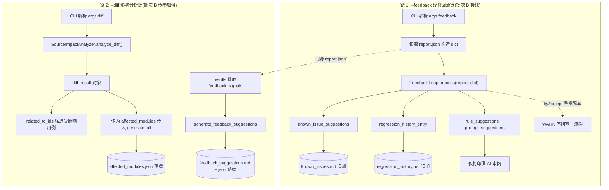

# design.md — ai-test-system-refinement

> **变更**: ai-test-system-refinement ｜ **状态**: 设计中 ｜ **日期**: 2026-08-30
> **前置文档**: [README.md](./README.md)（问题盘点 P1~P8）｜ [spec.md](./spec.md)（需求规格）
> **行号基准**: 本文所有行号基于 2026-08-30 工作区实态核实（`run_e2e.py` 581 行版本）。

---

## 1. Technical Approach（技术方案：五批次）

总体策略：**文档先行（A）→ 编排接线（B）→ 数据修复（C）→ 清单治理（D）→ 全量验证（E）**。
批次 A/B/C 互不依赖可并行；批次 D 依赖用户确认；批次 E 收尾兜底。**App 源码 `app/` 目录零改动**。

### 1.1 批次 A：文档沉淀（修 P5/P6/P7）

主战场：`ai_tests/docs/fixed_test_workflow.md`（SOP）+ `ai_tests/README.md` + `ai_tests/docs/known_issues.md` + `docs/project-rules/ai_e2e_testing_workflow.md`。

| # | 动作 | 位置 | 内容 |
|---|------|------|------|
| A-① | SOP 脚本表补登 | `fixed_test_workflow.md` 脚本登记表 | 补登 7 个已存在但未登记的 L2 脚本：`l2_verify_theme_rss_header_sync.py`、`l2_verify_header_brightness.py`、`l2_vl_header_analysis.py`、`l2_verify_highlight_toggle.py`、`l2_verify_rss_folder_cover_dialog.py`、`l2_verify_rss_folder_margin.py`、`l2_verify_video_ux_fixes.py`（违反 SOP 自身"新增脚本必须更新 SOP"规则，此为 P6 主修点） |
| A-② | 铁律章节追加 2 条 | `fixed_test_workflow.md` L243-247 铁律区 | 1) `su -c` 必须整串传参：`adb shell su -c "sh -c '...'"`，列表拆参会被 shell 切散导致命令截断；2) prefs XML 值解析：Boolean/Long 等值位于 `value="..."` 属性而非节点文本，grep DOM 文本会误判为空 |
| A-③ | 新增「u2 交互陷阱」小节 | `fixed_test_workflow.md` 铁律区后新增二级小节 | 6 条：① `UiObject2` 点击报 `StaleObjectException` → 重新 `dump_hierarchy` 后按新节点坐标 `tap(x, y)`；② Compose Dialog 独立窗口，主窗口 dump 看不到弹框节点 → 需按窗口维度 dump 或坐标兜底；③ 底部导航为 Compose 实现无文本节点 → 先 dump 找 `content-desc`，找不到则降级坐标 tap；④ tab 顺序可配置不固定 → 先 dump 实际顺序再写死脚本；⑤ `toybox sed` 经 `su -c` 传参时引号嵌套坑（内层单引号被外层吃掉）→ 用双引号包 sed 表达式并转义 `$`；⑥ MEmu `screencap` 可能拿到陈旧帧 → 截图前 `sleep 1~2s` |
| A-④ | 新增「亮度差判定方法论」小节 | `fixed_test_workflow.md` 方法论区 | 像素亮度差判定流程：同区域双截屏 → 像素亮度（0.299R+0.587G+0.114B）均值对比 → 差值阈值（<5 视为未变化）→ 排除状态栏/导航栏干扰区。源自 `l2_verify_header_brightness.py` 实战 |
| A-⑤ | known_issues.md 补"验证空炮"条目 | `ai_tests/docs/known_issues.md` | 条目：**验证空炮**——在全新安装（清数据）的模拟器上验证"脏数据容错/旧数据迁移"类修复，因设备上根本无脏数据，测试必然通过但未真正验证（false pass）。预防：此类用例前置需先构造旧数据（`repair_local_prefs.py` / 手工注数据），否则判 SKIP 而非 PASS |
| A-⑥ | README 修复 | `ai_tests/README.md` | 1) 删除 13 处已删脚本的失效引用；2) 删除 V5 攻坚过时章节（`v5_*` 链已完成使命，详见批次 D 组 2）；3) 修正 `reports/` 结构描述（宣称 `report_{timestamp}/` 七件套，实际为 `reports/{ts}_{instance}/` 散落文件布局，以 `report_generator.generate_all()` 实际产物为准：`report.md` / `report.json` / `manual_cases.md` / `summary.txt` + 可选 `affected_modules.json` / `feedback_suggestions.md(+json)` / 证据归档目录）；4) 脚本索引与批次 D 删除结果同步 |
| A-⑦ | 项目规范路径修复 | `docs/project-rules/ai_e2e_testing_workflow.md` | 修复 3 处 run_e2e.py 路径漂移：`ai_tests/scripts/run_e2e.py` → `ai_tests/run_e2e.py`（实际文件在 `ai_tests/` 根，不在 scripts/） |
| A-⑧ | L1/L2/L3 权威定义 | `fixed_test_workflow.md` 新增小节「完成级别权威定义」 | 收敛散落在 SOP 步骤表与 `components-capability-inventory.md` 的定义：**L1** = 代码完成 + 编译通过（`./gradlew assembleAppDebug` 绿）；**L2** = 功能可运行（对应 L2 脚本 / 脚本化 UI 验证通过）；**L3** = 真机场景回测（真机/模拟器全场景 E2E 通过）。三级递进，交付声明必须注明当前级别 |

### 1.2 批次 B：编排层接入（修 P3，纯接线不改 FeedbackLoop）

**改动点 1 — `run_e2e.py` L201-204（--feedback 接线）**：

现状：`args.feedback` 为 True 时仅打印"[WARN] M16 feedback_loop 未实现"降级提示，但 `lib/feedback_loop.py` 的 `FeedbackLoop.process()`（L60-97）已实现且 `tests/test_feedback_loop.py` 有 3 个单测覆盖。

修改：将提示块替换为真实调用：

```python
# --feedback：M16 经验回流（report 生成后触发，见 11.5 之前的挂载点）
if args.feedback:
    try:
        from ai_tests.lib.feedback_loop import FeedbackLoop
        report_dict = json.loads((rg.report_dir / "report.json").read_text(encoding="utf-8"))
        fl_result = FeedbackLoop().process(report_dict)
        print(
            f"[9.6] 经验回流: known_issue={len(fl_result['known_issue_suggestions'])} "
            f"rule={len(fl_result['rule_suggestions'])} "
            f"prompt={len(fl_result['prompt_suggestions'])} "
            f"regression 已追加 regression_history.md"
        )
    except Exception as e:  # 隔离：经验回流失败不阻塞测试主流程
        print(f"[WARN] feedback_loop 执行失败，跳过经验回流: {e}")
```

设计要点：
- **挂载时机**：放在报告生成（`rg.generate_all`，L530）与 `--ai-verify`（L539）之后，确保 `report.json` 已落盘；`FeedbackLoop.process()` 输入即 report.json 的 dict 结构（`{cases: [{tc_id, verdict, reason, feedback_signal}]}`）。
- **异常隔离**：try/except 全包裹（含 import），失败仅打印 WARN，**绝不阻塞/不改变退出码**——经验回流是增益功能，主流程（测试+报告）必须稳定。
- **副作用边界**：`process()` 内部自动追加 `known_issues.md`（known_issue_suggestions）与 `regression_history.md`（regression_history_entry）；rule/prompt 两类建议仅随返回值打印，供 AI 事后审阅（FeedbackLoop 既有行为，不改）。

**改动点 1.5 — `tests/test_run_e2e.py` 断言同步（穿透自审新增，防回归卡点）**：

- 现状：`test_handle_v3_feedback_warning`（L270-275）断言 `--feedback` 仅警告且返回 None——该断言锁死了旧降级行为，接入 FeedbackLoop 后**必须同步更新**（改为断言"不降级、继续执行"），否则批次 E 的 pytest 全量必红。
- 实施时先 Grep `feedback` 于 test_run_e2e.py 全量确认受影响断言清单（已知 2 处：L142-146 参数解析断言不受影响；L270-275 行为断言需改），更新后随批次 E 一起回归。

**改动点 2 — `run_e2e.py` L534（affected_modules 传递）**：

现状：`rg.generate_all(..., affected_modules=None, ...)` 固定传 None → `report_generator.py` L356-358 判空跳过 `affected_modules.json` 生成，五件套长期缺 2 件。

修改：5.5 步的 `--diff` 分支（L360-373）已产出 `diff_result = sia.analyze_diff(args.diff)`，将其传递到报告生成：

```python
rg.generate_all(
    results,
    env=env,
    apk_info=apk_info,
    affected_modules=diff_result if args.diff else None,  # 有 --diff 时传分析结果，无则 None 保持跳过
    feedback_signals=feedback_signals if feedback_signals else None,
)
```

设计要点：
- `diff_result` 与 `generate_all` 同在主流程函数作用域，直接传递；若后续重构拆函数需提升为函数级变量（实施时注意）。
- `report_generator.generate_affected_modules()` 的入参契约不变（接收 SourceImpactAnalyzer 的 dict：`changed_files` / `affected_activities` / `related_tc_ids`），**不改 report_generator 代码**。
- `feedback_signals` 链路（L525-528 提取 → L535 传入 → L361-369 生成 `feedback_suggestions.md` + `_json`）已接通无需改码，本批次仅补断言。

**改动点 3 — 五件套落盘断言**：

在批次 E 验证脚本中断言 5 件产物齐备：`report.md`、`report.json`、`manual_cases.md`、`affected_modules.json`（需 --diff）、`feedback_suggestions.md`（需有 fail/manual 用例或 --feedback）。无 --diff 时 `affected_modules.json` 缺席属预期（见 AD-05），报告标注"SKIPPED: no --diff"。

### 1.3 批次 C：用例解析修复（修 P4，修数据不修解析器）

**改动点 1 — seg 残留文件清理（穿透自审修正）**：

- **穿透核实修正（2026-08-30 自审）**：seg2 的 16 个 TC-ID 与 seg4 的 19 个 TC-ID 经正则实测 **100% 已存在于 case.md（65 条）**——seg 是原子化拆分过程的旧中间残留，并非"30 条用例丢失"（初版探索结论有误）。TC-ID 格式为 `TC-F-UI-THEME-xxx`（`##` 层级，`TC_HEADER_RE` 可解析）。
- 修复方式简化为：**直接删除 `case.md.seg2` / `case.md.seg4`**（无需合并去重）；删除前以 CaseParser 对 case.md 做解析断言 ≥65 条留底，删除后复跑解析确认零回归。
- **CaseParser 不改代码**（见 AD-03）。

**改动点 2 — F-P1-8 TC 头层级修复**：

- 现状：`docs/tests/F-P1-8-source-folder-view.md` 用 `#### TC-...`（四级标题）写 TC 头共 16 处，低于 `TC_HEADER_RE` 的 `#{2,3}` 下限 → 整文件用例不可解析。
- 修复：16 处 `#### TC-` 批量替换为 `### TC-`（仅动标题行，正文不动）；修复后跑 CaseParser 解析验证 16 条全部识别。

**改动点 3（可选尾项）**：F-UI-THEME 59 条用例补"关联 Activity"溯源字段（P8，spec 标注 P2 可选），不阻塞本批次验收。

### 1.4 批次 D：scripts 治理（修 P1，清单驱动 + 备份 + 确认）

- **清单驱动**：删除对象全部落在本 design 附录 A（4 组，共 52 个确定候选），执行时逐组核对文件存在性，禁止清单外"顺手删"。
- **备份先行**：执行删除前将全部候选打包 `ai_tests/scripts_backup_{YYYYMMDD}.zip`（或 `.bak/` 目录），验证 git 历史可恢复（`git log -- <file>` 可追溯）后才执行删除——双保险。
- **用户确认**：删除前用 AskUserQuestion 出示 4 组清单+数量，获得确认后执行（符合 danger-ops 规范：批量删除 ≥3 文件必须确认）。
- **保留原则**：重复链只保留最新/最安全版（parse_ui 链保留其一、dump 链保留 `dump_ui_texts`、query_image_source 链保留 `_safe`、e2e_verify_rss 链保留 `e2e_verify_rss_source`、goto 链保留 `goto_settings`）。
- **README 同步**：删除后同步 `ai_tests/README.md` 脚本索引（与批次 A-⑥ 协同，避免二次失效引用）。
- **收尾核查**：删除后 `grep -r "被删脚本名"` 全仓扫一遍引用（tests/lib/run_e2e 均不应引用候选脚本），有引用则将该脚本移出清单人工复核。

### 1.5 批次 E：验证（批次 A~D 的回归兜底）

| # | 验证项 | 命令/方式 | 通过标准 |
|---|--------|-----------|----------|
| E-1 | 单测全量 | `ai_tests\venv\Scripts\python.exe -m pytest ai_tests/tests/ -q` | 295 个测试全绿（含 test_feedback_loop 3 个） |
| E-2 | 编排冒烟 | `ai_tests\venv\Scripts\python.exe ai_tests/run_e2e.py --diff HEAD~1 --tc 单条`（或无 diff 变更时指定任一历史区间 / `--tc` 单条） | 主流程退出码 0；`--feedback` 触发时 known_issues.md/regression_history.md 有追加；有 --diff 时 `affected_modules.json` 落盘 |
| E-3 | 五件套断言 | 检查最新 `reports/{ts}_{instance}/` 目录 | report.md / report.json / manual_cases.md 必在；affected_modules.json / feedback_suggestions.md 按 AD-05 前提条件在或缺席并标注 |
| E-4 | 用例解析回归 | CaseParser 解析 `cases/` + `docs/tests/` | F-UI-THEME case.md 解析 ≥65 条；总用例数 = 原数 + 16（F-P1-8 修复，seg 为纯残留删除不增数），无 TC-ID 重复 |
| E-5 | SOP/README 交叉核查 | 对照脚本表 vs scripts/ 目录实体 | 批次 A 补登的 7 脚本实际存在；README 无已删脚本引用；`docs/project-rules/ai_e2e_testing_workflow.md` 3 处路径 grep 无残留 |
| E-6 | 删除安全核查 | 附录 A 清单 vs scripts/ 目录 | 52 个候选已删且备份包在；保留版脚本（dump_ui_texts 等 5 个）仍在 |

---

## 2. Architecture Decisions（ADR，Y-Statement 六字段）

### AD-01 经验沉淀集中 SOP 单一权威

| 字段 | 内容 |
|------|------|
| **Context** | 8 项实战经验（su -c 整串传参、prefs value= 属性、亮度差判定、StaleObject 兜底、弹框独立窗口、sed 引号坑、screencap 陈旧帧、验证空炮）散落在脚本代码注释、AI 记忆、零散文档三层，同一陷阱被不同批次重复踩，新会话无法系统性继承。 |
| **Concern** | 经验若继续多副本分散，会随会话更迭持续丢失，且各副本可能相互矛盾无法判定权威版本。 |
| **Alternatives** | 建独立"经验库"文档（如 experience.md）集中收纳——**否决**：经验与执行 SOP 分离后，AI 执行测试时不会主动翻经验库，回流动力缺失，必然再次漂移；SOP 是测试任务必读文件，只有回流 SOP 才保证被执行链路触达。 |
| **Decision** | 章节式回流：陷阱类经验按主题小节追加进 `fixed_test_workflow.md`（铁律区/u2 交互陷阱/方法论），教训类进 `known_issues.md`（FeedbackLoop 自动追加通道），入口类进 `ai_tests/README.md`，每类经验有且只有一个权威归属文档。 |
| **Goal** | 新会话按 SOP 执行测试时无需额外检索即可继承全部历史陷阱；经验沉淀率从"散落 8 项未回流"提升到 100% 归位。 |
| **Tradeoff** | SOP 单文件变长（预计 +80~120 行），阅读成本上升；用清晰小节标题+目录锚点缓解。 |
| **Status** | Proposed（随 OpenSpec 审查转 Adopted） |

### AD-02 feedback 接入为纯接线不改 FeedbackLoop

| 字段 | 内容 |
|------|------|
| **Context** | `lib/feedback_loop.py` 的 `FeedbackLoop.process()` 已完整实现（4 类建议输出 + known_issues/regression_history 双文件追加），且 `tests/test_feedback_loop.py` 有 3 个单测覆盖；但编排层 `run_e2e.py` L201-204 仍打印"M16 未实现"降级提示，两端脱节。 |
| **Concern** | 若重写或调整 FeedbackLoop 接口，已通过的单测与输出契约将被破坏，且经验回流质量无增量收益。 |
| **Decision** | 编排层只做调用接线：读 `report.json` 构 dict → `FeedbackLoop().process(dict)` → 打印结果摘要；调用整体 try/except 隔离（含 import），任何异常仅 WARN 不阻塞主流程、不影响退出码。FeedbackLoop 内部零改动。 |
| **Goal** | `--feedback` 从"打印警告"变为真实生效：一次运行即可产出 4 类反馈并落盘 2 个文档追加，且测试主流程稳定性零风险。 |
| **Tradeoff** | 反馈建议质量完全依赖 FeedbackLoop 既有实现（正则根因提取，无 LLM 语义分析），建议精度有限——可接受，反馈建议本就定位"供 AI 审阅"而非直接自动执行（升级路径见 feedback_loop.py L33 注释 V4）。 |
| **Status** | Proposed（随 OpenSpec 审查转 Adopted） |

### AD-03 用例解析修数据不修解析器

| 字段 | 内容 |
|------|------|
| **Context** | 30 条用例丢失因 seg 文件后缀非 `.md`（glob 扫不到），16 条 F-P1-8 用例不可解析因 TC 头用了 `####` 四级标题；而 `TC_HEADER_RE`（case_parser.py L37-39）只匹配 `#{2,3}`。 |
| **Concern** | 若扩 `TC_HEADER_RE` 为 `#{2,4}`，用例文档中大量 `####` 层级的小节标题（步骤分组/子场景）会被误识别为独立 TC 头，解析结果碎片化，影响面波及全部存量用例。 |
| **Decision** | 统一修数据：seg2/seg4 内容合并回 case.md 尾部（合并前 TC-ID 去重校验）后删 seg 文件；F-P1-8 的 16 处 `#### TC-` 降级为 `### TC-`。CaseParser 与 `TC_HEADER_RE` 一行不改。 |
| **Goal** | 找回全部 46 条用例且解析行为与存量用例完全一致，解析器零风险；同时固化"用例文档规范 = TC 头必须挂 ###/##"的写作约定。 |
| **Tradeoff** | seg 合并需人工核对 TC-ID 去重（约 30 条，一次性成本约 10 分钟）；未来若有人再写 `#### TC-` 仍会踩坑——以 SOP 写作约定 + 批次 E 解析回归计数双重防复发。 |
| **Status** | Proposed（随 OpenSpec 审查转 Adopted） |

### AD-04 删除治理 = 清单式 + bak 备份 + 用户确认

| 字段 | 内容 |
|------|------|
| **Context** | `ai_tests/scripts/` 平铺 205 个脚本，其中 13 个 diag_*、7 个 V5 残留、11 个一次性站点分析链、21 个重复版本链旧版（合计 52 个确定候选）已完成使命或被新版取代。 |
| **Concern** | 直接删除有风险：脚本间可能存在未知引用；个别"看起来废弃"的脚本可能偶发有用（如特定故障复现）；批量删除属危险操作。 |
| **Decision** | 清单式治理三保险：① 删除对象全部落 design 附录 A（4 组，逐个列名+判定依据），禁止清单外删除；② 执行前打包 `scripts_backup_{YYYYMMDD}.zip` 并确认 git 历史可恢复；③ 删除前 AskUserQuestion 出示清单获用户确认，删除后全仓 grep 被删脚本名复查引用。 |
| **Goal** | scripts/ 从 205 个瘦身到约 153 个，重复链唯一化，README 索引与实体一致，且全过程可回滚。 |
| **Tradeoff** | 可能删掉偶发有用的脚本——兜底：git 可恢复（仓库历史完整保留）+ zip 备份双保险，误删恢复成本 < 5 分钟，远小于 205 个平铺脚本的长期检索/维护成本。 |
| **Status** | Proposed（随 OpenSpec 审查转 Adopted） |

### AD-05 五件套补齐以 --diff 触发为前提

| 字段 | 内容 |
|------|------|
| **Context** | 五件套缺 2 件（`affected_modules.json` / `feedback_suggestions.md`）的根因不同：前者因 `run_e2e.py` L534 固定传 `affected_modules=None`（数据源只能来自 `--diff` 的 SourceImpactAnalyzer 分析）；后者因 `feedback_signals` 为空（无 fail/manual 用例时 L361-369 正常跳过）。 |
| **Concern** | 若为凑齐五件套而伪造 affected_modules（如全模块兜底），影响分析将失去精准筛选意义，反而误导回归范围判断。 |
| **Decision** | `affected_modules` 有 `--diff` 时传递 `diff_result` 对象，无 `--diff` 时维持传 None 并保持 report_generator 跳过逻辑；`feedback_suggestions` 维持"有 feedback_signals 才生成"的既有条件。缺席场景在报告/冒烟输出中标注原因（如 `SKIPPED: no --diff`）。 |
| **Goal** | 有 diff 的常规迭代场景五件套齐备；无 diff 的全量回归场景三件套齐备 + 2 件显式标注缺席原因，报告语义永远真实。 |
| **Tradeoff** | 全量跑（无 --diff）时报告仍缺 2 件，表面看"未完全修复"——属预期行为，以批次 E-3 断言条件明确化 + README 结构说明澄清，避免后续误判为回归。 |
| **Status** | Proposed（随 OpenSpec 审查转 Adopted） |

---

## 3. Data Flow（数据流）

### 3.1 总览：两条新增/修复链路



### 3.2 链路说明

**链 1（--feedback）**：`run_e2e.py` 在报告生成后（`rg.generate_all` 完成且 report.json 落盘）触发。`FeedbackLoop.process()` 消费 report dict 中 verdict 为 `fail`/`manual` 的用例及其 `feedback_signal`，输出 4 类建议：known_issue 类**直接追加** `ai_tests/docs/known_issues.md`，回归记录**直接追加** `ai_tests/docs/regression_history.md`，rule/prompt 两类仅随返回值输出供 AI 审阅。整链 try/except 隔离，失败仅 WARN。

**链 2（--diff）**：5.5 步 `SourceImpactAnalyzer.analyze_diff()` 产出 `diff_result`（含 `changed_files` / `affected_activities` / `related_tc_ids`），该对象**一路复用两次**：① `related_tc_ids` 筛选本次执行的用例集合（既有逻辑 L365-373 不变）；② 批次 B 新增将其作为 `affected_modules` 传入 `generate_all()` → 补齐 `affected_modules.json`。`feedback_signals` 由 results 中 fail/manual 用例提取（L525-528 既有逻辑），非空时生成 `feedback_suggestions.md(+json)`。无 `--diff` 时链 2 的 B5→B6 段不执行（AD-05）。

---

## 4. File Changes（文件变更清单）

| 文件 | 批次 | 变更类型 | 说明 |
|------|------|----------|------|
| `ai_tests/run_e2e.py` | B | 修改 | L201-204 `--feedback` 提示块 → FeedbackLoop 接线（try/except 隔离）；L534 `affected_modules=None` → `diff_result if args.diff else None`；净增约 +20 行 |
| `ai_tests/cases/F-UI-THEME/case.md` | C | 修改 | seg2（16 条）+ seg4（14 条）合并追加至尾部，TC-ID 去重校验 |
| `ai_tests/cases/F-UI-THEME/case.md.seg2` / `.seg4` / `.bak` | C | 删除 | 合并解析验证通过后删除 |
| `docs/tests/F-P1-8-source-folder-view.md` | C | 修改 | 16 处 `#### TC-` → `### TC-`（仅标题行） |
| `ai_tests/docs/fixed_test_workflow.md` | A | 修改 | ① 脚本表补登 7 个 L2 脚本；② 铁律区（L243-247）追加 2 条；③ 新增「u2 交互陷阱」小节（6 条）；④ 新增「亮度差判定方法论」小节；⑧ 新增 L1/L2/L3 权威定义小节 |
| `ai_tests/README.md` | A+D | 修改 | 删 13 处失效脚本引用；删 V5 过时章节；修 reports/ 结构描述；脚本索引与批次 D 删除结果同步 |
| `ai_tests/docs/known_issues.md` | A | 修改 | 新增「验证空炮」条目（后续 --feedback 链亦自动追加） |
| `docs/project-rules/ai_e2e_testing_workflow.md` | A | 修改 | 3 处 `ai_tests/scripts/run_e2e.py` 路径修正为 `ai_tests/run_e2e.py` |
| `ai_tests/scripts/*.py`（52 个，附录 A） | D | 删除 | 4 组清单驱动；先打包 `scripts_backup_{YYYYMMDD}.zip` + 用户确认后执行；README 索引同步 |
| `ai_tests/lib/feedback_loop.py` | B | **不改** | 纯复用（AD-02），3 个既有单测继续守护 |
| `ai_tests/lib/report_generator.py` | B | **不改** | `affected_modules` / `feedback_signals` 可选生成逻辑已齐备，仅上游传参修正 |
| `ai_tests/lib/case_parser.py` | C | **不改** | 修数据优于扩解析器（AD-03） |
| `app/`（App 源码） | 全部 | **零改动** | 纯测试体系治理 |
| `app/src/main/assets/updateLog.md` | — | 不涉及 | 无 App 可感知变更，不触发版本交付同步门禁 |
| `docs/INDEX.md` | E | 检查 | 仅当索引指向失效时微调；预计不涉及 |

---

## 5. 附录 A：删除候选清单（批次 D 执行依据）

> 执行规则：逐组核对文件存在 → 打包备份 `scripts_backup_{YYYYMMDD}.zip` → AskUserQuestion 确认 → 删除 → 全仓 grep 被删脚本名复查引用 → README 索引同步。
> **合计 52 个确定候选**（约在盘点预估 45~55 区间）。标注※的为链内"保留其一"对象，执行前人工 diff 确认保留对象。

### 组 1：diag_* 一次性诊断残留（13 个）

判定依据：诊断结论已沉淀至 issues/文档，脚本使命结束；`diag_*` 命名本身即临时诊断语义。

| # | 文件 | # | 文件 |
|---|------|---|------|
| 1 | `diag_v12.py` | 8 | `diag_topbar_active.py` |
| 2 | `diag_v11.py` | 9 | `diag_topbar_config.py` |
| 3 | `diag_user_path.py` | 10 | `diag_topbar_state.py` |
| 4 | `diag_recreate_verify.py` | 11 | `diag_rss_logcat.py` |
| 5 | `diag_topbar_btns.py` | 12 | `diag_rss_topbar.py` |
| 6 | `diag_margin_verify.py` | 13 | `diag_rss_prefs.py` |
| 7 | `diag_rss_source.py` | | |

### 组 2：V5 攻坚残留（7 个）

判定依据：V5 站点攻坚一次性链，成果已产出并沉淀，攻坚期结束无复用价值。

| # | 文件 | # | 文件 |
|---|------|---|------|
| 1 | `v5_video_breakthrough.py` | 5 | `v5_classification_scan.py` |
| 2 | `v5_spa_breakthrough.py` | 6 | `v5_cf_breakthrough.py` |
| 3 | `v5_missing_fields_fix.py` | 7 | `import_rss_source_v5.py` |
| 4 | `v5_hard_source_fix.py` | | （保留 `import_rss_source.py` 当前版） |

### 组 3：站点一次性分析链（11 个）

判定依据：针对特定站点的单次逆向/分析/取样脚本（siteE/sway 系列），分析结论已固化，脚本与站点强耦合无通用价值。

| # | 文件 | # | 文件 |
|---|------|---|------|
| 1 | `analyze_site_e.py` | 7 | `extract_siteE_subs.py` |
| 2 | `analyze_siteE_subs.py` | 8 | `analyze_sway_api.py` |
| 3 | `deep_analyze_siteE.py` | 9 | `analyze_sway_embed.py` |
| 4 | `save_siteE_html.py` | 10 | `analyze_sway_focused.py` |
| 5 | `gen_siteE_sources.py` | 11 | `playwright_siteE_analyze.py` |
| 6 | `playwright_sway_extract.py` | | |

### 组 4：重复版本链旧版（21 个）

判定依据：同名功能 v1→vN 演进中的旧版本，能力被保留版完全覆盖；每链只留最新/最安全一版。

| 链 | 删除（旧版） | 保留 |
|----|--------------|------|
| parse_ui 链 | `parse_ui.py`、`parse_ui2.py`、※`parse_ui_safe.py` | `parse_ui3.py`（※执行前 diff 二者，若 parse_ui_safe 功能覆盖更全则反转保留对象） |
| dump 文本链 | `dump_texts.py`、`dump_text_nodes.py`、`dump_ui_u2.py` | `dump_ui_texts.py` |
| query_image_source 链 | `query_image_source.py`、`query_image_source_v2.py`、`query_image_source_v3.py`、`query_image_source_v4.py` | `query_image_source_safe.py` |
| e2e_verify_rss 链 | `e2e_verify_rss_detail.py`、`e2e_verify_rss_robust.py`、`e2e_verify_rss_v3.py` | `e2e_verify_rss_source.py`（链首基线版） |
| goto 链 | `goto_settings2.py` | `goto_settings.py` |
| DB 诊断 | `check_db_searchurl.py`、`check_db_searchurl2.py` | （一次性 DB 诊断，结论已沉淀，无保留版） |
| debug_search 族 | `debug_entry.py`、`debug_entry2.py`、`debug_search_flow.py`、`debug_search_longwait.py`、`debug_search_submit.py` | （search 调试一次性链，能力已被 `l2_verify_rss_search.py` 覆盖） |

> 附加候选（执行时一并确认，不计入 52）：`dump_ui_safe_v2.py`（dump_ui_safe 链尾巴，README P1 亦识别此链；若删除则其能力并入保留的 `dump_ui_texts.py`，需先 diff 确认无独有参数）。

---

## 6. 风险与回滚

| 风险 | 概率 | 缓解 |
|------|------|------|
| **并行会话冲突（K1，最高风险）**：文档规整会话待办④"ai_tests SOP 脚本引用修复"与本任务批次 A 重叠，且该会话曾重建 ai_memory_main 丢失本任务条目（写竞态实锤） | 高 | 批次 A 实施前经用户裁决协调；每次 Edit SOP/README/INDEX 前重新 Read 确认当前内容（禁凭旧缓存 Edit）；记忆写入后 Grep 复核 |
| test_run_e2e.py 旧断言锁死 --feedback 警告行为（K2） | 高（必现） | 改动点 1.5 同步更新断言，随批次 E 回归 |
| 删除脚本被保留脚本 import 级引用（K5） | 中 | 引用核查升级为 import 语句级 + tests/ 检查；有引用移出清单人工复核 |
| ~~seg 合并 TC-ID 冲突~~ → 已解除：穿透实测 seg 内容与 case.md 100% 重叠，纯残留直接删除（K4 修正） | 已解除 | 删除前 CaseParser 对 case.md 断言 ≥65 条留底 |
| --feedback 链上 FeedbackLoop 异常 | 低 | try/except 全隔离，不阻塞主流程不改退出码（AD-02） |
| diff_result 作用域断裂（未来重构拆函数） | 低 | 实施时若不可达则提升为函数级变量，已列入批次 B 设计要点 |
| pytest 全量受环境（模拟器未起）影响 | 低 | E-1 仅跑单测（mock 层），不依赖真机；E-2 冒烟单独执行 |
| README 修复后脚本索引真空（K7） | 中 | README 重建"按族分组脚本索引"章节（指向 SOP 权威表），非只删不建 |
