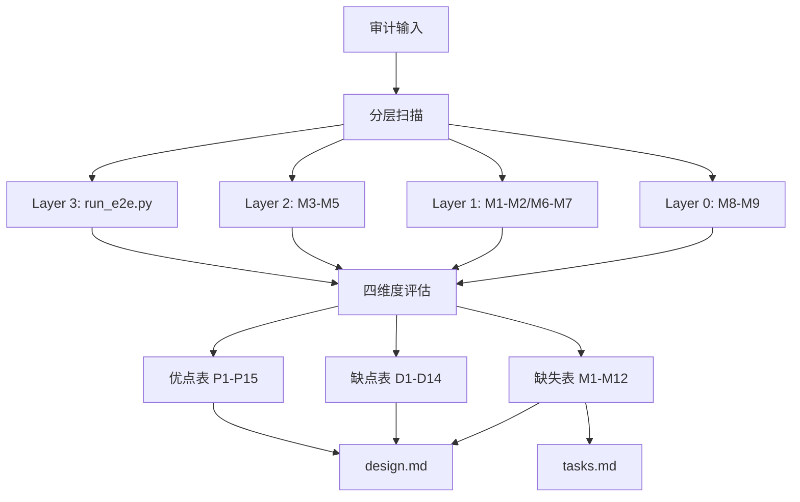

# design.md — ai_tests 深度审计与补全完善

## Technical Approach

采用"分层审计 + 四维度评估"方法，对 ai_tests 从 Layer 0-3 逐层扫描，每层评估实现完整性、代码质量、测试覆盖、文档一致性四个维度。

## 审计发现

### 一、优点（值得保留和推广的设计）

| # | 优点 | 证据 |
|---|------|------|
| P1 | **分层架构清晰** | Layer 0-3 四层架构（源码驱动→基础设施→用例执行→编排），模块职责单一 |
| P2 | **M1-M7 实现完整** | memu_controller/apk_deployer/case_parser/ui_executor/evidence_collector/rule_analyzer/report_generator 全部实质实现，非空壳 |
| P3 | **V3 双轨调度设计** | MD 轨 + Python 轨，Python 优先 + 降级回退，设计前瞻 |
| P4 | **8 类证据收集** | logcat/ui_xml/screenshot/activity_stack/db_state/prefs_state/web_api/meminfo，覆盖全面 |
| P5 | **4 规则串联判定** | 致命异常→警告→通过→手动，置信度强制，反馈信号输出 |
| P6 | **七件套报告** | report.md/json/manual_cases/summary/affected_modules/feedback_md/feedback_json，人读+机读双通道 |
| P7 | **路径式步骤自动拆分** | "我的→调试工具→编码转换" 自动拆为 3 个原子 click，解决 UI 导航痛点 |
| P8 | **步骤失败跳过** | 前序步骤失败后后续标记 SKIPPED，避免在错误页面执行 |
| P9 | **config.py 固化层** | 路径/超时/崩溃模式/DB 查询模板集中管理，标记"固化层不可直接修改" |
| P10 | **fixed_test_workflow.md SOP** | 固定测试流程 + 禁止临时脚本 + 脚本维护规则，用户反馈驱动沉淀 |
| P11 | **uiautomator2 自愈机制** | 阻塞弹框自动关闭 + click 找不到元素自动滚动查找 + App 崩溃检测 |
| P12 | **source_impact_analyzer 实现** | 基于 git diff 反向追溯受影响 Activity 和 TC-ID，V3 核心能力 |
| P13 | **feedback_loop 实现** | 规则扩展建议 + 提示词调优 + 陷阱库沉淀 + 回归历史记录 |
| P14 | **source_test_generator 实现** | 基于 Activity 源码生成 Python 测试骨架，自动 TC-ID 分配 |
| P15 | **单元测试覆盖 M1-M9** | 10 个测试文件，test_ui_executor 22 用例、test_source_test_generator 27 用例、test_source_impact_analyzer 15 用例 |

### 二、缺点（需要改进的问题）

| # | 缺点 | 严重度 | 影响范围 | 说明 |
|---|------|--------|---------|------|
| D1 | **临时脚本泛滥** | 🔴 高 | scripts/ | 28 个 temp_* 脚本 + 7 个 _v5*_* 私有脚本 + 1 个 _tmp_* 脚本 = 36 个临时/实验脚本，违反 fixed_test_workflow.md 禁止规则 |
| D2 | **V5 脚本未归档** | 🟡 中 | scripts/ | 40+ 个 v5_* 脚本已完成使命（V5.3 最终版已出），但仍散落在 scripts/ 根目录，未归档 |
| D3 | **subagent 脚本未整合** | 🟡 中 | scripts/ | 10 个 subagent_* 脚本独立存在，未与 lib/ 模块整合，重复代码风险 |
| D4 | **conftest.py 缺失** | 🟡 中 | tests/ | 无 conftest.py，测试 fixture 无法共享，每个测试文件重复 mock 设置 |
| D5 | **test_run_e2e.py 空壳** | 🔴 高 | tests/ | 编排层是核心模块，但测试文件为空（仅占位），编排逻辑无测试保障 |
| D6 | **test_memu_controller.py 空壳** | 🟡 中 | tests/ | M1 模拟器控制是基础设施，测试为空 |
| D7 | **test_rule_analyzer.py 简陋** | 🟡 中 | tests/ | 仅 1 个简单测试函数，4 规则串联判定的复杂逻辑未充分测试 |
| D8 | **cases/ 覆盖不足** | 🔴 高 | cases/ | 仅 6 个用例目录（F-P0-1/F-P0-5/F-P0-6/F-P0-7/F-P0-8/_index），对比 README 声称的 F-P0-1~F-P0-8 全模块，缺失 F-P0-2~F-P0-4 |
| D9 | **M9/M16 已实现未集成** | 🔴 高 | run_e2e.py | source_test_generator(461行)/feedback_loop(428行)模块已实现，但 run_e2e.py 的 --gen-test/--feedback 仍打印"未实现"警告且不调用，代码写好编排层没接上。M8 已正确集成。 |
| D10 | **requirements.txt 不完整** | 🔴 高 | 依赖管理 | 仅列出 7 个依赖（uiautomator2/adbutils/Jinja2/loguru/pydantic），缺少 pytest/requests/playwright/openai 等 scripts/ 中大量使用的依赖 |
| D11 | **lib/__init__.py 缺失** | 🟡 中 | lib/ | 无包初始化文件，run_e2e.py 需逐个 import |
| D12 | **scripts/ 无分类目录** | 🟡 中 | scripts/ | 150+ 脚本全部平铺在根目录，无子目录分类，可维护性差 |
| D13 | **部分 verify_* 脚本硬编码** | 🟡 中 | scripts/ | verify_v3.26.0717_bug_fix*.py 硬编码版本号，版本升级后失效 |
| D14 | **输出目录无统一管理** | 🟡 中 | scripts/ | 各脚本输出到 output/rss/ 不同文件名，无统一约定 |

### 三、缺失项（需要补全的功能）

| # | 缺失项 | 优先级 | 所属层级 | 说明 |
|---|--------|--------|---------|------|
| M1 | **pytest 配置文件** | 🔴 高 | 测试基础设施 | 无 pytest.ini / pyproject.toml [tool.pytest] 配置，测试发现路径、标记、插件未配置 |
| M2 | **CI/CD 集成** | 🟡 中 | 编排层 | 无 GitHub Actions / Jenkins 配置，E2E 测试未集成到 CI 流水线 |
| M3 | **conftest.py 共享 fixture** | 🔴 高 | 测试基础设施 | MEmu/device/临时目录等公共 fixture 无统一管理 |
| M4 | **test_run_e2e.py 编排测试** | 🔴 高 | 测试层 | 编排层是串联 M1-M9 的核心，无测试 = 无回归保障 |
| M5 | **F-P0-2~F-P0-4 用例** | 🔴 高 | 用例层 | book_source/cover_gallery/books 三大核心模块无 E2E 用例 |
| M6 | **scripts/ 目录分类** | 🟡 中 | 脚本管理 | core/v5/verify/diagnose/fix/temp 子目录 |
| M7 | **临时脚本清理** | 🔴 高 | 脚本管理 | 28 个 temp_* 脚本应删除或归档 |
| M8 | **V5 脚本归档** | 🟡 中 | 脚本管理 | 40+ v5_* 脚本归档到 scripts/archive/v5/ |
| M9 | **requirements.txt 补全** | 🔴 高 | 依赖管理 | 补充 pytest/requests/playwright 等 scripts/ 实际依赖 |
| M10 | **M9/M16 编排层集成** | 🔴 高 | 编排层 | run_e2e.py 的 --gen-test 需调用 source_test_generator.generate()，--feedback 需调用 feedback_loop.process()，当前均打印"未实现"警告 |
| M11 | **lib/__init__.py** | 🟢 低 | 包管理 | 添加包初始化，统一导出 M1-M9 |
| M12 | **source_map.json 维护** | 🟡 中 | V3 M8 | source_map.json 需随源码变更同步更新，当前可能过时 |

## Architecture Decisions

### AD-01: 审计产出形式选择
- **Context**: 审计结果可产出为 Markdown 报告、JSON 数据或 tasks.md 任务清单
- **Concern**: 需要平衡"人可读性"和"后续任务可执行性"
- **Decision**: 产出结构化 design.md（含优点/缺点/缺失三表）+ tasks.md（可执行任务清单）
- **Goal**: 审计结果既可作为本次分析结论阅读，也可直接驱动后续补全任务
- **Tradeoff**: design.md 表格形式不如自由文本灵活，但结构化利于检索和追踪
- **Status**: Accepted

### AD-02: 临时脚本处理策略
- **Context**: scripts/ 下有 36 个临时/实验脚本（temp_* / _v5*_* / _tmp_*）
- **Concern**: 直接删除有风险（可能含仍在使用的逻辑），保留则违反 SOP
- **Decision**: 先归档到 scripts/archive/temp/ 目录，确认无使用后再删除
- **Goal**: 消除 scripts/ 根目录的临时脚本，同时保留回退能力
- **Tradeoff**: 归档目录仍占磁盘空间，但比直接删除安全
- **Status**: Proposed

### AD-03: V5 脚本归档策略
- **Context**: 40+ v5_* 脚本属于已完成的 V5 优化阶段
- **Concern**: V5 已出最终版（V5.3），这些脚本不再活跃使用
- **Decision**: 移动到 scripts/archive/v5/ 子目录，保留完整但隔离
- **Goal**: scripts/ 根目录仅保留活跃脚本，V5 脚本可查但不再干扰日常使用
- **Tradeoff**: 如果后续需要 V5 修复回退，需从 archive 恢复
- **Status**: Proposed

## Data Flow

## File Changes

本次审计为只读分析，不修改任何代码文件。产出文档：

| 文件 | 操作 | 说明 |
|------|------|------|
| docs/specs/ai-tests-deep-audit/README.md | 新增 | 审计概述 |
| docs/specs/ai-tests-deep-audit/spec.md | 新增 | 需求规格 |
| docs/specs/ai-tests-deep-audit/design.md | 新增 | 审计发现（优点/缺点/缺失/方案） |
| docs/specs/ai-tests-deep-audit/tasks.md | 新增 | 补全任务清单 |
| docs/INDEX.md | 修改 | 添加审计条目 |
