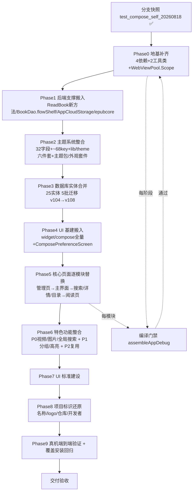
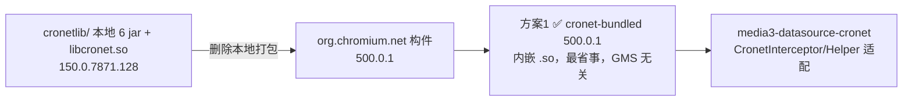
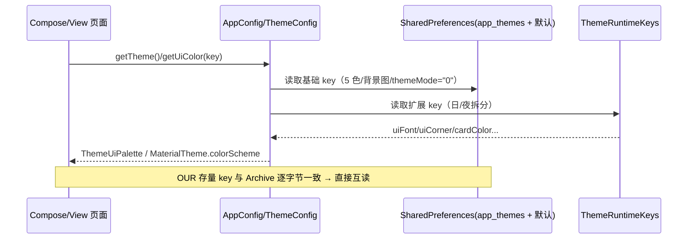
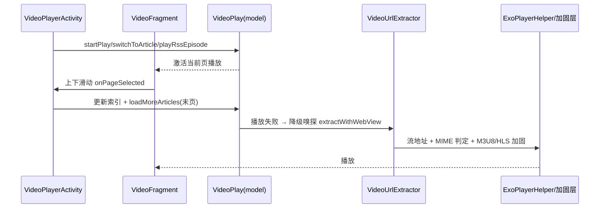

# Archive 前端 UI 迁移整合 — 技术设计（design.md）

> 修订 v2（2026-08-19）：基于最新 tag `archive-v3-3.26.08172114` 的 rev2 五份预研报告全面更新差异分析、阶段流水线与 ADR。
> 参考代码：OURS = `app/src/main/java/io/legado/app`；ARCHIVE = `archive-ref/legado-08172114/app/src/main/java/io/legado/app`
> 预研报告（rev2，gitignored）：`docs/temp-analysis/rev2-sa1~sa5-*.md`，本设计为其结论的正式化。

---

## 一、深度差异分析（子任务 5 交付物，基于最新 tag）

### 1.1 后端核心层（model / data / help）

| 层次 | 兼容性 | 关键结论 |
|------|:---:|------|
| `model/webBook`（WebBook 公开 API） | 🟢 高度兼容 | 12 个公开方法中 **11 个签名完全一致**；仅 `exploreBook/exploreBookAwait` 多 2 参数（`webViewPoolScope: WebViewPool.Scope = GLOBAL`、`shouldBreak`）→ 需给 OURS `WebViewPool` 补 `Scope` 枚举（编译硬约束①） |
| `model/analyzeRule`（规则引擎） | 🟢 完全兼容 | 文件清单完全一致 |
| `model/ReadBook`（全局单例） | 🟡 基本兼容 | `CallBack` 接口两端**逐字一致**；ARCHIVE 新增 10 个 OURS 无的方法（`reloadCurrentContent` / `invalidateParagraphRuleLayout` / `refreshCurrentParagraphRuleResult` / `invalidateEpubResource` / `markRecentRead` / `markReadAloudUserNavigation` 等）+ 5 个方法加参数（`moveToNextPage(fromReadAloud)` / `skipToPage` / `setPageIndex` / `saveRead(fullUpdate)` / `contentLoadFinish(requestGeneration)`）→ 需补方法或裁剪调用（编译硬约束②） |
| `model/VideoPlay` / `AudioPlay` | 🟡 部分兼容 | OURS 为增强版（RSS 路由/文章切换/嗅探降级）；ARCHIVE 精简版独有 `preloadNextEpisode`（章节链接缓存）→ 合并吸收 |
| `data/AppDatabase` | 🔴 不兼容 | 版本 OURS v104 vs ARCHIVE v109；OURS 独有 9 实体 / ARCHIVE 独有 25 实体（见 1.2） |
| `help/config` 主题系统 | 🔴 不兼容 | ARCHIVE ThemeConfig **32 字段** vs OURS 9 字段；ARCHIVE 独有 ~68 主题 PreferKey + `ThemeRuntimeKeys` 日夜拆分 + 主题包/外观套件（见 1.3） |
| `data/dao` | 🟡 部分兼容 | `BookChapterDao`/`BookSourceDao`（OURS 超集）完全一致；`BookDao` ARCHIVE 大幅扩展 `flowShelf*/BookShelfDisplay/BookShelfIdentity/getDisplayInfosByUrls` → 需补（编译硬约束⑤） |

**关键文件差异（搬入必读）**：

- **OURS 独有后端（必须保留）**：`AutoTask`（自动任务）、`CheckRssSource`、`SourceWeightCalculator`、`model/rss/RssSearchModel`+`RssSearchScope`（RSS 全局搜索）、`help/video/VideoUrlExtractor.kt`（嗅探核心）、`help/exoplayer/*`（8 文件增强：MimeSniffer/M3u8PreCheckDataSource/HlsKeyDataSourceFactory/PlayerInstancePool/VideoPreloader/FirstFramePreloader/DeviceInfoHelper）、`help/image/*`（ImageSnifferWebView/ImageUrlExtractor）、`model/VideoPlay.kt` 增强版、高亮体系（BookHighlight 实体 + help/Highlight* 8 文件）、封面图库（CoverGallery）、播放历史（PlayHistory）、书源回收站（SourceRecycleBin）、RSS 视频路由（RssEpisode/RssRoute）、M6 网络增强（SourceNetworkClient/RedirectCacheInterceptor/DohDns/NetworkLog 等）。
- **ARCHIVE 独有后端（随 UI 搬入，AI 与 EPub **完整搬入**，用户已确认）**：`localBook/epubcore/`（16 文件 EPub Core 新引擎）+ `EpubBox/EpubLayoutEngine` 系列；`MediaTocRefresh`；`ParagraphBubbleRenderer`；`help/AppCloudStorage.kt` + `lib/cloud/`（云存储抽象，被 ReadBookViewModel 等 20 文件引用）；`help/config` 新类（ThemePackageManager/AppearanceKitManager/TopBarConfig/MainBottomNavConfig/NavigationBarIconConfig/AdvancedTitle*/BookTag*/ParagraphRuleProcessor/ReadMenuCustomButtonExecutor 等）；**`help/ai/*` 全量**（AI 助手/AI 记忆/AI Agent/AI 绘图/角色/朗读 BGM/段落规则业务，含 AiChatViewModel 依赖的 OURS 完全没有的后端，不再裁剪）。

### 1.2 数据库实体差异（rev2-sa2）

- **两端共有 21 实体 + 1 视图 + rule/ 10 实体**（Book/BookSource/BookChapter/SearchBook/RssSource 等）完全一致。
- **OURS 独有 9 实体（均必须保留）**：BookHighlight（高亮）/ CoverGalleryGroup / CoverGalleryImage / PlayHistory / ReadRecordDetail / SourceRecycleBin / UrlRecord / AutoTaskRule / SourceGroupCover。
- **ARCHIVE 独有 25 实体**：ReadRecordDaily / ReadRecentBook / ParagraphRule / BookParagraphRule / ParagraphRuleVar / ReadMenuCustomButton / AiImageGroup / AiGeneratedImage / BookCharacter / BookCharacterRelation / BookAiChapterSummary / AiReadAloudRoleCache / AiReadAloudUsageRecord / ReadAloudBgmGroup / ReadAloudBgmTrack / ReadAloudBgmAssignmentCache / ReadAloudSpeakerGroup / ReadAloudSpeakerGroupItem / AiAgentSession / AiAgentJob / AiAgentTrace / AiMemoryItem / AiMemoryFragment / AiMemoryItemFts / AiMemoryFragmentFts。
- **共有表列冲突：0**。仅 `httpTTS` 需 +3 列（synthesisThreadCount / speakersJson / emotionsJson）。`books` 可后续补 6 索引（性能优化，非阻塞）。OURS 的 BookSource（+lastHost）/RssSource（+5 字段）为超集，合并以 OURS 为准。
- **合并策略**：以 OURS v104 为基座，将 ARCHIVE 独有 25 实体 + DAO 并入，新增迁移 `v104 → v105 → v106 → v107 → v108`（5 批，每批一个 Migration 对象）：
  - 批 1 v104→v105（阅读增强）：readRecentBooks / readRecordDaily / paragraph_rules / book_paragraph_rules / paragraph_rule_vars / read_menu_custom_buttons
  - 批 2 v105→v106（AI 绘图+角色+摘要）：ai_image_groups / ai_generated_images / book_characters / book_character_relations / book_ai_chapter_summaries（含 ARCHIVE 演进列折叠）
  - 批 3 v106→v107（AI 朗读语音）：ai_read_aloud_role_caches / ai_read_aloud_usage_records / read_aloud_bgm_* / read_aloud_speaker_group_*；**HttpTTS 加 3 列**
  - 批 4 v107→v108（AI Agent + 记忆）：ai_agent_sessions / ai_agent_jobs / ai_agent_traces / ai_memory_items / ai_memory_fragments / 2 个 FTS4 虚拟表（手动 CREATE VIRTUAL TABLE + 回填）
  - 批 5（可选）v108→v109：books 补 6 索引
- **⚠️ 关键陷阱**：不得直接复用 ARCHIVE `migration_90_91`…`migration_107_108`（与 OURS `89_90`…`103_104` 版本号冲突）；FTS4 虚拟表必须手动建表。

### 1.3 主题系统差异（rev2-sa3）

- **存储形态（两端相同，无 DB 表）**：默认 SharedPreferences + `app_themes` prefs + `files/themeConfig.json` + `externalFiles/bgImage*`。两端基础 key（`colorPrimary/colorAccent/colorBackground/colorBottomBackground(+Night)`、`backgroundImage(+Night)`、`themeMode` 等 19 个）**字符串逐字节一致** → 存量数据可直接互读。
- **ThemeConfig.Config：OURS 9 字段 → ARCHIVE 32 字段**。ARCHIVE 多 23 个**带默认值的可空扩展字段**（backgroundImgCrop / bookInfoBackgroundImgPath / panelBackgroundImgPath / panelBackgroundScaleType / panelBorderColor / panelBorderAlpha / uiCornerScale / uiLayoutAlpha / dialogAlpha / cardColor / mutedColor / searchFieldBackgroundColor / tabBackgroundColor / shelfColor / cardShadow / cardBackgroundBlur / uiCornerSearchFollow / uiCornerReplyFollow / fontScale / uiFontPath / titleFontPath / uiFontColor / titleFontColor）→ 旧 9 字段 JSON 反序列化天然兼容。
- **PreferKey：OURS 18 → ARCHIVE ~68**（核心 18 两端共有 + ARCHIVE 独有 ~50 个日夜双键）。
- **ThemeRuntimeKeys 体系（ARCHIVE 独有，`lib/theme/ThemeRuntimeKeys.kt`）**：34 个 allKeys，17 组日夜键对 + `migrateLegacyNightValues` 一次性夜间键迁移（App.attachBaseContext 调用）+ `activeColorKey` 归一化。
- **Compose 主题层两套体系**：OURS 用 `ui/theme/LegadoTheme`（5 色→M3 34 槽位）+ `ThemeSync` 全局重组；ARCHIVE 用 `lib/theme/ThemeUiPalette`（组件级取色）+ `UiCorner`/`ComposeUiCorner`（圆角/面板/透明度）+ `UiTypography`（界面/标题字体）+ `LegadoComposeTheme`（字体下发）+ `TopBarSearchStyle` + `ComposeThemeImageLayer` + `AppUiTokens`。
- **themeMode 语义两端一致**（"0"跟随/"1"日/"2"夜/"3"墨水），**仅默认值不同**：OURS "2"（固定夜间）vs ARCHIVE "0"（跟随系统）→ **用户已确认跟随 Archive 语义（"0"）**。
- **迁移顺序建议**：① ThemeConfig.Config 扩 32 字段 → ② 补 ~50 扩展 PreferKey + ThemeRuntimeKeys + migrateLegacyNightValues → ③ 补 `lib/theme` 六件套 → ④ 补 `ui/widget/compose` 主题组件 → ⑤ 按需搬 ThemePackageManager/AppearanceKitManager。

### 1.4 UI-ViewModel 接口契约（rev2-sa4）

- **基类同构**：`io.legado.app.base` 9 文件同名同结构；`BaseViewModel`/`VMBaseActivity`/`VMBaseFragment` 逐字节一致。
- **ViewModel 后端依赖高度同源**：抽查 7 个 ARCHIVE 核心 ViewModel（Search/BookSource/Toc/ExploreShow/BookInfo/Bookshelf/AiChat），前 6 个的搜索/书源/阅读后端依赖（SearchModel/WebBook/ReadBook/LocalBook/BookHelp/AnalyzeUrl/AppWebDav 等）**OURS 全部存在**；AiChatViewModel 依赖 OURS 完全没有的 `help/ai/*`，**随 AI 完整搬入（用户已确认）一并补齐，不再排除**。
- **编译硬约束仅 3 点**：
  1. `utils/SearchBookMergeUtils`（ExploreShowViewModel 搜索结果合并去重）— 从 ARCHIVE 复制（低）
  2. `ui/video/VideoBookPreloader`（SearchViewModel 搜索视频封面预加载）— 从 ARCHIVE 复制（低）
  3. `WebViewPool.Scope` 枚举（WebBook.exploreBook 签名，ExploreShow 链路）— 给 OURS WebViewPool 补枚举（中）
- **第三方依赖差异**：OURS 缺 ARCHIVE 的 4 个 Compose 生态依赖：`top.yukonga.miuix.kmp:miuix-android:0.8.8`、`sh.calvin.reorderable:reorderable:3.1.0`、`com.github.nanihadesuka:LazyColumnScrollbar:2.2.0`、`com.qmdeve.liquidglass:core:1.0.3`；composeBom 落后一版（2025.04 vs 2025.10）；kotlin/agp 完全一致（2.3.10 / 8.13.2）；media3 OURS 更新（1.10.1 vs 1.8.0，向下兼容）；ssiv（长图）/brotli/firebase 为 OURS 独有需保留。
- **两套 Compose 组件库并存**：OURS `widget/components`（60+ 文件，自研 M3）与 ARCHIVE `widget/compose`（21 文件，基于 miuix）**互不兼容** → 整体搬入 Archive 库 + 保留 OURS 库（特色功能在用），入口/命名隔离。
- **导航差异**：OURS 固定 4 标签（自研 PillNavigationBar）；ARCHIVE 可配置 5 标签（多"阅读记录"，Material BottomNavigationView + MainBottomNavConfig）→ 迁移以 Archive 为准，可配置化。

### 1.5 本项目特色功能接线（rev2-sa5，A=全保留 / B=复用等价+桥接）

| 特色 | 后端 | UI | ARCHIVE 等价 | 保留方案 |
|------|------|-----|------|:---:|
| ① 视频播放器+嗅探+上下滑动下一集 | `model/VideoPlay`（增强版）、`help/video/VideoUrlExtractor`（R5 降级链）、`help/exoplayer/*`（8 文件增强）、`help/gsyVideo/*`（10 文件等价）、`help/http/BackstageWebView`(SnifferWebClient) | `ui/video/*`（11 文件：VideoPlayerActivity/VideoFragment/VideoPagerAdapter/WebViewVideoPlayer/VideoSettingsPanel/RssRouteAdapter/RssEpisodeAdapter…） | 播放器基底等价；无嗅探/无滑动切换/无预加载；ARCHIVE 独有 `chapterLinkCache` 预加载 | **A**（后端+UI 全保留，合并 ARCHIVE 链接缓存） |
| ② 图片播放器+图片嗅探 | `model/ImageProvider`、`model/ReadManga`（含嗅探兜底）、`help/image/*`（ImageUrlExtractor/ImageSnifferWebView） | `ui/image/*`（12 文件：ImageGallery/ImageDetail/ImagePlay/ImageCanvas/ImagePyramidLoader…） | 无（仅 ImageCrop 裁剪） | **A**（全保留）；漫画基底 **B**（复用 ARCHIVE + 回填 OURS Webtoon/嗅探增量） |
| ③ 订阅源全局搜索 | `model/rss/RssSearchModel`/`RssSearchScope`、`data/entities/SearchRssArticle` | `ui/rss/search/*`（8 文件） | 仅单源站内搜索 | **A**（全保留） |
| ④ 发现/订阅分组编辑 | `SourceGroupCover` 实体/DAO、`RssSource.group`（两版一致） | `ui/adapter/SourceFolderAdapter`、`ui/main/explore/ExploreFragment`、`ui/main/rss/RssFragment`、`ui/rss/source/manage/GroupManageDialog` | 书源/书籍分组等价（Compose 通用组件 `GroupManageComposeDialog`）；订阅源分组缺入口；分组封面缺 | **B**（复用 ARCHIVE 通用分组组件 + 桥接补订阅源入口 + A 保分组封面） |
| ⑤ 高亮规则+杂项 | `help/Highlight*`（8 文件）、`BookHighlight` 实体、`SourceGroupCover`、RuleSub | `ui/highlight/*`、`ui/book/read/config/HighlightRule*`、`ui/rss/subscription/*` | 高亮规则/实体/分组封面全无；RuleSub 等价 | 高亮 **A**；分组封面 **A**；RuleSub **B** |

**关键接线点（不可丢）**：
1. 视频滑动切换链：`VideoPlayerActivity.ViewPager2(VERTICAL)` → `onPageSelected` → 更新索引 → `VideoFragment.activatePlayer()` → `VideoPlay.switchToArticle/playRssEpisode`；触摸链 `VideoFragment.initGestureDetector → handleArticleModeTouchEvent`；WebView 降级靠 `WebViewVideoPlayer.onInterceptTouchEvent`。
2. 嗅探链：`VideoPlay.startPlay` 降级 → `VideoUrlExtractor.extractWithWebView`（JS 覆写 fetch/XHR）+ `BackstageWebView.SnifferWebClient` + `MimeSniffer`。
3. 分组编辑入口：`ExploreFragment`/`RssFragment` 的 `showDialogFragment<GroupManageDialog>()` + Compose `GroupTabRow` + `SourceGroupCover`（KIND_BOOK/KIND_RSS）。

### 1.6 编译硬缺口总表（ARCHIVE UI → OURS 后端，均有源码引用实证）

| # | 缺失项（OURS 无） | ARCHIVE UI 引用实证 | 结论 |
|---|-------------------|---------------------|------|
| ① | `WebViewPool.Scope` 枚举 + `exploreBook` 的 `webViewPoolScope` 参数 | ExploreShowViewModel.kt:80,109；ExploreFragment.kt:929,3477 | 编译失败 → Phase 0 补 |
| ② | `ReadBook.reloadCurrentContent / invalidateParagraphRuleLayout / refreshCurrentParagraphRuleResult` 等 10 新方法 + 5 方法加参 | ReadBookActivity.kt、ReadBookViewModel.kt、ParagraphRuleManageActivity.kt、SourceLoginJsExtensions.kt、OnLineImportActivity.kt（5 文件） | 编译失败 → Phase 1 补 |
| ③ | `appDb.bookCharacterDao / paragraphRuleDao / readRecentBookDao / readRecordDailyDao` 等 14 个 ARCHIVE 独有 DAO | ui/book/character/*、ParagraphRule*、MainActivity.kt、AiChatActivity.kt、ReadRecordFragment.kt 等（15 文件） | 编译失败 → Phase 1/3 补 |
| ④ | `ParagraphRuleProcessor / ReadAloudBgmPlayer / AppearanceKitManager / epubcore`（`model/localBook/epubcore/` 整个包） | ReadBookActivity.kt、EpubReadView.kt、AppearanceKitActivity.kt、ThemeManageActivity.kt、TopBarManageActivity.kt 等（13 文件） | 编译失败 → Phase 1/2 补（**完整搬入，用户已确认**，不裁剪） |
| ⑤ | `BookDao.flowShelf* / BookShelfDisplay / BookShelfIdentity / getDisplayInfosByUrls` 系列 | BookshelfFragment1.kt、BookshelfCompose*.kt、RssFragment.kt、ExploreFragment.kt、ExploreShowViewModel.kt 等（12 文件） | 编译失败 → Phase 1 补 |
| ⑥ | `SearchBookMergeUtils` / `VideoBookPreloader`（2 工具类） | ExploreShowViewModel.kt、SearchViewModel.kt | 编译失败 → Phase 0 复制 |
| ⑦ | 4 个 Compose 生态依赖（miuix/reorderable/lazyColumnScrollbar/liquidglass） | widget/compose 全库 + MainActivity（StableLiquidGlassView） | 编译失败 → Phase 0 补 |

---

## 二、Technical Approach

### 2.1 迁移总体流水线（10 阶段，用户调整后阶段划分）

### 2.2 分层搬入策略

- **地基先行（Phase 0）**：先加 4 依赖 + 复制 2 工具类 + 补 `WebViewPool.Scope`，保证 ARCHIVE 核心 UI 的 import 依赖可解析，后续每阶段可编译验证。
- **后端支撑先行（Phase 1）**：`ReadBook` 新方法、`BookDao.flowShelf*` 系列、AppCloudStorage/lib/cloud、epubcore、config 新类。
- **主题引擎先行（Phase 2）**：UI 层 Compose 组件大量依赖 `lib/theme` 六件套，必须先就位。
- **数据库先行（Phase 3）**：新实体/DAO 在 UI 层引用前就位（覆盖安装迁移链同步）。
- **UI 基建先行（Phase 4）**：`ui/widget/compose/*` 组件库是全量 Compose 页面的地基。
- **核心页面按依赖顺序替换（Phase 5）**：先替换无特色依赖的管理页（书源/配置/主题管理），再替换主界面（书架/发现/我的/订阅），再替换阅读/详情/目录。
- **特色整合（Phase 6）**：按 P0/P1/P2 分级回填（见 1.5 接线点）。
- **每阶段后立即编译**：`assembleAppDebug`，杜绝大爆炸式一次替换。

### 2.5 Cronet 升级（子任务 1，方案 1 已确认）

当前：`gradle.properties` `CronetVersion=150.0.7871.128`；`app/build.gradle` 通过 `implementation(fileTree(dir: 'cronetlib', include: ['*.jar', '*.aar']))` 打包本地 6 个 jar；原生库 `libcronet.so` 由打包脚本并入 APK（内部打包，体积大）。

目标 `500.0.1`（2026-07-29 发布，Google 版本号体系重置；`cronet-api`/`cronet-embedded` 已标记 DEPRECATED 过渡空件，替代构件为 `cronet` / `cronet-bundled`）。

**打包策略（用户已确认：方案 1 `cronet-bundled`）**：

**实施要点**：
1. `CronetVersion=500.0.1`，`CronetMainVersion` 同步调整。
2. 删除 `app/cronetlib/` 本地文件树与 `fileTree` 依赖，改 `cronet-bundled:500.0.1` Maven 构件。
3. 验证 `org.chromium.net.*` API 兼容（`CronetHelper.kt`/`CronetInterceptor.kt` 使用的 `ExperimentalCronetEngine`/`UrlRequest.Builder`/`UploadDataProvider` 为长期稳定 API，跨大版本风险低）。
4. 更新 `cronet-proguard-rules.pro`（keep 规则按 500.0.1 构件调整）。
5. 构建对比 APK 体积（验证减包效果）与嗅探/播放功能（真机）。

> 说明：方案 2（`cronet:500.0.1` + `play-services-cronet`，GMS 提供运行时）减体积最明显但国内无 GMS 设备不可用，列为后续可选优化项（不阻塞本期）。

---

## 三、Architecture Decisions（ADR）

### AD-01: 迁移基座方向（用户调整意见落实）
- **Context**: 两端同源 fork；本项目为存量事实标准（git 历史/远程/数据库 v104 迁移链），Archive UI 更成熟完整但数据库 v109、主题系统重做。
- **Concern**: 以谁为 git 基座、如何保证覆盖安装升级无痛、如何保留项目标识。
- **Decision**: **以本项目为 git 基座**（分支保留 WIP 快照），数据库以 v104 迁移链为基座增量并入 Archive 实体；UI 层以 Archive **最新 tag（archive-v3-3.26.08172114）** 为蓝本分层搬入；项目标识以本项目为准；**独立项目实施**（本次不向 Archive 上游提交合并申请，备用方案另行评估）。
- **Goal**: 保留本项目升级路径与标识，UI 达到 Archive 水准。
- **Tradeoff**: 需手工合并 Archive 迁移链（v104→v108 增量 5 批），单次变更量大；放弃"以 Archive 为基座"的省力路径。
- **Status**: Accepted（检查点 1 确认基座方向 + 迁移分支 migration-archive-ui）

### AD-02: Cronet 打包策略（用户已确认）
- **Context**: 当前 cronet 本地打包（6 jar + libcronet.so）增大 APK；目标 500.0.1 构件结构变化（cronet-api/embedded 过渡空件）。
- **Concern**: 去掉内部打包减小包体积，同时不破坏嗅探/播放能力与国内可用性。
- **Decision**: **方案 1 `cronet-bundled:500.0.1`**（用户已确认），Maven 构件替代本地打包，彻底摆脱 `cronetlib/` 维护。
- **Goal**: 升级 500.0.1、消除内部打包、减小 APK 体积。
- **Tradeoff**: `cronet-bundled` 仍内嵌 .so（减体积有限）；方案 2（play-services-cronet）列为后续可选优化。
- **Status**: Accepted（检查点 1 确认）

### AD-03: 主题系统整合（用户已确认 themeMode）
- **Context**: Archive 重做主题系统（32 字段 ThemeConfig + ~68 PreferKey + ThemeRuntimeKeys + ThemeUiPalette + 主题包/外观套件），OURS 为基础版 + 自研 LegadoTheme/ThemeSync。
- **Concern**: Archive UI 读取新主题 key，OURS 无 → 编译失败/缺失。
- **Decision**: 直接采用 Archive 主题系统（连带搬入 `ThemeRuntimeKeys`/`ThemeUiPalette`/`UiCorner`/`ComposeUiCorner`/`UiTypography`/`LegadoComposeTheme`/`TopBarSearchStyle`/`ThemePackageManager`/`AppearanceKitManager`/`ThemeManageActivity`）；保留 OURS `ThemeSync`/`LegadoTheme` 驱动存量页；执行一次性夜间键迁移（`migrateLegacyNightValues`）；**`themeMode` 默认值跟随 Archive 语义（"0"跟随系统，用户已确认）**。
- **Goal**: Archive UI 主题能力完整可用，OURS 存量主题数据直接互读。
- **Tradeoff**: 主题复杂度上升、两套 Compose 主题并存、行为差异（日间背景过亮守卫与字体撞色守卫并存）。
- **Status**: Accepted（检查点 1 确认 themeMode）

### AD-04: 数据库迁移链合并（rev2 更新）
- **Context**: OURS v104 vs ARCHIVE v109，各有一批独有实体（OURS 9 / ARCHIVE 25）。
- **Concern**: Archive UI 依赖的新实体 OURS 无；OURS 特色实体 Archive 无；覆盖安装升级不能断。
- **Decision**: 以 OURS v104 为基座，将 Archive 25 独有实体 + DAO 并入，新增迁移 `v104→v105→v106→v107→v108`（5 批，每批一个 Migration 对象），OURS 9 特色实体保留；Archive 迁移链不直接照搬（版本号冲突）；共有表仅 HttpTTS +3 列；FTS4 虚拟表手动建表。
- **Goal**: 覆盖安装升级无痛、存量数据保留、新 UI 依赖实体可用。
- **Tradeoff**: 迁移链合并工作量大；AI/朗读等功能本阶段仅建表、业务后置（默认不搬对应 UI）。
- **Status**: Proposed

### AD-05: 特色功能整合（A/B 分级）
- **Context**: OUR 特色（视频/图片播放器 + 嗅探 + 上下滑动、RSS 全局搜索、分组编辑、高亮）Archive 无或弱。
- **Concern**: 搬入 Archive UI 后特色功能丢失。
- **Decision**: OUR 特色后端全保留；按 **A（全保留）/B（复用等价+桥接）** 分级整合（见 1.5）：①视频（A）②图片（A，漫画 B）③RSS 全局搜索（A）④分组编辑（B 复用 Archive 通用组件 + A 保分组封面）⑤高亮（A）+ 规则订阅（B）；特色 UI 接入 Archive 组件库统一外观；优先级 P0（视频/图片/全局搜索）> P1（分组编辑/高亮）> P2（漫画/规则订阅/分组封面）。
- **Goal**: 特色能力在新 UI 上完整可用且不退化。
- **Tradeoff**: 特色 UI 需二次适配外观统一，避免风格割裂。
- **Status**: Proposed

### AD-06: 前端 UI 标准建设
- **Context**: 用户要求在迁移过程中实时沉淀 UI 标准，供后续扩展。
- **Concern**: 迁移后新增页面风格不一。
- **Decision**: 以 Archive 的 `ui/widget/compose` 组件库 + `ThemeUiPalette` 取色 + `ComposeUiCorner` 圆角 + `AppUiTokens` 尺寸为基线，在 `docs/project-flow/ui-standards/` 建设标准文档；每迁移一个模块即登记（组件清单/取色表/间距圆角/页面骨架/迁移登记表）。
- **Goal**: 形成可复用的 UI 标准，支撑后续新功能扩展。
- **Tradeoff**: 文档维护成本（以模块为单位增量维护，避免一次性大文档）。
- **Status**: Proposed

### AD-07: 项目标识还原
- **Context**: 项目名称/logo/仓库地址/开发者为本项目标识。
- **Concern**: 迁移后标识被 Archive 覆盖。
- **Decision**: 应用名（strings.xml）、启动图标与 logo 资源、关于页仓库地址与开发者信息统一改回本项目；Archive 相关署名清理。
- **Goal**: 交付物体现本项目个人项目特征。
- **Tradeoff**: 需逐资源核对清理，避免遗漏 Archive 署名。
- **Status**: Proposed

---

## 四、Data Flow

### 4.1 主题配置流（迁移后）

### 4.2 视频播放特色链路（保留）

---

## 五、File Changes（变更清单）

> 迁移分支：`migration-archive-ui`（从 master 干净点创建）。逐阶段列出主要文件变更，具体以各 Phase 任务执行为准。

### Phase 0 地基补齐
- `gradle/libs.versions.toml`：+miuix 0.8.8 / reorderable 3.1.0 / LazyColumnScrollbar 2.2.0 / liquidglass 1.0.3；composeBom 对齐 2025.10.00
- `app/src/main/java/io/legado/app/utils/SearchBookMergeUtils.kt`（新，从 ARCHIVE 复制）
- `app/src/main/java/io/legado/app/ui/video/VideoBookPreloader.kt`（新，从 ARCHIVE 复制）
- `app/src/main/java/io/legado/app/help/webView/WebViewPool.kt`（补 `Scope` 枚举 GLOBAL/DISCOVERY/RSS）
- `app/src/main/java/io/legado/app/model/webBook/WebBook.kt`（`exploreBook/exploreBookAwait` 补 `webViewPoolScope`/`shouldBreak` 参数）

### Phase 1 后端支撑搬入
- `model/ReadBook.kt`（补 10 新方法 + 5 方法加参）
- `data/dao/BookDao.kt`（补 `flowShelf*`/`BookShelfDisplay`/`BookShelfIdentity`/`getDisplayInfosByUrls` 系列）
- `help/AppCloudStorage.kt` + `lib/cloud/`（新，云存储抽象）
- `model/localBook/epubcore/`（新，16 文件 EPub Core 引擎，若搬阅读 UI）
- `model/MediaTocRefresh.kt`、`ParagraphBubbleRenderer.kt`（新）
- `help/config/` 新类（AppearanceKitManager/TopBarConfig/MainBottomNavConfig/NavigationBarIconConfig 等，随 UI 引用）

### Phase 2 主题系统整合
- `help/config/ThemeConfig.kt`（升级 32 字段 + AtomicTextFileStore 原子写 + 背景图安全校验）
- `constant/PreferKey.kt`（新增 ~50 主题 key）
- `lib/theme/ThemeRuntimeKeys.kt`、`ThemeUiPalette.kt`、`UiCorner.kt`、`ComposeUiCorner.kt`、`UiTypography.kt`、`LegadoComposeTheme.kt`、`TopBarSearchStyle.kt`（新）
- `help/config/ThemePackageManager.kt`、`AppearanceKitManager.kt`（新，主题包/外观套件）
- `ui/widget/compose/ComposeThemeImageLayer.kt`、`AppUiTokens.kt`（新）
- `ui/config/ThemeManageActivity.kt`、`AppearanceKitActivity.kt`（新）
- 保留：`ui/theme/ThemeSync.kt`、`LegadoTheme.kt`（驱动存量页面）

### Phase 3 数据库实体合并
- `data/entities/*`（新增 Archive 25 实体，含 2 个 FTS4）
- `data/dao/*`（新增 14 个 DAO）
- `data/AppDatabase.kt`（bump v104 → v108，5 批迁移；HttpTTS +3 列）
- `app/schemas/io.legado.app.data.AppDatabase/`（新增 schema 快照）

### Phase 4 UI 基建搬入
- `ui/widget/compose/*`（新，全量组件库 21 文件）
- `lib/prefs/fragment/ComposePreferenceScreen.kt`（新）
- `ui/config/compose/ComposeSettingFragment.kt`（新）

### Phase 5 核心页面逐模块替换
- `ui/main/`（MainActivity/书架/发现/我的/订阅/阅读记录）整体替换为 Archive 版
- `ui/book/source/`、`ui/book/search/`、`ui/book/info/`（BookInfoCompose）、`ui/book/toc/`（TocComposeScreen）、`ui/book/read/`、`ui/config/` 按模块替换
- **AI UI 完整搬入（用户已确认）**：`ui/book/character/*`、AiChatActivity、朗读 BGM/段落规则管理页等
- 每模块：删本项目旧文件 → 搬 Archive 文件 → 编译 → 验证 → 核心功能单测

### Phase 6 特色功能整合
- P0：保留 `ui/video/*`（11 文件）、`ui/image/*`（12 文件）、`ui/rss/search/*`（8 文件）；`model/VideoPlay` 合并 ARCHIVE 链接缓存；接入 Archive 组件库
- P1：`ui/main/explore/ExploreFragment`、`ui/main/rss/RssFragment` 重新注入分组入口；高亮 `ui/highlight/*` 保留
- P2：漫画复用 ARCHIVE `ui/book/manga/` + 回填 OURS 增量；RuleSub 直接用 ARCHIVE 版；分组封面 `SourceFolderAdapter` 适配主题

### Phase 7 UI 标准建设
- `docs/project-flow/ui-standards/`（组件目录 / 取色表 / 间距圆角 / 页面骨架 / 迁移登记表）

### Phase 8 项目标识还原
- `app/src/main/res/values/strings.xml`（应用名）
- `app/src/main/res/mipmap-*/`、logo 资源
- 关于页：仓库地址、开发者信息

### Phase 9 验证
- `ai_tests` 全量用例 + 覆盖安装回归 + 包体积对比

---

## 六、风险与对策

| 风险 | 等级 | 对策 |
|------|:---:|------|
| 超大 diff 编译失败 | 高 | 10 阶段分层 + 每层编译门禁；迁移分支独立，随时可回退 |
| 数据库迁移链合并出错（版本号冲突/FTS 回填） | 高 | 以 OURS v104 为基座逐步 bump；手动建表（CREATE TABLE IF NOT EXISTS）；覆盖安装真机回归 |
| 特色功能在替换后回归 | 高 | 特色后端全保留；特色 UI 单独 Phase6 整合（P0/P1/P2）+ 真机端到端验证 |
| 两套 Compose 组件库并存冲突 | 中 | 以 Archive 为主，OURS `widget/components` 仅驱动特色功能页，包路径/命名隔离 |
| 主题行为差异（夜间默认值） | 中 | 已确认跟随 Archive（"0"跟随系统）；一次性夜间键迁移 `migrateLegacyNightValues` |
| ARCHIVE 重 AI 功能 UI 硬依赖缺失 | 中 | **完整搬入**（用户已确认）：`help/ai/*` 业务 + `ui/book/character/*`、AiChatActivity 等 UI 全量搬入，不做"仅建表保编译"裁剪；搬入后按模块写单测验证 |
| 包体积目标不达 | 低 | Cronet 方案 1（cronet-bundled）已确认；方案 2（play-services-cronet）列为后续可选优化 |

---

*关联文档：`docs/specs/archive-ui-migration-202608/README.md` / `spec.md` / `tasks.md`；预研报告 `docs/temp-analysis/rev2-sa1~sa5`*
