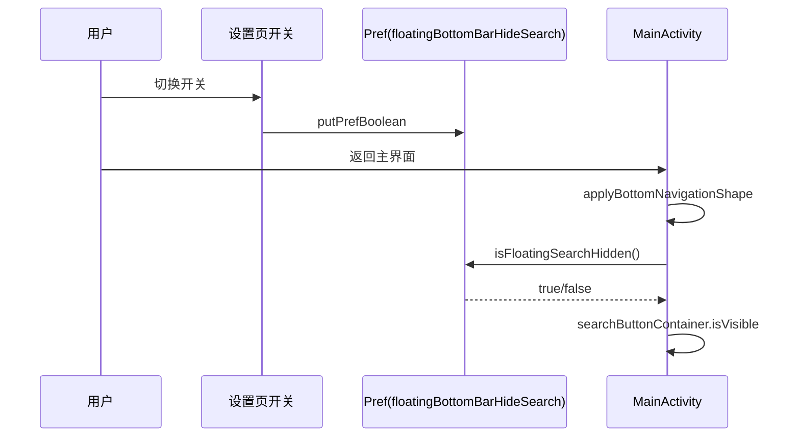
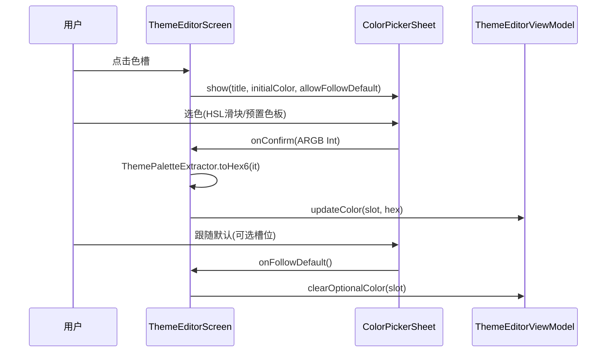

# Design: ui-settings-fix-pack

> 状态：设计中 ｜ 上游：spec.md ｜ 源码锚点核验日：2026-09-06

## Technical Approach

三个修复组相对独立，共用"复用既有机制 + 最小入口改动"原则：

```mermaid
flowchart LR
    subgraph F1[搜索框显隐]
        A1[我的设置页<br/>新快捷开关] -->|读写| P1[(floatingBottomBarHideSearch)]
        A2[底栏管理编辑<br/>既有开关保留] -->|读写| P1
        P1 --> C1[MainActivity<br/>isFloatingSearchHidden]
        P1 --> C2[MainTopBarView<br/>isFloatingSearchHidden]
        C1 --> R1[searchButtonContainer<br/>isVisible]
    end
    subgraph F2[字号截断修复]
        B1[模拟器 1.6x 实测<br/>截断点清单] --> B2[逐点修复<br/>height→heightIn(min)]
        B2 --> B3[1.0x 回归验证]
    end
    subgraph F3[取色器恢复]
        D1[ThemeEditorScreen<br/>editingSlot 弹窗] -->|替换| D2[ColorPickerSheet<br/>+allowFollowDefault 扩展]
        D2 -->|onConfirm hex| D3[updateColor/<br/>clearOptionalColor]
    end
```

### F1 搜索框显隐

**现状链路**（全部保留不动）：
- 配置：`AppConfig.bottomBarLayoutMode`（默认 `"floating"`，[AppConfig.kt L2229](file:///f:/myself/github/WeAgentChat/temp/legado/app/src/main/java/io/legado/app/help/config/AppConfig.kt#L2229)）+ `MainLayoutPresetConfig.floatingBottomBarHideSearch()`（pref 读写）
- 判定：`MainActivity.isFloatingSearchHidden()` L723 = mode=="floating" && hideSearch
- 渲染：`applyBottomNavigationShape` L840 `searchButtonContainer.isVisible = !standardMode && !searchHidden`
- 既有开关 UI：[NavigationBarManageActivity.kt L541-547](file:///f:/myself/github/WeAgentChat/temp/legado/app/src/main/java/io/legado/app/ui/config/NavigationBarManageActivity.kt#L541-L547)（仅 floating 分支）

**两层配置体系**（红队 R3-2/R5-1 实测，实施必须理解）：
- **权威源**：底栏套装包（NavigationBarIconConfig.Entry），字段 `hideSearchInFloatingStyle`（data class 字段，NavigationBarManageActivity L545 写的是它）
- **派生缓存**：`AppConfig.floatingBottomBarHideSearch` pref，仅经 `NavigationBarIconConfig.apply`/`applyCurrentBottomConfig`（L229/L247）从包配置同步；反向经 defaultEntry L718 回读
- **回滚路径（4 条）**：①自定义包激活时 `refreshBottomNavigationConfig`（MainActivity L686-690）签名不含 pref → 返回主界面不刷新 pref ②NAVIGATION_BAR_CHANGED 等事件 → applyCurrentBottomConfig 用包配置覆写 pref ③AppearanceKitManager L556 套装应用覆写 ④floating→standard→floating 往返 normalizeConfig L1316 归 false 后 apply 覆写
- **默认套装例外**：默认套装 currentSignature（L217）含 pref → onResume（L363-369）返回主界面会重读 pref 生效

**改动**：
1. 我的设置页新增快捷开关条目（落点：[OtherConfigFragment.kt](file:///f:/myself/github/WeAgentChat/temp/legado/app/src/main/java/io/legado/app/ui/config/OtherConfigFragment.kt) 界面设置区，ComposeSettingFragment 体系 `switch(key=PreferKey.floatingBottomBarHideSearch)`，SettingSwitchSpec 走 booleanSetting 链路），summary 标注"悬浮底栏模式下生效"
2. **防回滚裁决（红队 R5-1 (a)+(b) 组合）**：当激活自定义底栏套装（`NavigationBarIconConfig.activeDirName != DEFAULT_DIR_NAME`）时隐藏设置页开关条目（套装配置为权威源）；默认套装下正常显示。禁止给开关挂 NAVIGATION_BAR_CHANGED 事件补刷新（会触发 applyCurrentBottomConfig 覆写 pref 的 clobber 陷阱）
3. 底栏管理既有开关不动（floating 分支内；默认套装下两入口经 currentSignature/defaultEntry 往返天然一致）
4. 刷新：默认套装下主界面 onResume 链路已重读 pref 返回即生效；实施时真机验证，若不生效再评估专用轻量刷新事件（仅触发 applyBottomNavigationShape，不复用 NOTIFY_MAIN）

**standard 模式裁决**：standard 分支不加开关——布局本身恒隐藏悬浮搜索按钮（L840 `!standardMode` 恒 false），加开关只会制造无效配置。

### F2 字号截断修复

**生效机制**（已核验）：`AppContextWrapper` L57-61 `configuration.fontScale = prefInt/10f`（有效域 0.8~1.6，脏值回退系统值），全局 `.sp` 文本随缩放。设置 UI：[ThemeManageActivity.setupFontScaleRow L821-847](file:///f:/myself/github/WeAgentChat/temp/legado/app/src/main/java/io/legado/app/ui/config/ThemeManageActivity.kt#L821-L847)（NumberPicker 8~16，默认 10）。

**实施方法**：
1. 模拟器 fontScale=16 走查清单：书架（两布局）/发现/订阅/我的/阅读菜单/阅读设置弹窗/主题设置/搜索页/书籍详情/常用确认弹窗
2. 每个截断点记录：页面 + 组件 + 文件行号 + 现象
3. 修复模式（按优先级）：
   - `Modifier.height(固定dp)` 且子含文本 → `heightIn(min = 固定dp)`（保持视觉最小高度，文本可撑开）
   - `heightIn(max=)` 截断文本 → 放宽 max 或移除
   - 固定行高 `lineHeight` 小于放大字号 → 随 sp 缩放（改用 sp 单位或取消固定）
   - 第三方/深层组件不可修 → 外层容器自适应或登记已知限制
4. 禁止：批量 sed 替换、改动非文本容器（图标/分隔条/色块的固定高度是刻意的）

### F3 取色器恢复

**现状**：
- 孤儿组件：[ColorPickerSheet.kt](file:///f:/myself/github/WeAgentChat/temp/legado/app/src/main/java/io/legado/app/ui/widget/components/ColorPickerSheet.kt)（AppModalBottomSheet 容器，预置色板 MATERIAL_COLORS + HSL 三滑块 + 活预览，API：`title: String / initialColor: Int / onConfirm: (Int) -> Unit / onDismiss: () -> Unit`）
- 现调用点：[ThemeEditorScreen.kt L128-146](file:///f:/myself/github/WeAgentChat/temp/legado/app/src/main/java/io/legado/app/ui/config/theme/compose/ThemeEditorScreen.kt#L128-L146) 用私有 `SimpleColorPickerDialog`（L813），含 `allowFollowDefault` 语义（可选槽位 onConfirm(null) → clearOptionalColor）

**改动**：
1. `ColorPickerSheet` 扩展可选参数：`allowFollowDefault: Boolean = false`、`onFollowDefault: () -> Unit = {}`——为 true 时在操作区显示"跟随默认"按钮，点击回调后关闭；不传时行为与现状完全一致（向后兼容）
2. `ThemeEditorScreen` editingSlot 弹窗替换：
   - `initialColor`: `parseHexOrNull(current) ?: Color.Gray.toArgb()`（Int 域适配）
   - `onConfirm(Int)`: `ThemePaletteExtractor.toHex6(it)`（[ThemePaletteExtractor.kt L262-264](file:///f:/myself/github/WeAgentChat/temp/legado/app/src/main/java/io/legado/app/help/config/ThemePaletteExtractor.kt#L262-L264)，`#%06X` 掩码 0xFFFFFF 去 alpha——sheet 回传 `ColorUtils.withAlpha(currentColor,1f)` 不透明 Int，兼容）→ `viewModel.updateColor(slot, hex)`（VM 内 parseHexOrNull→toHex6 归一，L166-171）
   - `allowFollowDefault = allowFollowDefault && current == null` 条件照搬现实现（L135，红队 R1-4 注记：该条件下 sheet 内"跟随默认"按钮仅在槽位已是默认时出现；槽位已设色时的清除入口在行组件"跟随默认"按钮 ThemeEditorScreen L277-285，语义不变）
   - `onFollowDefault`: `viewModel.clearOptionalColor(slot)` + 关闭
3. `SimpleColorPickerDialog` 私有函数保留一个迭代期（Drawbacks 兜底），加注释标注"已被 ColorPickerSheet 替换，待确认稳定后删除"

### Drawbacks（含红队 R5-1 整改裁决）

| # | 缺陷/风险 | 接受理由 | 兜底预案 |
|---|-----------|---------|---------|
| D1 | F1: standard 模式下"搜索"开关无生效点（布局本身不显示搜索按钮） | 开关仅 floating 模式可隐藏搜索，standard 分支展示开关会造成困惑 → 裁决：standard 分支不显示开关，仅保留 floating 分支既有开关；显性化靠"我的设置页快捷开关" | 快捷开关 summary 文案标注"悬浮底栏模式生效" |
| D2 | F1: 自定义底栏套装激活时 applyCurrentBottomConfig 会覆写 pref（4 条回滚路径：事件刷新/套装应用/模式往返 normalize/自定义包签名不重读，红队 R5-1 实测） | 套装配置为权威源，静默回滚不可接受 → 裁决：自定义套装激活时（activeDirName != DEFAULT_DIR_NAME）隐藏设置页条目；禁止挂导航刷新事件（clobber 陷阱） | summary/文档说明"自定义套装请在底栏管理内编辑"；tasks 2.3/2.4 增补验证用例 |
| D3 | F2: 截断点清单依赖实测，可能遗漏低频页面 | 核心高频页面全覆盖（≥10 页面，含 OtherConfig 设置页自身），低频页面随反馈修复 | 用户反馈驱动增量修复，机制不变 |
| D4 | F2: 部分截断根因是第三方组件（Miuix/Dialog 内部固定尺寸），单点修复可能不可行 | 可行时修，不可行时登记为已知限制 | 组件级 workaround（外层容器放大/局部 fontScale 覆写） |
| D5 | F3: ColorPickerSheet 未经大规模使用验证（曾上线后被迁移删除，非质量原因下线） | 原 ThemeConfigScreen 时期已实际服役；接入后 L2 真机验证 | 保留 SimpleColorPickerDialog 代码一个迭代期，异常时可快速回切 |
| D6 | F3: ModalBottomSheet 嵌 DialogFragment 宿主存在平台怪癖（红队 R5-2） | 代码库有生产先例（ChangeBookSourceDialog L582 在 Dialog 宿主内用 AppMenuSheet 同容器，composeBom 2025.04.01） | tasks 4.3 显式验证：宿主内弹出/back 键先关 sheet/点外关闭不落 pref |

## Architecture Decisions

### AD-01: 搜索框显隐入口收敛为"设置页快捷开关 + 底栏管理既有开关"双入口
- **Version**: v1.1
- **UpdateTime**: 2026-09-06
- **Context**: 隐藏功能已存在（floating 模式 + 底栏管理编辑对话框深处），用户找不到入口；存在两层配置体系——底栏套装包为权威源（hideSearchInFloatingStyle 字段），AppConfig pref 为派生缓存（applyCurrentBottomConfig 同步），且存在 4 条覆写路径（事件刷新/套装应用/模式往返 normalize/自定义包签名不重读）
- **Concern**: 入口可发现性差；设置页直写 pref 会被自定义套装 apply 静默回滚（clobber）；"底栏按钮管理"是阅读界面底栏（ReadMenu 体系），与主界面搜索框无关，盲目加入口会造成概念混淆
- **Decision**: 我的设置页（高频路径）加快捷开关（ComposeSettingFragment switch 组件，pref 键复用）+ 底栏管理保留既有开关；自定义底栏套装激活时隐藏设置页条目（权威源让位）；禁止挂 NAVIGATION_BAR_CHANGED 类事件补刷新（clobber 陷阱）；不新建配置项、不动生效链；底栏按钮管理不加（归属阅读底栏，功能已可删搜索按钮）
- **Goal**: 用户两步内可达开关（我的→设置）；默认套装下两入口一致；自定义套装下无静默回滚
- **Tradeoff**: 未按用户字面要求在三个位置都加入口（底栏按钮管理语义不符）；standard 模式无生效点；自定义套装下设置页无此开关（需回底栏管理编辑套装）
- **Status**: Accepted
- **Superseded-by**:
- **ChangeLog**: v1.1 红队 R5-1/R3-2 整改：补两层配置体系与防回滚裁决；v1.0 初版

### AD-02: 字号截断采用"实测清单驱动逐点修复"，拒绝全局批量改造
- **Version**: v1.0
- **UpdateTime**: 2026-09-06
- **Context**: fontScale 全局生效（AppContextWrapper），固定高度组件放大后截断；截断点无清单，分布未知
- **Concern**: 盲目批量改 height→heightIn 会破坏刻意固定高度的非文本组件；低频页面无法穷举
- **Decision**: 1.6x 实测核心页面（≥10 页面）产出截断点清单 → 逐点修复 → 1.0x 回归；低频遗漏走用户反馈增量修复
- **Goal**: 高频页面 1.6x 无截断，1.0x 零回归
- **Tradeoff**: 无法承诺全应用 100% 页面无截断（清单外页面可能残留）
- **Status**: Accepted
- **Superseded-by**:
- **ChangeLog**: v1.0 初版

### AD-03: 取色器恢复只接弹窗层，不恢复 SettingsColorRow 行组件
- **Version**: v1.0
- **UpdateTime**: 2026-09-06
- **Context**: 3c8aa5c7b 删除 ThemeConfigScreen + SettingsColorRow（89 行），ColorPickerSheet 成孤儿；现 ThemeEditorScreen 的 ColorPaletteSection 行组件已含色块预览（L258）
- **Concern**: 用户体验差距只在弹窗（简版无私有色板/HSL 滑块/活预览）；行组件功能已等价存在
- **Decision**: 仅替换弹窗为 ColorPickerSheet（扩展 allowFollowDefault），行组件不复原；SimpleColorPickerDialog 保留一个迭代期后删除
- **Goal**: 优化取色体验回归，组件族不冗余
- **Tradeoff**: ColorPickerSheet 上线时间短，稳定性依赖 L2 验证
- **Status**: Accepted
- **Superseded-by**:
- **ChangeLog**: v1.0 初版

## Data Flow





## File Changes

| 文件 | 变更类型 | 内容 |
|------|---------|------|
| `app/src/main/java/io/legado/app/ui/config/OtherConfigFragment.kt` | 修改 | F1: 新增"主界面底栏搜索框"快捷开关条目（自定义底栏套装激活时隐藏，红队 D2 裁决） |
| `app/src/main/res/values/strings.xml` + `values-zh` | 修改 | F1: 开关标题/summary 字符串 |
| `app/src/main/java/io/legado/app/ui/widget/components/ColorPickerSheet.kt` | 修改 | F3: 扩展 allowFollowDefault/onFollowDefault 可选参数 |
| `app/src/main/java/io/legado/app/ui/config/theme/compose/ThemeEditorScreen.kt` | 修改 | F3: SimpleColorPickerDialog → ColorPickerSheet 替换 |
| F2 截断点清单对应文件（实测后确定） | 修改 | F2: height→heightIn(min) 等逐点适配 |
| `app/src/main/assets/updateLog.md` | 修改 | 编译前基于 git diff 更新 |
| `docs/INDEX.md` | 修改 | 状态流转 |

## 与既有任务/规范的衔接

- 遵守 `ui-standards/architecture.md`：新开关条目用既有设置行组件族，不私自拉组件、不硬编码色
- 遵守 `version-delivery-sync.md`：updateLog 编译前更新
- F2 修复点若涉及管理族页面，遵守 AppManagementScaffold 体系，不改宿主结构
- 与并行任务 main-topbar-transparent-align（MaterialValueHelper/BaseActivity）无文件交集，无冲突
