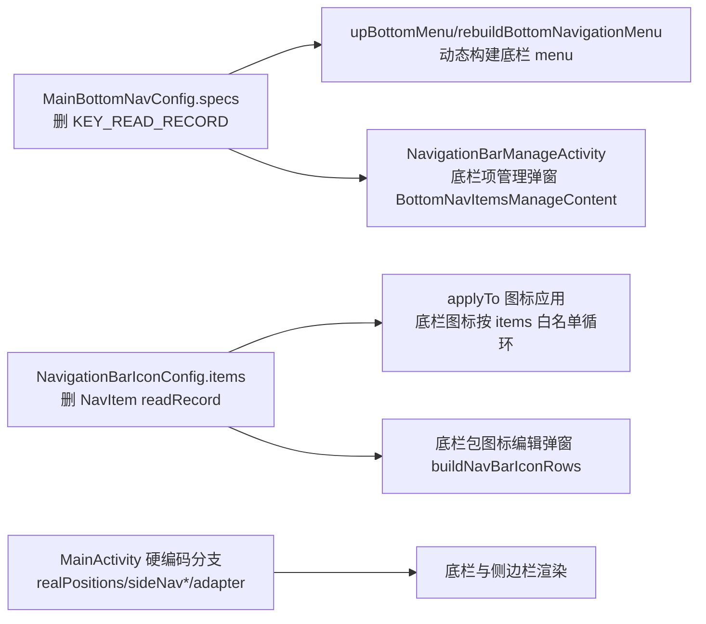
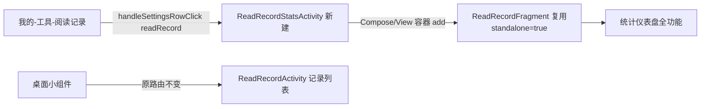
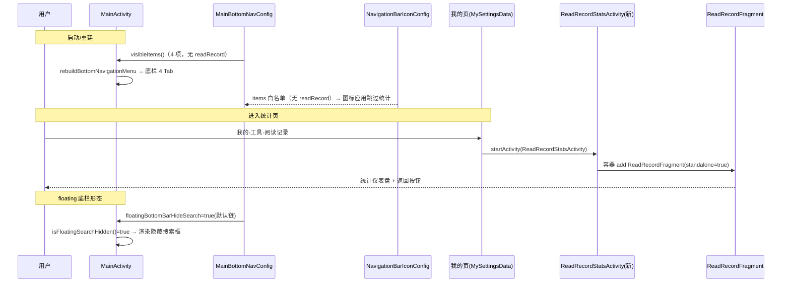

# 主界面底栏精简 设计（design.md）

## 1. Technical Approach

### 1.1 统计 Tab 移除（配置源头链式清理）

底栏的所有展示与设置均为**数据驱动**，清理只需动 3 个源头：

- `MainBottomNavConfig.specs` 删除 `ItemSpec(KEY_READ_RECORD, ...)`；`legacyInitialItems()` 删除 `showReadRecord` 项；常量 `KEY_READ_RECORD` 一并删除。
- `NavigationBarIconConfig.items` 删除 `NavItem("readRecord", ...)`；`applyTo` 以 `items` 为循环来源，删除后统计图标不再被应用（输入套件 icons 残留键无副作用）。
- `MainActivity.kt` 删除：`idReadRecord` 常量、`realPositions` 中对应元素、`handleNavigationItemSelected` 的 `menu_read_record` 分支、`sideNavigationButtonMap/RowMap/TextMap` 中 `menu_read_record` 项、`sideNavigationTitle()` 特判、`getBottomNavigationItemId()` 分支、`TabFragmentPageAdapter` 的 `ReadRecordFragment` 分支与 import。

### 1.2 统计页迁移（宿主 Activity 复用仪表盘）

- 新建 `ReadRecordStatsActivity : BaseActivity<ActivityReadRecordStatsBinding>`（布局为容器 + FragmentContainerView 或 FrameLayout）。
- `ReadRecordFragment` 增加 standalone 模式：`arguments["standalone"] == true` 时，在 `onFragmentCreated` 中通过 `binding.topBar.addActionButton(返回图标) { requireActivity().finish() }` 提供返回入口（`MainTopBarView.addActionButton` 为既有通用 action 槽位，同 MyFragment 帮助图标用法）。
- `MySettingsData.kt`：「readRecord」路由改指 `ReadRecordStatsActivity`；`BuildSettingsSections` 中行标题/摘要沿用现有 `R.string.read_record` / `read_record_summary`。

### 1.3 搜索框默认隐藏（默认值链翻转）

搜索框的运行时显隐由 `MainActivity.isFloatingSearchHidden()` 驱动（`layoutMode==floating && floatingBottomBarHideSearch`），展示层已支持隐藏分支（`applyBottomNavigationShape` 的 `searchHidden` 路径）。因此只需把**默认值链**翻转为隐藏：

| 层 | 位置 | 变更 |
|----|------|------|
| 读默认 | `AppConfig.floatingBottomBarHideSearch` | 默认 `false` → `true` |
| 预设默认 | `MainLayoutPresetConfig.floatingBottomBarHideSearch()` | 默认 `false` → `true`；`apply()` 内写回 `true` |
| 套装默认 | `NavigationBarIconConfig.Config.hideSearchInFloatingStyle` | 默认 `false` → `true`（defaultEntry 经 `MainLayoutPresetConfig` 自动跟随） |
| 设置页开关 | `OtherConfigFragment`（`PreferKey.floatingBottomBarHideSearch` switch） | `defaultValue` → `true` |
| 外观内置预设 | `AppearanceKitManager.builtinKits` KIT_FLOATING | binding `floatingBottomBarHideSearch` → `true`（与 KIT_FLOATING_NO_SEARCH 语义合并，预设保留兼容） |

编辑能力保留：`NavigationBarManageActivity.buildNavBarEditRows` 中「搜索」行继续读写 `config.hideSearchInFloatingStyle`，仅默认朝"隐藏"。

### 1.4 订阅源全局搜索入口移除

`MySettingsData.buildSettingsSections` 工具分组删除 `actionRow("rssSearch", ...)`；`handleSettingsRowClick` 删除 `"rssSearch"` 分支与 `RssSearchActivity` import。`RssSearchActivity` 文件与订阅 Tab 顶栏调用不动。

## 2. Architecture Decisions

### AD-01: 统计页承载方案——宿主 Activity 复用 ReadRecordFragment

- **Version**: v1.0
- **UpdateTime**: 2026-09-14
- **Context**: 底栏「统计」Tab 为 `ReadRecordFragment`（完整统计仪表盘，View 布局 `activity_read_record`，含概览/热力图/最近阅读/每日记录/排行/目标卡/组件配置，逻辑约 870 行）。底栏移除后需保留该页入口，迁入「我的 → 工具 → 阅读记录」。
- **Concern**: 如何在最小改造面内让 Fragment 仪表盘成为可独立打开的子页。
- **Decision**: 新建轻壳宿主 `ReadRecordStatsActivity`（BaseActivity + Fragment 容器）承载 `ReadRecordFragment`；Fragment 加 standalone 参数，独立模式在顶栏追加返回按钮。
- **Goal**: 统计信息保留完整能力；复用既有实现；我的页入口改动仅一行路由。
- **Tradeoff**: 多一个壳 Activity（约 40 行）；底部 88dp 避让 padding 在无底栏独立页观感略空（low 风险）。
- **Status**: Proposed
- **Superseded-by**: 无
- **ChangeLog**: -

### AD-02: 统计条目移除范围——配置源白名单链式清理

- **Version**: v1.0
- **UpdateTime**: 2026-09-14
- **Context**: 「统计」的展示与设置散落于 `MainBottomNavConfig.specs`、`NavigationBarIconConfig.items`、`MainActivity` 硬编码、`menu/main_bnv.xml`、`ids.xml`、`strings` 等。
- **Concern**: 需保证移除后无编译残留、无 UI 漏网、老用户预存配置不异常。
- **Decision**: 以 `MainBottomNavConfig.specs` 与 `NavigationBarIconConfig.items` 为唯一破坏面，其余全部白名单过滤；`MainActivity` 硬编码分支逐一清理；`menu_read_record`/`side_nav_stats`/图标资源联动删除；老用户 `mainBottomNavItems` 由 `normalize()` 白名单自动过滤。
- **Goal**: 数据驱动 UI 自动收敛；编译零残留（Grep 门禁）。
- **Tradeoff**: 需一次性联动资源删除清单较细，依赖 Explore 阶段引用盘点。
- **Status**: Proposed
- **Superseded-by**: 无
- **ChangeLog**: -

### AD-03: 搜索框默认隐藏——默认值链翻转而非移除能力

- **Version**: v1.0
- **UpdateTime**: 2026-09-14
- **Context**: 右下角搜索框显示由「默认底栏套装 + floating 布局 + hideSearchInFloatingStyle/pref」联合决定；外观管理含「无搜索悬浮底栏」预设，自定义套装可独立控制。
- **Concern**: 用户要求"默认去掉且在主题设置体系去掉"，但自定义套装编辑能力是合法功能，不宜删除。
- **Decision**: 仅翻转 5 处默认值（AppConfig / MainLayoutPresetConfig / Config 默认 / 设置页开关默认 / KIT_FLOATING 预设）为"隐藏"；保留 `hideSearchInFloatingStyle` 编辑项与「无搜索悬浮底栏」预设。
- **Goal**: 全新安装默认无搜索框；能力不删。
- **Tradeoff**: 开启 AI 助手的用户会默认看到 AI 悬浮球（既有联动逻辑，可接受）。
- **Status**: Proposed
- **Superseded-by**: 无
- **ChangeLog**: -

### AD-04: 订阅源全局搜索入口移除范围

- **Version**: v1.0
- **UpdateTime**: 2026-09-14
- **Context**: 「我的-工具-订阅源全局搜索」（`rssSearch` → `RssSearchActivity`）与订阅 Tab 顶栏全局搜索按钮（`RssFragment` → `RssSearchActivity`）功能重复。
- **Concern**: 只清冗余入口，不破坏订阅源全局搜索能力。
- **Decision**: 仅删除 `MySettingsData` 中的行与路由；`RssSearchActivity` 与 `RssFragment` 调用保留。
- **Goal**: 我的页工具分组精简，能力零损失。
- **Tradeoff**: 无。
- **Status**: Proposed
- **Superseded-by**: 无
- **ChangeLog**: -

## 3. Data Flow

## 4. File Changes

| 文件 | 变更类型 | 内容 |
|------|---------|------|
| `app/src/main/java/io/legado/app/help/config/MainBottomNavConfig.kt` | 修改 | 删 `KEY_READ_RECORD` 常量、`specs` 中 readRecord 项、`legacyInitialItems` 中 readRecord 项 |
| `app/src/main/java/io/legado/app/help/config/NavigationBarIconConfig.kt` | 修改 | 删 `items` 中 `NavItem("readRecord",...)`；`Config.hideSearchInFloatingStyle` 默认 `true` |
| `app/src/main/java/io/legado/app/ui/main/MainActivity.kt` | 修改 | 删 idReadRecord/realPositions 项/switch 分支/sideNav* map 项/sideNavigationTitle 特判/getBottomNavigationItemId 分支/adapter 分支/ReadRecordFragment import |
| `app/src/main/java/io/legado/app/ui/main/readrecord/ReadRecordFragment.kt` | 修改 | standalone 模式：读取 `arguments["standalone"]`，追加返回按钮 |
| `app/src/main/java/io/legado/app/ui/about/ReadRecordStatsActivity.kt` | 新增 | 宿主 Activity，容器承载 ReadRecordFragment |
| `app/src/main/res/layout/activity_read_record_stats.xml` | 新增 | 简单容器布局 |
| `app/src/main/java/io/legado/app/ui/main/my/MySettingsData.kt` | 修改 | 删 rssSearch 行/路由/import；readRecord 路由 → `ReadRecordStatsActivity` |
| `app/src/main/java/io/legado/app/help/config/AppConfig.kt` | 修改 | `floatingBottomBarHideSearch` 默认 `true`；删除 `showReadRecord`（无引用后） |
| `app/src/main/java/io/legado/app/help/config/MainLayoutPresetConfig.kt` | 修改 | `floatingBottomBarHideSearch()` 默认 `true`；`apply()` 写回 `true` |
| `app/src/main/java/io/legado/app/help/config/AppearanceKitManager.kt` | 修改 | KIT_FLOATING 预设 binding `floatingBottomBarHideSearch=true`；导入/导出默认值段落核对 |
| `app/src/main/java/io/legado/app/constant/PreferKey.kt` | 修改 | 删 `showReadRecord`（联动 AppConfig 删除） |
| `app/src/main/java/io/legado/app/ui/config/OtherConfigFragment.kt` | 修改 | `floatingBottomBarHideSearch` switch `defaultValue=true` |
| `app/src/main/res/menu/main_bnv.xml` | 修改 | 删 `menu_read_record` 条目 |
| `app/src/main/res/layout/activity_main.xml` | 修改 | 删侧边栏 `sideNavReadRecord*` 三件套（按钮/行/文本） |
| `app/src/main/res/values/ids.xml` | 修改 | 关联删除（确认无代码引用后） |
| `app/src/main/res/values/strings.xml` + `values-zh/strings.xml` | 修改 | 关联删除 `side_nav_stats`（确认零引用后）；`rss_search*` 与 `read_record*` 保留 |
| `docs/INDEX.md` | 修改 | 状态流转登记 |

> 清单以开发阶段 Grep 实证为准；`ic_bottom_read_record*` drawable 与 `side_nav_stats` 字符串在确认零引用后清理，清理前保留（避免误伤小组件/无障碍资源）。