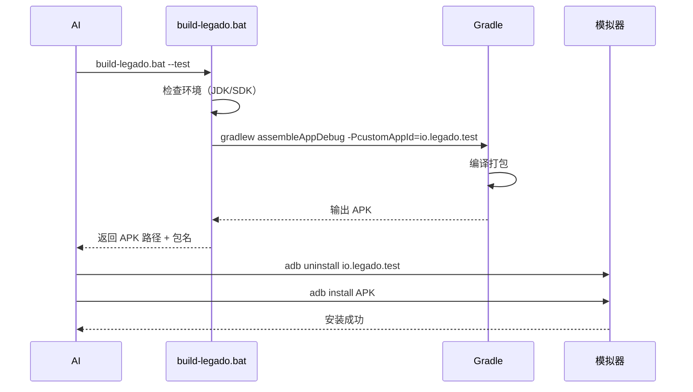
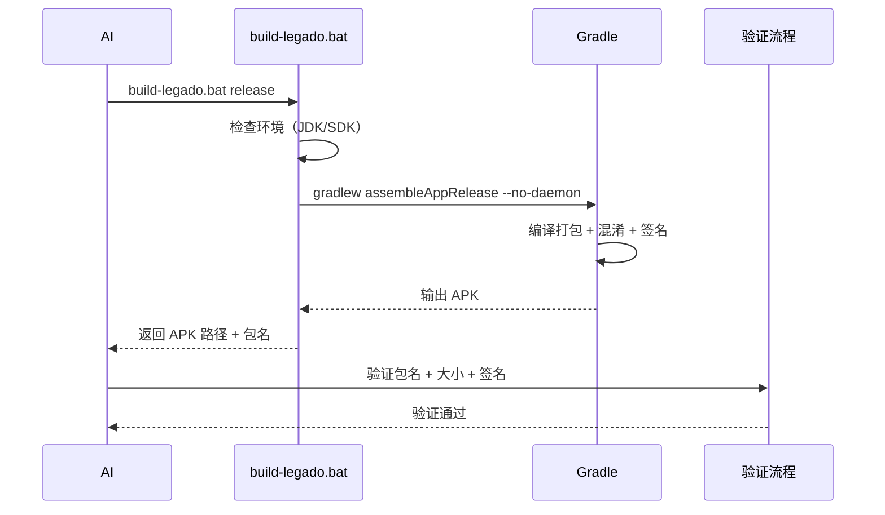

# 打包流程规整 - 规格说明

## Intent

### 问题陈述

当前 Legado 项目的打包流程存在以下问题：

1. **包名不一致**：
   - `build-legado.bat` 默认包名 `io.legado.missapp`（第 21 行）
   - `app/build.gradle` 默认包名 `io.legado.app`（第 54 行）
   - 两处配置不同步，容易导致混淆

2. **缺少统一的包名分类规范**：
   - 当前只有 Debug/Release 两种构建类型，通过 `.debug` / `.release` 后缀区分
   - 缺少明确的测试包/共存包/正式包分类规范
   - AI 无法根据任务场景自动选择合适的包名

3. **缺少面向 AI 执行的规范**：
   - `build-apk-guide.md`（693 行）面向人类用户，描述性强
   - 缺少 AI 执行所需的确定性规范：
     - 如何判断构建成功？
     - 构建失败时如何处理？
     - 输出 APK 的标准路径是什么？
     - 如何验证包名是否正确？

### 规整目标

1. **统一包名规范**：建立测试包/共存包/正式包三种分类，明确命名规则和使用场景
2. **设计 AI 执行流程**：为 AI 提供确定性的打包流程规范，减少歧义
3. **规整脚本和文档**：修复脚本不一致问题，更新文档以反映新规范

---

## Scope

### 规整范围

| 类别 | 具体内容 | 不涉及 |
|------|---------|--------|
| **包名规范** | 定义测试包/共存包/正式包的命名规则和使用场景 | 不涉及源码包结构调整 |
| **打包流程** | 设计面向 AI 执行的详细流程（检查点/成功判定/错误处理） | 不涉及构建工具升级 |
| **脚本优化** | 修复 `build-legado.bat` 默认包名不一致问题，增强参数支持 | 不重构脚本架构 |
| **文档更新** | 更新 `build-apk-guide.md`，增加 AI 执行规范章节 | 不重写文档 |

### 影响范围

| 文件 | 变更类型 | 说明 |
|------|---------|------|
| `build-legado.bat` | 修改 | 统一默认包名，增强包名参数支持 |
| `app/build.gradle` | 无修改 | 保持现有 applicationId 逻辑不变 |
| `docs/project-flow/build-apk-guide.md` | 新增章节 | 增加"AI 执行规范"章节 |
| 新增文档 | 创建 | 创建 `docs/project-flow/ai-build-spec.md`（AI 执行规范） |

---

## Approach

### Selected Approach

**方案：三层包名分类 + AI 执行规范文档分离**

#### 1. 三层包名分类

| 分类 | 包名格式 | 使用场景 | 后缀 |
|------|---------|---------|------|
| **测试包** | `io.legado.missapp.debug` | AI 自动化测试、E2E 测试、开发调试 | `.debug` |
| **共存包** | 用户自定义（如 `com.my.legado.debug`） | 与原版 Legado 共存安装 | `.debug` 或无 |
| **正式包** | `io.legado.missapp.release` | 正式发布 | `.release` |

**命名规则**：

- 测试包：固定包名 `io.legado.missapp.debug`（基础包名 `io.legado.missapp` + `.debug` 后缀）
- 共存包：用户可自定义，默认 `io.legado.missapp`，通过 `-PcustomAppId` 参数传入
- 正式包：使用项目包名 `io.legado.missapp`，保持 `.release` 后缀

#### 2. AI 执行规范文档分离

将 AI 执行规范从 `build-apk-guide.md` 中分离出来，创建独立文档 `docs/project-flow/ai-build-spec.md`：

- **build-apk-guide.md**：面向人类用户，保持现有描述性风格
- **ai-build-spec.md**：面向 AI 执行，提供确定性规范

#### 3. 脚本优化

修改 `build-legado.bat`：

- 将默认包名保持为 `io.legado.missapp`（与项目 build.gradle 一致）
- 增加 `--test` 参数，自动使用测试包名 `io.legado.missapp.debug`
- 增加 `--coexist` 参数，自动使用共存包名（用户自定义）
- 保持现有 `build-legado.bat debug com.xxx.xxx` 自定义包名支持

#### 选定理由

1. **三层分类清晰**：测试/共存/正式三种场景分明，AI 可根据任务自动选择
2. **最小改动原则**：不修改 build.gradle，只调整脚本参数，降低风险
3. **文档分离清晰**：人类用户和 AI 各有专用文档，避免混淆
4. **与原版区分**：基础包名使用 `io.legado.missapp`，与原版 `io.legado.app` 区分，可共存

---

### Alternatives Considered

| 方案 | 描述 | 否决理由 |
|------|------|---------|
| **方案 A：统一包名 + 后缀区分** | 所有场景使用 `io.legado.app`，通过后缀区分：`.test` / `.coexist` / `.release` | ❌ **否决理由**：<br>1. 与 Gradle 现有后缀逻辑冲突（`.debug` / `.release` 已存在）<br>2. 测试包和共存包会被视为同一应用的不同构建变体，不符合隔离需求<br>3. 测试包需要固定包名以便清理，后缀方式导致每次包名不同 |
| **方案 B：双包名策略** | 只区分测试包（`io.legado.test`）和正式包（`io.legado.app`），取消共存包分类 | ❌ **否决理由**：<br>1. 用户共存安装需求真实存在（与原版 Legado 同时使用）<br>2. 缺少共存包规范，用户会自行使用随机包名，难以管理<br>3. 不符合"三层分类清晰"的设计原则 |
| **方案 C：扩展 build.gradle 构建变体** | 在 build.gradle 中新增 `productFlavors`，如 `testFlavor`、`coexistFlavor` | ❌ **否决理由**：<br>1. 改动范围大，需修改构建配置，风险高<br>2. 增加构建复杂度，每次构建需选择 flavor<br>3. 违反"最小改动原则"，影响 GitHub Actions 等现有流程<br>4. 不必要地暴露了内部包名策略到构建配置中 |

---

### Drawbacks

| 缺点 | 影响程度 | 接受理由 |
|------|---------|---------|
| **测试包固定包名，每次测试前需清理** | 中等 | ✅ 接受理由：<br>1. 固定包名是自动化测试的必要条件（adb 命令需明确包名）<br>2. 清理操作已集成到测试流程（`adb uninstall io.legado.test`）<br>3. 避免设备上残留过多测试包 |
| **共存包默认包名可能与用户已有应用冲突** | 低 | ✅ 接受理由：<br>1. 用户可通过 `build-legado.bat debug com.xxx.xxx` 自定义包名<br>2. 默认包名 `io.legado.coexist` 冲突概率低（非官方包名）<br>3. 文档中明确提示用户可自定义 |
| **AI 执行规范文档分离，需维护两份文档** | 低 | ✅ 接受理由：<br>1. 两份文档受众不同（人类 vs AI），内容风格不同<br>2. 分离后各自独立演进，避免"一刀切"折中<br>3. AI 文档可更频繁更新，不影响人类文档稳定性 |

---

## Requirements

### R1 包名规范需求

| ID | 需求 | 优先级 | 验证标准 |
|----|------|--------|---------|
| R1.1 | 定义三层包名分类：测试包/共存包/正式包 | P0 | 文档明确定义三种分类及命名规则 |
| R1.2 | 测试包固定包名 `io.legado.missapp.debug` | P0 | 脚本默认构建使用测试包名 |
| R1.3 | 正式包使用项目包名 `io.legado.missapp.release` | P0 | 脚本 `build-legado.bat release` 使用正式包名 |
| R1.4 | 共存包支持用户自定义，默认 `io.legado.missapp` | P1 | 脚本支持自定义包名参数 |

### R2 打包流程需求

| ID | 需求 | 优先级 | 验证标准 |
|----|------|--------|---------|
| R2.1 | AI 可根据任务场景自动选择包名分类 | P0 | AI 文档中提供选择决策表 |
| R2.2 | 定义构建成功判定标准（APK 存在 + 包名正确 + 大小合理） | P0 | AI 文档中明确判定条件 |
| R2.3 | 定义构建失败处理流程（错误分类 + 重试策略 + 回退方案） | P0 | AI 文档中定义错误处理流程 |
| R2.4 | 定义输出 APK 的标准路径和命名格式 | P1 | AI 文档中明确输出路径模式 |

### R3 脚本需求

| ID | 需求 | 优先级 | 验证标准 |
|----|------|--------|---------|
| R3.1 | 保持 `build-legado.bat` 默认包名为 `io.legado.missapp` | P0 | 脚本默认包名与 build.gradle 一致 |
| R3.2 | 默认构建测试包（debug） | P0 | `build-legado.bat` 默认构建 `io.legado.missapp.debug` |
| R3.3 | 支持 `release` 参数构建正式包 | P0 | `build-legado.bat release` 构建 `io.legado.missapp.release` |
| R3.4 | 保持现有自定义包名参数支持 | P0 | `build-legado.bat debug com.xxx.xxx` 仍然可用 |

### R4 文档需求

| ID | 需求 | 优先级 | 验证标准 |
|----|------|--------|---------|
| R4.1 | 创建 `docs/project-flow/ai-build-spec.md`（AI 执行规范） | P0 | 文档包含确定性流程、成功判定、错误处理 |
| R4.2 | 更新 `build-apk-guide.md`，引用 AI 执行规范文档 | P1 | 文档增加交叉引用，避免内容重复 |
| R4.3 | 更新 `docs/project-flow/quick-reference.md`，增加打包命令速查 | P2 | 速查表包含三种包名分类的命令示例 |

---

## Scenarios

### S1 AI 执行打包（自动化测试）

**场景描述**：AI 在执行 E2E 测试前，需要构建测试包并安装到模拟器。

**流程**：



**关键点**：

- 使用 `--test` 参数，固定包名 `io.legado.test`
- 安装前先清理旧包（避免签名冲突）
- 验证包名正确性（`aapt dump badging APK | grep package`）

### S2 用户手动打包（共存安装）

**场景描述**：用户希望构建一个可以与原版 Legado 共存的包。

**流程**：

1. 用户打开系统 CMD
2. 执行 `build-legado.bat --coexist` 或 `build-legado.bat debug com.myname.legado`
3. 脚本构建 Debug APK，包名为 `io.legado.coexist` 或用户自定义包名
4. 用户安装到设备，与原版 Legado 共存

**关键点**：

- 使用 `--coexist` 参数或自定义包名参数
- Debug 包不混淆，方便调试
- 文档中明确提示用户可自定义包名

### S3 AI 执行打包（正式发布）

**场景描述**：AI 完成代码优化后，需要构建正式 Release APK。

**流程**：



**关键点**：

- 使用默认参数（无 `--test` / `--coexist`），使用原版包名
- 验证签名正确性（`apksigner verify APK`）
- 验证包名为 `io.legado.app.release`

### S4 构建失败处理

**场景描述**：AI 执行打包时遇到错误，需要根据错误类型采取不同处理策略。

**错误分类与处理**：

| 错误类型 | 典型错误信息 | 处理策略 |
|---------|-------------|---------|
| **环境错误** | `JDK not found` / `SDK not found` | 立即中止，报告用户修复环境 |
| **依赖错误** | `Could not resolve xxx` | 尝试启用国内镜像，重试一次；仍失败则中止 |
| **编译错误** | `Execution failed for :app:compileDebugKotlin` | 检查源码变更，回退到上一个可构建版本 |
| **缓存错误** | `Kotlin daemon AccessDeniedException` | 清理缓存（`%LOCALAPPDATA%\kotlin\daemon`），重试 |
| **签名错误** | `Failed to read key from keystore` | 检查 `gradle.properties` 签名配置，报告用户 |

**重试策略**：

- 环境错误：不重试，直接报告
- 依赖错误：重试 1 次（启用镜像）
- 编译错误：不重试，回退版本
- 缓存错误：重试 1 次（清理缓存）
- 签名错误：不重试，直接报告

---

## 附录

### A. 包名选择决策表（AI 参考）

| 任务场景 | 推荐包名分类 | 脚本命令 | 说明 |
|---------|------------|---------|------|
| E2E 自动化测试 | 测试包 | `build-legado.bat` | 默认构建 `io.legado.missapp.debug` |
| 正式发布构建 | 正式包 | `build-legado.bat release` | 构建 `io.legado.missapp.release` |
| 用户共存安装 | 共存包 | `build-legado.bat debug com.xxx.xxx` | 用户自定义包名 |

### B. 构建成功判定标准

| 判定项 | 检查方法 | 预期结果 |
|--------|---------|---------|
| APK 存在 | `Test-Path $APK_PATH` | 存在 |
| 包名正确 | `aapt dump badging APK \| grep package` | 符合预期包名 |
| 大小合理 | `(Get-Item APK).Length` | Debug: 20-30MB, Release: 15-25MB |
| 签名有效（Release） | `apksigner verify APK` | 验证通过 |

### C. 输出 APK 路径模式

```
# Debug APK（测试包）
app\build\outputs\apk\app\debug\legado_app_3.yy.MMddHHdebug.apk

# Release APK（正式包）
app\build\outputs\apk\app\release\legado_app_3.yy.MMddHH.apk

# 包名格式：
# - 测试包（默认）: io.legado.missapp.debug
# - 正式包: io.legado.missapp.release
# - 共存包: {用户自定义包名}.debug 或 {用户自定义包名}.release
```