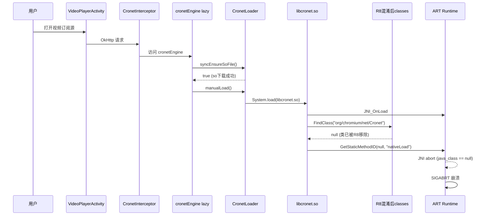
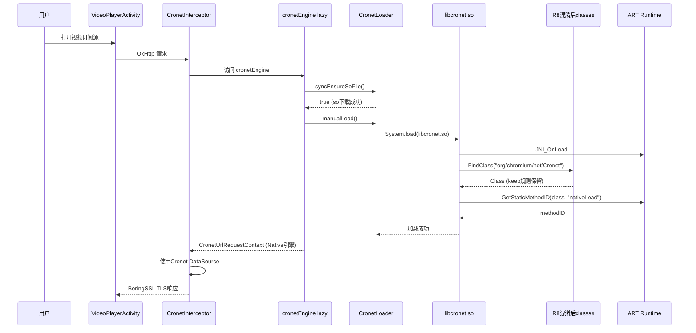

# Design: Cronet ProGuard 规则修复

## Technical Approach

### 根因深度分析

**崩溃链路**：
1. App 启动 → `Cronet install failed, fallback to OkHttp`（首次降级，非崩溃）
2. 用户打开视频订阅源 → OkHttp 发起请求 → CronetInterceptor 访问 `cronetEngine`（lazy 初始化）
3. lazy 块执行 `CronetLoader.syncEnsureSoFile()` → so 下载成功（md5=ec7fafb9）
4. `CronetLoader.manualLoad()` → `System.load(soFile.absolutePath)` 加载 libcronet.150.0.7871.128.so
5. libcronet.so 的 `JNI_OnLoad` 被调用
6. JNI_OnLoad 内部调用 `Runtime.nativeLoad(String, ClassLoader, Class)` 重新加载自身
7. 第三个参数 Class 通过 `FindClass("org/chromium/net/Cronet")` 获取
8. R8 混淆已移除 `org.chromium.net.Cronet` 类 → `FindClass` 返回 null
9. `GetStaticMethodID(null, "nativeLoad", ...)` → JNI abort → SIGABRT

**关键证据**：
```
Abort message: 'JNI DETECTED ERROR IN APPLICATION: java_class == null
    in call to GetStaticMethodID
    from java.lang.String java.lang.Runtime.nativeLoad(java.lang.String, java.lang.ClassLoader, java.lang.Class)'
#06 pc 000000000045f118  libcronet.150.0.7871.128.so
```

**为什么测试包/共存包不崩溃**：
- `minifyEnabled=false` → R8 不启用 → Java 类不被移除/混淆 → `FindClass` 正常返回

### 修复方案

在 `proguard-rules.pro` 中补全保留 libcronet.so 通过 JNI 反射调用的 Java 类：

```proguard
# Cronet API 入口类（libcronet.so JNI_OnLoad 通过 FindClass 反射调用）
# 铁证：2026-07-31 release 包 R8 移除 org.chromium.net.Cronet 类，
#   libcronet.so JNI_OnLoad 调用 GetStaticMethodID(null, "nativeLoad") 触发 SIGABRT
-keep class org.chromium.net.Cronet { *; }
-keep class org.chromium.net.CronetEngine { *; }
-keep class org.chromium.net.CronetEngine$Builder { *; }
-keep class org.chromium.net.ExperimentalCronetEngine { *; }
-keep class org.chromium.net.ExperimentalCronetEngine$Builder { *; }
-keep class org.chromium.net.CronetException { *; }
-keep class org.chromium.net.UrlRequest { *; }
-keep class org.chromium.net.UrlRequest$Callback { *; }
-keep class org.chromium.net.UrlRequest$Status { *; }
-keep class org.chromium.net.UrlResponseInfo { *; }
-keep class org.chromium.net.UploadDataProvider { *; }
-keep class org.chromium.net.UploadDataSink { *; }
-keep class org.chromium.net.BidirectionalStream { *; }
-keep class org.chromium.net.NetworkQualityRttListener { *; }
-keep class org.chromium.net.NetworkQualityThroughputListener { *; }
-keep class org.chromium.net.RequestFinishedInfo { *; }
-keep class org.chromium.net.ResourceRequestChecker { *; }
-keep class org.chromium.net.impl.CronetLibraryLoader { *; }
-keep class org.chromium.net.impl.VersionField { *; }
```

### 嗅探减弱根因

**嗅探减弱是 Cronet 崩溃的连锁反应**，非嗅探逻辑本身问题：

1. Cronet SIGABRT 崩溃 → 进程重启 → cronetEngine lazy 初始化失败（try-catch 捕获返回 null）
2. CronetInterceptor 检测 `cronetEngine == null` → 降级到 OkHttp
3. OkHttp 使用 Conscrypt TLS 栈 → TLS 指纹与 Chrome 不同
4. CDN 检测到非浏览器 TLS 指纹 → 返回 403/连接重置
5. 嗅探 Range 请求失败 → 视频类型识别失败 → 播放失败

**修复后**：Cronet 正常初始化 → CronetInterceptor 使用 Cronet DataSource → BoringSSL TLS 栈（与 Chrome 一致）→ CDN 不再拒绝 → 嗅探恢复

## Architecture Decisions

### AD-01: 精准补全 ProGuard 规则（非保留整个 org.chromium 包）
- **Context**: libcronet.so 通过 JNI 反射调用多个 Java 类，R8 混淆会移除未保留的类
- **Concern**: 如何在修复崩溃的同时最小化 APK 体积增加
- **Decision**: 基于 Chromium 官方文档和崩溃栈分析，精准保留 libcronet.so JNI 调用的 API 类
- **Goal**: 确保 release 包 Cronet 正常初始化，APK 体积增加 ≤ 100KB
- **Tradeoff**: 接受无法 100% 穷举 JNI 调用类的风险（通过真机验证+mapping.txt 检查缓解）
- **Status**: Proposed
- **Superseded-by**: 无

### AD-02: 不修改动态下载逻辑
- **Context**: 2026-07-31 已优化为动态下载 libcronet.so（减少 6.37MB APK 体积）
- **Concern**: 是否需要回退到 jniLibs 打包以确保稳定性
- **Decision**: 保留动态下载方案，只修复 ProGuard 规则
- **Goal**: 不回退体积优化成果，精准修复 R8 混淆问题
- **Tradeoff**: 接受动态下载的时序风险（已通过 syncEnsureSoFile 同步下载缓解）
- **Status**: Proposed
- **Superseded-by**: 无

### AD-03: 强化 package-naming.md 验证清单
- **Context**: 2026-07-30 已强化 libcronet.so 打包规范，但遗漏了 ProGuard 规则验证
- **Concern**: 如何防止后续 R8 升级再次移除关键类
- **Decision**: 在 package-naming.md 新增 ProGuard 规则验证清单（构建后检查 mapping.txt）
- **Goal**: 回归防护，后续 R8/Cronet 版本升级时主动发现缺失的 keep 规则
- **Tradeoff**: 增加构建后验证步骤（耗时可忽略）
- **Status**: Proposed
- **Superseded-by**: 无

## Data Flow

### 修复前（崩溃流程）



### 修复后（正常流程）



## File Changes

| 文件 | 变更类型 | 变更内容 |
|------|---------|---------|
| `app/proguard-rules.pro` | 追加 | 新增保留 `org.chromium.net.*` API 入口类的 keep 规则（约 20 行） |
| `docs/project-rules/package-naming.md` | 追加 | 新增"ProGuard 规则验证清单"小节 |
| `app/src/main/assets/updateLog.md` | 追加 | 新增修复日志条目 |
| `.trae/memory/ai_memory_main.md` | 追加 | Hard Constraints 新增"Cronet API 入口类必须 keep"铁律 |

## 验证策略

| 验证项 | 方法 | 通过标准 |
|--------|------|---------|
| release 包编译 | `gradlew.bat assembleAppRelease -x lint` | BUILD SUCCESSFUL |
| mapping.txt 检查 | Grep `org/chromium/net/Cronet` in mapping.txt | 类名未被混淆（保留原名） |
| release 包安装 | adb install | 安装成功 |
| 打开视频订阅源 | 真机操作 | 不崩溃，正常显示列表 |
| 播放视频 | 真机操作 | Cronet 引擎正常，嗅探成功，ExoPlayer 播放 |
| APK 体积 | 对比修复前后 | 增加 ≤ 100KB |
