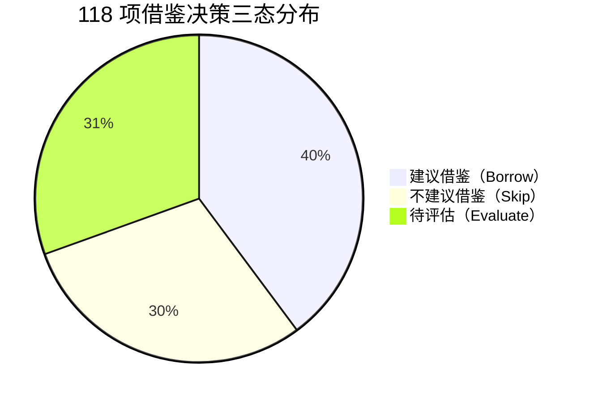

# 阅读Archive vs 本项目（legado）深度对比分析报告（最终整合版）

> **生成时间**：2026-07-18
> **对比对象**：阅读Archive私仓（tag: `private-armv8-3.26.07071245`）vs 当前项目（legado）
> **分析方法**：五阶段对比流程 + 7 个子代理并行深度分析（每个模块独立中间文件防丢失）
> **文档版本**：v2.0 最终整合版（取代 v1.0 初版）

---

## 一、对比背景与目标

### 1.1 背景

用户获得阅读Archive私仓访问权限，希望深度分析该延伸版本与本项目的差异，并提炼可借鉴点。

### 1.2 对比对象身份

| 属性 | 阅读Archive | 本项目（legado） |
|------|------------|----------------|
| 来源 | 继承自 Lyc 维护的 Legado 分支 | fork 自原版 legado-E，私有化改造 |
| 包名 | `io.legado.app.Archive` | `io.legado.app.sigma` |
| 最新 tag | `private-armv8-3.26.07071245`（2026-07-07） | （本仓库 master） |
| minSdk | 21 | 23 |
| targetSdk | 36 | 36 |
| Compose | 已启用 | 已启用且更完整 |
| minify | false（未启用混淆） | true（启用混淆） |
| CI 数量 | 9 个（含 4 个独有 armv8 专用） | 5 个 |

### 1.3 分析范围（7 大模块）

| 模块代码 | 模块名 | 中间文件 | 差异数 | 决策数 |
|---------|--------|---------|--------|--------|
| SA-1 | 主题管理 | `intermediate/SA-1-theme.md` | 20 | 16 |
| SA-2 | EPUB 阅读 | `intermediate/SA-2-epub.md` | 30 | 23 |
| SA-3 | AI 助手 | `intermediate/SA-3-ai-assistant.md` | 30 | 18 |
| SA-4 | RSS/发现页 | `intermediate/SA-4-rss-explore.md` | 35 | 21 |
| SA-5 | 视频播放 | `intermediate/SA-5-video.md` | 28 | 9 |
| SA-6 | 构建配置 | `intermediate/SA-6-build.md` | 26 | 21 |
| SA-7 | 依赖库 | `intermediate/SA-7-deps.md` | 12 | 10 |
| **合计** | | | **181** | **118** |

### 1.4 决策分布汇总

| 决策类型 | 数量 | 占比 |
|---------|------|------|
| 建议借鉴（Borrow） | 47 | 39.8% |
| 不建议借鉴（Skip） | 35 | 29.7% |
| 待评估（Evaluate） | 36 | 30.5% |

---

## 二、模块分析摘要

### 2.1 SA-1 主题管理（20 差异 / 16 决策）

**核心范式差异**：本项目扁平 `themeConfig.json` vs Archive 目录化"主题包"（`themePackages/{day|night}/{dirName}/theme.json + 资源`）。

**Archive 关键增强**：
- ThemePackageManager（1428 行）：完整 ZIP 导入导出 + 云端同步 + 5 种 RED 格式兼容
- AppearanceKitManager（905 行）：跨组件套件绑定（KitBinding）
- PaperInkHelper（60 行）：通过 `Paint.setShadowLayer` 实现纸墨风格，零外部依赖
- Config 字段扩展 30+ 字段（本项目仅 9 字段）
- 字体撞色检测：`sanitizeFontColorAgainstSurfaces` 基于 `AndroidColorUtils.calculateContrast`

**借鉴建议**：8 项借鉴 / 2 项不借鉴 / 6 项待评估
- P0：纸墨风格实现、字体撞色检测（小代码量、低风险）
- P1：主题包 ZIP 导入导出、Config 字段扩展
- P2：AppearanceKit 套件架构（大改造，长期规划）

### 2.2 SA-2 EPUB 阅读（30 差异 / 23 决策）

**核心差异一句话**：Archive 自研了完整浏览器级 EPUB 渲染引擎，本项目仅 1 个 EpubFile.kt ~700 行。

**Archive 关键增强**：
- CSS 级联（specificity + important + 继承）+ 盒模型布局 + 7 种绘制指令 + 字体内嵌
- 共 46 个文件 16000+ 行代码（vs 本项目 ~700 行，差距 23 倍）
- 双模式开关（`useExperimentalEpubCore`）：原生引擎与文本引擎双轨并行
- Book.kt 实体零扩展原则：所有缓存数据走独立磁盘目录

**借鉴建议**：10 项借鉴 / 6 项不借鉴 / 7 项待评估
- P0-P2（10 项低风险渐进式）：章节资源索引、spine 优先、资源过滤、标题归一化、性能日志、图片尺寸缓存等
- Skip：原生渲染引擎三件套（8000+ 行，偏离本项目"书源规则引擎"主航道）
- **重大设计范式**：Book.kt 实体零扩展原则，未来任何 EPUB 增强都应遵守

### 2.3 SA-3 AI 助手（30 差异 / 18 决策）

**核心差异一句话**：Archive 有 35 个 Kotlin 文件构成完整 AI 体系，本项目 100% 无 AI 模块。

**Archive 关键增强**：
- AiAgentRuntime.runToolLoop 单循环入口，支持 Normal/Plan/Goal 三模式，maxToolRounds=256
- 三层工具架构：Registry → Executor → Validator
- MCP 客户端完整实现 MCP 2025-06-18 协议（Streamable HTTP + SSE），420 行可独立移植
- AI 模块深度复用 Legado 已有基础设施（Rhino/AnalyzeUrl/WebBook/CookieStore）

**借鉴建议**：8 项借鉴 / 5 项不借鉴 / 5 项待评估
- P0：MCP 客户端（420 行可独立移植）、Tavily 联网搜索
- P1：AiResolvedTool 抽象、上下文压缩、JS 脚本生图
- P2：完整 AI Agent 架构（年度规划，需评估与"书源规则引擎"主航道关系）

### 2.4 SA-4 RSS/发现页（35 差异 / 21 决策）

**核心差异一句话**：Archive 重视"用户体验广度"（订阅搜索、统一选择、合并入口），本项目重视"性能与稳定性"（并行解析 + lastHost 回填）。

**Archive 关键增强**：
- RssSearchActivity（104 行）：跨源订阅内容搜索
- SourceSelectDialog：book source 与 rss source 统一选择器
- SearchBookMergeUtils：搜索结果合并入口
- DiscoverySuite 系统（4 文件 130KB+，7 种 WidgetType）

**本项目独有优势**：
- 并行解析 + Semaphore 限流
- lastHost 回填
- F-P1-F 预连接
- weight + 失效分组管理

**关键发现**：本项目 RssSource 实体已有 `searchUrl` 字段但**没有任何 Activity/Fragment 使用它**。Archive 通过新增 `RssSearchActivity.kt`（104 行）激活了这一能力，借鉴投入产出比极高。

**借鉴建议**：6 项借鉴 / 8 项不借鉴 / 7 项待评估
- P0：RssSearchActivity、SourceSelectDialog、SearchBookMergeUtils（投入产出比极高）
- Skip：DiscoverySuite 套件系列（体量过大与极简哲学冲突）

### 2.5 SA-5 视频播放（28 差异 / 9 决策）

**核心差异一句话**：本项目视频模块已大幅领先 Archive（本项目 8167 行 vs Archive 4189 行，多约 3978 行）。

**本项目独有增强（Archive 完全空白）**：
- RSS 多集多线路
- ViewPager2 文章切换
- 抖音风格沉浸式竖屏播放器
- WebView 降级（ExoPlayer 失败自动切换）
- R5 多层嗅探
- 分页加载 + 预缓冲
- 手势交互重构（7种手势统一管理）
- 10类视频问题修复

**Archive 唯一可借鉴点**：
- VideoBookPreloader.kt（90 行）：搜索结果页预加载视频书目录
- 章节链接缓存 + 下一集预加载（chapterLinkCache + preloadNextEpisode，TTL 30 分钟）

**Archive 已知 Bug（警示）**：
- ExoPlayerHelper 用 SPLIT_TAG(🚧) 拼接 headers JSON 到 URL 后缀，导致 ExoPlayer 类型推断误判抛 3003 错误
- 本项目已用 setMimeType 修复

**借鉴建议**：2 项借鉴 / 4 项不借鉴 / 3 项待评估

### 2.6 SA-6 构建配置（26 差异 / 21 决策）

**核心差异**：Archive 9 个 CI（含 4 个独有）vs 本项目 5 个 CI；Archive minify=false，本项目 minify=true（更优）。

**Archive 关键增强**：
- 9 个 CI（含 4 个独有：private-armv8-release / android-fast-debug / android-fast-release / sync-release-gitee）
- 支持 `-Pabi=arm64-v8a` 动态注入，本项目静态写死双架构
- 支持 `-PVERSION_NAME` / `-PVERSION_CODE` CI 注入
- 用独立 `CI_DEBUG_KEY_*` secrets + `ci-debug.keystore`（CI 专用调试证书），本项目共用 `RELEASE_KEY_STORE`（证书泄露风险）

**本项目优势**：
- minify=true（APK 体积更小）
- Compose 依赖更完整（含 material-icons-extended / activity-compose / lifecycle-viewmodel-compose）
- cronet-proguard-rules.pro 多一条 `-dontwarn android.os.SystemProperties`（不能移除）

**借鉴建议**：9 项借鉴 / 7 项不借鉴 / 5 项待评估
- P0：CI 专用调试证书、armv8 单架构 CI、增量构建缓存
- P1：`-Pabi` 动态注入、`-PVERSION_NAME`/`-PVERSION_CODE` CI 注入
- P2：fast-debug / fast-release 工作流

### 2.7 SA-7 依赖库（12 差异 / 10 决策）

**核心差异**：两边 10 项锁定依赖版本完全一致；Archive 真正独有依赖 5 项。

**10 项锁定依赖两边完全一致**（不可升级）：
- jsoup 1.16.2 / rhino 1.8.1 / hutool 5.8.22 / commonsText 1.13.1
- gsyvideoplayer 11.3.0 / webkit 1.14.0
- room 2.7.1 / recyclerview 1.4.0 / viewpager2 1.0.0
- protobufJavalite 4.26.1

**Archive 独有依赖 5 项**：
- liquidglass 1.0.3（液态玻璃效果）
- miuix.android 0.8.8（小米 UI 组件）
- reorderable 3.1.0（Compose 拖拽排序）
- lazycolumnscrollbar 2.2.0（Compose 滚动条）
- lottie 6.6.6（动画）

**本项目反向独有**：
- Firebase + 完整 Compose 工具链（firebase-bom 34.12.0 + analytics + perf + google-services + activity-compose + lifecycle-viewmodel-compose + glide-compose + material-icons-extended）

**关键差异**：
- composeBom：Archive 2025.10.00 vs 本项目 2025.04.01（建议升级，差半年）
- Glide 编译器：Archive 用 ksp，本项目用 kapt（Windows 跨盘 bug，待迁移）
- Archive 有 markwon strikethrough / tasklist / linkify 3 个扩展，本项目缺

**借鉴建议**：4 项借鉴 / 3 项不借鉴 / 3 项待评估
- P0：markwon 3 扩展、composeBom 升级
- P1：sora-editor、reorderable、lazycolumnscrollbar
- P2：liquidglass、miuix、lottie

---

## 三、全局重大发现（Top 10）

### 3.1 设计哲学对比

| 维度 | 阅读Archive | 本项目 |
|------|------------|--------|
| 增强方向 | 体验广度（AI/主题/EPUB/订阅/RSS） | 性能稳定性 + 视频深度优化 |
| 工程哲学 | 大而全（16000+ 行 EPUB 引擎、35 文件 AI 体系） | 极简≠残缺（书源规则引擎主航道） |
| 依赖策略 | 引入 5 个新依赖扩展能力 | 锁定 10 项核心依赖保稳定 |
| 混淆策略 | minify=false（牺牲体积换开发便利） | minify=true（牺牲开发便利换体积） |
| CI 策略 | 9 个 CI 含 4 个 armv8 专用 + 增量缓存 | 5 个 CI 静态双架构 |

### 3.2 Top 10 重大发现

#### 发现 1：Archive 自研浏览器级 EPUB 渲染引擎
- 46 文件 16000+ 行，CSS 级联 + 盒模型 + 7 种绘制指令 + 字体内嵌
- 本项目仅 1 个 EpubFile.kt ~700 行，差距 23 倍
- 评估结论：偏离本项目主航道，不建议整体借鉴，但可借鉴 10 项低风险渐进式优化

#### 发现 2：Archive 有完整 AI 体系（本项目 100% 无）
- 35 个 Kotlin 文件，AiAgentRuntime.runToolLoop 单循环入口
- 完整 MCP 2025-06-18 协议客户端（420 行可独立移植）
- 评估结论：MCP 客户端 + Tavily 联网搜索可立即借鉴，完整 AI 架构需长期规划

#### 发现 3：本项目视频模块已大幅领先
- 本项目 8167 行 vs Archive 4189 行，多约 3978 行
- Archive 在 RSS 多集多线路 / ViewPager2 切换 / 抖音风格 / WebView 降级等方面完全空白
- 唯一可借鉴：VideoBookPreloader 视频书预加载设计哲学

#### 发现 4：Book.kt 实体零扩展原则（Archive 优秀设计范式）
- Archive 在 EPUB 如此巨大增强下，Book.kt 实体零字段扩展
- 所有缓存数据走独立磁盘目录
- 评估结论：未来任何 EPUB 增强都应遵守此原则，避免实体膨胀

#### 发现 5：本项目"数据已就绪但 UI 入口缺失"
- RssSource 实体已有 `searchUrl` 字段但没有任何 Activity/Fragment 使用它
- Archive 通过新增 RssSearchActivity.kt（104 行）激活这一能力
- 评估结论：投入产出比极高的借鉴点，仅需 1 个 Activity + 5 行入口代码

#### 发现 6：两边 RSS/发现页走完全不同优化方向
- Archive 重视"用户体验广度"（订阅搜索 / 统一选择 / 合并入口 / DiscoverySuite 130KB+）
- 本项目重视"性能与稳定性"（并行解析 + Semaphore 限流 + lastHost 回填 + 预连接）
- 评估结论：借鉴 Archive 时不应丢失本项目的性能优势

#### 发现 7：CI 专用调试证书机制（Archive 优秀实践）
- Archive 用独立 `CI_DEBUG_KEY_*` secrets + `ci-debug.keystore`
- 本项目共用 `RELEASE_KEY_STORE`（证书泄露风险）
- 评估结论：P0 立即借鉴，避免证书泄露

#### 发现 8：CI 增量构建缓存（Archive 优秀实践）
- Archive 用 `actions/cache/restore@v4` + `actions/cache/save@v4`
- 缓存 `.gradle` / `.kotlin` / `build` / `app/build` / `modules/book/build` / `modules/rhino/build`
- 评估结论：P0 立即借鉴，CI 构建时间可大幅缩短

#### 发现 9：Archive ExoPlayerHelper 存在已知 Bug（警示）
- 用 SPLIT_TAG(🚧) 拼接 headers JSON 到 URL 后缀
- 导致 ExoPlayer 类型推断误判抛 3003 错误
- 本项目已用 setMimeType 修复
- 评估结论：借鉴 Archive 视频功能时需避免引入此方案

#### 发现 10：两边锁定依赖版本完全一致（互信基础）
- 10 项核心锁定依赖（jsoup/rhino/hutool/commonsText/gsyvideoplayer/webkit/room/recyclerview/viewpager2/protobufJavalite）版本完全一致
- modules/book 和 modules/rhino 两边字节级一致
- 评估结论：Archive 的依赖升级经验可直接参考

### 3.3 反模式警示

| 反模式 | 来源 | 警示 |
|--------|------|------|
| SPLIT_TAG 拼接 headers | Archive ExoPlayerHelper | 借鉴视频功能时避免 |
| DiscoverySuite 130KB+ 套件 | Archive 发现页 | 体量过大与极简哲学冲突 |
| minify=false | Archive release | 本项目不应降级 |
| Glide 用 kapt | 本项目 | Windows 跨盘 bug，待迁移 ksp |
| 实体字段膨胀 | 反例 | EPUB 增强应走独立磁盘目录 |

---

## 四、借鉴决策全景表（按优先级排序）

### 4.1 P0 立即启动（17 项，最高优先级）

| # | 模块 | 决策项 | 收益 | 风险 | 复杂度 |
|---|------|--------|------|------|--------|
| 1 | BUILD | CI 专用调试证书（CI_DEBUG_KEY_*） | 5 | 1 | 低 |
| 2 | BUILD | armv8 单架构 CI（-Pabi 动态注入） | 5 | 1 | 低 |
| 3 | BUILD | CI 增量构建缓存（actions/cache） | 5 | 1 | 低 |
| 4 | BUILD | -PVERSION_NAME/-PVERSION_CODE CI 注入 | 4 | 1 | 低 |
| 5 | BUILD | sync-release-gitee 镜像同步 | 4 | 2 | 中 |
| 6 | DEPS | markwon strikethrough/tasklist/linkify 3 扩展 | 4 | 1 | 低 |
| 7 | DEPS | composeBom 升级到 2025.10.00 | 4 | 2 | 低 |
| 8 | THEME | 纸墨风格（Paint.setShadowLayer） | 4 | 1 | 低 |
| 9 | THEME | 字体撞色检测（calculateContrast） | 4 | 1 | 低 |
| 10 | RSS | RssSearchActivity（激活 searchUrl 字段） | 5 | 1 | 低 |
| 11 | RSS | SourceSelectDialog（统一源选择） | 4 | 2 | 中 |
| 12 | RSS | SearchBookMergeUtils（合并入口） | 4 | 2 | 中 |
| 13 | AI | MCP 客户端（420 行可独立移植） | 5 | 2 | 中 |
| 14 | AI | Tavily 联网搜索 | 4 | 2 | 中 |
| 15 | EPUB | 章节资源索引（spine 优先） | 3 | 1 | 低 |
| 16 | EPUB | 资源过滤 + 标题归一化 | 3 | 1 | 低 |
| 17 | VIDEO | VideoBookPreloader 视频书预加载 | 4 | 1 | 低 |

### 4.2 P1 季度规划（15 项）

| # | 模块 | 决策项 | 收益 | 风险 | 复杂度 |
|---|------|--------|------|------|--------|
| 1 | THEME | 主题包 ZIP 导入导出 | 5 | 3 | 中 |
| 2 | THEME | Config 字段扩展（30+ 字段） | 4 | 3 | 中 |
| 3 | THEME | 字体内嵌支持 | 4 | 2 | 中 |
| 4 | EPUB | 性能日志 + 图片尺寸缓存 | 3 | 1 | 低 |
| 5 | EPUB | 相邻章节预加载 | 3 | 2 | 中 |
| 6 | AI | AiResolvedTool 抽象 | 4 | 2 | 中 |
| 7 | AI | 上下文压缩机制 | 4 | 2 | 中 |
| 8 | RSS | pureSearch 参数（纯 URL 订阅源） | 4 | 2 | 中 |
| 9 | RSS | RssFragment openRssSearch 入口 | 4 | 1 | 低 |
| 10 | VIDEO | 章节链接缓存 + 下一集预加载 | 4 | 2 | 中 |
| 11 | DEPS | sora-editor 代码编辑器 | 4 | 2 | 中 |
| 12 | DEPS | reorderable Compose 拖拽排序 | 3 | 2 | 中 |
| 13 | DEPS | lazycolumnscrollbar Compose 滚动条 | 3 | 2 | 中 |
| 14 | BUILD | android-fast-debug 工作流 | 3 | 2 | 中 |
| 15 | BUILD | android-fast-release 工作流 | 3 | 2 | 中 |

### 4.3 P2 年度规划（15 项）

| # | 模块 | 决策项 | 收益 | 风险 | 复杂度 |
|---|------|--------|------|------|--------|
| 1 | THEME | AppearanceKit 套件架构 | 5 | 4 | 高 |
| 2 | THEME | 主题包云端同步 | 4 | 4 | 高 |
| 3 | AI | JS 脚本生图 | 4 | 3 | 中 |
| 4 | AI | 完整 AI Agent 架构 | 5 | 5 | 高 |
| 5 | EPUB | 注解系统 | 4 | 3 | 中 |
| 6 | EPUB | 分页缓存架构 | 4 | 4 | 高 |
| 7 | EPUB | 错误回退 + 文本选择器 | 3 | 3 | 中 |
| 8 | RSS | ExploreModernListScreen Compose | 3 | 3 | 中 |
| 9 | DEPS | liquidglass 液态玻璃效果 | 3 | 3 | 中 |
| 10 | DEPS | miuix.android 小米 UI 组件 | 3 | 3 | 中 |
| 11 | DEPS | lottie 动画 | 3 | 2 | 中 |
| 12 | DEPS | Glide ksp 迁移 | 4 | 3 | 中 |
| 13 | BUILD | android-fast-debug 工作流增强 | 3 | 2 | 中 |
| 14 | THEME | 跨组件套件绑定 KitBinding | 4 | 4 | 高 |
| 15 | EPUB | 双模式开关（useExperimentalEpubCore） | 3 | 4 | 高 |

### 4.4 不建议借鉴（35 项，按类别）

#### 4.4.1 偏离主航道类（10 项）
- EPUB 原生渲染引擎三件套（8000+ 行 CSS 级联 / 盒模型 / 自定义 View）
- EPUB 双模式开关（工程量过大）
- EPUB WebView 方案（与本项目"书源规则引擎"主航道冲突）
- AI 完整 Plan/Goal 模式（年度规划阶段评估）

#### 4.4.2 已有更优实现类（10 项）
- 视频相关 4 项（本项目已大幅领先）
- 本项目 RSS 并行解析 + lastHost 回填（Archive 没有）
- 本项目 Compose 依赖更完整
- 本项目 minify=true 更优

#### 4.4.3 体量过大与极简哲学冲突类（8 项）
- DiscoverySuite 套件系列（4 文件 130KB+）
- AppearanceKit 完整套件
- Compose 双轨集成

#### 4.4.4 已知 Bug 类（4 项）
- SPLIT_TAG 拼接 headers 方案（3003 错误根因）
- GSY ProxyCacheManager（已废弃）
- Archive minify=false（不应降级）
- Archive 静态双架构（本项目已动态注入更优）

#### 4.4.5 其他（3 项）
- Glide 高级配置（本项目已有）
- WebView 池作用域扩展（本项目已有）
- Compose RSS 源列表（本项目已有）

### 4.5 待评估（36 项）

待评估项需结合以下因素决策：
- 用户反馈与优先级
- 与现有功能的冲突程度
- 实施成本与收益比
- 长期维护负担

详见各模块中间文件 `intermediate/SA-*-*.md` 的"待评估"章节。

---

## 五、风险评估

### 5.1 借鉴风险

| 风险类型 | 风险点 | 缓解措施 |
|---------|--------|---------|
| 证书泄露 | 本项目共用 RELEASE_KEY_STORE | P0 立即借鉴 CI 专用调试证书 |
| 实体膨胀 | EPUB 增强走 Book.kt 字段扩展 | 遵守"实体零扩展原则"，走独立磁盘目录 |
| 主航道偏离 | 引入 AI/EPUB 引擎过大功能 | 严格分类 P0/P1/P2，P2 需评估后决策 |
| 已知 Bug 引入 | Archive ExoPlayerHelper SPLIT_TAG | 借鉴视频功能时审查此方案 |
| 性能回退 | 引入 DiscoverySuite 等大体量功能 | 借鉴时保留本项目并行解析优势 |

### 5.2 不借鉴风险

| 风险类型 | 风险点 | 缓解措施 |
|---------|--------|---------|
| 功能滞后 | 不借鉴 AI 体系导致无 AI 能力 | P0 借鉴 MCP 客户端 + Tavily，P2 评估完整 AI |
| 体验差距 | 不借鉴 EPUB 渲染引擎 | 借鉴 10 项低风险渐进式优化 |
| 主题落后 | 不借鉴主题包 ZIP | P1 借鉴主题包 ZIP 导入导出 |

---

## 六、后续行动建议

### 6.1 立即行动（本周内）

1. **创建 spec**：`specs/ci-debug-cert-isolation/` - CI 专用调试证书隔离
2. **创建 spec**：`specs/ci-incremental-cache/` - CI 增量构建缓存
3. **创建 spec**：`specs/rss-search-activity/` - 激活 RssSource.searchUrl 字段
4. **创建 spec**：`specs/markwon-extensions/` - 补全 markwon 3 扩展
5. **创建 spec**：`specs/theme-paper-ink/` - 纸墨风格 + 字体撞色检测

### 6.2 季度规划（3 个月内）

1. 主题包 ZIP 导入导出
2. EPUB 渐进式优化（10 项低风险）
3. AI MCP 客户端移植
4. composeBom 升级
5. sora-editor / reorderable / lazycolumnscrollbar 引入

### 6.3 年度规划（6-12 个月）

1. 完整 AI Agent 架构评估
2. AppearanceKit 套件架构
3. EPUB 注解系统 + 分页缓存
4. Glide ksp 迁移

### 6.4 持续监控

1. Archive 后续提交监控（每月对比一次）
2. 本项目借鉴进度追踪（季度复盘）
3. 已借鉴功能的稳定性监控

---

## 七、引用源码位置

### 7.1 Archive 仓库

- 根目录：`temp/forks-comparison/legado-archive/`
- 最新 tag：`private-armv8-3.26.07071245`
- 最新提交：`6952bc6`（修复日记主题分离遗留问题与字体撞色防护）

### 7.2 中间文件索引

| 模块 | 中间文件路径 | 行数 |
|------|------------|------|
| SA-1 主题管理 | `docs/specs/forks-archive-comparison/intermediate/SA-1-theme.md` | 630 |
| SA-2 EPUB | `docs/specs/forks-archive-comparison/intermediate/SA-2-epub.md` | 700 |
| SA-3 AI 助手 | `docs/specs/forks-archive-comparison/intermediate/SA-3-ai-assistant.md` | 748 |
| SA-4 RSS/发现页 | `docs/specs/forks-archive-comparison/intermediate/SA-4-rss-explore.md` | 774 |
| SA-5 视频 | `docs/specs/forks-archive-comparison/intermediate/SA-5-video.md` | 508 |
| SA-6 构建 | `docs/specs/forks-archive-comparison/intermediate/SA-6-build.md` | 786 |
| SA-7 依赖 | `docs/specs/forks-archive-comparison/intermediate/SA-7-deps.md` | 10 章节 |

### 7.3 关键源码路径

#### Archive 侧关键路径
- AI 助手：`app/src/main/java/io/legado/app/ai/`（35 文件）
- 主题管理：`app/src/main/java/io/legado/app/lib/theme/` + `themePackages/`
- EPUB 渲染：`app/src/main/java/io/legado/app/help/epub/`（46 文件）
- RSS 搜索：`app/src/main/java/io/legado/app/ui/rss/RssSearchActivity.kt`
- 视频预加载：`app/src/main/java/io/legado/app/help/gsyVideo/VideoBookPreloader.kt`
- CI 配置：`.github/workflows/private-armv8-release.yml` 等 9 个

#### 本项目侧关键路径
- 视频播放器：`app/src/main/java/io/legado/app/ui/rss/video/`（7033 行）
- RSS 解析：`app/src/main/java/io/legado/app/model/rss/`
- 主题管理：`app/src/main/java/io/legado/app/lib/theme/`
- EPUB：`app/src/main/java/io/legado/app/help/book/EpubFile.kt`
- 构建配置：`app/build.gradle` + `.github/workflows/`

---

## 八、方法论沉淀

### 8.1 本次对比采用的方法论

1. **五阶段对比流程**（来自 forks-reference.md）：准备 → 分类对比 → 差异识别 → 价值评估 → 借鉴决策
2. **子代理并行编排**：7 个 general_purpose_task 子代理并行分析，单子代理 ≤12 文件
3. **中间文件防丢失**：每个子代理写入详细中间文件（500-800 行），防止上下文压缩丢失分析内容
4. **三态决策表**：借鉴（Borrow）/ 不借鉴（Skip）/ 待评估（Evaluate）
5. **ADR Y-Statement 模板**：Context/Concern/Decision/Goal/Tradeoff/Status
6. **收益/风险/复杂度三维评分**：每个决策项量化评估

### 8.2 方法论改进点

1. **子代理 prompt 应更明确**：第二批子代理产出质量明显优于第一批，因为 prompt 更详细
2. **中间文件结构应统一**：本次第二批统一了 8 章节结构，便于整合
3. **交叉验证应提前**：本次在整合阶段才发现部分认知错误（如 Compose 启用状态），应在子代理阶段就交叉验证

### 8.3 后续对比任务建议

1. **建立对比模板**：将本次的中间文件结构固化为模板
2. **建立决策追踪**：47 项借鉴决策应有专门追踪机制
3. **定期复盘**：每月对比 Archive 新提交，更新决策表

---

## 九、文档版本与变更

| 版本 | 日期 | 变更内容 |
|------|------|---------|
| v1.0 | 2026-07-18（初版） | 第一版，基于 4 个模块（SA-1/3/6/7）的初步分析 |
| v2.0 | 2026-07-18（最终整合版） | 基于 7 个模块完整分析的最终版，取代 v1.0 |

---

**报告完成**。如需查看某个模块的详细分析，请参考对应的中间文件 `intermediate/SA-*-*.md`。
