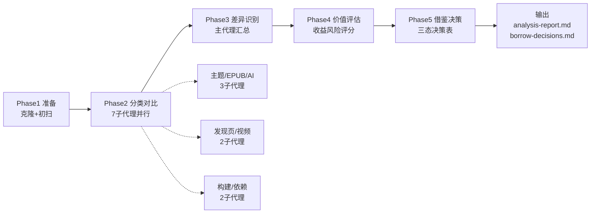
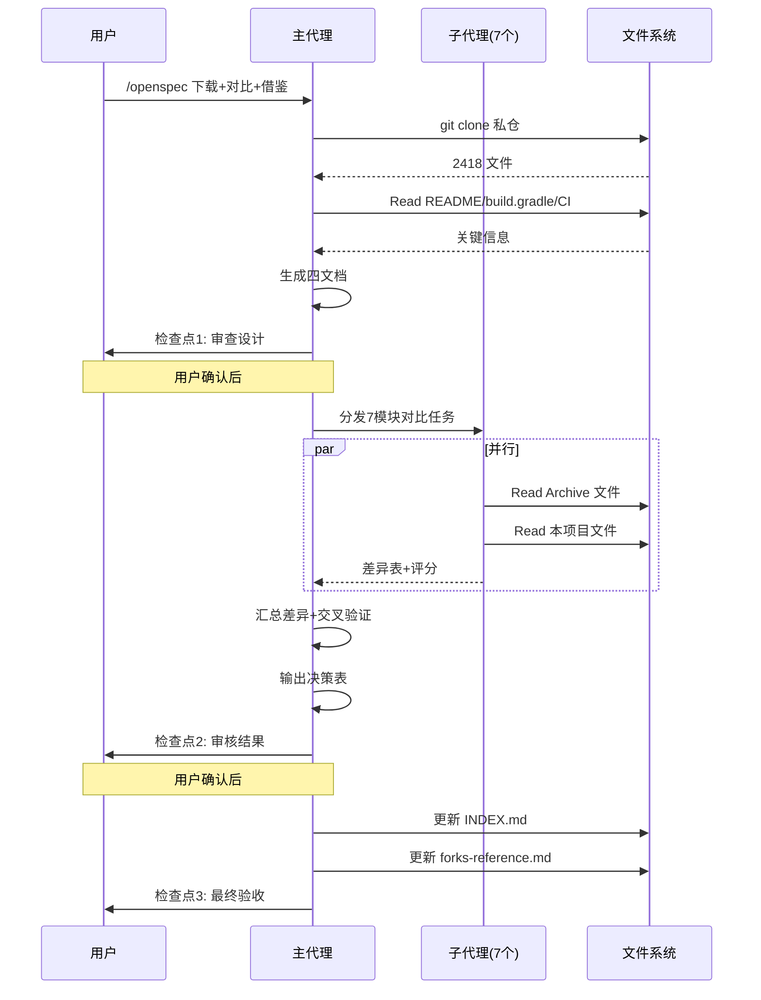

# Design — 阅读 Archive 私仓深度对比与借鉴分析

---

## Technical Approach（技术方案）

### 总体架构

采用**五阶段对比流水线 + 子代理并行编排**架构，主代理负责任务调度与最终验证，子代理负责具体模块的源码分析。



### 子代理编排策略

依据 `sub-agent-quality-management.md`：

| 子代理 | 任务 | 文件预算 | 风险级别 | 策略 |
|--------|------|---------|---------|------|
| SA-1 | 主题管理对比 | ≤8 文件 | 低 | 强制子代理 |
| SA-2 | EPUB 阅读对比 | ≤10 文件 | 低 | 强制子代理 |
| SA-3 | AI 助手对比 | ≤12 文件 | 低 | 强制子代理 |
| SA-4 | 发现页/订阅源对比 | ≤10 文件 | 低 | 强制子代理 |
| SA-5 | 视频播放对比 | ≤12 文件 | 低 | 强制子代理 |
| SA-6 | 构建配置对比 | ≤6 文件 | 低 | 强制子代理 |
| SA-7 | 依赖库对比 | ≤4 文件 | 低 | 强制子代理 |

### 输入输出契约

**子代理输入**（主代理准备）：
- 对比维度描述
- 两边待对比的文件清单（≤12 文件）
- 输出格式要求：差异表 + 价值评估
- 禁止项：禁止输出真实 URL/源名称/cookie（遵守 output-safety.md）

**子代理输出**（统一格式）：
```markdown
## 模块名 对比

### 差异清单
| 差异点 | Archive 实现 | 本项目实现 | 差异类型 | 收益(1-5) | 风险(1-5) | 借鉴成本 |
|-------|-------------|-----------|---------|----------|----------|---------|

### 关键发现
- 发现1：...
- 发现2：...

### 建议决策
- 借鉴：[条目]（理由）
- 不借鉴：[条目]（理由）
- 待评估：[条目]（理由）
```

---

## Architecture Decisions（架构决策 — ADR Y-Statement）

### AD-01: 浅克隆而非深克隆
- **Context**：私仓克隆方式选择，需要权衡克隆速度 vs 历史分析能力
- **Concern**：深克隆会下载完整 git 历史，对大仓库耗时长且占用磁盘
- **Decision**：使用 `git clone --depth 1` 浅克隆
- **Goal**：快速获取当前状态，支撑差异分析与借鉴决策
- **Tradeoff**：接受"无法看历史变更轨迹"的缺点，换取克隆速度与磁盘占用优势
- **Status**：Accepted
- **Superseded-by**：无

### AD-02: 子代理并行而非主代理串行
- **Context**：7 大模块对比，主代理串行会消耗大量上下文且易触发思考上限
- **Concern**：主代理上下文窗口有限，7 模块逐个分析会超限
- **Decision**：7 个子代理并行分析（单代理 ≤12 文件），主代理汇总
- **Goal**：规避主代理上下文上限，并行加速分析
- **Tradeoff**：接受"子代理编排成本 + 主代理需二次验证"的代价，换取上下文安全与并行加速
- **Status**：Accepted
- **Superseded-by**：无

### AD-03: 三态决策表（借鉴/不借鉴/待评估）
- **Context**：借鉴决策输出格式选择
- **Concern**：二态决策（借鉴/不借鉴）过于极端，难以处理"收益高风险也高"的中间情况
- **Decision**：输出三态决策表，"待评估"作为合理中间态
- **Goal**：避免强行二选一导致误判，给后续任务留弹性
- **Tradeoff**：接受"待评估项需后续逐项消化"的代价，换取决策准确性
- **Status**：Accepted
- **Superseded-by**：无

### AD-04: 不直接应用借鉴点
- **Context**：用户要求"分析能学到什么"，未要求"立即应用"
- **Concern**：直接应用借鉴点会触发源码修改，违反"只分析不修改"约束
- **Decision**：本任务只输出借鉴决策表，不修改本项目源码
- **Goal**：明确任务边界，借鉴应用作为独立 OpenSpec 任务
- **Tradeoff**：接受"用户需另开任务才能真正应用借鉴"的代价，换取任务边界清晰
- **Status**：Accepted
- **Superseded-by**：无

### AD-05: 收益/风险评分必须有源码依据
- **Context**：价值评估容易陷入主观打分
- **Concern**：凭直觉打分会导致决策表不可信
- **Decision**：每项评分必须引用源码文件/类/方法作为依据
- **Goal**：保证决策表可追溯、可验证
- **Tradeoff**：接受"评分耗时增加"的代价，换取决策可信度
- **Status**：Accepted
- **Superseded-by**：无

### AD-06: 文档同步纳入 forks-reference.md
- **Context**：forks-reference.md 已有"阅读Archive"条目但仅列公仓地址
- **Concern**：私仓对比结论若不沉淀，下次对比会重复劳动
- **Decision**：任务完成后更新 forks-reference.md，补充私仓地址与对比结论索引
- **Goal**：经验沉淀，避免重复工作
- **Tradeoff**：接受"forks-reference.md 内容增长"的代价，换取知识沉淀
- **Status**：Accepted
- **Superseded-by**：无

---

## Data Flow（数据流）



### 关键数据结构

**差异条目（DiffEntry）**：
```typescript
{
  id: string;                    // 唯一ID，如 "THEME-001"
  module: string;                // 模块名，如 "主题管理"
  title: string;                 // 差异标题
  archiveImpl: string;           // Archive 实现（含文件路径锚点）
  ourImpl: string;               // 本项目实现（含文件路径锚点）
  diffType: "unique_a" | "unique_b" | "a_better" | "b_better" | "impl_diff";
  benefit: 1 | 2 | 3 | 4 | 5;    // 收益分
  risk: 1 | 2 | 3 | 4 | 5;       // 风险分
  cost: "low" | "medium" | "high"; // 借鉴成本
  evidence: string;              // 源码依据（文件路径+行号）
  decision: "borrow" | "skip" | "evaluate";  // 决策
  reason: string;                // 决策理由
  followupSpec?: string;         // 后续 spec 名（仅 borrow 项）
}
```

---

## File Changes（文件变更）

### 新增文件

| 文件路径 | 内容 | 阶段 |
|---------|------|------|
| `docs/specs/forks-archive-comparison/README.md` | 功能概述+文档索引+状态 | 已生成 |
| `docs/specs/forks-archive-comparison/spec.md` | Intent/Scope/Approach/Requirements/Scenarios | 已生成 |
| `docs/specs/forks-archive-comparison/design.md` | 本文档 | 已生成 |
| `docs/specs/forks-archive-comparison/tasks.md` | 任务清单+AOAdapt 日志 | 已生成 |
| `docs/specs/forks-archive-comparison/analysis-report.md` | 差异分析报告（含 mermaid 图） | 实施阶段 |
| `docs/specs/forks-archive-comparison/borrow-decisions.md` | 借鉴决策表 | 实施阶段 |
| `temp/forks-comparison/legado-archive/` | 私仓克隆产物（2418 文件） | 已克隆 |

### 修改文件

| 文件路径 | 修改内容 | 阶段 |
|---------|---------|------|
| `docs/INDEX.md` | 添加 `forks-archive-comparison` spec 条目 | 设计阶段 |
| `docs/project-rules/forks-reference.md` | 补充私仓地址与对比结论索引 | 实施完成阶段 |

### 不修改文件

- **本项目源码不修改**（AD-04 决策）
- `temp/forks-comparison/legado-archive/` 内的文件不修改（只读分析）

---

## 风险与缓解

| 风险 | 等级 | 缓解措施 |
|------|------|---------|
| 子代理输出格式不统一 | 中 | 主代理 prompt 强制输出模板 + 二次验证 |
| 差异点过多导致决策表膨胀 | 中 | R3.1 约束"条目数 ≥3 才纳入"过滤噪声 |
| 评分主观偏差 | 中 | AD-05 强制源码依据 + 主代理交叉验证 |
| 浅克隆漏掉关键历史信息 | 低 | AD-01 已接受此风险，当前状态差异足够 |
| 源码引用违反 output-safety | 高 | 子代理 prompt 禁止输出真实 URL/源名称；主代理二次扫描 |

---

## 验证策略

### Level 1 - 代码完成（⚠️）
- 四文档文件存在
- analysis-report.md 与 borrow-decisions.md 文件存在

### Level 2 - 功能验证（⚠️）
- analysis-report.md 包含 7 大模块对比章节
- borrow-decisions.md 包含三态决策表
- 每项决策附理由与源码依据

### Level 3 - 场景验证（✅）
- 主代理抽样核对 ≥3 项决策的源码依据真实性
- 用户审查决策表是否符合预期
- 更新后的 INDEX.md 与 forks-reference.md 链接可点击
