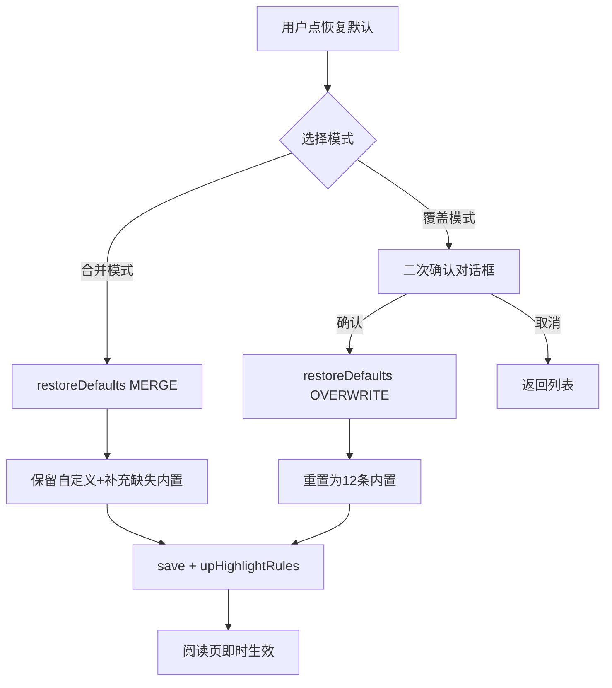

# 高亮规则丢失修复 + 恢复默认规则 - 技术设计

> **创建时间**：2026-07-29
> **状态**：🔄 设计中
> **设计总则**：修复愈合逻辑过度覆盖 + 新增恢复默认入口，零绘制层改动，零存储介质变更。

---

## §1 根因源码锚点

### 1.1 R-1 愈合逻辑过度覆盖

| 角色 | 锚点 |
|------|------|
| 主根因：shouldRefreshBuiltin 缺 pattern 判断 | HighlightRuleStore.kt:383-394（`if (!rule.isRegex) return true` 无 pattern 前置） |
| 覆盖点：builtin.copy() 不保留 pattern | HighlightRuleStore.kt:281-294（builtin.copy 参数无 pattern/sampleText/name） |
| 前序 spec 原方案（含 pattern 判断但实施丢失） | highlight-rule-fix-20260727/design.md §2.2 锚点2 |

### 1.2 R-2 无恢复默认入口

| 角色 | 锚点 |
|------|------|
| reset() 仅 load blank 调用 | HighlightRuleStore.kt:45-48（全工程 Grep 确认无其他调用方） |
| Activity 菜单无恢复选项 | HighlightRuleActivity.kt:43-58（onCompatOptionsItemSelected 仅 add/group/preset/import/export） |

## §2 修复设计

### 2.1 R-1 愈合逻辑修复

**锚点 1**：`shouldRefreshBuiltin`（HighlightRuleStore.kt:383-394）增加 pattern 前置判断，并改为接收 builtin 参数：

```kotlin
// normalizeRules 内构造 builtins map 后，传入 builtin 给 shouldRefreshBuiltin
private fun shouldRefreshBuiltin(rule: HighlightRule, builtin: HighlightRule): Boolean {
    if (rule.id !in builtinIds) return false
    // 修复：isRegex=false 仅在 pattern 与内置一致时才触发愈合（用户未改 pattern）
    // 用户改过 pattern 的内置规则不触发愈合，保留用户修改
    if (!rule.isRegex && rule.pattern == builtin.pattern) return true
    val inspectText = buildString {
        append(rule.name)
        append(rule.pattern)
        append(rule.sampleText)
    }
    return garbledMarkers.any { inspectText.contains(it) } ||
        legacyBuiltinPatterns[rule.id] == rule.pattern
}
```

**锚点 2**：`normalizeRules` 的 `builtin.copy()`（HighlightRuleStore.kt:282-294）保留用户改过的 pattern/sampleText/name：

```kotlin
val base = if (builtin != null && shouldRefreshBuiltin(safeRule, builtin)) {
    builtin.copy(
        enabled = safeRule.enabled,
        group = normalizedGroup,
        // 修复：保留用户改过的 pattern/sampleText/name（仅当用户改过时）
        pattern = safeRule.pattern.takeIf { it != builtin.pattern } ?: builtin.pattern,
        sampleText = safeRule.sampleText.takeIf { it.isNotBlank() } ?: builtin.sampleText,
        name = safeRule.name.takeIf { it.isNotBlank() } ?: builtin.name,
        targetScope = normalizeTargetScope(safeRule.targetScope, builtin.targetScope),
        textColor = safeRule.textColor ?: builtin.textColor,
        underlineMode = safeRule.underlineMode.takeIf { it != 0 } ?: builtin.underlineMode,
        underlineColor = safeRule.underlineColor ?: builtin.underlineColor,
        underlineWidth = safeRule.underlineWidth.takeIf { it != 1f } ?: builtin.underlineWidth,
        underlineSvgPath = safeRule.underlineSvgPath ?: builtin.underlineSvgPath,
        bgImage = safeRule.bgImage ?: builtin.bgImage,
        bgImageFit = safeRule.bgImageFit.takeIf { it != 0 } ?: builtin.bgImageFit,
        bgImageScale = safeRule.bgImageScale.takeIf { it != 1f } ?: builtin.bgImageScale
    )
}
```

### 2.2 R-2 恢复默认菜单

**锚点 1**：HighlightRuleStore 新增 `restoreDefaults` 方法 + RestoreMode 枚举：

```kotlin
enum class RestoreMode { MERGE, OVERWRITE }

fun restoreDefaults(context: Context, mode: RestoreMode): List<HighlightRule> {
    val defaults = createDefaultRules(context)
    return when (mode) {
        RestoreMode.MERGE -> {
            // 合并：保留用户自定义规则，补充缺失的内置规则
            val current = load(context)
            val existingIds = current.map { it.id }.toSet()
            val toAdd = defaults.filter { it.id !in existingIds }
            (current + toAdd).also { save(context, it) }
        }
        RestoreMode.OVERWRITE -> {
            // 覆盖：重置为内置规则
            save(context, defaults)
            defaults
        }
    }
}
```

**锚点 2**：HighlightRuleViewModel 新增 restoreDefaults 方法：

```kotlin
fun restoreDefaults(mode: RestoreMode) {
    execute {
        HighlightRuleStore.restoreDefaults(context, mode)
    }.onSuccess {
        _rulesLiveData.postValue(it)
        ReadBook.upHighlightRules()  // 即时生效
    }
}
```

**锚点 3**：HighlightRuleActivity 菜单新增"恢复默认规则"：

```kotlin
R.id.menu_restore_default -> showRestoreDefaultDialog()

private fun showRestoreDefaultDialog() {
    AlertDialog.Builder(this)
        .setTitle("恢复默认规则")
        .setMessage("选择恢复模式：\n\n合并模式：保留你的自定义规则，补充缺失的内置规则\n覆盖模式：删除所有规则，重置为 12 条内置规则")
        .setNegativeButton("取消", null)
        .setNeutralButton("覆盖模式（删除自定义）") { _, _ -> confirmOverwrite() }
        .setPositiveButton("合并模式（推荐）") { _, _ ->
            viewModel.restoreDefaults(RestoreMode.MERGE)
            toastOnUi("已恢复默认规则（合并模式）")
        }
        .show()
}

private fun confirmOverwrite() {
    AlertDialog.Builder(this)
        .setTitle("警告")
        .setMessage("覆盖模式将删除所有自定义规则！确定继续？")
        .setNegativeButton("取消", null)
        .setPositiveButton("确定覆盖") { _, _ ->
            viewModel.restoreDefaults(RestoreMode.OVERWRITE)
            toastOnUi("已重置为默认规则")
        }
        .show()
}
```

**锚点 4**：res/menu/highlight_rule.xml 新增 menu_restore_default 菜单项。

### 2.3 数据流



### 2.4 愈合逻辑数据流

```mermaid
flowchart TD
    A[load 规则] --> B{normalizeRules}
    B --> C{builtin != null}
    C -->|否| D[保留 safeRule]
    C -->|是| E{shouldRefreshBuiltin}
    E -->{pattern==builtin.pattern 且 isRegex=false| F[触发愈合]
    E -->{pattern 被用户改过| G[不触发愈合 保留用户pattern]
    F --> H[builtin.copy 保留用户pattern/sampleText/name]
    G --> D
    H --> D
    D --> I[返回规则列表]
```

## §3 Architecture Decisions

### AD-01: 愈合逻辑 pattern 前置判断
- **Context**: shouldRefreshBuiltin 仅判断 isRegex=false 就触发愈合，覆盖用户改过的 pattern
- **Concern**: 用户编辑过的内置规则 pattern 被覆盖，数据丢失
- **Decision**: 增加 `pattern == builtin.pattern` 前置判断，用户改过 pattern 不触发愈合
- **Goal**: 保留用户对内置规则的 pattern 修改
- **Tradeoff**: 用户改过 pattern 的内置规则不会自动修正 isRegex（需手动勾选正则）
- **Status**: Proposed

### AD-02: 恢复默认菜单合并模式优先
- **Context**: 用户清空规则后无法恢复内置常规规则；用户明确要求"初始化常规高亮内容规则进去软件里面"
- **Concern**: 需提供用户可控的恢复入口，且不丢失用户自定义规则
- **Decision**: 新增"恢复默认规则"菜单，合并模式为默认推荐，覆盖模式需二次确认
- **Goal**: 用户清空后可恢复内置规则，同时保护用户自定义规则
- **Tradeoff**: 合并模式 UI 需用户理解两种模式区别
- **Status**: Proposed

### AD-03: builtin.copy 保留用户 pattern
- **Context**: normalizeRules 的 builtin.copy() 不保留 safeRule 的 pattern/sampleText/name
- **Concern**: 即使 shouldRefreshBuiltin 触发愈合，也不应覆盖用户改过的 pattern
- **Decision**: builtin.copy() 保留 safeRule 的 pattern/sampleText/name（当用户改过时）
- **Goal**: 双重保护：shouldRefreshBuiltin 前置判断 + builtin.copy 保留用户字段
- **Tradeoff**: 愈合逻辑稍复杂，但符合"用户数据优先"原则
- **Status**: Proposed

## §4 File Changes

| 文件 | 变更类型 | 说明 |
|------|---------|------|
| HighlightRuleStore.kt | 修改 | shouldRefreshBuiltin 增加 pattern 判断+接收 builtin 参数 + normalizeRules builtin.copy 保留 pattern + 新增 restoreDefaults 方法 + RestoreMode 枚举 |
| HighlightRuleActivity.kt | 修改 | 新增 showRestoreDefaultDialog + confirmOverwrite + 菜单处理 |
| HighlightRuleViewModel.kt | 修改 | 新增 restoreDefaults(mode) 方法 |
| res/menu/highlight_rule.xml | 修改 | 新增 menu_restore_default 菜单项 |
| res/values/strings.xml | 修改 | 新增恢复默认相关字符串（如需） |

## §5 成熟方案参考

- **蛋蛋Max / 阅读T**（前序 spec 借鉴来源）：恢复默认为"重置为内置规则"语义，本 spec 增加合并模式更友好
- 前序 spec design.md §2.2 原方案含 pattern 前置判断（needsRegexHeal），实际实施时丢失，本 spec 恢复原方案语义

## §6 日志设计（AppLog.put）

| 时机 | 日志内容 | 说明 |
|------|---------|------|
| 恢复默认-合并 | `AppLog.put("高亮规则：恢复默认（合并模式），新增 ${toAdd.size} 条内置规则")` | 只记数量 |
| 恢复默认-覆盖 | `AppLog.put("高亮规则：恢复默认（覆盖模式），重置为 ${defaults.size} 条内置规则")` | 只记数量 |
| 愈合触发 | 沿用前序 spec 设计，只记 id | 不新增 |

## §7 风险与回退

| 场景 | 风险 | 对策 |
|------|------|------|
| shouldRefreshBuiltin 需 builtin 参数 | normalizeRules 已构造 builtins map，传参即可 | 改签名，调用方仅 normalizeRules 一处 |
| 恢复默认覆盖模式数据丢失 | 用户投诉 | 二次确认对话框 + 明确警告文案 |
| 合并模式内置规则与用户规则 id 冲突 | upsert 已处理（T-B3） | 按 id 去重走 replace |
| 回退 | — | 改动集中在 HighlightRuleStore.kt + HighlightRuleActivity.kt，git revert 即可 |
