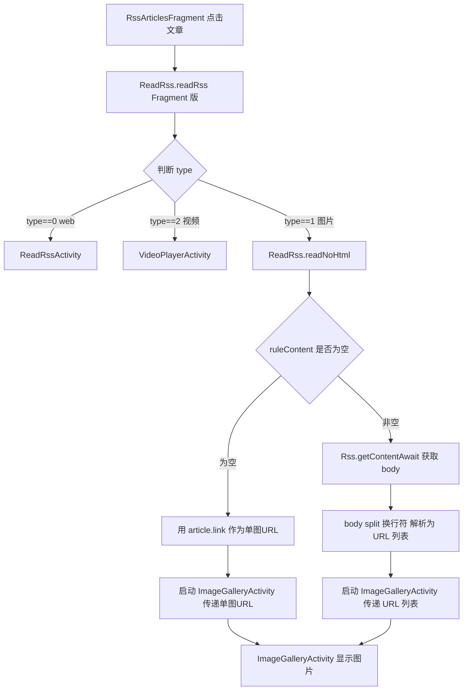
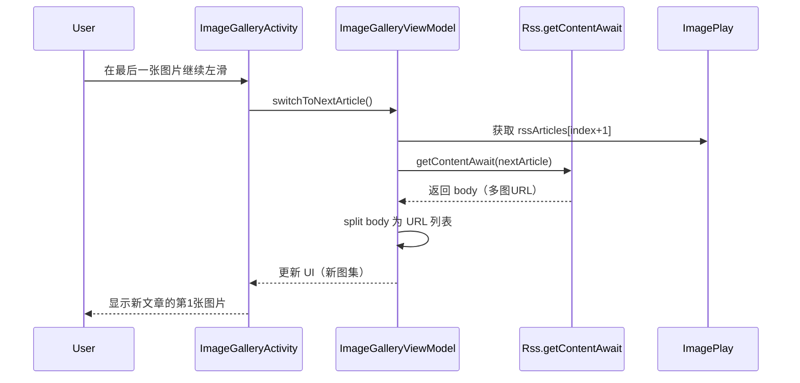

# Design: 图片浏览器 Activity 化改造

## Technical Approach

### 架构概览

参考 `VideoPlayerActivity` 的 Activity + ViewPager2 架构，新建 `ImageGalleryActivity`：

- **外层 ViewPager2（垂直方向）**：跨文章切换（上下滑动）
- **内层 ViewPager2（水平方向）**：图集内多图切换（左右滑动）
- **PhotoView**：单张图片显示，支持双指缩放
- **ImageGalleryViewModel**：管理文章列表、当前文章、当前图片、加载状态

### 核心组件

#### 1. ImageGalleryActivity（新建）

```kotlin
class ImageGalleryActivity : VMBaseActivity<ActivityImageGalleryBinding, ImageGalleryViewModel>() {
    // 外层 ViewPager2（垂直）：跨文章切换
    // 内层 ViewPager2（水平）：图集内多图切换
    // 复用 VideoPlay 单例机制传递 rssArticles
}
```

#### 2. ImageGalleryViewModel（新建）

```kotlin
class ImageGalleryViewModel : VMBaseViewModel() {
    // 持有当前文章列表、当前文章索引、当前图片URL列表
    // 提供 loadArticleContent(position: Int) 方法
    // 调用 Rss.getContentAwait() 获取图集
}
```

#### 3. ImagePlay 单例（新建，参考 VideoPlay）

```kotlin
object ImagePlay {
    var rssArticles: List<RssArticle>? = null
    var rssArticleIndex: Int = 0
    var rssSortName: String? = null
    var rssSortUrl: String? = null
    var rssNextPageUrl: String? = null
    var rssArticlePage: Int = 1
    var rssArticlesHasMore: Boolean = false
    var lastPlayedArticleLink: String? = null  // 位置记忆
}
```

#### 4. 多图URL解析（修改 ReadRss.readNoHtml）

```kotlin
// 原：body 当作单个URL
val url = NetworkUtils.getAbsoluteURL(rssArticle.link, body)
fragment.showDialogFragment(PhotoDialog(url))

// 改：body 按换行split为URL列表
val imageUrls = body.split("\n")
    .map { NetworkUtils.getAbsoluteURL(rssArticle.link, it.trim()) }
    .filter { it.isNotBlank() && it.startsWith("http") }
// 启动 ImageGalleryActivity
ImagePlay.rssArticles = rssArticles
ImagePlay.rssArticleIndex = ...
fragment.startActivity<ImageGalleryActivity> {
    putStringArrayList("imageUrls", ArrayList(imageUrls))
    putExtra("origin", rssArticle.origin)
    putExtra("title", rssArticle.title)
}
```

## Architecture Decisions

### AD-01: 新建 ImageGalleryActivity 而非改造 PhotoDialog

- **Context**: RSS 图片订阅源详情展示当前用 PhotoDialog（单图 DialogFragment），需支持多图浏览、跨文章切换、长按保存等复杂交互
- **Concern**: PhotoDialog 作为 DialogFragment 受窗口限制，无法全屏沉浸；生命周期管理复杂；在多处用作单图查看，改动影响面大
- **Decision**: 新建 `ImageGalleryActivity`，参考 `VideoPlayerActivity` 架构
- **Goal**: 提供与视频播放器一致的 Activity 模式图片浏览体验，支持多图、跨文章、复杂交互
- **Tradeoff**: 代码量增加约 600-800 行；存在两套图片查看逻辑（PhotoDialog 单图 + ImageGalleryActivity 多图）
- **Status**: Proposed

### AD-02: 复用 VideoPlay 单例机制，新建 ImagePlay 单例

- **Context**: 需要在 RssArticlesFragment 和 ImageGalleryActivity 之间传递 rssArticles 列表、索引、分页信息
- **Concern**: Intent 传递大数据（文章列表）有 Binder 事务大小限制（1MB）；VideoPlay 已有类似机制但语义是视频
- **Decision**: 新建 `ImagePlay` 单例，字段结构与 `VideoPlay` 对齐（rssArticles/rssArticleIndex/rssSortName/rssSortUrl/rssNextPageUrl/rssArticlePage/rssArticlesHasMore/lastPlayedArticleLink）
- **Goal**: 解耦 Intent 传递，支持 Activity 间共享文章列表状态；与 VideoPlay 语义隔离
- **Tradeoff**: 单例持有 Activity 数据需注意生命周期（在 Activity onDestroy 时清理，避免内存泄漏）
- **Status**: Proposed

### AD-03: 多图URL解析放在 ReadRss.readNoHtml 而非 Rss.getContentAwait

- **Context**: `Rss.getContentAwait()` 返回 String，可能包含多图URL（换行分隔）
- **Concern**: 修改 `Rss.getContentAwait()` 会影响所有调用方（包括 ReadRssActivity web 模式）
- **Decision**: 在 `ReadRss.readNoHtml()` 中对 body 做 `split("\n")` 解析为 URL 列表，`Rss.getContentAwait()` 保持不变
- **Goal**: 最小化影响范围，只改图片分支（type==1）
- **Tradeoff**: 多图URL的解析逻辑分散在调用方，未来如果有其他图片入口需要重复解析逻辑
- **Status**: Proposed

### AD-04: 双 ViewPager2 嵌套（外层垂直跨文章，内层水平跨图片）

- **Context**: 需要同时支持"图集内左右滑动"和"跨文章上下滑动"
- **Concern**: ViewPager2 嵌套有滑动冲突风险
- **Decision**: 参考 VideoPlayerActivity 的 ViewPager2 嵌套模式（已验证可行），外层垂直方向，内层水平方向
- **Goal**: 复用已验证的嵌套 ViewPager2 架构，降低滑动冲突风险
- **Tradeoff**: 嵌套 ViewPager2 性能开销略高（但图片浏览场景可接受）
- **Status**: Proposed

### AD-05: 保留 PhotoDialog 用于单图场景

- **Context**: PhotoDialog 在多处用作单图查看（验证码 VerificationCodeDialog、书籍插图 ReadBookActivity、文本图片 TextDialog）
- **Concern**: 如果完全废弃 PhotoDialog，需要改造所有调用方
- **Decision**: 保留 PhotoDialog 用于单图场景，只改 `ReadRss.readNoHtml()` 中 type==1 的入口
- **Goal**: 最小化影响范围，不破坏现有单图查看功能
- **Tradeoff**: 存在两套图片查看逻辑（PhotoDialog 单图 + ImageGalleryActivity 多图）
- **Status**: Proposed

## Data Flow

### 主流程：点击文章 → 多图浏览



### 跨文章切换流程



## File Changes

### 新增文件

| 文件路径 | 说明 |
|---------|------|
| `app/src/main/java/io/legado/app/ui/image/ImageGalleryActivity.kt` | 图片浏览 Activity 主类 |
| `app/src/main/java/io/legado/app/ui/image/ImageGalleryViewModel.kt` | 图片浏览 ViewModel |
| `app/src/main/java/io/legado/app/ui/image/ImagePlay.kt` | 图片浏览状态单例（参考 VideoPlay） |
| `app/src/main/java/io/legado/app/ui/image/adapter/ImageArticlePagerAdapter.kt` | 外层 ViewPager2 适配器（跨文章） |
| `app/src/main/java/io/legado/app/ui/image/adapter/ImagePageAdapter.kt` | 内层 ViewPager2 适配器（图集内多图） |
| `app/src/main/res/layout/activity_image_gallery.xml` | Activity 布局（外层 ViewPager2 + 页码 + 加载进度） |
| `app/src/main/res/layout/item_image_article.xml` | 外层 ViewPager2 item 布局（内层 ViewPager2 + 加载进度） |
| `app/src/main/res/layout/item_image_page.xml` | 内层 ViewPager2 item 布局（PhotoView） |

### 修改文件

| 文件路径 | 修改内容 |
|---------|---------|
| `app/src/main/java/io/legado/app/ui/rss/read/ReadRss.kt` | `readNoHtml()` 中 type==1 改为启动 ImageGalleryActivity；多图URL解析（split 换行符） |
| `app/src/main/java/io/legado/app/ui/rss/article/RssArticlesFragment.kt` | `readRss()` 传递 rssArticles 列表给 ImagePlay（与 VideoPlay 一致） |
| `app/src/main/AndroidManifest.xml` | 注册 ImageGalleryActivity |

### 不修改文件（保持不变）

| 文件路径 | 不修改理由 |
|---------|-----------|
| `app/src/main/java/io/legado/app/ui/widget/dialog/PhotoDialog.kt` | 保留单图查看用途（验证码、书籍插图、文本图片） |
| `app/src/main/java/io/legado/app/model/rss/Rss.kt` | `getContentAwait()` 保持返回 String，由调用方 split |
| `app/src/main/java/io/legado/app/ui/rss/article/RssArticlesAdapter*.kt` | 列表布局不变（articleStyle 1/2/3/4 保持不变） |
| `app/src/main/java/io/legado/app/ui/video/VideoPlayerActivity.kt` | 视频播放器不变 |
| `app/src/main/java/io/legado/app/model/VideoPlay.kt` | VideoPlay 单例不变（ImagePlay 是独立单例） |

## 技术要点

### 1. ViewPager2 嵌套滑动冲突

参考 VideoPlayerActivity 已验证的方案：
- 外层 ViewPager2 设置 `orientation = ORIENTATION_VERTICAL`
- 内层 ViewPager2 设置 `orientation = ORIENTATION_HORIZONTAL`
- 利用 ViewPager2 内置的方向隔离避免冲突
- 如有冲突，可在内层 ViewPager2 的 `onTouchEvent` 中拦截

### 2. PhotoView 双指缩放 + 旋转

项目已有 `io.legado.app.ui.widget.image.PhotoView`（在 PhotoDialog 中使用），直接复用：
- 支持双指缩放
- 支持双击切换缩放级别
- 支持平移

**旋转实现方案**（用户2026-07-25反馈强化）：
- PhotoView 继承自 AppCompatImageView，支持 `setRotation(degrees)` 方法
- 在 ImagePageAdapter 的 ViewHolder 中维护 `rotationDegree: Int`（0/90/180/270）
- 顺时针旋转按钮：`rotationDegree = (rotationDegree + 90) % 360; photoView.rotation = rotationDegree`
- 逆时针旋转按钮：`rotationDegree = (rotationDegree + 270) % 360; photoView.rotation = rotationDegree`
- 重置按钮：`rotationDegree = 0; photoView.rotation = 0f; photoView.scale = 1f`（重置旋转+缩放）
- 翻页时重置 rotationDegree = 0（每张图独立旋转状态，不跨图继承）
- 注意：`setRotation` 是 View 基类方法，旋转后可能影响布局（需配合 `scaleType=fitCenter` 避免裁剪）
- 旋转手势用按钮触发（不用双指旋转手势），避免与双指缩放/ViewPager2 翻页冲突

### 3. 图片加载（Glide）

复用 `ImageLoader` + `OkHttpModelLoader`（支持 sourceOrigin 用于 referer/cookie）：
```kotlin
ImageLoader.load(context, imageUrl)
    .apply(RequestOptions().set(OkHttpModelLoader.sourceOriginOption, sourceOrigin))
    .error(R.drawable.image_loading_error)
    .diskCacheStrategy(DiskCacheStrategy.ALL)
    .into(photoView)
```

### 4. 长按保存图片

参考 ReadBookActivity 中保存图片的逻辑（L1501-L1506）：
- 长按弹出菜单
- 选择"保存"后用 Glide 下载图片到 `ACache.get().getAsString(AppConst.imagePathKey)` 指定的目录
- 通知相册刷新

### 5. 沉浸式全屏

```kotlin
// 点击切换沉浸式
window.setFlags(
    WindowManager.LayoutParams.FLAG_FULLSCREEN,
    WindowManager.LayoutParams.FLAG_FULLSCREEN
)
// 隐藏状态栏和导航栏
window.decorView.systemUiVisibility = (View.SYSTEM_UI_FLAG_FULLSCREEN
    or View.SYSTEM_UI_FLAG_HIDE_NAVIGATION
    or View.SYSTEM_UI_FLAG_IMMERSIVE_STICKY)
```

### 6. 位置记忆（参考 VideoPlay.lastPlayedArticleLink）

- 在 ImageGalleryActivity onDestroy 时，记录当前文章 link 到 `ImagePlay.lastPlayedArticleLink`
- 在 RssArticlesFragment onResume 时，检查 `ImagePlay.lastPlayedArticleLink` 并滚动到对应位置
