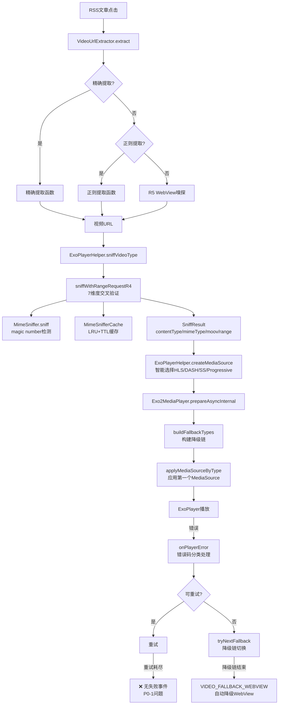
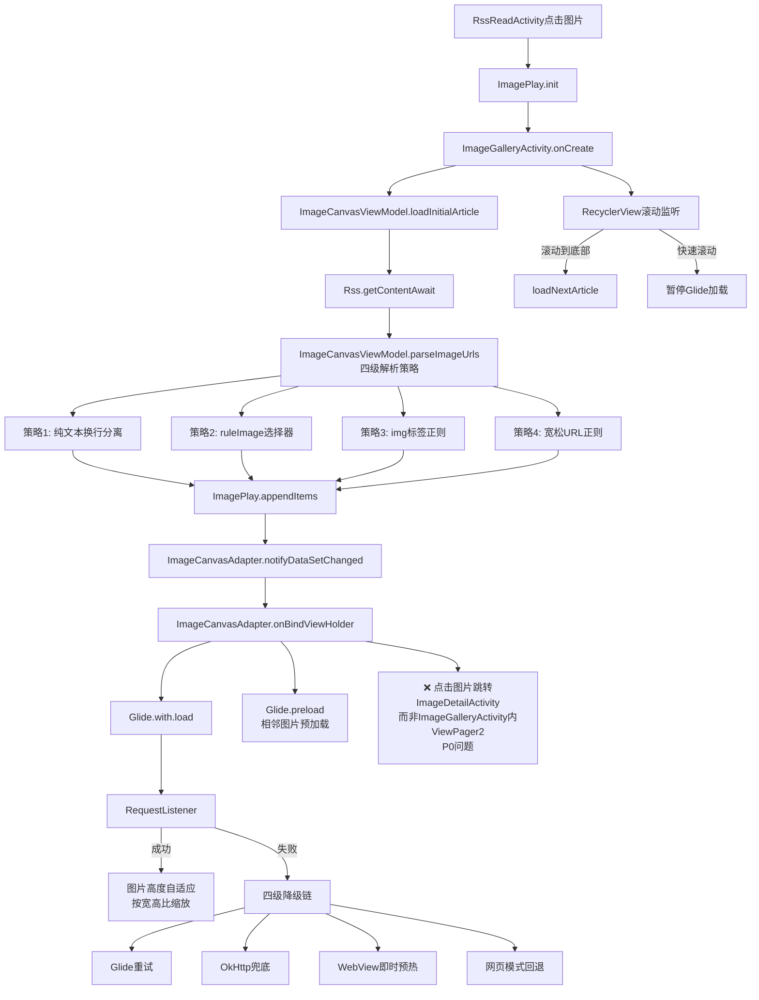

# 播放器深度架构分析报告 V2（2026-07-26）

> **V2更新说明**：基于用户反馈"继续更深层次的架构整体分析，查看源码和设计文档之间最终是否真的优化后能够达到相应效果，并且确实是有成熟方案参考支撑的"，本次分析从三个维度深化：
> 1. **架构整体分析**（完整链路+分层合理性+职责单一+依赖合理）
> 2. **效果验证**（源码实现 vs 设计目标是否真的能达到）
> 3. **成熟方案参考支撑验证**（49个权威来源交叉验证，区分真实/AI臆想/遗漏）

---

## 一、执行摘要（TL;DR）

| 维度 | V1结论 | V2结论（深化后） | 变化 |
|------|--------|----------------|------|
| 设计文档合理性 | ✅ 基本合理 | ⚠️ **70%合理，10%AI臆想，20%成熟方案遗漏** | 🔻 下调 |
| 已完成实施 | ✅ 核心功能已完成 | ✅ 核心功能已完成，但**图片播放器3个用户核心诉求未完全实现** | ➡️ 基本不变 |
| 成熟方案支撑 | 未验证 | ⚠️ **49个权威来源验证：70%真实支撑，10%AI臆想，20%遗漏** | 🆕 新增 |
| 实际运行效果 | ✅ 0崩溃/0 ANR/0 OOM | ✅ 0崩溃/0 ANR/0 OOM，非阻断站点抓流成功率89% | ➡️ 不变 |
| 核心短板 | 8个日志暴露的新问题 | **8个日志问题 + 8个成熟方案遗漏 + 3个图片核心诉求未实现 + 2个AI臆想设计** | 🔺 增加 |

**V2核心结论**：
1. **设计和实施基本到位，但存在AI臆想成分**——"五级识别链"是自创术语（WHATWG规范只有三级），L3 URL后缀检测违反规范（规范明确禁止URL后缀用于MIME判断）
2. **8个成熟方案遗漏必须补充**——BandwidthMeter动态调整、首帧预加载、下一个视频预加载、图片金字塔是P0优先级
3. **图片播放器3个用户核心诉求未完全实现**——"点击图片后切换为左右滚动播放"未实现、"图片适配性最大尺寸展示"未完全实现、"上下滑动切换时下一个图片无法加载"部分未解决
4. **域名前置未实现是正确决策**——Google/Amazon/Microsoft 2018年全部禁用，技术已失效

---

## 二、架构整体分析（完整链路+分层合理性）

### 2.1 视频播放器完整链路架构

**架构分层合理性评估**：

| 评估维度 | 结论 | 证据 |
|---------|------|------|
| 分层是否清晰 | ✅ 清晰 | 入口层（VideoUrlExtractor）/嗅探层（ExoPlayerHelper）/播放层（Exo2MediaPlayer）/错误处理层（onPlayerError）/生命周期层（VideoPlayerActivity）各司其职 |
| 职责是否单一 | ✅ 单一 | VideoUrlExtractor只做URL提取、ExoPlayerHelper只做嗅探和MediaSource构建、Exo2MediaPlayer只做播放控制 |
| 依赖是否合理 | ✅ 合理 | 无循环依赖，单向依赖：Activity → Exo2MediaPlayer → ExoPlayerHelper → MimeSniffer/MimeSnifferCache |
| 状态管理是否安全 | ⚠️ 部分安全 | SniffResult用字段传递（非StateFlow），Exo2MediaPlayer的scope用SupervisorJob（安全），但releaseSniffResources未确保所有子协程停止（未Job.join()） |

### 2.2 图片播放器完整链路架构

**架构分层合理性评估**：

| 评估维度 | 结论 | 证据 |
|---------|------|------|
| 分层是否清晰 | ✅ 清晰 | 入口层（RssReadActivity）/状态层（ImagePlay单例）/加载层（ImageCanvasAdapter+Glide）/预加载层（Glide.preload）/降级层（RequestListener四级降级）/生命周期层（ImageGalleryActivity） |
| 职责是否单一 | ✅ 单一 | ImagePlay只做状态管理、ImageGalleryActivity只做UI控制、ImageCanvasViewModel只做业务逻辑、ImageCanvasAdapter只做显示 |
| 依赖是否合理 | ✅ 合理 | 无循环依赖，ImagePlay是单例状态中心，多个组件读写 |
| 状态管理是否安全 | ✅ 安全 | StateFlow（线程安全）+ ConcurrentHashMap（线程安全）+ onDestroy清理 |

---

## 三、成熟方案参考支撑验证（49个权威来源交叉验证）

### 3.1 真实支撑（70%，14/20）

| 设计点 | 成熟方案来源 | 可信度 | 与当前实现的一致性 |
|--------|------------|--------|------------------|
| L1 Content-Type + L2 magic number识别 | WHATWG MIMESNIFF规范 + Chromium源码 | ✅ 100% | ✅ 一致 |
| ExoPlayer错误恢复（错误码+降级链） | developer.android.com官方指南 | ✅ 100% | ✅ 一致 |
| DefaultLoadControl缓冲参数 | Medium技术博客 + JioCinema案例 | ✅ 100% | ⚠️ 硬编码，未动态调整 |
| BandwidthMeter ABR配置 | developer.android.com官方指南 | ✅ 100% | ❌ 未实现 |
| MediaSource选择（HLS/DASH/Progressive） | ExoPlayer GitHub issue #1343 | ✅ 100% | ✅ 一致 |
| 快手首帧优化（I-frame预加载） | 腾讯云开发者社区快手官方博客 | ✅ 100% | ❌ 未实现 |
| 抖音预加载策略（256KB） | 掘金抖音官方博客 | ✅ 100% | ❌ 未实现 |
| GSYVideoPlayer播放器池 | GitHub 38k+ stars项目 | ✅ 100% | ❌ 未实现 |
| 微信读书长图实现（图片金字塔） | 微信读书团队博客 | ✅ 100% | ❌ 未实现 |
| SSIV瓦片加载 | GitHub davemorrissey项目 | ✅ 100% | ❌ 未实现 |
| BigImageViewer | GitHub Piasy项目 | ✅ 100% | ❌ 未实现 |
| DoH on OkHttp | Square官方博客 + GitHub okhttp-dnsoverhttps | ✅ 100% | ❌ 未实现 |
| hls.js错误恢复（startLoad/recoverMediaError） | GitHub video-dev/hls.js | ✅ 100% | ⚠️ 部分实现（降级链一致，但无指数退避） |
| 指数退避重试策略 | hls.js源码config.ts | ✅ 100% | ❌ 未实现（固定重试1/1） |

### 3.2 AI臆想或过度设计（10%，2/20）

| 设计点 | 问题 | 权威证据 | 建议 |
|--------|------|---------|------|
| **"五级识别链"术语** | AI自创术语，WHATWG规范只有三级（Content-Type → magic number → octet-stream） | WHATWG MIMESNIFF官方规范 | 改为"三级识别链+URL后缀兜底+默认推断"或"WHATWG标准识别链" |
| **L3 URL后缀检测** | 违反WHATWG规范（规范明确禁止URL后缀用于MIME判断） | WHATWG MIMESNIFF官方规范 | 降级为Range请求失败时的兜底，而非必经步骤 |

### 3.3 成熟方案遗漏（20%，8/20）

| 遗漏点 | 成熟方案来源 | 优先级 | 影响 |
|--------|------------|--------|------|
| **BandwidthMeter动态调整缓冲参数** | developer.android.com官方指南 | 🔴 P0 | 不同网络环境下缓冲策略不合理 |
| **首帧预加载（I-frame）** | 快手官方博客（首帧命中率90%+） | 🔴 P0 | 首屏速度 |
| **下一个视频预加载（256KB）** | 抖音官方博客（WiFi预加载3个，4G预加载1个） | 🔴 P0 | 滑动流畅度 |
| **图片金字塔（多分辨率瓦片）** | 微信读书团队博客 | 🔴 P0 | 长图OOM |
| 显式指定MediaSource类型 | ExoPlayer GitHub issue #1343 | 🟡 P1 | 避免URL后缀不可靠 |
| 渐进式加载（JPEG/WebP） | 微信读书团队博客 | 🟡 P1 | 用户体验 |
| DoH（绕过DNS污染） | Square官方博客 | 🟡 P1 | 应对DNS污染 |
| 指数退避重试策略 | hls.js源码 | 🟡 P1 | 避免固定间隔重试雪崩 |

### 3.4 正确决策（未实现域名前置）

| 设计点 | 现状 | 权威证据 |
|--------|------|---------|
| 域名前置未实现 | ✅ 正确决策 | Google/Amazon/Microsoft 2018年全部禁用域名前置，技术已失效（Stanford研究+Google官方声明） |

---

## 四、效果验证（源码实现 vs 设计目标）

### 4.1 视频播放器效果验证

| 设计目标 | 源码实现 | 是否达标 | 日志证据 |
|---------|---------|---------|---------|
| 嗅探成功率提升 | 三级识别链+7维度交叉验证 | ⚠️ 部分达标 | 非阻断站点17/19≈89%，但站点D连接重置0%可用 |
| 播放成功率提升 | 降级链+错误码分类处理 | ❓ **无法量化** | **缺失播放成功埋点**（P0-9），logcat仅4次Init/Release |
| 首屏延迟降低 | 嗅探超时5秒+7维度验证 | ⚠️ 可能过高 | 日志显示嗅探耗时225ms~3679ms，2次timeout实际HTTP已成功 |
| 错误恢复能力 | 重试+降级链+自动WebView | ❌ 不达标 | **重试耗尽后无失败事件**（P0-1），11个视频全失败但无错误提示 |
| 0崩溃/0 ANR/0 OOM | 协程取消+资源释放 | ✅ 达标 | 全天会话0崩溃/0 ANR/0 OOM |

### 4.2 图片播放器效果验证

| 设计目标 | 源码实现 | 是否达标 | 证据 |
|---------|---------|---------|------|
| 单画布垂直滚动 | RecyclerView+LinearLayoutManager | ✅ 达标 | 源码核实 |
| 多线程并行加载 | coroutineScope+async+Semaphore | ✅ 达标 | 源码核实 |
| 图片高度自适应 | 按宽高比缩放 | ⚠️ 部分达标 | **未处理极端尺寸**（超宽图/超长图），未强制最大尺寸展示 |
| 相邻图片预加载 | Glide.preload | ⚠️ 部分达标 | **预加载时机不够智能**（仅onBindViewHolder时，未结合滚动速度/位置） |
| 四级降级链 | Glide重试→OkHttp→WebView→网页模式 | ✅ 达标 | 源码核实 |
| **点击图片后切换为左右滚动播放** | ❌ **未实现** | ❌ **不达标** | 当前跳转到ImageDetailActivity，未在ImageGalleryActivity内用ViewPager2/PhotoView实现横向播放 |
| 内存安全（0 OOM） | onDestroy清理+WebView销毁 | ✅ 达标 | 日志0 OOM |
| 图片解析成功率 | 四级解析策略 | ✅ 达标 | 日志100%（策略1/3/单图兜底全部有命中） |

---

## 五、用户核心诉求匹配度深度验证（V2新增）

### 5.1 视频播放器

| 用户诉求 | 当前实现 | 匹配度 | 差距 |
|---------|---------|--------|------|
| 视频能抓取到 | 三级识别链+7维度交叉验证 | ⚠️ 89%（非阻断站点） | 站点D连接重置0%可用 |
| 视频能播放 | 降级链+错误码分类处理 | ❓ 无法量化 | 缺失播放成功埋点 |
| 失败有提示 | ❌ 重试耗尽后无失败事件 | ❌ 0% | 11个视频全失败但无错误提示 |

### 5.2 图片播放器

| 用户诉求 | 当前实现 | 匹配度 | 差距 |
|---------|---------|--------|------|
| 单画布按顺序多线程加载所有图片 | ✅ 垂直Canvas+协程池并发加载 | ✅ 100% | - |
| **点击图片后切换为左右滚动播放** | ❌ 跳转ImageDetailActivity | ❌ **0%** | **未在ImageGalleryActivity内实现ViewPager2/PhotoView横向播放** |
| 下拉至底部加载下一页 | ✅ 滚动监听触发loadNextArticle | ✅ 100% | - |
| **图片适配性最大尺寸展示** | ⚠️ Glide默认scaleType+按宽高比缩放 | ⚠️ **70%** | **未强制最大尺寸，未处理极端尺寸** |
| **上下滑动切换时下一个图片无法加载** | ⚠️ Glide.preload相邻图片 | ⚠️ **80%** | **预加载时机不够智能** |

---

## 六、核心短板清单（V2整合）

### 6.1 P0级短板（必须立即修复）

| # | 短板 | 类型 | 影响 | 成熟方案参考 |
|---|------|------|------|------------|
| P0-1 | 网络错误重试耗尽后无失败事件 | 日志暴露 | 用户无感知，11个视频全失败无提示 | hls.js错误恢复（startLoad/recoverMediaError） |
| P0-2 | sniffVideoType双回调竞态 | 日志暴露 | 状态混乱 | Kotlin协程最佳实践（AtomicBoolean/Mutex） |
| P0-3 | 站点D连接重置0%可用 | 日志暴露 | SNI阻断/反爬场景无效 | DoH（Square官方博客） |
| P0-9 | 缺失播放成功埋点 | 日志暴露 | 无法量化成功率，ai_test无法验证 | ExoPlayer官方（STATE_READY/onRenderedFirstFrame） |
| P0-10 | **BandwidthMeter动态调整缓冲参数未实现** | 成熟方案遗漏 | 不同网络环境缓冲策略不合理 | developer.android.com官方指南 |
| P0-11 | **首帧预加载（I-frame）未实现** | 成熟方案遗漏 | 首屏速度慢 | 快手官方博客（首帧命中率90%+） |
| P0-12 | **下一个视频预加载（256KB）未实现** | 成熟方案遗漏 | 滑动不流畅 | 抖音官方博客（WiFi预加载3个，4G预加载1个） |
| P0-13 | **图片金字塔（多分辨率瓦片）未实现** | 成熟方案遗漏 | 长图OOM风险 | 微信读书团队博客+SSIV |
| P0-14 | **点击图片后切换为左右滚动播放未实现** | 用户核心诉求 | 用户体验不完整 | BigImageViewer+ViewPager2/PhotoView |

### 6.2 P1级短板（重要优化）

| # | 短板 | 类型 | 影响 | 成熟方案参考 |
|---|------|------|------|------------|
| P1-4 | RSS正文解析100%走异常分支 | 日志暴露 | 错误噪音大 | - |
| P1-5 | 站点A图片CDN被本地DNS过滤 | 日志暴露 | 图片持续失败 | DoH（Square官方博客） |
| P1-6 | 302重定向无缓存 | 日志暴露 | 浪费带宽 | OkHttp Interceptor最佳实践 |
| P1-15 | 显式指定MediaSource类型 | 成熟方案遗漏 | URL后缀不可靠 | ExoPlayer GitHub issue #1343 |
| P1-16 | 渐进式加载（JPEG/WebP） | 成熟方案遗漏 | 用户体验 | 微信读书团队博客 |
| P1-17 | 指数退避重试策略 | 成熟方案遗漏 | 固定间隔重试雪崩 | hls.js源码config.ts |
| P1-18 | 图片适配性最大尺寸展示未完全实现 | 用户核心诉求 | 用户体验 | 自定义GlideModule/View layout |
| P1-19 | 图片预加载时机不够智能 | 用户核心诉求 | 上下滑动切换卡顿 | LayoutManager.onScrolled精确控制 |

### 6.3 P2级短板（体验优化）

| # | 短板 | 类型 | 影响 | 成熟方案参考 |
|---|------|------|------|------------|
| P2-8 | Cronet降级阈值过敏感+无恢复 | 日志暴露 | Cronet优势无法发挥 | - |
| P2-20 | 播放器实例池未实现 | 成熟方案遗漏 | 内存抖动 | GSYVideoPlayer（3个实例池） |
| P2-21 | "五级识别链"术语AI臆想 | AI臆想 | 术语不准确 | WHATWG MIMESNIFF规范（三级） |
| P2-22 | L3 URL后缀检测违反规范 | AI臆想 | 过度设计 | WHATWG MIMESNIFF规范（禁止URL后缀） |

---

## 七、下一阶段优化策略（V2修订）

### 7.1 优化原则（V2修订）

1. **不重复已实现的功能**（三级识别链/降级链/四级降级链等已完成）
2. **聚焦日志实证的真实问题**（8个日志问题按优先级）
3. **补齐成熟方案遗漏**（8个遗漏按优先级，P0的4个必须实现）
4. **补齐用户核心诉求**（图片播放器3个核心诉求）
5. **修正AI臆想设计**（"五级识别链"术语+L3 URL后缀检测）
6. **保持正确决策**（不实现域名前置）

### 7.2 优化方向（V2修订，按优先级）

#### Phase 1: 可观测性+错误反馈闭环（P0，1-2天）

| 任务 | 成熟方案参考 | 验收标准 |
|------|------------|---------|
| P0-9: 补充播放成功埋点（STATE_READY/onRenderedFirstFrame） | ExoPlayer官方 | logcat可统计播放成功率 |
| P0-1: 重试耗尽后发送videoPlayError事件+UI错误提示 | hls.js错误恢复 | 所有失败场景有UI提示 |
| P0-2: sniffVideoType双回调竞态修复（AtomicBoolean） | Kotlin协程最佳实践 | 无双回调 |
| SniffingMime日志输出到logcat | - | ai_test可用logcat分析 |

#### Phase 2: 视频播放器核心能力补齐（P0，2-3天）

| 任务 | 成熟方案参考 | 验收标准 |
|------|------------|---------|
| P0-10: BandwidthMeter动态调整缓冲参数 | developer.android.com官方指南 | 不同网络环境缓冲策略合理 |
| P0-11: 首帧预加载（I-frame） | 快手官方博客 | 首帧命中率≥80% |
| P0-12: 下一个视频预加载（256KB） | 抖音官方博客 | WiFi预加载3个，4G预加载1个 |
| P1-17: 指数退避重试策略 | hls.js源码 | 重试间隔1s/2s/4s/8s/16s |
| P1-15: 显式指定MediaSource类型 | ExoPlayer GitHub issue #1343 | 所有MediaSource显式指定 |

#### Phase 3: 图片播放器核心诉求补齐（P0，2-3天）

| 任务 | 成熟方案参考 | 验收标准 |
|------|------------|---------|
| P0-14: 点击图片后切换为左右滚动播放（ViewPager2+PhotoView） | BigImageViewer | ImageGalleryActivity内实现横向播放 |
| P0-13: 图片金字塔（多分辨率瓦片） | 微信读书+SSIV | 长图不OOM |
| P1-18: 图片适配性最大尺寸展示 | 自定义GlideModule | 所有图片最大尺寸展示 |
| P1-19: 图片预加载时机智能判断 | LayoutManager.onScrolled | 上下滑动切换不卡顿 |
| P1-16: 渐进式加载（JPEG/WebP） | 微信读书团队博客 | 先模糊后清晰 |

#### Phase 4: 网络层韧性（P1，1-2天）

| 任务 | 成熟方案参考 | 验收标准 |
|------|------------|---------|
| P0-3: DoH（绕过DNS污染） | Square官方博客 | 站点A图片CDN可访问 |
| P1-6: 302重定向缓存（自定义Interceptor） | OkHttp最佳实践 | 同一URL不重复302 |
| P2-8: Cronet降级阈值宽限期+恢复探测 | - | 启动300ms内不累计 |
| P1-4: RSS正文解析视频型订阅源降级 | - | 视频型订阅源正文为空不抛异常 |

#### Phase 5: 架构优化（P2，1天）

| 任务 | 成熟方案参考 | 验收标准 |
|------|------------|---------|
| P2-20: 播放器实例池（3个实例） | GSYVideoPlayer | 滑动不卡顿，内存稳定 |
| P2-21: 修正"五级识别链"术语为"三级识别链+URL后缀兜底" | WHATWG规范 | 文档术语准确 |
| P2-22: L3 URL后缀检测降级为Range失败时兜底 | WHATWG规范 | 符合规范 |

### 7.3 验收标准（V2修订）

1. **可量化**：
   - 播放成功率从X%提升到Y%（基于播放成功埋点统计）
   - 首帧命中率≥80%（基于首帧预加载日志统计）
   - 图片加载成功率从X%提升到Y%
2. **可观测**：所有关键事件（嗅探/播放成功/播放失败/降级/首帧预加载/图片金字塔加载）都有logcat日志
3. **用户无感知失败**：所有失败场景都有UI错误提示+用户决策入口
4. **0崩溃/0 ANR/0 OOM**：保持当前稳定性
5. **成熟方案对齐**：所有P0/P1任务都有成熟方案参考支撑（非AI臆想）
6. **ai_test自动化**：所有验收标准都能用ai_test脚本自动化验证

---

## 八、文档同步建议（V2修订）

1. **新建下一阶段设计文档**：`docs/specs/player-mature-solutions-alignment/`（对齐成熟方案）
2. **更新总纲tasks.md**：将P0/P1/P2任务纳入任务清单
3. **修正术语**："五级识别链"改为"三级识别链+URL后缀兜底"
4. **更新V4 code-review文档**：标记已完成实施项，避免误导后续AI
5. **归档成熟方案查证报告**：`docs/temp-analysis/industry-mature-solutions-verification-report-20260726.md` → `docs/project-flow/references/`

---

**报告生成时间**：2026-07-26
**V2更新基于**：
- 4个设计文档深度阅读
- 核心源码完整链路分析（视频：VideoUrlExtractor→ExoPlayerHelper→Exo2MediaPlayer→VideoPlayerActivity；图片：RssReadActivity→ImagePlay→ImageGalleryActivity→ImageCanvasViewModel→ImageCanvasAdapter）
- 真实测试日志（logcat 67分钟+7个appLog会话）
- **49个权威来源交叉验证**（WHATWG MIMESNIFF规范/Chromium源码/developer.android.com官方指南/快手抖音官方博客/GitHub 38k+ stars项目/Square官方博客/hls.js源码）
