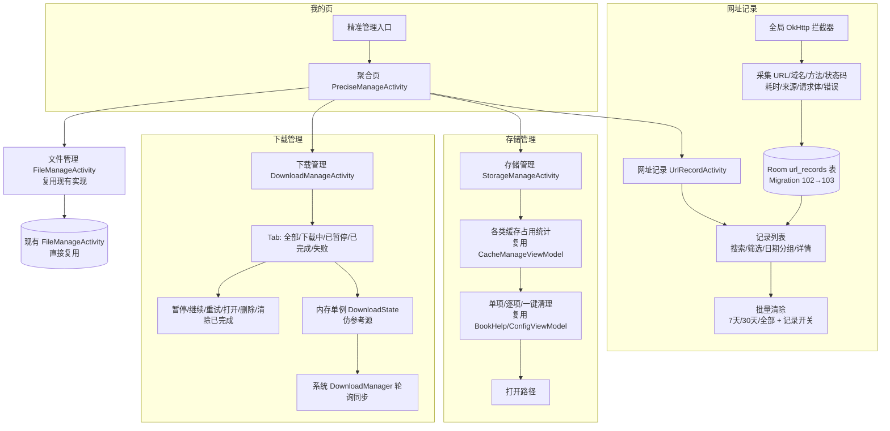

# 精准管理（Precise Manage）

> 状态：✅ 已实施（2026/08/08 真机验证完成，L2 6/6 通过 + 采集链路验证）
> Spec ID：precise-manage
> 负责模块：我的页入口 / 网络层（OkHttp）/ 存储 / 下载 / 文件管理

## 功能概述

「精准管理」借鉴自 Legado_Max fork 的 precise_manage 聚合菜单，在「我的」页新增统一入口，聚合网址记录、存储管理、下载管理、文件管理四大能力。本项目已评估该功能的价值并决定借鉴，但技术路线与参考源不同：**参考源基于 Compose 体系，本项目无 Compose 基础设施（主 UI 为 View/RecyclerView 体系，基于 BaseActivity/VMBaseActivity/RecyclerAdapter + viewBinding 委托），因此全部用 View 体系重写**，复用本项目现有的单例与 ViewModel 架构。

四大子功能定位如下：**网址记录（UrlRecord）** 为全新功能，通过全局 OkHttp 拦截器采集请求元数据（URL/域名/方法/状态码/耗时/来源名/请求体 ≤1000 字符/错误），落库到新表 `url_records`，提供搜索、筛选、按日期分组、详情对话框与批量清除；**存储管理（StorageManage）** 为聚合统计页，展示书籍内容/Epub/临时/TTS/ACache/数据库/日志/WebView 缓存各类占用，复用本项目 CacheManageViewModel.buildStorageBreakdown / directorySize / BookHelp.clearCache / ConfigViewModel.clearCache 等现成 API；**下载管理（DownloadManage）** 为任务列表页，以内存单例为数据源，配合系统 DownloadManager 轮询同步，支持暂停/继续/重试/打开文件/打开文件夹/复制路径/删除/清除已完成；**文件管理（FileManage）** 不新增界面，直接复用本项目已存在的 FileManageActivity。

本次实施涉及数据库变更：当前 DB version=102（28 个 @Entity），需新增 Migration 102→103 以创建 `url_records` 表。工程约束方面：日志统一使用 AppLog（禁用 Timber），AppLog 调用包 kotlin.runCatching 以防 JVM 单元测试崩溃；编译时 gradle 勿加 `--offline`、需加 `--no-parallel`。

## 核心能力

1. **统一聚合入口**：我的页新增「精准管理」入口，聚合网址记录 / 存储管理 / 下载管理 / 文件管理四项导航，全部以 View 体系实现（项目无 Compose 基础设施）
2. **网址记录采集**：全局 OkHttp 拦截器采集请求元数据（URL / 域名 / 方法 / 状态码 / 耗时 / 来源名 / 请求体 ≤1000 字符 / 错误），不落敏感内容
3. **网址记录检索**：列表页支持关键字搜索、按域名 / 来源 / 方法 / 状态多维度筛选、按日期分组展示
4. **网址记录详情与清理**：详情对话框查看单条完整信息；支持批量清除（7 天 / 30 天 / 全部）与记录采集总开关
5. **存储占用统计**：聚合展示书籍内容 / Epub / 临时 / TTS / ACache / 数据库 / 日志 / WebView 缓存占用，复用本项目 CacheManageViewModel.buildStorageBreakdown 与 directorySize
6. **存储清理**：单项清理、展开逐项清理、一键清理、打开路径，复用 BookHelp.clearCache / ConfigViewModel.clearCache 等现成 API
7. **下载任务管理**：Tab 分类（全部 / 下载中 / 已暂停 / 已完成 / 失败），支持暂停 / 继续 / 重试 / 打开文件 / 打开文件夹 / 复制路径 / 删除 / 清除已完成
8. **下载状态同步**：内存单例（仿参考源 DownloadState）为数据源，配合系统 DownloadManager 轮询同步（本项目 DownloadService 已用系统 DownloadManager）
9. **文件管理复用**：直接复用本项目已存在的 FileManageActivity，不新增实现
10. **数据库迁移**：新增 Migration 102→103，创建 `url_records` 表（28 个 @Entity 基础上新增 1 个）

## 文档索引

| 文档 | 说明 | 状态 |
|------|------|------|
| [README.md](./README.md) | 设计概览与文档索引（本文件） | ✅ 已实施 |
| [spec.md](./spec.md) | 需求规格说明（功能需求 / 非功能需求 / 验收标准） | ✅ 已实施 |
| [design.md](./design.md) | 技术设计方案（拦截器 / 数据模型 / 各页 UI / 迁移方案） | ✅ 已实施 |
| [tasks.md](./tasks.md) | 任务清单与执行计划 | ✅ 已实施 |

## 设计原则

1. **View 体系重写**：参考源为 Compose，本项目无 Compose 基础设施，统一采用 BaseActivity / VMBaseActivity / RecyclerAdapter / viewBinding 委托实现
2. **复用优先**：存储统计与清理复用 CacheManageViewModel / BookHelp / ConfigViewModel 现成 API；文件管理直接复用 FileManageActivity；下载同步复用系统 DownloadManager
3. **隐私收敛**：网址记录仅采集请求元数据与请求体前 ≤1000 字符，避免敏感内容落库
4. **可观测可清理**：记录可搜索、可筛选、可批量清除，并提供采集开关
5. **风险可控**：DB 迁移走标准 Room Migration（102→103），日志走 AppLog（kotlin.runCatching 包裹防 JVM 单测崩）

## 项目背景约束

- fork 自 legado-E，DB version=102（28 个 @Entity），`app/schemas/` 存 schema 快照
- 主 UI 为 View 体系，无 Compose 基础设施
- 日志使用 AppLog（禁用 Timber），AppLog 调用包 kotlin.runCatching 防 JVM 单测崩溃
- 编译命令勿用 `--offline`，需加 `--no-parallel`
- 核心业务用 `object` 单例，协程用 `Coroutine.async{}...onError{}` 链式封装，Room 实体为 `data class` + `@Parcelize` + `@Entity` 且字段全带默认值

## 后续规划

- spec.md：需求规格（四大子功能的功能需求 / 非功能需求 / 验收标准）
- design.md：技术设计（OkHttp 拦截器设计 / url_records 数据模型与 DAO / 各 Activity 页面设计 / Migration 102→103 / 下载状态机与轮询同步）
- tasks.md：任务拆解与执行计划（数据层 → 业务层 → UI → 测试）
