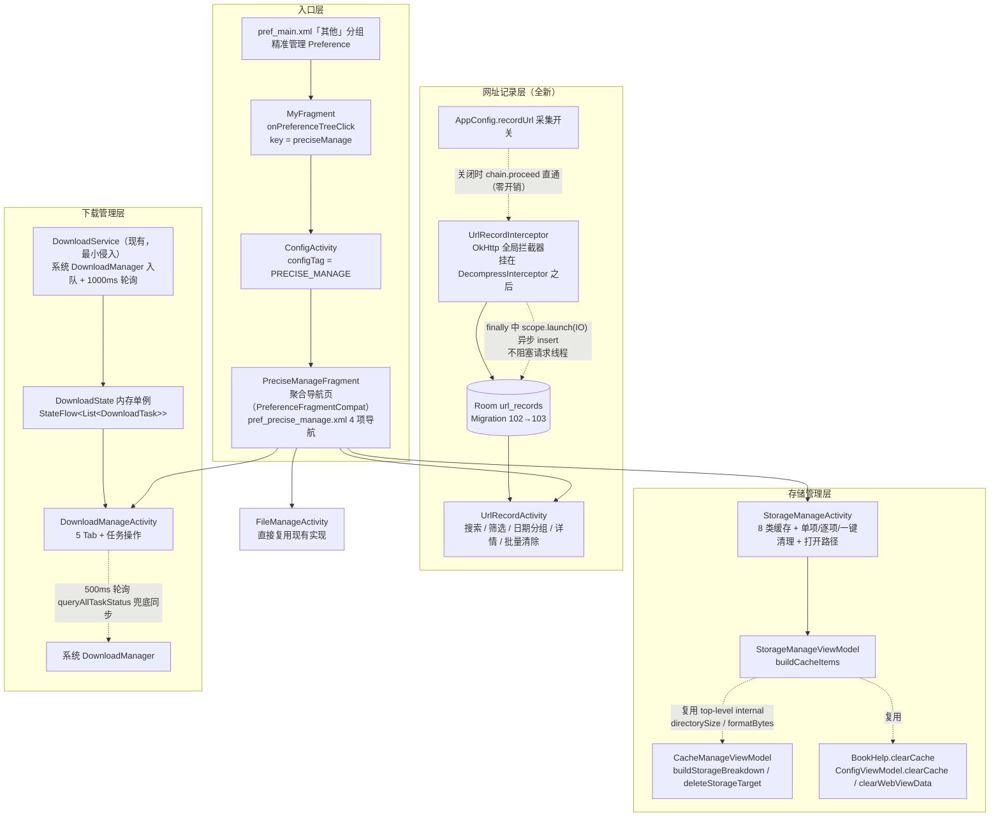
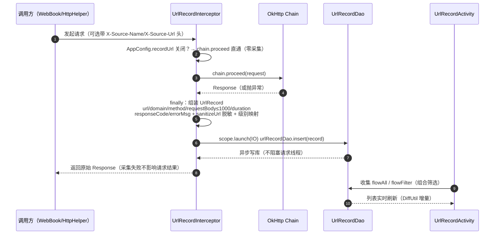
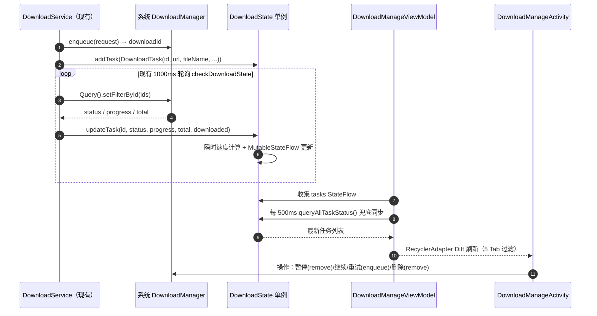
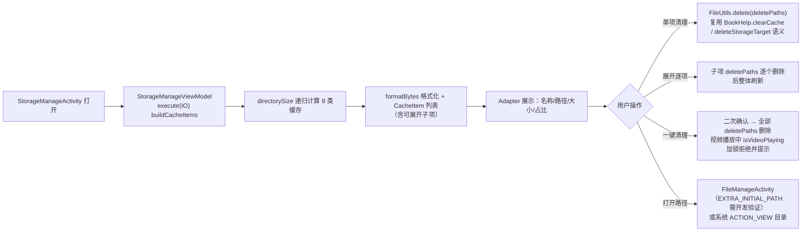

# 精准管理（Precise Manage）技术设计方案

> **Design ID**：precise-manage
> **生成时间**：2026-08-08
> **状态**：✅ 已实施（2026/08/08 真机验证完成，L2 6/6 通过 + 采集链路验证）
> **关联文档**：同目录 `README.md` / `spec.md` / `tasks.md`（本文档为四文档中的第三份，内容与三者保持一致）
> **参考实现**：Legado_Max fork 的 precise_manage（Compose 体系）——本项目**数据层对齐、UI 用 View 体系重写**
> **实现约束**：minSdk=23；日志统一 `AppLog.put()`（禁用 Timber，AppLog 调用包 `kotlin.runCatching`）；协程用 `Coroutine.async{}...onSuccess{}.onError{}` 链式；DB 变更遵循 `database-migration-safety.md`

---

## 1. Technical Approach（技术方案）

### 1.1 总体架构分层

本功能分四层落地：**入口层**（我的页 → 聚合页，复用 ConfigActivity + ConfigTag 分发模式）→ **网址记录层**（全局 OkHttp 拦截器 + Room 新表 `url_records`）→ **存储管理层**（复用现有 cache 统计 API 的 8 类缓存聚合页）→ **下载管理层**（现有 DownloadService 最小侵入 + 内存单例 `DownloadState` 同步层）。文件管理直接复用现有 `FileManageActivity`，不新增实现。



### 1.2 网址记录（UrlRecord）

**目标**：补全请求历史可视化能力，源开发者与高级用户可排查书源请求失败。全局 OkHttp 拦截器采集元数据落库，UI 提供搜索 / 多条件筛选 / 日期分组 / 详情对话框 / 批量清除（7 天 / 30 天 / 全部）。

**数据实体**（`app/src/main/java/io/legado/app/data/entities/UrlRecord.kt`）：

```kotlin
@Entity(
    tableName = "url_records",
    indices = [Index(value = ["timestamp"]), Index(value = ["domain"])]
)
@Parcelize
data class UrlRecord(
    @PrimaryKey(autoGenerate = true) val id: Long = 0,
    val url: String = "",
    val domain: String = "",
    val method: String = "",
    val sourceName: String? = null,
    val sourceUrl: String? = null,
    val timestamp: Long = System.currentTimeMillis(),
    val responseCode: Int = 0,
    val duration: Long = 0,
    val requestBody: String? = null,
    val errorMsg: String? = null
) : Parcelable
```

- 遵循项目 Room 实体惯例：`data class` + `@Parcelize` + `@Entity`，字段全部带默认值。
- `indices=[timestamp, domain]` 对齐参考源，为 `flowFilter` / `flowByDomain` 提供索引（注意：Room 索引不会自动创建，由 `migration_102_103` 中 `CREATE INDEX IF NOT EXISTS` 显式创建）。

**DAO**（`data/dao/UrlRecordDao.kt`），对齐参考源签名、改写为本项目风格，三组 API：

| 分组 | 方法 | 说明 |
|------|------|------|
| flow 系列 | `flowAll()` | `SELECT * FROM url_records ORDER BY timestamp DESC` |
| | `flowSearch(keyword)` | `url/domain/sourceName LIKE '%'||:keyword||'%'`，时间倒序 |
| | `flowByDomain(domain)` / `flowBySourceName(name)` / `flowByMethod(method)` | 单条件过滤，时间倒序 |
| | `flowByStatus(success)` | `success=true` 时 `responseCode BETWEEN 200 AND 299`；`false` 时反选（需开发验证是否拆两个 @Query） |
| | `flowAllDomains()` / `flowAllSourceNames()` / `flowAllMethods()` | `SELECT DISTINCT ...`，供筛选下拉 |
| | `flowFilter(domain, sourceName, method, success, keyword)` | 五条件动态拼接（空串/空值不过滤），`ORDER BY timestamp DESC` |
| 一次性 | `getAll()` / `getByDomain()` / `getBySourceName()` / `search()` / `getCount()` / `getOldRecordsCount(timestamp)` / `getCountSince(timestamp)` | 供统计与清除前计数 |
| 写删 | `insert(vararg records)` | `@Insert(onConflict = REPLACE)` |
| | `delete(id)` / `deleteAll(): Int` / `deleteOldRecords(timestamp): Int` | 批量清除三档（7 天 / 30 天 / 全部） |

**拦截器**（`help/http/UrlRecordInterceptor.kt`）：

```kotlin
object UrlRecordInterceptor : Interceptor {
    private val scope = CoroutineScope(SupervisorJob() + Dispatchers.IO)

    override fun intercept(chain: Interceptor.Chain): Response {
        val request = chain.request()
        if (!AppConfig.recordUrl) return chain.proceed(request)   // 开关关闭零开销
        val startTime = System.currentTimeMillis()
        try {
            return chain.proceed(request)
        } finally {
            // 采集：url/domain/method/requestBody(≤1000 字符)/responseCode/duration/errorMsg
            // sourceName = request.header("X-Source-Name")
            // sourceUrl  = request.header("X-Source-Url")
            // sanitizeUrl 脱敏 + 错误级别映射（errorMsg→ERROR / 4xx→WARN / 5xx→ERROR / else INFO）
            scope.launch { appDb.urlRecordDao.insert(record) }    // 异步写库不阻塞请求
        }
    }

    fun cancelAll() { scope.coroutineContext[Job]?.cancel() }
}
```

关键设计点：

- **零开销开关**：`AppConfig.recordUrl` 用 getter 实时读取（仿 `enableReadRecord`，AppConfig.kt:705），拦截器在 `proceed` 前判断，关闭时无任何采集/写库行为。
- **异常采集**：`chain.proceed` 抛异常时 `try/finally` 保证 finally 执行，`errorMsg` 记录异常信息；响应正常时记录 `responseCode` / `duration = now - startTime`。
- **请求体截断**：仅 POST 且 body 非空时采集，截断前 1000 字符。⚠️ **需开发验证**：OkHttp `RequestBody` 为一次性流，直接 `writeToBuffer` 会消费 body 影响后续发送，需用 `request.newBuilder()` 重建或经 `Buffer` 快照方式采集，确保不破坏原始请求。
- **脱敏 `sanitizeUrl`**：对 URL query 参数中 `token/key/password/passwd/secret/sign/code` 等键值打码为 `***`（签名类 URL 常见 `sign` 参数，防止敏感签名落库）。
- **来源名透传**：`sourceName = request.header("X-Source-Name")`、`sourceUrl = request.header("X-Source-Url")`。本项目请求方当前不设该头，v1 恒为空（Drawback #2，v2 增强）。
- **错误级别映射**：`errorMsg != null → ERROR`；`400 ≤ responseCode < 500 → WARN`；`responseCode ≥ 500 → ERROR`；其余 `INFO`。级别字段仅用于列表图标/筛选辅助，不落库（落库字段为 `errorMsg`/`responseCode`）。

**挂载点**（`help/http/HttpHelper.kt`）：L190 `builder.addInterceptor(DecompressInterceptor)` 之后、L195 `StreamResetRetryInterceptor` 之前追加一行 `builder.addInterceptor(UrlRecordInterceptor)`。保证解压后链上能拿到真实响应，且仅全局挂载一次。

**DB 迁移**（`data/DatabaseMigrations.kt`）：

```kotlin
private val migration_102_103 = object : Migration(102, 103) {
    override fun migrate(db: SupportSQLiteDatabase) {
        kotlin.runCatching {
            db.execSQL(
                """CREATE TABLE IF NOT EXISTS url_records(
                    id INTEGER PRIMARY KEY AUTOINCREMENT NOT NULL,
                    url TEXT NOT NULL,
                    domain TEXT NOT NULL,
                    method TEXT NOT NULL,
                    sourceName TEXT,
                    sourceUrl TEXT,
                    timestamp INTEGER NOT NULL,
                    responseCode INTEGER NOT NULL,
                    duration INTEGER NOT NULL,
                    requestBody TEXT,
                    errorMsg TEXT
                )"""
            )
            db.execSQL("CREATE INDEX IF NOT EXISTS index_url_records_timestamp ON url_records(timestamp)")
            db.execSQL("CREATE INDEX IF NOT EXISTS index_url_records_domain ON url_records(domain)")
            AppLog.put("AppDatabase Migration 102→103: url_records 表创建成功")
        }.onFailure { e ->
            AppLog.put("AppDatabase Migration 102→103: url_records 表创建失败: ${e.message}")
        }
    }
}
```

- 模板完全仿 `migration_101_102`（DatabaseMigrations.kt:763）：`kotlin.runCatching { CREATE TABLE IF NOT EXISTS + CREATE INDEX IF NOT EXISTS + AppLog.put }.onFailure { AppLog.put }`。
- migrations 数组（L14-28）在 `migration_101_102`（L27）之后追加 `migration_102_103`。
- `AppDatabase.kt`：`version = 102`→`103`；`entities` 数组（L83-89）追加 `UrlRecord::class`；新增 `abstract val urlRecordDao: UrlRecordDao`。
- 编译后 `app/schemas/io.legado.app.data.AppDatabase/103.json` 自动生成（`exportSchema=true`），与手写 SQL 做 schema 一致性校验。

**采集开关**：

```kotlin
// constant/PreferKey.kt
const val recordUrl = "recordUrl"

// help/config/AppConfig.kt（仿 enableReadRecord，AppConfig.kt:705-708）
var recordUrl: Boolean
    get() = appCtx.getPrefBoolean(PreferKey.recordUrl, true)
    set(value) { appCtx.putPrefBoolean(PreferKey.recordUrl, value) }
```

**UI**（`ui/urlRecord/`）：`UrlRecordActivity`（`BaseActivity<ActivityUrlRecordBinding>`）+ `UrlRecordViewModel`（`BaseViewModel`）+ `UrlRecordAdapter`（`RecyclerAdapter<UrlRecord, ItemUrlRecordBinding>`，点击弹详情对话框）。布局三件：`activity_url_record.xml` / `item_url_record.xml` / `dialog_url_record_detail.xml`。

- 列表由 Room `flow*` 驱动 DiffUtil 增量刷新；搜索关键字 + 域名/来源/方法/状态四维筛选走 `flowFilter` 单次查询，避免多次 Diff 通知。
- 列表按 `timestamp` 日期分组展示（同一天归一组，分组标题显示日期）。
- 菜单项：清除 7 天 / 清除 30 天 / 清除全部（均有二次确认对话框）+ 采集开关。
- 空列表显示空态提示。

### 1.3 存储管理（StorageManage）

**目标**：把散落/缺失的缓存管理聚合为 8 类统一展示与清理页，全部复用现成统计与清理 API。

**数据模型**（`ui/book/storage/StorageManageViewModel.kt` 内定义）：

```kotlin
data class CacheItem(
    val name: String,          // 分类名（如 书籍缓存 / Epub）
    val description: String,   // 路径描述
    val bytes: Long,           // 大小（字节）
    val formatted: String,     // 格式化大小（formatBytes）
    val deletePaths: List<String>,  // 清理目标路径列表
    val canExpand: Boolean,    // 是否可展开
    val details: List<CacheItem>     // 展开子项
)
```

**8 类缓存映射**（对齐参考源）：

| 分类 | 路径 | 可展开 |
|------|------|--------|
| BOOK_CACHE 书籍缓存 | `BookHelp.cachePath`（externalFiles/book_cache） | 是（按书分子目录） |
| EPUB_CACHE | externalFiles/epub | 否 |
| TEMP_CACHE 临时 | `appCtx.externalCache` | 否 |
| TTS_CACHE 音频 | cacheDir/httpTTS | 是（按引擎子目录） |
| ACACHE_DISK | cacheDir/ACache | 是（按前缀） |
| DB_CACHE 数据库 | `appCtx.getDatabasePath("legado.db")` | 是（按前缀，db+db-wal+db-shm） |
| LOG_CACHE 日志 | externalCache/log | 否 |
| WEBVIEW_CACHE | `getDir("webview")` + `getDir("hws_webview")` | 是（按目录） |

**复用原则**（已核实）：

- `CacheManageViewModel`（`ui/book/cache/CacheManageViewModel.kt`）的 `directorySize(file)`（:100）与 `formatBytes(bytes)`（:108）是 **top-level `internal` 函数**，同一 module 内不同 package 可见，`StorageManageViewModel` 可直接调用，无需提 public。
- 单项清理复用 `CacheManageViewModel.deleteStorageTarget`（:62，含视频播放中 `isVideoPlaying` 加锁拒绝）语义；8 类清理目标由 `CacheItem.deletePaths` 驱动 `FileUtils.delete(path, deleteRootDir = true)`。
- 书籍/Epub 等分类清理复用 `BookHelp.clearCache()` / `clearCache(book)`；WebView 复用 `ConfigViewModel.clearCache()` / `clearWebViewData()`。
- **需开发验证**：`FileUtils.delete` 对 `getDatabasePath(legado.db)` 这类「文件路径」与「目录路径」的兼容性；`DB_CACHE` 需确认删除顺序（先 db-shm/wal 后主库）与 `shrinkDatabase` 的关系。

**UI**（`ui/book/storage/`）：`StorageManageActivity`（`VMBaseActivity<ActivityStorageManageBinding, StorageManageViewModel>`）+ `StorageManageAdapter`（`RecyclerAdapter<CacheItem, ItemCacheItemBinding>`，可展开项复用 `RecyclerAdapter` 的 header/expand 机制或独立子列表，需开发验证）。布局：`activity_storage_manage.xml` + `item_cache_item.xml`。顶部展示总占用，每项显示分类名 / 路径 / 大小 / 占用占比。

操作：**单项清理**（不可展开分类直接清）/ **展开逐项清理**（子项单独清）/ **一键清理**（确认对话框后逐个删除，视频播放中加锁拒绝并提示）/ **打开路径**。打开路径：⚠️ **需开发验证** `FileManageActivity` 是否支持 `EXTRA_INITIAL_PATH` 透传（当前源码未见该参数）；不支持则用系统 `ACTION_VIEW` 打开目录（部分机型无目录查看器，需兜底提示），v1 以直接进入 `FileManageActivity` 为主。

### 1.4 下载管理（DownloadManage）

**目标**：现有 `DownloadService` 基于系统 `DownloadManager` 下载，任务存内存但无列表界面。新增列表页补全「查看进度 / 暂停 / 继续 / 重试 / 定位文件 / 删除」闭环，采用**最小侵入改造现有 DownloadService** + 新增内存单例同步层，不动下载核心流程。

**DownloadState 内存单例**（`service/DownloadState.kt`）：

```kotlin
enum class DownloadStatus { PENDING, RUNNING, PAUSED, SUCCESSFUL, FAILED }

data class DownloadTask(
    val id: Long,                    // 系统 DownloadManager downloadId
    val url: String,
    val fileName: String,
    val notificationId: Int,
    val startTime: Long = System.currentTimeMillis(),
    val status: DownloadStatus = DownloadStatus.PENDING,
    val progress: Int = 0,
    val totalSize: Int = 0,
    val downloadedSize: Int = 0,
    val speed: Long = 0,             // 字节/秒（瞬时速度）
    val sourceUrl: String = "",
    val downloadUrl: String = ""
)

object DownloadState {
    private val _tasks = MutableStateFlow<List<DownloadTask>>(emptyList())
    val tasks: StateFlow<List<DownloadTask>> = _tasks.asStateFlow()

    fun addTask(task: DownloadTask)
    fun updateTask(id: Long, status: DownloadStatus?, progress: Int?, total: Int?, downloaded: Int?, speed: Long?)
    fun removeTask(id: Long)
    fun getTask(id: Long): DownloadTask?
    fun getAllTasks(): List<DownloadTask>
    fun clear()
    fun cancelDownload(context: Context, id: Long)     // downloadManager.remove(id) + removeTask(id)
    fun retryDownload(context: Context, id: Long)      // removeTask + Download.start() 重新入队
    fun queryAllTaskStatus()                           // 查询系统 DownloadManager 全部任务同步到 StateFlow
}
```

- `updateTask` 内含**瞬时速度计算**：内部按 taskId 保存 `lastBytes / lastTime`，`speed = (nowBytes - lastBytes) / (nowMs - lastMs)`。
- **⚠️ 需开发验证**：系统 `DownloadManager` **无公开暂停/继续 API**。v1「暂停」设计为「`DownloadManager.remove(id)` + 内存标记 `PAUSED`（保留元数据）」；「继续 / 重试」为「removeTask 后用原 url/fileName 重新 `enqueue`，新 downloadId 回写 task.id」。此语义需在 UI 文案与 README 中向用户说明（暂停非系统级断点续传）。
- 进程重启后单例重建为空，任务列表不显示（Drawback #1，系统侧任务仍在）。

**DownloadService 改造（最小侵入）**（`service/DownloadService.kt`）：

| 现有逻辑 | 位置 | 改造点 |
|---------|------|--------|
| `downloads = hashMapOf<Long, DownloadInfo>()` / `completeDownloads = hashSetOf<Long>()` | :37/:38 | **保留不动**，仅作桥接 |
| `onCreate` 注册 `ACTION_DOWNLOAD_COMPLETE` 广播 | :40-55 | 保留 |
| `startDownload` enqueue 后写 `downloads[downloadId]` | :110 | 追加 `DownloadState.addTask(DownloadTask(...))` |
| `checkDownloadState` 1000ms 轮询 / `queryState` 查询游标 | :152/:166 | 在 `queryState` 解析到 `status/progress/max` 处追加 `DownloadState.updateTask(...)` |
| `removeDownload` 系统 remove | :131 | 追加 `DownloadState.removeTask / cancelDownload` |
| 前台通知 / `upDownloadNotification` | :226/:240 | 保留，不动 |

原则：**只加数据源桥接，不改下载核心流程**（入队、通知、广播、轮询节奏均保持）。

**UI**（`ui/download/`）：`DownloadManageActivity`（`BaseActivity<ActivityDownloadManageBinding>`）+ `DownloadManageViewModel`（`BaseViewModel`）+ `DownloadManageAdapter`（`RecyclerAdapter<DownloadTask, ItemDownloadTaskBinding>`，按 id Diff）。布局：`activity_download_manage.xml`（顶部 TabLayout/RadioGroup 5 分类：全部 / 下载中 / 已暂停 / 已完成 / 失败）+ `item_download_task.xml`（文件名 / 状态 / 进度条 / 大小 / 速度 / 操作按钮区）。

- `DownloadManageViewModel`：`execute` 内 500ms `delay` 循环调 `DownloadState.queryAllTaskStatus()` 兜底同步，同时收集 `DownloadState.tasks` StateFlow 驱动刷新。
- 操作：运行中/等待 → **暂停**；已暂停 → **继续**；失败 → **重试**；已完成 → **打开文件**（`downloadManager.getUriForDownloadedFile(id)` → `ACTION_VIEW` + `openFileUri`）/ **打开文件夹**（`Environment.DIRECTORY_DOWNLOADS`）/ **复制路径**（`ClipboardManager`）/ **删除**；顶部 **清除已完成**。

### 1.5 聚合入口

| 环节 | 改动 |
|------|------|
| `pref_main.xml`「其他」分组（L100-141） | 新增 `preciseManage` Preference（`app:iconSpaceReserved="false"`，icon 可选 `ic_history`/`ic_download` 等现成 drawable，**需确认是否有专用 icon，无则复用现成**） |
| `MyFragment.onPreferenceTreeClick`（:156） | 新增 `"preciseManage" -> startActivity<ConfigActivity> { putExtra("configTag", ConfigTag.PRECISE_MANAGE) }` |
| `ConfigTag.kt`（:3） | 追加 `const val PRECISE_MANAGE = "preciseManage"` |
| `ConfigActivity.onActivityCreated`（:19） | `when(configTag)` 追加 `ConfigTag.PRECISE_MANAGE -> replaceFragment<PreciseManageFragment>(configTag)` |
| `ui/config/PreciseManageFragment.kt` | `PreferenceFragmentCompat`，`addPreferencesFromResource(R.xml.pref_precise_manage)`，`onPreferenceTreeClick` 按 key 跳 4 个目标 Activity（FileManageActivity 复用现有） |
| `res/xml/pref_precise_manage.xml` | 4 个导航 Preference：urlRecord / storageManage / downloadManage / fileManage，`app:iconSpaceReserved="false"` |
| `AndroidManifest.xml` | 注册 `UrlRecordActivity` / `StorageManageActivity` / `DownloadManageActivity`（`configChanges="orientation|screenSize"` + `hardwareAccelerated="true"`，仿 FileManageActivity 注册块 L381-383） |
| `strings.xml` / `values-zh/strings.xml` | `precise_manage` / `url_record` / `storage_manage` / `download_manage` 系列文案（中文为主） |

> **命名对齐说明**：tasks.md / spec.md 使用 `PreciseManageFragment` + `pref_precise_manage.xml`，本文档保持一致；若评审偏好 `ManageFragment` + `pref_manage.xml`，仅重命名不影响结构（见 AD-06）。

---

## 2. Architecture Decisions（ADR）

> 模板：Y-Statement 结构化陈述（Context / Concern / Decision / Goal / Tradeoff / Status / Superseded-by）。

### AD-01 网址记录/聚合 UI 采用 View 体系重写，不引入 Compose

- **Context**：参考源 Legado_Max 的 precise_manage 全为 Compose 实现。本项目 fork 无任何 Compose 基础设施（无 compose 构建插件/依赖、无 material3、无 Compose 页面先例），主 UI 全为 View 体系（`BaseActivity` / `VMBaseActivity` / `BaseViewModel` / `RecyclerAdapter` + viewBinding 委托）。
- **Concern**：照搬 Compose 需引入构建配置、主题与列表体系改造，形成双 UI 体系并存，回归面与维护成本远超收益；不做则只能放弃该功能。
- **Decision**：**全部用本项目 View 体系重写**（数据模型 / Dao / 拦截器 / 下载状态机对齐参考源，UI 层自研）。
- **Goal**：以最小基础设施代价获得与参考源等价的功能价值；数据层可移植、后续可升级。
- **Tradeoff**：UI 无法 1:1 复用参考源 Compose 布局，需重写布局与列表交互；个别交互细节可能与参考源存在差异。
- **Status**：Accepted。

### AD-02 URL 采集采用 OkHttp 全局拦截器，不做 WebView 层埋点

- **Context**：项目所有 HTTP 客户端请求经 `HttpHelper` 统一构建的 OkHttpClient（拦截器链已含 `DecompressInterceptor`）；另有 12 处 `WebViewClient` 处理 WebView 请求。
- **Concern**：WebView 埋点需改 12 处 WebViewClient，覆盖仍不全（OkHttp 直连请求不经过 WebView）；参考源同样只用 OkHttp 拦截器。
- **Decision**：新增 `UrlRecordInterceptor` 挂载到全局 OkHttpClient（`DecompressInterceptor` 之后，HttpHelper.kt:190）；WebView 请求明确 Out of Scope。
- **Goal**：一处挂载全局覆盖 HTTP 客户端全部请求；采集完整性与改造成本最优。
- **Tradeoff**：WebView 内加载的请求不落记录（Drawback #3）；若后续需要需另议。
- **Status**：Accepted。

### AD-03 `url_records` 新表采用手写 Migration 102→103，不用 AutoMigration

- **Context**：项目 88→89 之后全部为手写 Migration（`DatabaseMigrations.kt`），`autoMigrations` 仅覆盖 43→59 早期版本；新增表属易验证的 DDL 变更。
- **Concern**：AutoMigration 对「新表 + 双索引」的行为依赖 Room 版本演算，与本项目既有迁移惯例不一致；本项目的 schema 校验依赖 `app/schemas/` 快照 + 覆盖安装回归。
- **Decision**：新增手写 `migration_102_103`，完全仿 `migration_101_102` 模板（`kotlin.runCatching` + `CREATE TABLE IF NOT EXISTS` + `CREATE INDEX IF NOT EXISTS` + `AppLog.put`）。
- **Goal**：与既有迁移惯例一致；迁移失败仅降级网址记录功能、App 不崩溃。
- **Tradeoff**：手写 SQL 需与 Room 生成的 v103 schema 逐列一致（`exportSchema` 编译校验 + 覆盖安装回归兜底）。
- **Status**：Accepted。

### AD-04 下载任务数据源采用 `DownloadState` 内存单例 + 系统 DownloadManager 轮询，不做 Room 持久化

- **Context**：现有 `DownloadService` 任务存内存 `downloads` / `completeDownloads`，不落库；系统 `DownloadManager` 自身已持久化下载任务。参考源用内存单例 `DownloadState`。
- **Concern**：Room 持久化任务需新增实体 / Dao / 迁移，且要与系统 DownloadManager 状态双写一致性处理，复杂度高；重启后任务列表丢失在参考源中即已知取舍。
- **Decision**：新增 `DownloadState` 内存单例（`StateFlow<List<DownloadTask>>`）+ 500ms 轮询系统 `DownloadManager` 同步状态；不做 Room 持久化。
- **Goal**：复杂度最低；与参考源行为一致；下载本体走系统 DownloadManager 不受影响。
- **Tradeoff**：进程重启后任务列表不显示（Drawback #1，系统侧任务仍在，属展示层局限）。
- **Status**：Accepted。

### AD-05 存储管理复用现有 cache 统计 API，不全量移植参考源 StorageCalculator

- **Context**：本项目 `CacheManageViewModel.buildStorageBreakdown()`（`ui/book/cache/CacheManageViewModel.kt:29`）+ top-level `internal directorySize`（:100）/ `formatBytes`（:108）已提供目录级统计；参考源 StorageManage 约 700 行全量计算。
- **Concern**：全量移植 700 行造成重复统计逻辑、与现有 CacheActivity 口径分叉；直接复用则需把现有 3 类扩展为 8 类。
- **Decision**：**v1 复用 `directorySize` / `formatBytes` / `BookHelp.clearCache` / `ConfigViewModel.clearCache` / `clearWebViewData`**，`StorageManageViewModel` 内部以私有 `CacheItem` 组装 8 类（含展开子项枚举），不破坏 CacheActivity 现有调用方。
- **Goal**：避免 700 行移植；统计口径与现有 CacheActivity 一致（同一 `directorySize` 递归）；回归面小。
- **Tradeoff**：8 类中可展开粒度的子目录枚举（按书 / 按引擎 / 按前缀）需新增增量逻辑，属开发成本；若后续口径差异大，再评估独立计算器。
- **Status**：Accepted。

### AD-06 聚合入口复用 ConfigActivity + ConfigTag 分发模式，不新增独立 Activity 顶部 Tab

- **Context**：项目已有 `ConfigActivity` + `ConfigTag`（`when(configTag)` 5 分支）+ 各配置 Fragment（`OtherConfigFragment` 等，PreferenceFragmentCompat 风格）；「我的页」多处已走该分发模式。
- **Concern**：独立 Activity 需新增壳 + 主题/标题栏处理，破坏既有「我的页 → 配置页 → Fragment」导航惯例。
- **Decision**：复用 `ConfigActivity` 分发：`ConfigTag` 新增 `PRECISE_MANAGE`，`ConfigActivity` when 分支 → `replaceFragment<PreciseManageFragment>`（加载 `pref_precise_manage.xml` 4 导航项），`MyFragment.onPreferenceTreeClick` 新增 `preciseManage` 分支。
- **Goal**：与既有导航模式一致；聚合页仅一个 Fragment + pref 文件，实现量最小。
- **Tradeoff**：聚合页标题/返回由 ConfigActivity 统一接管，无法定制专属 UI（v1 用 Preference 列表足够）。
- **Status**：Accepted。

### AD-07 网址记录采集开关默认值建议为 true

- **Context**：spec FR-16 已定义默认 true；拦截器关闭时直接 `proceed()` 零开销；开启时每条请求异步 insert 元数据。
- **Concern**：默认 true 对排查请求友好但表数据持续增长；默认 false 则功能不可感知、用户不会主动开启。
- **Decision**：**建议默认 true**，并配套「7 天 / 30 天批量清除」入口；可后续增加「自动清理 >N 天记录」开关（v2）。
- **Goal**：开箱即用可观测（源开发者/高级用户直接可用）；存储增长可控（清除入口 + 可选自动清理）。
- **Tradeoff**：长期不清理会增长表数据（`url_records` 仅文本元数据且记录量级小，实际存储压力低）；若担忧存储，可将默认改 false（改动一处默认值，成本极低）。
- **Status**：Proposed（建议默认 true，评审确认后转 Accepted）。

---

## 3. Data Flow（数据流）

### 3.1 网址记录：请求 → 拦截器 → Dao insert → UI 刷新



### 3.2 下载管理：入队 → DownloadService → 系统 DownloadManager → 轮询 → DownloadState → UI



### 3.3 存储管理：统计 → 展示 → 清理



---

## 4. File Changes（文件变更清单）

### 4.1 新增文件

| # | 文件 | 包/位置 | 说明 |
|---|------|---------|------|
| 1 | `data/entities/UrlRecord.kt` | `io.legado.app.data.entities` | `@Entity(tableName="url_records", indices=[timestamp,domain])` + `@Parcelize`，11 字段全默认值 |
| 2 | `data/dao/UrlRecordDao.kt` | `io.legado.app.data.dao` | flow 系列（flowAll/flowSearch/flowBy*/flowFilter/flowAllDomains…）+ 一次性（get*/search/count）+ 写删（insert vararg onConflict=REPLACE/delete/deleteAll/deleteOldRecords） |
| 3 | `help/http/UrlRecordInterceptor.kt` | `io.legado.app.help.http` | `object : Interceptor`，开关直通 + 采集 + sanitizeUrl 脱敏 + 级别映射 + `scope.launch` 异步 insert + `cancelAll()` |
| 4 | `ui/urlRecord/UrlRecordActivity.kt` | `io.legado.app.ui.urlRecord` | `BaseActivity<ActivityUrlRecordBinding>`，搜索/筛选/日期分组/详情/清除菜单/采集开关 |
| 5 | `ui/urlRecord/UrlRecordViewModel.kt` | 同上 | `BaseViewModel`，`flowFilter` 组合筛选、清除 7 天/30 天/全部、开关读写 |
| 6 | `ui/urlRecord/UrlRecordAdapter.kt` | 同上 | `RecyclerAdapter<UrlRecord, ItemUrlRecordBinding>`，点击弹详情对话框 |
| 7 | `res/layout/activity_url_record.xml` | `res/layout` | 网址记录列表页布局 |
| 8 | `res/layout/item_url_record.xml` | `res/layout` | 列表项（域名/方法/状态/耗时/时间） |
| 9 | `res/layout/dialog_url_record_detail.xml` | `res/layout` | 详情对话框（完整 URL/方法/状态码/耗时/请求体/错误信息） |
| 10 | `service/DownloadState.kt` | `io.legado.app.service` | `DownloadTask` + `DownloadStatus`（PENDING/RUNNING/PAUSED/SUCCESSFUL/FAILED）+ `object DownloadState`（StateFlow + add/update/remove/clear/cancel/retry/queryAllTaskStatus） |
| 11 | `ui/download/DownloadManageActivity.kt` | `io.legado.app.ui.download` | `BaseActivity<ActivityDownloadManageBinding>`，5 Tab + 任务操作 |
| 12 | `ui/download/DownloadManageViewModel.kt` | 同上 | `BaseViewModel`，500ms 轮询 `queryAllTaskStatus()` + 收集 `tasks` flow |
| 13 | `ui/download/DownloadManageAdapter.kt` | 同上 | `RecyclerAdapter<DownloadTask, ItemDownloadTaskBinding>`，按 id Diff，操作回调 |
| 14 | `res/layout/activity_download_manage.xml` | `res/layout` | 5 分类 Tab + RecyclerView |
| 15 | `res/layout/item_download_task.xml` | `res/layout` | 文件名/状态/进度条/大小/速度/操作按钮区 |
| 16 | `ui/book/storage/StorageManageActivity.kt` | `io.legado.app.ui.book.storage` | `VMBaseActivity<ActivityStorageManageBinding, StorageManageViewModel>`，单项/一键清理 + 打开路径 |
| 17 | `ui/book/storage/StorageManageViewModel.kt` | 同上 | `BaseViewModel`，`buildCacheItems` 组装 8 类 + `clearCacheItems` |
| 18 | `ui/book/storage/StorageManageAdapter.kt` | 同上 | `RecyclerAdapter<CacheItem, ItemCacheItemBinding>`，可展开项 |
| 19 | `res/layout/activity_storage_manage.xml` | `res/layout` | 存储管理列表页布局 |
| 20 | `res/layout/item_cache_item.xml` | `res/layout` | 分类项（名称/路径/大小/占比/展开箭头/操作） |
| 21 | `ui/config/PreciseManageFragment.kt` | `io.legado.app.ui.config` | `PreferenceFragmentCompat`，加载 `pref_precise_manage.xml`，`onPreferenceTreeClick` 跳 4 目标 |
| 22 | `res/xml/pref_precise_manage.xml` | `res/xml` | 4 个导航 Preference（urlRecord/storageManage/downloadManage/fileManage，`app:iconSpaceReserved="false"`） |
| 23 | `UrlRecordInterceptorTest.kt` | `app/src/test/java/io/legado/app/...` | 单测：开关直通 / 字段采集 / 脱敏 / body 截断 / 状态码分级 |
| 24 | `DownloadStateTest.kt` | `app/src/test/java/io/legado/app/...` | 单测：add/update（瞬时速度）/remove/clear/cancelDownload/retry |

### 4.2 修改文件

| # | 文件 | 改动内容 |
|---|------|---------|
| 1 | `data/AppDatabase.kt` | `version=102→103`；entities 数组追加 `UrlRecord::class`；新增 `abstract val urlRecordDao: UrlRecordDao`；import 补齐 |
| 2 | `data/DatabaseMigrations.kt` | migrations 数组（L27 `migration_101_102` 之后）追加 `migration_102_103`；新增 `private val migration_102_103`（仿 L763 模板，SQL 含 url_records 建表 + timestamp/domain 双索引 + AppLog） |
| 3 | `help/config/AppConfig.kt` | 新增 `var recordUrl` getter/setter（仿 L705 `enableReadRecord` 模式，默认 true） |
| 4 | `constant/PreferKey.kt` | 追加 `const val recordUrl = "recordUrl"` |
| 5 | `help/http/HttpHelper.kt` | L190 `builder.addInterceptor(DecompressInterceptor)` 之后追加 `builder.addInterceptor(UrlRecordInterceptor)` |
| 6 | `service/DownloadService.kt` | `startDownload` 后 `DownloadState.addTask`；`queryState` 内 `DownloadState.updateTask`；`removeDownload` 内 `DownloadState.removeTask/cancelDownload`；保留 downloads/completeDownloads/前台通知/广播 |
| 7 | `ui/config/ConfigTag.kt` | 追加 `const val PRECISE_MANAGE = "preciseManage"` |
| 8 | `ui/config/ConfigActivity.kt` | `when(configTag)` 追加 `PRECISE_MANAGE -> replaceFragment<PreciseManageFragment>(configTag)` |
| 9 | `ui/main/my/MyFragment.kt` | `onPreferenceTreeClick` 追加 `"preciseManage" -> startActivity<ConfigActivity> { putExtra("configTag", ConfigTag.PRECISE_MANAGE) }` |
| 10 | `res/xml/pref_main.xml` | 「其他」PreferenceCategory（L100-141）新增 `preciseManage` Preference（`app:iconSpaceReserved="false"`） |
| 11 | `AndroidManifest.xml` | 注册 `UrlRecordActivity` / `StorageManageActivity` / `DownloadManageActivity`（`configChanges="orientation|screenSize"` + `hardwareAccelerated="true"`，仿 L381-383） |
| 12 | `res/values/strings.xml` | 新增 `precise_manage` / `url_record` / `storage_manage` / `download_manage` 系列文案 |
| 13 | `res/values-zh/strings.xml` | 中文文案（页面标题/操作动作/确认清理文案/空态提示） |
| 14 | `app/schemas/io.legado.app.data.AppDatabase/103.json` | 编译后自动生成（`exportSchema=true`），与手写迁移做一致性校验 |
| 15 | `app/src/main/assets/updateLog.md` | 交付编译前按 `version-delivery-sync.md` 基于 `git diff` 追加面向用户条目（追加在 `cronet版本:` 之后、已有条目之前） |

---

## 5. Test Strategy（测试策略）

### 5.1 单元测试

| 测试类 | 用例 | 验证点 |
|--------|------|--------|
| `UrlRecordInterceptorTest`（JVM + MockWebServer） | 开关关闭直通 | 关闭 `AppConfig.recordUrl` 后发起请求，无 insert 行为 |
| | 字段采集正确 | url/domain/method/responseCode/duration 与请求一致 |
| | 脱敏生效 | query 含 `token/sign/key/password` 时对应值被 `***` 覆盖 |
| | POST body 截断 | body 超 1000 字符时 requestBody 为前 1000 字符，不崩溃 |
| | 状态码分级 | 4xx→WARN / 5xx→ERROR / 2xx→INFO / 网络异常→ERROR（errorMsg 记录） |
| | 异步不阻塞 | insert 抛异常不影响原始 response（try/finally + onError 兜底） |
| `DownloadStateTest`（JVM） | addTask/updateTask | 任务入列、状态/进度更新正确 |
| | 瞬时速度 | 两次 updateTask（delta bytes/delta time）速度计算正确 |
| | removeTask/clear | 移除与清空后 StateFlow 空 |
| | cancelDownload/retry | 系统 remove 调用 + 内存同步（Mock DownloadManager，需开发验证可测试性） |

### 5.2 编译与 Lint

- `./gradlew compileAppDebugKotlin`（勿 `--offline`），确认 `app/schemas/.../103.json` 生成。
- 全量单测 `./gradlew test --no-parallel`（需 `--no-parallel`；基线 175/5 不回归，新增两组单测计入）。
- `./gradlew lint` 无新增阻塞项。

### 5.3 覆盖安装验证（Migration）

- 安装 version=102 旧包 → 覆盖安装新包 → 验证 102→103 迁移成功、旧数据完好、`url_records` 可读写。
- 迁移失败路径：`kotlin.runCatching` 捕获 + `AppLog.put`，App 不崩溃，网址记录功能降级不影响主流程（SC-10）。
- 需在真机/模拟器回归，遵循 `ai_e2e_testing_workflow.md`（`ai_tests/venv/Scripts/python.exe`）。

### 5.4 真机验证（待用户决策，可推迟）

- 测试包：`io.legado.miss.app.debug`（`package-naming.md`，项目代码优化/开发用测试包）。
- 验证点：精准管理入口 / 网址记录开关+采集+列表 / 存储管理统计+清理 / 下载管理列表与操作。
- 此项按 tasks.md 7.5 标记「真机待用户决策」可推迟。

---

## 6. 实施顺序建议

按依赖分层执行，与 tasks.md 分组一致：

1. **数据层**（tasks 1）：实体 → Dao → AppDatabase 103 → migration_102_103 → 开关 → 编译生成 schema。
2. **URL 采集**（tasks 2）：拦截器 → HttpHelper 挂载 → 单测。
3. **网址记录 UI**（tasks 3）→ **存储管理**（tasks 4）→ **下载管理**（tasks 5）→ **聚合入口**（tasks 6）。
4. **验证与文档**（tasks 7）：编译 → 全量单测 → updateLog → 覆盖安装 → 真机（可推迟）。

> 源码修改串行化；同文件 Edit 必须串行执行；编译前更新 `updateLog.md`；DB 变更遵循 `database-migration-safety.md`。

---

## 附录：关键实现事实核对（已核实，供实现时参考）

| 事实 | 值 |
|------|-----|
| AppDatabase 当前版本 | `version = 102`（AppDatabase.kt:81），entities 数组 28 个 @Entity（L83-89） |
| migrations 数组 | `DatabaseMigrations.kt` L14-28，当前以 `migration_101_102` 结尾 |
| migration_101_102 模板 | `DatabaseMigrations.kt:763`：`kotlin.runCatching { CREATE TABLE IF NOT EXISTS + CREATE INDEX IF NOT EXISTS + AppLog.put }.onFailure { AppLog.put }` |
| 拦截器挂载点 | `HttpHelper.kt:190` `builder.addInterceptor(DecompressInterceptor)` 之后、`StreamResetRetryInterceptor`（:195）之前 |
| 采集开关参考模式 | `AppConfig.enableReadRecord`（AppConfig.kt:705-708），getter 实时读 `getPrefBoolean(..., true)` |
| PreferKey 位置 | `constant/PreferKey.kt`（object PreferKey），非 help/config 下 |
| 存储统计复用 | `CacheManageViewModel`（ui/book/cache/CacheManageViewModel.kt）：`buildStorageBreakdown`(:29)/`deleteStorageTarget`(:62)/top-level `internal directorySize`(:100)/`formatBytes`(:108) |
| DownloadService 现状 | `downloads`(:37)/`completeDownloads`(:38)/`startDownload`(:90)/`checkDownloadState` 1000ms(:152)/`queryState`(:166)/`removeDownload`(:131)/`DownloadInfo`(:272) |
| ConfigTag | `ui/config/ConfigTag.kt` 5 常量；`ConfigActivity.when(configTag)` 5 分支（ConfigActivity.kt:19-26） |
| MyFragment 跳转 | `MyFragment.onPreferenceTreeClick`（:156）when(preference.key)，fileManage 分支 :175 |
| pref_main「其他」组 | `res/xml/pref_main.xml` L100-141，含 bookmark/readRecord/fileManage/about/exit |
| AndroidManifest 注册范式 | FileManageActivity：`configChanges="orientation|screenSize"` + `hardwareAccelerated="true"`（L381-383） |
| schema 目录 | `app/schemas/io.legado.app.data.AppDatabase/` 已有 1..102.json，103 编译后新增 |
| 下载列表页问题（前置） | 系统 `DownloadManager` 无公开暂停 API，暂停/继续语义需在文档向用户说明（见 1.4 需开发验证） |
