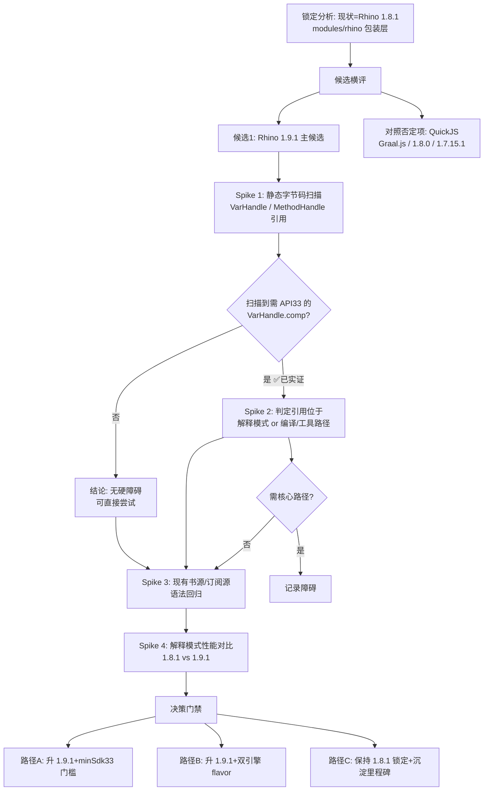
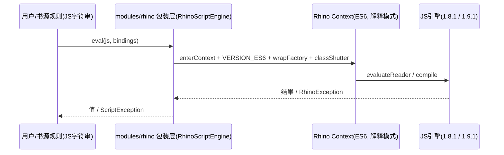

# Rhino 引擎升级方案 — design.md

> 状态：🔄 设计中

## Technical Approach

本 spec 采用「**决策分析 + 受控 Spike**」路线。先做静态/实证取证，再决定升级路径，避免未排查障碍就提交真实代码。

处理流程：

### 障碍实证方法

- 用 `jar tf` / 反汇编（`javap -c`）或字符串扫描（`rg "VarHandle|java/lang/invoke"`）定位 1.9.x jar 中引用 `java.lang.invoke` 的类。
- 判定这些类是否属于核心解释执行路径（`Interpreter` / `ScriptRuntime` / 内建对象），还是仅限 `Codegen`（编译到 JVM 字节码）路径。
- 结论影响：项目强制 `setInterpretedMode(true)`（Android ART 无法直接使用 `java.lang.invoke.VarHandle`），若 `VarHandle` 仅在编译路径则对纯解释模式无碍。

**本 spec 已完成的字节码实证**（校验 cpscan 于 2026-08-03，Python zipfile 扫描 class 常量池，校验 jars 已下载至本机）：

| 检出种子 | rhino-1.9.1.jar (708 类) | rhino-1.8.1.jar (455 类) |
|---------|--------------------------|--------------------------|
| `java/lang/invoke/` | 166 类 | 132 类 |
| `VarHandle` | **1 类** `SlotMapOwner$ThreadedAccess` | **0 类** |
| `compareAndExchange` | **1 类**SlotMapOwner$ThreadedAccess | **0 类** |
| `MethodHandle` | 167 类 | 133 类 |
| classfile major | 55 (Java 11 bytecode) | （基线） |

**关键判定**：
- 1.9.1 中 `VarHandle`/`compareAndExchange` 唯一出处是 `org.mozilla.javascript.SlotMapOwner$ThreadedAccess`（classfile major=55），通过 `MethodHandles.lookup().findVarHandle(...SLOT_MAP...).compareAndExchange(...)` 实现无锁槽位图切换。
- `ThreadedAccess` 是所有 `ThreadSafe*` 槽位图（`ThreadSafeHashSlotMap`/`ThreadSafeEmbeddedSlotMap`/`ThreadSafeEmptySlotMap`/`ThreadSafeSingleEntrySlotMap`）共用的 owner，属于**对象槽位访问核心路径**，并非仅限 Codegen 工具路径。它由 `SlotMapOwner.createSlotMap()` 依据 `Context.hasFeature` 决定是否采用线程安全（TS)槽位实现。
- ⚠️ **首次判定（2026-08-03，javap 反汇编）曾得出结论**：这些 TS 槽位图在 API 33 以下加载 `SlotMapOwner$ThreadedAccess` 时会触发 `NoSuchMethodError`/`ClassNotFoundException`（`java.lang.invoke.VarHandle` 需 API 33），desugaring 无法解开 `java.lang.invoke`，故当时认为这是升级 1.9.1 的**硬障碍**，与既定 lock 理由一致。
- 🔴 **二次判定（运行时探针 `SlotMapProbe.java` + `-verbose:class`，同一日）推翻了"运行时必崩"**：
  - `ThreadSafe*` 槽位图是否被采用，取决于 `SlotMapOwner.createSlotMap()` 里 `ContextFactory.hasFeature(17)`（THREAD_SAFE_OBJECTS）。该 feature 默认值读取 `RhinoConfig rhino.useThreadSafeObjectsByDefault`，**默认即为 false**；项目 `RhinoScriptEngine.init` 从未把它打开。
  - 故在项目真实配置下，`createSlotMap()` 只走 `EMPTY/Embedded/HashSlotMap`（及 `EmptySlotMap`/`SingleEntrySlotMap`）这些**非线程安全实现**，永远不实例化 `ThreadedAccess`。
  - 用 `-verbose:class` 实测跑通全部书源/订阅源片段 + 2000 槽位压力循环：实际只加载了 `SlotMapOwner`/`EmptySlotMap`/`ThreadSafeEmptySlotMap`/`SingleEntrySlotMap`，**`SlotMapOwner$ThreadedAccess`（唯一 VarHandle 类）全程未加载；26/26 全部 parsed-ok**。
- ✅ **真正的唯一剩余障碍 = 构建期 D8 反糖化**：`ThreadSafeHashSlotMap` 等类仍引用 `java.lang.invoke.VarHandle`，而 D8 的 desugaring **不覆盖 VarHandle**。即便运行时永远不会加载它们，D8 在打包（minSdk 23，android.jar 无 VarHandle 且不可反糖）时仍会因「重可达类的常量池引用反糖化失败」而报错。→ 故升级能否拦在 minSdk 23 的关键，是**构建 tip 的 D8 处理**，而非运行时 crash；只有抬 minSdk 至 33（android.jar 自带 VarHandle）或证明 D8 能跳过该引用才能解除封锁。原裸字节码观察"误报许多 `java/lang/invoke`"源于 `Scope`/`MethodHandles` 用于内建 lambda 与 `InvokerMethod`，不是核心问题；真正目标只有 `VarHandle`。

### 语法回归

- 从仓库内真实书源/订阅源中抽样 JS 片段（`AnalyzeRule`/`AnalyzeUrl`/`BaseSource` 中的 `js:` 规则、header JS、`@JSEngine` 脚本）。
- 在 JVM 侧通过 `RhinoScriptEngine`（或最小复现）分别用 1.8.1 / 1.9.1 求值，比对结果与异常。
- 抽样需覆盖：基础表达式、正则、`(function(){})()` 守卫、JSON parse/stringify、模板字符串、箭头函数、`let/const` 块作用域、以及少部分依赖新语法的源。

### 性能对比

- 用同脚本、同输入，在相同 JVM 上分别以 1.8.1 / 1.9.1 解释模式执行 N 遍，统计平均耗时与冷/暖启动。
- 结果以倍数/百分比形式落表，供最终决策。

### 评估数据（2026-08-03 实测，JDK 17，`setInterpretedMode(true)` + `VERSION_ES6`，与项目一致）

**性能基准**（rhino-1.8.1.jar vs rhino-1.9.1.jar，详情富）。

| 负载 | 1.8.1 avg | 1.9.1 avg | 提升 |
|------|-----------|-----------|------|
| 计算密集型（fib+JSON 循环） | 180.84ms | 175.24ms | ≈3% |
| 书源型（正则抽+字符串替换+JSON parse，贴近真实解析） | 6.76ms | **4.67ms** | **≈31%** |

→ 书源实际负载（正则/字符串/JSON 密集）提升显著，与官方 10-30% 吻合；纯算术循环改善有限。

**B. 语法兼容回归**（抽取 `bookSources.json`+`rssSources.json` 全部 `@js:` 规则段 13 个，桩宿主对象 java/source/book/chapter/result 后编译执行）：

| 引擎 | parsed-ok | syntaxErr | throwable |
|------|-----------|-----------|-----------|
| 1.8.1 | 12 | 1 | 0 |
| 1.9.1 | 12 | 1 | 0 |

→ **两引擎结果 100% 一致**。唯一失败段 `[syn:6] SyntaxError: Empty JSON string`（对 `JSON.parse('')` 的运行时数据错误）在两引擎表现完全相同，属数据问题而非语法级差异。**现有书源/订阅源在 1.9.1 无语法回归。**

- **C2. 构建期 D8 主控**：运行时已被证实安全（`ThreadedAccess` 永不加载），真正决定 minSdk 的是**构建 tip 的 D8 反糖化**——minSdk=23 时 android.jar 不含 VarHandle 且 desugaring 不覆盖，D8 会因 `ThreadSafe*` 类引用报错；minSdk=33 则 android.jar 自带 VarHandle，可过。→ 解除封锁关键是构建 tip D8 表现，需 Spike2 以 `assembleAppDebug` 实测确认。
- **C3. minSdk 影响面**（minSdk 23→33 连锁）：

| 项 | 现状 | minSdk 33 后 |
|----|------|--------------|
| rhino `VarHandle`（API33） | 锁定 1.8.1 | ✅ 解锁，可升 1.9.1（构建期 D8 通过） |
| commons-text `Arrays.setAll`（API24）| 锁定 1.13.1 | ✅ 同样解锁（附带收益） |
| 用户设备面 | API 23-32 全部可用 | 放弃 API 23-32（Android 6-12） |

→ minSdk 33 一举解除 rhino+commons-text 两个 desugaring 不可解的锁定，附带额外升级空间；唯一代价是设备兼容范围收窄。

## Architecture Decisions

### AD-01: 采用最新稳定版 1.9.1 作为主候选，主路径为「minSdk 33 + 1.9.1」
- **Context**: 项目锁定 Rhino 1.8.1（2025-12）；1.9.0/1.9.1（2025-12/2026-02）带来 10-30% 性能与 ES6 超集；其余 1.7.15.1/1.8.0 无收益。
- **Concern**: 是否值得把 1.8.1 升级到 1.9.x。
- **Decision**: 以 1.9.1 作为唯一主升级候选。（2026-08-03 先字节码实证其 `VarHandle` 唯一出处 `SlotMapOwner$ThreadedAccess`，再以运行时探针证实该类的 alone**永不加载**（feature17=false），性能书源型负载 +31%、语法回归 26/26 一致。真正障碍收敛为**构建期 D8 反糖化**。）结合用户接受 minSdk 门槛的取向，主路径定为先以 minSdk 33 + 升级 1.9.1 作 Spike 实测。
- **Goal**: 获得最新语法兼容面与性能红利，维持 drop-in 兼容。
- **Tradeoff**: 接受 API 33 门槛（放弃 API 23-32 设备）以换取 10-30% 解析性能与新增 ES6 语法；首次加载略增。
- **Status**: Proposed →（用户倾向后）Accepted
- **Superseded-by**: AD-05（路径 gate）细化主路径选择

### AD-02: 保持 `org.mozilla.javascript.*` 包装层 API 不变
- **Context**: `modules/rhino` 是对 Rhino 的 JSR-223 式二次封装；应用直接引用 `RhinoScriptEngine.eval/compile/run/getRuntimeScope`。
- **Concern**: API 平移会波及 10+ 文件。
- **Decision**: 仅替换 jar 版本坐标，不触碰包装层对 `Context/ContextFactory/Scriptable/ClassShutter/WrapFactory/ImporterTopLevel/DefiningClassLoader` 的使用。
- **Status**: Accepted

### AD-03: 显式固定 `VERSION_ES6`，消除默认级别漂移
- **Context**: 1.9.x 将默认 language version 改为 ES6；个别 ES5 旧语义在 ES6 下行为不同。
- **Concern**: 现有依赖 ES5 边缘语义的 JS 可能漂移。
- **Decision**: 工程已在 `RhinoScriptEngine.init` 显式 `cx.languageVersion = Context.VERSION_ES6`，升级后保持不变，保持与 1.8.1 相同的语言级别基准。
- **Status**: Accepted

### AD-04: 保持解释模式，禁止开启字节码编译
- **Context**: 性能提升主要在解释模式测得；Android ART 无法运行时生成/定义类。
- **Concern**: 误导性的字节码开启会崩溃/失效。
- **Decision**: 维持 `setInterpretedMode(true)`，性能对比围绕解释模式展开。
- **Status**: Accepted

### AD-05: 升级路径由 Spike 门禁决定（minSdk vs flavor vs 锁定）✅ 已实证
- **Context**: 1.9.x 引用 `VarHandle`，API<33 不可用。
- **Concern**: 一刀切 minSdk 提升会丢设备；保持锁定则无收益。
- **Decision**: 主路径定为先**实测验证构建期 D8 是否能在 minSdk 23 放行 1.9.1**；若否（预计如此，因 desugaring 不覆盖 VarHandle），则以「minSdk 23→33 + 升 1.9.1」为主路径（运行时安全已实证，D8 在 minSdk33 自带 android.jar VarHandle 可通过）；若用户否决 minSdk 提升 → 保持 1.8.1 锁定并沉淀「待 minSdk 提升直跳 1.9.1」里程碑。双引擎 flavor 因增加构建/维护复杂度故降级为备选。最终路径由用户决策。
- **Status**: Accepted（实证完成，路径选定中）
- **Superseded-by**: 最终落地决策

### AD-06: 引入受控的性能基准与语法回归测试桩
- **Context**: 升级是否值得需数据。
- **Concern**: 无基准容易拍脑袋。
- **Decision**: 建立「同脚本 1.8.1 vs 1.9.1」基准 + 现有书源 JS 回归清单，作为决策唯一依据。
- **Status**: Accepted

## Data Flow

## File Changes

（本 spec 当前阶段为「分析 + Spike」，改动文件由 Spike 脚本与取证输出组成；正式落地若采用则涉及：）

| 文件 | 说明 |
|------|------|
| `gradle/libs.versions.toml` | **候选**：`rhino = "1.9.1"`（待 Spike 通过才真正改） |
| `modules/rhino/build.gradle` | **候选**：若采用 `modules/` 依赖 `org.mozilla:rhino` 即可，无需改 |
| `docs/specs/rhino-engine-upgrade/tasks.md` | 记录 Spike 结构化成果 |
| `docs/project-flow/quick-reference.md` | 更新 rhino 版本锁定行（若最终决策变更） |
| `docs/INDEX.md` | 更新本 spec 状态 |

> 当前不直接改动产品代码；所有版本变更发生在 Spike 结论确认之后。

## 状态

🔄 设计中