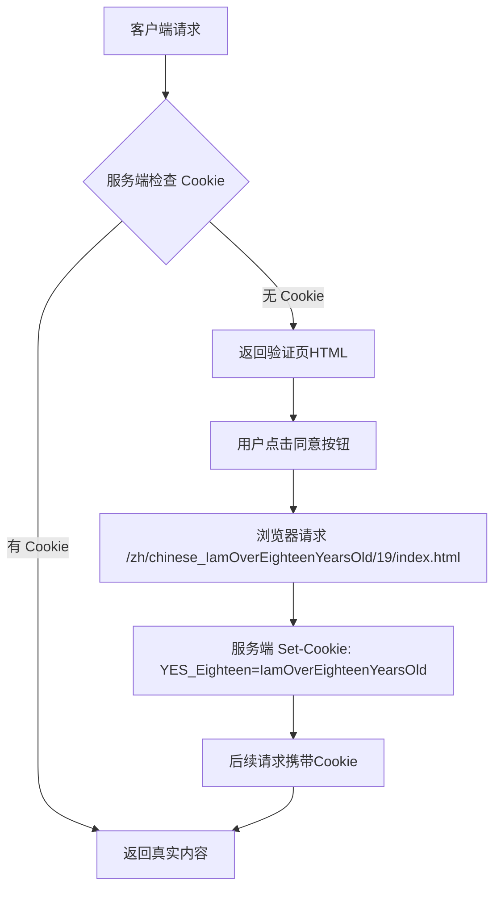
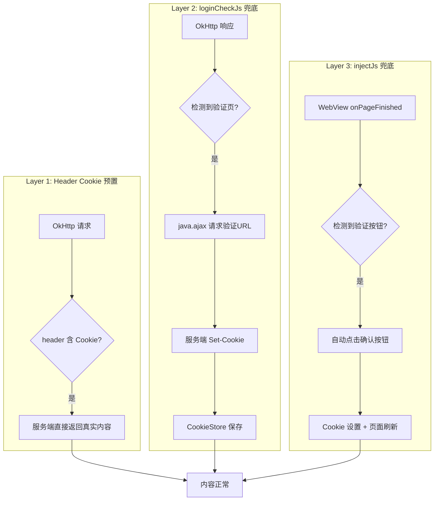
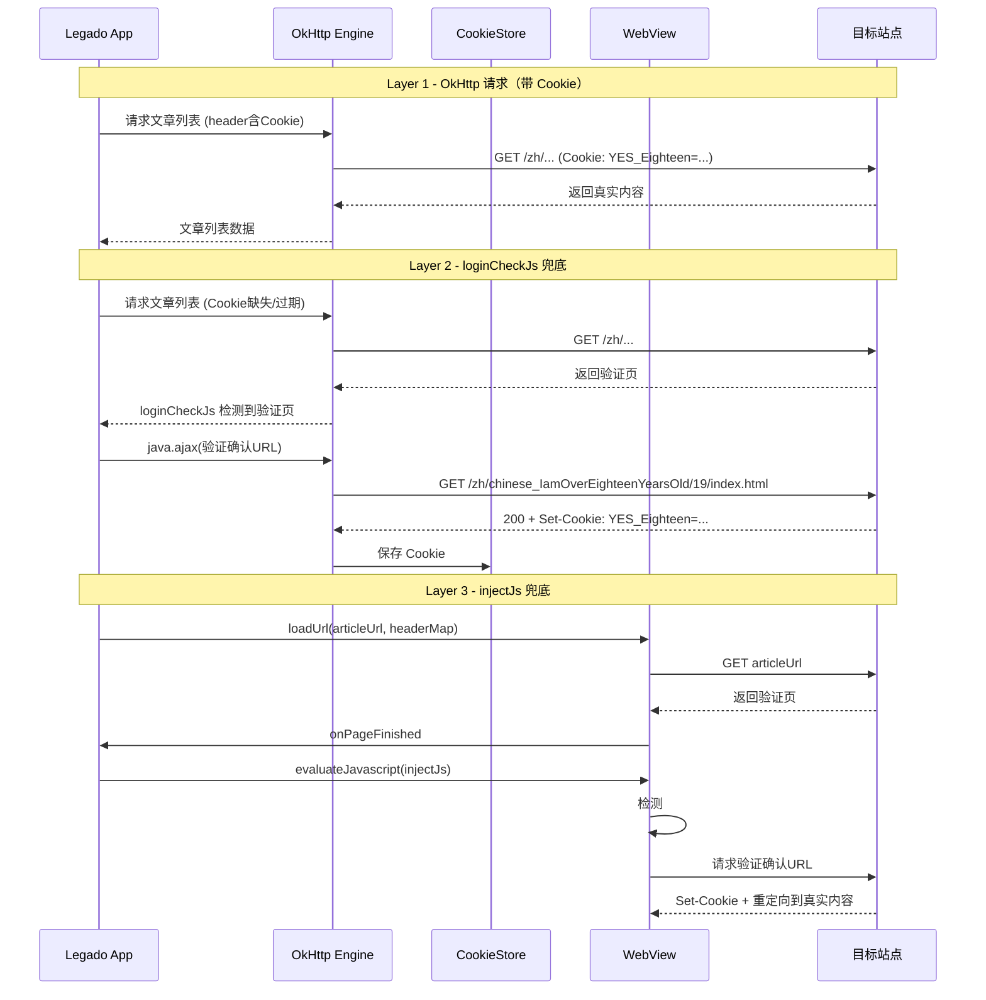

# Design: RSS 订阅源年龄验证自动绕过

## Technical Approach

### 站点验证机制分析

目标站点使用**服务端 Cookie 校验**实现年龄验证：



### 技术参数

| 参数 | 值 |
|------|-----|
| Cookie 名称 | `YES_Eighteen` |
| Cookie 值 | `IamOverEighteenYearsOld` |
| Cookie 路径 | `/` |
| Cookie 有效期 | 180天 (Max-Age=15552000) |
| 验证页确认按钮 | `#fwin_dialog_submit` |
| 验证确认URL | `/zh/chinese_IamOverEighteenYearsOld/19/index.html` |
| 验证页特征 | 包含 `Eighteen_declaration` 图片 |

### 三层防护实现



### 各字段具体实现

#### header 字段（Layer 1）

在现有 header JSON 中添加 Cookie：

```json
{
  "User-Agent": "Mozilla/5.0 (Linux; Android 12; SM-G9910) AppleWebKit/537.36 ...",
  "Accept-Language": "zh-CN,zh;q=0.9",
  "Accept": "text/html,...",
  "Accept-Encoding": "gzip, deflate, br",
  "Connection": "keep-alive",
  "Upgrade-Insecure-Requests": "1",
  "type": "18av",
  "Cookie": "YES_Eighteen=IamOverEighteenYearsOld"
}
```

**注意**：使用 `@js:` 前缀动态生成 header，确保 Cookie 可与 baseUrl 关联。

#### loginCheckJs 字段（Layer 2）

```javascript
var src = result.body();
if (src && src.indexOf('Eighteen_declaration') > -1) {
  java.ajax(baseUrl + '/zh/chinese_IamOverEighteenYearsOld/19/index.html');
}
result
```

**执行链路**（基于 Legado 源码分析）：
1. `Rss.getArticlesAwait()` → `AnalyzeUrl.getStrResponseAwait()` 获取响应
2. 若 `loginCheckJs` 非空 → `AnalyzeUrl.evalJS(checkJs, response)` 执行
3. `java.ajax()` 发起额外请求 → 服务端 Set-Cookie
4. `enabledCookieJar: true` → OkHttp CookieJar 自动保存 Cookie 到 CookieStore
5. 后续 WebView 请求 → `CookieManager.applyToWebView()` 从 CookieStore 读取并应用

#### injectJs 字段（Layer 3）

```javascript
(function() {
  var btn = document.getElementById('fwin_dialog_submit');
  if (btn) {
    btn.click();
  }
})()
```

**执行链路**（基于 Legado 源码分析）：
1. `ReadRssActivity.CustomWebViewClient.onPageFinished()` → `view.evaluateJavascript(injectJs, null)`
2. JS 在 WebView 上下文中执行
3. 检测到验证页确认按钮 → 自动点击
4. 点击触发页面跳转到验证确认URL → 服务端 Set-Cookie
5. Cookie 写入 WebView CookieManager → 页面刷新加载真实内容

## Architecture Decisions

### AD-01: 使用三层防护而非单层方案

- **Context**: 目标站点年龄验证可通过多种方式绕过，不同加载路径（OkHttp vs WebView）需要不同处理
- **Concern**: 单一方案可能无法覆盖所有场景，导致部分情况下用户仍需手动操作
- **Decision**: 采用三层防护（Header Cookie + loginCheckJs + injectJs），每层覆盖不同加载路径
- **Goal**: 确保在任何加载路径下均无需用户交互
- **Tradeoff**: JSON 配置稍显复杂，但换来了100%自动化覆盖
- **Status**: Proposed

### AD-02: Header 使用 @js: 前缀动态生成

- **Context**: 当前源使用纯 JSON 字符串作为 header，但添加 Cookie 后需要确保与 baseUrl 关联
- **Concern**: 纯 JSON 字符串中的 Cookie 是静态的，域名变更时可能不匹配
- **Decision**: 使用 `@js:` 前缀动态生成 header，可引用 `baseUrl` 变量
- **Goal**: 提高域名变更时的兼容性
- **Tradeoff**: 增加少量 JS 执行开销，但提高了健壮性
- **Status**: Proposed

### AD-03: loginCheckJs 使用 java.ajax() 而非 java.startBrowserAwait()

- **Context**: CF 标准配置使用 `java.startBrowserAwait()` 打开浏览器窗口
- **Concern**: `java.startBrowserAwait()` 需要用户手动完成验证，不符合自动破除需求
- **Decision**: 使用 `java.ajax()` 在后台静默请求验证确认URL，无需用户交互
- **Goal**: 实现全自动验证绕过，无需任何用户操作
- **Tradeoff**: `java.ajax()` 不会触发 WebView 渲染，对于需要 JS 执行的验证可能不适用，但本站验证仅需 HTTP 请求即可完成
- **Status**: Proposed

## Data Flow



## File Changes

| 文件 | 变更类型 | 变更内容 |
|------|---------|---------|
| `temp/rss/rssSource_202607131357/DownloadsrssSource_18AV-new.(1)..json` | 修改 | 优化订阅源 JSON：header 添加 Cookie、新增 loginCheckJs、新增 injectJs |

## 源码分析参考

| 文件 | 关键行 | 作用 |
|------|--------|------|
| `RssSource.kt` | L35-91 | RssSource 实体定义：enabledCookieJar/header/loginCheckJs/injectJs/preloadJs 字段 |
| `Rss.kt` | L60-68 | loginCheckJs 执行链路：getStrResponseAwait → evalJS(checkJs) |
| `ReadRssActivity.kt` | L407-408 | WebView 加载：CookieManager.applyToWebView + loadUrl(url, headerMap) |
| `ReadRssActivity.kt` | L736-740 | injectJs 执行：onPageFinished → evaluateJavascript(injectJs) |
| `ReadRssActivity.kt` | L749-770 | shouldOverrideUrlLoading 执行：evalJS(source.shouldOverrideUrlLoading) |
| `CookieManager.kt` | L145-151 | applyToWebView：从 CookieStore 读取 Cookie 并应用到 WebView |
