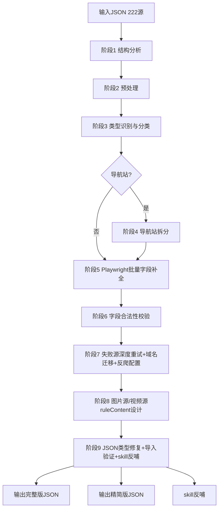

# design.md - RSS 订阅源批量优化 v2 技术设计

## Technical Approach

### 整体架构

复用 v1 的 5 步闭环工作流，扩展为 9 阶段流水线（新增类型识别和导航站拆分）：

```
输入JSON (222源)
    ↓
[阶段1] 结构分析 (analyze_input_structure.py) → 字段覆盖率报告
    ↓
[阶段2] 预处理 (preprocess_sources.py)
    - 占位符源标记 (sourceUrl长度<20)
    - 模板源提取base_url (含{{}})
    - sourceComment提取候选域名
    ↓
[阶段3] 类型识别与分类 (classify_source_type.py) ← 新增
    - Playwright访问首页分析DOM结构
    - 识别图片源(type=1)：大量img标签、图片画廊布局
    - 识别视频源(type=2)：video标签、视频列表、播放按钮
    - 识别网页源(type=0)：文章列表、文字内容
    - 识别导航站：大量外链、分类导航
    ↓
[阶段4] 导航站拆分 (split_navigation_source.py) ← 新增
    - 对导航类源站提取所有子站链接
    - 逐个分析子站类型（图片/视频）
    - 将图片站/视频站拆分为独立订阅源
    ↓
[阶段5] Playwright批量字段补全 (batch_optimize_v2.py)
    - 访问每个源首页
    - 必填字段：sourceIcon/searchUrl/ruleArticles/ruleTitle/ruleLink/ruleImage
    - 推荐字段：sortUrl/ruleNextPage/rulePubDate/ruleContent
    - 失败不中断，记录到报告
    ↓
[阶段6] 字段合法性后置校验 (post_validate.py)
    - 修复 ruleNextPage='page' 等无效值
    - 修复 searchUrl='None' 等无效值
    - 修复 Python None 序列化污染
    - 必填字段缺失检查（REQ-2~7）
    ↓
[阶段7] 失败源深度重试 + 域名迁移 + 反爬配置
    - deep_retry_v2.py: 14种技术手段穷尽优化
    - migrate_domain_v2.py: 5步闭环迁移
    - add_login_config_v2.py: 反爬源配置loginUrl
    ↓
[阶段8] 图片源/视频源ruleContent设计 (design_rule_content.py) ← 新增
    - 图片源(type=1)：ruleContent返回图片URL，适配PhotoDialog
    - 视频源(type=2)：ruleContent返回视频URL或嗅探
    ↓
[阶段9] JSON类型修复 + 导入验证 + skill反哺
    - fix_json_boolean.py: boolean 1/0 → true/false
    - import_rss_source.py 导入模拟器
    - verify_rss_scenarios.py 4场景验证
    - 反哺新陷阱到skill文档
    ↓
输出: optimized_v2_full.json + optimized_v2_lite.json + 测试报告
```

### 关键技术点

#### 1. 占位符源处理（68个）

68个 sourceUrl 长度<20 的源是占位符（非真实URL），需要：

```python
def is_placeholder_source(source):
    url = source.get('sourceUrl', '')
    return len(url) < 20 or not url.startswith('http')

def extract_url_from_comment(source):
    """从sourceComment提取候选URL"""
    comment = source.get('sourceComment', '') or ''
    # 提取 http(s):// 开头的URL
    urls = re.findall(r'https?://[^\s"\'<>]+', comment)
    # 提取"永久入口:"等提示后的URL
    m = re.search(r'(?:永久入口|最新域名|备用域名|发布页)[：:\s]*(https?://[^\s"\'<>]+)', comment)
    if m:
        return m.group(1)
    if urls:
        return urls[0]
    return None
```

#### 2. 模板源处理（7个）

7个 sourceUrl 含 `{{}}` 的模板源，需要提取base_url：

```python
def extract_base_url(source_url):
    """从模板URL提取base_url"""
    # 去除 {{...}} 部分
    base = re.sub(r'\{\{.*\}\}', '', source_url)
    return base if base.startswith('http') else None
```

#### 3. 失败源深度重试（14种技术手段）

复用 v1 的 14 种技术手段：
1. 4种UA（Chrome/Mobile/Bot/Firefox）
2. HTTP方法（GET/HEAD）
3. Wayback Machine 存档
4. HTTP/1.1 强制（http.client）
5. HTTP降级（https→http）
6. 跟随重定向（urllib）
7. 长 timeout（40秒）
8. requests + Session（cookie共享）
9. Playwright真实渲染（stealth脚本）
10. 移动UA
11. 8端口组合
12. 60s超时
13. Wayback直接访问
14. 多次重试

#### 4. 域名迁移5步闭环

```python
def migrate_domain(source_url):
    # Step1: 访问原URL提取候选域名
    # Step2: 访问"最新域名获取地址"
    # Step3: 去重去CDN
    # Step4: 逐个测试可达性
    # Step5: 用新域名替换sourceUrl + 重新提取4字段
```

#### 5. 反爬源loginUrl配置

```python
def add_login_config(source):
    source_url = source['sourceUrl']
    if len(source.get('loginUrl', '') or '') < 5:
        source['loginUrl'] = source_url
    source['enabledCookieJar'] = True
    source['sourceComment'] = '[AI_CONFIG:user_optional_login|...]'
```

#### 6. JSON类型修复

```python
BOOLEAN_FIELDS = {'enabled', 'enabledCookieJar', 'singleUrl', 'enableJs',
                  'loadWithBaseUrl', 'showWebLog', 'preload', 'cacheFirst'}

def fix_booleans(obj):
    if isinstance(obj, dict):
        for key, value in obj.items():
            if key in BOOLEAN_FIELDS:
                obj[key] = bool(value)
```

#### 7. 类型识别算法（阶段3 - DOM特征分析）

**核心目标**：通过 Playwright 访问源首页分析 DOM 结构，识别源类型（type=0/1/2 或导航站）。

**识别算法（DOM特征权重打分）**：

```python
def classify_source_type_by_dom(page):
    """通过DOM特征分析识别源类型
    返回: (type, is_navigation, confidence)
    type: 0=网页, 1=图片, 2=视频
    is_navigation: 是否导航站
    confidence: 0.0-1.0 置信度
    """
    # 提取DOM特征
    features = page.evaluate('''() => {
        const imgs = document.querySelectorAll('img');
        const videos = document.querySelectorAll('video');
        const iframes = document.querySelectorAll('iframe');
        const a_tags = document.querySelectorAll('a');
        
        // 图片特征：img数量 / 图片画廊布局
        const img_count = imgs.length;
        const img_gallery = document.querySelectorAll('.gallery, .image-list, .photo-list, ul.photos').length;
        const img_in_links = Array.from(imgs).filter(img => 
            img.src && img.width > 100 && img.height > 100
        ).length;
        
        // 视频特征：video标签 / 播放按钮 / 视频列表
        const video_count = videos.length;
        const video_links = Array.from(a_tags).filter(a => 
            /play|video|watch|episode/i.test(a.textContent + ' ' + a.href)
        ).length;
        const video_btns = document.querySelectorAll('.play-btn, .video-play, [class*="play"]').length;
        
        // 导航站特征：外链+分类导航
        const external_links = Array.from(a_tags).filter(a => {
            try { return new URL(a.href).host !== location.host; } 
            catch(e) { return false; }
        }).length;
        const nav_categories = document.querySelectorAll('.nav, .category, .sort, .directory, .friend-link').length;
        
        // 文章特征：文字内容+文章列表
        const article_tags = document.querySelectorAll('article, .article, .post, .news, .blog-item').length;
        const text_density = document.body.innerText.length / document.body.innerHTML.length;
        
        return {
            img_count, img_gallery, img_in_links,
            video_count, video_links, video_btns,
            external_links, nav_categories, a_total: a_tags.length,
            article_tags, text_density
        };
    }''')
    
    # 权重打分
    img_score = (
        min(features['img_count'] / 20, 1.0) * 0.4 +
        features['img_gallery'] * 0.3 +
        min(features['img_in_links'] / 10, 1.0) * 0.3
    )
    video_score = (
        features['video_count'] * 0.4 +
        min(features['video_links'] / 5, 1.0) * 0.4 +
        min(features['video_btns'] / 3, 1.0) * 0.2
    )
    nav_score = (
        min(features['external_links'] / 20, 1.0) * 0.5 +
        features['nav_categories'] * 0.3 +
        min(features['a_total'] / 50, 1.0) * 0.2
    )
    article_score = (
        features['article_tags'] * 0.4 +
        min(features['text_density'] * 10, 1.0) * 0.6
    )
    
    # 决策
    scores = {
        'image': img_score, 'video': video_score, 
        'navigation': nav_score, 'article': article_score
    }
    best = max(scores, key=scores.get)
    confidence = scores[best]
    
    if best == 'navigation' and confidence > 0.5:
        return (0, True, confidence)  # 导航站，待阶段4拆分
    elif best == 'image' and confidence > 0.4:
        return (1, False, confidence)  # 图片源
    elif best == 'video' and confidence > 0.4:
        return (2, False, confidence)  # 视频源
    else:
        return (0, False, confidence)  # 默认网页源
```

**sourceUrl 模板辅助识别**：部分源 sourceUrl 含 `/video/`、`/image/`、`/pic/` 等关键词，作为辅助判断依据：

```python
TYPE_HINT_PATTERNS = {
    'video': [r'/video/', r'/v/', r'/movie/', r'/play', r'视频', r'影视'],
    'image': [r'/image/', r'/pic/', r'/photo/', r'/gallery/', r'图片', r'图库'],
    'navigation': [r'/nav/', r'/link/', r'导航', r'网址'],
}

def classify_by_url(source_url, source_name):
    """通过URL和名称辅助识别类型（不脱敏，仅技术特征）"""
    text = source_url.lower()
    for type_key, patterns in TYPE_HINT_PATTERNS.items():
        if any(re.search(p, text, re.IGNORECASE) for p in patterns):
            return type_key
    return None
```

**综合决策**：DOM分析（70%权重）+ URL/名称辅助（30%权重），置信度<0.4时保留 type=0 等待后续阶段处理。

#### 8. 导航站拆分逻辑（阶段4）

**核心目标**：从导航类源站提取所有子站链接，对图片站/视频站拆分为独立订阅源。

```python
def split_navigation_source(source, page):
    """拆分导航站为独立子源
    
    返回: List[dict] 子源列表（每个子源是一个新的RssSource）
    """
    # Step1: 提取所有外链+分类导航链接
    sub_sites = page.evaluate('''() => {
        const result = [];
        const seen = new Set();
        
        // 提取导航/分类区块下的所有链接
        const nav_selectors = [
            '.nav a', '.category a', '.sort a', '.directory a',
            '.friend-link a', '.link-list a', '.site-list a',
            '.content-list a', '.main-sites a', 'nav a'
        ];
        
        for (const sel of nav_selectors) {
            document.querySelectorAll(sel).forEach(a => {
                if (!a.href || seen.has(a.href)) return;
                seen.add(a.href);
                
                // 跳过内部锚点/邮箱/电话
                if (a.href.startsWith('#') || a.href.startsWith('mailto:') || a.href.startsWith('tel:')) return;
                
                // 提取链接的上下文（父元素的文本作为分类标签）
                const parent_text = a.closest('li, .item, .category')?.innerText || '';
                
                result.push({
                    url: a.href,
                    text: a.textContent.trim().substring(0, 50),
                    context: parent_text.substring(0, 100),
                    // 图片提示：链接附近有img标签
                    has_image: !!a.querySelector('img') || !!a.closest('.image, .pic, .gallery'),
                    // 视频提示：链接文本含视频关键词
                    is_video_hint: /视频|影视|movie|video|play/i.test(a.textContent + ' ' + a.href)
                });
            });
        }
        return result;
    }''')
    
    # Step2: 去重+过滤无效链接
    seen_hosts = set()
    valid_sub_sites = []
    for site in sub_sites:
        try:
            host = urlparse(site['url']).netloc
            if host and host not in seen_hosts:
                seen_hosts.add(host)
                valid_sub_sites.append(site)
        except Exception:
            continue
    
    # Step3: Playwright 访问每个子站首页，识别类型
    sub_sources = []
    for site in valid_sub_sites:
        try:
            sub_page = browser.new_page()
            sub_page.goto(site['url'], timeout=15000)
            
            # 复用阶段3的类型识别
            sub_type, is_nav, conf = classify_source_type_by_dom(sub_page)
            
            # 只拆分图片源和视频源（跳过导航站和文章站）
            if sub_type in (1, 2) and conf > 0.4:
                sub_source = create_sub_source(
                    parent_source=source,
                    sub_url=site['url'],
                    sub_name=site['text'],
                    sub_type=sub_type
                )
                sub_sources.append(sub_source)
            
            sub_page.close()
        except Exception as e:
            # 子站访问失败跳过，不阻断整体流程
            continue
    
    return sub_sources


def create_sub_source(parent_source, sub_url, sub_name, sub_type):
    """基于父源创建子源（继承父源的header/cookie配置）"""
    return {
        'sourceUrl': sub_url,
        'sourceName': f"{sub_name}（来自导航站拆分）",
        'sourceComment': f'[AI_EXTRACTED:from_navigation|parent={parent_source["sourceUrl"][:30]}***]',
        'type': sub_type,
        'enabled': True,
        'enabledCookieJar': parent_source.get('enabledCookieJar', True),
        'header': parent_source.get('header', ''),
        # 字段由阶段5统一补全
        'sourceIcon': '',
        'searchUrl': '',
        'ruleArticles': '',
        'ruleTitle': '',
        'ruleLink': '',
        'ruleImage': '',
    }
```

**拆分边界条件**：
- 单个导航站最多拆分20个子源（防止海量外链导致任务爆炸）
- 子站访问失败跳过，不影响其他子站
- 子源类型置信度<0.4 跳过
- 父源标记 `nav_parent=true`，保留在最终JSON但 enabled=false（避免重复展示）

#### 9. 图片源 ruleContent JS规则设计（阶段8）

**核心目标**：为 type=1 图片源设计 ruleContent，适配 PhotoDialog 调用链。

**源码调用链分析**（ReadRss.kt 第99-124行）：

```kotlin
private fun readNoHtml(fragment: Fragment, rssArticle: RssArticle, rssSource: RssSource?, type: Int) {
    val rssSource = ...
    val ruleContent = s.ruleContent
    if (ruleContent.isNullOrBlank()) {
        // 无 ruleContent：直接用 rssArticle.link 作为图片URL
        when (type) {
            1 -> fragment.showDialogFragment(PhotoDialog(rssArticle.link))
        }
    } else {
        // 有 ruleContent：执行 Rss.getContent 获取图片URL
        Rss.getContent(...).onSuccess(IO) { body ->
            val url = NetworkUtils.getAbsoluteURL(rssArticle.link, body)
            when (type) {
                1 -> fragment.showDialogFragment(PhotoDialog(url))
            }
        }
    }
}
```

**设计要点**：
1. ruleContent 返回值会被 `NetworkUtils.getAbsoluteURL(rssArticle.link, body)` 处理，支持相对路径
2. body 必须是纯图片URL字符串（不能是JSON数组），PhotoDialog 只接收单个URL
3. 如需多图浏览：ruleContent 返回第一张图URL，PhotoDialog 内部处理（如不支持，则用列表规则中提取的 link 直接打开图片详情页）

**ruleContent JS 模板**（针对不同图片源结构）：

```javascript
// 模板A：详情页只有一个  主图（最常见）
// 提取 class 含 "content"/"main"/"article" 的容器内的 img src
<js>
(function(){
    var img = document.querySelector('.content img, .main img, .article img, .photo img, main img');
    if (img) {
        return img.src || img.getAttribute('data-src') || img.getAttribute('data-original');
    }
    return '';
})();
</js>

// 模板B：详情页用 data-src 懒加载图片
<js>
(function(){
    var img = document.querySelector('img[data-src], img[data-original], img.lazyload');
    if (img) {
        return img.getAttribute('data-src') || img.getAttribute('data-original');
    }
    // 兜底：取第一个可见img的src
    var fallback = document.querySelector('img[src]:not([src=""])');
    return fallback ? fallback.src : '';
})();
</js>

// 模板C：图片URL在 meta 标签 og:image 中
<js>
(function(){
    var meta = document.querySelector('meta[property="og:image"]');
    if (meta) {
        return meta.getAttribute('content');
    }
    return '';
})();
</js>

// 模板D：图片源在 JSON API 中返回
// 当 sourceUrl 是 API 接口时，直接从响应JSON提取
@js:
var data = JSON.parse(result);
if (data && data.image_url) {
    return data.image_url;
} else if (data && data.data && data.data.url) {
    return data.data.url;
}
return '';
```

**字段自动选择策略**：

```python
def design_image_rule_content(page, source_url):
    """根据页面DOM自动选择最合适的图片规则模板"""
    # 检测各种DOM特征
    features = page.evaluate('''() => {
        return {
            has_main_img: !!document.querySelector('.content img, .main img, .article img'),
            has_lazy_img: !!document.querySelector('img[data-src], img[data-original]'),
            has_og_image: !!document.querySelector('meta[property="og:image"]'),
            is_json_response: document.contentType === 'application/json'
        };
    }''')
    
    if features['is_json_response']:
        return TEMPLATE_D  // JSON API 模式
    if features['has_lazy_img']:
        return TEMPLATE_B  // 懒加载模式
    if features['has_og_image']:
        return TEMPLATE_C  // og:image 模式
    if features['has_main_img']:
        return TEMPLATE_A  // 默认主图模式
    
    return ''  // 无 ruleContent，直接用 rssArticle.link 作为图片URL（兜底）
```

#### 10. 视频源 ruleContent 设计（阶段8）

**核心目标**：为 type=2 视频源设计 ruleContent，适配 VideoPlayerActivity。

**源码调用链分析**（ReadRss.kt 第78-95行）：

```kotlin
if (type == 2) {
    // 视频播放：设置文章列表到 VideoPlay 单例
    VideoPlay.rssArticles = rssArticles
    VideoPlay.rssArticleIndex = ...
    fragment.startActivity<VideoPlayerActivity> {
        putExtra("sourceKey", rssArticle.origin)
        putExtra("sourceType", SourceType.rss)
        putExtra("record", rssArticle.link)  // R3 title 修复
    }
}
```

**关键发现**：VideoPlayerActivity 接收 `record=rssArticle.link`，视频URL的解析在 VideoPlayerActivity 内部完成，**不走 Rss.getContent 路径**。VideoPlayerActivity 内置嗅探器（如 m3u8 嗅探），可以直接处理视频详情页。

**设计策略**：

| 视频源场景 | ruleContent | 理由 |
|-----------|-------------|------|
| 标准 m3u8/mp4 视频站 | 空 | VideoPlayerActivity 嗅探器自动解析 |
| 详情页视频URL在JS变量中 | `<js>提取视频URL的JS</js>` | 嗅探器可能解析不到JS变量 |
| 详情页视频URL在 iframe 中 | 空 | 嗅探器自动处理 iframe |
| API接口返回视频URL | `<js>JSON解析JS</js>` | 必须用JS从JSON提取 |

**ruleContent JS 模板**（针对视频源）：

```javascript
// 模板V1：从详情页 JS 变量中提取 m3u8/mp4 URL
<js>
(function(){
    // 提取页面中所有 m3u8/mp4 URL（从script标签、变量、video标签）
    var scripts = document.querySelectorAll('script');
    for (var i = 0; i < scripts.length; i++) {
        var text = scripts[i].textContent;
        var match = text.match(/https?:\/\/[^\s"'<>]+\.m3u8[^\s"'<>]*/);
        if (match) return match[0];
        match = text.match(/https?:\/\/[^\s"'<>]+\.mp4[^\s"'<>]*/);
        if (match) return match[0];
    }
    // 兜底：检查 video 标签
    var video = document.querySelector('video');
    if (video && video.src) return video.src;
    var source = document.querySelector('video source');
    if (source && source.src) return source.src;
    return '';
})();
</js>

// 模板V2：从 JSON API 响应中提取视频URL
@js:
var data = JSON.parse(result);
if (data && data.url) {
    return data.url;
}
if (data && data.data && data.data.play_url) {
    return data.data.play_url;
}
if (data && data.list && data.list[0] && data.list[0].url) {
    return data.list[0].url;
}
return '';

// 模板V3：从 iframe src 中提取（适用于嵌入式播放器）
<js>
(function(){
    var iframe = document.querySelector('iframe[src*="player"], iframe[src*="play"], iframe[src*="video"]');
    if (iframe) return iframe.src;
    return '';
})();
</js>
```

**视频源 ruleContent 自动选择策略**：

```python
def design_video_rule_content(page, source_url):
    """根据页面DOM自动选择视频ruleContent模板"""
    features = page.evaluate('''() => {
        return {
            has_m3u8_in_script: /\\.m3u8/.test(document.body.innerHTML),
            has_mp4_in_script: /\\.mp4/.test(document.body.innerHTML),
            has_video_tag: !!document.querySelector('video'),
            has_player_iframe: !!document.querySelector('iframe[src*="player"], iframe[src*="play"]'),
            is_json_response: document.contentType === 'application/json'
        };
    }''')
    
    if features['is_json_response']:
        return TEMPLATE_V2
    if features['has_m3u8_in_script'] or features['has_mp4_in_script']:
        return TEMPLATE_V1  // 从script提取m3u8/mp4
    if features['has_player_iframe']:
        return TEMPLATE_V3  // 从iframe提取
    if features['has_video_tag']:
        return ''  // 有video标签，嗅探器可处理
    
    return ''  // 默认空，依赖嗅探器
```

**重要边界**：
1. 视频源 ruleContent 优先级：**嗅探器 > JS提取**（避免JS解析失败导致无法播放）
2. 当嗅探器无法处理时（如JS变量中的m3u8），才用 ruleContent JS
3. VideoPlayerActivity 内置 ExoPlayer/GSYVideoPlayer/Cronet，支持 m3u8/mp4/FLV 等主流格式
4. ruleContent JS 必须返回绝对URL或可被 NetworkUtils.getAbsoluteURL 处理的相对URL

#### 11. 综合字段补全策略（阶段5核心）

**必填字段补全策略矩阵**：

| 字段 | Playwright提取策略 | 兜底策略 |
|------|------------------|----------|
| sourceIcon | `<link rel="icon">` / `<link rel="shortcut icon">` / `/favicon.ico` | 用 sourceUrl 拼接 `/favicon.ico` |
| searchUrl | 分析搜索表单 action + method | 用 Google site: 搜索：`https://www.google.com/search?q={{key}}+site:domain` |
| ruleArticles | 文章列表容器的CSS选择器（`.post-list`, `.article-list`, `ul.news li`） | 通用：`class.list@li` 或 `class.post` |
| ruleTitle | 文章列表项内标题元素（`.title`, `h2`, `h3`, `a`） | 通用：`.title@a` 或 `h3.a` |
| ruleLink | 文章列表项内链接（`a@href`） | 通用：`a@href` |
| ruleImage | 文章列表项内图片（`img@src` 或 `img@data-src`） | 通用：`img@src` |
| sortUrl | 提取分类导航链接（含"分类/标签/栏目"关键词的链接） | 用 sourceUrl 作为单一分类 |
| ruleNextPage | 提取"下一页"链接（`a:contains("下一页")`, `.next a`） | 空（无分页时允许留空） |

**Playwright 提取脚本核心逻辑**：

```python
def extract_fields_with_playwright(page, source_url, source_type):
    """Playwright 提取必填字段（所有返回值脱敏）"""
    fields = page.evaluate('''() => {
        const result = {};
        
        // 1. sourceIcon
        const icon_link = document.querySelector('link[rel="icon"], link[rel="shortcut icon"]');
        result.sourceIcon = icon_link ? icon_link.href : '';
        
        // 2. searchUrl
        const search_form = document.querySelector('form[action*="search"], form#search, form.search');
        if (search_form) {
            const action = search_form.getAttribute('action');
            const method = search_form.getAttribute('method') || 'get';
            const input = search_form.querySelector('input[name]:not([type="submit"])');
            if (input && input.name) {
                result.searchUrl = (action || location.origin + '/search') + 
                    (method.toLowerCase() === 'get' ? '?' + input.name + '={{key}}' : '');
            }
        }
        
        // 3. ruleArticles - 自动识别文章列表容器
        const list_selectors = [
            '.post-list', '.article-list', '.news-list', '.blog-list',
            'ul.posts li', 'ul.news li', 'ul.articles li',
            '.list-item', '.item', '.card'
        ];
        for (const sel of list_selectors) {
            const items = document.querySelectorAll(sel);
            if (items.length >= 3) {  // 至少3项才认为是列表
                result.ruleArticles = sel;
                break;
            }
        }
        
        // 4. ruleTitle / ruleLink / ruleImage 基于ruleArticles上下文提取
        if (result.ruleArticles) {
            const first_item = document.querySelector(result.ruleArticles);
            if (first_item) {
                const title_el = first_item.querySelector('h2, h3, .title, .post-title');
                result.ruleTitle = title_el ? title_el.tagName.toLowerCase() + (title_el.className ? '.' + title_el.className.split(' ')[0] : '') : '';
                
                const link_el = first_item.querySelector('a[href]');
                result.ruleLink = 'a@href';
                
                const img_el = first_item.querySelector('img');
                if (img_el) {
                    result.ruleImage = 'img@' + (img_el.getAttribute('data-src') ? 'data-src' : 'src');
                }
            }
        }
        
        return result;
    }''');
    
    return fields
```

**字段合法性校验扩展**（阶段6）：

```python
def validate_mandatory_fields(source):
    """校验必填字段（REQ-2~7）"""
    errors = []
    
    # sourceIcon：必须以 http 开头或 / 开头
    icon = source.get('sourceIcon', '')
    if not icon or (not icon.startswith('http') and not icon.startswith('/')):
        # 兜底：用 sourceUrl 拼接 /favicon.ico
        source['sourceIcon'] = urlparse(source['sourceUrl']).scheme + '://' + \
            urlparse(source['sourceUrl']).netloc + '/favicon.ico'
    
    # searchUrl：必须含 {{key}} 占位符（搜索关键词）
    search = source.get('searchUrl', '')
    if search and '{{key}}' not in search:
        # Google site: 搜索兜底
        domain = urlparse(source['sourceUrl']).netloc
        source['searchUrl'] = f'https://www.google.com/search?q={{key}}+site:{domain}'
    
    # ruleArticles / ruleTitle / ruleLink / ruleImage：非空校验
    for field in ['ruleArticles', 'ruleTitle', 'ruleLink', 'ruleImage']:
        if not source.get(field, '').strip():
            errors.append(f'missing_{field}')
    
    return errors
```

## Architecture Decisions

### AD-01: 复用v1工作流而非重新设计

- **Context**: 222源批量优化，规模3.4倍于v1（65源）
- **Concern**: 是否需要重新设计工作流？
- **Decision**: 复用v1的5步闭环，扩展为8阶段流水线
- **Goal**: 降低实施风险，复用已验证的脚本和陷阱库
- **Tradeoff**: 不能完全针对v2新场景优化，但稳定性优先
- **Status**: Accepted

### AD-02: 不并行化Playwright访问

- **Context**: 222源串行访问约74分钟
- **Concern**: 是否需要并行化加速？
- **Decision**: 保持串行，不并行化
- **Goal**: 稳定性优先，避免反爬触发，调试简单
- **Tradeoff**: 处理时间长（约2-3小时），但可接受
- **Status**: Accepted

### AD-03: 占位符源不强制处理

- **Context**: 68个sourceUrl长度<20的占位符源
- **Concern**: 是否从sourceComment提取真实URL？
- **Decision**: 尝试从sourceComment提取，失败则标记needs_manual
- **Goal**: 不丢失数据，明确分类让用户决定
- **Tradeoff**: 部分占位符源无法自动修复
- **Status**: Accepted

### AD-04: 失败源保留loginUrl配置

- **Context**: v1经验显示模拟器DNS问题导致loginUrl也无效
- **Concern**: 是否还配置loginUrl？
- **Decision**: 保留loginUrl配置，标记user_optional_login让用户自决
- **Goal**: 不丢失可恢复性，用户在真机环境可能可用
- **Tradeoff**: 部分配置可能无效，但保留比移除更安全
- **Status**: Accepted

### AD-05: skill反哺新陷阱

- **Context**: 本次任务可能发现新陷阱（如占位符源处理、模板源处理）
- **Decision**: 任务完成后将新陷阱反哺到 batch-optimization-patterns.md
- **Goal**: 经验积累，避免重复犯错
- **Tradeoff**: 反哺时间成本，但符合用户要求
- **Status**: Accepted

## Data Flow



## File Changes

### 新增脚本

| 脚本 | 用途 |
|------|------|
| `ai_tests/scripts/analyze_input_structure.py` | 阶段1 结构分析（已创建） |
| `ai_tests/scripts/preprocess_sources_v2.py` | 阶段2 预处理（占位符+模板源） |
| `ai_tests/scripts/classify_source_type_v2.py` | 阶段3 类型识别与分类（DOM特征分析） |
| `ai_tests/scripts/split_navigation_source_v2.py` | 阶段4 导航站拆分（提取子站为独立源） |
| `ai_tests/scripts/batch_optimize_v2.py` | 阶段5 Playwright批量字段补全（11字段） |
| `ai_tests/scripts/post_validate_v2.py` | 阶段6 字段合法性后置校验 |
| `ai_tests/scripts/deep_retry_v2.py` | 阶段7 失败源14种技术手段重试 |
| `ai_tests/scripts/migrate_domain_v2.py` | 阶段7 域名迁移5步闭环 |
| `ai_tests/scripts/add_login_config_v2.py` | 阶段7 反爬源loginUrl配置 |
| `ai_tests/scripts/design_rule_content_v2.py` | 阶段8 图片源/视频源ruleContent设计 |
| `ai_tests/scripts/fix_json_boolean_v2.py` | 阶段9 JSON类型修复（复用v1） |
| `ai_tests/scripts/import_rss_source.py` | 阶段9 导入模拟器（复用v1） |
| `ai_tests/scripts/verify_rss_scenarios_v2.py` | 阶段9 4场景验证 |
| `ai_tests/scripts/final_summary_v2.py` | 最终诊断汇总 |

### 修改文件

| 文件 | 修改内容 |
|------|---------|
| `.trae/skills/legado-source-creator/references/source-analysis/batch-optimization-patterns.md` | 新增陷阱16+（占位符源处理、模板源处理、类型识别、导航站拆分、图片源ruleContent、视频源ruleContent） |
| `docs/INDEX.md` | 添加本任务到进行中列表 |
| `c:\Users\shiyq\.trae-cn\memory\projects\-f-myself-github-WeAgentChat-temp-legado\project_memory.md` | 持久化用户决策 |

### 输出文件

| 文件 | 用途 |
|------|------|
| `output/rss/optimized_v2_full.json` | 完整版JSON（含导航站拆分后的子源+truly_dead标记） |
| `output/rss/optimized_v2_lite.json` | 精简版JSON（移除truly_dead+nav_parent禁用源） |
| `output/rss/v2_test_report.json` | 测试报告 |
| `output/rss/v2_optimization_report.json` | 优化过程报告 |
| `output/rss/v2_type_classification_report.json` | 类型识别报告（不含业务字段，仅统计） |
| `output/rss/v2_navigation_split_report.json` | 导航站拆分报告（不含业务字段，仅统计） |
