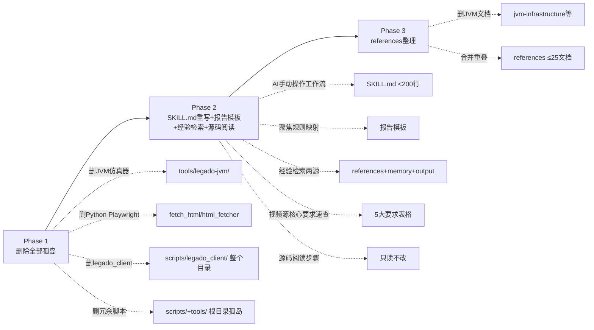
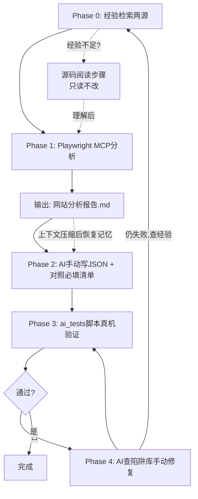
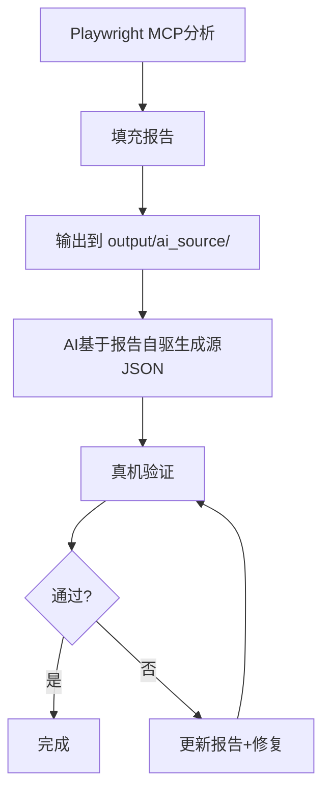
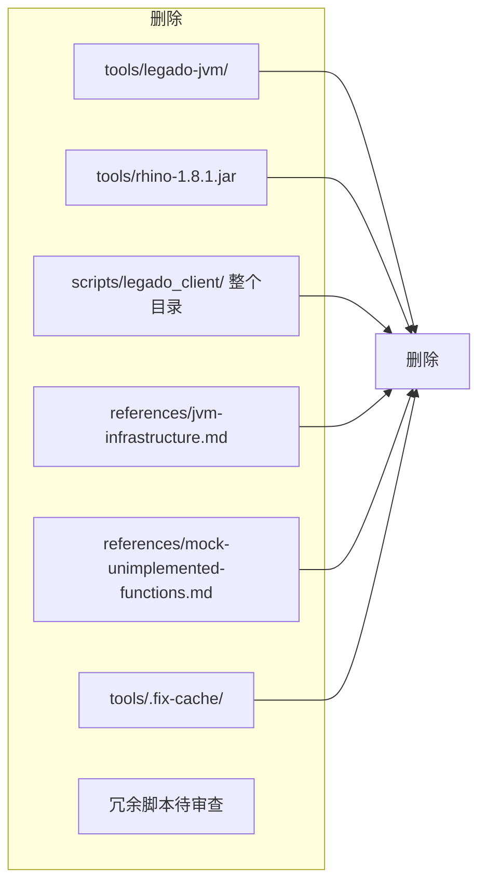
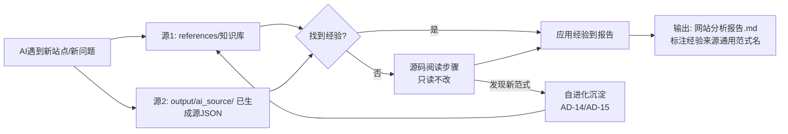
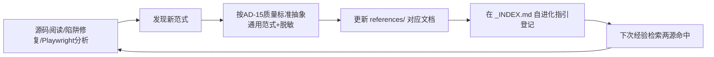

# Design: Legado Source Creator Skill 优化

> **状态**: 🔄 设计中（v8 - 自进化沉淀闭环+经验质量标准+初始化经验审计+陷阱去站点化）

## Technical Approach

### 三阶段更彻底瘦身 + 经验检索+源码阅读闭环

### AI手动操作工作流（重写后，v6 含经验检索+源码阅读）

**关键变化**（v6）：
- **Phase 0 新增**：经验检索两源（references知识库 + output/ai_source/ 已生成源JSON）。v8修正：删除 ai_memory_main.md 项目记忆源
- **源码阅读步骤新增**：经验检索都不足时，AI按指引阅读开源阅读源码（只读不改）
- Phase 2-4 从"Python脚本操作"改为"AI手动操作"——AI用Write写JSON、对照清单校验、用ai_tests脚本验证、查陷阱库修复。全程无Python代码

### 网站分析报告模板（聚焦规则映射）

报告章节（规则映射为核心）：
1. **规则映射建议**（核心）：sourceUrl/searchUrl/sortUrl/ruleArticles/ruleTitle/ruleLink/ruleContent/ruleImage等字段建议值 + **经验来源标注**（v6新增）
2. 站点基本信息：代号/类型/CMS类型
3. 域名分析：入口/实际域名/跳转方式/动态域名算法
4. 页面结构：列表/详情/播放页URL模式
5. 搜索功能：搜索URL/表单/结果选择器
6. 分类功能：分类列表/URL模式
7. 分页：下一页选择器
8. 视频播放（视频源）：播放页结构/视频地址提取方式
9. 反爬分析：CF/Cookie/登录
10. 验证清单：需真机验证项

## Architecture Decisions

### AD-01: 废弃JVM仿真器
- **Context**: tools/legado-jvm/ 用于离线验证规则引擎
- **Concern**: AI可直接分析源码替代；真机测试已覆盖
- **Decision**: 删除tools/legado-jvm/ + rhino.jar + 相关文档
- **Tradeoff**: 失去离线验证。接受：AI分析源码+真机测试足够
- **Status**: Proposed

### AD-02: 确立Playwright MCP为唯一网站分析工具
- **Context**: Python Playwright脚本与Playwright MCP并存
- **Concern**: 用户强制约束只能用Playwright MCP
- **Decision**: 删除fetch_html.py/html_fetcher.py，SKILL.md只引用Playwright MCP
- **Tradeoff**: 失去回退链。接受：Playwright MCP是唯一指定工具
- **Status**: Proposed

### AD-03: 新增网站分析报告（AI工作笔记）
- **Context**: Playwright MCP分析过程长，上下文压缩后数据丢失
- **Concern**: AI需重新分析，浪费token
- **Decision**: Phase 1输出报告到output/ai_source/（按源类型分目录），聚焦规则映射
- **Tradeoff**: 增加输出步骤。接受：防压缩丢失价值远大于成本
- **Status**: Proposed

### AD-04: 陷阱按问题类型重组
- **Context**: 陷阱按站点A/B/C/D分类
- **Concern**: 不匹配AI检索路径
- **Decision**: 按问题类型分类，保留来源站点标签
- **Status**: Proposed

### AD-05: 删除legado_client整个Python客户端
- **Context**: scripts/legado_client/ 是完整Python库（validator/runtime/analyzer/utils等）
- **Concern**: AI从不import legado_client——AI用Write手动写JSON+对照清单校验+ai_tests脚本验证。SKILL.md中的Python代码块是误导性的
- **Decision**: 删除scripts/legado_client/整个目录，SKILL.md移除所有Python代码引用
- **Goal**: 消除误导性孤岛，SKILL.md工作流改为AI手动操作
- **Tradeoff**: 失去Python自动校验/修复。接受：AI手动校验+手动修复更灵活，且从未使用过Python校验器
- **Status**: Proposed

### AD-06: SKILL.md工作流从Python改为AI手动操作
- **Context**: SKILL.md Phase 2-4引用Python代码（sanitize/validate/auto_fixer_loop）
- **Concern**: AI无法也不需要运行Python代码，Python代码块误导AI
- **Decision**: Phase 2=AI用Write写JSON+对照必填清单；Phase 3=ai_tests/scripts/（RunCommand）；Phase 4=AI查陷阱库手动修复
- **Goal**: 工作流匹配AI实际操作方式，消除误导
- **Tradeoff**: 无自动校验。接受：AI对照清单校验足够
- **Status**: Proposed

### AD-07: 报告模板聚焦规则映射
- **Context**: 10章节报告可能过多，AI填充耗时
- **Concern**: 报告应聚焦对生成源JSON最有用的信息
- **Decision**: "规则映射建议"为核心章节（直接映射源JSON字段），其他9章节为辅助
- **Goal**: AI填充高效，报告直接可用
- **Tradeoff**: 辅助章节信息可能不足。接受：核心信息在规则映射，辅助信息AI分析时已获取
- **Status**: Proposed

### AD-08: 移除basic-memory引用
- **Context**: SKILL.md引用basic-memory（project=legado）搜索经验
- **Concern**: 项目记忆已迁移到ai_memory_main.md（AD-11），basic-memory引用过时
- **Decision**: SKILL.md移除basic-memory操作章节
- **Status**: Proposed

### AD-09: 经验检索两源机制（v6新增，v8修正删除项目记忆源）★核心
- **Context**: 移除basic-memory后，AI失去经验检索能力，遇未知问题无法应对
- **Concern**: AI需要主动查找经验来应对新站点/新问题，不能每次从零开始
- **Decision**: Phase 1 新增"经验检索两源"步骤：
  - 源1：references/知识库（85+文档，Grep/SearchCodebase 检索）
  - 源2：output/ai_source/ 已生成源JSON（Glob 找同类源模板）
  - **v8删除源**：~~ai_memory_main.md 项目记忆~~（项目记忆内容是项目代码任务状态/用户反馈，与写源规则无关，无参考价值）
- **Goal**: AI主动查找经验，越干越顺手
- **Tradeoff**: 增加检索步骤耗时。接受：避免重复踩坑+复用已有方案，总体省时
- **检索时机**: Phase 1 分析前（找同类经验） + Phase 4 修复时（找同类失败案例修复方案）
- **输出**: 报告"规则映射建议"章节标注经验来源 `[经验来源:陷阱41嗅探模式]`。**v8要求**：经验来源标注必须用通用范式名，禁止用站点代号
- **Status**: Proposed

### AD-10: 视频订阅源核心要求快速了解入口（v6新增）★核心
- **Context**: 视频订阅源核心要求（搜索js/图片必填/嗅探/多线路多集js/Rhino兼容）散落在陷阱库57+条目中
- **Concern**: AI制作视频源时无法快速了解关键要求，需翻遍陷阱库
- **Decision**: SKILL.md "核心原则"之后新增"视频订阅源核心要求速查"章节，5大要求表格+陷阱编号引用+references链接：
  1. 搜索js：searchUrl 支持 `<js>` 标签（陷阱45/53）
  2. 图片必填：ruleImage 必填 + articleStyle=2 网格布局（陷阱36）
  3. 内置播放器嗅探：ruleContent="" 触发嗅探（陷阱41）
  4. 多线路多集写js：ruleRoutes/ruleEpisodes MacCMS标准解析（陷阱31）+ 按需采集架构
  5. 适配开源阅读的js：Rhino兼容（陷阱44/55）
- **Goal**: AI制作视频源时3分钟了解5大核心要求
- **Tradeoff**: SKILL.md增加约20行。接受：值得，让AI快速上手
- **Status**: Proposed

### AD-11: AI快速了解规则入口（v6新增）
- **Context**: SKILL.md缺乏"快速入门"入口，AI首次使用skill需翻遍全文
- **Concern**: AI首次使用skill时无快速了解全貌的路径
- **Decision**: SKILL.md "核心原则"之后新增"快速入门"章节：
  1. 3分钟了解规则引擎：链接 references/rule-syntax.md + references/rule-construction-guide/
  2. 视频订阅源核心要求速查（AD-10）
  3. 书源核心要求速查：链接 references/booksource-schema.md
  4. 必填字段清单（已有，保留）
  5. Top 10 陷阱速查（已有，保留）
- **Goal**: AI首次使用skill时快速了解全貌
- **Tradeoff**: SKILL.md增加约10行。接受：值得，降低AI使用门槛
- **Status**: Proposed

### AD-12: 源码阅读步骤（v6新增）★核心
- **Context**: 经验检索两源都无同类经验时，AI无应对路径
- **Concern**: 新规则/新字段/新场景下AI需要理解开源阅读源码行为才能正确写规则
- **Decision**: Phase 1 新增"源码验证"步骤（经验检索都不足时启用）：
  - 触发条件：经验检索两源都无同类经验 + 陷阱库无相关案例
  - 阅读范围（只读不改）：
    - 规则引擎：app/src/main/java/io/legado/app/model/analyzeRule/（AnalyzeRule/AnalyzeUrl/RuleAnalyzer）
    - RSS源码：RssSource.kt + app/src/main/java/io/legado/app/model/rss/（Rss/RssParserByRule/RssSearchModel）
    - 书源源码：BookSource.kt + app/src/main/java/io/legado/app/model/webBook/
    - JS扩展：JsExtensions.kt
  - 快捷入口：优先阅读 docs/project-flow/architecture/ 已有架构文档
  - 输出：报告"规则映射建议"标注 `[源码验证:RssSource.kt#ruleRoutes字段]`
- **Goal**: AI在经验不足时能通过阅读源码理解规则行为
- **Tradeoff**: 阅读源码耗时。接受：仅在经验不足时启用，且有架构文档快捷入口
- **🔴 硬约束**: 只读不改，所有规则适配通过源JSON字段实现，严禁修改项目源码
- **Status**: Proposed

### AD-13: 用户偏好/AI进化偏好优先级机制（v7新增）★核心
- **Context**: v6 REQ-11中"视频源优先尝试嗅探模式"描述错误，嗅探应是兜底而非首选
- **Concern**: AI写规则时无明确优先级指引，可能首选复杂方案（如JS提取）而忽略简单方案（如CMS API），或首选兜底方案（如嗅探）而忽略主流方案（如API）
- **Decision**: SKILL.md 新增"用户偏好/AI进化偏好优先级"章节，6类规则优先级：
  1. 视频地址提取：CMS API > JS提取 > XPath/CSS > 嗅探兜底
  2. 搜索URL：API搜索 > HTML搜索
  3. 图片提取：CSS选择器 > JS提取 > 正则
  4. 列表提取：CSS选择器 > XPath > JS（注意陷阱47 ruleArticles JS影响列表页）
  5. 域名处理：固定域名 > meta refresh > JS redirect
  6. 详情页→播放页URL转换：`##` 操作符 > JS提取
- **Goal**: AI按优先级递进尝试，高优先级失败才降级，遵循"简单优先/主流优先/兜底最后"原则
- **Tradeoff**: 增加约15行。接受：避免AI首选复杂或兜底方案，提升源质量
- **AI使用方式**: Phase 2写规则时按优先级递进，报告"规则映射建议"标注 `[偏好优先级:视频地址提取P1-CMS API]`
- **Status**: Proposed

### AD-14: 自进化沉淀闭环（v8新增）★核心
- **Context**: AD-09 经验检索两源仅支持读取，AI从源码阅读/陷阱修复/Playwright分析中发现的新范式无反哺机制
- **Concern**: 新知识无法沉淀，下次遇到同类问题需重新分析，skill 无法越用越智能
- **Decision**: 新增沉淀流程：发现新范式 → 按 AD-15 质量标准抽象 → 更新 references/ 对应文档 → 在 references/_INDEX.md "自进化指引"章节登记 → 下次经验检索两源命中
- **新范式来源**：
  1. 源码阅读（AD-12）：理解新规则/新字段行为后，将理解沉淀为通用范式
  2. 陷阱修复（Phase 4）：修复新问题后，将修复方案沉淀为陷阱条目
  3. Playwright 分析：发现新的页面结构/反爬机制后，将应对方案沉淀为特殊场景
- **Goal**: 实现 skill 自进化，越用越智能
- **Tradeoff**: 增加沉淀步骤耗时。接受：一次沉淀多次复用，总体省时
- **🔴 硬约束**: 沉淀必须遵循 AD-15 经验沉淀质量标准，禁止按站点分类
- **Status**: Proposed

### AD-15: 经验沉淀质量标准（v8新增）★核心
- **Context**: 现有陷阱库按站点分类（陷阱40-57标题"站点A经验沉淀"），导致经验膨胀爆炸（每新增站点新增条目）
- **Concern**: 按站点分类不匹配 AI 按问题类型检索的路径，且铁证引用具体站点代号违反输出安全规范
- **Decision**: 经验沉淀必须遵循以下质量标准：
  1. **通用范式抽象**：标题按问题类型命名（如"动态域名解析""平衡括号算法""Rhino类型转换"），禁止按站点命名
  2. **脱敏案例**：铁证部分站点代号→通用描述（"某聚合视频站点"），具体URL→路径模式（`/path/{id}`）
  3. **保留技术结论**：错误码/异常类型/调用栈/DOM选择器/字段名/函数名保留
  4. **删除业务数据**：源名称/域名/URL/cookie内容/分类名称删除
  5. **经验来源标注通用化**：`[经验来源:动态域名修复范式]` 而非 `[经验来源:站点D修复v4]`
- **Goal**: 经验可复用、可检索、符合输出安全规范
- **Tradeoff**: 沉淀耗时增加（需抽象+脱敏）。接受：避免经验膨胀+符合安全规范
- **Status**: Proposed

## Data Flow

### 孤岛删除清单

### 经验检索两源数据流（v6新增，v8修正删除项目记忆源）

### 自进化沉淀闭环数据流（v8新增）

## File Changes

### Phase 1: 删除孤岛

| 文件/目录 | 操作 | 理由 |
|-----------|------|------|
| `tools/legado-jvm/` | 删除整个目录 | AD-01 废弃JVM |
| `tools/rhino-1.8.1.jar` | 删除 | AD-01 |
| `scripts/legado_client/` | 删除整个目录 | AD-05 AI不使用Python库 |
| `tools/.fix-cache/` | 删除 | 过时缓存 |
| scripts/根目录冗余脚本 | 待审查删除 | 未被引用 |
| tools/根目录冗余脚本 | 待审查删除 | 未被引用 |

### Phase 2: SKILL.md重写 + 报告模板 + 经验检索+源码阅读（v6扩展）

| 文件 | 操作 | 说明 |
|------|------|------|
| `SKILL.md` | 重写 | frontmatter + AI手动操作工作流 + 陷阱迁移 + 移除Python/JVM/basic-memory + <200行 + **经验检索两源(AD-09)** + **视频源核心要求速查(AD-10)** + **快速入门(AD-11)** + **源码阅读步骤(AD-12)** + **自进化沉淀闭环(AD-14)** + **偏好优先级(AD-13)** |
| `templates/site-analysis-report.md` | 新建 | 报告模板（规则映射为核心 + 经验来源标注字段，v8要求通用范式名标注） |

### Phase 3: references整理

| 文件 | 操作 | 说明 |
|------|------|------|
| `references/jvm-infrastructure.md` | 删除 | AD-01 |
| `references/mock-unimplemented-functions.md` | 删除 | AD-01 |
| `references/_INDEX.md` | 重写 | 更新索引（含自进化指引章节，v8新增自进化沉淀登记） |
| `references/known-fix-patterns/` | 合并到troubleshooting/ | 消除重叠 |
| `references/source-analysis/multiline-on-demand-extraction.md` | 新建/链接 | 多线路多集按需采集架构（AD-10引用） |
| `references/js-extensions/rhino-compat-cheatsheet.md` | 新建 | Rhino 兼容性速查表（REQ-15）：ES5支持/ES6+不支持/替代写法/类型转换陷阱 |
| `references/js-extensions/js-env-diff.md` | 新建 | JS 执行环境差异集中化（REQ-15）：Rhino vs WebView API可用性/绑定变量/返回值类型 |
| `references/troubleshooting/` | 重构 | v8陷阱库去站点化重构（REQ-16）：陷阱40-57标题改按问题类型分类，铁证脱敏 |
