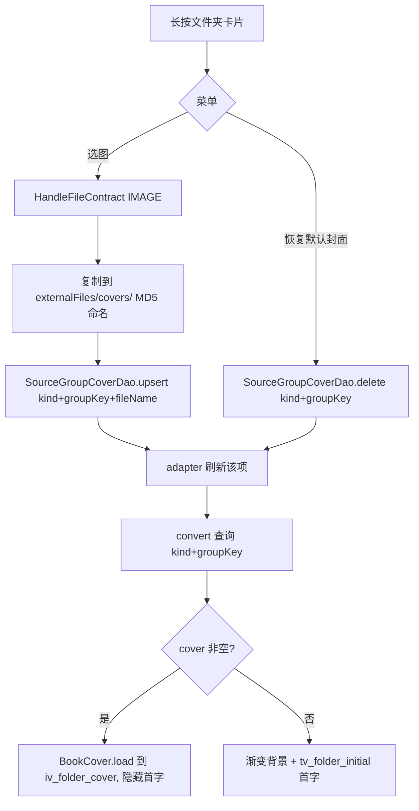
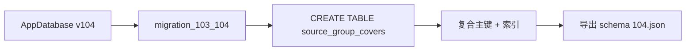

# 发现/订阅源文件夹封面替换 — 技术设计

> 状态：🔄 设计中 | 创建日期：2026-08-16

## Technical Approach

### 1. 实体与表结构

新增 `app/src/main/java/io/legado/app/data/entities/SourceGroupCover.kt`：

```kotlin
@Entity(
    tableName = "source_group_covers",
    primaryKeys = ["kind", "groupName"],
    indices = [Index(value = ["kind", "groupName"], unique = true)]
)
data class SourceGroupCover(
    @ColumnInfo(name = "kind") val kind: String,          // "book" | "rss"
    @ColumnInfo(name = "groupName") val groupName: String, // 真实分组名 或 特殊分组固定 key
    @ColumnInfo(name = "cover") val cover: String? = null,  // externalFiles/covers/ 下的文件名
)
```

`kind` 常量建议收敛在实体 companion 或统一常量处：`KIND_BOOK = "book"`、`KIND_RSS = "rss"`。

特殊分组固定 key（与本地化文本解耦）：

| 分组 | key |
|------|-----|
| 全部分组 | `all_groups` |
| 未分组 | `no_group` |
| 书源类型 folder | `type_text` / `type_audio` / `type_image` / `type_file` / `type_video` |
| RSS 类型 folder | `type_web` / `type_image` / `type_video` |

### 2. DAO

新增 `app/src/main/java/io/legado/app/data/dao/SourceGroupCoverDao.kt`：

```kotlin
@Dao
interface SourceGroupCoverDao {
    @Query("SELECT * FROM source_group_covers WHERE kind = :kind AND groupName = :groupName")
    suspend fun getSourceGroupCover(kind: String, groupName: String): SourceGroupCover?

    @Insert(onConflict = OnConflictStrategy.REPLACE)
    suspend fun upsert(cover: SourceGroupCover)

    @Query("DELETE FROM source_group_covers WHERE kind = :kind AND groupName = :groupName")
    suspend fun delete(kind: String, groupName: String)
}
```

`AppDatabase.kt` 增加 `sourceGroupCoverDao` 抽象方法，注册到 DB 实例。

### 3. 数据库迁移 v103→v104

`DatabaseMigrations.kt` 新增 `migration_103_104`，仿 `migration_102_103` 范式：

```kotlin
val migration_103_104 = object : Migration(103, 104) {
    override fun migrate(db: SupportSQLiteDatabase) {
        kotlin.runCatching {
            db.execSQL(
                """
                CREATE TABLE IF NOT EXISTS `source_group_covers` (
                    `kind` TEXT NOT NULL,
                    `groupName` TEXT NOT NULL,
                    `cover` TEXT,
                    PRIMARY KEY(`kind`, `groupName`)
                )
                """.trimIndent()
            )
            db.execSQL(
                "CREATE INDEX IF NOT EXISTS `index_source_group_covers_kind_groupName` " +
                    "ON `source_group_covers` (`kind`, `groupName`)"
            )
        }.onFailure { AppLog.put("创建 source_group_covers 表失败", it) }
    }
}
```

- 注册进 `DatabaseMigrations.kt:27` 的 migrations 数组（`migration_102_103` 之后）
- `AppDatabase.kt` version 103→104，注释块同步记录
- 编译导出新 schema `app/schemas/io.legado.app.data.AppDatabase/104.json`

### 4. Adapter 数据项改造

`SourceFolderAdapter.kt`：

```kotlin
data class FolderItem(
    val groupKey: String,     // 稳定表 key（真实分组名 或 特殊分组固定 key）
    val groupLabel: String,   // 本地化显示文本
    val isSpecial: Boolean,   // true=特殊分组（key 非用户分组名）
)

class SourceFolderAdapter(
    private val context: Context,
    private val kind: String,          // "book" | "rss"
    private val callBack: CallBack,
) : RecyclerAdapter<FolderItem, ItemSourceFolderGridBinding>(context, callBack) {
    // diffItemCallback: areItemsTheSame/areContentsTheSame 均按 groupKey 比较
    // convert:
    //   binding.tvFolderName.text = item.groupLabel
    //   if (!item.isSpecial) binding.tvFolderInitial.text = item.groupKey.firstCodePointAsString()
    //   查询 kind+groupKey 封面 → cover 非空 BookCover.load 到 iv_folder_cover，隐藏首字；为空恢复渐变+首字
}
```

特殊分组 key 与 label 的映射集中在一个函数：

```kotlin
fun specialFolderKey(resId: Int): String = when (resId) {
    R.string.all_groups -> "all_groups"
    R.string.no_group -> "no_group"
    R.string.type_text -> "type_text"
    // ...
}
```

### 5. 长按交互与封面文件

- convert 中 `binding.root.setOnLongClickListener` → 弹菜单（选图/恢复默认封面）
- 选图：`HandleFileContract`(IMAGE)，与书架 `GroupEditDialog` 一致的复制逻辑（复制到 `externalFiles/covers/`，MD5 命名）→ `sourceGroupCoverDao.upsert(SourceGroupCover(kind, groupKey, fileName))` → 通知 adapter 刷新该项
- 恢复默认封面：`sourceGroupCoverDao.delete(kind, groupKey)` → 刷新该项
- 封面加载：`BookCover.load(context, cover).into(binding.ivFolderCover)`（Glide）

### 6. 管理页固定平铺

- `BookSourceActivity.kt`：`isFolderViewMode` 强制 `false`（不再 `= AppConfig.sourceGroupStyle != 0`），`isShowingFolder` 恒 false，跳过 `upFolderView()`/`onFolderClick`
- `RssSourceActivity.kt`：同上
- `showConfigDialog(context, isBookSource, onConfigChanged, showGroupStyle = true)`：`showGroupStyle=false` 时隐藏 spGroupStyle 行
- 两管理页传 `showGroupStyle = false`

### 7. 发现页与订阅源主页

- `ExploreFragment.kt`：adapter 构造传 `kind = "book"`；`upFolderView()` 组装 `FolderItem`（特殊分组用固定 key + R.string label，真实分组 groupKey=groupLabel=分组名）；`onFolderClick(groupKey)` 筛选逻辑保持
- `RssFragment.kt`：adapter 构造传 `kind = "rss"`；同上

## Architecture Decisions

### AD-01: 独立分组封面表，含 kind 双命名空间
- **Context**: 发现页（书源分组）与订阅源页（RSS 分组）是两套独立分组命名空间，同名分组需各自封面；特殊分组也需支持换封面
- **Concern**: 如何持久化分组封面且两套分组互不干扰，同时支持特殊分组
- **Decision**: 新建 `source_group_covers` 表，`(kind, groupName)` 复合主键，kind 取 `"book"`/`"rss"`；特殊分组用固定英文 key 作 groupName
- **Goal**: 封面按命名空间隔离存储，切语言不丢封面，结构最轻
- **Tradeoff**: 需 DB v104 迁移；特殊分组 key 需集中维护映射
- **Status**: Proposed

### AD-02: Adapter 数据项 String → FolderItem(groupKey, groupLabel, isSpecial)
- **Context**: 原 adapter 数据项是 `List<String>`（分组显示文本），特殊分组显示文本是本地化 R.string
- **Concern**: 若直接以显示文本存表，切语言后表 key 漂移导致封面丢失；diffItemCallback 需稳定比较
- **Decision**: 数据项改为 `FolderItem`，`groupKey` 稳定（真实分组名/固定英文 key），`groupLabel` 本地化；diff 按 groupKey
- **Goal**: 封面 key 稳定、diff 正确、显示文本随语言
- **Tradeoff**: 4 处调用点需适配新类型
- **Status**: Proposed

### AD-03: 管理页固定平铺，隐藏分组样式配置
- **Context**: 用户要求书源/订阅源管理页「固定平铺，去掉文件夹」
- **Concern**: `sourceGroupStyle` 是全局配置，管理页不应再受其影响
- **Decision**: 两管理页 `isFolderViewMode` 强制 false；`showConfigDialog` 加 `showGroupStyle` 参数，管理页隐藏分组样式行；发现页/订阅源主页仍使用全局配置
- **Goal**: 管理页简单呈现全部源，配置语义保留给浏览页
- **Tradeoff**: 管理页滚动列表更长；需保证配置行隐藏不影响其余选项
- **Status**: Proposed

### AD-04: 封面文件复用书架存储约定（externalFiles/covers/ + MD5 命名）
- **Context**: 书架 `BookGroup.cover` 已用此约定存图
- **Concern**: 封面文件存哪、如何命名以避免冲突与残留
- **Decision**: 完全复用 `externalFiles/covers/` 目录 + MD5 命名复制逻辑，`cover` 字段存文件名
- **Goal**: 与书架行为一致，零新增文件管理逻辑
- **Tradeoff**: 与书架共用目录（文件名 MD5 命名天然避免冲突）；恢复默认封面时不删除孤儿文件（沿用书架现有行为，不做垃圾回收）
- **Status**: Proposed

## Data Flow





## File Changes

| 文件 | 变更类型 | 说明 |
|------|---------|------|
| `app/src/main/java/io/legado/app/data/entities/SourceGroupCover.kt` | 新增 | 实体（kind+groupName 复合主键+cover） |
| `app/src/main/java/io/legado/app/data/dao/SourceGroupCoverDao.kt` | 新增 | get/upsert/delete |
| `app/src/main/java/io/legado/app/data/AppDatabase.kt` | 修改 | version 104 + sourceGroupCoverDao 注册 + 版本注释 |
| `app/src/main/java/io/legado/app/data/DatabaseMigrations.kt` | 修改 | migration_103_104 + migrations 数组注册 |
| `app/schemas/io.legado.app.data.AppDatabase/104.json` | 新增 | 自动导出 |
| `app/src/main/java/io/legado/app/ui/adapter/SourceFolderAdapter.kt` | 修改 | FolderItem 数据项 + kind 参数 + 封面加载 + 长按菜单 |
| `app/src/main/java/io/legado/app/ui/main/explore/ExploreFragment.kt` | 修改 | kind="book" + FolderItem 组装 |
| `app/src/main/java/io/legado/app/ui/main/rss/RssFragment.kt` | 修改 | kind="rss" + FolderItem 组装 |
| `app/src/main/java/io/legado/app/ui/book/source/manage/BookSourceActivity.kt` | 修改 | 固定平铺 + showGroupStyle=false |
| `app/src/main/java/io/legado/app/ui/rss/source/manage/RssSourceActivity.kt` | 修改 | 固定平铺 + showGroupStyle=false |
| `app/src/main/assets/updateLog.md` | 修改 | 版本日志 |
| `docs/INDEX.md` | 修改 | 状态登记 |