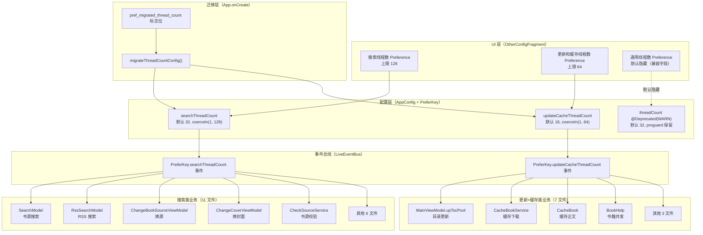
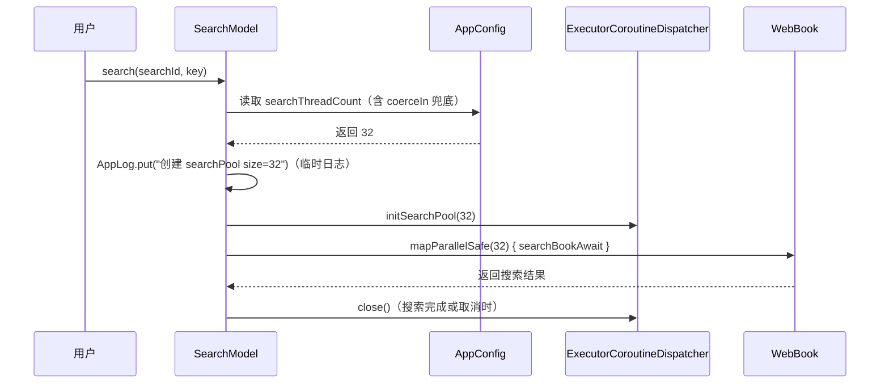
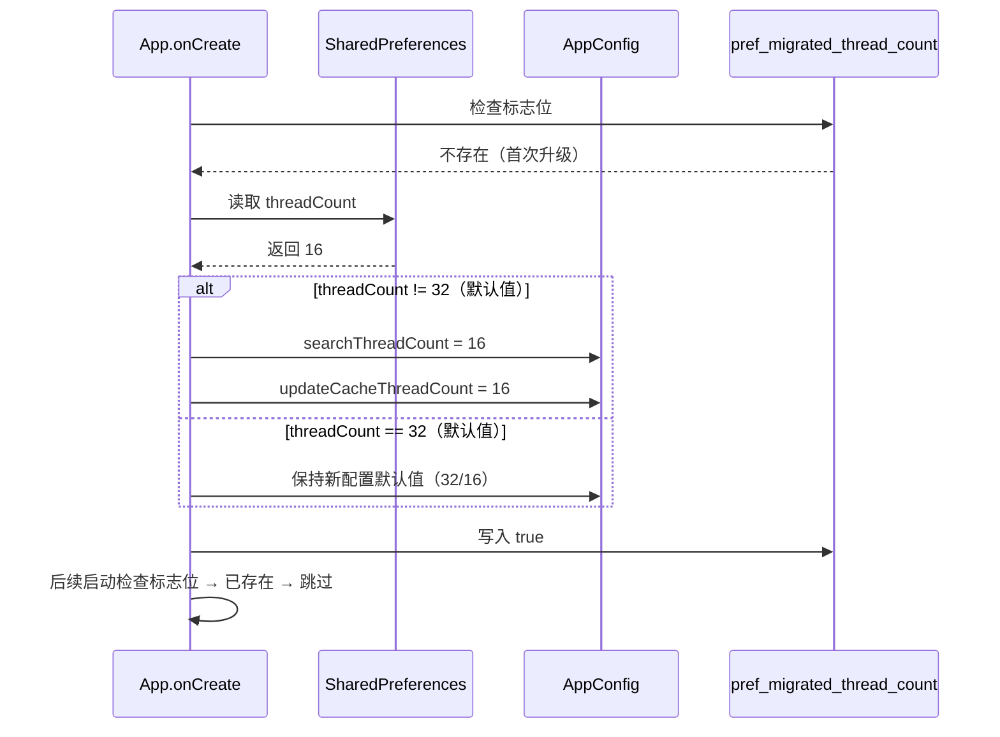

# 技术设计 - 书源线程池拆分与自定义配置

> 修订：v2（2026-07-26）按审查报告 P0+P1 修复方案更新

## Technical Approach（技术方案）

### 总体策略

采用"配置拆分 + 业务归类映射 + 事件总线通知 + 上限保护 + 标志位迁移"方案，在不改变现有协程架构（`Coroutine.async` 链式封装 + `ExecutorCoroutineDispatcher` 模式）的前提下，仅替换参数来源并新增 UI 配置入口，同时通过上限保护和标志位迁移提升健壮性。

### 架构层级



### 关键实现要点

1. **配置读写**：复用现有 `appCtx.getPrefInt` / `appCtx.putPrefInt` 机制；setter 中加 `coerceIn` 兜底
2. **业务点替换**：仅替换 `AppConfig.threadCount` 为 `AppConfig.searchThreadCount` 或 `AppConfig.updateCacheThreadCount`，不改变业务逻辑；MainViewModel 同文件双配置加注释说明
3. **事件通知**：复用 `postEvent(key, "")` 和 `observeEvent(key)` 模式；配置变更后 Toast 提示
4. **线程池重建**：搜索池在下次 `SearchModel.search` 调用时自动重建（已实现），更新池在 `MainViewModel` 收到事件后立即重建
5. **MAX_THREAD 上限处理**：保留合理上限（搜索 128 / 更新+缓存 64），在 NumberPickerDialog 和 setter 双重保护
6. **迁移机制**：独立标志位 `pref_migrated_thread_count` 判断，首次启动时一次性迁移
7. **兼容字段处理**：旧 `threadCount` 字段 @Deprecated(WARN) + proguard 保留 + UI 默认隐藏

## Architecture Decisions（架构决策 - ADR Y-Statement）

### AD-01: 配置拆分策略

- **Context**: 当前所有业务共用一个 `AppConfig.threadCount` 配置，用户希望针对搜索和更新+缓存两类业务独立调优
- **Concern**: 如何在拆分配置的同时保持向后兼容（老用户备份恢复、配置迁移）并避免用户误配置 OOM
- **Decision**: 新增 `searchThreadCount`（默认 32，setter coerceIn(1, 128)）和 `updateCacheThreadCount`（默认 16，setter coerceIn(1, 64)）两个独立配置项；保留旧 `threadCount` 字段并标记 `@Deprecated(level = WARNING)`，仍可读写用于备份兼容；proguard 保留字段防止混淆
- **Goal**: 既满足用户独立调优需求，又不破坏老用户备份恢复，还能防止误配置 OOM
- **Tradeoff**: 配置项从 1 个变为 3 个（含隐藏的兼容字段），增加少量认知负担；上限 128/64 可能限制极少数高性能手机用户
- **Status**: Proposed
- **Superseded-by**: 无

### AD-02: 业务归类策略

- **Context**: 30+ 处使用 `threadCount` 的业务点需要归类到搜索类或更新+缓存类
- **Concern**: 部分业务点的归类边界不清晰（如书源校验、JS 扩展、发现页探索、WebView 池容量）
- **Decision**: 按业务语义归类——
  - **搜索类**（11 文件）：书源/RSS 搜索、换源、换封面、漫画搜索、阅读页搜索、书架搜索、发现页探索、书源/RSS 源校验、JS 扩展并发
  - **更新+缓存类**（7 文件）：目录更新、缓存下载、缓存正文、书籍并发、章节列表采集、正文内容采集、WebView 池容量
- **Goal**: 归类清晰、用户可预期，搜索类业务共用一个配置，更新+缓存类业务共用另一个配置
- **Tradeoff**: 部分边界业务（如校验、JS 扩展、发现页探索）的归类可能不符合所有用户预期，但统一归类比让用户为每个业务点单独配置更简洁
- **Status**: Proposed
- **Superseded-by**: 无

**补充说明**：
- **发现页探索归类依据**：MainViewModel.kt L150 `onEachParallel(threadCount)` 用于发现页探索（explore），与搜索共用 `WebBook.exploreBookAwait` 接口，且都是用户主动触发的并发请求场景，归搜索类合理
- **MainViewModel 同文件双配置**：L52-92（upTocPool）用 updateCacheThreadCount，L150（发现页探索）用 searchThreadCount，需在代码中添加注释说明归类依据

### AD-03: 书源/RSS 源校验业务归类

- **Context**: `CheckSourceService.kt` 和 `CheckRssSourceService.kt` 当前使用 `min(threadCount, MAX_THREAD)` 创建独立线程池
- **Concern**: 校验本质是测试书源的搜索/列表能力，应归搜索类；但校验也是后台批量任务，与更新场景类似
- **Decision**: 归搜索类，使用 `searchThreadCount`
- **Goal**: 校验任务与书源搜索共用配置，符合"测试搜索能力"的语义
- **Tradeoff**: 用户调整搜索线程数时会同时影响校验速度，可能在校验大量书源时占用搜索资源
- **Status**: Proposed
- **Superseded-by**: 无

### AD-04: JS 扩展并发归类

- **Context**: `JsExtensions.kt` L129/L148 使用 `mapAsync(AppConfig.threadCount)` 并发请求 URL（用于书源 JS 中批量 ajax 请求）
- **Concern**: JS 扩展既可能在搜索场景使用，也可能在更新/缓存场景使用
- **Decision**: 归搜索类，使用 `searchThreadCount`
- **Goal**: JS 扩展主要在书源规则解析时使用，与搜索场景关联更紧密
- **Tradeoff**: 在更新/缓存场景下的 JS 批量请求受搜索线程数限制，可能不是最优配置
- **Status**: Proposed
- **Superseded-by**: 无

### AD-05: WebView 池容量计算

- **Context**: `WebViewPool.kt` L44 使用 `max(AppConfig.threadCount / 10, 5)` 计算 WebView 缓存池容量
- **Concern**: WebView 主要用于书源正文/详情页加载（更新+缓存场景），但也用于搜索场景的 JS 渲染
- **Decision**: 改为 `max(AppConfig.updateCacheThreadCount / 10, 5)`，归更新+缓存类
- **Goal**: WebView 池容量与正文下载并发数匹配，避免池子过小导致频繁创建销毁
- **Tradeoff**: 搜索场景下 JS 渲染可能因 WebView 池容量不足而排队，但搜索场景较少使用 WebView
- **Status**: Proposed
- **Superseded-by**: 无

### AD-06: 配置变更监听机制

- **Context**: 用户在 UI 修改配置后，业务层需要感知并重建线程池
- **Concern**: 搜索池和更新池的重建时机不同（搜索池在下一次搜索时重建即可，更新池需立即重建以避免使用旧配置）
- **Decision**: 复用 LiveEventBus 事件机制——
  - `OtherConfigFragment.onSharedPreferenceChanged` 中 `postEvent(PreferKey.searchThreadCount, "")` 和 `postEvent(PreferKey.updateCacheThreadCount, "")`
  - 配置变更后 Toast 提示（搜索类"将在下次搜索时生效"，更新+缓存类"已立即生效"）
  - `MainActivity.kt` 中 `observeEvent(PreferKey.searchThreadCount)` → 仅记录日志（SearchModel 下次搜索自动重建）
  - `MainActivity.kt` 中 `observeEvent(PreferKey.updateCacheThreadCount)` → 调用 `MainViewModel.onUpdateCacheThreadCountChanged()` 重建 upTocPool
- **Goal**: 与现有 `threadCount` 事件机制保持一致，降低改动复杂度；Toast 提升用户感知
- **Tradeoff**: 搜索池不会立即重建（需等下次搜索），但符合既有 SearchModel.close + initSearchPool 模式
- **Status**: Proposed
- **Superseded-by**: 无

**时序竞态说明**：配置变更后正在执行的业务不受影响（继续使用旧池），下次业务启动时使用新配置——这是现有 SearchModel 的行为，本次改造保持一致，不引入额外同步机制。

### AD-07: 兼容性与老用户迁移策略（标志位机制）

- **Context**: 老用户已配置 `threadCount`，升级后新配置为默认值，需迁移
- **Concern**: 如何判断"是否需要迁移"，避免误触发或漏触发；用户可能曾改过 threadCount 又改回 32
- **Decision**: 使用独立的迁移标志位 `pref_migrated_thread_count`（boolean）作为唯一判断条件——
  - 首次启动时若标志位不存在（即首次升级到新版本），无论 `threadCount` 是何值，都将其同时赋给 `searchThreadCount` 和 `updateCacheThreadCount`
  - 迁移完成后写入 `pref_migrated_thread_count = true` 避免重复执行
  - 若 `threadCount` 仍为默认值 32（即用户从未修改过），迁移后两个新配置也保持默认值（32/16），不强制覆盖
- **Goal**: 老用户升级后两个新配置自动继承旧配置值，无需手动调整；标志位机制健壮可重复执行安全
- **Tradeoff**: 新用户首次安装时也会触发一次"空迁移"（threadCount=32 默认值 → 不覆盖新配置默认值），但写入标志位后不再触发，影响可忽略
- **Status**: Proposed
- **Superseded-by**: 无

### AD-08: 上限保护策略

- **Context**: AD-08 原方案"统一去掉 MAX_THREAD 上限"存在 OOM 风险（999 线程 ≈ 1GB 栈空间）
- **Concern**: 既要满足 SearchModel 既有反馈"完全尊重用户配置"，又要防止误配置 OOM
- **Decision**: 保留合理上限——
  - 搜索类上限 128（远超现有反馈中的 32 配置）
  - 更新+缓存类上限 64（缓存场景并发需求较低）
  - NumberPickerDialog 最大值限制（用户层面）
  - AppConfig setter 加 `coerceIn(1, 上限)` 兜底（代码层面，防止 ADB 等方式直接写 SharedPreferences）
- **Goal**: 既满足"配多少用多少"的语义（128/64 已远超用户实际需求），又防 OOM 崩溃
- **Tradeoff**: 极少数高性能手机用户可能需要更高值，可在未来版本中调整上限或提供"高级模式"开关
- **Status**: Proposed
- **Superseded-by**: 无

### AD-09: 兼容字段 UI 处理策略

- **Context**: 旧 `threadCount` 字段保留用于备份兼容，但 UI 中显示会让用户困惑
- **Concern**: 如何在 UI 中处理兼容字段，既不影响备份恢复，又不让用户误操作
- **Decision**: 兼容字段在 UI 中**默认隐藏**（`app:isPreferenceVisible="false"`）——
  - `pref_config_other.xml` 中保留 Preference 定义（用于备份恢复时识别 key）
  - 设置 `app:isPreferenceVisible="false"` 默认隐藏
  - 仅老用户迁移后首次进入"其他设置"页时可临时显示一次（Toast 提示后保持隐藏）
- **Goal**: UI 简洁（只显示两个新配置项），同时保留兼容字段的备份恢复能力
- **Tradeoff**: 老用户无法在 UI 中直接看到/修改兼容字段值，但可通过备份恢复间接管理
- **Status**: Proposed
- **Superseded-by**: 无

### AD-10: @Deprecated level 选择

- **Context**: 旧 `threadCount` 字段需要标记 @Deprecated 提醒开发者不要误用
- **Concern**: Kotlin @Deprecated 的 level 参数有 WARNING/ERROR/HIDDEN 三种，ERROR 会阻断编译，HIDDEN 会导致反射找不到
- **Decision**: 使用 `@Deprecated("Use searchThreadCount or updateCacheThreadCount instead", level = DeprecationLevel.WARNING)`——
  - WARNING 级别只产生编译警告不阻断编译
  - 字段仍可在源码和反射中访问（备份恢复需要）
  - 同时在 `proguard-rules.pro` 中保留 `threadCount` 字段防止 R8 混淆
- **Goal**: 提醒开发者优先使用新字段，同时保证备份恢复和向后兼容
- **Tradeoff**: WARNING 级别提醒力度较弱，可能被开发者忽略；通过代码审查和文档说明补充
- **Status**: Proposed
- **Superseded-by**: 无

### AD-11: BackupConfig 独立 ignore 字段

- **Context**: 现有 `BackupConfig.ignoreThreadCount` 用于控制备份时是否包含 threadCount
- **Concern**: 拆分后是否沿用单一 `ignoreThreadCount` 控制三个字段，还是新增两个独立 ignore 字段
- **Decision**: 新增两个独立 ignore 字段——
  - `ignoreSearchThreadCount: Boolean`
  - `ignoreUpdateCacheThreadCount: Boolean`
  - 保留 `ignoreThreadCount` 控制兼容字段
  - 三个字段解耦，用户备份时可分别选择是否包含
- **Goal**: 提供更细粒度的备份控制，符合"两个独立配置"的设计语义
- **Tradeoff**: BackupConfig 数据结构稍复杂，但提升灵活性
- **Status**: Proposed
- **Superseded-by**: 无

## Data Flow（数据流）

### 配置写入流程

```mermaid
sequenceDiagram
    participant User as 用户
    participant Fragment as OtherConfigFragment
    dialog as NumberPickerDialog
    participant Config as AppConfig
    participant SP as SharedPreferences
    participant LEB as LiveEventBus
    participant VM as MainViewModel
    participant Pool as ExecutorCoroutineDispatcher

    User->>Fragment: 点击配置项
    Fragment->>dialog: show NumberPickerDialog(1-128)
    dialog->>User: 显示当前值
    User->>dialog: 调整为新值并确认
    dialog->>Config: setter 写入（含 coerceIn 兜底）
    Config->>SP: putPrefInt
    SP-->>Fragment: onSharedPreferenceChanged
    Fragment->>Fragment: upPreferenceSummary + Toast 提示
    Fragment->>LEB: postEvent(key, "")
    LEB->>VM: observeEvent 回调
    VM->>Pool: 重建 upTocPool（仅更新+缓存类）
```

### 业务调用流程（以搜索为例）



### 老用户迁移流程



## File Changes（文件变更）

### 新增配置项

| 文件 | 变更类型 | 变更内容 |
|------|----------|----------|
| `app/src/main/java/io/legado/app/constant/PreferKey.kt` | 新增 | 新增 `searchThreadCount` 和 `updateCacheThreadCount` 两个 const val；新增 `migratedThreadCount` 标志位 key |
| `app/src/main/java/io/legado/app/help/config/AppConfig.kt` | 新增+修改 | 新增两个 var 属性（含 coerceIn setter）；旧 `threadCount` 添加 `@Deprecated(level = WARNING)` 注解 |
| `app/src/main/java/io/legado/app/help/storage/BackupConfig.kt` | 修改 | 备份项列表新增两个 key；新增 `ignoreSearchThreadCount` 和 `ignoreUpdateCacheThreadCount` 独立 ignore 字段 |
| `app/proguard-rules.pro` | 修改 | 新增 `-keep` 规则保留 `threadCount` 字段防止 R8 混淆 |

### UI 层

| 文件 | 变更类型 | 变更内容 |
|------|----------|----------|
| `app/src/main/res/xml/pref_config_other.xml` | 修改 | 新增两个 Preference 项；旧 threadCount Preference 添加 `app:isPreferenceVisible="false"` 默认隐藏 |
| `app/src/main/res/values/strings.xml` | 新增+修改 | 新增两个配置项的标题/summary 模板字符串（summary 包含影响范围说明） |
| `app/src/main/java/io/legado/app/ui/config/OtherConfigFragment.kt` | 修改 | `onCreatePreferences` / `onPreferenceTreeClick`（NumberPickerDialog 上限 128/64）/ `onSharedPreferenceChanged`（含 Toast 提示）/ `upPreferenceSummary` 四处新增分支；老用户迁移后首次进入 Toast 提示 |

### 搜索类业务替换（11 文件）

| 文件 | 行号 | 变更内容 |
|------|------|----------|
| `app/src/main/java/io/legado/app/model/webBook/SearchModel.kt` | L33, L59, L99 | `AppConfig.threadCount` → `AppConfig.searchThreadCount`；initSearchPool 添加 `AppLog.put("创建 searchPool size=$size")` 临时日志（验证后清理） |
| `app/src/main/java/io/legado/app/model/rss/RssSearchModel.kt` | L52, L108, L149, L158 | 同上 |
| `app/src/main/java/io/legado/app/ui/book/changesource/ChangeBookSourceViewModel.kt` | L62, L168, L237, L386 | 同上 + 去掉 `min(threadCount, MAX_THREAD)` |
| `app/src/main/java/io/legado/app/ui/book/changecover/ChangeCoverViewModel.kt` | L40, L102, L159 | 同上 + 去掉 `min(threadCount, MAX_THREAD)` |
| `app/src/main/java/io/legado/app/ui/book/manga/ReadMangaViewModel.kt` | L173 | 同上 |
| `app/src/main/java/io/legado/app/ui/book/read/ReadBookViewModel.kt` | L322 | 同上 |
| `app/src/main/java/io/legado/app/ui/main/bookshelf/BookshelfViewModel.kt` | L181 | 同上 |
| `app/src/main/java/io/legado/app/ui/main/MainViewModel.kt` | L150 | 同上（发现页探索，添加注释"归搜索类，与 WebBook.exploreBookAwait 关联"） |
| `app/src/main/java/io/legado/app/service/CheckSourceService.kt` | L62, L64, L126 | 同上 + 去掉 `min(threadCount, MAX_THREAD)` |
| `app/src/main/java/io/legado/app/service/CheckRssSourceService.kt` | L62, L64, L126 | 同上 + 去掉 `min(threadCount, MAX_THREAD)` |
| `app/src/main/java/io/legado/app/help/JsExtensions.kt` | L129, L148 | 同上 |

### 更新+缓存类业务替换（7 文件）

| 文件 | 行号 | 变更内容 |
|------|------|----------|
| `app/src/main/java/io/legado/app/ui/main/MainViewModel.kt` | L52, L53, L82, L86, L92 | `AppConfig.threadCount` → `AppConfig.updateCacheThreadCount` + 去掉 `min(threadCount, MAX_THREAD)`；添加注释"upTocPool 归更新+缓存类" |
| `app/src/main/java/io/legado/app/service/CacheBookService.kt` | L44, L46 | 同上 + 去掉 `min(threadCount, MAX_THREAD)`；initSearchPool 添加 `AppLog.put("创建 cachePool size=$size")` 临时日志 |
| `app/src/main/java/io/legado/app/model/CacheBook.kt` | L148 | 同上 |
| `app/src/main/java/io/legado/app/help/book/BookHelp.kt` | L216 | 同上 |
| `app/src/main/java/io/legado/app/model/webBook/BookChapterList.kt` | L103 | 同上 |
| `app/src/main/java/io/legado/app/model/webBook/BookContent.kt` | L109 | 同上 |
| `app/src/main/java/io/legado/app/help/webView/WebViewPool.kt` | L44 | `max(AppConfig.threadCount / 10, 5)` → `max(AppConfig.updateCacheThreadCount / 10, 5)` |

### 事件监听层

| 文件 | 变更类型 | 变更内容 |
|------|----------|----------|
| `app/src/main/java/io/legado/app/ui/main/MainActivity.kt` | 修改 | 新增 `observeEvent(searchThreadCount)` 和 `observeEvent(updateCacheThreadCount)` 监听 |
| `app/src/main/java/io/legado/app/ui/main/MainViewModel.kt` | 修改 | 新增 `onSearchThreadCountChanged()` 和 `onUpdateCacheThreadCountChanged()` 方法 |

### 老用户迁移

| 文件 | 变更类型 | 变更内容 |
|------|----------|----------|
| `app/src/main/java/io/legado/app/App.kt`（或首次访问入口） | 修改 | 新增 `migrateThreadCountConfig()` 一次性迁移逻辑（标志位判断） |

### 单元测试（新增）

| 文件 | 变更类型 | 变更内容 |
|------|----------|----------|
| `app/src/test/java/io/legado/app/help/config/MigrateThreadCountConfigTest.kt` | 新增 | 迁移逻辑单元测试（未迁移/已迁移/部分迁移/异常容错） |
| `app/src/test/java/io/legado/app/help/config/AppConfigThreadCountTest.kt` | 新增 | 配置读写单元测试（含 coerceIn 边界） |
| `app/src/test/java/io/legado/app/help/storage/BackupConfigThreadCountTest.kt` | 新增 | 备份恢复单元测试（三个字段） |

### E2E 测试脚本（新增）

| 文件 | 变更类型 | 变更内容 |
|------|----------|----------|
| `ai_tests/scripts/verify_thread_pool_split.py` | 新增 | UI 验证 + 配置变更 + 真机日志验证 |

### 文档同步

| 文件 | 变更内容 |
|------|----------|
| `docs/project-flow/architecture/overview.md` | 线程池章节同步更新 |
| `docs/project-flow/quick-reference.md` | 配置项速查表新增两个 key |
| `assets/updateLog.md` | 基于 git diff 添加更新日志 |

## 风险与缓解

### 风险 1: 业务点遗漏

- **风险**：30+ 处使用点可能遗漏替换
- **缓解**：通过 `Grep "AppConfig.threadCount"` 和 `Grep "PreferKey.threadCount"` 全局搜索确认所有使用点已替换（除兼容字段本身）；同时检查 `app/src/test/` 和 `app/src/androidTest/` 测试代码

### 风险 2: 配置迁移误触发或漏触发

- **风险**：迁移条件不健壮导致误触发或漏触发
- **缓解**：使用独立标志位 `pref_migrated_thread_count` 作为唯一判断条件；首次启动时若标志位不存在则迁移；备份恢复后清除标志位重新触发迁移

### 风险 3: 线程池泄漏

- **风险**：搜索池和更新池重建时若旧池未正确 close 可能导致线程泄漏
- **缓解**：复用现有 `SearchModel.close` 和 `MainViewModel.onThreadCountChanged` 的 close 逻辑，确保旧池先 close 再创建新池

### 风险 4: 备份兼容性破坏

- **风险**：旧版本备份文件只有 `threadCount`，恢复到新版本时新配置为默认值
- **缓解**：恢复后清除 `pref_migrated_thread_count` 标志位，触发一次性迁移（同老用户升级流程），将旧 `threadCount` 值赋给两个新配置

### 风险 5: 时序竞态

- **风险**：配置变更后正在执行的业务可能读到旧值或新值
- **缓解**：保持现有 SearchModel 行为（业务启动时读取配置），不引入额外同步机制；在 design.md 中明确说明"配置变更后正在执行的业务不受影响"

### 风险 6: @Deprecated 编译警告污染

- **风险**：`@Deprecated(level = WARNING)` 会在每次编译时产生警告，可能掩盖其他重要警告
- **缓解**：仅在旧 `threadCount` 字段上加注解，新代码不引用旧字段；通过 `@Suppress("DEPRECATION")` 在必须引用旧字段的位置（如备份恢复）抑制警告
