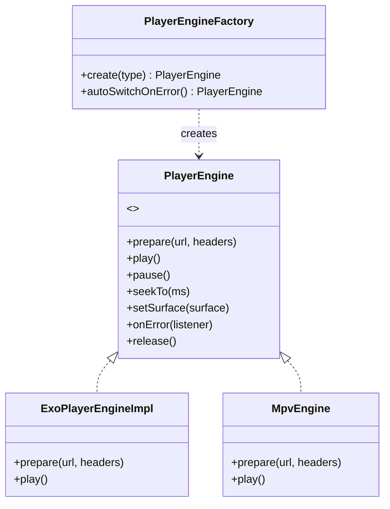
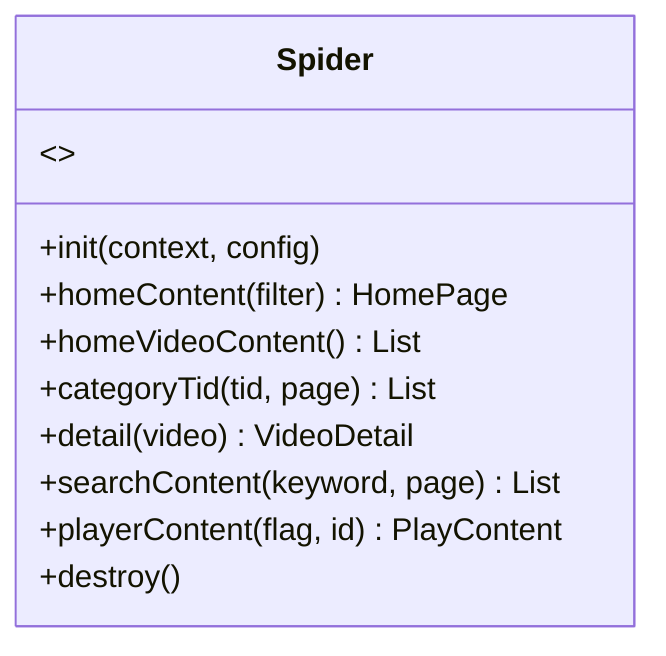
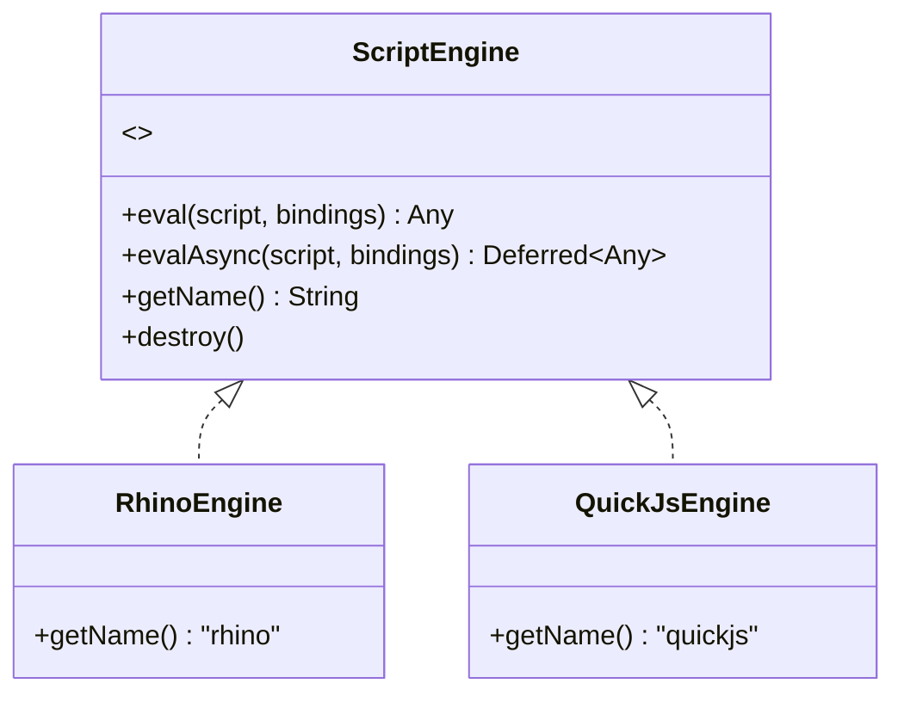
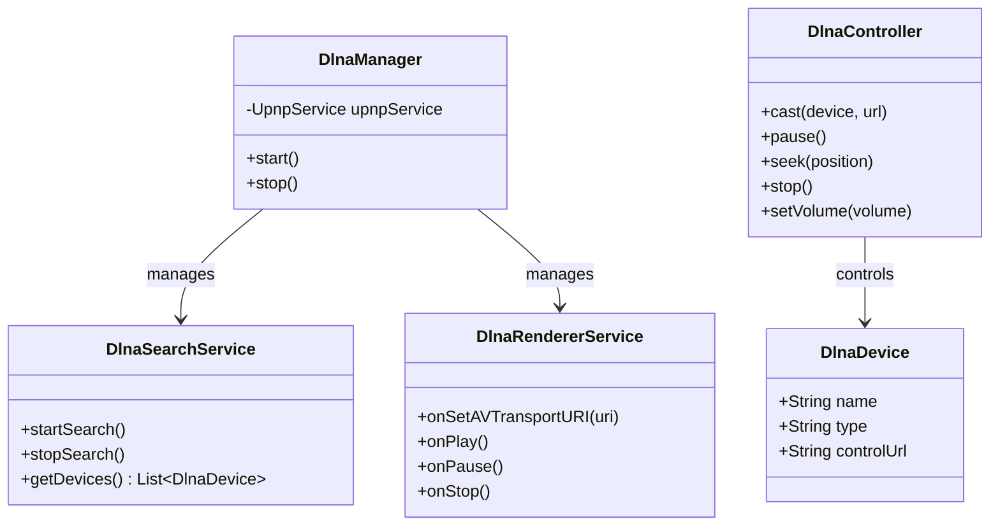
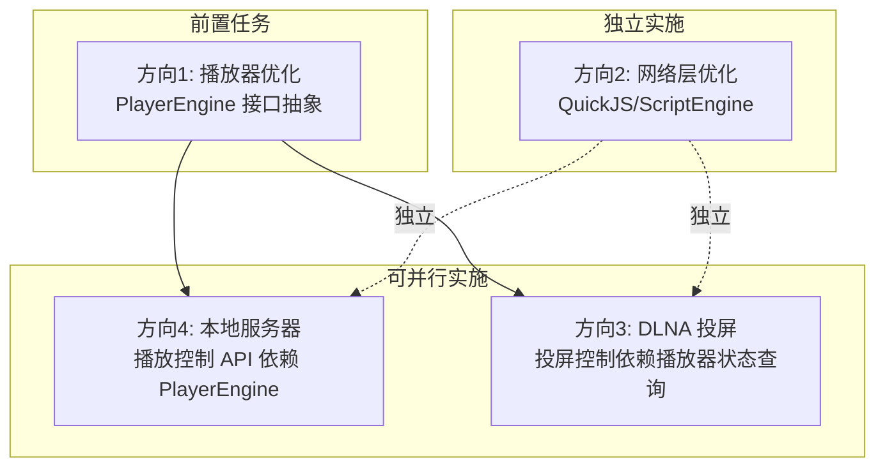
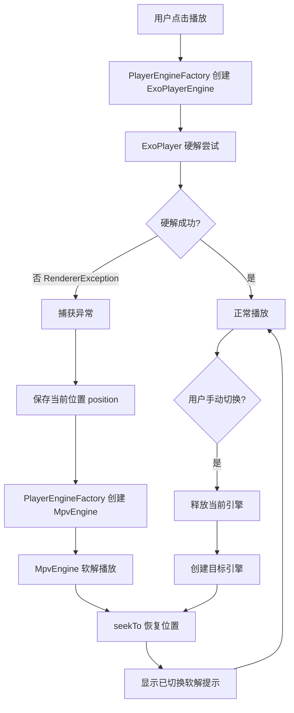
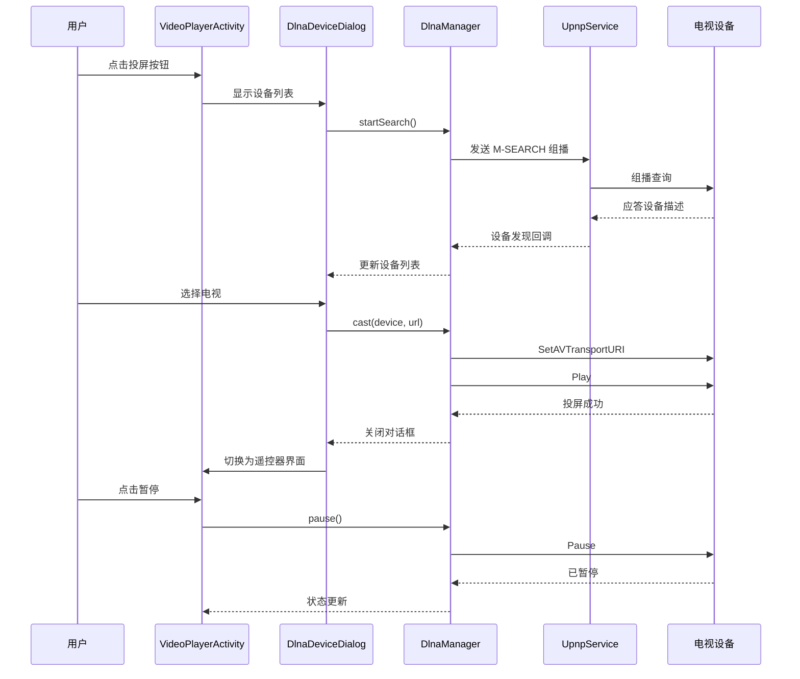
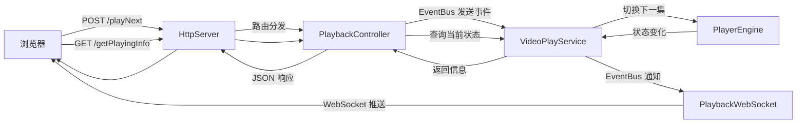
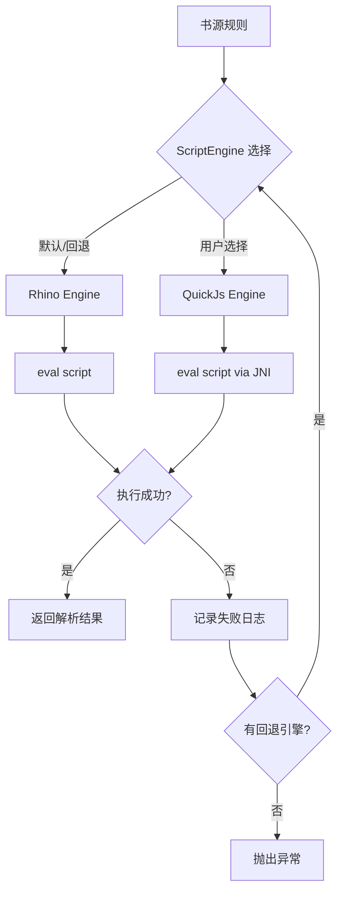

# Design：TVBox 优化方案技术设计

> **状态**：🔄 设计中
> **创建日期**：2026-07-22

## Technical Approach（技术方案）

### 方向 1：播放器优化

#### 1.1 双引擎架构（ExoPlayer + MPV）

**设计**：借鉴影视仓 `PlayerEngine` 接口 + `PlayerEngineFactory` 工厂模式。



**关键接口**：
- `prepare(url, headers)`：准备播放
- `play()` / `pause()` / `seekTo(ms)`：播放控制
- `setSurface(surface)`：设置渲染 surface
- `onError(listener)`：错误回调（触发引擎切换）
- `release()`：释放资源

**引擎切换策略**：
1. 默认 ExoPlayer 硬解
2. `RendererException` 或 `ExoPlaybackException` 触发自动切换
3. 切换前保存当前位置，切换后 seekTo 恢复
4. 用户可在设置中锁定引擎模式

**MPV 集成方式**：
- 使用 `libmpv.so`（armeabi-v7a + arm64-v8a），来源见下方"MPV so 库来源"说明
- 通过 JNI 调用 mpv API（参考影视仓 `MpvEngine` 实现）
- AppConfig 开关控制：`AppConfig.isMpvEnabled` 控制是否加载 MPV 引擎，默认关闭

#### 1.2 弹幕设置系统补全

**现状**：legado 有 `DanmakuAdapter` + `BiliDanmukuParser`，但缺少设置系统。

**新增 `DanmakuSetting`（参考影视仓）**：
- 透明度（0.0-1.0）
- 字号缩放（0.5-2.0）
- 滚动速度（倍数）
- 显示区域（屏幕高度比例 0.5-1.0）
- 屏蔽规则（关键字/正则/用户ID）
- 同步显示数量上限

**存储**：复用 `AppConfig`，通过 `SP` 键值对持久化。

#### 1.3 字幕轨道管理（新建）

**新增 `Track` 数据类**：
- `type`：AUDIO / SUBTITLE / VIDEO
- `index`：轨道索引
- `label`：显示名称（如「中文音轨」「英文字幕」）
- `language`：语言代码

**新增 `TrackUtil`**：
- `getTracks(player)`：获取所有轨道
- `selectTrack(player, track)`：选择轨道
- `getCurrentTrack(player)`：获取当前轨道

**UI 集成**：在 `VideoSettingsPanel` 新增「音轨」「字幕」选择项。

#### 1.4 嗅探增强

**现状**：`VideoUrlExtractor.kt` 基础嗅探。

**增强点（参考影视仓 `Sniffer`）**：
- iframe 嵌套递归嗅探
- 加密 URL 识别（base64/JS 加密）
- 视频 MIME 类型白名单扩展
- 嗅探超时配置（默认 10s）
- 嗅探结果去重（同 URL 不同质量保留最优）

#### 1.5 预加载策略

**新增 `PreloadSetting`（参考影视仓）**：
- `enablePreloadNext`：预加载下一集（默认 true）
- `preloadBufferMs`：预加载缓冲时长（默认 15000ms）
- `maxPreloadCount`：最大预加载数（默认 1）
- `preloadOnWifiOnly`：仅 WiFi 预加载（默认 true）

**实现**：在 `VideoPlayService` 切集逻辑中，提前调用 `ExoPlayerHelper` 预加载下一集 MediaItem。

---

### 方向 2：网络层优化

#### 2.1 Spider 接口抽象

**借鉴影视仓 catvod `Spider` 接口**（仅作设计参考，不直接复用）：



**legado 适配**：legado 的规则是声明式（CSS/XPath/JSONPath/正则/JS），与 catvod 命令式 Spider 不同。借鉴点在于「引擎抽象」而非完整接口。

**实际方案**：定义 `ScriptEngine` 接口（而非 Spider），统一脚本执行入口：



#### 2.2 QuickJS 引擎引入

**库选择**：`com.github.taoweiji.quickjs:quickjs-android`（轻量，~2MB）

**实现 `QuickJsEngine : ScriptEngine`**：
- 通过 JNI 调用 QuickJS C 引擎
- 支持 ES2017 语法（Rhino 仅 ES5.1）
- 性能：比 Rhino 快 3-10 倍（JIT）

**兼容性处理**：
- QuickJS 无 Java 互操作（Rhino 有），需通过 JSON 序列化传递对象
- 部分 Rhino 专有 API（如 `JavaAdapter`）不支持，需规则适配
- 自动回退：QuickJS 执行失败时记录日志，回退 Rhino

---

### 方向 3：DLNA 投屏

#### 3.1 库选择

**选用 jupnp**（`org.jupnp:jupnp`，~3MB，纯 Java 实现）：
- 支持 DLNA 1.0/1.1
- 主动声明兼容 Android
- 影视仓同款库，可参考实现

#### 3.2 DMC（控制器）实现

**新增 `dlna/` 模块**：



**模块职责**：
- `DlnaManager`（单例）：管理 jupnp `UpnpService` 生命周期
- `DlnaDevice`：封装 DLNA 设备信息（名称/类型/控制URL）
- `DlnaController`：投屏控制（play/pause/seek/stop/setVolume）
- `DlnaSearchService`：设备搜索（异步扫描局域网）

**关键流程**：
1. 启动 `UpnpService`，注册 `RegistryListener`
2. 发送 `M-SEARCH` 组播，等待设备应答
3. 设备发现后解析服务描述（XML）
4. 投屏：调用 `AVTransport` 服务的 `SetAVTransportURI` + `Play`
5. 控制：调用 `AVTransport` 服务的对应 action

#### 3.3 DMR（渲染器）实现

**新增 `DlnaRendererService`**：
- 注册 legado 为 DLNA 渲染设备
- 接收 `SetAVTransportURI` 后启动 `VideoPlayService`
- 接收 `Play/Pause/Stop` 后转发到播放器
- 上报当前状态（位置/时长/状态）到订阅者

#### 3.4 UI 集成

**新增 `DlnaDeviceDialog`**：
- 设备列表（RecyclerView）
- 搜索中状态
- 投屏后变为「控制面板」（播放/暂停/进度条/音量/停止）

**集成点**：`VideoPlayerActivity` 顶部菜单新增「投屏」按钮。

---

### 方向 4：本地服务器

#### 4.1 API 扩展设计

**新增 API（在 `HttpServer.serve` 中路由）**：

| Method | Path | 功能 |
|--------|------|------|
| POST | `/play` | 播放指定视频 |
| POST | `/pause` | 暂停 |
| POST | `/resume` | 恢复播放 |
| POST | `/seek` | 跳转进度（参数：position） |
| POST | `/setVolume` | 设置音量（参数：volume） |
| POST | `/playNext` | 下一集 |
| POST | `/playPrev` | 上一集 |
| GET | `/getPlayingInfo` | 获取当前播放信息 |
| GET | `/getQueue` | 获取播放队列 |
| GET | `/search` | 远程搜索（参数：keyword） |

**新增 Controller**：`PlaybackController.kt`（在 `api/controller/` 下），通过 EventBus 与 `VideoPlayService` 通信。

#### 4.2 WebSocket 状态推送

**新增 `PlaybackWebSocket`（在 `web/socket/` 下）**：
- 客户端连接后订阅播放状态
- 状态变化时推送 JSON：`{type, position, duration, state, title}`
- 心跳保活（30 秒 ping）

**集成到 `HttpServer`**：NanoHTTPD 支持 WebSocket，重写 `openWebSocket` 方法。

---

## Architecture Decisions（架构决策）

> 使用 ADR Y-Statement 模板：Context · Concern · Decision · Goal · Tradeoff · Status · Superseded-by

### ADR-1：双引擎架构（ExoPlayer + MPV）

**Context（上下文）**：legado 当前仅有 ExoPlayer 单引擎，遇到硬解失败的视频无法播放。影视仓采用 ExoPlayer + MPV 双引擎，硬解失败可降级软解。需决定 legado 是否引入 MPV。

**Concern（关注点）**：硬解失败场景下用户无法播放视频，体验受损；同时需控制 APK 体积增量与维护成本，避免引入新引擎后稳定性下降。

**Decision（决策）**：引入 MPV 软解引擎作为 ExoPlayer 兜底，通过 `PlayerEngine` 接口抽象，工厂模式创建实例。MPV so 库通过 AppConfig 开关控制启用，基础包默认不加载 MPV so 库。

**Goal（目标）**：硬解失败的视频可自动切换软解播放，用户无感知；引擎切换在 1 秒内完成并恢复播放位置。

**Tradeoff（权衡）**：
- 得：硬解失败的视频可播放，用户体验提升；接口抽象便于未来扩展其他引擎
- 失：APK 体积 +8MB（MPV so 库）；维护成本上升（双引擎 Bug 排查）；JNI 增加崩溃风险
- 风险：MPV so 库兼容性需大量真机测试；引擎切换时机判断不当会导致频繁切换

**Status（状态）**：Proposed（已提案，待实施验证）

**Superseded-by（被替代）**：无

### ADR-2：QuickJS 作为 Rhino 补充（非替换）

**Context（上下文）**：legado 现有 Rhino JS 引擎性能较差（ES5.1 + 无 JIT），部分复杂规则解析慢。影视仓支持 QuickJS。需决定是否替换 Rhino。

**Concern（关注点）**：直接替换 Rhino 会破坏现有书源规则兼容性（Rhino 专有 API、Java 互操作），但仅用 Rhino 又无法满足复杂规则性能需求；需在兼容性与性能之间取得平衡。

**Decision（决策）**：引入 QuickJS 作为 Rhino 的**补充**而非替换。定义 `ScriptEngine` 接口统一调用，用户可选择引擎，QuickJS 失败自动回退 Rhino。QuickJS 通过 AppConfig 开关控制启用，默认关闭。

**Goal（目标）**：复杂规则解析速度提升 3-10 倍；ES2017 语法支持；现有 Rhino 规则完全不受影响；不兼容时自动回退 Rhino。

**Tradeoff（权衡）**：
- 得：复杂规则解析速度提升 3-10 倍；ES2017 语法支持；向后兼容（Rhino 规则不受影响）
- 失：APK 体积 +2MB；两套引擎 API 差异需适配层；部分 Rhino 专有 API 在 QuickJS 不可用
- 风险：规则兼容性需逐源测试；QuickJS JNI 崩溃需捕获

**Status（状态）**：Proposed（已提案，待实施验证）

**Superseded-by（被替代）**：无

### ADR-3：选用 jupnp 实现 DLNA

**Context（上下文）**：legado 完全没有 DLNA 能力，需新建。市场有 cling（停更）、jupnp（cling fork，活跃）、CiaranDoherty/DLNA 等选项。

**Concern（关注点）**：DLNA 协议复杂且设备兼容性差异大；DMR（渲染器）角色需常驻服务监听投屏请求，会增加电量消耗；需在功能完整性与功耗之间取得平衡。

**Decision（决策）**：选用 jupnp（`org.jupnp:jupnp`），实现 DMC + DMR 双角色。DMC 优先（投屏控制），DMR 次要（接收投屏）。DMR 通过 AppConfig 开关控制启用，默认关闭。

**Goal（目标）**：可搜索到局域网 DLNA 设备并投屏控制；DMR 角色可接收外部投屏；投屏控制响应延迟 ≤ 500ms。

**Tradeoff（权衡）**：
- 得：jupnp 活跃维护、Android 兼容性好、影视仓同款可参考；DMC + DMR 双角色功能完整
- 失：APK 体积 +3MB；DLNA 协议复杂，开发周期长；不同设备兼容性差异大
- 风险：jupnp 组播在部分 WiFi 路由器被隔离；DMR 角色增加电量消耗

**DMR 电量影响评估与缓解措施**：
- 影响：DMR 需常驻 UpnpService 监听 SSDP 请求，持续占用网络socket与少量CPU，预计增加待机功耗约 2-5%
- 缓解措施：
  1. DMR 默认关闭，仅在用户主动启用时生效
  2. 仅在设备充电时自动启用 DMR（检测 `ACTION_POWER_CONNECTED` 广播）
  3. 非充电状态下 DMR 超过 30 分钟无投屏请求则自动休眠
  4. 用户可在设置中配置 DMR 启用策略（始终/仅充电/手动）

**Status（状态）**：Proposed（已提案，待实施验证）

**Superseded-by（被替代）**：无

### ADR-4：本地服务器 API 扩展（非替换 NanoHTTPD）

**Context（上下文）**：legado 现有 `HttpServer`（NanoHTTPD）仅支持书源/书籍 CRUD，缺少播放控制 API。影视仓 `Nano.java` 有完整远程控制 API。需决定是替换 NanoHTTPD 还是扩展。

**Concern（关注点）**：替换 NanoHTTPD 会破坏现有书源/书籍 CRUD 接口兼容性，且引入新网络栈增加维护成本；但仅扩展而不重构 `HttpServer.serve` 会导致路由逻辑膨胀，可维护性下降。

**Decision（决策）**：保留 NanoHTTPD，通过新增 `PlaybackController` + `PlaybackWebSocket` 扩展播放控制能力，不替换底层服务器。同时将 `HttpServer.serve` 重构为 Controller 分发模式，避免路由膨胀。

**Goal（目标）**：现有接口完全兼容；新增播放控制 API 可用；`HttpServer.serve` 路由逻辑清晰可维护；WebSocket 状态推送延迟 ≤ 1 秒。

**Tradeoff（权衡）**：
- 得：现有接口完全兼容；实施成本低；WebSocket 可复用 NanoHTTPD 原生支持；Controller 分发模式便于扩展
- 失：NanoHTTPD 性能不如 Netty/Vert.x，高并发场景受限（但 legado 单用户场景够用）；需额外重构 `HttpServer.serve`
- 风险：Controller 分发重构需保证现有路由不受影响，需完整的回归测试

**Status（状态）**：Proposed（已提案，待实施验证）

**Superseded-by（被替代）**：无

## Data Flow（数据流）

### 方向间依赖关系

> 四个方向并非完全独立，存在以下依赖关系：



**依赖关系说明**：
1. **本地服务器播放控制 API → 依赖播放器引擎抽象（PlayerEngine 接口）**：播放控制 API（play/pause/seek 等）需要通过 PlayerEngine 接口与底层播放器交互，因此 PlayerEngine 接口抽象必须先于本地服务器播放控制 API 实施。
2. **DLNA 投屏控制 → 依赖播放器状态查询**：投屏控制（投屏、控制、状态上报）需要查询播放器当前状态（位置/时长/播放状态），因此 PlayerEngine 接口的状态查询方法必须先于 DLNA 投屏控制实施。
3. **QuickJS/网络层优化 → 独立**：QuickJS 引擎和 ScriptEngine 抽象不依赖其他方向，可独立实施。
4. **实施顺序建议**：先实施 PlayerEngine 接口抽象（作为前置任务），再并行实施 DLNA + 本地服务器，QuickJS 可随时独立实施。

### 播放器双引擎切换流程



### DLNA 投屏控制流程



### 本地服务器播放控制流程



### 网络层多引擎执行流程



## File Changes（文件变更）

### 新增文件

| 路径 | 方向 | 说明 |
|------|------|------|
| `app/src/main/java/io/legado/app/help/player/PlayerEngine.kt` | 播放器 | 引擎接口定义 |
| `app/src/main/java/io/legado/app/help/player/PlayerEngineFactory.kt` | 播放器 | 引擎工厂 |
| `app/src/main/java/io/legado/app/help/player/ExoPlayerEngineImpl.kt` | 播放器 | ExoPlayer 引擎实现（重构自 ExoPlayerHelper） |
| `app/src/main/java/io/legado/app/help/player/MpvEngine.kt` | 播放器 | MPV 软解引擎（AppConfig.isMpvEnabled 控制启用） |
| `app/src/main/java/io/legado/app/help/player/DanmakuSetting.kt` | 播放器 | 弹幕设置系统 |
| `app/src/main/java/io/legado/app/help/player/Track.kt` | 播放器 | 字幕/音轨数据类 |
| `app/src/main/java/io/legado/app/help/player/TrackUtil.kt` | 播放器 | 轨道管理工具 |
| `app/src/main/java/io/legado/app/help/player/PreloadSetting.kt` | 播放器 | 预加载配置 |
| `app/src/main/java/io/legado/app/help/script/ScriptEngine.kt` | 网络层 | 脚本引擎接口 |
| `app/src/main/java/io/legado/app/help/script/RhinoEngine.kt` | 网络层 | Rhino 引擎实现（包装现有） |
| `app/src/main/java/io/legado/app/help/script/QuickJsEngine.kt` | 网络层 | QuickJS 引擎实现 |
| `app/src/main/java/io/legado/app/dlna/DlnaManager.kt` | DLNA | jupnp 服务管理 |
| `app/src/main/java/io/legado/app/dlna/DlnaDevice.kt` | DLNA | 设备数据类 |
| `app/src/main/java/io/legado/app/dlna/DlnaController.kt` | DLNA | DMC 投屏控制 |
| `app/src/main/java/io/legado/app/dlna/DlnaSearchService.kt` | DLNA | 设备搜索 |
| `app/src/main/java/io/legado/app/dlna/DlnaRendererService.kt` | DLNA | DMR 渲染器 |
| `app/src/main/java/io/legado/app/ui/dlna/DlnaDeviceDialog.kt` | DLNA | 设备列表对话框 |
| `app/src/main/java/io/legado/app/api/controller/PlaybackController.kt` | 本地服务器 | 播放控制 API |
| `app/src/main/java/io/legado/app/web/socket/PlaybackWebSocket.kt` | 本地服务器 | 状态推送 WebSocket |

### 修改文件

| 路径 | 方向 | 修改内容 |
|------|------|---------|
| `app/build.gradle` | 全局 | 新增依赖（jupnp/quickjs/mpv）+ AppConfig 开关配置 |
| `app/src/main/java/io/legado/app/help/exoplayer/ExoPlayerHelper.kt` | 播放器 | 重构为实现 `PlayerEngine` 接口 |
| `app/src/main/java/io/legado/app/help/gsyVideo/VideoPlayer.kt` | 播放器 | 接入 `PlayerEngineFactory` |
| `app/src/main/java/io/legado/app/help/gsyVideo/DanmakuAdapter.kt` | 播放器 | 接入 `DanmakuSetting` |
| `app/src/main/java/io/legado/app/help/video/VideoUrlExtractor.kt` | 播放器 | 增强 iframe/加密嗅探 |
| `app/src/main/java/io/legado/app/service/VideoPlayService.kt` | 播放器 | 接入预加载逻辑 |
| `app/src/main/java/io/legado/app/ui/video/VideoPlayerActivity.kt` | 播放器/DLNA | 新增投屏按钮、字幕选择入口 |
| `app/src/main/java/io/legado/app/ui/video/VideoSettingsPanel.kt` | 播放器 | 新增弹幕/字幕/音轨设置项 |
| `app/src/main/java/io/legado/app/help/config/AppConfig.kt` | 全局 | 新增配置项（引擎选择/DLNA 开关/预加载等） |
| `app/src/main/java/io/legado/app/web/HttpServer.kt` | 本地服务器 | 新增播放控制 API 路由 |
| `app/src/main/java/io/legado/app/model/webBook/AnalyzeRule.kt` | 网络层 | 接入 `ScriptEngine` 抽象（JS 规则部分） |

### 依赖变更（`app/build.gradle`）

> **重要说明**：legado 现有 build.gradle 已有 `flavorDimensions = ['mode']` + `productFlavors { app { dimension "mode" } }`。**不能新增 `flavorDimensions "engine"`**（会导致多维 flavor 冲突，影响打包流程的包名、签名、资源、APK 命名）。改为在现有 `app` flavor 内通过统一 `implementation` 依赖引入，功能启用通过 `AppConfig` 开关控制。

```gradle
// DLNA（~3MB，通过 AppConfig.isDlnaEnabled 控制启用）
implementation "org.jupnp:jupnp:2.7.1"

// QuickJS（~2MB，通过 AppConfig.isQuickJsEnabled 控制启用）
implementation "com.github.taoweiji.quickjs:quickjs-android:0.9.2"

// MPV so 库（~8MB，通过 AppConfig.isMpvEnabled 控制启用）
// 注意：不使用 Maven 仓库的 com.github.jeffersonlicardona:mpv-android:0.1.4（该库已不维护）
// MPV so 库来源方案（见下方"MPV so 库来源"说明）
```

### MPV so 库来源

> **背景**：Maven 仓库的 `com.github.jeffersonlicardona:mpv-android:0.1.4` 已不维护，不可依赖。影视仓（FongMi/TV）使用自己编译的 `libmpv.so`，不是 Maven 依赖。

**获取方案（按优先级）**：
1. **从影视仓项目提取**：从 FongMi/TV 项目的 `app/libs/` 目录提取已编译的 `libmpv.so`（armeabi-v7a + arm64-v8a），放入 legado 的 `app/src/main/jniLibs/` 目录。需核实许可证兼容性。
2. **自己编译**：基于 mpv-android 项目（`github.com/mpv-android/mpv-android`）自行编译 `libmpv.so`，可定制编译选项但成本较高。
3. **暂不引入 MPV**：若上述方案均不可行，MPV 软解方向暂不实施，仅保留 ExoPlayer 单引擎 + 接口抽象（为未来引入预留 `PlayerEngine` 接口）。

**决策**：优先采用方案 1（从影视仓提取），实施前需完成许可证兼容性评估。

### 库版本调研说明

> 实施前需调研以下库的最新版本与 Android 兼容性：

| 库 | 当前指定版本 | 调研要点 |
|----|------------|---------|
| jupnp | 2.7.1 | 核实是否为最新版本；Android minSdk 23 兼容性；是否依赖 Java 8+ API |
| quickjs-android | 0.9.2 | 核实维护状态；是否有 quickjs-ng 等替代库；JNI 稳定性；minSdk 23 兼容性 |
| MPV so 库 | - | 从影视仓提取的 so 库对应的 mpv 版本；ABI 兼容性（armeabi-v7a/arm64-v8a） |

### AppConfig 开关配置方案

> 替代原 productFlavors 隔离方案。所有新功能通过 AppConfig 开关控制，默认关闭，用户按需开启。

```kotlin
object AppConfig {
    // 播放器引擎开关
    var isMpvEnabled: Boolean // MPV 软解引擎，默认 false
    var isDualEngineEnabled: Boolean // 双引擎自动切换，默认 false

    // 网络层开关
    var isQuickJsEnabled: Boolean // QuickJS 引擎，默认 false
    var defaultScriptEngine: String // 默认脚本引擎，默认 "rhino"

    // DLNA 开关
    var isDlnaEnabled: Boolean // DLNA 投屏功能，默认 false
    var isDmrEnabled: Boolean // DMR 渲染器，默认 false
    var dmrEnableStrategy: String // DMR 启用策略：always/charging/manual，默认 "manual"

    // 本地服务器开关
    var isPlaybackApiEnabled: Boolean // 播放控制 API，默认 false
    var isPlaybackWebSocketEnabled: Boolean // WebSocket 状态推送，默认 false
}
```

**回退机制**：所有开关默认关闭，功能异常时用户可随时关闭对应开关回退到原有行为，无需重新安装 APK。

## 验证策略

### 单元测试
- `PlayerEngineFactory`：引擎创建/切换逻辑
- `ScriptEngine`：Rhino/QuickJS 执行一致性
- `DlnaController`：UPnP action 构造正确性
- `PlaybackController`：API 路由分发

### 集成测试
- 双引擎切换：硬解失败 → 软解兜底
- QuickJS 规则执行：复杂 JS 规则解析
- DLNA 投屏：搜索设备 → 投屏 → 控制
- 本地服务器：浏览器远程控制

### 真机测试
- 双引擎：至少 5 种编码格式（H.264/H.265/VP9/AV1/MPEG4）
- DLNA：至少 3 种电视品牌投屏
- 性能：MPV 软解 CPU 占用、QuickJS 内存占用
- 兼容性：minSdk 23 真机验证

## 后续演进

1. **阶段 2**：AV1 硬解支持（ExoPlayer 扩展）
2. **阶段 3**：Chromecast/AirPlay 协议支持（DLNA 之外）
3. **阶段 4**：基于 `ScriptEngine` 的规则市场（用户分享/下载规则）
4. **阶段 5**：本地服务器 Web UI 完善（完整 Web 播放器）
