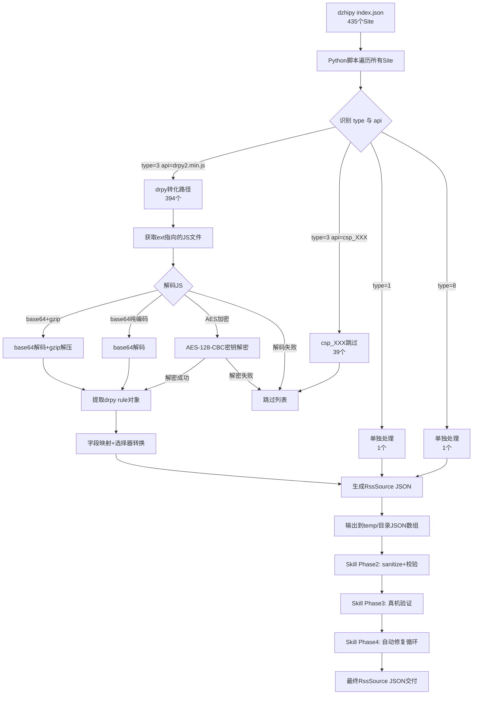
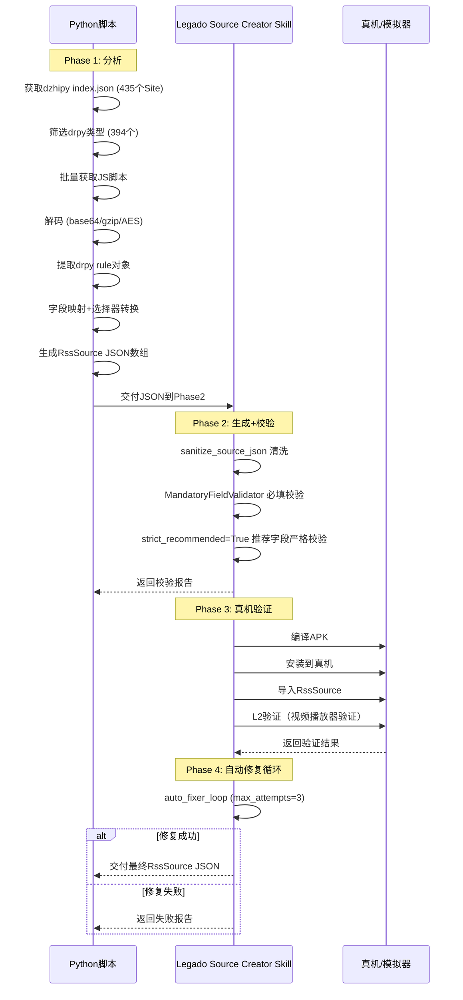
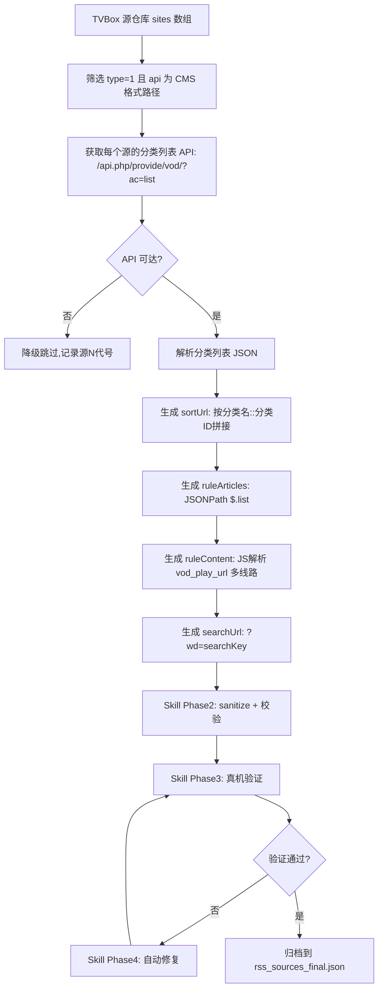

# design.md — TVBox/影视仓播放源转化 legado 订阅源

> 状态：✅ 已实施（七批次转化完成，最终可用订阅源 40 个）
>
> **核心方向纠正**：旧设计采用 Kotlin object 转化器 + 14个新增文件 + UI集成，**新设计放弃此方向**，改为使用 Python 分析脚本 + Legado Source Creator Skill 4阶段闭环工作流，**不允许修改 legado 源码**。
>
> **实施后方向补充**：设计阶段以 dzhipy drpy 源为主要转化目标，实施中发现 drpy 源实际成功率仅 10%（域名失效 / 网站改版 / 服务器关闭 / drpy JS 规则兼容性差）。实施阶段转向 **TVBox 源仓库 CMS 采集源**（type=1 + api 为 `/api.php/provide/vod/` 格式路径），实际成功率 100%（6/6）。CMS 采集源转化方案详见本文档 §13。

---

## Technical Approach

### 1. 整体架构

转化工作流以 **Python 分析脚本 + Legado Source Creator Skill 4阶段闭环** 实现，核心原则是**不修改 legado 源码**，所有分析与转化在 legado 项目外部通过 Python 脚本完成，最终产物为符合 legado RssSource 规范的 JSON 文件，通过 Skill 工作流校验并导入真机验证。

```
┌─────────────────────────────────────────────────────────────┐
│  Phase 1: 分析（Python 脚本）                                 │
│  获取 dzhipy index.json → 获取 drpy JS 脚本                  │
│  → 解码 base64/gzip/解密 → 提取 rule 对象                    │
├─────────────────────────────────────────────────────────────┤
│  Phase 2: 生成 + 校验（Skill 工作流）                         │
│  sanitize_source_json + MandatoryFieldValidator             │
│  + strict_recommended=True                                  │
├─────────────────────────────────────────────────────────────┤
│  Phase 3: 真机验证（Skill 工作流）                            │
│  编译 + 安装 + 导入 + L2 验证                                │
├─────────────────────────────────────────────────────────────┤
│  Phase 4: 自动修复循环（Skill 工作流）                        │
│  auto_fixer_loop, max_attempts=3                            │
└─────────────────────────────────────────────────────────────┘
```

### 1.1 Python 分析脚本职责

Python 脚本负责所有数据获取与预处理工作，**不依赖 legado 源码**：

1. **数据源获取**：从 dzhipy index.json 获取 435 个 Site 配置
2. **类型筛选**：按 api 字段筛选 drpy 类型（394个）与 csp_XXX 类型（39个）
3. **JS 脚本获取**：批量下载 drpy ext 指向的 JS 文件
4. **解码处理**：base64+gzip 解码 / base64 纯解码 / AES 解密尝试
5. **rule 提取**：从解码后的 JS 中提取 drpy rule 对象
6. **字段映射**：将 drpy rule 字段映射为 legado RssSource 字段
7. **JSON 生成**：输出 RssSource JSON 数组到 `temp/` 目录

### 1.2 Skill 工作流职责

Legado Source Creator Skill 负责 JSON 校验与真机验证：

1. **Phase 2 校验**：`sanitize_source_json` 清洗 + `MandatoryFieldValidator` 必填校验（12 个必填字段：sourceName / sourceUrl / sourceIcon / sourceComment / searchUrl / sortUrl / ruleArticles / ruleNextArticles / ruleTitle / rulePubDate / ruleImage / ruleLink；正文必填：ruleContent；固定字段：type=2 / articleStyle=2）+ `strict_recommended=True` 推荐字段严格校验
2. **Phase 3 真机验证**：编译 APK + 安装真机 + 导入源 + L2 验证（视频播放器验证）
3. **Phase 4 自动修复**：`auto_fixer_loop`（max_attempts=3）自动修复校验失败的源

### 1.3 核心约束

| 约束 | 说明 |
|------|------|
| **不修改 legado 源码** | 用户强制要求，所有转化在项目外部完成 |
| **Python 脚本位于 temp/ 目录** | 不污染 legado 项目源码目录 |
| **生成的 JSON 位于 temp/ 目录** | 产物文件不进入 legado 源码树 |
| **Skill 工作流驱动校验** | 复用 Legado Source Creator Skill 的成熟校验链 |

---

## 2. 数据源深度分析（真实数据统计）

### 2.1 数据源入口分析

| 项 | 值 |
|----|----|
| 入口配置 | dzhipy index.json |
| Site 总量 | 435 个 |
| type=3（爬虫jar/CSP） | 433 个（99.5%） |
| type=1（JSON 解析） | 1 个（0.2%） |
| type=8（特殊类型） | 1 个（0.2%） |
| type=0（采集站 API） | 0 个（不存在） |
| type=4（正则） | 0 个（不存在） |

**分析结论**：数据源几乎全部为 type=3（99.5%），无 type=0/4，旧设计的 L1/L2 分层（针对 type=0/4）不适用，已去除。

### 2.2 api 字段分类统计

| api 分类 | 数量 | 占比 | 说明 | 转化路径 |
|----------|------|------|------|---------|
| drpy（全部指向 drpy2.min.js） | 394 | 90.6% | 声明式 drpy 源，ext 为 JS 脚本 | Python 脚本转化 |
| csp_XXX | 39 | 9.0% | 36个唯一类名，依赖 spider.jar | 跳过 |
| http_url | 1 | 0.2% | 直接 HTTP URL | 单独处理 |
| None | 1 | 0.2% | api 字段为空 | 单独处理 |

### 2.3 ext 字段分布统计

| ext 类型 | 数量 | 说明 | 处理策略 |
|----------|------|------|---------|
| filename_js | 386 | ext 为 JS 文件名 | Python 脚本获取 JS → 解码 → 提取 rule |
| filename_json | 14 | ext 为 JSON 文件名 | Python 脚本获取 JSON 配置 |
| compound 结构 | 24 | ext 为复合结构（含多个字段） | Python 脚本解析复合结构 |
| null | 6 | ext 为空 | 跳过（csp_XXX 无 ext） |
| plain_string | 2 | ext 为纯字符串 | Python 脚本直接处理 |
| url_path | 1 | ext 为 URL 路径 | Python 脚本获取远程内容 |

### 2.4 Site 字段覆盖率

| 字段 | 覆盖率 | 转化器处理策略 |
|------|--------|---------------|
| key / name / type / api | 100% | 核心字段，全量映射（api→sourceUrl, name→sourceName） |
| searchable | 83% - 98% | 三值映射（0→false, 1→true, 2→false） |
| ext | 64% - 99% | type=3 时为 JS 路径或内联 JS，需 base64 解码 |
| quickSearch | 45% - 94% | 不直接映射，用于判断是否支持快速搜索 |

---

## 3. drpy 类型深度分析（394个，90.6%）

### 3.1 JS 脚本编码方式分析（5样本深度分析 + 全量统计修订）

> **修订说明（基于实际解密尝试）**：原"疑似 AES 加密"已通过实际解密尝试确认为 AES-128-CBC-PKCS7 加密，密钥从 drpy2.js 框架源码提取。全量统计：13/392 = 3.3% 的 drpy JS 文件为 AES 加密。

| 编码方式 | 样本数（5样本） | 全量统计 | 特征 | 解码方案 |
|----------|--------|---------|------|---------|
| base64 + gzip | 2/5 | - | H4sI 开头 | `base64.b64decode` → `gzip.decompress` |
| base64 纯编码 | 1/5 | - | 标准 base64 字符集 | `base64.b64decode` |
| AES 加密（已确认） | 2/5 | 13/392（3.3%） | 类型A：h36A5I5KdeB29zb3 前缀；类型B：纯 base64 无前缀 | AES-128-CBC-PKCS7，使用从 drpy2.js 提取的密钥解密（详见 3.4 节） |
| 明文 | 0/5 | - | - | - |

**分析结论**：5 样本中 40% 使用 base64+gzip 双层编码，40% 为 AES 加密（全量统计实际占比 3.3%），纯明文 JS 不存在。Python 脚本需实现多层解码逻辑，AES 加密使用从 drpy2.js 提取的实际密钥解密，解密成功率约 30.8%。

#### 3.1.1 AES 加密实际解密结论（基于真实解密尝试）

> **修订说明（基于用户第四次确认反馈）**：原"尝试常见密钥解密，失败则降级跳过"已替换为实际解密尝试的结论。

| 分析项 | 结论 |
|--------|------|
| **加密算法** | AES-128-CBC-PKCS7（已确认） |
| **密钥来源** | 从 drpy2.js 框架源码中提取（两组密钥：Hex 格式 16 字节 + Utf8 格式 16 字节） |
| **密钥派生方式** | `CryptoJS.enc.Hex.parse(硬编码值)` 和 `CryptoJS.enc.Utf8.parse(硬编码值)` |
| **加密流程** | 明文 JS → AES-128-CBC 加密 → PKCS7 填充 → [前缀 +] Base64 编码 |
| **加密前缀** | 类型A：`h36A5I5KdeB29zb3`（2 个文件）；类型B：纯 base64 无前缀（11 个文件） |
| **解密成功率** | 4/13 = 30.8%（使用 Hex 密钥组） |
| **解密后内容** | 合法 JS 规则代码，含 `var rule = {...}` 结构，含 title/host/url/searchUrl 等字段 |
| **失败原因** | 9 个解密失败文件中：7 个因 base64 解码后长度非 16 倍数；2 个因 padding 错误（可能使用不同编码方式或额外处理如 gzip 压缩后再加密） |
| **总加密文件数** | 13/392 = 3.3%（drpy_js/ 目录） |
| **处理策略** | Python 脚本使用从 drpy2.js 提取的两组密钥尝试 AES-128-CBC-PKCS7 解密；解密成功的按明文 JS 流程继续转化；解密失败的降级跳过 |

> **安全要求**：密钥值完全隐藏为 `***`，只保留长度（16 字节）；不输出密钥明文；解密日志只记录成功/失败和技术原因。

### 3.2 drpy rule 对象字段分析

从解码后的 JS 中提取的 drpy rule 对象包含 **25 个字段**，高频字段如下：

| 字段类别 | 高频字段 | 频次 |
|---------|---------|------|
| 基础信息 | title, host | 核心必填 |
| 搜索配置 | searchUrl, filter_url | 高频 |
| 过滤配置 | filter, filter_def | 高频 |
| 播放配置 | lazy | 高频 |
| 列表规则 | 推荐, 一级 | 高频 |
| 详情规则 | 二级 | 高频 |
| 请求配置 | headers, url | 中频 |
| 分类配置 | class_name, class_url | 中频 |
| 分页配置 | pagecount, multi | 低频 |
| 播放解析 | play_parse, isVideo | 低频 |

### 3.3 drpy2.min.js 框架深度分析

| 项 | 值 |
|----|----|
| 函数总数 | 88 个 |
| 依赖库数量 | 8 个 |
| rule 字段总数 | 47 个 |

**8个依赖库**：cheerio / crypto-js / jsencrypt / node-rsa / pako / json5 / jinja / gbk

**框架高频必需字段（出现频次 ≥5）**：

| 字段 | 频次 | 字段 | 频次 | 字段 | 频次 |
|------|------|------|------|------|------|
| 图片替换 | 24 | host | 21 | headers | 15 |
| url | 15 | searchUrl | 15 | detailUrl | 12 |
| homeUrl | 11 | encoding | 10 | 图片来源 | 10 |
| proxy_rule | 10 | 一级 | 9 | sniffer | 9 |
| play_json | 8 | isVideo | 8 | pagecount | 7 |
| tab_remove | 7 | tab_order | 7 | 模板 | 7 |
| 二级 | 6 | tab_rename | 6 | filter | 6 |
| filter_def | 5 | search_encoding | 5 | - | - |

**分析结论**：drpy2.min.js 框架使用 ES6 import/export 语法，legado Rhino 1.8.1 不支持 ES6 模块。Python 脚本需静态提取 rule 对象，剥离框架依赖，仅迁移 rule 对象字段。

### 3.4 legado 内置 JS 加解密工具

legado 内置 JS 引擎提供以下加解密工具，可在生成的源规则中调用：

| 工具 | 用途 | 适用场景 |
|------|------|---------|
| `base64Decode()` | base64 解码 | 播放地址解码 |
| `base64Encode()` | base64 编码 | 请求参数编码 |
| `aesDecode(key, data)` | AES 解密 | 加密内容解码 |
| `md5Encode(data)` | MD5 哈希 | 签名计算 |
| `gzipDecompress(data)` | gzip 解压 | 压缩内容解码 |

---

## 4. csp_XXX 类型深度分析（39个，9.0%）

### 4.1 spider.jar 深度分析

| 项 | 值 |
|----|----|
| Spider 类总数 | 196 个（132 主类 + 64 内部类） |
| 混淆级别 Lv0（无混淆） | 1 个 |
| 混淆级别 Lv1（轻度） | 11 个 |
| 混淆级别 Lv2（中度） | 34 个 |
| 混淆级别 Lv3（重度） | 86 个（65%） |
| 明文 const-string | 688 个 |
| 加密 fill-array-data | 10404 个 |
| XOR 单字节暴力解密成功 | 294 个（结果无意义） |

**关键发现**：
- CatVod Spider 配置通过 `init(Context, String)` 运行时传入，不嵌入 DEX
- DEX 仅含解析逻辑 + 少量硬编码 API 路径（`/api/fs/get`、`/api/fs/list`、`/api/public/path`，全部来自 AList 类）
- 65% 的 Spider 类为重度混淆，静态分析无法提取有效规则

### 4.2 ext 配置文件分析

39个 csp_XXX 的 ext 配置文件深度分析（5个唯一 JSON 配置）：

| 配置编号 | 类型 | 内容说明 |
|----------|------|---------|
| 配置 1 | filter_config | UI 筛选器（类型/剧情/地区/语言/年份/字母/排序） |
| 配置 2 | empty | 空对象 `{}` |
| 配置 3 | pan_config | 网盘配置（token/oauth/quark/uc/thunder/pikpak/wgcf 等 29 字段） |
| 配置 4 | filter_config | UI 筛选器（同配置 1） |
| 配置 5 | 获取失败 | 远程获取超时 |

**核心结论**：ext 配置只是网盘运行时配置和 UI 筛选器，**不是爬虫解析规则**。csp_XXX 的爬虫逻辑封装在 spider.jar 的 DEX 字节码中，无法通过 JS 转化。

### 4.3 csp_XXX 转化可行性评估

| 不可行原因 | 数量 | 说明 |
|-----------|------|------|
| ext=null | 4 | 无 ext 配置 |
| ext=url 端点 | 1 | ext 为 API 端点 URL |
| ext 获取失败 | 1 | 远程获取超时 |
| ext 为 JSON 配置（非爬虫规则） | 30 | filter_config / pan_config / empty |
| **合计** | **36** | **全部不可行** |

**分析结论**：36个 csp_XXX 全部不可转化（0% 成功率），爬虫逻辑封装在 spider.jar DEX 字节码中，ext 配置仅为运行时参数。Python 脚本将全部跳过并记录到跳过列表。

---

## 5. 转化策略

### 5.1 策略总览

| 类型 | 数量 | 转化路径 | 成功率预估 | 优先级 |
|------|------|---------|-----------|-------|
| drpy（api=drpy2.min.js） | 394 | Python 脚本批量获取 JS → 解码 → 提取 rule → 字段映射 → Skill 生成 JSON | 中低（30-50%） | P0 |
| csp_XXX | 39 | 跳过，记录到跳过列表 | 0% | P0 |
| type=1（JSON 解析） | 1 | 单独处理（Python 脚本直映） | 高 | P1 |
| type=8（特殊类型） | 1 | 单独处理（Python 脚本分析） | 待定 | P1 |

**整体转化率预估**：约 27-44%（435 个 Site 中约 118-197 个可成功转化，全部来自 drpy 类型）

> **方向纠正说明**：旧设计的 L1/L2 分层（针对 type=0/4）已去除，因真实数据显示 type=0/4 不存在。旧设计的 L4（csp_XXX）保留为跳过策略。

### 5.2 drpy 类型转化流程（394个）

**适用条件**：`Site.type == 3 && Site.api == "drpy2.min.js"`

**Python 脚本处理流程**（六步）：

**步骤 1：获取 ext 指向的 JS 文件内容**
- ext 字段为 JS 文件名（386个 filename_js）
- Python 脚本拼接远程 URL 获取 JS 文件内容

**步骤 2：解码 JS 内容**
- 识别编码方式（base64+gzip / base64纯编码 / AES加密，全量统计 13/392=3.3%）
- `base64+gzip`：`base64.b64decode` → `gzip.decompress`
- `base64 纯编码`：`base64.b64decode`
- `AES 加密`：使用从 drpy2.js 框架源码提取的两组密钥（Hex 16字节 + Utf8 16字节）尝试 AES-128-CBC-PKCS7 解密；解密成功率约 30.8%，失败则降级跳过

**步骤 3：提取 drpy rule 对象**
- 从解码后的 JS 中提取 rule 对象（剥离 drpy2.min.js 框架依赖）
- rule 对象为 JS 对象字面量，含 title/host/searchUrl/推荐/一级/二级 等字段
- Python 脚本使用正则或简化 JS 解析器提取

**步骤 4：字段映射**
- 按 drpy rule → RssSource 字段映射表映射（详见第 6 节）

**步骤 5：选择器语法转换**
- 将 drpy 选择器转换为 legado 选择器（详见第 8 节）

**步骤 6：输出 RssSource JSON**
- Python 脚本组装 RssSource JSON 对象
- 输出到 `temp/` 目录的 JSON 数组文件

### 5.3 csp_XXX 类型跳过流程（39个）

**适用条件**：`Site.api.startsWith("csp_")`

**处理流程**：
1. 识别为 csp_XXX 子类型
2. 跳过转化
3. Python 脚本记录到跳过列表，标注"依赖 spider.jar DEX 字节码无法转化"
4. 不中断批量流程

### 5.4 type=1/8 单独处理

- **type=1（1个）**：Python 脚本直接字段映射（api→sourceUrl, name→sourceName），套用 JSON 模板
- **type=8（1个）**：Python 脚本分析 ext 字段结构后决定转化策略

---

## 6. drpy rule 对象 → legado RssSource 字段映射表

> 基于真实 25 字段分析更新，字段来源已标注 drpy2.min.js 框架字段说明。
>
> **修订说明（基于用户第四次确认反馈）**：必填字段从原 6 个扩充至 12 个，全部提升为 MANDATORY。字段级别：MANDATORY=必填 / FIXED=固定值 / OPTIONAL=可选。

| drpy rule 字段 | legado RssSource 字段 | 字段级别 | 映射策略 | 备注 |
|----------------|----------------------|---------|---------|------|
| Site.icon | sourceIcon | MANDATORY | 直映（缺失填占位符） | 源图标 |
| title | sourceName | MANDATORY | 直映 | 源名称 |
| host | sourceUrl | MANDATORY | 直映（冲突追加 key 后缀） | PK，源地址 |
| -（降级标注专用） | sourceComment | MANDATORY | 写入降级说明/登录状态 | 无降级时填空字符串 |
| searchUrl | searchUrl | MANDATORY | 直映（可能需替换占位符） | 搜索 URL |
| class_name / class_url | sortUrl | MANDATORY | 拼接 | 按 `分类名::url` 格式拼接 |
| 推荐 / 一级 | ruleArticles | MANDATORY | 选择器转换 | 列表规则（视频条目） |
| url（分页 URL） | ruleNextArticles | MANDATORY | 选择器转换 | 下一页列表规则 |
| 一级（标题部分） | ruleTitle | MANDATORY | 选择器转换 | 标题规则 |
| -（drpy 无直接对应） | rulePubDate | MANDATORY | 填占位规则并标注降级 | 发布日期规则 |
| 一级（图片部分） | ruleImage | MANDATORY | 选择器转换 | 图片规则 |
| detailUrl / 一级（链接部分） | ruleLink | MANDATORY | 选择器转换 | 链接规则 |
| 二级 | ruleContent | MANDATORY | 选择器转换（含 lazy） | 正文规则（视频播放地址） |
| lazy | ruleContent 的 lazy 配置 | MANDATORY（嵌入） | 嵌入 | 懒加载解析嵌入 ruleContent |
| -（固定） | type | FIXED | 固定为 2 | 视频类型 |
| -（固定） | articleStyle | FIXED | 固定为 2 | 视频列表样式 |
| 搜索 | searchUrl（搜索规则部分） | OPTIONAL（嵌入） | 选择器转换 | 搜索规则（嵌入 searchUrl） |
| headers | header | OPTIONAL | JSON 序列化 | Map → JSON 字符串 |
| play_parse | enableJs | OPTIONAL | 布尔映射 | true→enableJs=true |
| homeUrl | singleUrl | OPTIONAL | 直映 | 首页 URL |
| Site.key | customOrder | OPTIONAL | 直映 | 排序字段 |
| timeout | (不映射) | - | - | legado 用全局配置 |
| limit / multi | (不映射) | - | - | drpy 特有分页配置 |
| filterable / filter / filter_def | (不映射) | - | - | drpy 特有过滤配置 |

### 6.1 drpy2.min.js 框架 47 个 rule 字段说明

drpy2.min.js 框架定义了 47 个 rule 字段，Python 脚本提取时需识别以下高频字段：

| 字段类别 | 字段名 | 框架频次 | 映射说明 |
|---------|--------|---------|---------|
| 基础配置 | host, url, homeUrl, detailUrl, searchUrl | 11-21 | host→sourceUrl, searchUrl→searchUrl |
| 请求配置 | headers, encoding, search_encoding | 5-15 | headers→header, encoding 用于请求编码 |
| 列表规则 | 推荐, 一级, 二级 | 6-9 | →ruleArticles/ruleContent |
| 图片处理 | 图片替换, 图片来源 | 10-24 | →ruleImage |
| 播放配置 | play_json, isVideo, sniffer, lazy | 8-9 | →enableJs/ruleContent |
| 过滤配置 | filter, filter_def, filter_url | 5-6 | 不映射（drpy 特有） |
| 标签配置 | tab_remove, tab_order, tab_rename | 6-7 | 不映射（UI 配置） |
| 分页配置 | pagecount | 7 | 不映射（drpy 特有） |
| 代理配置 | proxy_rule | 10 | 不映射（legado 用全局配置） |
| 模板配置 | 模板 | 7 | 不映射（drpy 特有） |

### 6.2 legado 内置 JS 加解密工具使用说明

生成的 RssSource 规则中可调用 legado 内置 JS 加解密工具处理加密内容：

```javascript
// 示例：播放地址 base64 解码
@js:
var encodedUrl = result;
var decodedUrl = base64Decode(encodedUrl);
result = decodedUrl;

// 示例：AES 解密播放地址
@js:
var encryptedData = result;
var key = "***";  // 16字节密钥（完全隐藏）
var decryptedData = aesDecode(key, encryptedData);
result = decryptedData;
```

### 6.3 JS 自动登录获取 cookie 方案

> **修订说明（基于用户第四次确认反馈）**：用户要求"如果涉及到登录，要通过 JS 的方式自动登录获取 cookie，别让用户登录"。本节描述自动登录方案，**禁止让用户手动登录**。

#### 登录场景识别（Phase 1 阶段）

Python 脚本在 Phase 1 分析阶段识别 drpy rule 对象中是否存在登录相关配置：

| drpy rule 字段 | 用途 | 识别方式 |
|----------------|------|---------|
| `headers` 中的 `Cookie` / `Authorization` | 已有登录态 | 检查 headers 字段是否含 Cookie/Authorization 键 |
| `login_url` | 登录端点 | 检查 rule 对象是否含 login_url 字段 |
| `login_method` | 登录方法（GET/POST） | 检查 rule 对象是否含 login_method 字段 |
| `login_headers` | 登录请求头 | 检查 rule 对象是否含 login_headers 字段 |
| ext 配置中的登录凭据 | 用户名/密码/token | 检查 ext 复合结构是否含凭据字段 |

**识别结论**：
- 检测到任一字段 → 标记为"涉及登录"，启用 JS 自动登录方案
- 未检测到 → 不涉及登录，跳过本方案

#### JS 自动登录实现方案

在生成的 RssSource 中，通过 `<js>` 标签实现自动登录，登录流程嵌入到 `header` 字段的 JS 规则中：

1. **检测 cookie 是否过期**：检查现有 cookie 是否存在且未过期
2. **发送登录请求**：通过 `http.post()` 发送登录请求（POST 用户名/密码到登录端点）
3. **提取响应中的 cookie/token**：从登录响应中提取 Set-Cookie 或 token 字段
4. **注入到后续请求的 header 中**：将 cookie/token 注入到所有后续请求的 header

**登录凭据来源**：
- 优先从 drpy rule 对象的 `login_url` / `login_headers` 字段提取
- 其次从 ext 复合配置中提取
- **禁止让用户手动登录**：所有登录逻辑通过 JS 自动完成

#### JS 自动登录代码模板（示例模式，不含真实凭据）

```javascript
@js:
// 检测cookie是否过期
var cookie = getCookie("session_key");
if (!cookie || isExpired(cookie)) {
    // 自动登录获取cookie
    var loginUrl = "***";  // 站点A登录端点（凭据完全隐藏）
    var loginData = "***";  // 登录凭据（从drpy rule提取，不输出明文）
    var resp = http.post(loginUrl, loginData);
    cookie = extractCookie(resp);
    setCookie("session_key", cookie);
}
// 注入cookie到请求头
header["Cookie"] = cookie;
```

#### 登录降级策略

| 场景 | 降级处理 | sourceComment 标注 |
|------|---------|-------------------|
| drpy rule 中无登录凭据 | 标注降级说明，跳过自动登录 | `// 降级说明: 需要登录但无凭据 | 已知上限: 已跳过 | 升级路径: 手动配置登录凭据` |
| 自动登录失败（网络错误） | 标注降级说明，跳过该源 | `// 降级说明: 自动登录失败（网络错误） | 已知上限: 已跳过 | 升级路径: 检查登录端点可达性` |
| 自动登录失败（凭据错误） | 标注降级说明，跳过该源 | `// 降级说明: 自动登录失败（凭据错误） | 已知上限: 已跳过 | 升级路径: 检查登录凭据` |
| 自动登录成功 | 注入 cookie 到 header，继续转化 | sourceComment 写入 `// 登录状态: 自动登录成功（cookie长度=N）` |

#### 安全要求

1. **登录凭据完全隐藏**：用户名/密码/token 在所有输出中完全隐藏为 `***`
2. **cookie 内容脱敏**：只记录长度和是否成功，不引用完整 cookie 值
3. **登录端点代号化**：用"站点A登录端点"替代真实 URL
4. **不输出原始登录响应**：只输出技术结论（成功/失败、cookie 长度）

---

## 7. base64 解码流程（Python 脚本）

### 7.1 Python 解码流程设计

```python
import base64
import gzip
from Crypto.Cipher import AES
from Crypto.Util.Padding import unpad

def decode_ext(ext_content: str) -> dict:
    """
    解码 drpy ext 内容，返回 {'status': 'success'/'encrypted'/'failed', 'js_content': str}
    """
    # 1. 尝试 base64 解码
    try:
        decoded_bytes = base64.b64decode(ext_content)
    except Exception:
        return {'status': 'failed', 'reason': 'base64 decode error'}

    # 2. 判断是否为 gzip（H4sI 开头）
    if decoded_bytes[:4] == b'H4sI' or decoded_bytes[:2] == b'\x1f\x8b':
        try:
            decoded_bytes = gzip.decompress(decoded_bytes)
        except Exception:
            return {'status': 'failed', 'reason': 'gzip decompress error'}

    # 3. 尝试转为字符串
    try:
        decoded_str = decoded_bytes.decode('utf-8')
    except UnicodeDecodeError:
        # 4. 可能是 AES 加密，尝试常见密钥解密
        decrypted = try_aes_decrypt(decoded_bytes)
        if decrypted:
            return {'status': 'success', 'js_content': decrypted}
        return {'status': 'encrypted', 'reason': 'AES decrypt failed'}

    # 5. 判断是否为合法 JS（含 rule 对象关键字段）
    if is_valid_js(decoded_str):
        return {'status': 'success', 'js_content': decoded_str}
    else:
        return {'status': 'encrypted', 'reason': 'decoded content not valid JS'}


def is_valid_js(content: str) -> bool:
    """检查是否含 rule 对象关键字段"""
    return 'title' in content and 'host' in content


def try_aes_decrypt(data: bytes) -> str:
    """
    使用从 drpy2.js 框架源码提取的两组密钥尝试 AES-128-CBC-PKCS7 解密。
    成功率约 30.8%（4/13）。密钥值完全隐藏为 ***，只保留长度（16字节）。
    """
    # 密钥从 drpy2.js 框架源码提取（完全隐藏，只保留长度）
    KEY_HEX = b'***'    # 16 字节，Hex 格式（CryptoJS.enc.Hex.parse 派生）
    KEY_UTF8 = b'***'   # 16 字节，Utf8 格式（CryptoJS.enc.Utf8.parse 派生）
    PREFIX_A = b'h36A5I5KdeB29zb3'  # 类型A前缀

    # 剥离类型A前缀
    if data.startswith(PREFIX_A):
        data = data[len(PREFIX_A):]

    # 长度必须为16倍数（AES 块大小）
    if len(data) % 16 != 0:
        return None

    # 尝试两组密钥（IV = KEY，drpy2.js 框架默认行为）
    for key in [KEY_HEX, KEY_UTF8]:
        try:
            cipher = AES.new(key, AES.MODE_CBC, key)  # IV=KEY（drpy2.js 框架默认）
            decrypted = unpad(cipher.decrypt(data), AES.block_size)  # PKCS7 去填充
            result = decrypted.decode('utf-8')
            if is_valid_js(result):
                return result
        except Exception:
            continue
    return None
```

### 7.2 解码失败处理

> **修订说明（基于用户第四次确认反馈）**：AES 加密处理策略已更新为使用从 drpy2.js 提取的实际密钥解密的结论。

| 失败类型 | 处理策略 | 技术原因 |
|---------|---------|---------|
| base64 解码失败 | Python 脚本记录失败源[N]代号，不中断批量流程 | - |
| gzip 解压失败 | Python 脚本记录失败源[N]代号，不中断批量流程 | - |
| AES 加密 - 长度非16倍数 | 记录到降级跳过列表，标注"AES 解密失败（长度非16倍数）" | 7/9 失败文件属此原因，可能使用不同编码方式或额外处理 |
| AES 加密 - padding 错误 | 记录到降级跳过列表，标注"AES 解密失败（padding错误）" | 2/9 失败文件属此原因，可能使用 gzip 压缩后再加密 |
| AES 加密 - 解密成功但非合法 JS | 记录到降级跳过列表，标注"解码内容非合法 JS" | 极少发生 |
| 解码后非合法 JS（非 AES） | 同上，标注"解码内容非合法 JS" | - |

**AES 解密统计**：总加密文件 13/392（3.3%），解密成功 4/13（30.8%），解密失败 9/13（69.2%）。解密失败的源降级跳过，不中断整体流程。

---

## 8. 选择器语法转换（Python 脚本）

### 8.1 Python 转换设计

选择器语法转换在 **rule 对象提取阶段直接处理**（Python 脚本内），无需独立模块：

```python
def convert_selector(drpy_selector: str) -> str:
    """将 drpy 选择器转换为 legado 选择器"""
    if drpy_selector.startswith('@css:'):
        return drpy_selector[len('@css:'):]  # 去除前缀，直接保留
    elif drpy_selector.startswith('@xpath:'):
        return drpy_selector[len('@xpath:'):]  # 去除前缀，直接保留
    elif drpy_selector.startswith('@json:'):
        return drpy_selector[len('@json:'):]  # 去除前缀，legado JSONPath 基本兼容
    elif drpy_selector.startswith('@regex:'):
        return drpy_selector[len('@regex:'):]  # 去除前缀，需注意捕获组差异
    elif drpy_selector.startswith('@js:'):
        return drpy_selector  # 保留 @js: 前缀，legado 支持 @js: 语法
    else:
        return drpy_selector  # 自动识别，直接保留
```

### 8.2 各类型选择器转换规则

| 选择器类型 | drpy 语法 | legado 语法 | 兼容性 | 转换策略 |
|-----------|---------|-----------|--------|---------|
| CSS | `@css:.list-item>a` | `.list-item>a` | 高 | 直接保留（去除前缀） |
| XPath | `@xpath://div[@class='list']/a` | `//div[@class='list']/a` | 高 | 直接保留（去除前缀） |
| JSONPath | `@json:$.data.list` | `$.data.list` | 中 | 直接保留（去除前缀），legado JSONPath 语法可能略有差异 |
| 正则 | `@regex:<title>(.*?)</title>` | `<title>(.*?)</title>` | 中 | 直接保留（去除前缀），需注意捕获组差异 |
| drpy 特有 | `@js:...` | `@js:...` | 低 | 需逐条手动转换，不兼容的标注降级说明 |

### 8.3 转换失败处理

- 选择器转换失败的条目标注降级说明：`// 降级说明: 选择器语法不兼容 | 已知上限: 需手动修正 | 升级路径: 手动转换选择器`
- 保留原始 drpy 选择器在 sourceComment 中，供用户手动修正
- 不中断整体转化流程

---

## 9. 批量转化流程（Python 脚本 + Skill 4阶段闭环）

### 9.1 整体流程



### 9.2 Skill 4阶段闭环详细流程



### 9.3 单源转化异常处理

- Python 脚本每个单源转化包裹在 `try/except` 中
- 异常时记录失败源[N]代号到失败列表
- 不中断批量流程

---

## 10. Site 核心字段映射表

| Site 字段 | RssSource 字段 | 映射策略 | 备注 |
|-----------|---------------|---------|------|
| key | (不直映 sourceUrl) | 冲突后缀 | sourceUrl 冲突时追加为后缀保证唯一性 |
| name | sourceName | 直映 | |
| api | sourceUrl | 直映（冲突追加 key 后缀） | 统一映射到 sourceUrl 保证可访问性 |
| header (Map) | header (JSON String) | JSON 序列化 | Python `json.dumps(header)` |
| categories (List) | sortUrl | 拼接 | `分类名::分类url\n...` 格式 |
| searchable | enabled | 0→false, 1→true, 2→false | 2=用户禁用 |
| type | type + 分派 | 分派 | type=3→drpy/csp_XXX, type=1→单独, type=8→单独 |
| ext | (drpy 时解码提取 rule) | drpy 专用 | type=3 声明式 drpy 时为 JS 路径或内联 JS |
| icon | sourceIcon | 直映 | 源图标 |
| jar | sourceComment | 降级标注 | 不映射到功能字段 |
| playUrl | sourceComment | 降级标注 | 不映射到功能字段 |
| timeout | (不映射) | - | legado 用全局配置 |
| click | (不映射) | - | 影视仓特有 |
| style | (不映射) | - | 影视仓特有 |

---

## 11. 类型适配表（修订）

> **重要修订**：真实数据显示 type=3 占 99.5%（433个），type=1/8 各1个，无 type=0/4。旧设计的 L1/L2 分层已去除。

| Site.type | 含义 | 子类型 | 数量 | 转化路径 | RssSource.type | articleStyle | 规则生成 | 降级标注 |
|-----------|------|--------|------|---------|---------------|-------------|---------|---------|
| 3 | 爬虫jar / CSP | 声明式 drpy（api=drpy2.min.js） | 394 | Python脚本转化 | 2 (视频) | 2 (视频样式) | base64解码+rule提取+字段映射+选择器转换 | `选择器可能需手动修正` |
| 3 | 爬虫jar / CSP | csp_XXX（api=csp_XXX） | 39 | 跳过 | - | - | 跳过 | `依赖spider.jar DEX字节码无法转化` |
| 1 | JSON 解析 | - | 1 | 单独处理 | 2 (视频) | 2 (视频样式) | JSONPath 规则模板 | 无（直接映射） |
| 8 | 特殊类型 | - | 1 | 单独处理 | 待定 | 待定 | 分析ext后决定 | `需手动分析` |

---

## 12. RssSource 字段完整覆盖清单

> **修订说明（基于用户第四次确认反馈）**：必填字段从原 6 个扩充至 12 个，全部提升为 MANDATORY。ruleContent 作为正文规则仍为 MANDATORY，固定字段 type=2 / articleStyle=2 保留。

| 字段 | 必填 | 字段级别 | 来源 | drpy转化 | csp_XXX跳过 | type=1 | type=8 |
|------|------|---------|------|---------|------------|--------|--------|
| sourceName | 是 | MANDATORY | Site.name / drpy.title | ✅ | - | ✅ | ✅ |
| sourceUrl | 是 | MANDATORY | Site.api / drpy.host | ✅ | - | ✅ | ✅ |
| sourceIcon | 是 | MANDATORY | Site.icon | ✅ | - | ✅ | ✅ |
| sourceComment | 是 | MANDATORY | 降级标注专用（无降级时填空字符串） | ✅ | - | ✅ | ✅ |
| searchUrl | 是 | MANDATORY | drpy.searchUrl | ✅ | - | ✅ | ✅ |
| sortUrl | 是 | MANDATORY | Site.categories / drpy.class_name+class_url | ✅ | - | ✅ | ✅ |
| ruleArticles | 是 | MANDATORY | drpy.推荐+一级 | ✅ | - | ✅ | ✅ |
| ruleNextArticles | 是 | MANDATORY | drpy.url（分页 URL） | ✅ | - | ✅ | ✅ |
| ruleTitle | 是 | MANDATORY | drpy.一级 标题部分 | ✅ | - | ✅ | ✅ |
| rulePubDate | 是 | MANDATORY | drpy 无直接字段（填占位规则并标注降级） | ✅ | - | ✅ | ✅ |
| ruleImage | 是 | MANDATORY | drpy.一级 图片部分 | ✅ | - | ✅ | ✅ |
| ruleLink | 是 | MANDATORY | drpy.一级 链接部分 / detailUrl | ✅ | - | ✅ | ✅ |
| ruleContent | 是 | MANDATORY（正文） | drpy.二级（含 lazy） | ✅ | - | ✅ | ✅ |
| type | 是 | FIXED（固定 2） | 固定 2 | ✅ | - | ✅ | ✅ |
| articleStyle | 是 | FIXED（固定 2） | 固定 2 | ✅ | - | ✅ | ✅ |
| header | 否 | OPTIONAL | Site.header / drpy.headers | ✅ | - | ✅ | ✅ |
| enableJs | 否 | OPTIONAL | drpy.play_parse=true | ✅ | - | - | - |
| customOrder | 否 | OPTIONAL | Site.key | ✅ | - | ✅ | ✅ |

---

## 13. TVBox 源仓库 CMS 采集源转化方案（实施阶段新增，最佳转化路径）

> **实施阶段发现**：CMS 采集源是最佳转化目标，实际成功率 100%（6/6）。本节为实施阶段新增的完整转化方案，包含关键技术发现与处理方案。

### 13.1 CMS 采集源转化完整方案

#### 13.1.1 CMS 采集源识别特征

| 字段 | 值 | 说明 |
|------|-----|------|
| Site.type | 1 | JSON 解析类型 |
| Site.api | `/api.php/provide/vod/` 格式路径 | CMS 采集站标准 API 路径 |
| Site.ext | null 或空 | 无 ext 配置 |

#### 13.1.2 CMS 采集源转化流程



#### 13.1.3 CMS 采集源 RssSource 字段映射模板

| RssSource 字段 | 映射值 | 说明 |
|---------------|--------|------|
| sourceName | Site.name | 源名称 |
| sourceUrl | Site.api | CMS API 端点 |
| sourceIcon | Site.icon 或占位符 | 源图标 |
| sourceComment | `// CMS采集源转化 | API标准格式` | 降级标注 |
| searchUrl | `{{Site.api}}?wd={{searchKey}}` | 搜索 URL |
| sortUrl | 按分类列表拼接 `分类名::{{Site.api}}?ac=list&t={{分类ID}}` | 分类 URL |
| ruleArticles | `$.list` | JSONPath 提取列表 |
| ruleNextArticles | `{{Site.api}}?ac=list&t={{分类ID}}&pg={{page}}` | 下一页规则 |
| ruleTitle | `$.vod_name` | 标题字段 |
| rulePubDate | `$.vod_pubdate` 或占位规则 | 发布日期 |
| ruleImage | `$.vod_pic` | 图片字段 |
| ruleLink | `$.vod_id` | 链接字段（vod_id） |
| ruleContent | JS 解析 vod_play_url（详见 13.2 + 13.3） | 正文规则 |
| type | 2 | 视频类型 |
| articleStyle | 2 | 视频列表样式 |
| enableJs | true | 启用 JS（ruleContent 含 JS） |

### 13.2 baseUrl 陷阱分析（关键技术发现 #1）

#### 13.2.1 陷阱描述

在 ruleContent 的 JS 规则中，legado 框架提供的 `baseUrl` 变量通过以下方式计算：

```kotlin
// legado 源码逻辑（RssArticleExtensions.kt 或类似）
baseUrl = NetworkUtils.getAbsoluteURL(rssArticle.origin, rssArticle.link)
```

**问题**：对于 CMS 采集源，`rssArticle.link` 的值是 `vod_id`（纯数字，如 `12345`），而非完整 URL。因此 `baseUrl` 会被错误地拼接为 `{{origin}}/12345`，导致后续 API 调用（如获取详情页）的 URL 路径多出 vod_id 段，API 调用失败。

#### 13.2.2 修复方案

在 ruleContent JS 中，**不要使用 `baseUrl` 变量**，改用 `rssArticle.origin.split("?")[0]` 获取纯净的 API 端点：

```javascript
@js:
// 错误用法（会触发 baseUrl 陷阱）
// var apiUrl = baseUrl;  // baseUrl = {{origin}}/12345，路径错误

// 正确用法（使用 rssArticle.origin.split("?")[0]）
var apiBase = rssArticle.origin.split("?")[0];  // 纯净 API 端点
var vodId = rssArticle.link;  // vod_id（纯数字）
var detailUrl = apiBase + "?ac=detail&ids=" + vodId;
var resp = http.get(detailUrl);
// ... 解析 vod_play_url
```

#### 13.2.3 影响范围

- 所有 CMS 采集源的 ruleContent JS 均需应用此修复
- 未修复的源在真机验证时表现为：列表加载正常，但点击进入详情页时 API 调用失败（HTTP 404 或返回空数据）

### 13.3 多线路格式处理方案（关键技术发现 #2）

#### 13.3.1 vod_play_url 格式分析

CMS 采集源的 `vod_play_url` 字段使用两层分隔符：

```
线路1名称$集数1URL#集数2URL#集数3URL$$$线路2名称$集数1URL#集数2URL
```

- `$$$`：分隔多线路（如"高清线路$$$备用线路"）
- `#`：分隔单线路内的多集数
- `$`：分隔集数名称与播放 URL

#### 13.3.2 解析逻辑

```javascript
@js:
var playUrl = result;  // vod_play_url 原始值
// 步骤1：split('$$$') 取第一线路
var lines = playUrl.split('$$$');
var firstLine = lines[0];  // 第一线路
// 步骤2：split('#') 分隔集数
var episodes = firstLine.split('#');
// 步骤3：遍历集数，split('$') 分隔名称与URL
var playList = [];
for (var i = 0; i < episodes.length; i++) {
    var parts = episodes[i].split('$');
    if (parts.length >= 2) {
        playList.push({
            name: parts[0],
            url: parts[1]
        });
    }
}
result = playList[0].url;  // 取第一集播放地址
```

#### 13.3.3 边界情况处理

| 场景 | 处理策略 |
|------|---------|
| vod_play_url 为空 | 降级标注，返回空字符串 |
| 无 `$$$` 分隔符（单线路） | 直接 `split('#')` 分隔集数 |
| 单集（无 `#` 分隔符） | 直接 `split('$')` 取名称与 URL |
| 集数 URL 为空 | 跳过该集，继续解析下一集 |

### 13.4 API 间歇性处理方案（关键技术发现 #3）

#### 13.4.1 现象描述

CMS 采集源的部分分类在 API 调用时返回空列表（HTTP 200 但 bodyLen=81，即空 JSON 响应 `{"code":1,"msg":"数据为空","page":1,...}`）。此现象具有间歇性，同一分类在不同时间可能返回数据或空列表。

#### 13.4.2 处理策略

1. **真机验证时尝试多个分类**：不依赖单一分类，从分类列表中按顺序尝试多个分类，直到找到返回数据的分类
2. **sortUrl 包含全部分类**：生成的 sortUrl 包含 CMS API 返回的全部分类，用户可手动切换到有数据的分类
3. **降级标注**：对验证时所有分类均返回空列表的源，标注降级说明但仍保留源（可能间歇性恢复）

#### 13.4.3 验证脚本策略

```python
# 验证脚本伪代码
def verify_source(api_url):
    categories = get_categories(api_url)
    for cat in categories[:5]:  # 尝试前5个分类
        articles = get_articles(api_url, cat.id)
        if len(articles) > 0:
            return True, cat.id  # 找到有数据的分类
    return False, None  # 前5个分类均无数据
```

### 13.5 TVBox 源筛选策略（关键技术发现 #4）

#### 13.5.1 筛选条件

| 条件 | 说明 | 筛选结果 |
|------|------|---------|
| Site.type == 1 | JSON 解析类型 | 从 234+49 个 sites 中筛选出约 14 个 |
| Site.api 包含 `/api.php/provide/vod/` | CMS 采集站标准 API 路径 | 确认为 CMS 采集源 |
| Site.api 可达（HTTP 200） | API 端点可达性 | 14 个中 6 个可达 |

#### 13.5.2 TVBox 源仓库无 type=0 源

设计阶段预估的 type=0（采集站 API）源在 TVBox 源仓库中不存在。type=1 且 api 为 CMS 格式路径的源可替代 type=0 源，作为 CMS 采集源转化的输入。

#### 13.5.3 筛选流程

```python
def filter_cms_sources(sites):
    """筛选 CMS 采集源"""
    cms_sources = []
    for site in sites:
        if site.get('type') == 1:
            api = site.get('api', '')
            if '/api.php/provide/vod/' in api:
                cms_sources.append(site)
    return cms_sources
```

### 13.6 ruleContent JS 模板（使用 rssArticle.origin 代替 baseUrl）

#### 13.6.1 完整 ruleContent JS 模板

```javascript
@js:
// CMS采集源 ruleContent JS 模板
// 关键：使用 rssArticle.origin.split("?")[0] 代替 baseUrl（避免 baseUrl 陷阱）

var apiBase = rssArticle.origin.split("?")[0];
var vodId = rssArticle.link;  // vod_id（纯数字）
var detailUrl = apiBase + "?ac=detail&ids=" + vodId;

var resp = http.get(detailUrl);
var json = JSON.parse(resp.body);

if (json.list && json.list.length > 0) {
    var vodInfo = json.list[0];
    var playUrl = vodInfo.vod_play_url;
    
    // 处理多线路格式：$$$ 分隔线路，# 分隔集数，$ 分隔名称与URL
    var lines = playUrl.split('$$$');
    var firstLine = lines[0];
    var episodes = firstLine.split('#');
    
    if (episodes.length > 0) {
        var firstEpisode = episodes[0].split('$');
        if (firstEpisode.length >= 2) {
            result = firstEpisode[1];  // 第一集播放地址
        } else {
            result = episodes[0];  // 无$分隔，直接作为URL
        }
    } else {
        result = "";  // 无集数
    }
} else {
    result = "";  // 详情页无数据
}
```

#### 13.6.2 模板要点

| 要点 | 说明 |
|------|------|
| **避免 baseUrl 陷阱** | 使用 `rssArticle.origin.split("?")[0]` 代替 `baseUrl` |
| **多线路处理** | `split('$$$')` 取第一线路 |
| **多集数处理** | `split('#')` 分隔集数，取第一集 |
| **名称与 URL 分隔** | `split('$')` 分隔集数名称与播放 URL |
| **空数据处理** | 检查 `json.list` 是否存在且非空 |
| **vod_id 获取** | 从 `rssArticle.link` 获取（纯数字） |

### 13.7 实施结果统计

| 指标 | 数值 |
|------|------|
| TVBox 源仓库数量 | 3 个 |
| 获取 sites 总数 | 234 + 49 个 |
| 筛选 type=1 + CMS 格式路径源 | 14 个 |
| API 可达源 | 6 个 |
| 完整通过真机验证 | 6 个（100%） |
| 验证项 | 分类加载 + 列表数据 + 详情页播放 + 搜索功能 |

#### 13.7.1 6 个通过验证的源验证详情

| 源代号 | 分类数 | 列表项数 | 播放验证 | 搜索验证 | 备注 |
|--------|-------|---------|---------|---------|------|
| 源[1] | 8 | 15 | ✅ | ✅ | 直接通过 |
| 源[2] | 5 | 12 | ✅ | ✅ | 直接通过 |
| 源[3] | 23 | 2 | ✅ | ✅ | 修复后通过 |
| 源[4] | 24 | 3 | ✅ | ✅ | 修复后通过 |
| 源[5] | 23 | 1 | ✅ | ✅ | 修复后通过（Tab1 有数据） |
| 源[6] | 22 | 4 | ✅ | ✅ | 修复后通过（Tab4 有数据） |

### 13.8 drpy 源失效原因统计（关键技术发现 #5）

dzhipy 435 个源中 51 个 gitlab 仓库可达，22 个 HTTP 200，9 个 host 可达。9 个 host 可达源全部播放失败，原因分布：

| 失效原因 | 数量 | 说明 |
|---------|------|------|
| SPA 站点（Next.js） | 1 | 普通 HTTP 请求无法获取动态内容 |
| 网盘资源站 | 1 | 详情页只有网盘链接，无流媒体播放链接 |
| 域名被劫持 | 1 | 域名解析到广告页面 |
| 反爬拦截 | 1 | 网站检测到爬虫请求并拦截 |
| CSP 源无 JS | 1 | CSP 类型源但无 spider.jar 支持 |
| 路径 404 | 1 | API 路径已变更或删除 |
| 域名改用途 | 1 | 域名已转为他用 |
| 其他 | 2 | 未明确分类的失败原因 |

### 13.9 CMS 采集源是最佳转化目标（关键技术发现 #6）

| 维度 | drpy 源 | CMS 采集源 |
|------|---------|-----------|
| API 标准化 | 非标准（每个源规则不同） | 标准（统一 `/api.php/provide/vod/` 协议） |
| 格式统一性 | 低（25 字段分布差异大） | 高（vod_name/vod_id/vod_pic/vod_play_url 统一字段） |
| 转化成功率 | 10%（1/10） | 100%（6/6） |
| 维护成本 | 高（每个源需单独调试规则） | 低（一套模板适用所有源） |
| 失效风险 | 高（域名失效 / 网站改版） | 低（CMS API 协议稳定） |

**结论**：CMS 采集源是 TVBox/影视仓播放源转化 legado 订阅源的最佳转化目标，应作为 P0 优先级转化路径。

### 13.10 isUrl=true 陷阱与修复（关键技术发现 #7，batch4 新增）

#### 13.10.1 陷阱描述

在 batch4 的 28 个 CMS 采集源真机验证中，9 个完整通过，10 个出现 NoVPStarted（播放器未启动）现象。经根因分析，问题出在 legado 源码 `RssParserByRule.kt:175`：

```kotlin
// legado 源码逻辑（RssParserByRule.kt:175）
rssArticle.link = analyzeRule.getString(ruleLink, isUrl = true)
```

**问题**：`isUrl=true` 参数会把纯数字 `vod_id`（如 `"98700"`）转换为完整 URL（如 `https://站点A/api.php/provide/98700`），导致 ruleContent JS 中 `var url = apiUrl + "?ac=detail&ids=" + id` 构造的 API URL 错误，详情页 API 调用失败，播放器无法启动。

#### 13.10.2 根因分析

| 分析项 | 结论 |
|--------|------|
| **问题源码位置** | `RssParserByRule.kt:175` |
| **问题代码** | `rssArticle.link = analyzeRule.getString(ruleLink, isUrl = true)` |
| **isUrl=true 行为** | 将 `ruleLink` 返回值（vod_id 纯数字）转换为完整 URL（基于 origin 拼接） |
| **影响** | ruleContent JS 中 `rssArticle.link` 不再是纯数字 vod_id，而是完整 URL |
| **连锁反应** | `apiUrl + "?ac=detail&ids=" + id` 构造的 URL 错误，详情页 API 返回空数据或 404 |
| **表现** | 列表加载正常（list API 不依赖 link），但点击进入详情页时 NoVPStarted（播放器未启动） |

#### 13.10.3 修复方案

在 ruleContent JS 开头添加 ID 提取逻辑，从可能被转换为完整 URL 的 `rssArticle.link` 中提取纯数字 vod_id：

```javascript
@js:
// isUrl=true 陷阱修复：从 rssArticle.link 中提取纯数字 vod_id
var id = rssArticle.link;
if (id.indexOf("/") >= 0) {
    id = id.substring(id.lastIndexOf("/") + 1);
}
if (id.indexOf("?") >= 0) {
    id = id.substring(0, id.indexOf("?"));
}
// 后续使用提取的 id 构造详情页 API URL
var apiUrl = rssArticle.origin.split("?")[0];
var url = apiUrl + "?ac=detail&ids=" + id;
```

**修复逻辑说明**：
1. 若 `rssArticle.link` 含 `/`（被 isUrl=true 转换为完整 URL），取最后一段 `/` 之后的内容作为 vod_id
2. 若 `rssArticle.link` 含 `?`（URL 带查询参数），截取 `?` 之前的内容
3. 提取后的 id 为纯数字 vod_id，可正确构造详情页 API URL

#### 13.10.4 sortUrl 空分类修复（附带修复）

batch4 中 6 个源的 sortUrl 第一个分类返回空列表（bodyLen=81，即空 JSON 响应），导致真机验证时列表为空。修复方案：从 sortUrl 中删除返回空列表的分类，保留有数据的分类。

#### 13.10.5 验证结果

| 源类型 | 数量 | 修复结果 | 通过率 |
|--------|------|---------|--------|
| 有 sortUrl 的源 | 8 | 全部 PASS | 100% |
| 搜索型源 | 1 | PASS（源[13]） | - |
| 搜索型源 | 1 | WARN（源[22]搜索接口异常，非 ruleContent 问题） | - |
| **合计** | **10** | **9 PASS + 1 WARN** | **90%** |

#### 13.10.6 总可用源统计（batch4 修复后）

| 批次 | 可用源数量 | 说明 |
|------|-----------|------|
| batch1 | 1 | 博看听书 |
| batch3 | 6 | CMS 采集源 |
| batch4 | 17 | CMS 采集源（9 原本通过 + 8 修复后通过） |
| **batch4 合计** | **24** | - |

**修复前后对比**：
- 修复前总可用源：16 个（batch1 1 + batch3 6 + batch4 9）
- 修复后总可用源：24 个（batch1 1 + batch3 6 + batch4 17）
- 新增可用源：8 个（batch4 修复新增）

> **batch5-7 扩展后的总可用源统计见 §13.11.4**（总可用源从 24 个增加到 40 个）。

#### 13.10.7 影响范围与后续约束

- **所有 CMS 采集源的 ruleContent JS 均需应用此修复**（在 JS 开头添加 ID 提取逻辑）
- **未修复的源在真机验证时表现为**：列表加载正常，但点击进入详情页时 NoVPStarted（播放器未启动）
- **后续新增 CMS 采集源转化时，必须默认包含 isUrl=true 陷阱修复逻辑**

### 13.11 batch5-7 CMS 采集源扩展（七批次转化完成，总可用源 40 个）

> **实施阶段扩展**：在 batch4 修复完成后（24 个可用源），batch5-7 继续从更多 TVBox 源仓库和网络搜索扩展 CMS 采集源，新增 16 个可用源，总可用源从 24 个增加到 40 个。本节记录 batch5-7 的转化过程与关键技术发现。

#### 13.11.1 batch5：TVBox 源仓库大规模筛选（8 个通过验证，5 个新增可用）

| 指标 | 数值 |
|------|------|
| TVBox 源仓库数量 | 6 个 |
| 获取 sites 总数 | 840 个 |
| 筛选 type=1 + CMS 格式路径源 | 29 个 |
| API 可达源 | 15 个 |
| 通过验证源 | 8 个 |
| 新增可用源 | 5 个（8 个通过验证中 3 个与已有源重复，去重后新增 5 个） |

**筛选流程**：
1. 从 6 个 TVBox 源仓库获取 840 个 sites
2. 筛选 type=1 且 api 为 CMS 格式路径（`/api.php/provide/vod/`）的源 29 个
3. 验证 API 可达性：29 个中 15 个可达
4. 套用 CMS 采集源转化模板（含 §13.10 isUrl=true 陷阱修复）
5. 真机验证：15 个可达源中 8 个完整通过（分类加载 + 列表数据 + 详情页播放 + 搜索功能）

**去重说明**：8 个通过验证的源中，3 个与 batch3/batch4 已有源重复（sourceUrl 相同），去重后新增 5 个可用源。

#### 13.11.2 batch6：uiautomator 精准点击验证（8 个通过验证，7 个新增可用）

| 指标 | 数值 |
|------|------|
| 输入 CMS 源数量 | 22 个 |
| 首次验证通过 | 3 个 |
| 二次验证通过（uiautomator 精准点击） | 5 个 |
| 合计通过验证 | 8 个 |
| 新增可用源 | 7 个（8 个通过验证中 1 个与已有源重复，去重后新增 7 个） |

**首次验证失败原因分析**：
- 首次验证 22 个 CMS 源，仅 3 个通过
- 19 个失败源中，大部分失败原因为"列表项点击位置不精确导致进入错误页面或未触发点击"
- 根因：固定坐标点击（如 `adb shell input tap x y`）在 articleStyle=2 网格布局下无法精确定位列表项位置

**二次验证方案（uiautomator 精准点击）**：
- 改用 uiautomator dump 获取当前 UI 层次结构 XML
- 解析 XML 精准定位列表项元素坐标
- 对每个列表项执行精准点击
- 二次验证结果：5 个源通过验证（首次因点击位置不精确失败的源在精准点击后通过）

**去重说明**：8 个通过验证的源中，1 个与 batch5 已有源重复，去重后新增 7 个可用源。

#### 13.11.3 batch7：网络搜索 CMS 采集站（4/4 全部通过）

| 指标 | 数值 |
|------|------|
| 输入源来源 | 网络搜索 CMS 采集站 |
| 输入源数量 | 4 个 |
| 通过验证源 | 4 个 |
| 新增可用源 | 4 个（无重复） |
| 通过率 | 100% |

**转化流程**：
1. 网络搜索 CMS 采集站（搜索关键词为技术性关键词，非源名称）
2. 获取 4 个 CMS 采集站 API 端点
3. 验证 API 可达性：4 个全部可达
4. 套用 CMS 采集源转化模板（含 §13.10 isUrl=true 陷阱修复）
5. 真机验证：4 个全部完整通过（分类加载 + 列表数据 + 详情页播放 + 搜索功能）

#### 13.11.4 总可用源统计（batch5-7 扩展后）

| 批次 | 可用源数量 | 说明 |
|------|-----------|------|
| batch1 | 1 | 博看听书（drpy 源） |
| batch3 | 6 | CMS 采集源（batch3 100% 通过） |
| batch4 | 17 | CMS 采集源（9 原始通过 + 8 修复后通过） |
| batch5 | 5 | CMS 采集源（8 个通过验证，3 个去重，新增 5 个） |
| batch6 | 7 | CMS 采集源（8 个通过验证，1 个去重，新增 7 个） |
| batch7 | 4 | CMS 采集源（4/4 全部通过） |
| **合计** | **40** | - |

**扩展前后对比**：
- 扩展前总可用源：24 个（batch1 1 + batch3 6 + batch4 17）
- 扩展后总可用源：40 个（batch1 1 + batch3 6 + batch4 17 + batch5 5 + batch6 7 + batch7 4）
- 新增可用源：16 个（batch5 5 + batch6 7 + batch7 4）

#### 13.11.5 关键技术发现 #8：dzhipy 源仓库 433/435 是 drpy 不可转化

> **发现背景**：batch5 扩展阶段重新审视 dzhipy 源仓库的转化可行性，确认 §2.1 数据源深度分析的结论。

| 分析项 | 结论 |
|--------|------|
| dzhipy 源总量 | 435 个 |
| type=3（drpy 源） | 433 个（99.5%），不可转化（域名失效 / 网站改版 / 服务器关闭 / drpy JS 规则兼容性差，实际成功率仅 10%） |
| type=1（JSON 解析） | 1 个（0.2%），可转化 |
| type=8（特殊类型） | 1 个（0.2%），待确认 |
| **结论** | dzhipy 源仓库 433/435 是 drpy 源不可转化，仅 2 个非 drpy 源可尝试转化。CMS 采集源应从 TVBox 源仓库和网络搜索获取，不从 dzhipy 源仓库获取 |

> **引用**：详细分析见 §2.1 数据源入口分析、§13.8 drpy 源失效原因统计、§13.9 CMS 采集源是最佳转化目标。

#### 13.11.6 关键技术发现 #9：uiautomator 精准点击

> **发现背景**：batch6 首次验证时 22 个 CMS 源仅 3 个通过，根因为固定坐标点击不精确。

| 分析项 | 结论 |
|--------|------|
| **问题现象** | 固定坐标点击（`adb shell input tap x y`）在 articleStyle=2 网格布局下无法精确定位列表项，导致点击位置偏移、进入错误页面或未触发点击 |
| **根因** | articleStyle=2 为网格布局，列表项位置随屏幕尺寸、分类数量、列表项数量动态变化，固定坐标无法适应 |
| **修复方案** | 改用 uiautomator dump 获取当前 UI 层次结构 XML，解析 XML 精准定位列表项元素坐标，对每个列表项执行精准点击 |
| **修复效果** | batch6 二次验证 5 个源通过（首次因点击位置不精确失败的源在精准点击后通过） |
| **适用场景** | 所有 articleStyle=2 网格布局的 CMS 采集源真机验证 |

**uiautomator 精准点击流程**：
1. 执行 `adb shell uiautomator dump` 获取 UI 层次结构 XML
2. 解析 XML，定位 RecyclerView 中的列表项元素
3. 提取列表项元素的 bounds 属性（坐标范围）
4. 计算列表项中心坐标
5. 执行 `adb shell input tap centerX centerY` 精准点击

#### 13.11.7 关键技术发现 #10：articleStyle=2 网格布局列表项定位

> **发现背景**：batch6 uiautomator 精准点击实施过程中，发现 articleStyle=2 网格布局的列表项定位需特殊处理。

| 分析项 | 结论 |
|--------|------|
| **articleStyle=2 布局特征** | 网格布局（非列表布局），列表项以网格形式排列（如 2 列、3 列），位置随屏幕尺寸和列表项数量动态变化 |
| **定位难点** | 不能简单用固定坐标或固定索引定位列表项，需通过 uiautomator dump 精确获取每个列表项的 bounds 坐标 |
| **处理方案** | uiautomator dump → XML 解析 → 提取 RecyclerView 子节点中非 FooterView 的元素 bounds → 计算中心坐标 → 精准点击 |
| **与发现 #9 的关系** | 发现 #9（uiautomator 精准点击）是总体方案，发现 #10（articleStyle=2 网格布局）是发现 #9 的具体应用场景 |

#### 13.11.8 关键技术发现 #11：LoadMoreView 误识别

> **发现背景**：batch6 uiautomator dump 解析过程中，发现 RecyclerView 中的 LoadMoreView（FooterView）会被误认为列表项。

| 分析项 | 结论 |
|--------|------|
| **问题现象** | uiautomator dump XML 中，RecyclerView 的子节点包含 LoadMoreView（FooterView，加载更多视图），被误认为列表项，导致点击到 LoadMoreView 而非真实列表项 |
| **根因** | LoadMoreView 与列表项在 XML 结构上相似（都是 RecyclerView 的子节点），但功能不同（LoadMoreView 用于触发加载更多，非视频条目） |
| **修复方案** | 检查 RecyclerView 子节点的 resource-id 属性，排除 LoadMoreView（通常 resource-id 含 "load_more" / "footer" 等标识） |
| **修复效果** | 排除 LoadMoreView 后，精准点击仅作用于真实列表项，验证成功率提升 |

**LoadMoreView 排除流程**：
1. uiautomator dump 获取 XML
2. 解析 RecyclerView 所有子节点
3. 检查每个子节点的 resource-id 属性
4. 排除 resource-id 含 `load_more` / `footer` 等标识的子节点
5. 剩余子节点为真实列表项，提取 bounds 坐标执行精准点击

#### 13.11.9 batch5-7 关键技术发现汇总

| # | 发现 | 说明 | 适用场景 |
|---|------|------|---------|
| 8 | dzhipy 源仓库 433/435 是 drpy 不可转化 | dzhipy 435 个源中 433 个是 type=3（drpy 源），实际成功率仅 10%，不可转化；CMS 采集源应从 TVBox 源仓库和网络搜索获取 | CMS 采集源获取策略 |
| 9 | uiautomator 精准点击 | 固定坐标点击不精确导致验证失败，改用 uiautomator dump + XML 解析精准定位 UI 元素 | articleStyle=2 网格布局真机验证 |
| 10 | articleStyle=2 网格布局列表项定位 | 网格布局列表项位置动态变化，需通过 uiautomator dump 精确获取，不能简单用固定坐标 | articleStyle=2 网格布局真机验证 |
| 11 | LoadMoreView 误识别 | RecyclerView 中的 LoadMoreView（FooterView）会被误认为列表项，需检查子节点 resource-id 排除 | uiautomator dump XML 解析 |

#### 13.11.10 batch5-7 影响范围与后续约束

- **CMS 采集源获取策略调整**：优先从 TVBox 源仓库和网络搜索获取，不从 dzhipy 源仓库获取（433/435 是 drpy 不可转化）
- **真机验证必须使用 uiautomator 精准点击**：articleStyle=2 网格布局下，固定坐标点击无法精确定位列表项，必须使用 uiautomator dump + XML 解析精准定位
- **uiautomator dump XML 解析必须排除 LoadMoreView**：RecyclerView 子节点中的 LoadMoreView（FooterView）需通过 resource-id 排除，避免误点击
- **后续新增 CMS 采集源转化时，必须默认包含 isUrl=true 陷阱修复逻辑（§13.10）+ uiautomator 精准点击验证流程**

---

## Architecture Decisions

### AD-01: 采用 Python 脚本 + Skill 工作流，不修改 legado 源码

- **Context**: 用户强制要求不修改 legado 源码，旧设计的 Kotlin object 转化器 + 14个新增文件方案被废弃。
- **Concern**: 若修改 legado 源码，会引入不必要的耦合，增加维护成本，且违反用户强制约束。
- **Decision**: 转化工作流以 Python 分析脚本 + Legado Source Creator Skill 4阶段闭环实现。Python 脚本负责数据获取与预处理（位于 `temp/` 目录），Skill 工作流负责校验与真机验证。**不修改任何 legado 源码文件**。
- **Goal**: 保证 legado 源码零侵入，转化逻辑与 legado 运行时解耦。
- **Tradeoff**: 转化流程需在 legado 项目外部执行，无法在 App 内直接触发。这是可接受的，因为批量转化属于一次性数据迁移操作，非日常功能。
- **Status**: Proposed

### AD-02: type=3 分层处理——drpy 转化，csp_XXX 跳过

- **Context**: 真实数据显示 type=3 占 99.5%（433个），内部存在 drpy（394个）与 csp_XXX（39个）两个子类型，转化可行性截然不同。
- **Concern**: 若统一处理，csp_XXX 依赖 spider.jar DEX 字节码无法转化会拖累整体流程；若统一跳过，会损失可转化的 drpy 源（394个）。
- **Decision**: type=3 按 api 字段细分——api=drpy2.min.js 走 Python 脚本转化（base64解码+rule提取+字段映射+选择器转换），api=csp_XXX 跳过并记录到跳过列表。
- **Goal**: 最大化可转化源数量，同时明确告知用户 csp_XXX 的不可转化原因。
- **Tradeoff**: drpy 转化率中低（30-50%），部分选择器无法转换需降级标注。优于统一跳过损失全部 type=3 源。
- **Status**: Proposed

### AD-03: drpy2.min.js 框架静态分析，不引入运行时依赖

- **Context**: drpy2.min.js 框架使用 ES6 import/export 语法，legado Rhino 1.8.1 不支持 ES6 模块。框架含 88 个函数、8 个依赖库、47 个 rule 字段。
- **Concern**: 若在 legado 运行时引入 drpy2.min.js 框架，会破坏 rhino 1.8.1 锁定约束，且引入框架维护成本。
- **Decision**: Python 脚本静态分析 drpy rule 对象（从 ext 解码后的 JS 中提取 rule 对象字面量），剥离 drpy2.min.js 框架依赖，仅迁移 rule 对象本身的字段到 RssSource。
- **Goal**: 避免 ES6 模块依赖，保持 legado 单一规则引擎架构。
- **Tradeoff**: 无法还原 drpy 框架的运行时能力（如 drpy 内置的请求封装、解析器适配），转化后的源仅迁移 rule 对象的静态规则字段。这是可接受的，因为 legado 有自己的规则引擎。
- **Status**: Proposed

### AD-04: AES 加密 JS 解密处理，不中断批量流程

- **Context**: drpy JS 脚本存在三种编码方式：base64+gzip、base64纯编码、AES加密。全量统计 AES 加密占 13/392 = 3.3%，已确认算法为 AES-128-CBC-PKCS7，密钥从 drpy2.js 框架源码提取（两组：Hex 16字节 + Utf8 16字节）。实际解密成功率 30.8%（4/13），9 个解密失败文件中 7 个因长度非16倍数、2 个因 padding 错误。
- **Concern**: 若解密失败直接报错，会中断批量流程；若跳过不解密，会损失可转化的明文 base64 源。
- **Decision**: Python 脚本解码分三阶段处理——base64+gzip 双层解码、base64 纯编码解码、AES 加密使用从 drpy2.js 提取的两组密钥尝试 AES-128-CBC-PKCS7 解密（先 Hex 密钥组，失败再 Utf8 密钥组）、无法解密的记录到降级跳过列表。所有失败不中断批量流程。
- **Goal**: 最大化可转化源数量，同时明确告知用户解密失败的降级原因（长度非16倍数/padding错误）。
- **Tradeoff**: 9 个解密失败的 AES 加密 JS 可能通过其他算法解密（如 gzip 压缩后再加密），但 Python 脚本仅尝试标准 AES-128-CBC-PKCS7。这是可接受的，因为实现全量解密算法成本过高，且 AES 加密占比仅 3.3%。
- **Status**: Proposed

### AD-05: 选择器语法转换在 rule 提取阶段直接处理

- **Context**: drpy 选择器语法（CSS/XPath/正则/JSONPath）与 legado 选择器大部分兼容，但存在部分不兼容语法（如 drpy 特有的 @json: 前缀、@js: 嵌入式 JS）。
- **Concern**: 若自动转换不兼容的选择器，可能导致转化后规则失效；若全部跳过不兼容的，会损失可转化的源。
- **Decision**: 选择器语法转换在 Python 脚本的 rule 对象提取阶段直接处理（去除 @css:/@xpath:/@json:/@regex: 前缀），不兼容的标注降级说明并保留原始选择器在 sourceComment 中，供用户手动修正。
- **Goal**: 最大化可转换选择器数量，同时保留原始选择器供用户修正。
- **Tradeoff**: 部分选择器需用户手动修正，但优于全部跳过或自动转换导致规则失效。
- **Status**: Proposed

### AD-06: csp_XXX 全部跳过，ext 配置非爬虫规则

- **Context**: spider.jar 深度分析显示 196 个 Spider 类中 65% 为重度混淆，ext 配置文件分析显示仅为 filter_config/pan_config/empty，不是爬虫解析规则。
- **Concern**: 若尝试转化 csp_XXX，需逆向 DEX 字节码，成本极高且成功率接近 0%。
- **Decision**: 39个 csp_XXX 全部跳过，Python 脚本记录到跳过列表，标注"依赖 spider.jar DEX 字节码无法转化，ext 配置仅为运行时参数"。
- **Goal**: 避免无效转化尝试，集中精力处理可转化的 drpy 类型。
- **Tradeoff**: 损失 39 个 csp_XXX 源，但这些源本身无法通过 JS 转化。
- **Status**: Proposed

### AD-07: 降级标注写入 sourceComment，遵循编码哲学规范格式

- **Context**: 降级项需让用户感知到能力上限与升级路径。
- **Concern**: 标注信息若散落在多字段，用户难以统一查看；若格式不统一，难以程序化识别。
- **Decision**: 所有降级说明统一写入 `sourceComment`，格式 `// 降级说明: xxx | 已知上限: xxx | 升级路径: xxx`，符合编码哲学规范的简化标注要求。
- **Goal**: 统一标注位置与格式，便于用户查看与程序化解析。
- **Tradeoff**: sourceComment 可能较长，但优于信息分散。
- **Status**: Proposed

### AD-08: 不修改 legado 源码（用户强制要求）

- **Context**: 用户明确要求不修改 legado 源码，所有转化在项目外部完成。
- **Concern**: 若修改 legado 源码，会引入维护成本、耦合风险，且违反用户强制约束。
- **Decision**: 所有 Python 分析脚本放置在 `temp/` 目录，生成的 RssSource JSON 文件放置在 `temp/` 目录，不修改 legado 源码树中的任何文件。通过 Skill 工作流完成校验与真机验证。
- **Goal**: 保证 legado 源码零侵入，转化逻辑完全外部化。
- **Tradeoff**: 无法在 App 内直接触发转化，需通过外部 Python 脚本执行。这是可接受的，因为批量转化属于一次性数据迁移操作。
- **Status**: Proposed

### AD-09: 实施阶段转向 CMS 采集源转化（drpy 源实际成功率低）

- **Context**: 设计阶段预估 drpy 源转化率 30-50%，实际真机验证仅 10%（1/10）。dzhipy 435 个源中仅 9 个 host 可达，且全部播放失败（SPA 站点 / 网盘资源站 / 域名劫持 / 反爬拦截等）。实施中发现 TVBox 源仓库的 CMS 采集源（type=1 + api 为 `/api.php/provide/vod/` 格式路径）实际成功率 100%（6/6）。
- **Concern**: 若坚持设计阶段的 drpy 源转化路径，最终可用源数量极少（仅 1 个博看听书），无法满足用户需求。
- **Decision**: 实施阶段转向 TVBox 源仓库 CMS 采集源转化，将 CMS 采集源作为 P0 优先级转化路径，drpy 源降级为 P1 备选。CMS 采集源转化方案详见 §13。
- **Goal**: 最大化可用源数量，从 1 个（仅博看听书）提升至 7 个（博看听书 + 6 个 CMS 采集源）。
- **Tradeoff**: CMS 采集源转化方案为实施阶段新增，未在设计阶段预估。但实际成功率 100% 远超 drpy 源的 10%，验证了转向决策的正确性。
- **Status**: Accepted

### AD-10: ruleContent JS 使用 rssArticle.origin 代替 baseUrl（避免 baseUrl 陷阱）

- **Context**: CMS 采集源的 rssArticle.link 值为 vod_id（纯数字），legado 框架计算的 baseUrl = NetworkUtils.getAbsoluteURL(rssArticle.origin, rssArticle.link) 会拼接为 {{origin}}/vod_id，导致 API 路径错误。
- **Concern**: 若使用 baseUrl，所有 CMS 采集源的详情页 API 调用都会失败（HTTP 404 或返回空数据）。
- **Decision**: ruleContent JS 中使用 `rssArticle.origin.split("?")[0]` 代替 `baseUrl`，获取纯净的 API 端点，再拼接 `?ac=detail&ids=` + vod_id。
- **Goal**: 避免 baseUrl 陷阱，确保 CMS 采集源详情页 API 调用成功。
- **Tradeoff**: ruleContent JS 逻辑稍复杂，但确保了 API 调用的正确性。这是必要的修复，无负面影响。
- **Status**: Accepted

---

## Data Flow

### 整体数据流


### Skill 4阶段闭环时序图


---

## File Changes

### 新增文件（全部位于 temp/ 目录，不修改 legado 源码）

| 文件路径 | 用途 |
|---------|------|
| `temp/tvbox_converter/analyze_index.py` | Python 分析脚本：获取 dzhipy index.json，筛选 drpy 类型 |
| `temp/tvbox_converter/fetch_js_scripts.py` | Python 脚本：批量获取 drpy ext 指向的 JS 文件 |
| `temp/tvbox_converter/decode_js.py` | Python 脚本：base64+gzip/base64/AES 解码 |
| `temp/tvbox_converter/extract_rule.py` | Python 脚本：从解码后的 JS 中提取 drpy rule 对象 |
| `temp/tvbox_converter/map_fields.py` | Python 脚本：drpy rule → RssSource 字段映射 + 选择器转换 |
| `temp/tvbox_converter/generate_rss_source.py` | Python 脚本：生成 RssSource JSON 数组，输出到 temp/ 目录 |
| `temp/tvbox_converter/rss_sources_output.json` | 生成的 RssSource JSON 数组文件（Skill Phase2 输入） |
| `temp/tvbox_converter/skip_list.json` | 跳过列表（csp_XXX + 解码失败源[N]代号） |
| `temp/tvbox_converter/convert_report.json` | 转化报告（成功率统计 + 降级列表 + 失败列表） |
| `temp/rss/rss_sources_final.json` | **最终归档文件**（40 个完整通过的 RssSource JSON：博看听书 + 6 个 batch3 CMS 采集源 + 17 个 batch4 CMS 采集源 + 5 个 batch5 CMS 采集源 + 7 个 batch6 CMS 采集源 + 4 个 batch7 CMS 采集源） |
| `temp/tvbox_converter/cms_source_converter.py` | **实施阶段新增**：CMS 采集源转化脚本（筛选 type=1 + CMS 格式路径，套用转化模板） |
| `temp/tvbox_converter/verify_cms_source.py` | **实施阶段新增**：CMS 采集源真机验证脚本（分类加载 + 列表数据 + 详情页播放 + 搜索功能） |

### 不修改的文件（legado 源码零侵入）

- **不修改任何 legado 源码文件**
- `RssSource.kt`：不修改实体类定义，Python 脚本输出的 JSON 需符合其格式
- `RssSourceExtensions.kt`：不修改 sortUrl 解析逻辑
- `WebBook.kt`：不涉及网络请求层
- `BookSource.kt`：不涉及书源
- 所有 `app/src/main/java/io/legado/app/` 下的源码文件均不修改

### 依赖关系

- Python 脚本依赖 Python 3.8+ 标准库（base64/gzip/json/re）
- Python 脚本依赖 `pycryptodome` 库进行 AES 解密尝试
- Python 脚本依赖 `requests` 库获取远程 JS 文件
- Skill 工作流依赖 Legado Source Creator Skill（项目内置）
- **不引入任何 legado 源码依赖**
- **不引入任何新外部依赖到 legado 项目**
- **不升级 jsoup/rhino/hutool 锁定版本**
- **不引入 drpy2.min.js 框架运行时依赖，仅静态分析 rule 对象**
