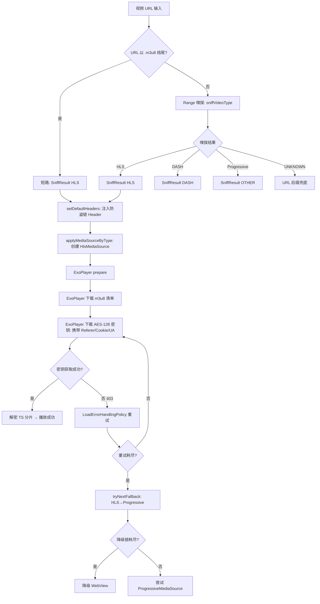

# Video Player m3u8 修复设计文档

## 0. URL 实证分析摘要

对用户提供的 m3u8 URL 执行 WebFetch 后，确认清单结构：
- 标准 HLS VOD，`#EXT-X-VERSION:3`
- **AES-128 加密**，密钥 URI 为相对路径 `/ckey/{hash}.bin`
- **密钥 URL 直接访问失败**（WebFetch 报错），说明密钥服务器可能需要特定 Header/Referer
- 11 个 TS 分片位于不同域名，带 `md=` 鉴权参数

**核心发现**：当前代码中 `applyMediaSourceByType` 创建 HlsMediaSource 时，**未调用 `setDefaultHeaders` 注入防盗链 Header**。ExoPlayer 内部下载 AES-128 密钥和 TS 分片时，HTTP 请求不携带 Referer/Cookie/UA，导致密钥服务器 403 → 播放失败。

---

## 1. Technical Approach

### 1.1 sniffVideoType m3u8 URL 短路检测（P0-1）

修改 `ExoPlayerHelper.kt` 的 `sniffVideoType` 方法，在 `isHtmlInterfaceUrl` 检查之后、Range 嗅探之前，添加 m3u8 URL 短路检测：

```kotlin
// P0-1: m3u8 URL 短路检测（URL 以 .m3u8 结尾时跳过 Range 嗅探）
// 根因：Range 嗅探对 .m3u8 URL 完全不必要（后缀已 100% 确定是 HLS），
// 且可能消耗 CDN 一次性 token / 触发限流 / 增加 500ms-3s 延迟
if (url.lowercase().substringBefore("?").substringBefore("#").endsWith(".m3u8")) {
    AppLog.put("sniffVideoType: short-circuit .m3u8 URL, skip Range sniff, urlPath=${sanitizeUrl(url)}")
    return SniffResult(contentType = C.TYPE_HLS, mimeType = MimeTypes.APPLICATION_M3U8)
}
```

位置：`sniffVideoType` 方法中，`isHtmlInterfaceUrl` 检查之后、`hasResult` 声明之前。

### 1.2 HLS 内部请求 Header 注入（P0-2，核心修复）

修改 `Exo2MediaPlayer.kt` 的 `applyMediaSourceByType` 方法，在创建 HlsMediaSource 之前注入防盗链 Header：

```kotlin
// P0-2: HLS 内部请求 Header 注入
// 根因：HlsMediaSource 内部下载 AES-128 密钥和 TS 分片时，使用 okhttpDataFactory 发送请求，
// 但当前 applyMediaSourceByType 未调用 setDefaultHeaders，导致密钥/分片请求无防盗链 Header
// 修复：在创建 HlsMediaSource 前注入 currentHeaders，确保所有 HLS 内部请求携带 Referer/Cookie/UA
if (currentHeaders.isNotEmpty()) {
    ExoPlayerHelper.setDefaultHeaders(currentHeaders)
}
```

位置：`applyMediaSourceByType` 方法中，`val effectiveUrl = ...` 之后、`val mediaSource: MediaSource = when (contentType)` 之前。

**注意**：`setDefaultHeaders` 对 `okhttpDataFactory` 设置默认请求属性，对所有后续请求生效。当前单播放器场景无并发问题。

### 1.3 移除 Cache-Control 请求头（P1）

修改 `ExoPlayerHelper.kt` 的 `okhttpDataFactory`，移除 `.setCacheControl(...)` 行：

```kotlin
// 修改前：
OkHttpDataSource.Factory(client)
    .setUserAgent(BROWSER_UA)
    .setCacheControl(CacheControl.Builder().maxAge(1, TimeUnit.DAYS).build())

// 修改后：
OkHttpDataSource.Factory(client)
    .setUserAgent(BROWSER_UA)
    // P1: 移除 setCacheControl —— 视频缓存由 SimpleCache 层处理，
    // Cache-Control: max-age=86400 对密钥请求和 TS 分片请求无价值，
    // 且可能干扰 CDN 行为（部分 CDN 不期望客户端发送 Cache-Control 请求头）
```

### 1.4 HLS 降级链去重（P2-1）

修改 `Exo2MediaPlayer.kt` 的 `buildFallbackTypes` 方法，HLS 嗅探成功时的降级链：

```kotlin
// 修改前：
C.TYPE_HLS -> listOf(C.TYPE_HLS, C.TYPE_HLS, C.TYPE_DASH)

// 修改后：
C.TYPE_HLS -> listOf(C.TYPE_HLS, C.TYPE_OTHER)  // HLS → Progressive
// P2-1: 第二次 HLS 完全相同必然失败，DASH 对 m3u8 无意义
// Progressive 降级可覆盖某些 CDN 的 .m3u8 URL 实际返回 mp4 流的场景
```

同时修改 UNKNOWN 场景的默认降级链：

```kotlin
// 修改前：
else -> listOf(C.TYPE_HLS, C.TYPE_HLS, C.TYPE_DASH)

// 修改后：
else -> listOf(C.TYPE_HLS, C.TYPE_OTHER)  // HLS → Progressive
```

### 1.5 HLS 分片重试策略增强（P2-2）

修改 `ExoPlayerHelper.kt` 的 `createMediaSource` 方法中 HlsMediaSource 的 LoadErrorHandlingPolicy：

```kotlin
// 修改前：
.setLoadErrorHandlingPolicy(object : DefaultLoadErrorHandlingPolicy() {
    override fun getRetryDelayMsFor(loadErrorInfo: LoadErrorHandlingPolicy.LoadErrorInfo): Long {
        return 3_000L
    }
})

// 修改后：
.setLoadErrorHandlingPolicy(object : DefaultLoadErrorHandlingPolicy() {
    // P2-2: 指数退避重试（1s/2s/4s/8s/16s），最多 5 次
    // 对齐 hls.js 策略：网络抖动时给予恢复时间，CDN 永久失效时快速降级
    override fun getRetryDelayMsFor(loadErrorInfo: LoadErrorHandlingPolicy.LoadErrorInfo): Long {
        val retryCount = loadErrorInfo.retryCount
        if (retryCount >= 5) return -1L  // -1 表示不再重试，触发降级
        return (1L shl retryCount) * 1000L  // 2^retryCount * 1000ms: 1s/2s/4s/8s/16s
    }
})
```

同样修改 `Exo2MediaPlayer.applyMediaSourceByType` 中 HlsMediaSource 的 LoadErrorHandlingPolicy（当前无此配置，添加）。

---

## 2. Architecture Decisions

### AD-01: m3u8 URL 短路嗅探

- **Context**: 当前所有视频 URL 都经过 Range 嗅探，对 m3u8 URL 发送 Range 请求不必要
- **Evidence**: 实际 WebFetch 确认 .m3u8 URL 返回标准 HLS 清单，`.m3u8` 后缀 100% 确定 HLS
- **Decision**: URL 以 .m3u8 结尾时跳过 Range 嗅探，直接返回 SniffResult(contentType=C.TYPE_HLS, mimeType=APPLICATION_M3U8)
- **Goal**: 减少 m3u8 播放失败率，加速起播
- **Tradeoff**: 跳过嗅探可能错过非标 m3u8 验证，但 ExoPlayer HLS 解析器会在 prepare 阶段快速失败
- **Status**: Proposed

### AD-02: HLS 内部请求 Header 注入（核心修复）

- **Context**: AES-128 加密 m3u8 的密钥请求需要防盗链 Header，当前 applyMediaSourceByType 未注入
- **Evidence**: WebFetch 确认密钥 URL `/ckey/{hash}.bin` 直接访问失败，说明密钥服务器可能需要 Referer/Cookie
- **Concern**: resolvingDataSource 仅处理 SPLIT_TAG URL，HLS 内部请求（密钥+TS分片）无任何 Header
- **Decision**: applyMediaSourceByType 创建 MediaSource 前调用 ExoPlayerHelper.setDefaultHeaders(currentHeaders)
- **Goal**: AES-128 密钥请求携带防盗链 Header，成功获取密钥，ExoPlayer 解密后播放
- **Tradeoff**: setDefaultHeaders 是全局设置，多播放器并发可能覆盖。当前单播放器场景可接受
- **Status**: Proposed

### AD-03: 移除 Cache-Control 请求头

- **Context**: okhttpDataFactory 设置了 Cache-Control: max-age=86400，影响所有视频数据源请求
- **Concern**: 密钥请求不应缓存（密钥可能动态生成），Cache-Control 可能干扰 CDN 行为
- **Decision**: 移除 setCacheControl，视频缓存由 SimpleCache 层处理
- **Goal**: 消除 Cache-Control 对密钥请求和 CDN 行为的干扰
- **Tradeoff**: OkHttp HTTP 缓存不再生效，但视频流已有 SimpleCache 缓存层
- **Status**: Proposed

### AD-04: HLS fallback 链去重

- **Context**: HLS 降级链 [HLS, HLS, DASH]，第二个 HLS 完全相同，DASH 对 m3u8 无意义
- **Decision**: 改为 [HLS, Progressive]，Progressive 覆盖某些 CDN 返回 mp4 流的场景
- **Goal**: 减少无效降级等待时间
- **Tradeoff**: Progressive 对真正 m3u8 必然 3003 错误，但快速失败优于 12-25s BUFFERING 超时
- **Status**: Proposed

### AD-05: HLS 分片重试策略增强

- **Context**: DefaultLoadErrorHandlingPolicy 固定 3s 重试，无上限
- **Decision**: 指数退避（1s/2s/4s/8s/16s），最多 5 次后放弃触发降级
- **Goal**: 网络抖动时给恢复时间，CDN 永久失效时快速降级
- **Tradeoff**: 总等待 31s（比固定 5 次 15s 稍长），但网络恢复概率更高
- **Status**: Proposed

---

## 3. Data Flow



---

## 4. File Changes

| 文件 | 变更类型 | 变更内容 |
|------|---------|---------|
| ExoPlayerHelper.kt | 修改 | sniffVideoType 添加 m3u8 短路检测（1.1）；okhttpDataFactory 移除 setCacheControl（1.3）；createMediaSource 增强 LoadErrorHandlingPolicy（1.5） |
| Exo2MediaPlayer.kt | 修改 | applyMediaSourceByType 添加 setDefaultHeaders 注入（1.2）；buildFallbackTypes HLS 降级链改为 [HLS, Progressive]（1.4）；applyMediaSourceByType HlsMediaSource 添加 LoadErrorHandlingPolicy（1.5） |
