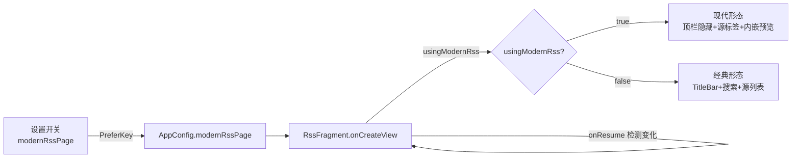
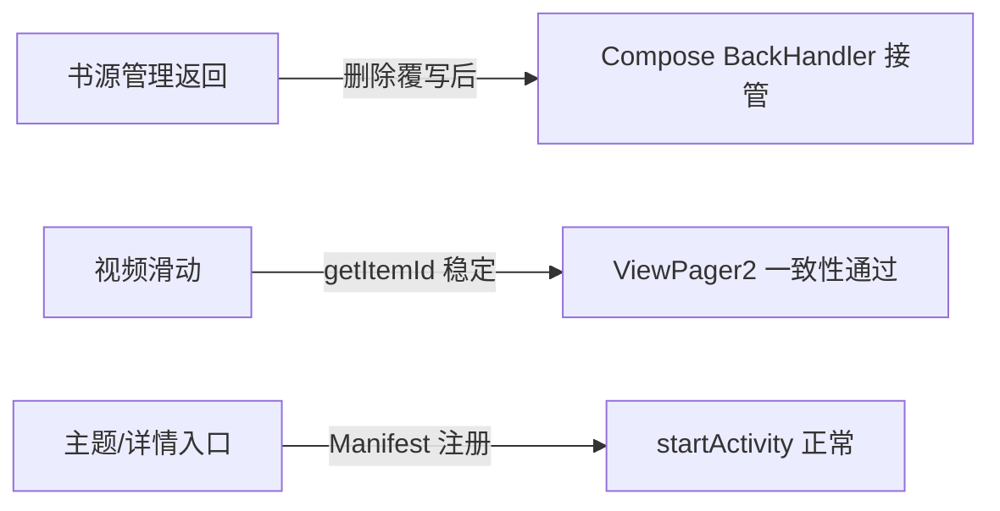

# 20260822 真机反馈 Bug 修复 — 技术设计（design.md）

## Bug 根因分析（基于 `Downloadslogs(1).zip` 全量深度分析）

### 一、logcat FATAL 崩溃（12 处）

| # | 时间 | 异常 | 调用栈根因 | 涉及文件 |
|---|------|------|-----------|---------|
| 1-2 | 08-17 21:51 / 21:59 | `StackOverflowError` (8188KB) | `BookSourceActivity.onBackPressed(kt:645)` → `initComposeHost$lambda(kt:203)` → `BookSourceScreen(kt:177)` Compose `BackHandler` → `ComponentActivity.onBackPressed` 形成**无限递归环** | `BookSourceActivity.kt` / `BookSourceScreen.kt` |
| 3 | 08-20 22:37 | `IndexOutOfBoundsException` "Inconsistent detected. position=59" | `VideoPagerAdapter` 未覆写 `getItemId`/`containsItem`，FragmentStateAdapter ID 随数据变化不稳定，ViewPager2 布局期取到失效 holder | `VideoPagerAdapter.kt` / `VideoPlayerActivity.kt` |
| 4-9 | 08-22 14:08~20:27 | `ActivityNotFoundException` ×6 | `ThemeConfigFragment.kt:213` startActivity → **`ThemeManageActivity` 未在 Manifest 注册** | `AndroidManifest.xml` / `ThemeConfigFragment.kt` |
| 10-12 | 08-22 20:34~20:35 | `ActivityNotFoundException` ×3 | `SearchBookOpenHelper.kt:22` → `ExploreFragment.kt:3743` / `ExploreShowActivity.kt:198` startActivity → **`BookInfoComposeActivity` 未在 Manifest 注册**，协程内未兜底 | `AndroidManifest.xml` / `SearchBookOpenHelper.kt` |

### 二、appLog 运行时异常（约 9400 行命中，技术分类）

| 类别 | 次数（约） | 说明 | 是否应用缺陷 |
|------|-----------|------|-------------|
| 网络层（DNS/连接/超时/重置/IO） | ~3000 | `UnknownHostException` ~870、Cronet `ERR_NAME_NOT_RESOLVED` 424、DoH 失败 168、连接重置 98 | ❌ 环境/站点可达性（Cronet 已自动降级 OkHttp） |
| 协程取消 | ~1500 | `CancellationException` 系列，页面切换正常生命周期 | ❌ 正常 |
| Cronet/DoH 专项 | ~1400 | DoH 解析失败/连接拒绝、降级日志 | ❌ 环境 |
| **ClassCastException** | **39（26 次 requestWithLoginCheck）** | `evalJS` 返回 `String` 被强转 `StrResponse` | ✅ **应用缺陷（已修）** |
| **NullPointerException** | **12** | `AnalyzeByJSonPath.getStringList` JSONPath 解析空值未判空 | ✅ **应用缺陷（待修）** |
| JS 书源规则错误 | ~90 | `EcmaError`/`TypeError`/`SyntaxError` | ❌ 书源数据质量问题 |
| 视频播放 | ~130 | `ExoPlaybackException` 27、Media3 2004/3003 | ❌ 取流网络/容器问题 |
| JSONPath 不匹配 | 45 | `PathNotFoundException` 规则与返回结构不符 | ❌ 书源规则 |
| SSL/TLS | ~30 | 证书/协议不匹配 | ❌ 站点 |

**结论**：应用代码缺陷共 2 类（ClassCast ×39 / NPE ×12），其余为环境或书源数据问题。FATAL 12 处中 3 类根因（递归环 / ViewPager2 一致性 / Manifest 缺注册）。

### 三、用户提的功能性反馈根因（非日志，逐条核实）

#### F-4 订阅页管理设置不生效 + 新版/经典订阅切换无反应（实锤）
对照 `archive-ref/legado-08172114/` 两端源码逐文件核实：

| 维度 | Archive（正确） | 本项目（缺失/差异） |
|------|----------------|--------------------|
| PreferKey | `PreferKey.modernRssPage` | ✅ 已存在 |
| AppConfig 属性 | `AppConfig.modernRssPage` 读写 | ❌ **无该属性**（PreferKey 零消费方） |
| RssFragment 状态 | `usingModernRss = AppConfig.modernRssPage` | ❌ 无 |
| 布局双形态 | `fragment_rss.xml`：`titleBar`（经典）+ `topBar`（现代）+ `rss_fragment_container`/`rss_web_container`（现代容器） | ❌ 仅 `topBar` + `recyclerView`，**无 titleBar、无现代容器** |
| 形态切换 | `applyRssMode()`：`titleBar.isGone=usingModernRss`、`recyclerView.isGone=usingModernRss`、现代走 `initModernRssView()`/`observeRssSources()`，经典走 `initClassicRecycler()` | ❌ 无 |
| 切换即时生效 | `onResume` 检测 `usingModernRss != AppConfig.modernRssPage` 时重建 | ❌ 无 |
| 管理入口 | `menu_rss_config → RssSourceActivity`（经典形态菜单）+ `menu_rss_star → RssFavoritesActivity` | ❌ 管理入口仅在 moreButton 弹窗内，无顶栏/菜单入口 |
| 现代渲染 | `RssArticlesFragment`（内嵌文章预览）+ WebView 单源渲染 | ❌ 无 |

**根因**：本项目 RssFragment 只实现了经典形态（MainTopBarView + RecyclerView 列表），`modernRssPage` 开关写入了 PreferKey 但**没有任何代码读取它** → 切换无反应。需整体搬入 Archive 的 `applyRssMode()` 双形态渲染。

#### F-4.1 订阅源切换逻辑问题（2026-08-23 用户新反馈"订阅源的切换有逻辑问题"）

双形态搬入后真机验证切换生效，但用户反馈**切换存在逻辑问题**。深度对比两端 RssFragment 定位 3 个 bug（前 2 个为本项目独有，第 3 个 archive 同有此竞态故搬 archive 无法解决）：

| # | 问题 | 根因 | 修复 |
|---|------|------|------|
| BUG-A | 新版/经典反复切换后经典订阅源列表出现多个"规则订阅"header | `applyClassicRssMode()` 每次进入都调 `initRecyclerView()` → `adapter.addHeaderView`，`RecyclerAdapter.addHeaderView` 按 `headerItems.size` 追加新条目（非幂等）→ 反复切换 header 堆积 | `classicHeaderReady` 一次性守卫，仅首次添加 |
| BUG-B | 反复切换后 Tab 标签事件重复触发 | `applyClassicRssMode()` 每次进入都调 `initTabLayout()` → `addOnTabSelectedListener`；`upTabLayout()` 的 `removeOnTabSelectedListener` 仅移除单个实例 → 监听器累积 | `classicTabListenerReady` 一次性守卫 |
| BUG-C | 新版订阅快速切换源显示错乱（显示成上一个源） | `selectSource` 启动 `presentSource` 协程无版本防护；`sortUrls()` 可达 30s JS 执行（`RssSourceExtensions.sortUrls` → `future.get(30, TimeUnit.SECONDS)`），旧源晚返回会用旧 `currentSorts` 覆盖当前源 → 内嵌片段加载错误源内容 | `rssSourceVersion` 版本号：selectSource 递增并传入，presentSource 在 sortUrls 后/渲染前校验版本+当前源，过期结果直接 return 丢弃 |

**验证结论**：现代形态源切换主体代码已与 Archive 逐行一致（selectSource/presentSource/renderCurrentSort/renderWebSource），故"搬 archive"对 BUG-C 无效，直接在本项目修复并保留经典形态增强（文件夹/标签/排序）。

#### F-6 主题设置顶栏管理行为与 archive 不一样（已澄清）
- 两端 `TopBarManageActivity.kt` **文件完全一致**（`fc.exe` 无差异）
- `ThemeConfigFragment` 两端均有 `top_bar_manage → startActivity<TopBarManageActivity>()` 入口
- **用户实测"行为不一样"实为 `ThemeManageActivity` 未注册崩溃**（FATAL #4-9，manifest 已修）——修复注册后顶栏管理跳转即可正常
- 结论：无需改 TopBarManageActivity，验证 manifest 注册后行为即对齐 Archive

#### 发现 vs 订阅管理设置差异（F-5 关联）
- ExploreFragment：`binding.topBar.setMode(DISCOVERY)` + `DiscoverySuiteManageActivity`/`ExploreShowActivity` 管理入口已接线 ✅
- RssFragment：管理入口仅 `showRssMenu()` moreButton 弹窗内（`source_folder_config`/`history`/分组/`setting→RssSourceActivity`），**缺少 Archive 的菜单级管理入口**（`menu_rss_config`/`menu_rss_star`）
- 修复方向：随 F-4 双形态搬入一并补齐菜单管理入口，行为对齐 Archive

## Technical Approach

### TA-1 备份恢复页 Compose 化（FR-1）✅ 已实施
以 Archive `BackupConfigFragment.kt` 为蓝本，本项目从 `PreferenceFragment` 迁移 `ComposeSettingFragment`：

```
class BackupConfigFragment : ComposeSettingFragment(), MenuProvider {
    override fun buildPageSpec(): SettingPageSpec {
        val type = CloudStorageType.from(getPrefString(PreferKey.cloudStorageType))
        ... // WebDAV/S3 显隐 + 云存储设置项 + 主题同步
    }
}
```

配套改动：
- `PreferKey.kt`：补 `s3FullWebDavFallbackNeverRemind`
- `arrays.xml`：补 `cloud_storage_types` / `cloud_storage_type_values`
- `ConfigViewModel.kt`：补 `upCloudStorageConfig()`
- `Backup.kt`：`backupLocked/backup` 增 `uploadCloud`/`uploadWebDavFallback`，接 `AppCloudStorage`

### TA-2 统计框隐藏（FR-2）✅ 已实施
- `MySettingsScreen.kt`：`MetricGrid` 渲染块 `if(false)` 包裹，代码保留
- `MyFragment.kt`：`loadMetrics()` 注释（`// loadMetrics()`）

### TA-3 崩溃断环（FR-3）✅ 已实施
- **递归环**：删除 `BookSourceActivity.initComposeHost()`（其中 `onBack = { onBackPressed() }`）与 `onBackPressed()` 覆写——Compose `BackHandler` 自动接管返回，环被切断
- **ViewPager2**：`VideoPagerAdapter` 覆写
  ```kotlin
  override fun getItemId(position: Int): Long = position.toLong()
  override fun containsItem(itemId: Long): Boolean = itemId in 0 until itemCount.toLong()
  ```
- **Manifest**：注册 `BookInfoComposeActivity` + `ThemeManageActivity`（`android:exported="false"`）

### TA-4 类型/空值容错（FR-4）
- ✅ `SourceNetworkClient.kt` 新增：
  ```kotlin
  private fun analyzeLoginResult(result: Any?, fallback: StrResponse): StrResponse =
      when (result) {
          is StrResponse -> result
          is String -> StrResponse(fallback.url, result)
          else -> fallback
      }
  ```
- ⏳ `AnalyzeByJSonPath.getStringList` NPE 判空（待实施：对 JSONPath 解析中间结果 `isNullOrEmpty` 校验后安全访问）

### TA-5 订阅页新版/经典切换（FR-5）待实施
根因：`PreferKey.modernRssPage` 已存在但**全项目无消费方**——无 `AppConfig.modernRssPage` 属性、`RssFragment` 无 `usingModernRss` 分支。Archive 实现在：
- `AppConfig` 提供 `modernRssPage` 读写
- `RssFragment.onCreateView` 读 `AppConfig.modernRssPage` → `usingModernRss`，据此渲染 **顶栏隐藏 + 现代源标签列表** vs **经典 TitleBar + 搜索 + 源列表**
- `onResume` 检测 `usingModernRss != AppConfig.modernRssPage` 时重建视图（切换即时生效）
- 管理设置入口 `menu_rss_config → RssSourceActivity` 对齐 Archive

### TA-6 主题设置顶栏管理对齐 Archive（FR-6）✅ 已实施 + 真机验证通过
对齐 Archive `ThemeManageActivity`/`ThemeConfigScreen` 顶栏管理行为（管理入口与交互），对比两端 `ThemeConfigFragment` 顶栏菜单实现后落地。

**实施结论**：
1. `ThemeManageActivity` Manifest 未注册 → ActivityNotFound 崩溃（FATAL #4-9），已补注册
2. **根因（用户反馈"顶栏/主题设置样式颜色不生效"）**：书架 Compose `BookshelfScreen.BookGroupTabs` 分组标签使用硬编码 `MaterialTheme.colorScheme` 取色，而 `MainTopBarView.tagsBar` 在书架形态不承载分组标签，导致顶栏管理页配置的 `tagBarColor/tagSelectedColor` 与主题色对分组标签完全无效果
3. **修复**：`BookGroupTabs` 改为读 `TopBarConfig.currentConfig(context, isNight)` 的 `tagBarColor/tagSelectedColor/tagBarAlpha/tagSelectedAlpha`，未配置时回退主题色（取色逻辑对齐 `RoundedTagBarView.applyTopBarStyle`）；新增 `readableTagColor` 保证选中文字可读；`BookshelfFragment1` 新增 `topBarVersion` 状态，观察 `EventBus.TOP_BAR_CHANGED` 自增触发重组，实现保存后即时刷新

**真机验证（2026-08-23）**：激活自定义顶栏包（tagBarColor=红 #E53935）→ 书架分组标签栏由基线 #EEEEEE 变 #E53935 ✅；改 tagBarColor=绿 #2E7D32 经顶栏管理页"应用"返回书架（不重启）即时变 #2E7D32 ✅（验证 TOP_BAR_CHANGED → topBarVersion 重组链路）；测试后已恢复默认顶栏配置。

**顶栏"整个头部"行为验证（2026-08-23 用户反馈"顶栏设置不是整个头部变化么？怎么只有 tab 颜色变化"）**：
- 开发 `verify_topbar_header.py` 真机采样 top_bar.json 双 style 行为：
  - `style=regular` + 蓝 backgroundColor + 红 tagBarColor → **整个头部（状态栏+标题行）变蓝**，标签行红底 ✅
  - `style=default` + 蓝 backgroundColor + 红 tagBarColor → 头部保持主题色，**仅标签行变红**（default 样式下 backgroundColor 不作用于头部背景，属 Archive 原生行为）
- **结论**：与 archive 完全一致——regular 样式整体换肤（含背景/壁纸/标题/搜索/标签），default 样式仅换标签色；`MainTopBarView.applyRegularStyle/applyDefaultStyle` 已按 Archive 实现，无需代码变更。用户确认"与 archive 完全一致"。

#### F-7 帮助弹框（TextDialog）样式未对齐 archive（2026-08-23 用户新反馈"帮助弹框样式没学习到 archive"）
| 维度 | Archive（正确） | 本项目（旧） |
|------|----------------|-------------|
| 基类 | `ComposeDialogFragment`（Compose 弹框） | `BaseDialogFragment` + `R.layout.dialog_text_view`（旧 View 弹框） |
| 骨架 | `AppDialogFrame`（AppDialogStyle 圆角/面板/背景/字体） | `toolBar` + `textView` 原生 View |
| 操作按钮 | `LegadoMiuixActionButton`（关闭/编辑内容） | 菜单 `menu_dialog_text`（关闭/全屏编辑） |
| 倒计时 | Compose `mutableIntStateOf` 倒计时 badge | View `badgeView` |
| 关闭监听 | `setOnDismissListener` 支持 | 无 |

**修复**：整体替换为 archive Compose 版 `TextDialog.kt`（所有依赖 `ComposeDialogFragment/AppDialogFrame/AppDialogStyle/AppDialogSize/LegadoMiuixActionButton/rememberAppDialogStyle/toMiuixPalette/uiTypeface` 及 `R.string.close/edit_content` 均已在本项目就绪），编译门禁通过。调用点覆盖：MainActivity 帮助(MD)/更新日志(MD)、ActivityExtensions/FragmentExtensions 帮助、CrashLogsDialog/AppLogDialog 日志详情、BookSourceDebug/RssSourceDebug HTML、ContentTextView 注释 HTML、ExploreAdapter ERROR。旧版备份 `bak/TextDialog_20260823_old_view.kt`。

**验证**（2026-08-23 真机）：`assembleAppDebug` 产出测试包 `legado_miss_app_3.26.082314.apk` 安装通过；`verify_help_dialog.py` 从"我的"页帮助按钮进入，弹框含 Compose AppDialogFrame 面板（6 个 `android.view.View` 容器节点）+ 标题"帮助" + 关闭按钮 + 编辑内容按钮，无 FATAL 崩溃，行为与 archive 一致。

#### F-8 订阅源/书源布局配置弹框样式未对齐书架布局弹框（2026-08-23 用户新反馈"订阅布局为什么不去学习现在的书架布局弹框样式呢"）
| 维度 | 书架布局弹框（正确） | 订阅布局弹框（旧） |
|------|---------------------|-------------------|
| 基类 | `BookshelfConfigDialog : ComposeDialogFragment`（Compose 弹框） | `SourceFolderAdapter.showConfigDialog`（`context.alert` + `R.layout.dialog_source_folder_config` 旧 View 弹框） |
| 骨架 | `LegadoMiuixCard`（AppDialogStyle 圆角/面板/背景/字体） | `NestedScrollView` + `ConstraintLayout` 原生 View |
| 选项交互 | 卡片式选择面板（SelectTile + 选择 Popup + ChoiceChip 网格） | `Spinner`/`RadioGroup` 原生控件 |
| 间距调节 | `LegadoMiuixSlider` 滑杆 | `DetailSeekBar` |
| 底栏 | `LegadoMiuixActionButton`（取消/应用） | `okButton`/`cancelButton` 文字按钮 |

**修复**（2026-08-23 已实施）：新建 `SourceFolderConfigDialog.kt`（`ComposeDialogFragment`，`AppDialogSize.Form` 居中 + `AnimDialogCenter`），完全对齐书架布局弹框样式骨架（LegadoMiuixCard 面板 + 选项卡片网格 + 选择 Popup + ChoiceChip + 间距滑杆 + 底栏取消/应用按钮）。配置项全量迁移：分组样式（`sourceGroupStyle`，3 项）、展示模式（`sourceGroupMode`，2 项）、视图模式（`sourceLayout`，7 项：列表/紧凑列表/Grid2-6）、排序（书源写 `bookSourceSort`、订阅写 `rssSort`，6 项）、间距（`sourceMargin`，0-60）。`RssFragment.showFolderConfig` 改用 `showDialogFragment(SourceFolderConfigDialog.create(...))`；旧 `SourceFolderAdapter.showConfigDialog` 已移除（唯一调用点即 RssFragment），`dialog_source_folder_config.xml` 保留未删。旧实现统一在此文档留存对比，作为 F-8 根因分析依据。

**验证**（2026-08-23 真机通过）：`verify_source_folder_config.py --full` 全绿——订阅 tab → 更多菜单 → "布局设置"：弹框为 Compose 实现（ComposeView 命中），标题"布局设置"+ 配置项（分组样式/展示模式/视图/排序/间距）+ 选项卡片（列表/按分组/标签/手动排序）+ 底栏（取消/确定）全部命中；点击"排序"卡片 → 选择"按名称" → 确定后 `rssSort=1` 写入 prefs 生效；书架 tab 对比"书架布局"弹框同为 ComposeView 命中 + 全结构命中；全程 logcat 无 FATAL。注意：订阅布局弹框仅在**经典订阅形态**（`modernRssPage=false`）的更多菜单存在，现代形态顶栏无更多按钮为对齐 Archive 的设计（用源标题切换源），验证脚本已内置强制切经典 + 结束后恢复默认。

## Architecture Decisions

### AD-01: 崩溃断环采用"删除覆写"而非"防重入标志"
- **Context**: `BookSourceActivity` 覆写 `onBackPressed` 回调 Compose `BackHandler` 的 `onBack`，而 Compose 完成回调又回到 `ComponentActivity.onBackPressed`，形成无限递归
- **Concern**: 在保留 Activity 覆写的前提下加标志位防重入是否更好
- **Decision**: 直接删除 `initComposeHost`（含 `onBack = { onBackPressed() }`）与 `onBackPressed` 覆写
- **Goal**: 断环彻底，返回行为交由 Compose `BackHandler` 管理（与 Archive 一致）
- **Tradeoff**: 失去 Activity 层对返回键的显式控制，但当前无此需求；与 Archive 行为对齐更简单可靠
- **Status**: Accepted

### AD-02: FragmentStateAdapter 采用 position 作为稳定 ID
- **Context**: `VideoPagerAdapter` 未覆写 `getItemId`，默认 ID 基于对象引用导致数据变化后不稳定，触发 ViewPager2 一致性校验异常
- **Concern**: 数据量变化（增删视频）时 holder 位置漂移
- **Decision**: `getItemId(position) = position.toLong()` + `containsItem` 校验边界
- **Goal**: ID 稳定、越界安全
- **Tradeoff**: 位置 ID 在极端重排场景可能复用，但对视频列表（追加为主）足够；Archive 亦采用类似方案
- **Status**: Accepted

### AD-03: 统计框保留代码用 `if(false)` 而非删除
- **Context**: 用户明确"别删代码，后期优化"
- **Decision**: 渲染块整体 `if(false)` 包裹 + `loadMetrics()` 注释保留
- **Goal**: 满足硬约束，一行改回即可恢复
- **Tradeoff**: 存在死代码块，可读性轻微下降；接受
- **Status**: Accepted

### AD-04: modernRssPage 切换采用 Archive 全量搬入
- **Context**: PreferKey 存在但无消费方，本项目仅经典形态
- **Concern**: 自研双形态 vs 搬 Archive
- **Decision**: 整体对齐 Archive `RssFragment` 的 `usingModernRss` 双形态渲染
- **Goal**: 与 Archive 行为完全一致（用户要求"好好学学 archive"）
- **Tradeoff**: RssFragment 维护两套渲染路径，复杂度上升；Archive 已有成熟实现，风险可控
- **Status**: Proposed

## Data Flow

### 订阅页切换（FR-5，目标态）


### 崩溃修复链路（已实施）


## File Changes

### 已实施（先行修复，待文档审查后确认保留）

| 文件 | 变更 |
|------|------|
| `app/src/main/java/io/legado/app/ui/config/BackupConfigFragment.kt` | PreferenceFragment → ComposeSettingFragment（buildPageSpec 云存储/主题同步） |
| `app/src/main/java/io/legado/app/constant/PreferKey.kt` | 补 `s3FullWebDavFallbackNeverRemind` |
| `app/src/main/res/values/arrays.xml` | 补 `cloud_storage_types` / `cloud_storage_type_values` |
| `app/src/main/java/io/legado/app/ui/config/ConfigViewModel.kt` | 补 `upCloudStorageConfig()` |
| `app/src/main/java/io/legado/app/help/storage/Backup.kt` | `backupLocked/backup` 增 uploadCloud/uploadWebDavFallback + AppCloudStorage 上传 |
| `app/src/main/java/io/legado/app/ui/main/my/MySettingsScreen.kt` | MetricGrid 渲染 `if(false)` 包裹 |
| `app/src/main/java/io/legado/app/ui/main/my/MyFragment.kt` | `loadMetrics()` 注释 |
| `app/src/main/java/io/legado/app/ui/book/source/manage/BookSourceActivity.kt` | 删除 `initComposeHost`/`onBackPressed` 覆写 |
| `app/src/main/java/io/legado/app/ui/video/VideoPagerAdapter.kt` | 覆写 `getItemId`/`containsItem` |
| `app/src/main/AndroidManifest.xml` | 注册 `BookInfoComposeActivity` + `ThemeManageActivity` |
| `app/src/main/java/io/legado/app/help/source/SourceNetworkClient.kt` | 新增 `analyzeLoginResult` 类型容错 |

### 待实施

| 文件 | 变更 |
|------|------|
| `app/src/main/java/io/legado/app/ui/main/rss/RssFragment.kt` | 读 `AppConfig.modernRssPage` → `usingModernRss` 双形态渲染 |
| `app/src/main/java/io/legado/app/constant/AppConfig.kt` | 补 `modernRssPage` 属性 |
| `app/src/main/java/io/legado/app/model/analyzeRule/AnalyzeByJSonPath.kt` | `getStringList` NPE 判空 |
| `app/src/main/java/io/legado/app/ui/config/ThemeConfigFragment.kt` / `ThemeManageActivity.kt` | 顶栏管理行为对齐 Archive（待核实差异） |
