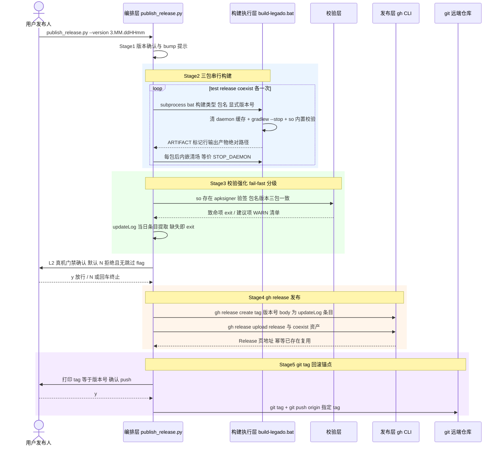
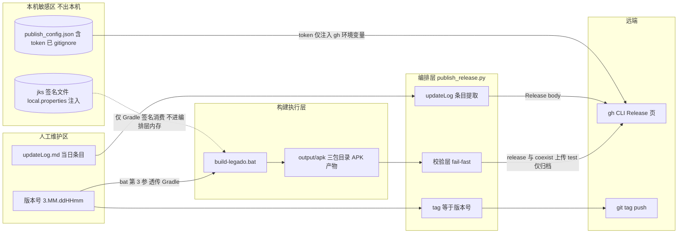

# 构建发布自动化设计（build-release-automation）

> 2026-08-30 · 设计文档 · 事实源：docs/temp-analysis/build-release-analysis-20260830.md
> 选定方案：**选项 1 —— publish_release.py 升级为一键发布编排器**（版本 bump → 三包构建 → 校验强化 → gh release → git tag），build-legado.bat 保持薄层；附带治理 test.yml/web.yml 幽灵触发器注释 + AppUpdateGitee.kt 检查更新源地址修正。

## 1. Technical Approach

### 1.1 编排器四层架构

| 层 | 载体 | 职责 | 边界 |
|----|------|------|------|
| 发布编排层 | `scripts/publish_release.py` 主流程 | 五阶段状态机调度、交互确认、`--dry-run` 贯穿、脱敏输出 | 不直接实现构建细节，只调度 |
| 构建执行层 | `build-legado.bat`（子进程复用） | 清 daemon 缓存 + `gradlew --stop` 清场、三包串行构建、libcronet.so 内置校验、显式版本号透传（第 3 参） | 微调：成功路径输出机器可读产物清单行 |
| 校验层 | 编排器内校验模块 | 产物存在性 / so 强制校验 / apksigner 验签 / 包名·版本三包一致性 / updateLog 当日条目，fail-fast 分级 | 致命项 exit，建议项 WARN 清单 |
| 发布层 | gh CLI（子进程） | Release 创建 + asset 上传（替代 requests，规避 SSL/51MB 大文件双坑）、git tag 推送 | 幂等：tag 已存在复用、同名 asset 跳过 |

### 1.2 主流程五阶段

1. **Stage 1 版本确认**：`--version` 显式传入或扫描 output/apk 现有最大版本 bump（`3.MM.ddHHmm` 公式），确认三包将共用同一版本号。
2. **Stage 2 三包构建**：按 test → release → coexist 顺序 subprocess 调用 bat（release/coexist 传显式版本第 3 参），每包构建后内嵌等价 `:STOP_DAEMON` 清场（不可跳过步骤）。
3. **Stage 3 校验强化**：fail-fast 分级校验（见 AD-03），并提取 updateLog 当日条目作为 Release body（缺失 = exit，不再回退默认文案）。
4. **Stage 4 gh release 发布**：gh CLI 创建 Release（body=updateLog 条目）+ 上传三包 asset（test 包经 get_upload_name 加 `_debug` 后缀防同名冲突），release/coexist 保持原文件名。
5. **Stage 5 git tag 回滚锚点**：创建 tag=版本号，**push 前打印供人工确认**，确认后 `git tag` + `git push origin <tag>`。

### 1.3 编排时序图

## 2. Architecture Decisions

> Y-Statement 模板：Context / Concern / Decision / Goal / Tradeoff / Status。

**AD-01 编排器选 publish_release.py 扩展而非新建**
- Context：publish_release.py 已 526 行，具备幂等发布、3 次指数退避重试、双平台 API、hide_token 脱敏、--dry-run 等实证基础。
- Concern：若另建 orchestrator 脚本，将形成双发布入口，规范与脚本必然漂移，幂等逻辑需二次实现。
- Decision：在 publish_release.py 内扩展五阶段编排（内部可函数级/模块级拆分），不新增第二个发布入口。
- Goal：单一发布事实源，规范只需描述一条命令。
- Tradeoff：单文件复杂度上升（预计 526 → 700+ 行），牺牲"全新干净实现"的可读性，换取历史幂等/重试/脱敏逻辑零重写风险。
- Status: Accepted

**AD-02 构建层复用 bat 子进程而非重写 Python 构建**
- Context：build-legado.bat 249 行已实证清场（`:STOP_DAEMON` + transforms 缓存清理 + 跨盘长路径修复）、so 强制校验、三包目录分发、显式版本号透传。
- Concern：Python 重写构建会把清场与缓存修复逻辑二次实现，任何漂移都会复现 32G 内存打爆或跨盘构建失败的铁证问题。
- Decision：编排器 subprocess 顺序调用 bat（release/coexist 传显式版本第 3 参），bat 仅微调输出机器可读产物清单行供解析。
- Goal：构建逻辑单一事实源，清场门禁零改动继承。
- Tradeoff：跨进程解析 bat 输出存在脆弱性（依赖标记行格式约定），编排器无法细粒度介入构建内部步骤；bat 硬编码本机环境路径的迁移债继续保留。
- Status: Accepted

**AD-03 校验 fail-fast 策略分级**
- Context：现状缺包仅 WARN 不阻断、updateLog 缺条目静默回退"自动发布"默认文案，坏包可能静默走到发布层。
- Concern：全部 exit 会误伤可容忍场景（历史版本重发），全部 WARN 会重演"静默发布坏包"。
- Decision：分级——致命项 exit 非 0：任一包缺失、updateLog 当日条目缺失、libcronet.so 缺失、包名/版本三包不一致；建议项 WARN 清单：版本号日期建议、非关键命名偏差等（仅汇总打印不阻断）。
- Goal：坏包不可能进入发布层，同时保留清单式提示的可观察性。
- Tradeoff：牺牲"带病发布"的灵活性——想发无当日 updateLog 条目的版本必须先补条目（符合 version-delivery-sync 门禁本意）。
- Status: Accepted

**AD-04 git tag 作为回滚锚点**
- Context：现状 Release 幂等复用但无 git tag，版本与源码快照的映射只靠记忆，回滚只能重传 asset。
- Concern：无 tag 时无法把任意 Release 精确 checkout 回对应源码状态。
- Decision：编排器创建 tag=版本号（如 `3.26.083020`），push 前打印 tag 名供人工确认，确认后推送。
- Goal：每个 Release 可溯源到源码快照，回滚有物理锚点。
- Tradeoff：tag push 后删除需人工操作（不做自动回收）；本地构建无 CI commit 校验，若 tag 指向未推送的本地提交，需保证提交与 tag 一并 push。
- Status: Accepted

**AD-05 真机 L2 门禁交互确认默认 N**
- Context：分析报告 E 节铁证——产物未经真机验证即发正式包是已被证伪的文化（本项目步骤 5.5 门禁 + 2026-07-25 Activity 抢占事故）；真机验证只有人能做。
- Concern：无人值守全自动会在 L2 未通过时直接发布正式包，绕过门禁 2。
- Decision：Stage 4 发布前交互确认「L2 已通过(y/N)」默认 N（回车/N/任意非 y 均终止），且**不提供任何 flag 级跳过**（禁止 `--force-skip` 类参数存在）。
- Goal：门禁完整性优先于自动化率。
- Tradeoff：牺牲"无人值守全自动"能力——发布全程必须有人值守；对 `--dry-run` 无影响（dry-run 仅模拟，不触达真实发布动作）。
- Status: Accepted

**AD-06 幽灵触发器注释 + 更新源地址修正（附带治理）**
- Context：test.yml（push main）/ web.yml（push main, modules/web/**）触发器仍激活，但本项目 secrets 未配置、auto-commit 仅上游仓生效，push 只产生幽灵失败记录；AppUpdateGitee.kt 检查更新指向旧源 lyc486/legado，而发布脚本实际发往 Chinashitou/legado，用户检查更新拉不到新版本。
- Concern：触发器噪音掩盖真实 CI 信号；检查更新链路断裂使发版自动化失去闭环意义。
- Decision：注释两个 yml 的 push 触发器（保留 workflow_dispatch 手动能力）；AppUpdateGitee.kt 源地址改为与发布目标一致。
- Goal：消除治理债，"发布 → 用户检查更新"链路闭环。
- Tradeoff：附带治理与编排器主线耦合在同一次交付，回滚需整体回退；AppUpdateGitee.kt 的真实路径与查询逻辑实施前必须 Read 核验（分析报告仅实证"不一致"事实，属临时文档结论）。
- Status: Accepted

**AD-07 分层确认协议（人工交互 / AI 代答双通道）**
- Context：发布编排的确认点（构建前/L2/tag）在纯人工终端用 stdin y/N 即可；但 AI 代理执行场景下脚本运行在非交互 shell，stdin 确认会挂死，需要可参数化的续跑通道。
- Concern：若所有确认都可 flag 传递，等于提供全自动无门禁旁路，AD-05 的"门禁不可绕过"被架空；若全部强制交互，AI 场景编排器无法落地。
- Decision：分层——①构建前确认与 tag 确认支持 `--confirm-stage <stage>` 参数化续跑（AI 通过 AskUserQuestion 获得用户放行后代答）；②L2 真机门禁**不接受口头放行**：必须同时提供 `--l2-evidence <L2报告路径>`，编排器校验该文件存在且修改时间为当日，否则 exit 拒绝；③stdin 交互模式保持默认（人工双击场景零参数）。
- Goal：AI 可代为执行发布编排，但 L2 门禁的放行权始终在用户手中且留有当日证据文件。
- Tradeoff：牺牲"AI 全自动零询问发版"的极致流畅（L2 必须真实跑过测试产出报告）；引入证据文件校验的少量复杂度。
- Status: Accepted

## 3. Data Flow

**脱敏边界（四条硬规则）**

| 数据 | 流向边界 | 规则 |
|------|---------|------|
| gh token | publish_config.json → 编排器内存 → gh CLI 环境变量 | 不落日志；所有输出经 hide_token 脱敏；文件已被 .gitignore 排除 |
| jks | local.properties → Gradle 签名任务 | 不进编排器内存/输出/git；编排器只校验其存在性不读取内容 |
| 版本号/updateLog 条目 | 可进入 Release body、tag 名、日志 | 非敏感，允许明文 |
| 产物 APK | output/apk → gh release asset | 上传前必须过校验层，test 包只归档不上 Release |

## 4. File Changes

| 文件 | 操作 | 要点 |
|------|------|------|
| `scripts/publish_release.py` | 重构扩展 | 五阶段编排主流程；构建层 subprocess 调 bat + 解析 ARTIFACT 标记行；校验强化（fail-fast 分级，缺包/updateLog 缺条目从 WARN 升级 exit）；gh CLI 替代 requests 上传（解决 `SESSION.verify=False` TODO 与 51MB SSLEOFError）；git tag 创建 + push 前人工确认；L2 门禁交互默认 N 且无跳过 flag + `--l2-evidence` 证据绑定（AD-07）；`--confirm-stage` 分层续跑（AD-07）；保留既有幂等/重试/hide_token/--dry-run 能力 |
| `publish.bat`（项目根，新建） | 新建薄壳 | 人工入口：透传 `--version`/`--dry-run` 等参数到 publish_release.py；打印五阶段与确认点说明；不承载任何逻辑（单一事实源仍是 py） |
| `build-legado.bat` | 微调 | 构建成功路径追加输出机器可读产物清单行（如 `[ARTIFACT] <产物绝对路径>`）供编排器解析；构建/清场/so 校验逻辑零改动 |
| `.github/workflows/test.yml` | 注释触发器 | 注释 push(main) 触发，保留 workflow_dispatch；消除幽灵失败记录 |
| `.github/workflows/web.yml` | 注释触发器 | 注释 push(main, modules/web/**) 触发，保留 workflow_dispatch |
| `app/src/main/java/io/legado/app/help/AppUpdateGitee.kt` | 修正 | 检查更新源地址由 lyc486/legado 改为与发布目标一致（Chinashitou/legado）。⚠️ 真实路径与查询逻辑**实施前必须 Read 核验**——分析报告 B6/§6 仅实证"脚本发 Chinashitou/legado 但查询指向 lyc486/legado"的不一致事实，实际类名/路径/引用点以源码为准 |
| `docs/project-rules/apk-publish-workflow.md` | 重写 | 七步标准发布 → 单命令流程（`publish_release.py --version <v>` 一键 + 五阶段说明 + 门禁交互点说明）；保留 token 安全（§2.3）/反模式（§7）；§6 优化项勾销记录（变体识别/源地址不一致/SSL 根因/gh fallback 由本方案覆盖） |
| `docs/project-flow/ci-cd-pipeline.md` | 同步 | 一键编排现状、幽灵触发器已注释说明、"本地构建为唯一交付链路"结论更新 |
| `docs/project-flow/quick-reference.md` | 命令速查 | 新增一键发布命令、`--dry-run`、tag 回滚（checkout tag + 重发）速查行 |
| `app/src/main/assets/updateLog.md` | 追加 | 本任务自身变更条目（按 version-delivery-sync：编译/发布前基于 git diff 更新，禁止交付期补写） |

## 5. 验证与卡点设计

### 5.1 三级验证

| 级别 | 内容 | 验收标准 |
|------|------|---------|
| L1 | 编排器 `--dry-run` 全流程走查 | 五阶段全部模拟执行：打印将执行的 bat 命令/校验结果清单/将创建的 Release 与 tag；**无副作用**（无新包、无 Release、无 tag）；输出经脱敏自检（token 明文零出现） |
| L2 | 真机门禁确认交互 | `quick_build_install.py` + `l2_verify_video_player.py` 走通后，在编排器 L2 确认点分别演练：默认回车 → 终止；输入 y → 放行继续发布流程 |
| L3 | 真实发版演练一轮 | 完整一键发布：版本 bump → 三包构建 → 校验通过 → 双平台 Release + asset 齐全 → tag push 成功；回验 Release 页 asset 可下载、`git checkout <tag>` 可还原源码快照 |

### 5.2 六条不可自动化卡点（源自分析报告 E 节，编排器落点）

| # | 卡点 | 编排器落点 |
|---|------|-----------|
| 1 | 真机测试门禁（步骤 5.5 / L2） | Stage 4 前交互确认默认 N，无任何 flag 跳过（AD-05） |
| 2 | updateLog 人工校对 | 当日条目缺失从 WARN 升级 fail（exit）；脚本只提取不生成，文字合并/漏项由人审（AD-03） |
| 3 | daemon 清场 | 每包构建后内嵌等价 `:STOP_DAEMON` 清场，作为不可跳过步骤（AD-02 继承 bat 已实证逻辑） |
| 4 | 包名选择禁令 | 编排器逐包断言包名与包类型匹配（EXPECTED_PACKAGES 表，防混发）；test 包随发布上传但带 `_debug` 后缀命名防同名冲突（2026-08-30 用户裁决恢复上传） |
| 5 | libcronet.so 校验 | 保持 exit 1 级硬门禁，迁移进校验层时禁止降级 WARN |
| 6 | token/jks 安全 | 存放位置不变（config 已 gitignore、jks 本地持有）；输出维持 hide_token 脱敏；tag push 前打印人工确认（AD-04） |

## 6. 实施发现补记（2026-08-30 L3 实跑回填）

1. **libcronet so 已版本化**：cronet-bundled Maven 迁移后 APK 内条目为 `libcronet.151.0.7922.47.so`（非旧名 libcronet.so），bat 与编排器校验均改为 `libcronet*.so` 前缀匹配；package-naming.md 的校验方法描述需同步（含版本化文件名事实）。
2. **bat so 校验五连修**：EnableDelayedExpansion 死代码 → Expand-Archive 不支持 .apk → UTF-8 条目名崩溃 → so 版本化文件名 → 校验范围应限本次构建产物（APK_BUILD_DIR，dist 含迁移前动态下载模式的历史归档包）。最终方案=.NET ZipFile.OpenRead 流式读取。
3. **versionName 后缀**：debug 构建带 versionNameSuffix（如 3.26.083022debug），R5 一致性校验允许"精确相等或版本号前缀匹配"。
4. **workflows 从未入库**：.github/workflows 被 .gitignore L142 忽略（远端零 CI），幽灵触发器仅存在于本地遗留文件；本地注释为双保险，不强制入库。
5. **Gitee token 待配置**：publish_config.json gitee 段 token 未配置，L3 以 --platform github 完成；Gitee 发布待用户补 token 后可用。
