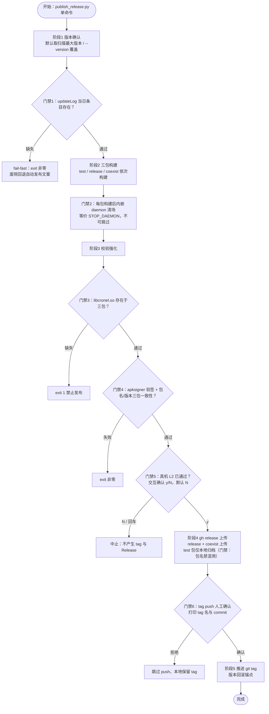

# spec.md — build-release-automation

## Intent

将 `publish_release.py` 升级为一键发布编排器，实现"版本确认 → 三包构建 → 校验强化 → gh release 上传 → git tag 推送"单命令全自动发版（`build-legado.bat` 保持薄构建层），并顺带修复幽灵 CI 触发器与更新源地址 bug，使打包发布体系在保留全部质量门禁的前提下达到对标 NG 的自动化水平。

**痛点清单**（均出自事实源报告 B/C 节，全部 Read 实证）：

| # | 痛点 | 现状证据 |
|---|------|---------|
| P1 | 两次手工命令割裂：bat 手动构建三包 + 发布脚本手动执行，双包同版本靠人工传第 3 参 | 差距分析"触发方式：高" |
| P2 | 校验 WARN 不 fail-fast：三包缺包仅 WARN 不阻断；updateLog 找不到当日条目静默回退"自动发布 {version}"文案（仅 WARN） | publish_release.py 526 行 B2 节 |
| P3 | 无 git tag：Release 幂等复用但无版本 tag，回滚只能靠重传产物 | B2 节"⚠️ 弱点" |
| P4 | 幽灵 CI 触发器：test.yml（push main/PR/workflow_run）与 web.yml（push main, modules/web/**）仍激活，但 secrets 未配置，push 必产生失败记录 | B3 节工作流表 |
| P5 | 更新源地址 bug：AppUpdateGitee.kt 查询旧仓 lyc486/legado，与脚本实际发布仓不一致，应用内"检查更新"失效 | B6 节 §6 优化点第 2 条 |

## Scope

**In Scope**：
- `publish_release.py` 编排器重构：单命令串联五阶段（版本确认/bump → 三包依次构建 → 校验强化 → gh release → git tag），替代现有"扫描已构建产物"的被动模式
- updateLog fail-fast：缺当日条目时 exit 非零，废除"找不到回退'自动发布'"的静默回退
- 校验强化：libcronet.so 存在性校验（保留 exit 1）+ apksigner 验签 + aapt 包名/版本三包一致性校验
- gh release 上传（gh CLI 替代 requests，规避 uploads.github.com SSL 与 51MB+ 大文件双坑）+ git tag 推送（回滚锚点）
- `.github/workflows/test.yml` 与 `web.yml` 的 push 触发器注释（幽灵 CI 清理）
- `AppUpdateGitee.kt` 更新源地址修正为与实际发布仓一致
- 规范文档同步：`docs/project-rules/apk-publish-workflow.md`（7 步流程改单命令）、`build-apk-guide.md`、`ci-cd-pipeline.md`

**Out of Scope**：
- 多渠道分发（NG 六渠道：应用商店/网盘/频道推送等，本项目双平台已满足）
- 通知推送（Telegram 频道等发版通知）
- NG 式云构建（GitHub Actions 云端矩阵构建）
- secrets 托管（jks/keystore 上云 secrets 化）
- 真机测试自动化（步骤 5.5 / L2 门禁保持人工执行 + 交互确认，本 spec 不自动化）

## Approach

### Selected Approach

**选项 1：本地全自动化增强**。`publish_release.py` 重构为编排器，按序执行：①版本确认（默认取扫描最大版本，支持 `--version` 覆盖，bump 前强制校验 updateLog 当日条目）→ ②三包构建（依次调用薄构建层，每包构建后内嵌 daemon 清场）→ ③校验强化（so 存在性 + apksigner 验签 + 包名/版本三包一致性，全部 fail-fast）→ ④gh release 上传（test 包仅归档不上 Release）→ ⑤git tag 推送（push 前打印供人工确认）。

选定理由：
1. **jks 泄露面最小**：本项目 jks 本地持有（根目录 + local.properties 注入，不入 git），是三个方案中攻击面最小的现状；选项 2 会主动把签名材料扩大到 CI secrets。
2. **NG 已自证无门禁 CI 不可持续**：design.md:42 明确"日更+无自动化测试，不可持续的工程文化，本项目不复制"。CI 产物未经真机 L2 即发版与门禁 2 正面冲突，本地编排天然保留真机卡点。
3. **真实缺口仅"编排 + tag"**：脚本已具备大半 NG 核心价值点（幂等发布、3 次指数退避重试、双平台 API、版本公式 `3.+releaseTime()` 与 versionCode=10000+gitCommits 同构），缺的只是流程串联、校验 fail-fast 与 tag 锚点，本地脚本增强即可覆盖。

### Alternatives Considered

| 方案 | 否决理由 |
|------|---------|
| 选项 2：GitHub Actions 恢复+加固（启用 release.yml，jks base64 入 secrets，云端构建+发版） | ① jks 上云使泄露面从本机扩大到 CI secrets（经手 fork/协作者/日志即失控）；② 本项目有 token 管理事故史（上传命名冲突、platform 校验坑），secrets 运维风险被实证放大；③ CI 产物绕过真机 L2 门禁直接发版，与门禁 2 正面冲突 |
| 选项 3：混合（本地构建+本地签名，Actions 只做校验/创建 Release+上传） | 链路最长、两处故障点（本地上传 artifact + 云端下载校验），且 actions artifact API 有版本坑；相对选项 1 收益增量有限（校验已在本地 fail-fast 覆盖），不值得引入双故障点 |
| 现状维持（不改造） | 缺口持续累积：P1-P5 痛点每次发版重复付出人工成本与事故风险（幽灵 CI 失败记录持续堆积、回滚无锚点、WARN 静默吞掉缺包/缺 changelog） |

### Drawbacks

- **本地单点**：依赖本机环境硬编码（JAVA_HOME、ANDROID_HOME、GRADLE_USER_HOME，bat 头部已硬编码），编排器继承此约束，换机需改配置——接受：单人主场景，与 build-legado.bat 现状一致，无新增劣化
- **编排器复杂度上升**：从 526 行被动发布脚本扩展为全流程编排，脚本体量与维护成本增加——接受：门禁逻辑集中化后反而降低"漏检"风险，替代的是更易出错的多命令人工串联
- **无异地构建能力**：本机故障时无法发版（选项 2/3 具备）——接受：单人私仓无私有发版 SLA，本机即生产环境

### Prior Art

- **NG release.yml**：版本 `3.%y.%m%d%H` sed 注入 + secrets 重建 key.jks + 自动发版（本项目与 NG 同 fork 自 legado-E，本仓 `.github/workflows/release.yml` 为同构上游遗产）
- **NG design.md 借鉴决策表 #13**：CI/CD 自动发版"可选"评级（价值 3 / 复杂度 2 / 风险 2，前置=签名 secrets 化）——前置成本高收益低，佐证绕开 secrets 化路线
- **design.md:42 警示**："日更+无自动化测试，不可持续的工程文化，本项目不复制"——本方案保留真机 L2 卡点的直接依据

## 目标使用形态（人工/AI 双通道）

**人工场景**：双击或命令行执行 `publish.bat`（新增薄壳入口，透传参数），全程交互式确认链：确认版本 → 确认构建 → 确认 L2 → 确认 tag。也支持 `publish.bat --version 3.26.0901` 指定版本。

**AI 场景**：用户一句话下达（如"发版 3.26.0901"）→ AI 执行 `python scripts/publish_release.py --version 3.26.0901`，编排器在硬卡点（构建前/L2/tag）暂停输出确认提示；AI 通过 AskUserQuestion 获得用户放行后，以 `--confirm-stage <stage>` 非交互续跑；**L2 门禁除外**——AI 代答必须附加 `--l2-evidence <L2报告路径>`，编排器校验报告文件存在且为当日生成，否则拒绝放行（R13）。门禁不是被跳过，而是由用户亲自放行并留痕。

## Requirements

1. **R1 编排器单命令**：`publish.bat`（薄壳入口）或 `python scripts/publish_release.py`（可带 `--version`）单命令完成"版本确认 → 三包构建 → 校验强化 → gh release → git tag"全流程，中途无人工补命令
2. **R2 updateLog fail-fast**：编排器 bump 前校验 updateLog.md 存在当日 `**YYYY/MM/DD**` 条目，缺失时 exit 非零并中止；废除静默回退"自动发布 {version}"文案
3. **R3 产物缺失 fail-fast**：发布所需三包（test/release/coexist）任一缺失时 exit 非零，不再仅 WARN
4. **R4 so 校验保留**：libcronet.so 存在性校验保留，缺失 exit 1，禁止降级为 WARN
5. **R5 验签与一致性校验**：每包通过 apksigner 验签（v1/v2）+ aapt 核对包名（含 `.debug`/`.release` 后缀）与版本号，三包版本必须一致，失败 exit 非零
6. **R6 真机门禁交互确认**：发布前交互式确认"L2 已通过（y/N）"，回车/默认 N 即拒绝中止；禁止提供默认关闭的 `--force-skip` 类参数
7. **R7 test 包不发布**：test 包仅本地归档（debug 命名防覆盖），不作为 asset 上传 Release；正式发布仅接受 release + coexist 产物（包名混用禁令断言）
8. **R8 每包构建后 daemon 清场**：编排器在三包各自构建后内嵌等价 `:STOP_DAEMON` 逻辑（或调用 stop-daemons.bat），作为不可跳过步骤
9. **R9 tag 人工确认**：git tag 由脚本基于发布版本创建，push 前打印 tag 名与 commit 供人工确认，确认后才执行 push
10. **R10 幽灵 CI 清零**：test.yml 与 web.yml 的 push 触发器注释（保留 workflow_dispatch），注释后向 main 的 push 零 CI 运行
11. **R11 更新源一致**：AppUpdateGitee.kt 查询地址修正为与脚本实际发布仓一致，应用内"检查更新"可命中最新 Release
12. **R12 规范文档同步**：apk-publish-workflow.md（单命令新流程）、build-apk-guide.md、ci-cd-pipeline.md 与实施结果一致，无过期步骤描述
13. **R13 分层确认协议**：构建前确认与 tag 确认支持 `--confirm-stage <stage>` 参数化续跑（AI 经用户放行后代答）；L2 门禁不接受纯口头放行——AI 代答必须携带 `--l2-evidence <L2报告路径>`，编排器校验文件存在且修改时间为当日，校验不过 exit 拒绝；`--dry-run` 模式下全部确认点仅模拟不阻断

## Scenarios

- **Scenario 1（主场景：正常发版全流程）**
  - Given：updateLog.md 已写入当日条目，jks 本地可用，gh CLI 已认证，真机 L2 已通过
  - When：执行 `python publish_release.py --version 3.26.0830xx`，依次通过版本确认、三包构建、校验强化，交互确认 L2 输入 `y`，确认 tag push
  - Then：三包产出于 `output/apk/` 归档且校验全通过，gh Release 创建并上传 release + coexist 两个 asset（test 包仅本地归档），git tag 推送至远端形成回滚锚点，全程零 WARN 中断

- **Scenario 2（缺 updateLog 当日条目被拦截）**
  - Given：updateLog.md 最新条目日期早于今日（版本交付同步门禁未执行）
  - When：执行编排器，进入阶段 1 版本确认的 updateLog 校验
  - Then：exit 非零并明确报错"缺当日条目"，不进入任何包构建、不产生 Release 与 tag；不出现"自动发布 {version}"回退文案

- **Scenario 3（真机确认拒绝 N 中止）**
  - Given：三包构建与校验强化已全部通过，进入发布前交互确认
  - When：用户在"L2 已通过（y/N）"提示处直接回车（默认 N）或输入 `n`
  - Then：编排器立即中止发布，不产生 tag、不创建/更新 Release、不上传任何 asset；已构建产物保留在 output/apk/ 供复用

- **Scenario 4（gh release 重跑幂等）**
  - Given：某版本 Release 与 asset 已存在（如 Scenario 3 后人工补发、或上传中断后重跑）
  - When：再次执行编排器并全程确认通过
  - Then：已存在 tag 复用不报错，同名 asset 跳过重传，缺失 asset 补传，Release 最终状态完整且无重复条目

- **Scenario 5（幽灵 CI 清零）**
  - Given：test.yml 与 web.yml 的 push 触发器已注释
  - When：向 main 推送任意 commit（含 modules/web/** 变更）
  - Then：GitHub Actions 零运行记录，无失败红叉堆积

- **Scenario 6（AI 代答 L2 缺证据被拒绝）**
  - Given：AI 执行编排器到达 L2 门禁，已通过 AskUserQuestion 获得用户口头放行，但未提供 `--l2-evidence` 或提供的报告文件不存在/非当日
  - When：AI 以 `--confirm-stage release --l2-evidence <路径>` 续跑
  - Then：编排器校验证据失败，exit 非零拒绝进入发布阶段，不产生 Release 与 tag；仅在证据文件存在且为当日时才放行

## 编排器五阶段流程图（门禁卡点标注）

