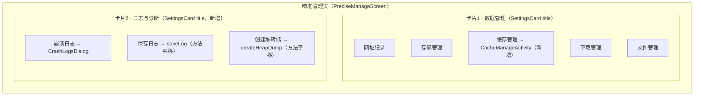
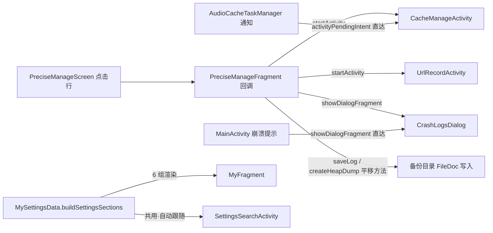

# Design: "我的"页功能归堆重构

## Technical Approach

6 文件改动，全部为入口层/数据构建层，零数据流/零数据库/零功能增删：

| # | 文件 | 变更 |
|---|------|------|
| 1 | `ui/main/my/MySettingsData.kt` | ①`buildSettingsSections` 重排 6 组（映射见下表）；②`handleSettingsRowClick` 删 `"cacheManage"`/`"urlRecord"` 分支；③删 `CacheManageActivity`/`UrlRecordActivity` import |
| 2 | `ui/config/PreciseManageFragment.kt` | ①新增 `onCacheManageClick` 回调；②平移 AboutFragment 五个诊断私有方法 + waitDialog；③showDialogFragment 用 Fragment 扩展（FragmentExtensions.kt:40 已存在） |
| 3 | `ui/config/PreciseManageScreen.kt` | ①数据管理卡片加 `title = "数据管理"`（复用待定名，见 AD-07）；②存储管理与下载管理之间插"缓存管理"行（CloudSync 图标）；③新"日志与诊断"卡片（BugReport/SaveAlt/Memory 图标） |
| 4 | `ui/about/AboutFragment.kt` | "其他"分区删三件套 action 三行 + 删五个诊断私有方法 + 删 KEY_CRASH_LOG/KEY_SAVE_LOG/KEY_CREATE_HEAP_DUMP + 清理无用 import（CrashHandler/ZipUtils/FileDoc 系/Uri 等） |
| 5 | `values/strings.xml` | `config_category_appearance` 值改 "Appearance"；`config_category_tools` 值改 "Tools"；新增 `config_category_about`="About"、`log_diagnostics`="Logs & diagnostics"、`data_manage`="Data management" |
| 6 | `values-zh/strings.xml` | 对应中文：`config_category_appearance`→"外观"；`config_category_tools`→"工具"；新增 `config_category_about`="关于"、`log_diagnostics`="日志与诊断"、`data_manage`="数据管理" |

### 6 组归堆映射表（buildSettingsSections 目标态）

| 新分组（标题字符串） | 行（key → 目标） | 相对现状 |
|---------------------|------------------|---------|
| **内容与规则**（config_category_content，值不变） | bookSourceManage / rssSourceManage / txtTocRuleManage / replaceManage / dictRuleManage / **highlightRule↑** | 高亮规则自工具组迁入 |
| **外观**（config_category_appearance，值"外观与 AI"→"外观"） | themeMode(Kind.ThemeMode) / appearanceKit / theme_setting | **ai_setting↓ 迁出** |
| **同步与服务**（config_category_sync，值不变） | web_dav_setting / publicWebRelay / webService(Kind.WebService) | **cacheManage↓ 迁出** |
| **工具**（config_category_tools，值"工具与关于"→"工具"） | **ai_setting↑** / autoTask / rssSearch / featureBooks / bookmark / readRecord / setting | **urlRecord↓ 删除**（消双入口）；highl‌ightRule/preciseManage/about/exit 迁出 |
| **精准管理**（复用 precise_manage） | preciseManage（聚合入口行） | 自工具组独立成组 |
| **关于**（config_category_about，新增） | about / exit | 自工具组尾部独立成组 |

### 精准管理页目标态

## Architecture Decisions

### AD-01: 入口迁移而非页面融合
- **Context**: 用户认为两处"缓存管理"重复要求融合；实况为 缓存管理（任务维度）与存储管理（空间维度）两个功能，页面本体无冗余
- **Concern**: 融合页面需合并两套 ViewModel 与交互模式，回归风险高收益低
- **Decision**: 仅迁移入口到精准管理聚合页，两页本体零改动
- **Goal**: 消除入口语义混乱，功能零回归风险
- **Tradeoff**: 老用户需适应新位置
- **Status**: Accepted（检查点 1 用户裁决通过）

### AD-02: 移除死路由与 import
- **Context**: `cacheManage`/`urlRecord` 行从 buildSettingsSections 移除后，对应路由分支无任何调用方（两宿主共用该函数）
- **Concern**: 保留分支留死代码
- **Decision**: 同步删除两分支与 CacheManageActivity/UrlRecordActivity import（Grep 核实唯一引用点即 MySettingsData.kt；通知/崩溃直达路径走 activityPendingIntent/showDialogFragment 不经此路由）
- **Goal**: 零死代码
- **Tradeoff**: 无（引用已全量核实）
- **Status**: Accepted

### AD-03: 缓存管理行位置与图标（CloudSync）
- **Context**: 精准管理数据管理卡片行序：网址记录/存储管理/下载管理/文件管理
- **Concern**: 插入位置影响查找效率与语义分组
- **Decision**: 插入存储管理与下载管理之间（"存储→缓存→下载→文件"心智顺序）；图标 CloudSync（涵盖缓存下载+云端上传，区别于 Download 行的系统下载任务）
- **Goal**: 一屏找齐缓存类管理
- **Tradeoff**: 图标实施时可一行改
- **Status**: Accepted

### AD-04: 诊断三件套整体迁移 + 方法平移（非共享抽象）
- **Context**: 用户裁决三件套（崩溃日志/保存日志/创建堆转储）整体迁入精准管理
- **Concern**: ①拆散三件套留下"关于页孤行堆转储"；②五方法承接方式
- **Decision**: 整体迁入新"日志与诊断"卡片；五方法逐字节平移到 PreciseManageFragment（AboutFragment 全删），不抽共享 helper——AboutFragment 删后仅剩单调用方，共享抽象属过度设计
- **Goal**: 诊断入口 3 层深→2 层深，关于页纯信息类，诊断能力不拆散
- **Tradeoff**: PreciseManageFragment 增加 ~85 行（内聚该页职责）
- **Status**: Accepted（用户 2026-08-28 13:52 裁决）

### AD-05: 行为逐字节一致（平移不改逻辑）
- **Context**: 诊断方法含 Coroutine.async/FileDoc/WaitDialog/toastOnUi
- **Concern**: 迁移顺手"优化"引入行为差异
- **Decision**: 方法体逐字节平移不改逻辑不改文案（含 saveLog 的 delay(3000) 提示）
- **Goal**: 回归只需对比行为一致，无逻辑漂移面
- **Tradeoff**: 不做顺手优化
- **Status**: Accepted

### AD-06: 6 组归堆框架（名实一致补完）
- **Context**: 用户要求"我的"页全量功能重新归堆；现状组名（内容与规则/外观与 AI/同步与服务/工具与关于）已有归堆意识但行归位未跟上；"工具与关于"11 行混杂 7 种语义
- **Concern**: 分组框架是主观偏好，需论证而非拍脑袋；组名改动涉及字符串引用面
- **Decision**: 6 组框架（内容与规则/外观/同步与服务/工具/精准管理/关于）：高亮规则归规则组、AI 设置归工具组、缓存管理归精准管理、网址记录消双入口、关于/退出独立成组；组名字符串仅 MySettingsData.kt 单点引用（C1 核实），改值零外部风险
- **Goal**: 每组语义同质，扫视即可定位；名实一致
- **Tradeoff**: "工具"组 7 行含功能+记录两类语义（6 组约束下最优折中，可后续升级 7 组）；老用户学习成本
- **Status**: Accepted（用户 2026-08-28 13:57 倾向方案一，待本设计文档审核确认）

### AD-07: 网址记录消双入口 + 卡片标题补齐
- **Context**: 工具组"网址记录"一级行与精准管理页内行双入口（与 bugfix-20260824 ⑥ 文件管理双入口同类，当时漏清）；精准管理数据管理卡片现无标题，新增诊断卡片带标题会视觉不对称（用户裁决两卡片都加标题）
- **Concern**: 删行需确认无其他引用；数据管理卡片标题字符串现无
- **Decision**: 删工具组行+路由+import（C3 核实零残留）；新增 `data_manage` 字符串作数据管理卡片标题
- **Goal**: 入口唯一 + 两卡片标题对称
- **Tradeoff**: 无
- **Status**: Accepted（用户 2026-08-28 13:57 裁决两卡片都加标题）

## Data Flow

无数据流变更：

- 设置搜索按行 title/summary/key 匹配+空组自动隐藏（MySettingsScreen.buildVisibleSections:405），对分组数量/顺序零假设（C5 核实）
- 崩溃直达（MainActivity:2255）与音频缓存通知（AudioCacheTaskManager:410）均不经入口行（C10 核实）

## File Changes

见 Technical Approach 表；预估净变更量：MySettingsData.kt ±20 行 / PreciseManageFragment.kt +~90 行 / PreciseManageScreen.kt +~35 行 / AboutFragment.kt -~95 行 / strings ±6 行。

## 可行性核查记录（C1-C10，全部 PASS）

| # | 核查点 | 方法 | 结论 |
|---|--------|------|------|
| C1 | 分组标题字符串引用面 | Grep config_category_* 全仓 | 仅 MySettingsData.kt 4 处 + strings 定义，改值/新增零外部风险 |
| C2 | 组名现状 | Read strings.xml L2666-2669/L2368-2371 | "内容与规则"/"外观与 AI"/"同步与服务"/"工具与关于"，名实一致补完方向成立 |
| C3 | urlRecord 引用面 | Grep UrlRecordActivity/"urlRecord" | 仅 MySettingsData 3 处 + PreciseManageFragment 聚合入口；删 3 处零残留 |
| C4 | highlightRule/ai_setting 迁移 | Read MySettingsData | 纯 actionRow 移动，路由 key "highlightRule"/"ai_setting" 不变 |
| C5 | 设置搜索分组假设 | Read SettingsSearchActivity + buildVisibleSections | 按行匹配+空组隐藏，List 遍历零分组数假设 |
| C6 | Fragment.showDialogFragment | Grep utils | FragmentExtensions.kt:40 存在 |
| C7 | SettingsCard title 参数 | Read SettingsCard.kt | title: String? 支持卡片标题 |
| C8 | SettingsClickRow 签名 | Read SettingsClickRow.kt | icon: ImageVector? / subtitle: String? 均可空 |
| C9 | 字符串现状 | Grep crash_log/save_log/create_heap_dump/cache_manage_title | 全部已存在可复用；需新增 about 组名/log_diagnostics/data_manage 3 条 |
| C10 | 直达路径 | Grep AudioCacheTaskManager/MainActivity | 通知与崩溃提示均直达 Activity/Dialog，不经入口行 |

## 回填点核查（global-thinking-checklist 六维）

| 维度 | 结论 |
|------|------|
| 前端入口 | 我的页 6 组重排；精准管理 +1 行 +1 卡片；关于页少三行；设置搜索自动跟随 |
| 后端接口 | 无 |
| 数据库 | 无 |
| 覆盖安装 | 无影响（无存储结构/pref 变更） |
| 使用场景 | S1-S12 见 spec.md |
| 回填点 | 无需回填（纯入口层） |
