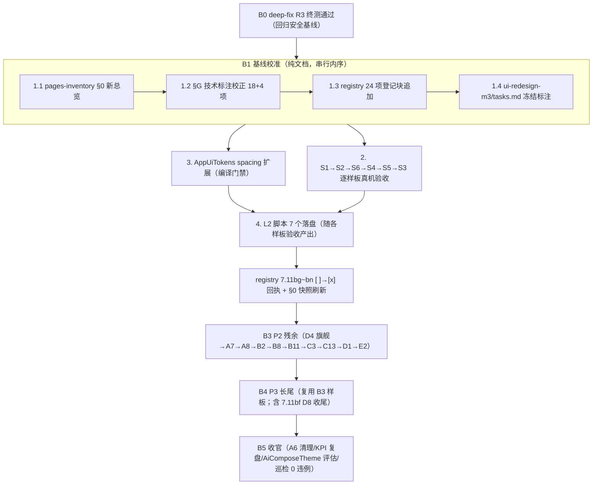

# design-b1-b2-baseline-freeze.md — B1 基线校准 + B2 样板冻结验收 实施设计册

> 来源 spec：`docs/specs/compose-migration-status-audit/design.md`（页级总表 69 类双权威校准，AD-01/AD-02/AD-06/AD-08 定稿）。
> 本册覆盖批次：**B1 基线校准（纯文档）** 与 **B2 样板 S1-S6 冻结验收 + spacing token + Compose L2 脚本**。
> 权威源链：design.md 页级总表（本册唯一校准依据）→ migration-registry（进度唯一权威，AD-01）→ pages-inventory §0/§G（校准后降级为页面明细参考）。
> 设计日期：2026-08-30。状态：🔄 设计定稿（待检查点审查）。

---

## 1. B1 校准精确编辑规格（纯文档批次，四份产物）

### 1.1 pages-inventory §0 新总览表（成品 markdown，可直接整段替换 §0 表格）

> 编辑点：`docs/specs/ui-redesign-m3/pages-inventory.md` 第 7~17 行（`## 0. 总览` 标题下的表格与合计行）。表头结构保持不变（功能域|页面数|已 Compose|未 Compose），数字按 design.md 页级总表逐域重算。

```markdown
## 0. 总览（84 页面类 · 按功能域 · 2026-08-30 按 compose-migration-status-audit 页级总表校准）

| 功能域 | 页面数 | 已 Compose | 未 Compose |
|--------|-------|-----------|-----------|
| A 主框架/我的 | 8 | 3（A1 PillNav 接线、A2 ProfileScreen3Level、A3+A4 书架 BookshelfScreen） | 4（A7/A8 待迁移、A5 红线、A6 已删待销号） |
| B 阅读器/书籍 | 16 | 8（B1 浮层 S5、B2 接线就位、B6 双栈新栈、B7 壳接线、B9 桥接、B10 CacheScreen、B11 结果列表、B16 桥接态） | 7（B3/B4、B5、B8、B14、B15 待迁移 + B12/B13 内核红线页） |
| C 书源/规则/工具 | 20 | 13（C1/C2/C4/C5/C6/C9/C10/C11/C12/C15/C16/C17/C19） | 7（C3/C13/C20 待迁移 + C7/C8/C14/C18 红线） |
| D RSS/订阅 | 9 组（13 页面类） | 3（D1 已全量接线、D8 桥接、D9 顶栏+设置面板） | 6（D2~D5、D7 待迁移 + D6 红线） |
| E 配置子页 | 6 | 6（E1~E6 均 ComposeSettingFragment，E5 已 PreciseManageScreen） | 0 |
| F 其它 | 6 | 2（F3 ReadRecordScreen、F6=D9） | 3（F1/F2 待迁移、F4 红线、F5=C14） |
| **合计** | **69 页面类 + 15 抽象/壳 = 84** | **33/60 行（55%，行口径）** | **27 行** |

> 统计定稿（compose-migration-status-audit design.md 2026-08-30 交叉审核轮 3 修订）：🧱 红线/N 保留 9 组 ｜ ✅回+🔁 登记/回执 30 项 ｜ 🔨 待迁移/收尾 20 行（结构性迁移 14：D4/A7/A8/B8/C3/C13 瘦身/B5/B14/B15/D2/D3/D5/D7/C20；轻量收尾 6：B2/B11/E2/B9/B12/B13）｜ 🗑 清理 1 项。
> 口径说明（双口径并存，勿混用）：①「已 Compose」结构口径 = 纯 Compose 或已接线混血（B2/B9/B11/B16 已接线但留收尾任务，结构计入已、任务计入 🔨）；②任务口径 = registry 登记与回执项（🔁/✅回）。分母 60 = design.md 总表行数（A3/A4、C14/F5、F6/D9、F1/F2、E1/E3/E6 为共享行）。
> 进度权威源 = `docs/project-flow/ui-standards/migration-registry.md`（AD-01），本表为快照镜像，每次 registry 回执后同步刷新。
```

**校准口径核对表**（编写者自验用，不入正文）：

| 域 | 已 Compose 明细 | 计数依据 |
|---|---|---|
| A | A1/A2/A3A4 | design.md §A 三行 ✅回（A3/A4 合 1 项） |
| B | B1/B2/B6/B7/B9/B10/B11/B16 | B1✅回、B2 接线就位、B6✅回、B7 壳接线、B9 桥接、B10🔁、B11 部分已 Compose（🔨+🔁）、B16 桥接态 |
| C | C1/C2/C4/C5/C6/C9/C10/C11/C12/C15/C16/C17/C19 | C1✅回、C2✅回、C4~C16 共 9 项🔁、C17 已桥接、C19 已改造 |
| D | D1/D8/D9 | D1 已全量接线、D8🔁、D9✅回（F6 同族归 F 共享行） |
| E | E1/E2/E3/E4/E5/E6 | 4 项🔁 + E2 已 ComposeSettingFragment（违例修复归 B3，仍计入已 Compose）+ E5 已 PreciseManageScreen |
| F | F3/F6（=D9） | F3🔁；F6=D9 计 D 域共享行 |

> W7 修订：本表已补齐与 §0 总览表结构口径一致（B 域 8 项、C 域含 C17、D 域含 D1、E 域含 E5、F 域含 F6=D9）；本表仅列登记映射项，结构口径权威见 §0。

### 1.2 §G 技术标注逐行校正表（pages-inventory 各页条目「技术」列 + §G 路线图清单）

> 编辑方式：按下表逐行修改 `docs/specs/ui-redesign-m3/pages-inventory.md` 对应条目的「技术」字段；§G 路线图按 1.2.2 调整清单归属。每行校正必须附来源与核验方式，禁止无证据改标注。

#### 1.2.1 页面条目技术标注校正（「旧标注」= inventory 现存文本）

| 编号 | 位置（条目） | 旧标注 | 新标注 | 依据源码文件 | 核验方式+日期 |
|---|---|---|---|---|---|
| X-01 | B10 CacheActivity | 技术 **View** | **纯 Compose**（CacheScreen LazyColumn；CacheAdapter/item_download.xml 已删） | `ui/book/cache/CacheActivity.kt` + `ui/book/cache/CacheScreen.kt` | 源码核验（registry 7.11ai）2026-08-30 |
| X-02 | B11 SearchActivity | 技术 **View** | **View+Compose 壳**（结果列表/输入帮助已 Compose；全文搜索区残余） | `ui/book/search/SearchActivity.kt` | 源码核验（registry 7.11ah）2026-08-30 |
| X-03 | C4 ReplaceRule | 技术 **Compose 顶栏/菜单/底部** | **全 Compose（列表）**：AppManagementScaffold 接管，recyclerView removeView；Edit 页 Compose 桥接维持 | `ui/replace/ReplaceRuleActivity.kt` | 源码核验（registry 7.11ag）2026-08-30 |
| X-04 | C5 HighlightRule | 技术 **Compose**（维持）+ 补强跳过修复注记 | **Compose**（HighlightRuleScreen 全 Compose；强跳过修复 ✅） | `ui/highlight/HighlightRuleActivity.kt` + `HighlightRuleScreen.kt` | 源码核验 2026-08-30 |
| X-05 | C6 DictRuleActivity | 技术 **View** | **纯 Compose**（DictRuleScreen） | `ui/dict/rule/DictRuleScreen.kt` | 源码核验 2026-08-30 |
| X-06 | C9 FileManage | 技术 **View** | **纯 Compose**（FileManageScreen） | `ui/file/FileManageScreen.kt` | 源码核验 2026-08-30 |
| X-07 | C10 DownloadManage | 技术 **View** | **纯 Compose**（DownloadManageScreen） | `ui/download/DownloadManageScreen.kt` | 源码核验 2026-08-30 |
| X-08 | C11 UrlRecord | 技术 **View** | **纯 Compose**（UrlRecordScreen+FilterSheet） | `ui/urlrecord/UrlRecordScreen.kt` | 源码核验 2026-08-30 |
| X-09 | C12 RecycleBin | 技术 **View** | **纯 Compose**（RecycleBinScreen） | `ui/source/recycle/RecycleBinScreen.kt` | 源码核验 2026-08-30 |
| X-10 | C15 ImageGallery/Detail | 技术 **View**（V4 垂直画布） | **纯 Compose**（双 Activity 已 Compose 化） | `ui/image/` 下 Gallery/Detail Screen | 源码核验（design 页级总表）2026-08-30，B1 执行日二次 Grep `setContent` 复核 |
| X-11 | C16 AutoTask | 技术 **View** | **纯 Compose**（AutoTaskScreen） | `ui/autoTask/AutoTaskScreen.kt` | 源码核验 2026-08-30 |
| X-12 | C20 ReadRecord | 技术 **View**（合条目） | 拆分标注：About **View 维持**；ReadRecord **纯 Compose**（ReadRecordScreen） | `ui/about/ReadRecordScreen.kt` | 源码核验 2026-08-30 |
| X-13 | D8 RuleSub | 技术 **View** | **View+Compose 壳**（RuleSubScreen 桥接已有） | `ui/rss/subscription/RuleSubScreen.kt` | 源码核验（design 页级总表）2026-08-30 |
| X-14 | E1 BackupConfig | 技术 **View**（PreferenceFragment） | **ComposeSettingFragment** | `ui/config/BackupConfigFragment.kt:64` | 源码核验（registry 7.11al）2026-08-30 |
| X-15 | E3 CoverConfig | 技术 **View**（PreferenceFragment） | **ComposeSettingFragment** | `ui/config/CoverConfigFragment.kt` | 源码核验（registry 7.11ak）2026-08-30 |
| X-16 | E6 WelcomeConfig | 技术 **View**（PreferenceFragment） | **ComposeSettingFragment** | `ui/config/WelcomeConfigFragment.kt` | 源码核验（registry 7.11ak）2026-08-30 |
| X-17 | E4 OtherConfig | 技术 **View**（PreferenceFragment） | **ComposeSettingFragment** | `ui/config/OtherConfigFragment.kt:55` | 源码核验（registry 7.11al）2026-08-30 |
| X-18 | E2 ThemeConfig | 技术 **View**（PreferenceFragment） | **ComposeSettingFragment**（7.11ak；遗留 15 项违例归 B3） | `ui/config/ThemeConfigFragment.kt` | 源码核验（registry 7.11ak）2026-08-30 |

维持不改（核验确认标注仍正确，登记免改）：C1 **View+Compose 壳**（v2.12 已核）、C2 **View+Compose 壳**（5 处接线）、B7 **View+Compose 壳**（12.50）、D1 **View+Compose 壳**、D4 **View（顶栏 Compose）**、B6 **View（壳层 Compose 桥接）**。

#### 1.2.2 §G 路线图清单校正

| 编号 | 位置 | 旧内容 | 新内容 | 依据 |
|---|---|---|---|---|
| X-19 | §G 枝叶 P2 清单 | 含「Replace、Highlight、Cache、ImageGallery、Config 3 子页（Backup/Theme/Other）」 | 移出上述已迁项；P2 保留：Explore、Rss、Search、Toc、BookSourceDebug、SourceLogin、BookManage、ReadManga、Audio、Video、D1 收尾、E2 违例修复 | design.md 页级总表批次归属 |
| X-20 | §G 枝叶 P3 清单 | 含「文件/下载/记录/回收站/自动任务/词典/ReadRecord」 | 移出已 Compose 项；P3 保留：导入族、存储、BookInfoEdit、Welcome、About、TxtToc 列表、E5、C17 等 🔨 项 | 同上 |
| X-21 | §G 表头/注释 | 无权威源声明 | 增注「本路线图为 08-16 冻结历史参考；现行批次=B0~B5（compose-migration-status-audit design.md AD-02），进度权威源=migration-registry」 | AD-01 |
| X-22 | §H 变更记录 | 最新 v2.12（08-16） | 追加 v2.13 行：2026-08-30 §0/§G 按 compose-migration-status-audit 页级总表一次性校准（B1 批次），列 18 处技术标注校正+2 处清单归属校正 | 本表 |

### 1.3 migration-registry 登记块模板（成品 markdown，整块追加到 registry「六.3」节之后）

> 编号规则：延续 §7.11 系列顺延（现止于 7.11ap），B1 登记 16 项（7.11aq~bf）+ B2 回执 8 项（7.11bg~bn）= 24 项；任务口径总数 = **24 项（B1 16+B2 8）+ B3/B4/B5 追加登记 6 项（D1/C19/B13/含 B7/B16/C17/E5 复核）= 30 项**。列结构对齐 registry 现有六列惯例（任务编号/文件/现状/核验方式/日期/备注）；「现状」列内嵌证据三元组（源码路径+核验方式+日期）。

```markdown
## 七、compose-migration-status-audit 基线校准登记（B1/B2 批次，2026-08-30）

> 权威源 = `docs/specs/compose-migration-status-audit/design.md` 页级总表（AD-01：进度以本表为唯一权威，本块为 B1 校准+B2 冻结的登记落点）。
> 证据字段规范：每项含【源码路径 | 核验方式 | 核验日期】；核验方式取值：源码核验 / Grep setContent+ComposeView / 真机 L2（脚本+截图+logcat）。

### B1 登记核对（🔁，16 项）

| 任务编号 | 文件（现状） | 现状 | 核验方式 | 日期 | 备注 |
|---------|------------|------|---------|------|------|
| 7.11aq | `ui/replace/ReplaceRuleActivity.kt`+`ReplaceEditActivity.kt` | [x] 已核对（AppManagementScaffold 全 Compose + Edit 桥接） | Grep setContent + composeView | 2026-08-30 | design C4；registry 7.11ag 镜像 |
| 7.11ar | `ui/highlight/HighlightRuleActivity.kt` | [x] 已核对（HighlightRuleScreen 全 Compose；强跳过修复 ✅） | 源码核验 | 2026-08-30 | design C5 |
| 7.11as | `ui/dict/rule/DictRuleScreen.kt` | [x] 已核对（Activity setContent→Screen） | 源码核验 | 2026-08-30 | design C6；inventory 标 View 滞后已校正 |
| 7.11at | `ui/file/FileManageScreen.kt` | [x] 已核对 | 源码核验 | 2026-08-30 | design C9 |
| 7.11au | `ui/download/DownloadManageScreen.kt` | [x] 已核对 | 源码核验 | 2026-08-30 | design C10 |
| 7.11av | `ui/urlrecord/UrlRecordScreen.kt`（+FilterSheet） | [x] 已核对 | 源码核验 | 2026-08-30 | design C11 |
| 7.11aw | `ui/source/recycle/RecycleBinScreen.kt` | [x] 已核对 | 源码核验 | 2026-08-30 | design C12 |
| 7.11ax | `ui/image/`（Gallery/Detail 双页） | [x] 已核对 | 源码核验+二次 Grep 复核 | 2026-08-30 | design C15 |
| 7.11ay | `ui/autoTask/AutoTaskScreen.kt` | [x] 已核对 | 源码核验 | 2026-08-30 | design C16 |
| 7.11az | `ui/about/ReadRecordScreen.kt` | [x] 已核对 | 源码核验 | 2026-08-30 | design F3 |
| 7.11ba | `ui/config/BackupConfigFragment.kt:64` | [x] 已核对（继承 ComposeSettingFragment） | 源码核验 | 2026-08-30 | design E1；registry 7.11al 镜像 |
| 7.11bb | `ui/config/CoverConfigFragment.kt` | [x] 已核对 | 源码核验 | 2026-08-30 | design E3；7.11ak 镜像 |
| 7.11bc | `ui/config/WelcomeConfigFragment.kt` | [x] 已核对 | 源码核验 | 2026-08-30 | design E6；7.11ak 镜像 |
| 7.11bd | `ui/config/OtherConfigFragment.kt:55` | [x] 已核对 | 源码核验 | 2026-08-30 | design E4；7.11al 镜像 |
| 7.11be | `ui/book/cache/CacheScreen.kt` | [ ] 待真机回归（纯 Compose 已核；缺真机回归报告） | 真机 L2（l2_verify_compose_cache.py） | 2026-08-30 登记 | design B10；registry 7.11ai 销项=B0 |
| 7.11bf | `ui/rss/subscription/RuleSubScreen.kt` | [ ] 待收尾核对（桥接已有，回执归 B4） | 源码核验+真机 | 2026-08-30 登记 | design D8 |

### B2 样板冻结回执（✅回，8 项；冻结=验收回执而非重写，AD-06）

| 任务编号 | 文件（现状） | 现状 | 所属组件 | 核验方式 | 备注 |
|---------|------------|------|---------|---------|------|
| 7.11bg | `ui/main/MainActivity.kt` | [ ] 待冻结回执（PillNav 已接线；S1 验收检查点见 design-b1-b2 §2.1） | S1 主框架 | 真机 L2 | design A1 |
| 7.11bh | `ui/main/my/MyFragment.kt` | [ ] 待冻结回执（XML 壳+ProfileScreen3Level） | S1 我的页 | 真机 L2 | design A2 |
| 7.11bi | `ui/main/bookshelf/BookshelfScreen.kt` | [ ] 待冻结回执（Phase3 已过；12 菜单 View 红线登记说明） | S1 书架 | 真机 L2+红线登记 | design A3/A4 |
| 7.11bj | `ui/book/read/ReadBookActivity.kt` | [ ] 待冻结回执（MenuLayer 等浮层 Compose，Phase4；S5 验收 §2.5） | S5 全屏沉浸 | 真机 L2 | design B1 |
| 7.11bk | `ui/book/info/BookInfoActivity.kt`+`BookInfoComposeActivity.kt` | [ ] 待冻结回执（双栈运行时分派，X4 禁回退；分支各过） | S4 详情 | 真机 L2 | design B6 |
| 7.11bl | `ui/book/source/manage/BookSourceScreen.kt` | [ ] 待冻结回执（S2 双轨已接线；验收 §2.2 全表） | S2 管理列表 | 真机 L2 | design C1 |
| 7.11bm | `ui/book/source/edit/BookSourceEditActivity.kt` | [ ] 待接线+冻结回执（5 处 Compose 接线，View 内核保留） | S3 表单编辑 | 真机 L2 | design C2；🔨+✅回 复合 |
| 7.11bn | `ui/video/VideoPlayerActivity.kt`+`VideoFragment.kt`（F6 同族） | [ ] 待冻结回执（顶栏+设置面板 Compose；手势四件套复用 R3 4.2） | S5 模式 | 真机 L2 | design D9/F6 |

> 回执完成判定：对应 S 样板 §2 检查点全过 + L2 脚本落盘（ai_tests/scripts/l2_verify_compose_{page}.py）+ 截图/logcat 证据归档 + 本表 [ ]→[x]。完成后同步刷新 pages-inventory §0 快照。
```

### 1.4 ui-redesign-m3/tasks.md 头部冻结标注文案（成品段落，插入 tasks.md 头部标题与首个章节之间）

```markdown
> ⚠️ **冻结标注（2026-08-30，compose-migration-status-audit AD-01）**：本文档（含 pages-inventory 三件套）已冻结为**历史参考**。
> ① 迁移进度查询/回执一律以 `docs/project-flow/ui-standards/migration-registry.md` 为**唯一权威**（AD-01），本文勾选状态不再更新；
> ② 页面实况以 `docs/specs/compose-migration-status-audit/design.md` 页级总表为准，pages-inventory §0/§G 已按其一次性校准（B1 批次，变更记录 v2.13）；
> ③ 现行批次路线 B0→B1→B2→B3→B4→B5 见 compose-migration-status-audit design.md AD-07，本文 §12 批次条目仅作历史对照；
> ④ 本文功能点清单/v2.8 预审违例编号（V 系列）仍为页面级有效资产，迁移开工时按条目引用，不因冻结失效。
```

### 1.5 裁决成品段（评审 W4r4 增补）：BookshelfItems GeneratedCover 归位裁决

- **候选方案 A**：迁移 GeneratedCover 至 ThemeSpec 取色（对齐 FR-9「取色唯一基线」）——生成色改由 ThemeSpec/ThemeStore 运行时推导，随主题切换实时刷新。
- **候选方案 B**：维持现状登记豁免（生成色视为内容派生色，非 UI 取色面）。
- **影响面**：`ui/main/bookshelf/BookshelfItems.kt` 单文件 + 书架卡片封面回退逻辑（无其他调用方）。
- **裁决建议=A**：随 B1 登记块落 migration-registry（登记 GeneratedCover 归位项），实施归 **B2 S2 验收批次**（书架样板冻结时同步落地并回归封面回退渲染）。

---

## 2. B2 样板冻结验收规格（S1-S6 检查点全表）

> 总则（AD-06）：冻结=验收回执而非重写；每检查点含【操作步骤/预期/证据形式】三要素；证据形式取值：截图（output/l2_*.png）｜控件断言（dump_hierarchy+bounds 正则）｜logcat tag（针对性计数=0 或关键 tag 出现）。真机包 `io.legado.miss.app.debug`；执行用 `ai_tests\venv\Scripts\python.exe`。手写辅助验证允许，但每样板至少 1 个固化 L2 脚本。

### 2.1 S1 主框架（A1 MainActivity + A2 MyFragment + A3/A4 书架）

| # | 检查点 | 操作步骤 | 预期 | 证据形式 |
|---|---|---|---|---|
| S1-1 | 底栏接线 | 冷启动→依次点 4 个 tab（content-desc 定位，tab 顺序先 dump 确认） | 每次 tab 切换 ≤1.5s 渲染完成，无白屏闪烁；当前 tab 高亮态切换 | 控件断言+截图×4 |
| S1-2 | 双击回顶 | 书架列表滚动 ≥2 屏→双击当前 tab | 列表回到顶部（首项 bounds.y 回到锚定区间） | 控件断言（滚动前后 bounds 对比） |
| S1-3 | 压缩（书架收缩） | 书架顶栏下滑/触发收缩态 | 标题区收缩为紧凑态，无布局跳变/裁切 | 截图×2（展开/收缩） |
| S1-4 | 我的页三级 Profile | 我的 tab→进入 ProfileScreen3Level 各层级→返回 | 三级渲染正常，返回不丢状态 | 控件断言+截图 |
| S1-5 | 书架配置即时生效 | 书架配置弹框改列数→确定 | 网格立即重组（复用 7.11 系列 L2 断言模式） | 控件断言 |
| S1-6 | 12 菜单红线登记 | 核对 BaseBookshelfFragment 12 菜单 View 保持原生 | 菜单可用性 0 回归；红线说明文字入 registry 备注 | 截图+registry 登记 |

### 2.2 S2 管理列表（C1 BookSourceScreen 双轨）

| # | 检查点 | 操作步骤 | 预期 | 证据形式 |
|---|---|---|---|---|
| S2-1 | 滑选多选 | 列表长按进入多选→拖动连续选择 | 进多选态（批量栏出现）；区间选中数随拖动增长 | 控件断言（批量栏计数） |
| S2-2 | 拖拽排序 | 排序=自定义时长按条目拖动 | 条目换位持久化（退出重进顺序保持） | 控件断言+截图 |
| S2-3 | 批量操作 | 多选→批量栏逐项（启用/停用/置顶/置底/导出/分享…12 项抽测 ≥6） | 每项生效且列表即时刷新（copy() 新实例回流，§4 红线 5） | 控件断言+截图 |
| S2-4 | 三视图 | 依次切列表/紧凑/网格 | 400/600/800dp 断点下三视图渲染正确无重叠 | 截图×3 |
| S2-5 | 排序 6 选项+升降序 | ListLayoutMenu 逐项切换排序维度 | 首项按维度变化；同维点按翻转升降序 | 控件断言（首条目变化） |
| S2-6 | 搜索+快捷筛选词 | 输入关键字→点 enabled/disabled/no_group 等筛选词 | 结果即时过滤；快捷筛选词互斥正确 | 控件断言+截图 |
| S2-7 | 菜单族 | 顶栏三点→AppDropdownMenu 全项展开；条目长按菜单 | 菜单项与旧版功能等价（添加/导入/分组管理/回收站等），无系统 PopupMenu 残留 | 截图+控件断言 |
| S2-8 | 返回键层级 | 多选态按返回 | 先退多选，再退页面 | logcat（无意外 finish）+控件断言 |

### 2.3 S3 表单编辑器（C2 BookSourceEditActivity，需先完成接线）

| # | 检查点 | 操作步骤 | 预期 | 证据形式 |
|---|---|---|---|---|
| S3-1 | 表单分组 | 打开编辑页→遍历 6 Tab | SettingsCard 分组渲染；13+11+10+11+10+11 字段齐全 | 截图×6+控件断言（Tab 数） |
| S3-2 | 未保存拦截 | 修改任一字段→按返回 | 弹"未保存"确认框；取消留页/确定退出 | 控件断言（弹框存在性） |
| S3-3 | CodeView 全屏编辑 | 字段菜单→全屏编辑→修改→返回 | CodeEditActivity 带回光标（360ms 恢复语义）；原字段值更新 | 控件断言+截图 |
| S3-4 | KeyboardToolPop | 聚焦输入框→点工具条 undo/redo/教程 | 工具条不错位（insets 接线）；undo/redo 生效 | 截图+控件断言 |
| S3-5 | 规则自动补全 | 输入规则前缀触发 RuleComplete | 补全候选出现且三 pattern 注册不重复 | logcat（无重复注册异常）+截图 |
| S3-6 | 保存校验 | 清空 URL 保存→正常保存 | 非空校验拦截；正常保存后书架迁移弹窗语义正确 | 控件断言 |

### 2.4 S4 详情双栈（B6 BookInfo）

| # | 检查点 | 操作步骤 | 预期 | 证据形式 |
|---|---|---|---|---|
| S4-1 | 双栈分派 | 书架条目分别以新旧入口进入详情 | 运行时分派正确命中栈（新栈 BookInfoComposeActivity 39 composable；X4 裁决禁回退） | logcat（Activity 类名） |
| S4-2 | 新栈核心功能 | 新栈内：封面/简介渲染/加删书架/阅读跳转/目录入口 | 功能点全过（inventory B6 功能清单抽全量） | 控件断言+截图×N |
| S4-3 | 旧栈兼容 | 旧栈入口全流程 | 旧栈无回归（12.23 已修项不复发） | 截图+logcat |
| S4-4 | 菜单下沉 | 顶栏 16 项菜单逐项点击 | AppDropdownMenu 渲染；checked 勾选态正确 | 截图+控件断言 |

### 2.5 S5 全屏沉浸（B1 阅读器浮层 + D9/F6 视频播放器 S5 模式）

| # | 检查点 | 操作步骤 | 预期 | 证据形式 |
|---|---|---|---|---|
| S5-1 | 3s 自动隐藏 | 唤出菜单/浮层后静止 | 3s 后浮层自动隐藏（控件消失断言） | 控件断言 |
| S5-2 | 单一 activeSheet | 依次打开：阅读菜单→设置 Sheet→目录 Sheet | 同一时刻仅一个 activeSheet，开新关旧，无叠层 | 截图×3+控件断言 |
| S5-3 | BackHandler 优先级链 | Sheet 开→按返回；菜单开→按返回；全关→按返回 | 优先级：Sheet > 菜单层 > 退出确认 > finish，逐级消费 | 控件断言（逐级）+logcat |
| S5-4 | 手势 R0-R4 | R0 点击区切换菜单显隐；R1 左右滑翻页；R2 长按选词出光标；R3 双指缩放；R4 音量键翻页 | 手势语义与 inventory B1 §9 宫格/手势清单一致；正文内核 0 改动（git status 零变更） | 控件断言+logcat+git diff 断言 |
| S5-5 | 磨砂降级 API31 分支 | API≥31 设备：磨砂效果开；API<31 设备/模拟器：降级纯色 | 两分支各渲染正常无崩溃；EffectRender 异常计数=0 | 截图×2+logcat（Exception 计数） |
| S5-6 | 视频手势四件套（D9 复用 R3 4.2） | 单击显隐/双击暂停/长按倍速/左右滑 seek | 与 VideoFragment 手势清单一致，复用 l2_verify_video_ux_fixes.py 结论 | 控件断言+logcat |
| S5-7 | 书签 Tab 增删/高亮 Tab 入口 | 阅读菜单→书签 Tab：新增书签→删除书签；高亮 Tab：经阅读菜单入口进入高亮列表 | 新增书签后列表即时出现、删除后行消失；高亮 Tab 入口可达且列表渲染非空（行数>0 断言） | 控件断言+截图×2 |

### 2.6 S6 弹窗族三层（L1/L2/L3 尺寸档验收）

| # | 检查点 | 操作步骤 | 预期 | 证据形式 |
|---|---|---|---|---|
| S6-1 | L1 Confirm 档 | 触发确认弹框（删除确认等） | 宽 0.92f/cap 620dp；双按钮布局居中 | 截图+控件断言 |
| S6-2 | L2 Form/编辑档 | 触发表单弹框（AppEditDialog 等） | 宽 0.94f/cap 660dp；输入区+键盘避让正常 | 截图+控件断言 |
| S6-3 | L3 Management/Wide 档 | 触发管理型全屏弹框（分组管理/源选择） | 0.96f/700 与 0.98f/760 两档正确；内列表滚动流畅 | 截图+控件断言 |
| S6-4 | 弹框独立窗口不变量 | 弹框开启期间 dump | 主界面节点不可 dump（Compose Dialog 独立窗口，SOP 陷阱 2）——脚本锚点判定均在弹框关闭后 | 控件断言（协议性验证） |

---

## 3. 页面级 spacing token 设计（AppUiTokens 扩展，B2 随样板回执冻结取值）

> 现状：`AppUiTokens.kt` 仅 `AppDialogSize`（弹框宽 4 档）+ `AppListSpacing`（6/8/12，列表场景在用）。AD-08 ③：页面级 spacing token 于 B2 随样板回执一并冻结取值。设计原则：新增 token 全部落在 **4dp grid 整格**；存量 `AppListSpacing` 保留不动（6dp 为登记豁免半格，仅限列表场景继续使用，禁止新代码扩散）。

### 3.1 4dp grid 推导表

| Token | 取值 | 推导 | 用途 | 样板落点 |
|---|---|---|---|---|
| `PagePadding.Horizontal` | 16dp | 4×4 | 页面左右安全边距（对齐 M3 常规） | S1~S6 全部页面根容器 |
| `PagePadding.Top` | 8dp | 4×2 | 顶栏下内容起始间距 | S2/S3/S4 |
| `SectionGap` | 16dp | 4×4 | 区块与区块之间（表单分组间） | S3 分组、S4 信息区 |
| `CardGap` | 12dp | 4×3 | 卡片与卡片之间 | S2 网格、S4 卡片列 |
| `ItemGapInline` | 8dp | 4×2 | 行内元素间（图标-文字） | 全部 |
| `ListBottom` | 24dp | 4×6 | 滚动列表尾部留白（无底栏页） | S2/S3 |
| `NavBridgeBottom` | 88dp | 4×22（56 FAB 高 + 16 避让 + 16 余量） | 列表尾部 FAB+导航桥接避让 | S1 书架、S2 |

### 3.2 AppUiTokens.kt 扩展骨架（追加于现有对象之后，不动存量）

```kotlin
package io.legado.app.ui.widget.compose

import androidx.compose.ui.unit.dp

/**
 * Page-level spacing tokens (B2 freeze, 2026-08-30).
 * All values sit on the 4dp grid. Legacy [AppListSpacing] stays untouched
 * and must not spread to new code (6dp is a registered half-step exemption).
 */
object AppPageSpacing {
    /** 页面左右安全边距 */
    val PageHorizontal = 16.dp
    /** 顶栏下内容起始间距 */
    val PageTop = 8.dp
    /** 区块之间（表单分组/信息区） */
    val SectionGap = 16.dp
    /** 卡片与卡片之间 */
    val CardGap = 12.dp
    /** 行内元素间距（图标-文字） */
    val ItemGapInline = 8.dp
    /** 滚动列表尾部留白（无底栏页） */
    val ListBottom = 24.dp
    /** 列表尾部 FAB + 导航桥接避让 */
    val NavBridgeBottom = 88.dp
}
```

### 3.3 落地规则

1. B2 起，新迁移页面 spacing 一律引用 `AppPageSpacing`，禁止页面内 `16.dp` 等魔数（`Modifier.padding` 字面量 grep 纳入 B5 巡检项）。
2. 取值冻结后修改需走检查点审查（token 属全局基线，等同 `AppShapes` 治理级别）。
3. 豁免登记：阅读器正文内核（红线）、WebView 页内样式、第三方 LyricViewX 不适用本 token。

---

## 4. Compose L2 脚本模板设计（`ai_tests/scripts/l2_verify_compose_{page}.py`）

> 依据 AD-08 ②：ai_tests 新增 compose 系列脚本（uiautomator 控件级+截图基线，遵循 su -c 整串铁律）。模板对齐 `l2_verify_rss_folder_margin.py` 结构（学结构不学业务），并落 SOP 全部铁律：venv 执行、禁止 temp/ 临时脚本、argparse+`__main__` 入口、u2 陷阱清单、弹框独立窗口、StaleObjectException dump 兜底、logcat 早期窗口采集。

### 4.1 脚本骨架

```python
# -*- coding: utf-8 -*-
"""l2_verify_compose_{page}.py — {页面名} Compose 迁移 L2 验证

执行方式（铁律）：ai_tests\\venv\\Scripts\\python.exe ai_tests/scripts/l2_verify_compose_{page}.py [--scenario all]
前置：{prefs/入口条件，逐条列出}
锚点：{控件锚点定义}
判定：{STEP 列表与通过条件}
"""
import argparse
import re
import subprocess
import sys
import time

import uiautomator2 as u2

try:  # SOP：优先复用 config.py 常量，禁止硬编码路径
    from config import ADB_PATH as ADB, MEMU_ADB_HOST as HOST, PACKAGE as PKG
except ImportError:  # 模板自包含兜底（与既有 L2 脚本一致）
    ADB = r"C:\Android\Sdk\platform-tools\adb.exe"
    HOST = "127.0.0.1:21503"
    PKG = "io.legado.miss.app.debug"

OUT_DIR = "output"


def adb(*args, timeout=30):
    # su -c 整串铁律：整条命令作为单个字符串传给 adb shell，
    # 禁止 ["su","-c",cmd] 列表形式（-c 内容会被按空格拆散）
    return subprocess.run([ADB, "-s", HOST, "shell"] + list(args),
                          capture_output=True, timeout=timeout)


def su_cat(path: str) -> str:
    # base64 通道兜底（PowerShell > 重定向会产出损坏文件，SOP 铁律）
    r = adb(f"su -c 'base64 {path}'")
    import base64
    return base64.b64decode(r.stdout).decode("utf-8", errors="ignore")


def dump_bounds(d, pattern: str):
    """dump_hierarchy + 正则取节点 bounds；StaleObjectException 兜底通道。
    pattern 需含 text= 或 content-desc= 完整匹配段；返回 {left,top,cx,cy} 或 None"""
    xml = d.dump_hierarchy()
    m = re.search(r'<node[^>]*' + pattern + r'[^>]*bounds="\[(\d+),(\d+)\]\[(\d+),(\d+)\]"', xml)
    if not m:
        return None
    x1, y1, x2, y2 = map(int, m.groups())
    return {"left": x1, "top": y1, "cx": (x1 + x2) // 2, "cy": (y1 + y2) // 2}


def assert_text(d, text: str, timeout=5) -> bool:
    return bool(d(text=text).wait(timeout=timeout))


def click_by(d, pattern: str, timeout=5) -> bool:
    """dump→正则 bounds→input tap 坐标点击（规避 selector 失效），重试 2 次"""
    for _ in range(2):
        b = dump_bounds(d, pattern)
        if b:
            d.click(b["cx"] / d.device_info["displayWidth"], b["cy"] / d.device_info["displayHeight"])
            time.sleep(1.2)
            return True
        time.sleep(1)
    return False


def shot(d, name: str):
    d.screenshot(f"{OUT_DIR}/{name}.png")


def logcat_errors(tag_keywords: list, since_lines=800) -> dict:
    """针对性计数：FATAL/AndroidRuntime/指定 tag → {关键词: 次数}，判定=0"""
    r = adb(f"logcat -d -t {since_lines}", timeout=20)
    log = r.stdout.decode("utf-8", errors="ignore")
    keys = ["FATAL EXCEPTION", "AndroidRuntime"] + tag_keywords
    return {k: log.count(k) for k in keys}


def ensure_env(d):
    """前置保障：弹窗关闭（'关闭/取消/以后再说'）+ 包名带构建类型后缀核对 + uiautomator 残留进程检查"""
    d.app_start(PKG)
    time.sleep(6)
    for t in ("关闭", "取消", "以后再说"):
        if d(text=t).wait(timeout=1):
            d(text=t).click()
            time.sleep(1)


def step_xxx(d) -> bool:
    """{检查点编号} — 单 STEP 实现，PASS 返回 True；每步必带截图证据"""
    before = dump_bounds(d, 'text="{锚点文本}"')
    if before is None:
        shot(d, "l2_{page}_no_anchor")
        return False
    shot(d, "l2_{page}_step_before")
    # ...操作...
    shot(d, "l2_{page}_step_after")
    return True


def main():
    ap = argparse.ArgumentParser()
    ap.add_argument("--scenario", default="all", help="all | 单检查点编号（如 s2-4）")
    args = ap.parse_args()
    d = u2.connect(HOST)
    ensure_env(d)

    steps = {"s2-4": step_xxx}  # 注册表：编号→函数
    results = {}
    for sid, fn in steps.items():
        if args.scenario in ("all", sid):
            results[sid] = fn(d)
            print(f"{sid}: {'PASS' if results[sid] else 'FAIL'}")

    errs = logcat_errors(["{页面专属 tag}"])
    fatal_ok = all(v == 0 for k, v in errs.items() if k in ("FATAL EXCEPTION", "AndroidRuntime"))
    print(f"[logcat] {errs} fatal_ok={fatal_ok}")

    all_pass = all(results.values()) and fatal_ok
    print(f"== L2 总结: {'ALL PASS' if all_pass else 'HAS FAIL'} ==")
    sys.exit(0 if all_pass else 1)


if __name__ == "__main__":
    main()
```

### 4.2 断言函数库设计（复用层，B2 起沉淀到 `ai_tests/lib/compose_assert.py`）

| 函数 | 输入 | 断言语义 | 陷阱规避 |
|---|---|---|---|
| `dump_bounds(d, pattern)` | 正则段 | 节点存在+返回中心坐标 | StaleObjectException 兜底；Compose Dialog 开启期主界面不可 dump |
| `assert_text_visible(d, text)` | 文本 | wait 超时判定 | Compose 文本节点 clickable=False 时改断言容器 |
| `click_by_dump(d, pattern)` | 正则段 | dump→tap 坐标 | 底部导航为 Compose 绘制，用 content-desc（menu_rss 等） |
| `assert_window_single(d)` | — | 弹框期 dump 面积骤减=独立窗口不变量 | S6-4 协议验证 |
| `assert_bounds_moved(before, after, min_dx)` | 两 bounds | 位移≥阈值（回顶/间距/拖拽） | 截图陈旧帧：断言前 sleep 或双帧 |
| `logcat_errors(keywords)` | tag 列表 | FATAL/AndroidRuntime/自定义 tag 计数=0 | logcat 早期窗口：启动后 3~5s 内 dump |
| `prefs_read_int/bool(key)` | key | value 属性双模式正则 | su -c 整串；布尔/整型在属性非文本节点 |

### 4.3 B2 需落盘的脚本清单

| 脚本 | 覆盖样板 | 复用 |
|---|---|---|
| `l2_verify_compose_s1_main.py` | S1-1/2/3/5 | probe_shelf.py 锚点探针 |
| `l2_verify_compose_s2_source.py` | S2-1~8 | — |
| `l2_verify_compose_s3_source_edit.py` | S3-1~6 | — |
| `l2_verify_compose_s4_book_info.py` | S4-1~4 | verify_book_info_no_null.py |
| `l2_verify_compose_s5_read_float.py` | S5-1~5 | l2_verify_read_menu_overflow.py |
| `l2_verify_compose_s6_dialog_tiers.py` | S6-1~4 | — |
| `l2_verify_compose_cache.py` | 7.11be 销项 | — |

---

## 5. 执行顺序与依赖



依赖说明：
1. B1 四产物有内部顺序：§0 与 §G 校正先行（改 inventory），registry 登记引用其结论，tasks.md 冻结标注最后（防执行期再读旧权威）。
2. B2 内：spacing token 编译门禁先行（样板验收时新代码即引用 token）；S3 依赖 C2 接线完成（🔨+✅回 复合项），故验收顺序 S1→S2→S6→S4→S5→S3。
3. B3 依赖 B0（R3 订阅切换回归）+ B1/B2 全收口（AD-07 禁跳批）。

---

## 6. 规范核查表（6 维门禁，global-thinking-checklist 对照）

| 维度 | 本设计触及面 | 结论/处置 |
|---|---|---|
| 前端入口 | B2 六样板入口全部经主框架/管理页可达；S1 底栏为全局入口根 | 验收检查点已含入口可达性（S1-1）；无新增入口 |
| 后端接口 | 纯文档+UI 层，无网络层改动；脚本仅 adb/logcat/prefs 读 | 无接口风险；prefs 读走 su base64 通道不写库 |
| 数据库 | 0 变更（B1/B2 无 Room schema 触碰；脚本 DB 访问仅既有 import 工具） | 不触发 database-migration-safety |
| 覆盖安装 | B2 spacing token 为新增对象，不动存量符号；测试包 debug 覆盖装 | `assembleAppDebug` 编译门禁；覆盖安装无兼容面 |
| 使用场景 | 六样板覆盖用户高频全场景（主框架/管理/编辑/详情/沉浸/弹框）；验收即真实场景回放 | 每检查点=操作步骤+预期，L3 场景级口径对齐 SOP 权威定义 |
| 回填点 | registry 24 项 [ ]→[x]、pages-inventory §0 快照刷新、SOP 脚本表登记、updateLog（如有代码变更：token 文件） | 回填触发器已写入 §1.3 尾注与 §5；B2 代码变更前按门禁更新 updateLog.md |

> 附加门禁：①S1-S6 验收过程发现的真机问题一律登记 `issues-found.md`；②L2 脚本修改后必须同步 SOP 脚本表格（SOP 维护规则）；③B1 改动 docs 仅限 1.1~1.4 四个落点，禁止顺手改其它文档（精准修改原则）。
