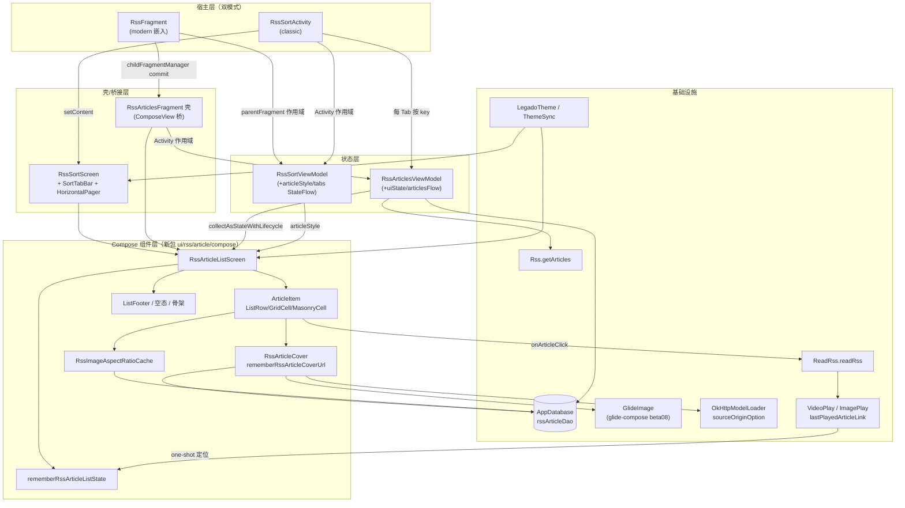

# design-b3-d4-flagship.md — D4 Rss 文章列表迁移设计册（B3 旗舰）

> 上游定稿：`docs/specs/compose-migration-status-audit/design.md` AD-03 / AD-07 / AD-08。
> 范围：RssArticlesFragment（纯 XML + Adapter 5 代并存）+ RssSortActivity（分类容器/布局选择器）收敛为单一 Compose 列表组件，classic/modern 双模式共享，兼容 embeddedInModernRss 嵌入复用。
> 技术分析基线：源码只读不改（本设计册写作时点的实况），全文只描述技术结构，不含业务数据。

---

## 1. Technical Approach（五代 Adapter 收敛策略）

### 1.1 现状盘点

宿主关系（唯一双宿主组件）：

```
RssArticlesFragment（VMBaseFragment，R.layout.fragment_rss_articles，纯 XML）
├─ 宿主 A（classic）：RssSortActivity — ViewPager + FragmentStatePagerAdapter，多分类 Tab
│    └─ activityViewModel = ViewModelProvider(requireActivity())[RssSortViewModel]
└─ 宿主 B（modern 嵌入）：RssFragment.renderCurrentSort() — childFragmentManager.commit 进 R.id.rss_fragment_container
     └─ activityViewModel = ViewModelProvider(parentFragment)[RssSortViewModel]（即 RssFragment.sortHostViewModel）
```

Adapter 家族分派逻辑（`RssArticlesFragment.adapter` lazy 块）：按 `RssSortViewModel.articleStyle`（源实体字段 0~4）选择：

### 1.2 五代差异对照表（可删性判定）

| 代 | 类 / 布局 | articleStyle | 布局形态 | 与"基准代"差异 | 调用方 | 可删性判定 |
|---|---|---|---|---|---|---|
| 基准 | `RssArticlesAdapter` + `item_rss_article.xml` | 0（else 分支） | LinearLayout 列表行 + VerticalDivider | —（基准） | 仅 RssArticlesFragment | ✅ 可删：逻辑被 ArticleItem(ListRow) 完全覆盖 |
| 一代 | `RssArticlesAdapter1` + `item_rss_article_1.xml` | 1 | 列表行 | 代码与基准逐行等价，仅 ViewBinding 类型不同 | 仅 RssArticlesFragment | ✅ 可删：与基准合并为参数化 ListRow |
| 二代 | `RssArticlesAdapter2` + `item_rss_article_2.xml` | 2（isGridLayout=true） | GridLayoutManager 2 列，padding 8 | 占位图 `transparent_placeholder`（hideWhenBlank=false 生效） | 仅 RssArticlesFragment | ✅ 可删：ArticleItem(GridCell, span=2) |
| 三代 | `RssArticlesAdapter3` + `item_rss_article_3.xml` | 3 | StaggeredGrid 2/3 列（横屏 3），瀑布流 | 独有：宽高比 LruCache(399)+CacheManager 20 天持久化（`img_ar_` 前缀）、cardWidth 计算、adjustViewBounds | 仅 RssArticlesFragment | ✅ 可删：MasonryCell + 移植 `RssImageAspectRatioCache`（逻辑原样保留） |
| 四代 | `RssArticlesAdapter4` + `item_rss_article_4.xml` | 4 | GridLayoutManager 3 列，padding 4 | 占位图同二代；**但 hideWhenBlank=!isGridLayout，style=4 时 isGridLayout=false → 图片缺失即隐藏**（与"网格显示占位"预期不一致，原样保留并在 §4 登记） | 仅 RssArticlesFragment | ✅ 可删：ArticleItem(GridCell, span=3, hideBlankImage=true) |
| 抽象基类 | `BaseRssArticlesAdapter<VB>` | — | — | 独有：`loadArticleImage()`——单行 `getImage(origin, link)` 按需取图（防 base64 大图挤爆 CursorWindow 2MB）+ `holder.itemView.tag=link` 防复用错位 + `OkHttpModelLoader.sourceOriginOption` 注入 | 5 个子类 | ✅ 可删：逻辑移植 `rememberRssArticleCover`（§2.4） |

结论：**5 代 Adapter 无任何外部调用方**（Grep 全工程仅 `ui/rss/article` 包内 7 个文件互相引用），`BaseRssArticlesAdapter.CallBack` 仅 `isGridLayout` + `readRss()` 两个能力，全部可被单一 Compose 组件参数覆盖。

### 1.3 收敛策略

1. **列表渲染层**：5 代 Adapter → 1 个 `RssArticleListScreen`（§2），`articleStyle: Int` 映射 `RssArticleListStyle` 枚举（LIST/CARD/GRID_2/MASONRY/GRID_3），3 种 item 形态（ListRow / GridCell / MasonryCell）参数化复用。
2. **取图策略**：`flowByOriginSort` 不 select image 字段（R1 沉淀），列表项按需单行取图逻辑**原样保留**，移植为 state holder（§2.4），禁止在列表流中恢复 image 字段（CursorWindow 2MB 红线）。
3. **宿主层**：modern 嵌入保留 Fragment 壳（childFragmentManager 契约不变，`RssFragment.renderCurrentSort()` 零改动）；classic 宿主 RssSortActivity 的 ViewPager+FragmentStatePagerAdapter → Compose `HorizontalPager` + `SortTabBar`（§5）。
4. **双模式共享**：`RssArticleListScreen` 为宿主无关的 stateful-less 组件（收不可变 state + 显式回调），classic/modern 差异全部下沉到宿主接线层（§3.4）。

**实现注意**：LazyColumn 的 key 驱动差分替代原 DiffUtil payload（"read"/"title" 部分刷新）；RecyclerView 复用机制导致的"切换标签时差异化更新状态混乱"（源码注释铁证）在 Compose 下不存在，`fullRefresh` 标记仅保留给分页/清库路径，不再影响列表更新方式。

---

## 2. 组件设计（代码级）

> 落点：`app/src/main/java/io/legado/app/ui/rss/article/compose/`（新包）。全部包 `LegadoTheme{}` 由宿主负责；组件内**禁止** `Color(0x...)` 硬编码，一律 `MaterialTheme.colorScheme` / 既有 token。

### 2.1 风格枚举与屏幕签名

```kotlin
package io.legado.app.ui.rss.article.compose

/** 与源实体 articleStyle 字段 0~4 一一对应（映射见 toRssArticleListStyle） */
enum class RssArticleListStyle {
    LIST,      // style 0/1：单列列表行
    GRID_2,    // style 2：两列网格
    MASONRY,   // style 3：瀑布流（竖屏 2 列 / 横屏 3 列）
    GRID_3,    // style 4：三列网格
}

fun Int.toRssArticleListStyle(): RssArticleListStyle = when (this) {
    2 -> RssArticleListStyle.GRID_2
    3 -> RssArticleListStyle.MASONRY
    4 -> RssArticleListStyle.GRID_3
    else -> RssArticleListStyle.LIST
}

/** 底部安全区行为：modern 嵌入时消费主底部栏 padding，独立宿主消费导航栏 */
enum class ListBottomInset { MAIN_BOTTOM_BAR, NAVIGATION_BARS }

/**
 * D4 收敛后的唯一文章列表组件（骨架分型=内容列表，非 S2 管理页；复用 D4 组件契约，不套 AppManagementScaffold 族）。
 * 契约：组件不持有业务状态；articles 由宿主收集 Room Flow 后传入。
 */
@Composable
fun RssArticleListScreen(
    state: RssArticleListState,
    style: RssArticleListStyle,
    isRefreshing: Boolean,
    hasMore: Boolean,
    onLoadMore: () -> Unit,
    onRefresh: () -> Unit,
    onArticleClick: (RssArticle) -> Unit,
    // 长按为可选扩展（D4 本页无长按语义不传；D5 换源菜单/D7 收藏删除等 B4 复用时注入）
    onItemLongClick: ((RssArticle) -> Unit)? = null,
    bottomInset: ListBottomInset,
    modifier: Modifier = Modifier,
    // slot：空态可替换（D7 收藏页复用时注入差异化文案/入口）；null=默认空态
    emptyContent: (@Composable BoxScope.() -> Unit)? = null,
) {
    val lazyListState = state.lazyListState
    val gridState = state.lazyGridState
    // 滚动恢复/回顶 effect 接线点（§2.2 ScrollRestoreEffect：pending 一次性定位 + gotoTop 回顶）
    ScrollRestoreEffect(state)
    val bottomPadding = when (bottomInset) {
        ListBottomInset.MAIN_BOTTOM_BAR -> /* MainBottomBar insets */ 0.dp
        ListBottomInset.NAVIGATION_BARS -> /* navigationBarsInsets */ 0.dp
    }
    val contentPadding = PaddingValues(
        top = with(LocalDensity.current) { state.topOverlaySpacePx.toDp() },
        bottom = bottomPadding,
    )
    PullToRefreshBox(
        isRefreshing = isRefreshing,
        onRefresh = onRefresh,
        modifier = modifier.fillMaxSize(),
    ) {
        when (style) {
            RssArticleListStyle.LIST -> LazyColumn(
                state = lazyListState,
                contentPadding = contentPadding,
                modifier = Modifier.fillMaxSize(),
            ) {
                articlesItems(state, style, onArticleClick, onLoadMore, hasMore)
            }
            RssArticleListStyle.MASONRY -> LazyVerticalStaggeredGrid(
                state = state.staggeredGridState,
                columns = StaggeredGridCells.Adaptive(minSize = 150.dp),
                contentPadding = contentPadding,
                modifier = Modifier.fillMaxSize(),
            ) {
                articlesStaggeredItems(state, style, onArticleClick, onLoadMore, hasMore)
            }
            RssArticleListStyle.GRID_2, RssArticleListStyle.GRID_3 -> LazyVerticalGrid(
                state = gridState,
                columns = GridCells.Fixed(if (style == RssArticleListStyle.GRID_2) 2 else 3),
                contentPadding = contentPadding,
                modifier = Modifier.fillMaxSize(),
            ) {
                articlesGridItems(state, style, onArticleClick, onLoadMore, hasMore)
            }
        }
        if (state.articles.isEmpty() && !isRefreshing) {
            if (emptyContent != null) emptyContent()
            else DefaultEmptyContent(modifier = Modifier.align(Alignment.Center))
        }
    }
}
```

### 2.2 state holder：`rememberRssArticleListState`

```kotlin
@Stable
class RssArticleListState(
    val lazyListState: LazyListState,
    val lazyGridState: LazyGridState,
    val staggeredGridState: LazyStaggeredGridState,
    /** 待定位的已读恢复目标初始值（VideoPlay/ImagePlay 返回一次性定位），null=无 */
    initialPendingLink: String?,
    /** 手动滚顶请求计数（RssFragment.gotoTop 联动），自增触发 LaunchedEffect */
    internal val scrollToTopRequest: MutableState<Int>,
) {
    /** modern 嵌入：宿主顶栏覆盖占位（RssFragment.setTopOverlaySpace 同源数据）；mutableStateOf backing，setTopOverlaySpace 写入即驱动重组 */
    var topOverlaySpacePx: Int by mutableStateOf(0)
        internal set

    /** UI 侧可见数据（宿主收集 Room Flow 后回填；组件只读） */
    var articles: List<RssArticle> by mutableStateOf(emptyList())
        internal set

    /** pending 定位目标：mutableStateOf backing，供 ScrollRestoreEffect 的 snapshotFlow 观察 */
    private var pendingScrollToLink by mutableStateOf(initialPendingLink)

    /** 播放器/图片浏览器返回时一次性滚动到离开位置（对齐原 onResume 逻辑） */
    fun requestScrollToLink(link: String) { pendingScrollToLink = link }

    /** 一次性消费：取值并置空（ScrollRestoreEffect 专用） */
    fun consumePendingLink(): String? = pendingScrollToLink.also { pendingScrollToLink = null }

    fun requestScrollToTop() { scrollToTopRequest.value += 1 }
}

/**
 * 进程恢复（I5）：lazyListState/lazyGridState/staggeredGridState 需进程恢复的场景由壳以
 * rememberSaveable(saver = LazyListState.Saver) 创建后传入（见 §4 边界 9），本默认工厂仅用于
 * 预览/无恢复诉求场景；topOverlaySpacePx/articles/pending 为可回放运行时态，无需 saveable。
 */
@Composable
fun rememberRssArticleListState(
    topOverlaySpacePx: Int = 0,
): RssArticleListState {
    val state = remember {
        RssArticleListState(
            lazyListState = LazyListState(),
            lazyGridState = LazyGridState(),
            staggeredGridState = LazyStaggeredGridState(),
            initialPendingLink = null,
            scrollToTopRequest = mutableStateOf(0),
        )
    }
    state.topOverlaySpacePx = topOverlaySpacePx
    return state
}
```

定位效果（在 Screen 内部执行，消费 pending 值）：

```kotlin
@Composable
private fun ScrollRestoreEffect(state: RssArticleListState) {
    // 常驻 effect（key=Unit，组合期只安装一次）：经 snapshotFlow 消费 pending（consumePendingLink
    // 取值即置空，一次性语义），无组合体 back-write 与 `?: return`；key 不含 articles.size（列表异步回填后仍可定位）
    LaunchedEffect(Unit) {
        snapshotFlow { state.consumePendingLink() }
            .filterNotNull()
            .collect { link ->
                val index = state.articles.indexOfFirst { it.link == link }
                if (index >= 0) state.lazyListState.scrollToItem(index)
            }
    }
    val topReq by state.scrollToTopRequest
    LaunchedEffect(topReq) {
        if (topReq > 0) state.lazyListState.scrollToItem(0)
    }
}
```

### 2.3 `ArticleItem` 骨架（三种形态）

```kotlin
/** key 策略：origin+sort+link 组合唯一（与 DAO 主键对齐）；重复时退化为 order 保唯一 */
// E5 修订：spacing 一律引用 AppPageSpacing token（B2 冻结取值，见 baseline 册 §3；4dp 半格保留，本节原无 14/6dp 字面量）
internal fun RssArticle.stableListKey(): String =
    "$origin|$sort|$link".let { if (it in duplicateKeyGuard) "$it|${order}" else it }

@Composable
private fun ArticleItem(
    article: RssArticle,
    style: RssArticleListStyle,
    onClick: () -> Unit,
    modifier: Modifier = Modifier,
) {
    val selected = MaterialTheme.colorScheme
    val titleColor = if (article.read) selected.onSurfaceVariant else selected.onSurface
    when (style) {
        RssArticleListStyle.LIST -> Row(
            modifier = modifier
                .fillMaxWidth()
                .clip(MaterialTheme.shapes.small)
                .combinedClickable(onClick = onClick) // 预留长按：D7 复用
                .padding(horizontal = AppPageSpacing.PageHorizontal, vertical = AppPageSpacing.CardGap),
            verticalAlignment = Alignment.CenterVertically,
        ) {
            Column(Modifier.weight(1f)) {
                Text(
                    text = article.title.orEmpty(),
                    color = titleColor,
                    style = MaterialTheme.typography.bodyLarge,
                    maxLines = 2,
                    overflow = TextOverflow.Ellipsis,
                )
                Text(
                    text = article.pubDate.orEmpty(),
                    color = selected.onSurfaceVariant,
                    style = MaterialTheme.typography.bodySmall,
                )
            }
            // 非网格形态：图缺失即隐藏（对齐 hideWhenBlank=true）
            RssArticleCover(
                article = article,
                hideWhenBlank = true,
                modifier = Modifier
                    .padding(start = AppPageSpacing.CardGap)
                    .size(width = 96.dp, height = 64.dp)
                    .clip(MaterialTheme.shapes.small),
            )
        }
        RssArticleListStyle.GRID_2, RssArticleListStyle.GRID_3 -> Column(
            modifier = modifier
                .clip(MaterialTheme.shapes.small)
                .combinedClickable(onClick = onClick)
                .padding(4.dp),
        ) {
            // 网格形态：占位常显（二代行为；四代原行为差异见 §4-7）
            RssArticleCover(
                article = article,
                hideWhenBlank = false,
                modifier = Modifier
                    .fillMaxWidth()
                    .aspectRatio(4f / 3f)
                    .clip(MaterialTheme.shapes.small),
            )
            Text(
                text = article.title.orEmpty(),
                color = titleColor,
                style = MaterialTheme.typography.bodyMedium,
                maxLines = 2,
                overflow = TextOverflow.Ellipsis,
                modifier = Modifier.padding(vertical = AppPageSpacing.ItemGapInline, horizontal = 4.dp),
            )
        }
        RssArticleListStyle.MASONRY -> Column(
            modifier = modifier
                .padding(horizontal = AppPageSpacing.ItemGapInline, vertical = AppPageSpacing.CardGap)
                .clip(MaterialTheme.shapes.medium)
                .combinedClickable(onClick = onClick),
        ) {
            MasonryCover(
                article = article,
                modifier = Modifier.fillMaxWidth(),
            )
            Text(
                text = article.title.orEmpty(),
                color = titleColor,
                style = MaterialTheme.typography.bodyMedium,
                maxLines = 3,
                overflow = TextOverflow.Ellipsis,
                modifier = Modifier.padding(AppPageSpacing.ItemGapInline),
            )
        }
    }
}
```

items 装配（key/contentType 策略，以 LazyColumn 为例）：

```kotlin
private fun LazyListScope.articlesItems(
    state: RssArticleListState,
    style: RssArticleListStyle,
    onArticleClick: (RssArticle) -> Unit,
    onLoadMore: () -> Unit,
    hasMore: Boolean,
) {
    itemsIndexed(
        items = state.articles,
        key = { _, item -> item.stableListKey() },
        contentType = { _, _ -> "rss_article_${style.name}" }, // 同形态复用
    ) { _, article ->
        ArticleItem(
            article = article,
            style = style,
            onClick = { onArticleClick(article) },
        )
    }
    item(key = "footer", contentType = "footer") {
        ListFooter(hasMore = hasMore, onRetry = onLoadMore)
    }
}
```

### 2.4 图片加载：`RssArticleCover`（glide-compose）

```kotlin
/** 三代 Adapter 宽高比缓存原样移植（LruCache + CacheManager，key 前缀/有效期不变） */
object RssImageAspectRatioCache {
    private const val KEY_NAME = "img_ar_"
    private const val SAVE_TIME = 60 * 60 * 24 * 20
    private val lru = LruCache<String, Float>(399)
    fun get(url: String): Float = lru[url] ?: CacheManager.getFloat(KEY_NAME + url)?.also {
        lru.put(url, it)
    } ?: 0f
    fun put(url: String, ratio: Float) {
        if (ratio <= 0f) return
        lru.put(url, ratio)
        CacheManager.put(KEY_NAME + url, ratio, SAVE_TIME)
    }
}

/**
 * 单行按需取图 state holder（替代 BaseRssArticlesAdapter.loadArticleImage）：
 * 1. 先查 DB 单行 image（RssArticleDao.getImage，单行远小于 CursorWindow 2MB，安全）；
 * 2. item.link 复用错位防护由 Compose key 天然解决，无需 itemView.tag 等价物；
 * 3. 失败/缺失时按 hideWhenBlank 决定隐藏或占位。
 */
@Composable
fun rememberRssArticleCoverUrl(article: RssArticle): String? {
    var url by remember(article.origin, article.link) { mutableStateOf<String?>(null) }
    LaunchedEffect(article.origin, article.link) {
        url = kotlin.runCatching {
            appDb.rssArticleDao.getImage(article.origin, article.link)
        }.getOrNull()?.takeIf { it.isNotBlank() }
    }
    return url
}

@Composable
fun RssArticleCover(
    article: RssArticle,
    hideWhenBlank: Boolean,
    modifier: Modifier = Modifier,
    contentScale: ContentScale = ContentScale.Crop,
) {
    val coverUrl = rememberRssArticleCoverUrl(article)
    if (coverUrl.isNullOrBlank()) {
        if (!hideWhenBlank) PlaceholderBox(modifier) // 占位：painterResource(R.drawable.image_rss_article)
        return
    }
    GlideImage(
        model = coverUrl,
        contentDescription = null,
        contentScale = contentScale,
        modifier = modifier,
        requestBuilderTransform = { it.set(OkHttpModelLoader.sourceOriginOption, article.origin) },
    )
}

/** 瀑布流封面：加载成功后记录真实宽高比（对齐三代 onResourceReady），缓存命中则预置高度 */
@Composable
private fun MasonryCover(article: RssArticle, modifier: Modifier = Modifier) {
    val coverUrl = rememberRssArticleCoverUrl(article)
    var ratio by remember(coverUrl) {
        mutableStateOf(coverUrl?.let { RssImageAspectRatioCache.get(it) } ?: 0f)
    }
    if (coverUrl.isNullOrBlank()) return
    GlideImage(
        model = coverUrl,
        contentDescription = null,
        contentScale = ContentScale.FillWidth,
        modifier = modifier.then(
            if (ratio > 0f) Modifier.aspectRatio(1f / ratio) else Modifier
        ),
        requestBuilderTransform = { it.set(OkHttpModelLoader.sourceOriginOption, article.origin) },
        onResourceReady = { resource, _ ->
            val w = resource.intrinsicWidth; val h = resource.intrinsicHeight
            if (w > 0 && h > 0) {
                ratio = h.toFloat() / w.toFloat()
                RssImageAspectRatioCache.put(coverUrl, ratio)
            }
        },
    )
}
```

### 2.5 分页 footer / 空态 / 错误态 / 骨架屏

```kotlin
@Composable
private fun ListFooter(hasMore: Boolean, onRetry: () -> Unit, modifier: Modifier = Modifier) {
    Box(modifier = modifier.fillMaxWidth().padding(16.dp), contentAlignment = Alignment.Center) {
        when {
            hasMore -> CircularProgressIndicator(Modifier.size(24.dp))
            else -> Text(
                text = stringResource(R.string.no_more), // 新增 key 需 en+zh 双语
                style = MaterialTheme.typography.bodySmall,
                color = MaterialTheme.colorScheme.onSurfaceVariant,
            )
        }
    }
}

@Composable
internal fun DefaultEmptyContent(modifier: Modifier = Modifier) {
    Text(
        text = stringResource(R.string.empty_message), // 复用既有 key；新 key 双语
        style = MaterialTheme.typography.bodyMedium,
        color = MaterialTheme.colorScheme.onSurfaceVariant,
        textAlign = TextAlign.Center,
        modifier = modifier.padding(horizontal = 32.dp),
    )
}
```

- **错误态**：加载失败沿用"页脚错误行 + 点击重试"（原 LoadMoreView.error 语义），`error: String?` 非空时 footer 渲染 `stringResource(R.string.error_)` + 重试按钮；顶栏 toast 由 VM `AppLog` + 现有 `loadErrorLiveData` 路径继续承担，不引入新弹层。
- **骨架屏**：首屏 `articles.isEmpty() && isRefreshing==true` 时渲染 6 行 shimmer 占位（`Modifier.background(MaterialTheme.colorScheme.surfaceVariant)` + `rememberInfiniteTransition` 驱动 animateFloat alpha 无限循环（W10 修订：替代一次性 animateFloatAsState，循环动画须用 InfiniteTransition），不引第三方 shimmer 库）；预加载场景（source.preload）不展示骨架，直接静默加载（对齐原 `refreshLayout.isRefreshing = !embeddedInModernRss` 语义）。
- **加载更多触发**：`LazyListState.canScrollForward == false` 边界由 `snapshotFlow` 监听（替代 onScrolled 回调）；瀑布流预加载阈值（可见 + 首位 >= 总数 - 5）保留在 staggered 分支。

**实现注意**：①`stableListKey` 的重复 key 守卫必须在 items 装配前一次性计算（预映射 Map），不得在 key lambda 内做副作用；②`GlideImage` 的 `onResourceReady`/`requestBuilderTransform` 为 beta08 API（AD-08 登记观察项，图片异常优先排查此处）；③所有 item 内文本 `article.title.orEmpty()` 防 null；④`combinedClickable` 长按当前页无行为（原五代均无长按），仅作 D7 复用预留，不注册 onLongClick 时不得传 `null` 之外的语义。

---

## 3. 状态与数据流

### 3.1 RssArticlesViewModel StateFlow 字段清单

保留既有 `Coroutine.async{}...onSuccess{}.onError{}` 封装与 `xxxAwait` 风格，新增 Compose 面向的 StateFlow（LiveData 保留一条过渡期共存，B5 收官拆除）：

| 字段 | 类型 | 来源/语义 |
|---|---|---|
| `uiState: StateFlow<RssArticlesUiState>` | `MutableStateFlow.asStateFlow()` | 聚合以下分页态 |
| `RssArticlesUiState.isRefreshing` | Boolean | 下拉/翻页/登录后全量刷新进行中 |
| `RssArticlesUiState.isLoadingMore` | Boolean | loadMore 进行中（替代原 `isLoading` var） |
| `RssArticlesUiState.hasMore` | Boolean | 对齐 `loadFinallyLiveData`（ruleNextPage 判定 + loadMoreSuccess 去重判定） |
| `RssArticlesUiState.page` | Int | 对齐 `pageLiveData` |
| `RssArticlesUiState.error` | String? | 对齐 `loadErrorLiveData`（内容仅入 AppLog，UI 只显示通用文案） |
| `articlesFlow: Flow<List<RssArticle>>` | Room Flow 直通 | `appDb.rssArticleDao.flowByOriginSort(origin, sortName)`（**不 select image**，R1 红线） |
| `nextPageUrl / sortName / sortUrl / page` | 既有 var | 保留：VideoPlay 分页上下文（阶段8 F9）依赖，签名不变 |

### 3.2 Compose 侧消费

```kotlin
// 宿主壳（FragmentsetContent / Activity pager page）内：
val articles by viewModel.articlesFlow
    .flowWithLifecycle(lifecycle, Lifecycle.State.STARTED)
    .flowOn(Dispatchers.IO)
    .collectAsStateWithLifecycle(initialValue = emptyList())
val uiState by viewModel.uiState.collectAsStateWithLifecycle()
```

- 原始 200ms `delay` 防抖 → Flow 侧 `.debounce(200)`（对齐原 collect 后 delay 语义，防 DB 连写抖动）。
- 原 DiffUtil payload 优化取消：`stableListKey` + data class `equals` 已保证"仅 read 变化的行局部重组"。

### 3.3 事件回调上行清单

| 事件 | 触发点 | 上行路径 | 落点 |
|---|---|---|---|
| 文章点击 | ArticleItem onClick | `onArticleClick(item)` | 宿主壳 → `ReadRss.readRss(fragment, item, source, articles, sortName, sortUrl, nextPageUrl, page)`（签名不变，`articles` 取 uiState 列表） |
| 下拉刷新 | PullToRefreshBox | `onRefresh()` | `viewModel.loadArticles(source, page = 1)` |
| 加载更多 | 滚动到底 / footer 重试 | `onLoadMore()` | `viewModel.loadMore(source)`（`isLoadingMore` 守卫防重入） |
| 翻页选择 | 顶栏菜单（classic） | Fragment 壳 `showPagePicker()` 保留 | NumberPickerDialog → `loadArticles(targetPage)` + `scrollToItem(0)` |
| 页码上报 | `pageLiveData` | 壳 observe → `onPageChanged(page, showPageMenu)` | classic：RssSortActivity.updatePageMenu；modern：无（顶栏无翻页菜单） |
| 登录返回刷新 | SourceLoginActivity result | 壳 `refreshAfterLogin()` 保留（public API 不变） | `loadArticles(fullRefresh = true)` |
| 回顶 | RssFragment.gotoTop | 壳新增 `fun scrollToTop()` → `state.requestScrollToTop()` | state holder（§2.2） |
| 已读定位 | VideoPlay/ImagePlay lastPlayedArticleLink | onResume 消费 → `state.requestScrollToLink(link)` | ScrollRestoreEffect |
| 布局切换 | classic 顶栏"切换布局" | `RssSortViewModel.switchLayout()` | articleStyle 流 → `style` 参数重组 |

本页**不存在**滑动菜单与批量选择（五代 Adapter 的 CallBack 仅 `isGridLayout`/`readRss`，无 onLongClick/onSwipe 契约）——组件不实现、不上报；D7 收藏页如需，走 `combinedClickable` 长按扩展，不在本批。

### 3.4 classic/modern 双模式分派 + embeddedInModernRss 兼容层

**模式判定点**（不变）：`AppConfig.modernRssPage`（`help/config/AppConfig.kt` L414，PreferKey `modernRssPage`，默认 true）仅被 `RssFragment.applyRssMode()` / `syncRssModeIfChanged()` 消费；本迁移**不新增判定点**，列表层对模式无感。

| 维度 | classic（RssSortActivity） | modern 嵌入（RssFragment） |
|---|---|---|
| 宿主载体 | Compose 全屏（GlassTopAppBar + SortTabBar + HorizontalPager），每 Tab 一个按 key 隔离的 `RssArticlesViewModel`（`viewModel(key = "rss_articles_$sortName")`，Activity 作用域） | 保留 `RssArticlesFragment` 壳（childFragmentManager 契约/`renderCurrentSort` 零改动），壳内 `ComposeView` 承载 `RssArticleListScreen` |
| RssSortViewModel 作用域 | Activity | parentFragment（既有 `ViewModelProvider(parentFragment ?: requireActivity())` 逻辑保留） |
| 顶栏 | GlassTopAppBar（已迁移，12.40 产物复用） | MainTopBarView（覆盖式），高度经 `setTopOverlaySpace(px, overlay)` → `state.topOverlaySpacePx` → contentPadding top |
| 底部安全区 | `ListBottomInset.NAVIGATION_BARS` | `ListBottomInset.MAIN_BOTTOM_BAR`（对齐 `applyMainBottomBarPadding`） |
| 初始加载时机 | pager 页 RESUMED 触发一次；`source.preload` 时旁路立即加载 | 对齐原 `repeatOnLifecycle(RESUMED){ 一次 }` + `isPreload` 分支 |
| 翻页菜单/登录 | 有（顶栏下拉菜单） | 无 |

**兼容层实现（Fragment 壳瘦身）**：

```kotlin
class RssArticlesFragment : VMBaseFragment<RssArticlesViewModel>(R.layout.fragment_rss_articles),
    RssArticleListHost {   // 壳仅保留：参数、VM 桥、宿主回调、ReadRss/定位联动

    fun setTopOverlaySpace(space: Int, overlay: Boolean) {   // RssFragment 调用点签名不变
        listState?.let { it.topOverlaySpacePx = space }       // 直接驱动重组
    }
    fun scrollToTop() { listState?.requestScrollToTop() }     // 替代 findViewById(R.id.recycler_view)
    fun refreshAfterLogin() { /* 既有逻辑 */ }
}
```

`fragment_rss_articles.xml` 缩壳为单 `ComposeView`（id 保留 `recycler_view` 作 `RssFragment.currentRssScrollTarget()` 旧 findViewById 路径的兜底；`scrollToTop()` 新 API 同步接线。定稿口径：**本批保留兜底代码不动，B5 巡检随批删除兜底代码**后再移除该 id，消除"保留兜底/删除兜底"的自相矛盾表述）。

**实现注意**：①`setTopOverlaySpace` 可能在 Fragment view 创建前被调用（`RssFragment.runOnCommit` 时序），state 未就绪时缓存值、view 创建后回放（对齐原 `view?.post{}` 语义）；②modern 模式 `refreshLayout.isRefreshing = !embeddedInModernRss` 的"嵌入态不显示刷新圈"语义由 `isRefreshing` 参数初始值控制，非组件内部判断 parentFragment（保持组件无环境感知）；③壳的构造器 `constructor(sortName, sortUrl, searchKey)` 与 arguments 键名不变（进程恢复依赖）。

---

## 4. 边界枚举

| # | 边界 | 行为设计 | 原实现对照 |
|---|---|---|---|
| 1 | 刷新冲突（DB 流重发 vs 翻页进行中） | `fullRefresh` 标记保留在 VM：翻页/清库/登录刷新置 true，本批次写库完成后复位；`loadMore` 进行中（`isLoadingMore`）时下拉刷新事件直接忽略；列表流重发永远整表采纳（Compose 无复用错位） | 原 `isResumed/fullRefresh` + DiffUtil 分支 |
| 2 | 分页到底 | `hasMore=false` → footer 常驻"没有更多"；`nextPageUrl` 为空时 `loadMore` 直接置 `hasMore=false` 并停止（防空页循环） | 原 `loadMoreView.noMore()` + VM L69-73 |
| 3 | 重复条目去重 | `loadMoreSuccess` 首尾查库去重逻辑保留；UI 层 `stableListKey` 碰撞守卫兜底（§2.3），防 LazyColumn duplicate key 崩溃 | 原 DAO append 前置判断 |
| 4 | 图片失败/缺失 | `rememberRssArticleCoverUrl` 查库为空 → 按 `hideWhenBlank` 隐藏/占位；Glide 加载失败 → 同占位路径（beta08 `onResourceReady`/失败监听统一封装在 `RssArticleCover`） | 原 RequestListener gone/visible |
| 5 | 下拉刷新与滚动手势冲突 | `PullToRefreshBox` 原生 nestedScroll 分发，仅列表在顶部时触发，无需 lock；瀑布流/网格同 API；modern 嵌入时刷新圈 offset 随 `topOverlaySpacePx` 下移（对齐原 `setProgressViewOffset`，用 `PullToRefreshDefaults` indicatorOffset） | SwipeRefreshLayout + offset 魔数 28/56dp |
| 6 | 批选态与导航栏 | 本页无批选（§3.3）；底部安全区由 `bottomInset` 参数静态消费，批选栏不进组件 | — |
| 7 | 四代网格 hideWhenBlank 不一致 | **原样保留**可观察行为（style=4 图片缺失即隐藏），不顺手修；在 migration-registry 登记 known-issue，待用户裁决后单独销号 | 原 `isGridLayout` 仅判 style==2 |
| 8 | 主题切换实时刷新（ThemeSync） | 颜色全部取自 `MaterialTheme.colorScheme`，`LegadoTheme` 内 ThemeStore 5 核心色变更经既有 ThemeSync 广播触发宿主重组，组件零额外代码；刷新圈/涟漪色随 scheme，不再单独 `setColorSchemeColors` | 原 accentColor/primaryColor 直取 |
| 9 | 进程恢复 | Fragment 路径：arguments（sortName/sortUrl/searchKey）+ VM 幸存，列表位置由 `rememberSaveable` 的 LazyListState（壳内 rememberRssArticleListState 改用 rememberSaveable 包装列表态）恢复；Activity 路径：`RssSortScreenState` 选中 Tab 以 `rememberSaveable` 持久化（替代原 `CURRENT_POSITION` 手写 save/restore） | onSaveInstanceState 手写 |
| 10 | 横竖屏切换 | MASONRY 列数由 `StaggeredGridCells.Adaptive` 自适应（等效原横 3/竖 2）；Activity 重建走恢复路径 #9 | 原 orientation lazy 判定 |

**实现注意**：#1 的 `fullRefresh` 在 Compose 语义下只剩"是否滚动回顶部"的副作用（翻页后回顶），注意不要让它阻断 Room 流收集。

---

## 5. RssSortActivity 迁移设计（布局选择器复用）

### 5.1 结构

```
RssSortActivity（VMBaseActivity 壳保留：Intent 处理/onNewIntent/registerForActivityResult）
└─ setContent { LegadoTheme { RssSortScreen(...) } }   // activity_rss_artivles.xml 整体退役
     ├─ GlassTopAppBar（复用既有：搜索 AppEditDialog / AppDropdownMenu 八项菜单原样平移）
     ├─ SortTabBar（新组件：多行分类选择器，替代手搓 LinearLayout+HorizontalScrollView 三行栈）
     └─ HorizontalPager(beyondViewportPageCount = 1)
          └─ 每页 = RssArticleListScreen（§2）+ 页内独立 RssArticlesViewModel(key)
```

### 5.2 布局选择器（articleStyle）复用

- `RssSortViewModel.switchLayout()`（0→1→2→3→4→0 循环 + DAO update）**原样保留**；新增 `articleStyle: StateFlow<Int>`（initData 读源 + switchLayout 成功回调更新），`RssSortScreen` 收集后传 `style = articleStyle.toRssArticleListStyle()`。
- 分页菜单项标题 `pageMenuTitle` 状态机原样保留（`updatePageMenu(page, visible)` public 方法保留，供壳 observe pageLiveData）。

### 5.3 SortTabBar 骨架

```kotlin
@Composable
fun SortTabBar(
    tabs: List<String>,
    selectedIndex: Int,
    onSelect: (Int) -> Unit,
    modifier: Modifier = Modifier,
) {
    // 行数策略对齐原实现：<=10 单行，<=20 两行，>20 三行（横屏减 1）
    val rows = remember(tabs.size) { computeRowCount(tabs.size) }
    val rowCapacity = (tabs.size + rows - 1) / rows   // W11 修订：先算每行容量局部量，chunked 与 globalIndex 共用
    Column(modifier = modifier.fillMaxWidth()) {
        tabs.chunked(rowCapacity).forEachIndexed { rowIndex, rowTabs ->
            LazyRow(
                modifier = Modifier.fillMaxWidth().padding(bottom = 6.dp),
                horizontalArrangement = Arrangement.spacedBy(6.dp, Alignment.CenterHorizontally),
                state = rememberLazyListState(),
            ) {
                itemsIndexed(rowTabs) { indexInRow, title ->
                    val globalIndex = rowIndex * rowCapacity + indexInRow
                    TabPill(
                        title = title,
                        selected = globalIndex == selectedIndex,
                        onClick = { onSelect(globalIndex) },
                    )
                }
            }
        }
    }
}

@Composable
private fun TabPill(title: String, selected: Boolean, onClick: () -> Unit) {
    Text(
        text = title,
        style = MaterialTheme.typography.bodyMedium,
        color = if (selected) MaterialTheme.colorScheme.onSurface
                else MaterialTheme.colorScheme.onSurfaceVariant,
        modifier = Modifier
            .clip(AppShapes.Capsule)                        // token 圆角，禁硬编码
            .then(if (selected) Modifier.border(1.dp, MaterialTheme.colorScheme.primary, AppShapes.Capsule) else Modifier)
            .clickable(onClick = onClick)
            .padding(horizontal = 12.dp, vertical = 6.dp),
    )
}
```

选中项滚动可见（对齐原 `ensureTabVisible`）：`LaunchedEffect(selectedIndex)` 内对目标行 `lazyListState.animateScrollToItem(indexInRow)`。

### 5.4 其余迁移点

| 项 | 处理 |
|---|---|
| `upFragments()` 分类解析（JSON map / searchUrl JS 预执行） | 逻辑平移进 `RssSortViewModel.loadSortTabs(): StateFlow<List<Pair<String,String>>>`，Activity 只接线；**L452 硬编码"搜索"文案改为 `stringResource` 对应资源**（新 key 双语） |
| 返回键（搜索态退搜索） | `BackHandler(enabled = searchKey != null)`，语义不变 |
| onNewIntent 复用 | 保留：`viewModel.initData(intent){ upFragments() }` |
| 登录/编辑源 result launcher | 保留；`currentArticlesFragment` 定位逻辑替换为「当前 Tab 页 VM 直调 `refreshAfterLogin()`」 |
| ReadRecordDialog / VariableDialog | 既有弹框原样保留（Fragment showDialogFragment 路径不变） |
| CURRENT_POSITION 恢复 | `HorizontalPager` state 走 `rememberSaveable`，删除手写 save/restore |
| dispatchTouchEvent 收键盘 | 保留（Activity 级行为） |

**实现注意**：①pager 每页 VM 用 `viewModel(viewModelStoreOwner = activity, key = "rss_articles_$sortName")`，Tab 数量变动（源刷新）时靠 key 天然隔离，不迁移旧 VM；②`searchKey != null` 时单 Tab「搜索」页同样走 pager（tabs.size==1 隐藏 SortTabBar）；③非 preload 源的"仅当前页加载"由页内 `Lifecycle.withResumed` 一次性触发实现（lifecycle-runtime-ktx），禁止 `repeatOnLifecycle`（会每次回前台重复网络请求，与原实现不等价）。

---

## 6. 旧代码删除清单（迁移完成后同提交执行）

| 类别 | 文件 | 前置条件 |
|---|---|---|
| Kotlin | `app/src/main/java/io/legado/app/ui/rss/article/BaseRssArticlesAdapter.kt` | 取图逻辑已移植 `rememberRssArticleCoverUrl` |
| Kotlin | `app/src/main/java/io/legado/app/ui/rss/article/RssArticlesAdapter.kt` | style 0 走新组件 |
| Kotlin | `app/src/main/java/io/legado/app/ui/rss/article/RssArticlesAdapter1.kt` | 同上 |
| Kotlin | `app/src/main/java/io/legado/app/ui/rss/article/RssArticlesAdapter2.kt` | 同上 |
| Kotlin | `app/src/main/java/io/legado/app/ui/rss/article/RssArticlesAdapter3.kt` | 宽高比缓存已移植 `RssImageAspectRatioCache` |
| Kotlin | `app/src/main/java/io/legado/app/ui/rss/article/RssArticlesAdapter4.kt` | 同上 |
| 布局 | `app/src/main/res/layout/item_rss_article.xml` | 上列 Kotlin 删除后无 ViewBinding 引用 |
| 布局 | `app/src/main/res/layout/item_rss_article_1.xml` | 同上 |
| 布局 | `app/src/main/res/layout/item_rss_article_2.xml` | 同上 |
| 布局 | `app/src/main/res/layout/item_rss_article_3.xml` | 同上 |
| 布局 | `app/src/main/res/layout/item_rss_article_4.xml` | 同上 |
| 布局 | `app/src/main/res/layout/fragment_rss_articles.xml` | 改造为单 ComposeView 壳（**本批不删**，缩壳保留 id 兜底；B5 巡检时随 `currentRssScrollTarget` 兜底移除后再删） |
| 布局 | `app/src/main/res/layout/view_load_more.xml` | **保留**（`LoadMoreView` 与 ReadMangaActivity 共用，仅解除本页 `ViewLoadMoreBinding` 引用） |
| 布局 | `app/src/main/res/layout/activity_rss_artivles.xml` | RssSortActivity 全 Compose 后删除（拼写错误文件名一并消亡） |
| menu XML | — | **无本页专属 menu**：顶栏已 Compose（GlassTopAppBar/AppDropdownMenu），`menu/rss_main_item.xml`、`menu/rss_source_sel.xml` 属其他页面，不列入 |
| 联动修改 | `ui/main/rss/RssFragment.kt` | 仅 `currentRssScrollTarget()`：`findViewById(R.id.recycler_view)` 兜底分支替换为 `(fragment as? RssArticlesFragment)?.scrollToTop()`（其余零改动） |

**实现注意**：删除顺序 = 先删 Kotlin（编译器兜底查引用）→ 编译过 → 再删布局资源；每次删除后跑一次 `assembleAppDebug`，禁止打包后再删资源。

---

## 7. 规范核查表（6 维门禁）

| 维度 | 核查项 | 结论 |
|---|---|---|
| ① 前端入口 | modern 入口 `RssFragment.renderCurrentSort()`（childFragmentManager replace）签名/时序不变 ✅；classic 入口 `RssSortActivity.start(context, sortUrl, sourceUrl, key)` 不变 ✅；`openRssLegacy` 路径不受影响 ✅；`gotoTop()`/`setTopOverlaySpace()` 两处跨层调用有等价新 API ✅ | 通过 |
| ② 接口调用 | `Rss.getArticles`/`loadMore` 网络链路零改动 ✅；`OkHttpModelLoader.sourceOriginOption` 取图注入保留 ✅；`ReadRss.readRss` 传参（列表快照/分页上下文）签名不变 ✅；glide-compose beta08 为 AD-08 已登记依赖 ✅ | 通过 |
| ③ 数据库 | `flowByOriginSort` 不含 image 字段（CursorWindow 2MB 红线，R1 沉淀）延续 ✅；单行 `getImage` 按需取图保留 ✅；无 schema 变更（v108 不动）✅；`clearOld/append/delete` 语义不变 ✅ | 通过 |
| ④ 覆盖安装兼容 | 覆盖安装后 articleStyle 0~4 全兼容（枚举映射 else→LIST）✅；PreferKey 无新增/废弃 ✅；进程恢复走 arguments+VM，无持久化格式变更 ✅；老缓存 `img_ar_` 前缀/20 天有效期原样兼容 ✅ | 通过 |
| ⑤ 使用场景 | 双模式（modernRssPage true/false）各自宿主场景逐一列出（§3.4 表）✅；preload/非 preload、登录源、翻页源、搜索态、横竖屏、播放器返回定位全枚举（§4）✅；无批选/滑动菜单场景（源码实证）✅ | 通过 |
| ⑥ 文档回填点 | `migration-registry.md` 登记 D4 迁移行 + known-issue（§4-7 hideWhenBlank 不一致）✅；`pages-inventory.md` §G D4 行校准 ✅；`updateLog.md` 编译前追加（禁合并旧条目）✅；`ai_memory_main.md` 交付后沉淀 ✅；本设计册归档于 spec 目录 ✅ | 通过 |

---

## 8. 用例级测试设计（L2 固化脚本）

脚本：`ai_tests/scripts/l2_verify_compose_rss_articles.py`（uiautomator 控件级；使用 `ai_tests\venv\Scripts\python.exe`；**adb shell 一律 `su -c "整串命令"` 铁律**；测试包 = `io.legado.miss.app.debug`，真机单包独占）。

| # | 场景 | 前置 | 操作 | 断言 | 证据 |
|---|---|---|---|---|---|
| S1 | classic 列表渲染 | 导入测试源（含 ruleArticles）；`modernRssPage=false` | 首页进订阅 → 点击测试源卡片 | 文章行控件出现（`resource-id` 匹配列表容器 + 文本节点非空）；首屏 ≤3s | 截图 + dump 层级（编号化输出） |
| S2 | 四种布局切换 | 同 S1 | 顶栏菜单"切换布局"×3 逐次触发 | 网格/瀑布流列数与 style 映射一致（子项宽度/每屏项数特征断言）；无崩溃 | 每步截图 |
| S3 | 下拉刷新 | 同 S1 | swipe 下拉首屏 | 刷新指示出现后消失；行数 ≥ 刷新前 | logcat 技术关键词过滤（Exception/Error） |
| S4 | 分页加载 | 源含 ruleNextPage | 连续滑动到底 | footer"没有更多"节点出现（对应文案 resource 断言）；去重后行数稳定 | dump + 截图 |
| S5 | 点击进阅读 | 同 S1 | 点击首个文章行 | 阅读页 Activity 前台；返回后滚动位置保持（列表首个可见项 link 与离开前一致，经编号化 dump 比对位置索引） | 双端截图 |
| S6 | 播放器返回定位 | 同 S1，`VideoPlay.lastPlayedArticleLink` 已置 | 从视频播放返回列表 | 自动滚动到目标项（目标索引项可见） | dump 可见区间断言 |
| S7 | modern 嵌入复用 | `modernRssPage=true`；导入可 modern 渲染源 | 首页订阅 Tab → 选源 | 嵌入列表渲染正常；顶栏覆盖区不遮挡首行（首行 item bounds.top ≥ 顶栏 height）；底部主底部栏无遮挡 | 截图 + bounds 断言 |
| S8 | 双模式切换回归 | 同 S1/S7 | 设置页切 modernRssPage → 回订阅页（触发 recreate 收敛） | 两形态各自渲染正确、无残留容器（经典网格/嵌入列表互斥可见） | 每形态截图 |
| S9 | 登录后刷新 | 源含 loginUrl | 顶栏菜单登录 → 完成返回 | 列表重新加载（刷新指示出现）| logcat + 截图 |
| S10 | 空态/断源 | 无数据源/清空文章 | 进入分类页 | 默认空态文案节点可见（stringResource key 断言） | 截图 |
| S11 | 主题切换实时性 | 同 S1 | 切换深/浅主题后返回 | 列表文字/占位色随 scheme（截图像素基线比对） | 双主题截图 |
| S12 | 进程恢复 | 同 S1，滚动到中部 | `su -c "am kill <pkg>"` 后重进 | 列表恢复至原位置附近（首可见项索引容差 ±2） | dump 对比 |

**实现注意**：①所有 dump 输出按 output-safety 编号化（源[1]/项[n]），脚本内不落业务文本；②S2 依赖 §4-7 已知差异按原行为断言；③S12 前置需源已缓存（离线可渲染）。

---

## 9. 依赖图



**实现注意**：mermaid 仅表达静态依赖方向；`RF→SVM` 的 parentFragment 作用域与 `RAF→AVM` 的 Activity 作用域不可互换（§3.4 表），实施时以 `ViewModelProvider(owner)` 显式传参，禁止 lazy 推断漂移。

---

## 交付核对

- [x] §1 五代对照表含可删性判定与调用方
- [x] §2 kotlin 骨架完整（签名/state holder/item/图片/footer）
- [x] §3 StateFlow 清单 + 事件上行 + 双模式分派表 + 兼容层
- [x] §4 边界 10 项（含手势冲突/ThemeSync/进程恢复）
- [x] §5 RssSortActivity + 布局选择器复用 + SortTabBar
- [x] §6 删除清单逐文件（含 menu XML 零归属说明）
- [x] §7 6 维门禁逐项打勾
- [x] §8 L2 场景表（su -c 整串铁律）
- [x] §9 mermaid（非 ASCII）
