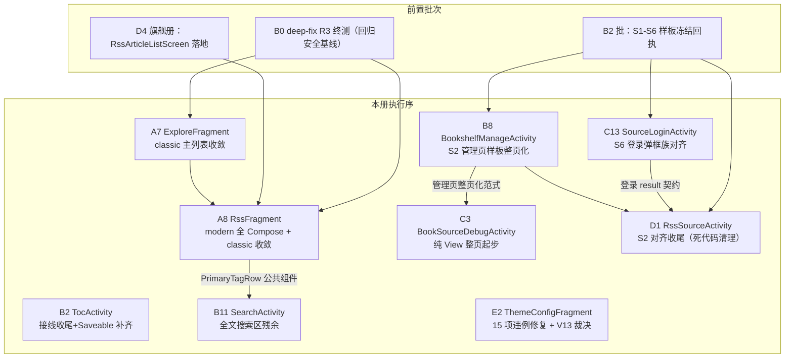

# design-b3-pages.md — B3 批次其余 9 页实施级设计册

> 上游定稿：`docs/specs/compose-migration-status-audit/design.md`（AD-03/07/08）＋ `design-b3-d4-flagship.md`（D4 旗舰另册，本册不复述）＋ `docs/specs/list-residue-compose/design.md`（A7 规格）＋ `docs/specs/ui-redesign-m3/pages-inventory.md` §E2 v2.8 预审（V1-V15）。
> 覆盖范围：design.md 页级总表 B3 批次 10 项中除 D4 外的 9 项：A7 / A8 / B2 / B8 / B11 / C3 / C13 / D1 / E2。
> 行号锚点为本设计册写作时点源码实况（2026-08-30 核验），实施时以技术结构为准、行号允许漂移。全文只描述技术结构，不含业务数据。
> 项目硬约束（全册生效）：`LegadoTheme{}` 包裹 / 禁 `Color(0x…)` 硬编码 / strings.xml 双语（values + values-zh）/ `copy()` 强跳过陷阱规避 / `Coroutine.async{}…onError{}.onSuccess{}` 链 / `AppLog.put()` 日志 / 管理页基线 `AppManagementScaffold` / 头部基线 `GlassTopAppBar` / 测试 adb 一律 `su -c "整串命令"`。

---

## 0. 册首总览

### 0.1 九页依赖图



依赖说明：
- **A8 依赖 D4**：modern 嵌入壳 `RssArticlesFragment` 契约零改动（`renderCurrentSort` 不动），但 A8 实施必须在 D4 落地后回归验证嵌入列表渲染。
- **A7 → A8**：A7 产出的「classic 列表收敛接线范式」（Fragment 内 `mutableStateListOf` 直通 Compose）在 A8 复用。
- **B8 / D1 依赖 B2 批样板冻结**：`AppManagementScaffold`（S2）必须先有 §3.3 回执才可照抄。
- **B11 依赖 A8**：共用新增公共组件 `PrimaryTagRow`（Compose 胶囊标签条）。
- **C13 → D4/A7 消费方**：登录 result 契约（`SourceLoginActivity` 被 `ExploreAdapter` 菜单与 Rss 源登录路径调用），收尾时契约不变。

### 0.2 执行顺序（AD-07 严格串行，禁止并行 Edit 同一文件）

```
A7 → A8 → B2 → B8 → B11 → C3 → C13 → D1 → E2
每页完成即：assembleAppDebug 编译门禁 → 5.5 E2E（对应 L2 脚本）→ migration-registry 回执 → 下一页
E2 结束追加：V13 内置 4 套主题用户裁决（AskUserQuestion 三选项）→ 裁决销号
```

### 0.3 公共复用矩阵

| 页 | 复用的既有样板/组件 | 来源锚点 | 新增公共组件 |
|---|---|---|---|
| A7 | `ExploreModernListScreen`（4 布局变体既有）、`AppDropdownMenu`、`showComposeActionListDialog` | `ui/main/explore/ExploreModernListScreen.kt` | — |
| A8 | D4 `RssArticleListScreen`（嵌入壳不动）、`SourceFolderComposeGrid`（书架文件夹网格样式）、`GlassTopAppBar` | `ui/main/rss/`、D4 册 §2 | `PrimaryTagRow`（ui/widget/components） |
| B2 | `TocComposeScreen`（16 @Composable 自收尾）、`AppManagementMenuAction` | `ui/book/toc/TocComposeScreen.kt` | — |
| B8 | **S2 管理页全家**：`AppManagementScaffold` + `AppManagementAction/MenuAction` + 选择底栏 + reorder | `ui/widget/compose/AppManagementScaffold.kt`（参考接线：`RssSourceActivity.initComposeContent`） | — |
| B11 | `GlassTopAppBar`（搜索态）、`SearchResultScreen`/`SearchInputHelpScreen`（既有不动）、`SettingsSearchBar` | `ui/book/search/SearchResultScreen.kt` | `PrimaryTagRow`（与 A8 共享） |
| C3 | `GlassTopAppBar` + `AppDropdownMenu`（子页头部基线）、`showComposeChoiceListDialog`（既有调用保留） | `BookshelfManageActivity.initComposeTopBar` 同构 | — |
| C13 | **S6 弹框族 v2**：`ComposeDialogFragment`/`AppDialogFrame`/L1 输入/L2 选择/L3 动态表单（RowUi 行） | `ui/login/SourceLoginDialog.kt`（已全 Compose） | — |
| D1 | S2 全家（**已接线完毕**，仅收尾） | `ui/rss/source/manage/RssSourceScreen.kt` | — |
| E2 | `ComposeSettingFragment` spec 体系（SettingPageSpec/Section/Switch/Choice/Action）、`ThemeSpec.toM3Scheme` | `ui/config/compose/ComposeSettingFragment.kt` | `ThemeSpecPresets`（V13 落点，help/config） |

---

## 1. A7 ExploreFragment — classic 主列表收敛（7.11aj 销项）

### 1.1 ① 现状代码锚点

- `app/src/main/java/io/legado/app/ui/main/explore/ExploreFragment.kt`
  - L153：`class ExploreFragment : VMBaseFragment<ExploreViewModel>(R.layout.fragment_explore), MainFragmentInterface, ExploreAdapter.CallBack, ExploreShowBookCallback`
  - L167-168：binding + `ExploreAdapter`（classic 主列表）；L169 `LinearLayoutManager`
  - L190-238：三态运行时字段（classic/modern/suite）；modern 桥接 Compose 状态已就位（L197-222 `composeDiscoverBooks` 等）
  - L253-278：`swipeRefreshLayout` 三分支刷新回调（classic 分支走 `adapter.refreshExpandedIfNoKinds()`/`upExploreData`）
  - L289-313：`binding.composeDiscoverBooks.setContent { LegadoComposeTheme { ExploreModernListScreen(...) } }`（modern 已 Compose）
  - L317-345：`composeDiscoverySuite` → `DiscoverySuiteHomeScreen`（suite 已 Compose）
  - L359-396：`applyDiscoveryMode()` 按模式切换可见性（L369 `binding.rvFind.isGone = modern || suite`）
  - L397-406：`currentDiscoverScrollTarget()` 返回 `binding.rvFind`（L404）
  - L3488-3501：`initRecyclerView()`（edgeEffect + observer 首位插入回顶）
  - L3521-3550：`upExploreData()`：`bookSourceDao.flowExplore()` / `flowGroupExplore(key)` → `adapter.setItems(it, diffItemCallBack)` + `tvEmptyMsg` 显隐
  - L3631 / L3763-3765：经典定位/回顶（`scrollToPositionWithOffset` / `smoothScrollToPosition`）
- `app/src/main/java/io/legado/app/ui/main/explore/ExploreAdapter.kt`
  - L68：`class ExploreAdapter(context, callBack)`（item_find_book.xml，行内含分类 Spinner：L466 `item_text_common`/spinner dropdown）
  - L660-682：行长按菜单 `ModernActionPopup`（menu_edit/menu_top/menu_search/menu_login/menu_refresh/menu_del）
  - L685-693：`CallBack { scope; scrollTo(pos); openExplore; editSource; toTop; deleteSource; searchBook }`
- `docs/project-flow/ui-standards/migration-registry.md` L43：7.11aj 未完成项=主列表仍 RecyclerView；规格 `list-residue-compose`（其 B 部分瀑布变体已在 `ExploreModernListScreen` L397 `LazyVerticalStaggeredGrid` 实现，本页只销 classic 残余）

### 1.2 ② 目标形态与复用组件

classic 分支整段收敛：`rvFind + ExploreAdapter + tvEmptyMsg` → 新组件 `ExploreClassicScreen`（纯 Compose，收 state+回调）；数据流 `upExploreData` 收集结果由 `adapter.setItems` 改写 `mutableStateListOf`；行内分类 Spinner → 分类 chips 行；行长按菜单 → `showComposeActionListDialog`/`AppDropdownMenu`。布局 `fragment_explore.xml` 瘦身（去 rvFind/tvEmptyMsg；titleBar 保留至 B5 巡检裁决）。modern/suite 两态零改动。

### 1.3 ③ 状态设计

| 状态 | owner | 类型 | 语义 |
|---|---|---|---|
| `classicSources` | Fragment（沿用现有数据流位置，不进 VM——与 `upExploreData` 同源同生命周期） | `mutableStateListOf<BookSourcePart>` | 替代 `adapter.setItems` |
| `classicSearchKey` | Fragment | `mutableStateOf<String?>` | 顶栏搜索词（替代 `searchView.query` 直读） |
| `classicGroups` | Fragment | `mutableStateOf<Set<String>>` | 替代 `groups`（`flowExploreGroups` L3503-3519 收集） |
| `classicRefreshing` | Fragment | `mutableStateOf<Boolean>` | 替代 `swipeRefreshLayout.isRefreshing`（L3544） |
| 行级 kind 刷新 | Fragment | 按 `bookSourceUrl` 定位写状态 | 替代 `refreshExplore(source, position, binding)` 的 View 直改（L676/2175-2196） |

Effect：`classicSources` 变化经 `LaunchedEffect` 回顶（对齐 L3492-3500 observer）；`canScrollVertically(-1)` 等价 `derivedStateOf` 写 `composeDiscoverCanScrollBackward` 同名 classic 分支。

### 1.4 ④ kotlin 骨架

```kotlin
// ui/main/explore/ExploreClassicScreen.kt（新）
@Composable
fun ExploreClassicScreen(
    sources: List<BookSourcePart>,
    searchKey: String?,
    isRefreshing: Boolean,
    bottomInsetPx: Int,                       // applyMainBottomBarPadding 等价
    topPaddingPx: Int,                        // 顶栏 overlay 占位（对齐 composeDiscoverTopPadding 语义）
    onKindChange: (sourceUrl: String, tagIndex: Int, kindUrl: String) -> Unit,
    onSourceLongClick: (BookSourcePart) -> Unit,   // 六项菜单 ActionListDialog
    onOpenExplore: (String, String, String?) -> Unit,
    onLoadMoreLikeRowRefresh: (BookSourcePart) -> Unit,  // refreshExplore 等价
    modifier: Modifier = Modifier,
) {
    PullToRefreshBox(isRefreshing = isRefreshing, onRefresh = { /* 走 upExploreData(reset) */ },
        modifier = modifier) {
        LazyColumn(
            state = rememberLazyListState(),
            contentPadding = PaddingValues(top = with(LocalDensity.current) { topPaddingPx.toDp() },
                bottom = with(LocalDensity.current) { bottomInsetPx.toDp() }),
            modifier = Modifier.fillMaxSize(),
        ) {
            itemsIndexed(sources, key = { _, it -> it.bookSourceUrl }, contentType = { _, _ -> "explore_source_row" }) { _, part ->
                ExploreSourceRow(part = part, onKindChange = onKindChange,
                    onClick = { onOpenExplore(part.bookSourceUrl, part.name, null) },
                    onLongClick = { onSourceLongClick(part) })
            }
        }
        if (sources.isEmpty() && !isRefreshing) {
            Text(stringResource(R.string.empty_message),
                color = MaterialTheme.colorScheme.onSurfaceVariant,
                modifier = Modifier.align(Alignment.Center))
        }
    }
}

@Composable
private fun ExploreSourceRow(
    part: BookSourcePart, onKindChange: (String, Int, String) -> Unit,
    onClick: () -> Unit, onLongClick: () -> Unit,
) {
    var selectedKind by remember(part.bookSourceUrl) { mutableIntStateOf(0) }
    Column(Modifier.fillMaxWidth()
        .combinedClickable(onClick = onClick, onLongClick = onLongClick)
        .padding(horizontal = AppPageSpacing.PageHorizontal, vertical = AppPageSpacing.CardGap)) {
        Text(part.name.orEmpty(), style = MaterialTheme.typography.bodyLarge,
            color = MaterialTheme.colorScheme.onSurface, maxLines = 1)
        // 分类 chips（替代行内 Spinner）：kindUrl 非空的 exploreKinds 摘要
        if (part.exploreKinds.isNotEmpty()) {
            LazyRow(horizontalArrangement = Arrangement.spacedBy(AppPageSpacing.ItemGapInline),
                modifier = Modifier.padding(top = AppPageSpacing.ItemGapInline)) {
                itemsIndexed(part.exploreKinds) { i, kind ->
                    FilterChip(selected = i == selectedKind, onClick = {
                        selectedKind = i; onKindChange(part.bookSourceUrl, i, kind.url.orEmpty())
                    }, label = { Text(kind.title.orEmpty(), style = MaterialTheme.typography.labelMedium) })
                }
            }
        }
    }
}
```

Fragment 接线（diff 摘要）：`upExploreData()` collect 体 `adapter.setItems(it, diffItemCallBack)` → `classicSources.clear(); classicSources.addAll(it)`；`classic` 分支 `binding.rvFind`/`binding.tvEmptyMsg` 引用替换为 Compose 参数；`currentDiscoverScrollTarget()` L404 分支删除；菜单六项 → `showComposeActionListDialog(labels = 六项双语)` index 分派原 `CallBack` 方法（契约不动）。

### 1.5 ⑤ 边界枚举

1. **行内分类 Spinner 语义**：原 Spinner 支持"选中即打开对应发现"，chips 化后 `onKindChange` 必须直连 `openExplore` 语义（选定 kindUrl 立即跳 ExploreShow），不允许只改 UI 不触发；`exploreKinds` 为空的源不渲染 chips 行。
2. **空态与搜索态互斥**：`upExploreData` L3545 `tvEmptyMsg.isGone = it.isNotEmpty() || searchQuery 非空` 语义保留——搜索无结果不显示空态文案（走"无匹配"静默），避免双文案叠加。
3. **首项插入回顶**：`AdapterDataObserver.onItemRangeInserted(positionStart==0)` 等价实现为「新增源时回顶」；用 `snapshotFlow { classicSources.size }` 前后对比判定插入而非无脑回顶（防下拉刷新整表替换误触发）。
4. **分组菜单锚点**：`groupsMenuPopup`（ModernActionPopup）锚定 View，classic 收敛后锚点改 Compose 锚（`showComposeActionListDialog` 或 menu 按钮挂 `AppDropdownMenu`），`menu_main_explore` 系统菜单（L350-357 classic 才注入）随 titleBar 保留同步收敛判定。
5. **swipeRefresh 三分支**：classic 分支 `onChildScrollUpCallback` 用 `LazyListState.canScrollBackward`（`derivedStateOf`），modern/suite 分支零改动；刷新圈配色 `setColorSchemeColors(accentColor)` → `PullToRefreshBox` 默认随 scheme。
6. **进程恢复**：classic 搜索词/选中 kind 不跨进程持久（原实现即无），`classicSources` 由 DB Flow 重发恢复，无额外持久化。

### 1.6 ⑥ 验收检查点

脚本：`ai_tests/scripts/l2_verify_compose_explore.py`（测试包 `io.legado.miss.app.debug`，单包独占，`su -c` 整串铁律）。总注：操作步骤与证据形式引用对应固化脚本（l2_verify_compose_explore.py）四要素定义，本表列场景与断言要点。

| # | 场景 | 断言要点 |
|---|---|---|
| S1 | classic 模式进入发现页 | 源行控件出现（Compose 语义树节点），首屏 ≤3s；`rvFind` 引用 0 残留（logcat 无 View 绑定异常） |
| S2 | 分类 chips 点击 | 直达对应发现列表（ExploreShow 前台） |
| S3 | 行长按菜单 | 六项菜单 ActionListDialog 弹出、各项行为与原契约一致（置顶/删除以 DB 行序验证，编号化输出） |
| S4 | 下拉刷新 | 刷新圈出现后消失；源行数不减 |
| S5 | 分组筛选 | 分组菜单选择后列表按组过滤（`flowGroupExplore` 路径） |
| S6 | 空态 | 无发现源时空态文案节点可见 |
| S7 | 模式切换回归 | classic↔modern↔suite 三态往复，无残留容器（对齐 L359-396 幂等同步） |
| S8 | 主题切换 | 行文字/chips 色随 scheme（双主题截图基线） |

---

## 2. A8 RssFragment — modern 全 Compose + classic 收敛（紧随 D4）

### 2.1 ① 现状代码锚点

`app/src/main/java/io/legado/app/ui/main/rss/RssFragment.kt`：

- L131-133：`class RssFragment : VMBaseFragment<RssViewModel>(R.layout.fragment_rss), MainFragmentInterface, RssAdapter.CallBack, SourceFolderAdapter.CallBack`；L146 `sortHostViewModel`（RssSortViewModel，parentFragment 级）
- L148-235：双模式运行时状态（`usingModernRss`/`currentSorts`/`currentGroup`/`currentType`/`selectedRssTag`/胶囊 items 等）
- L342-352 `applyRssMode` → L355-380 `resetRssModeState`（跨模式重置：collector 取消/sortHostViewModel 清空/`classicHeaderReady` 释放）
- L383-419 `applyClassicRssMode`（L390-391 modern 容器双保险隐藏；L409-418 500ms 二次收敛守卫）
- L422-432 `applyModernRssMode` → L452-508 `initModernRssView`（`MainTopBarView.Mode.RSS` + `titleSelect` 源选择 + `primaryBar` 源标签 + `tagsBar` 分类标签）
- L709-745 `renderCurrentSort`：childFragmentManager commit `RssArticlesFragment`，tag `"rss_articles_${source.sourceUrl}_${selectedTagIndex}"`（**D4/进程恢复契约，A8 零改动**）
- L756+ `renderWebSource`（WebView 容器，红线保留）
- L946-981 `initComposeTopBar`（MainTopBarView 一级按钮：星标/刷新/搜索/历史/分组/设置）；L984-1001 `showGroupMenu`（ModernActionPopup）
- L1003-1009 `gotoTop`（WebView/RecyclerView/嵌入列表三分派）
- L1011-1028 `initRecyclerView`（header = 规则订阅入口行）；L1032-1042 `applyListView`（GridLayoutManager + GridSpacingItemDecoration）；L1057-1061 `effectiveSpanCount`（sourceLayout 2..6）
- L1065-1078 `initFolderComposeView`（**已 Compose**：`SourceFolderComposeGrid`）；L1082-1085 `initTabLayout`；L1088-1113 `upTabLayout`；L1116-1136 `applyView`

### 2.2 ② 目标形态与复用组件

分两小步（同一页内先后提交）：

- **步 1（classic 收敛）**：`binding.recyclerView + RssAdapter` → 新 `RssClassicScreen`（Compose 源卡网格，样式对齐 `SourceFolderComposeGrid`：列数 `effectiveSpanCount()`、间距 `AppConfig.sourceMargin`）；规则订阅入口 header → 列表首 item；分组/类型胶囊条（`RoundedTagBarView`）→ 公共组件 `PrimaryTagRow`。
- **步 2（modern 顶栏收敛）**：`MainTopBarView` RSS 态 → `GlassTopAppBar` + `PrimaryTagRow`（源标签）+ `PrimaryTagRow`（分类标签）+ 动作图标组（星标/搜索/历史/分组/设置/刷新）；`SourceSelectDialog` 弹出路径保留。`renderCurrentSort`/`renderWebSource`/`rss_fragment_container` 契约零改动（D4 嵌入壳不动）。

### 2.3 ③ 状态设计

| 状态 | owner | 类型 | 语义 |
|---|---|---|---|
| `classicSources` | Fragment | `mutableStateListOf<RssSource>` | 替代 RssAdapter 数据（`upRssFlowJob` 收集体） |
| `folderItems / folderCovers / folderSpan / folderMargin` | Fragment（既有） | Compose State（L171-176 已就位） | 文件夹网格，零改动 |
| `primaryTags / tagsSelected / sortTags` | Fragment → 迁为 `mutableStateListOf` | 步 2 后驱动 `PrimaryTagRow` | 替代 `groupTagItems`/`rssTags`（L200-204） |
| `rssTopOverlaySpace / rssTopOverlayEnabled` | Fragment（既有 L157-158） | 步 2 后经 `GlassTopAppBar` 高度自算，保留对外 setter 供嵌入列表 | overlay 兼容 |
| `currentGroup / currentType / selectedRssTag / selectedTagIndex / currentSorts` | Fragment（既有） | 不动 | 模式判定与渲染分派核心 |
| `RssViewModel` | 不新增 StateFlow | — | classic 数据流在 Fragment（与 A7 同范式），VM 仅保留 top/bottom/del/disable 工具方法 |

### 2.4 ④ kotlin 骨架

```kotlin
// ui/widget/components/PrimaryTagRow.kt（新公共组件，A8 步2 + B11 共享）
/**
 * 公共胶囊标签条（W4 修订：泛型化 + KDoc 登记）。
 * 设计来源：compose-migration-status-audit design.md AD-08（公共组件必须登记入组件目录，禁私有复制）。
 * 泛型承载标签数据（B11 传 List<String>，A8 传领域类型），label 提取交给调用方；
 * 不再强制 fillMaxWidth，宽度由调用方 modifier 控制。
 */
@Composable
fun <T> PrimaryTagRow(
    tags: List<T>,
    label: (T) -> String,
    selectedIndex: Int,
    onSelect: (index: Int) -> Unit,
    modifier: Modifier = Modifier,
) {
    LazyRow(
        modifier = modifier.padding(horizontal = AppPageSpacing.ItemGapInline, vertical = 4.dp),
        horizontalArrangement = Arrangement.spacedBy(AppPageSpacing.ItemGapInline),
    ) {
        itemsIndexed(tags, key = { i, _ -> i }) { i, tag ->
            val selected = i == selectedIndex
            Text(
                text = label(tag),
                style = MaterialTheme.typography.labelLarge,
                color = if (selected) MaterialTheme.colorScheme.onPrimary
                        else MaterialTheme.colorScheme.onSurfaceVariant,
                modifier = Modifier
                    .clip(AppShapes.Capsule)
                    .background(if (selected) MaterialTheme.colorScheme.primary
                                else MaterialTheme.colorScheme.surfaceVariant)
                    .clickable { onSelect(i) }
                    .padding(horizontal = AppPageSpacing.PageHorizontal, vertical = AppPageSpacing.ItemGapInline),
            )
        }
    }
}

// ui/main/rss/RssClassicScreen.kt（新）
@Composable
fun RssClassicScreen(
    sources: List<RssSource>,
    spanCount: Int, marginDp: Int,
    headerEntry: @Composable LazyGridScope.() -> Unit,   // 规则订阅入口行
    onSourceClick: (RssSource) -> Unit,
    onSourceLongClick: (RssSource) -> Unit,              // 登录/编辑/删除/置顶/置底 菜单
    modifier: Modifier = Modifier,
) {
    LazyVerticalGrid(
        columns = GridCells.Fixed(spanCount),
        contentPadding = PaddingValues(marginDp.dp / 2),
        verticalArrangement = Arrangement.spacedBy(marginDp.dp),
        horizontalArrangement = Arrangement.spacedBy(marginDp.dp),
        modifier = modifier.fillMaxSize(),
    ) {
        headerEntry()
        items(sources, key = { it.sourceUrl }, contentType = { "rss_source_card" }) { source ->
            SourceCard(source, onClick = { onSourceClick(source) },
                onLongClick = { onSourceLongClick(source) })
        }
    }
}
```

Fragment 接线（diff 摘要）：`upRssFlowJob` collect 体写 `classicSources`；`applyListView()` 删除，`applyView()` classic 分支改为参数切换（`RssClassicScreen` vs `SourceFolderComposeGrid` 复用同一 ComposeView 容器）；`gotoTop()` RecyclerView 分支 → `classicGridState.scrollToItem(0)`（`currentRssScrollTarget` 技术结构同步收口）；步 2 后 `initModernRssView` 的 titleSelect/primaryBar/tagsBar 全部转 Compose 状态驱动。

### 2.5 ⑤ 边界枚举

1. **模式切换重置保序**：`resetRssModeState`（L355-380）在 Compose 化后必须保持调用顺序（先取消 collector 再清 Compose 状态），防 "modern→classic 顶栏残留" 复发（L356-359 铁证）；L409-418 的 500ms 二次收敛守卫在步 2 完成后删除（顶栏单源后竞态不复存在），删除前必须回归双模式往复 5 次。
2. **嵌入契约零改动**：`renderCurrentSort` 的容器 id / fragment tag 格式 / `setTopOverlaySpace` 调用时序（L737-743）逐字保留；A8 不触碰 `RssArticlesFragment`（D4 册 §3.4 兼容层职责）。
3. **gotoTop 三分派**：WebView / classic 网格 / 嵌入文章列表三分支各自等价替换；`MainActivity` 对 `gotoTop()` 的调用签名不变（public API）。
4. **源标签滚动定位**：`updateRssSourceNameWidth`（L461-465）删除后，`GlassTopAppBar` 标题宽度自适应；源标签条选中项必须 `animateScrollToItem` 可见（对齐原 primaryBar 行为）。
5. **WebView 路径不受扰**：`renderWebSource` 的 WebView 创建/销毁/复用（L434-446）零改动；步 2 改动仅限顶栏与标签条层。
6. **spanCount/margin 实时生效**：分组配置弹框拖动边距滑条（L1045-1054 `previewRssMargin`）→ 写 `folderComposeMargin` 同源状态，网格 Compose 即时重组（原 `invalidateItemDecorations` 语义等价）。

### 2.6 ⑥ 验收检查点

脚本：`ai_tests/scripts/l2_verify_compose_rss_page.py`（R3 4.1 订阅切换专项场景复用 + 补充）。总注：操作步骤与证据形式引用对应固化脚本（l2_verify_compose_rss_page.py）四要素定义，本表列场景与断言要点。

| # | 场景 | 断言要点 |
|---|---|---|
| S1 | classic 源卡网格 | 网格渲染、列数=sourceLayout 配置、margin 实时生效 |
| S2 | 规则订阅入口行 | 首行入口可见且可点击 |
| S3 | 分组/类型胶囊 | primary 胶囊切换过滤生效（类型/分组双模式） |
| S4 | 双模式切换回归 | classic↔modern 往复 5 次：顶栏无残留、嵌入列表正常（R3 4.1 场景） |
| S5 | modern 顶栏动作 | 星标/搜索/历史/分组/设置五项可达性 |
| S6 | 源标签切换 | 源标签点击切换渲染（可 modern 渲染走嵌入，否则 legacy 打开） |
| S7 | gotoTop | 三分派场景回顶（classic 网格/嵌入列表/WebView） |
| S8 | 主题切换实时 | 顶栏/胶囊/卡片色随 scheme |

---

## 3. B2 TocActivity — 接线收尾（TocComposeScreen 已存在）

### 3.1 ① 现状代码锚点

- `app/src/main/java/io/legado/app/ui/book/toc/TocActivity.kt`
  - L28：`VMBaseActivity<ActivityChapterListBinding, TocViewModel>`；L31 binding（布局 `activity_chapter_list.xml` **已是单 ComposeView**，L2-3）
  - L35-36：`cacheRefreshTick/contentRefreshTick`（mutableIntStateOf 双通道刷新）
  - L46-81：`onActivityCreated` 已 `setContent { TocComposeScreen(...) }` 全回调接线（onOpenChapter/onShowTocRule/onUpdateToc/导出两路/onShowLog）
  - L83-89：`EventBus.SAVE_CONTENT` → cacheRefreshTick++；L91-94：onResume → contentRefreshTick++
  - L103-116 `upBookAndToc`（WaitDialog + ReadBook.upMsg）；L122-150+ `openChapter`（视频书分卷定位）
- `app/src/main/java/io/legado/app/ui/book/toc/TocComposeScreen.kt`
  - L90-93 `TocPage{Chapters, Bookmarks}`；L96-110 签名（**直传 viewModel**）；L114-135 状态块 `remember { mutableStateOf(...) }`（**无 rememberSaveable**：selectedPage/searchQuery/countWords/collapsedVolumeIndexes/列表滚动位）；L149-155 `produceState` 读 book；L660 `TocChapterList`、L857 `TocBookmarkList`、L936 `TocBottomBar`

### 3.2 ② 目标形态与复用组件

本页不迁移，做三件收尾：① `TocComposeScreen` 内 UI 态补 `rememberSaveable`（进程恢复）；② 长列表 key/contentType 校验 + 定位精度回归；③ registry 7.11 序列销号与真机回执。`viewModel` 直传参数**保持不动**（改造为纯 state 入参属重构，收益低风险高，登记 B5 评估项；`LazyListState` 已由 `rememberLazyListState` 持有 → 换 `rememberSaveable(saver=LazyListState.Saver)`）。

### 3.3 ③ 状态设计

| 状态 | owner | 改造 |
|---|---|---|
| `selectedPage` | TocComposeScreen L114 | `rememberSaveable { mutableStateOf(TocPage.Chapters) }` |
| `searchQuery / countWords / collapsedVolumeIndexes` | L115/119/130 | 同上 saveable 化（collapsed 用 `Saver` 序列化为 `List<Int>`） |
| `chapterListState / bookmarkListState` | L131-132 | `rememberLazyListState()` → `rememberSaveable(saver = LazyListState.Saver)` |
| `contentRefreshTick / cacheRefreshTick` | TocActivity L35-36 | 不动（tick 通道语义，进程恢复后 onResume 自然补发） |
| 业务数据（book/chapters/bookmarks） | produceState/LaunchedEffect | 不动（DB 重查即恢复） |

### 3.4 ④ kotlin 骨架

```kotlin
// TocComposeScreen.kt 内 diff（示例：saveable 化关键三处）
var selectedPage by rememberSaveable { mutableStateOf(TocPage.Chapters) }
var searchQuery by rememberSaveable { mutableStateOf("") }
val chapterListState = rememberSaveable(saver = LazyListState.Saver) { LazyListState() }
val collapsedSaver = listSaver<MutableState<Set<Int>>, Int>(
    save = { it.value.toList() },
    restore = { mutableStateOf(it.toSet()) },
)
var collapsedVolumeIndexes by rememberSaveable(stateSaver = collapsedSaver) { mutableStateOf(emptySet()) }
```

长列表校验（不改行为，核对项）：`TocChapterList` items 必须 `key = { it.index }`（书内唯一）、`contentType` 区分卷头/章节行；万章书 `visibleChapters` 过滤链在 `derivedStateOf` 内不得每帧重算（对照 L1101 `visibleChapters` 实现）。

### 3.5 ⑤ 边界枚举

1. **tick 双通道语义**：SAVE_CONTENT 只刷缓存标记（cacheRefreshTick），onResume 刷内容定位（contentRefreshTick）——saveable 化不得合并两条通道（合并会导致回读页时整表重查）。
2. **视频书分卷定位**：`openChapter` L122-150 的分卷换算（durVolumeIndex/chapterInVolumeIndex）纯 Activity 侧逻辑，本收尾零改动； setResult 契约（"index"/"chapterChanged"/…）不变。
3. **高亮 Tab 归属**：本页 Compose 屏只有 Chapters/Bookmarks 两页；高亮选择属阅读器浮层族（V14 止血项，R2 范畴），**不在此页实现**，registry 登记说明防止重复施工。
4. **弹框族现状**：TxtTocRuleDialog/BookmarkDialog/WaitDialog/AppLogDialog 均为既有弹框，本收尾不换族（与 C13 不同，本页弹框已通过回调桥接，属 B5 巡检对象）。
5. **进程恢复**：saveable 化后 `am kill` 重进需恢复：当前 Tab、搜索词、折叠卷、滚动位；业务列表由 `produceState` 重查兜底（无网场景本地书必须可恢复）。
6. **可拖拽重排无此页语义**：目录列表不支持拖拽（与 B8 不同），`TocChapterRow` 无长按拖拽，防止误引入。

### 3.6 ⑥ 验收检查点

脚本：`ai_tests/scripts/l2_verify_compose_toc.py`。总注：操作步骤与证据形式引用对应固化脚本（l2_verify_compose_toc.py）四要素定义，本表列场景与断言要点。

| # | 场景 | 断言要点 |
|---|---|---|
| S1 | 万章书打开目录 | 首屏 ≤3s；快滑 10 屏无卡死（帧耗时 logcat 技术关键词过滤） |
| S2 | 当前章定位 | 进入目录自动定位当前章，卷头吸顶不遮挡（L134-135 偏移语义） |
| S3 | 进程恢复 | `su -c "am kill"` 后重进：Tab/搜索词/折叠卷/滚动位恢复（容差 ±2 项） |
| S4 | 书签 Tab | 新增/编辑/删除/导出/导出MD 全路径（exportDir 两 requestCode） |
| S5 | 更新目录 | TxtTocRule 修改→upBookAndToc→WaitDialog 出现后消失→列表刷新 |
| S6 | 视频书开章 | 分卷定位 setResult 各字段与预期一致（编号化验证） |

---

## 4. B8 BookshelfManageActivity — 复用 S2 管理页样板整页化

### 4.1 ① 现状代码锚点

`app/src/main/java/io/legado/app/ui/book/manage/BookshelfManageActivity.kt`：

- L84-90：`VMBaseActivity<ActivityArrangeBookBinding, BookshelfManageViewModel>` implements `SelectActionBar.CallBack, BookAdapter.CallBack, SourcePickerDialog.Callback, GroupSelectDialog.CallBack`
- L98-101：`BookAdapter` + `ItemTouchCallback`（拖拽）+ `booksFlowJob`
- L103-108：**L-B8 顶栏 Compose 状态已就位**（composeTitle/composeSearchQuery/searchVisible/menuExpanded/composeGroupNames）
- L126-140：`onActivityCreated` → `initComposeTopBar + initRecyclerView + initOtherView + initGroupData + upBookDataByGroupId`
- L156-166：`selectAll/revertSelection/onClickSelectBarMainAction`（SelectActionBar 桥）
- L172-222 `initComposeTopBar`：`GlassTopAppBar` + 搜索内联 `SettingsSearchBar` + `AppDropdownMenu`（导出书源/详情开关/分组切换动态项）
- L274-279 `initRecyclerView`：LinearLayoutManager + VerticalDivider + `isCanDrag = AppConfig.bookshelfSort == 3`
- 残余 View：`recyclerView + BookAdapter + SelectActionBar + ItemTouchCallback + DragSelectTouchHelper`

### 4.2 ② 目标形态与复用组件

整页 `AppManagementScaffold` 化（S2 样板，与 `RssSourceActivity.initComposeContent` 同构但走 **binding 瘦身**而非动态插拔：`activity_arrange_book.xml` 缩为单 ComposeView，Activity `setContent` 直接线）。选择底栏动作映射原 `SelectActionBar` 菜单（rss/book 管理页 `rss_source_sel` 同族：全选/反选/分组/删除/分享等，以 `menu_book_sel` 实际项为准逐项映射）；列表行 `ManageBookRow`（封面+书名+详情开关角标+勾选）；拖拽 reorder 沿 `AppManagementScaffold` 的 `reorderEnabled/onReorder`（`bookshelfSort == 3` 时启用）。

### 4.3 ③ 状态设计

| 状态 | owner | 类型 | 语义 |
|---|---|---|---|
| `booksState` | Fragment→Activity | `mutableStateListOf<Book>` | 替代 BookAdapter（`upBookDataByGroupId` collect 体） |
| `selectedBooks` | Activity | `mutableStateOf<Set<String>>`（bookUrl 维度） | 批选（原 adapter.selection） |
| `isSelectMode` | Activity | `mutableStateOf<Boolean>` | 选择模式（长按进入，对齐 S2） |
| `composeTitle / composeSearchQuery / composeGroupNames / openBookInfoByClickTitle` | Activity（既有 L103-108） | 保留 | 顶栏与菜单 |
| `batchChangeSourceState / ProcessLiveData` | ViewModel（既有） | LiveData 保留 | 换源进度 WaitDialog（B5 收敛 StateFlow） |

### 4.4 ④ kotlin 骨架

```kotlin
// onActivityCreated 内（binding 瘦身后：activity_arrange_book.xml = 单 compose_view）
binding.composeView.setContent {
    LegadoTheme {
        AppManagementScaffold(
            title = composeTitle,
            selectedCount = selectedBooks.size,
            totalCount = booksState.size,
            searchQuery = composeSearchQuery,
            searchHint = composeTitle,
            onSearchChange = { composeSearchQuery = it; upBookData() },
            topActions = listOf(
                AppManagementAction(getString(R.string.group_manage), R.drawable.ic_groups,
                    onClick = { showDialogFragment<GroupManageDialog>() }),
                AppManagementAction(getString(R.string.more_menu), R.drawable.ic_more_vert,
                    menuActions = ::buildMenuActions),
            ),
            bottomActions = buildBottomActions(),   // 原 menu_book_sel 逐项映射，danger=删除
            onBack = { finish() },
            onSelectAll = { selectAll(true) },
            onInvertSelection = { revertSelection() },
        ) { scaffoldPadding ->
            BookshelfManageList(
                books = booksState, selected = selectedBooks, isSelectMode = isSelectMode,
                reorderEnabled = AppConfig.bookshelfSort == 3 && composeSearchQuery.isBlank(),
                onReorder = { list -> viewModel.upOrder(list) },   // ItemTouchCallback 等价
                onToggleSelect = { b -> toggleBookSelection(b) },
                onBookClick = ::showBookInfoOrToggle,               // openBookInfoByClickTitle 分支
                onBookLongClick = { b -> isSelectMode = true; toggleBookSelection(b) },
                onBookMenu = ::showBookMenu,                        // 原 BookAdapter 菜单逐项
                contentPadding = scaffoldPadding,
            )
        }
    }
}
```

删除项：`initRecyclerView`/`ItemTouchCallback`/`DragSelectTouchHelper`/`SelectActionBar.CallBack` 实现（L156-166）→ 全部转 Compose 状态；`onOptionsItemSelected` 的选择菜单分派转 `buildBottomActions()`。

### 4.5 ⑤ 边界枚举

1. **排序模式联动**：拖拽仅在 `AppConfig.bookshelfSort == 3`（手动排序）启用（原 L279 语义）；其余排序模式 `reorderEnabled=false` 且不显示拖拽手柄；搜索非空时禁用 reorder（防按过滤序写回全表）。
2. **批量换源进度**：`batchChangeSourceState/ProcessLiveData`（L142-154）驱动 WaitDialog 的路径保留——选择底栏动作后 VM 逻辑零改动；底栏仅替换 UI 壳。
3. **分组切换上下文**：`groupId` 经 menu 动态项切换（L254-270）后 `upBookDataByGroupId` 重查；`upTitle()` 组名拼接（L168-170）保留；无分组语义（0）与未分组文案兜底。
4. **长按菜单完整性**：原 BookAdapter 行菜单（详情/置顶/置底/换源/加入分组/删除/分享等以实际项为准）逐项映射 `showBookMenu` → `showComposeActionListDialog`，逐项断言不缺项。
5. **drag-select 语义等价**：`DragSelectTouchHelper` 长按滑动连续勾选 → Compose 选择模式下「按住行滑动勾选」以 `Modifier.pointerInput` 检测或降级为逐点勾选（二选一必须在验收表登记所选方案，行为可观察一致性为准）。
6. **导出链路**：`exportDir` result（L110-124）含 DirectLinkUpload 摘要与只读输入框，`showComposeTextInputDialog` 已 Compose 化，零改动。

### 4.6 ⑥ 验收检查点

脚本：`ai_tests/scripts/l2_verify_compose_shelf_manage.py`。总注：操作步骤与证据形式引用对应固化脚本（l2_verify_compose_shelf_manage.py）四要素定义，本表列场景与断言要点。

| # | 场景 | 断言要点 |
|---|---|---|
| S1 | 列表渲染 | 书行出现、封面/名称/角标随 openBookInfoByClickTitle 切换 |
| S2 | 选择模式 | 长按进入→全选/反选/删除/加入分组计数正确 |
| S3 | 拖拽排序 | bookshelfSort=3 时拖拽生效且 DB 顺序落盘；其他排序模式拖拽禁用 |
| S4 | 搜索过滤 | 搜索词过滤即时；清空恢复全量 |
| S5 | 批量换源 | 进度 WaitDialog 文案随进度更新；完成后列表刷新 |
| S6 | 分组切换 | menu 动态项切换后标题与列表一致（含未分组） |
| S7 | 进程恢复 | 批选集与滚动位恢复（saveable） |

---

## 5. B11 SearchActivity — 全文搜索区残余收尾（结果列表已 Compose 7.11ah）

### 5.1 ① 现状代码锚点

`app/src/main/java/io/legado/app/ui/book/search/SearchActivity.kt`：

- L80-81：`VMBaseActivity<ActivityBookSearchBinding, SearchViewModel>, SearchScopeDialog.Callback`
- L86-92：**结果区/输入帮助区已 Compose**（`searchResults/bookshelfTick/resultScrollToTopSignal/bookshelfHintBooks/historyKeywords` 快照状态，注释自证）
- L93：`searchView: SearchView`（AppCompat，残余）；L104-105 `searchEditText` 直取内部 id
- L107-114：`initTopBar/initRecyclerView(空壳)/initSearchView/initOtherView/initData`
- L121-146：`onCompatOptionsItemSelected`（precision_search/search_scope/source_manage/log/分组动态项）
- L148-156 `initTopBar`（`btnMenu` 着色 + `TopBarSearchStyle.apply`）；L158-169 `showSearchMenu`（ModernActionPopup from menu）
- 残余 View 锚点：L322-331 insets 手工 padding；L426-428 `llInputHelp` 显隐；L434 `llSourceGroupTags` 容器；L475 `llInputHelp` 随 IME 边距

### 5.2 ② 目标形态与复用组件

残余三块收敛：① `searchView` → Compose 搜索输入区（`GlassTopAppBar` 搜索态：query 状态 + 提交 + 清除 + 自动聚焦弹 IME）；② `btnMenu` → 顶栏 action + `AppDropdownMenu`（menu_book_search 五类项 + 分组动态项，替代 ModernActionPopup）；③ `llSourceGroupTags` → 公共 `PrimaryTagRow`（A8 产出共享）。`SearchResultScreen`/`SearchInputHelpScreen` 零改动；`llInputHelp` 容器 margin 手工管理 → `imePadding()` + 既有 insets 语义合并。

### 5.3 ③ 状态设计

| 状态 | owner | 类型 | 语义 |
|---|---|---|---|
| `queryState` | Activity | `mutableStateOf<String>` | 搜索词（原 `searchView.query`） |
| `sourceGroupTags / selectedGroupIndex` | Activity | `mutableStateListOf` + `mutableStateOf<Int>` | 源分组标签条（原 llSourceGroupTags 内容） |
| `menuExpanded` | Activity | `mutableStateOf<Boolean>` | 替代 ModernActionPopup.Handle |
| `helpVisible` | Activity | `mutableStateOf<Boolean>` | 输入帮助区显隐（原 L426-428 焦点联动） |
| 既有 Compose 状态 | Activity（L87-92） | 保留 | 结果/帮助两区数据 |
| `SearchViewModel.searchScope` | VM（既有） | 保留 | 精确/范围语义不动 |

### 5.4 ④ kotlin 骨架

```kotlin
// activity_book_search.xml 瘦身后：root(LinearLayout) 保留 compose 容器与结果区，
// 顶部以 Compose 顶栏区替换 searchView+btnMenu 行
binding.composeTopBar.setContent {
    LegadoTheme {
        Column {
            GlassTopAppBar(
                title = "",
                searchMode = true,                       // 搜索态：内嵌搜索输入
                query = queryState,
                onQueryChange = { queryState = it },
                onSearch = { key -> startSearch(key) },  // 原 onQueryTextSubmit 等价
                navIcon = Icons.AutoMirrored.Filled.ArrowBack,
                onNavClick = { finish() },
                actions = {
                    IconButton(onClick = { menuExpanded = true }) {
                        Icon(Icons.Filled.MoreVert, contentDescription = stringResource(R.string.more_menu))
                    }
                    AppDropdownMenu(expanded = menuExpanded, onDismiss = { menuExpanded = false },
                        actions = buildSearchMenuActions())   // 精确/范围/管理/日志/分组动态
                },
            )
            if (sourceGroupTags.isNotEmpty()) {
                PrimaryTagRow(tags = sourceGroupTags, label = { it }, selectedIndex = selectedGroupIndex,
                    onSelect = { i -> selectedGroupIndex = i; applyGroupFilter(i) },
                    modifier = Modifier.fillMaxWidth())
            }
        }
    }
}
```

IME/帮助区：`helpVisible` 由 `Modifier.onFocusChanged { it.isFocused }` 驱动（原 L91-93 焦点监听等价）；`llInputHelp.updateLayoutParams` margin 逻辑（L475）→ `imePadding()` 与 `navigationBarsPadding()` 组合，删除手工 inset 计算（L322-331）。

### 5.5 ⑤ 边界枚举

1. **onNewIntent 重入**：`receiptIntent`（L113/116-119）在 Compose 化后必须重新消费 query（外部再入带 key 时直接发起搜索）——`LaunchedEffect(intentKey)` 或 Activity 级 `onNewIntent` 写 `queryState` 后调 `startSearch`。
2. **精确搜索开关**：`menu_precision_search` 切换后对当前词立即重查（原 L128-130 `setQuery(it, true)` 语义）→ Compose 侧 `startSearch(queryState)` 直调，不经输入框状态回写。
3. **历史/书架命中区联动**：输入聚焦显示（原 L91-93+L426-428）；提交后隐藏；IME 收起不等于失焦（Compose `FocusManager.clearFocus()` 显式调用点必须与原行为对齐，防帮助区残留）。
4. **源分组标签条与书源表联动**：分组集合随 `bookSourceDao` 流刷新（原 L434 容器内容动态），`PrimaryTagRow` 数据源保持响应式；选中组过滤经 `viewModel.searchScope.update` 语义不变（L136-143）。
5. **searchEditText 内部 id 移除**：L104-105 直取 AppCompat 内部 TextView 的 hack 随 searchView 删除（字体/主题样式由 Compose 顶栏统一，`TopBarSearchStyle.apply` 调用点删除）。
6. **返回键语义**：输入聚焦时返回=收起 IME/清帮助区（非退出页面），`BackHandler(enabled = queryState.isNotEmpty() || imeVisible)` 保持原 `SearchView` 行为。

### 5.6 ⑥ 验收检查点

脚本：`ai_tests/scripts/l2_verify_compose_search.py`。总注：操作步骤与证据形式引用对应固化脚本（l2_verify_compose_search.py）四要素定义，本表列场景与断言要点。

| # | 场景 | 断言要点 |
|---|---|---|
| S1 | 输入与提交 | 自动聚焦；提交发起搜索；结果列表（SearchResultScreen）渲染 |
| S2 | 历史与书架命中 | 聚焦显示/提交隐藏；点击历史词回填并搜索 |
| S3 | 精确搜索切换 | 菜单开关后同词重查结果差异可见（或状态指示变化） |
| S4 | 源分组过滤 | 标签条切换过滤即时、与书源表联动 |
| S5 | 菜单项 | 精确/范围/书源管理/日志四项可达（编号化验证） |
| S6 | IME insets | 帮助区随 IME 弹出不遮挡（bounds 断言） |
| S7 | onNewIntent | 再入带词直达搜索 |

---

## 6. C3 BookSourceDebugActivity — 纯 View 整页 Compose 起步

### 6.1 ① 现状代码锚点

`app/src/main/java/io/legado/app/ui/book/source/debug/BookSourceDebugActivity.kt`（全文 231 行，纯 View）：

- L35：`VMBaseActivity<ActivitySourceDebugBinding, BookSourceDebugModel>`；L40 `BookSourceDebugAdapter`（日志行）
- L44-48：`QrCodeResult` 扫码回填即搜
- L51-66：`onActivityCreated`（`viewModel.observe { state, msg -> adapter.addItem(msg) }`；state==-1/1000 收加载圈）
- L68-73：`initRecyclerView`（rotateLoading 配色）；L75-95 `initSearchView`（queryHint/onQueryTextSubmit/焦点驱帮助区）
- L98-127 `initHelpView`：六个快捷行 textMy(检查关键字)/textXt/textFx(发现 kind)/textInfo/textToc(++ 前缀)/textContent(-- 前缀)
- L130-158 `initExploreKinds`：首个 kind 回填 textFx、`ERROR:` 前缀短路、长按 `showComposeChoiceListDialog` 选择
- L176-182 `openOrCloseHelp`；L184-191 `startSearch`（adapter.clearItems + viewModel.startDebug）
- L194-200 `initTopBar`：MainTopBarView.Mode.SUB + moreButton；L202-229 菜单（扫码/四类源码查看/刷新发现/帮助）

### 6.2 ② 目标形态与复用组件

整页 `setContent { LegadoTheme { BookSourceDebugScreen(...) } }`；结构 = `GlassTopAppBar`（SUB 语义：返回 + 标题 + 更多菜单 AppDropdownMenu）+ 搜索输入行（`AppManagementSearchField` 变体：展开态+提交按钮）+ 帮助快捷区（6 个快捷行 Compose 化，点击回填/前缀补全）+ 日志 `LazyColumn`（`BookSourceDebugScreen` 内 DebugLogRow：单行 msg，等宽 style，自动滚动到底）+ 顶部 `LinearProgressIndicator`（替代 rotateLoading）。四类源码查看弹框沿用既有 `TextDialog("html")`（不扩范围，B5 巡检项）；扫码/帮助入口保留。

### 6.3 ③ 状态设计

| 状态 | owner | 类型 | 语义 |
|---|---|---|---|
| `logLines` | Activity（桥 VM） | `mutableStateListOf<String>` | 替代 adapter.addItem（VM observe → 追加） |
| `debugRunning` | Activity | `mutableStateOf<Boolean>` | 替代 rotateLoading 显隐（state==-1/1000 收圈） |
| `queryState / helpVisible` | Activity | `mutableStateOf` | 搜索词/帮助区显隐 |
| `textMy / textFx` | Activity | `mutableStateOf<String>` | checkKeyWord 回填与发现 kind 文案 |
| `BookSourceDebugModel` | VM | observe 回调保留 | startDebug/四类源码缓存逻辑零改动（LiveData→StateFlow 收敛登记 B5） |

### 6.4 ④ kotlin 骨架

```kotlin
// ui/book/source/debug/BookSourceDebugScreen.kt（新）
@Composable
fun BookSourceDebugScreen(
    logLines: List<String>,
    debugRunning: Boolean,
    query: String, onQueryChange: (String) -> Unit,
    onSubmit: (String) -> Unit,
    helpVisible: Boolean,
    helpMy: String, helpFx: String,
    onHelpRow: (HelpRow) -> Unit,           // MY/XT/FX/INFO_TOC/CONTENT 枚举分派
    onLongClickFx: () -> Unit,              // 发现 kind 选择弹框
    menuActions: () -> List<MenuAction>,
    onBack: () -> Unit,
    modifier: Modifier = Modifier,
) {
    val menuExpandedState = remember { mutableStateOf(false) }   // W12 修订：补菜单展开态定义（原骨架使用未定义）
    Column(modifier.fillMaxSize().background(MaterialTheme.colorScheme.surface)) {
        GlassTopAppBar(title = stringResource(R.string.debug_source),
            navIcon = Icons.AutoMirrored.Filled.ArrowBack, onNavClick = onBack,
            actions = { Box {
                IconButton(onClick = { menuExpandedState = true }) {
                    Icon(Icons.Filled.MoreVert, contentDescription = null) }
                AppDropdownMenu(expanded = menuExpandedState,
                    onDismiss = { menuExpandedState = false }, actions = menuActions())
            } })
        if (debugRunning) LinearProgressIndicator(Modifier.fillMaxWidth())
        OutlinedTextField(
            value = query, onValueChange = onQueryChange,
            placeholder = { Text(stringResource(R.string.search_book_key)) },
            singleLine = true, modifier = Modifier.fillMaxWidth().padding(AppPageSpacing.ItemGapInline),
            keyboardActions = KeyboardActions(onSearch = { onSubmit(query) }),
            keyboardOptions = KeyboardOptions(imeAction = ImeAction.Search),
            colors = OutlinedTextFieldDefaults.colors(
                focusedBorderColor = MaterialTheme.colorScheme.primary,
                unfocusedBorderColor = MaterialTheme.colorScheme.outline))
        if (helpVisible) HelpShortcutSection(helpMy, helpFx, onHelpRow, onLongClickFx)
        val listState = rememberLazyListState()
        LaunchedEffect(logLines.size) {
            if (logLines.isNotEmpty()) listState.animateScrollToItem(logLines.lastIndex)
        }
        LazyColumn(state = listState, modifier = Modifier.fillMaxSize().weight(1f)) {
            itemsIndexed(logLines, key = { i, _ -> i }, contentType = { _, _ -> "debug_log" }) { _, line ->
                Text(text = line, style = MaterialTheme.typography.bodySmall,
                    color = MaterialTheme.colorScheme.onSurface,
                    modifier = Modifier.fillMaxWidth().padding(horizontal = AppPageSpacing.CardGap, vertical = 4.dp))
            }
        }
    }
}
```

Activity 接线：`viewModel.observe` 体 `logLines.add(msg)` + `debugRunning = !(state == -1 || state == 1000)`；帮助区行点击闭包原样平移 `prefixAutoComplete`（L160-171）与 `textFx` 回填（含 `ERROR:` 前缀短路 L111）。

### 6.5 ⑤ 边界枚举

1. **检查关键字缺省**：`startSearch` L83 空词回退 `"我的"` 常量——迁移后该缺省必须走 stringResource（新增 key 双语），禁止硬编码中文残留（i18n 门禁同步修复原行）。
2. **ERROR 短路**：`initExploreKinds` L136-142 `ERROR:` 前缀 → 收帮助区+清焦点+日志行提示；Compose 化后短路路径不变（`onSubmit` 前置校验仍在 Activity 侧）。
3. **日志追加性能**：调试日志高频追加（observe 每条 add）——`mutableStateListOf` 追加触发局部重组可接受，但须保留"自动滚动到底"仅在新行追加时触发（`LaunchedEffect(logLines.size)`），禁止逐帧重组整列；行数无上限（原实现亦无），不引入截断语义变化。
4. **焦点驱动帮助区**：原 L91-93 焦点监听 ↔ `openOrCloseHelp`；Compose 侧用 `onFocusChanged`，且提交后 `clearFocus` 必须显式（原 `searchView.clearFocus()` L81）。
5. **扫码回填**：`QrCodeResult` 返回即 `startSearch(it)`（L44-48），路径零改动；帮助区随之隐藏。
6. **四类源码弹框**：TextDialog("html") 为 View 弹框——本页保留（html 渲染需求，无 Compose 等价物在 S6 族内），registry 登记为遗留弹框（B5 巡检对象），不阻塞本页回执。

### 6.6 ⑥ 验收检查点

脚本：`ai_tests/scripts/l2_verify_compose_source_debug.py`。总注：操作步骤与证据形式引用对应固化脚本（l2_verify_compose_source_debug.py）四要素定义，本表列场景与断言要点。

| # | 场景 | 断言要点 |
|---|---|---|
| S1 | 进入调试页 | 搜索框聚焦、帮助快捷区可见、检查关键字回填 |
| S2 | 提交搜索 | 进度条出现→日志行滚动追加→完成收条 |
| S3 | 前缀补全 | 目录/正文快捷行点击后查询词自动加 `++`/`--` 前缀 |
| S4 | 发现 kind | 首个 kind 回填；长按弹选择列表选中后回填并搜索 |
| S5 | 菜单四类源码 | 扫码/源码查看/刷新发现/帮助可达（编号化验证） |
| S6 | 空结果 | 未获取到书源 toast（技术断言：toast 事件出现） |
| S7 | 主题切换 | 输入框/日志/进度条色随 scheme |

---

## 7. C13 SourceLoginActivity — 复用 S6 登录弹框族（L1/L2/L3）

### 7.1 ① 现状代码锚点

- `app/src/main/java/io/legado/app/ui/login/SourceLoginActivity.kt`（全文 35 行）：
  - L13：`VMBaseActivity<ActivitySourceLoginBinding, SourceLoginViewModel>`
  - L18-24：`viewModel.initData(intent, success = ::initView, error = ::finish)`
  - L26-34 `initView` 分派：`source.loginUi` 空 → `WebViewLoginFragment`（supportFragmentManager replace `R.id.fl_fragment`, tag "webViewLogin"）；否则 → `showDialogFragment<SourceLoginDialog>()`
- `app/src/main/java/io/legado/app/ui/login/SourceLoginDialog.kt`：**已全 Compose**（imports L9-71：`AppDialogFrame/ComposeDialogFragment/OutlinedTextField/RowUi.Type` 动态行；Rhino `runScriptWithContext`）——即 S6 v2 L3 动态表单层已落地
- 消费方契约：`startActivityForResult`（如 ExploreAdapter L671 菜单登录入口、Rss 源登录路径）→ 登录完成 finish 回传，调用方刷新

### 7.2 ② 目标形态与复用组件

Activity 壳瘦身：`activity_source_login.xml` → 单 `ComposeView`（`LegadoTheme { }` 透明遮罩背景，保持 translucent 窗口属性），移除 XML 死视图；`SourceLoginDialog` 保持 S6 v2 现状（L1 输入/L2 选择/L3 RowUi 动态表单三层族均已覆盖），仅核对弹框内缺省按钮/i18n 是否全双语；`WebViewLoginFragment` 红线保留（F4 表 N 不迁移）。核心工作 = 壳清理 + S6 对齐核对 + 登录链路真机回执。

### 7.3 ③ 状态设计

| 状态 | owner | 类型 | 语义 |
|---|---|---|---|
| `SourceLoginViewModel.initData` | VM（既有） | 保留 | 解析 type/key → BaseSource |
| 弹框内表单状态 | SourceLoginDialog（既有） | 保留 | RowUi 动态行/提交/Rhino 脚本 |
| 无新增 State | — | — | 本页无新增状态设计（壳无业务） |

### 7.4 ④ kotlin 骨架

```kotlin
class SourceLoginActivity : VMBaseActivity<ActivitySourceLoginBinding, SourceLoginViewModel>() {
    override val binding by viewBinding(ActivitySourceLoginBinding::inflate)
    override val viewModel by viewModels<SourceLoginViewModel>()

    override fun onActivityCreated(savedInstanceState: Bundle?) {
        // binding 瘦身后：activity_source_login.xml = 单 compose_view（透明遮罩容器）
        binding.composeView.setContent {
            LegadoTheme {
                Box(Modifier.fillMaxSize().clickable(
                    interactionSource = remember { MutableInteractionSource() }, indication = null
                ) { /* 消费点击：透传窗体语义保持，不关闭页面（原壳行为） */ })
            }
        }
        viewModel.initData(intent, success = { source -> initView(source) }, error = { finish() })
    }

    private fun initView(source: BaseSource) {
        if (source.loginUi.isNullOrEmpty()) {
            supportFragmentManager.beginTransaction()
                .replace(R.id.fl_fragment, WebViewLoginFragment(), "webViewLogin")
                .commit()                     // 红线路径零改动（tag 契约保留）
        } else {
            showDialogFragment<SourceLoginDialog>()   // S6 v2（已是 Compose）
        }
    }
}
```

### 7.5 ⑤ 边界枚举

1. **登录结果契约**：调用方经 `startActivityForResult`/`registerForActivityResult` 等待 finish 回传（书源/订阅源登录后刷新链路：D4 册 §3.3「登录返回刷新」消费方）；本页瘦身不得改 setResult/finish 时序。
2. **双路径互斥**：`loginUi` 空=WebView 路径（F4 红线）；非空=弹框路径；两路径不可叠加（原逻辑 if/else 单分派保留）；fragment tag "webViewLogin" 保留（进程恢复 findFragmentByTag 依赖）。
3. **弹框重入与旋转**：`showDialogFragment` 在 Activity 重建后由 FragmentManager 恢复——Compose 壳化不影响弹框生命周期；WebView 路径旋转由 Fragment 自理（红线内）。
4. **translucent 窗口属性**：`activity_source_login` 主题的 translucent/无阴影语义必须保留（XML 瘦身只动视图树不动 theme），否则弹框背后遮罩视觉回归失败。
5. **敏感信息零落盘**：登录表单值仅存于弹框内存态与源 variable（既有逻辑），壳层不新增任何持久化；日志不得输出表单值（AppLog 仅记成功/失败）。
6. **S6 三层族核对**：L1（确认/输入 AppEditDialog 族）/L2（列表选择）/L3（RowUi 动态表单）在 `SourceLoginDialog` 内的实际覆盖以核对结论落 registry，缺层不补造（登录 UI 仅 L3 需求）。

### 7.6 ⑥ 验收检查点

脚本：`ai_tests/scripts/l2_verify_compose_source_login.py`。总注：操作步骤与证据形式引用对应固化脚本（l2_verify_compose_source_login.py）四要素定义，本表列场景与断言要点。

| # | 场景 | 断言要点 |
|---|---|---|
| S1 | loginUi 源弹框路径 | 动态表单行渲染、输入、提交成功 finish、调用方列表刷新（联动 D4 S9 / A7 S3 登录场景） |
| S2 | 无 loginUi 源 WebView 路径 | WebView 载体出现、登录后 finish |
| S3 | 取消路径 | 返回键/外部点击取消不回传成功标记 |
| S4 | 进程恢复 | 弹框或 WebView 载体在 `am kill` 后恢复 |
| S5 | 敏感零落盘 | logcat 无表单值输出（技术关键词过滤核验） |
| S6 | 双主题 | 遮罩/弹框色随 scheme |

---

## 8. D1 RssSourceActivity — 对齐 S2 收尾（列表/批量栏迁移已就位）

### 8.1 ① 现状代码锚点

`app/src/main/java/io/legado/app/ui/rss/source/manage/RssSourceActivity.kt`：

- L57-59：`VMBaseActivity<ActivityRssSourceBinding, RssSourceViewModel>, PopupMenu.OnMenuItemClickListener, SelectActionBar.CallBack`
- L66-69：**Compose 状态已就位**（`sourcesState/selectedUrls/isSelectMode/searchQueryState`）
- L99-103：`onActivityCreated → initComposeContent + initGroupFlow + upSourceFlow`
- L105-204 `initComposeContent`：`titleBar/selectActionBar` 隐藏 + **移除 recyclerView 动态插入 ComposeView** + `AppManagementScaffold` 全参数（topActions 三项/`bottomActions` 十项/onBack/onSelectAll/onInvertSelection）+ `RssSourceScreen`（列表+拖拽+选择）
- L206-228 `showFilterMenu`（Compose ActionListDialog）；L230-251 `pageMenuActions`（导入四入口+帮助）
- **死代码**：L253-258 `initSelectActionBar`（无调用方）；L269-282 `onMenuItemClick`（仅死 View 通道使用）；imports L8-9/L26（PopupMenu/MenuItem/SelectActionBar）；`RssSourceScreen.itemRow` 的 `dragHandle` 槽（L68-69/L133）已支持拖拽手柄
- `activity_rss_source.xml`：titleBar/selectActionBar/recyclerView 三死视图在布局中仍存在

### 8.2 ② 目标形态与复用组件

**无新迁移量**（S2 已接线），收尾三件：① 死代码删除（initSelectActionBar/onMenuItemClick/两个接口实现与相关 import）；② `activity_rss_source.xml` 瘦身为单 ComposeView（`initComposeContent` 的动态插拔改为布局直载，删除 `binding.recyclerView.parent` 操作序列）；③ `menu/rss_source_sel.xml` 删除（bottomActions 十项已逐项对齐 L142-184，删除前逐项核对断言）。目标终态与 S2 样板页（BookSourceActivity）同构。

### 8.3 ③ 状态设计

零新增。既有四状态（L66-69）+ VM（RssSourceViewModel：upOrder/top/bottom/enable/disable/saveToFile 等）全保留。

### 8.4 ④ kotlin 骨架

```kotlin
// activity_rss_source.xml 瘦身后：
// <androidx.compose.ui.platform.ComposeView android:id="@+id/compose_view" .../>（单根）
override fun onActivityCreated(savedInstanceState: Bundle?) {
    binding.composeView.setViewCompositionStrategy(
        ViewCompositionStrategy.DisposeOnViewTreeLifecycleDestroyed)
    binding.composeView.setContent {
        LegadoTheme {
            AppManagementScaffold(/* 参数与 L118-200 现有内容逐字平移 */) {
                RssSourceScreen(
                    sources = sourcesState, selectedUrls = selectedUrls.value,
                    isSelectMode = isSelectMode.value,
                    reorderEnabled = searchQueryState.value.isBlank(),
                    onReorder = { reordered -> viewModel.upOrder(reordered) },
                    onToggleSelect = ::toggleSourceSelection,
                    onToggleEnabled = ::toggleSourceEnabled,
                    onEdit = ::editSource, sourceMenuActions = ::sourceMenuActions)
            }
        }
    }
    initGroupFlow(); upSourceFlow()
}
// 删除：initSelectActionBar()、override fun onMenuItemClick(...)、
//       PopupMenu.OnMenuItemClickListener / SelectActionBar.CallBack 接口与 import
```

### 8.5 ⑤ 边界枚举

1. **menu 删除前逐项核对**：`rss_source_sel` 每项与 `bottomActions`（L142-184）一一对齐后删除；若发现差异项（如 `menu_check_selected_interval`），以 bottomActions 现状为准并在 registry 登记（现状即权威，不回补 View 能力）。
2. **动态插拔→布局直载的时序**：原 `container.removeView/addView` 序列无状态依赖，直载后 ComposeView 的 composition 策略必须显式 `DisposeOnViewTreeLifecycleDestroyed`（原 L112），防跨页面复用泄漏。
3. **拖拽与搜索互斥**：`reorderEnabled = searchQueryState.isBlank()`（L193）语义保留——搜索过滤态写回全表序会造成错位；收尾断言不改此守卫。
4. **分组过滤前缀**：`"group:${labels[index]}"`（L225）与 "已启用/已停用/需要登录/未分组" 四个固定标签的查询语义保留（查询字段为 VM 内部实现，收尾零改动）。
5. **导入四入口返回路径**：importDoc/qrCodeResult/exportResult 三 launcher（L70-97）与 Shibboleth 编码入口零改动；`initComposeContent` 重构不得移动 launcher 注册时序（registerForActivityResult 必须在 onCreate 前完成——成员属性已保证）。

### 8.6 ⑥ 验收检查点

脚本：`ai_tests/scripts/l2_verify_compose_rss_source.py`。总注：操作步骤与证据形式引用对应固化脚本（l2_verify_compose_rss_source.py）四要素定义，本表列场景与断言要点。

| # | 场景 | 断言要点 |
|---|---|---|
| S1 | 列表/选择/拖拽回归 | 与收尾前行为一致（回归基线：收尾前先跑一遍留证） |
| S2 | 批量十项动作 | bottomActions 逐项可达且效果正确（编号化验证） |
| S3 | 导入/导出/扫码 | 四入口+导出 DirectLinkUpload 摘要+Shibboleth 编码 |
| S4 | 分组过滤 | 固定标签+动态组过滤正确 |
| S5 | 死代码核销 | 编译过 + Grep `initSelectActionBar|rss_source_sel` 0 引用 |
| S6 | 主题切换 | 随 scheme |

---

## 9. E2 ThemeConfigFragment — 15 项 UI 违例修复 + V13 内置 4 套主题裁决落点

### 9.1 ① 现状代码锚点

- `app/src/main/java/io/legado/app/ui/config/ThemeConfigFragment.kt`：L25 `class ThemeConfigFragment : ComposeSettingFragment()`（7.11ak 已迁移）；L27 titleRes；L29-41 `onViewCreated`（ConfigActivity 顶栏 `setConfigMenuActions` DarkMode 一级图标）；L43-130+ `buildPageSpec`（SettingPageSpec/SettingSectionSpec/items：launcherIcon Choice、状态栏/沉浸管理栏 Switch、主题列表/导航栏/顶栏/书籍信息/气泡/摘录模板/CoverConfig 等 Action）
- 违例权威源：`docs/specs/ui-redesign-m3/pages-inventory.md` L337 §E2 v2.8 预审（2026-08-11）——**预审基线为 View 版**（PreferenceFragment），Compose 化落地后需逐项重判：
  - 自动销号候选：V2（零 Compose）、V3（无 ViewModel+Flow，`ComposeSettingFragment` spec 体系已承载）
  - 仍有效：V1 顶栏私有 TitleBar 非 `GlassTopAppBar`（宿主 `ConfigActivity`/`activity_config.xml`）；V4 ThemeListDialog 私有全屏弹框（BaseDialogFragment+RecyclerView）；V5 四类私有弹窗布局（保存主题/背景图三选/模糊 SeekBar/删除确认）；V6 NumberPicker 非 L2 族；V7-V9 i18n 硬编码 11 处（页面+ThemeConfig.kt+ThemeListDialog+theme_list.xml）；V10 ColorPreference 取色器内部默认色（UI 非直接色，登记豁免）；V11 ThemeListDialog 三态不齐（无骨架/空态/错误态）；V12 无 §3.3 回执；V13 **AD-04 内置 4 套 ThemeSpec 未落地**（ThemeSpec.kt 仅 data class 无预设表；themeConfig.json 17 套存量兼容）；V14 选主题双重重建（applyDayNight→RECREATE + onSharedPreferenceChanged 再触发）；V15 无障碍缺口（弹框列表触控目标/描述）
- 主题权威源红线（pages-inventory L336）：ThemeStore+ThemeSpec 34 槽位运行时推导；themeConfig.json 9 历史字段格式不改；SharedPreferences 旧 key 不改；RECREATE 即时切换不 animateColor；ReadBookConfig 每书配色不碰

### 9.2 ② 目标形态与复用组件

本页为 **UI 违例修复而非迁移**。落点：

1. V1：`ConfigActivity` 壳顶栏 → `GlassTopAppBar`（影响所有 ConfigActivity 宿主的配置子页——范围外溢，按"ConfigActivity 壳统一"子专项实施，一次收敛所有子页顶栏）。
2. V4/V5/V6：弹窗族收敛到 S6（`AppSelectDialog`（主题列表）/`showComposeTextInputDialog`（保存主题命名）/`showComposeChoiceListDialog`（背景图三选/删除确认）/Slider+NumberPicker 语义替代（模糊度用 Compose Slider，字重 NumberPicker 用 AppSelectDialog 列表化））。
3. V7-V9：11 处硬编码 → `strings.xml` 双语新增 key。
4. V11：ThemeListDialog（收敛后为 AppSelectDialog 场景）空态/错误态/加载态按 S6 三态补齐。
5. V13：新增 `ThemeSpecPresets`（内置 4 套预设）+ ThemeManage 列表注入；**先 AskUserQuestion 用户裁决**（归入本批销号或 P2）。
6. V14：幂等守卫（同主题不重复 RECREATE）。
7. V15：触控目标 ≥48dp + contentDescription 补齐。
8. V10/V12：V10 豁免登记（取色器默认值非 UI 面），V12 随本批回执闭环。

### 9.3 ③ 状态设计

| 状态 | owner | 类型 | 语义 |
|---|---|---|---|
| `ComposeSettingFragment` spec 体系 | 基类（既有） | 保留 | V2/V3 重判销号依据 |
| `ThemeSpecPresets.presets` | 新增 object | `List<ThemeSpecPreset>`（name 双语 resource id + ThemeSpec 34 槽位推导参数） | V13 落点；只读预设，不落 themeConfig.json |
| 预设选中态 | ThemeManage 既有列表逻辑 | 保留 | 预设以"运行时推导应用"注入，选中态随 ThemeStore 现行槽位 |

### 9.4 ④ kotlin 骨架

```kotlin
// help/config/ThemeSpecPresets.kt（新，V13 落点）
// 红线：仅运行时推导，不写 themeConfig.json，不新增 SharedPreferences key
// 豁免声明（I1）：本对象内 0xFF… 色值为内置主题预设的定义数据（主题源数据，非 UI 取色点），
// 不受「禁 Color(0x…) 硬编码」约束，B5 硬编码巡检豁免（对照 frontend-ui-standards 取色唯一基线）
object ThemeSpecPresets {
    data class Preset(@StringRes val nameRes: Int, val spec: ThemeSpec)
    // 4 套内置：米白（浅色暖背景）/ 暖黄（浅色护眼）/ 纯黑（深色 OLED）/ 暗夜紫（深色，与存量同名区分内置标记）
    val presets: List<Preset> by lazy {
        listOf(
            Preset(R.string.theme_preset_off_white, buildPreset(cPrimary = 0xFF8A6D3B…)),
            Preset(R.string.theme_preset_warm_yellow, …),
            Preset(R.string.theme_preset_pure_black, …),
            Preset(R.string.theme_preset_night_purple, …),
        )
    }
    private fun buildPreset(/* 6 核心色入参 */): ThemeSpec = ThemeSpec(/* 34 槽位运行时推导，复用 ThemeSpec.toM3Scheme */)
}

// 应用入口（ThemeManage 列表「内置主题」分组注入，点击→ThemeConfig.applyTheme 现行链路）
fun applyPreset(context: Context, preset: Preset) {
    preset.spec.toM3Scheme(/* isNight */ AppConfig.isNightTheme)   // 复用既有推导
    // 走 ThemeConfig 既有 applyTheme/save 通道（SharedPreferences 旧 key 不改）
}
```

```kotlin
// V14 幂等守卫（ThemeConfig.applyConfig 内 diff）
private var lastAppliedThemeKey: String? = null
fun applyConfig(context: Context) {
    val key = themeKeyOf()               // 当前主题唯一标识（存量逻辑推导）
    if (key == lastAppliedThemeKey) return   // 防双重 RECREATE
    lastAppliedThemeKey = key
    applyDayNight(context)               // 既有 RECREATE 链路
}
```

V1 落点：`ConfigActivity` L30-33 `setTitle` 顶栏 → `binding.composeTopBar.setContent { LegadoTheme { GlassTopAppBar(title = …, navIcon = back, actions = setConfigMenuActions 桥) } }`，`setConfigMenuActions` 桥接口保留（各子页 E1/E2/E3/E4/E6 现有注入零改动）。

### 9.5 ⑤ 边界枚举

1. **主题权威源红线**（逐条硬约束）：34 槽位只运行时推导；`themeConfig.json` 保持 9 历史字段（GSON 原格式 save/validateConfig 兼容）；SharedPreferences 旧 key（cPrimary 等）不改；`ThemeSpec.toM3Scheme` 背景锚定思路不改动。
2. **RECREATE 即时切换**：不引入 animateColor 全量过渡（既有裁决）；V14 守卫只拦"同主题重复应用"，主题真实变化路径零改动；守卫键值不持久化（进程内即可）。
3. **V1 外溢范围**：ConfigActivity 顶栏统一影响 E1/E3/E4/E6 等已迁移子页的壳——实施时必须全子页回归（C/E 配置族一遍走查），并使 `setConfigMenuActions` 桥签名不变。
4. **MoRealm 差距裁决**（pages-inventory L337）：不引 Room themes 表；不学 readerBackground/readerText 随主题实体（ReadBookConfig 每书配色红线）；仅补内置 4 套预设（V13）。
5. **V13 裁决程序**：预设命名/取色落点须 AskUserQuestion 三选项（销号本批/缓至 P2/拒绝回退），裁决结果写入项目记忆与 registry；未裁决前 V13 不得自行实施。
6. **V10 豁免登记**：取色器内部默认色（非 UI 面展示色）登记 known-issue 至 migration-registry，随 B5 巡检复核，不在本批强改。
7. **i18n 逐处销号**：V7-V9 共 11 处逐处列 Grep 证据+新 key 对照表（value + values-zh 成对），禁止单语新增。

### 9.6 ⑥ 验收检查点

脚本：`ai_tests/scripts/l2_verify_compose_theme_config.py` + 裁决检查点。总注：操作步骤与证据形式引用对应固化脚本（l2_verify_compose_theme_config.py）四要素定义，本表列场景与断言要点。

| # | 场景 | 断言要点 |
|---|---|---|
| S1 | 顶栏统一 | ConfigActivity 壳 GlassTopAppBar 化后 E2/E1/E3/E4/E6 五子页顶栏/菜单回归 |
| S2 | 主题列表弹框 | AppSelectDialog 化：加载/空/错误三态 + 选择应用 |
| S3 | 弹窗族收敛 | 保存命名/背景三选/模糊 Slider/删除确认四类全 Compose 化可达 |
| S4 | 内置 4 套（V13 裁决后） | 预设应用→当前色系生效→重启后保持（SharedPreferences 通道） |
| S5 | 双重重建 | 切换主题仅一次 RECREATE（logcat 技术关键词计数） |
| S6 | 明暗校验 | 白天禁太暗/夜间禁太亮校验仍生效 |
| S7 | 无障碍 | 弹框列表触控目标 ≥48dp、图标 contentDescription 非空 |
| S8 | i18n | 新增 key 全部双语（资源审计脚本断言） |

---

## 10. 册尾一：全册规范核查表（6 维门禁）

| 维度 | 核查项（按页汇总） | 结论 |
|---|---|---|
| ① 前端入口 | A7：`ExploreFragment` 三构造器/`MainFragmentInterface.position` 不变，modern/suite 入口零改动 ✅；A8：`applyRssMode` 双模式判定点（`AppConfig.modernRssPage`/discovery 同族）不新增，`renderCurrentSort`/`gotoTop` public 契约不变 ✅；B2：`TocActivity` setResult 五字段契约不变 ✅；B8/B11：`start(context)` 静态入口与 onNewIntent 语义不变 ✅；C3：`intent.getStringExtra("key")` 入口不变 ✅；C13：登录 result 契约（setResult/finish 时序）不变 ✅；D1/E2：入口零变化 ✅ | 通过 |
| ② 接口调用 | 各页网络/解析链路零改动（A7 flowExplore 族、A8 upRssFlowJob、B8 换源、B11 搜索调度、C3 startDebug 均保留 VM/数据层）；`Coroutine.async{}…onError{}.onSuccess{}` 链风格延续；无新增外部依赖（PrimaryTagRow/ThemeSpecPresets 均项目内） ✅ | 通过 |
| ③ 数据库 | 全册无 schema 变更（v108 不动）；Room Flow 消费点平移不改 DAO；A7 `flowExplore/flowGroupExplore/flowExploreGroups`、A8 源流、B8 booksFlow 语义保持；无新增表/字段/迁移 ✅ | 通过 |
| ④ 覆盖安装兼容 | PreferKey 零新增零废弃（B11 precisionSearch 既有、E2 主题旧 key 不改）；进程恢复路径：saveable（B2/B8）+ DB 重查兜底；themeConfig.json 格式不变（E2 V13 只运行时推导）；WebView fragment tag/Activity result 契约不变（C13） ✅ | 通过 |
| ⑤ 使用场景 | 双模式往复（A7 三态/A8 双态）各枚举；长列表性能（B2 万章/B8 大书架）；IME/insets（B11）；空态/断源/错误态（A7/C3/D1）；登录双路径（C13）；主题切换实时性（全册 L2 S 主题场景覆盖）；进程恢复（B2/B8/C13） ✅ | 通过 |
| ⑥ 文档回填点 | 每页完成 → `migration-registry.md` 登记行（7.11aj/7.11 序列/D1/E2 对应行）✅；`pages-inventory.md` §G 对应行校准 ✅；`updateLog.md` 编译前逐文件审计追加（禁合并旧条目）✅；`ai_memory_main.md` 交付后沉淀 ✅；V13 裁决结果双向落 registry+项目记忆 ✅；本册归档 spec 目录 ✅ | 通过 |

---

## 11. 册尾二：文件变更总表（逐页）

> 图例：+ 新增 ｜ ~ 修改 ｜ − 删除。所有 − 项执行前置条件：Grep 全工程引用=0 后才删；每次删除后跑 `assembleAppDebug`。删除顺序=先 Kotlin（编译器兜底查引用）→ 后资源。

| 页 | 新增（+） | 修改（~） | 删除（−） |
|---|---|---|---|
| A7 | `ui/main/explore/ExploreClassicScreen.kt` | `ui/main/explore/ExploreFragment.kt`（classic 分支接线+状态迁移）；`res/layout/fragment_explore.xml`（瘦身：去 rvFind/tvEmptyMsg，titleBar 保留） | `ui/main/explore/ExploreAdapter.kt`；`res/layout/item_find_book.xml`（引用核对后） |
| A8 | `ui/main/rss/RssClassicScreen.kt`；`ui/widget/components/PrimaryTagRow.kt`（公共） | `ui/main/rss/RssFragment.kt`（两步改造）；`res/layout/fragment_rss.xml`（瘦身） | `ui/main/rss/RssAdapter.kt`；`res/layout/item_rss.xml`（引用核对后）；步2 完成后删除 500ms 守卫段 |
| B2 | — | `ui/book/toc/TocComposeScreen.kt`（saveable 补齐）；`ui/book/toc/TocActivity.kt`（微调注释/校验项） | — |
| B8 | `ui/book/manage/BookshelfManageScreen.kt`（列表+行组件） | `ui/book/manage/BookshelfManageActivity.kt`（整页 scaffold 化）；`res/layout/activity_arrange_book.xml`（瘦身单 compose_view）；`ui/book/manage/BookshelfManageViewModel.kt`（仅当需补 StateFlow 时，最小改动） | `ui/book/manage/BookAdapter.kt`；`res/layout/item_arrange_book.xml`（引用核对后） |
| B11 | —（复用 PrimaryTagRow） | `ui/book/search/SearchActivity.kt`（顶栏/标签条/IME 收敛）；`res/layout/activity_book_search.xml`（瘦身） | — |
| C3 | `ui/book/source/debug/BookSourceDebugScreen.kt` | `ui/book/source/debug/BookSourceDebugActivity.kt`（setContent 接线）；`res/layout/activity_source_debug.xml`（瘦身）；`res/values/strings.xml` + `values-zh/strings.xml`（缺省搜索词 key 双语） | `ui/book/source/debug/BookSourceDebugAdapter.kt` |
| C13 | — | `ui/login/SourceLoginActivity.kt`（壳瘦身）；`res/layout/activity_source_login.xml`（单 compose_view） | — |
| D1 | — | `ui/rss/source/manage/RssSourceActivity.kt`（死代码删除+布局直载）；`res/layout/activity_rss_source.xml`（瘦身） | `res/menu/rss_source_sel.xml`（逐项核对后） |
| E2 | `help/config/ThemeSpecPresets.kt`（V13，裁决后实施） | `ui/config/ThemeConfigFragment.kt`（违例项修复）；`ConfigActivity`（V1 顶栏统一）；`help/config/ThemeConfig.kt`（V9 i18n+V14 守卫）；`ui/book/source/manage/…/ThemeListDialog.kt`（V4 收敛，位置以实际包为准）；`res/values/strings.xml` + `values-zh/strings.xml`（约 15 新 key 双语）；`res/menu/theme_list.xml`（V7 剪贴板导入文案，随收敛处理） | V4/V5 收敛后对应私有弹窗布局 XML（`dialog_*` 逐个核对） |

**全册 L2 脚本清单**（`ai_tests/scripts/`，统一 `ai_tests\venv\Scripts\python.exe`、测试包 `io.legado.miss.app.debug`、`su -c` 整串铁律、输出编号化）：
`l2_verify_compose_explore.py` ｜ `l2_verify_compose_rss_page.py` ｜ `l2_verify_compose_toc.py` ｜ `l2_verify_compose_shelf_manage.py` ｜ `l2_verify_compose_search.py` ｜ `l2_verify_compose_source_debug.py` ｜ `l2_verify_compose_source_login.py` ｜ `l2_verify_compose_rss_source.py` ｜ `l2_verify_compose_theme_config.py`

**交付核对（本册）**
- [x] 9 页统一六段结构（锚点/目标/状态/骨架/边界≥4/验收含 L2 场景）
- [x] 册首依赖图（mermaid 非中文路径无特殊字符）+ 执行顺序 + 公共复用矩阵
- [x] 册尾 6 维门禁表 + 文件变更总表
- [x] 硬约束逐页引用（LegadoTheme/禁硬编码色/双语/copy 跳过/async 链/AppLog/Scaffold/GlassTopAppBar）
- [x] D4 边界清晰（A8 嵌入契约零改动，本册不重复 D4 内容）
