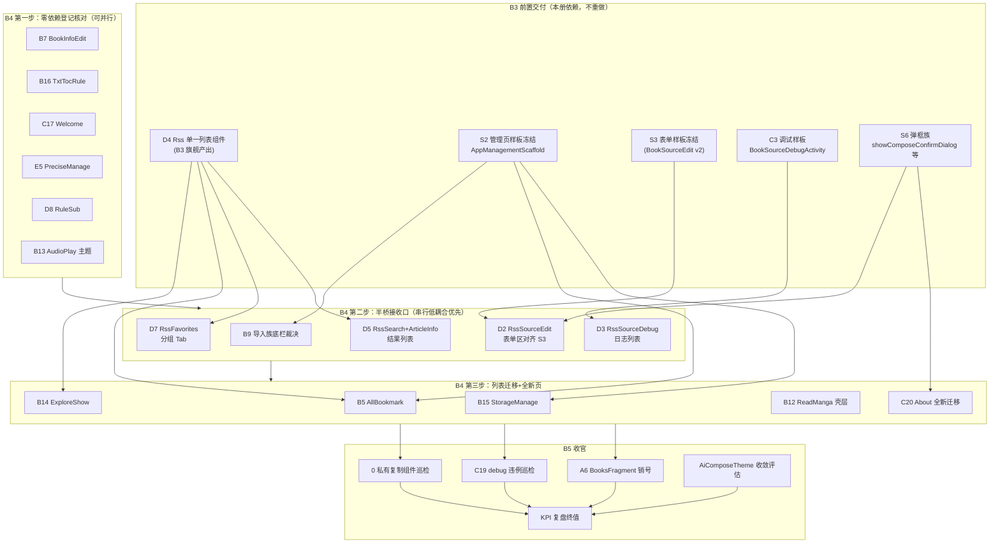

# design-b4-b5-pages.md — B4 长尾批次 + B5 收官批次页级设计册

> 上游：`design.md`（AD-01~AD-08 定稿）｜下游：`tasks.md` B4/B5 任务落盘 + 逐页实施回执。
> 设计基准日：2026-08-30，以**源码实况为第一权威**（AD-01），design.md 页级总表与本册冲突处以本册勘误为准。

## 0. 源码实况勘误表（对 design.md 页级总表）

实施前必须知晓的 5 处口径修正（均已逐文件核验）：

| 编号 | design.md 口径 | 源码实况（2026-08-30） | 对 B4/B5 的影响 |
|---|---|---|---|
| B7 | BookInfoEditScreen 已存在，壳**待接线** | 壳接线**已完成**（`composeHost.setContent{LegadoTheme{BookInfoEditScreen(...)}}`，saveData/换封面逻辑在 Activity） | 降级为登记核对+验收 |
| B9 | 导入族 View 待迁移 | ImportBookActivity 已桥接（ImportBookScreen 内容区 + View `SelectActionBar` 底栏混合） | 降级为收尾裁决 |
| B16 | 列表 View，仅 Edit 弹框已 Compose | `composeItems`/`composeSelectionCount` 桥接态已存在 + `TxtTocRuleEditComposeDialog.Callback` 已实现 | 降级为核对销号 |
| C17 | WelcomeActivity View 待迁移 | 已桥接（`WelcomeScreen` + composeHost，显隐状态 4 项 mutableStateOf） | 降级为登记核对 |
| E5 | PreciseManageFragment View（唯一未迁配置页） | 已完成（`ComposeView + PreciseManageScreen + LegadoTheme`，诊断三件套平移自 AboutFragment） | 降级为登记核对 |

另两项实况补充：A6 BooksFragment 全仓（除 docs）Grep **0 引用**且源文件已不存在（删除已完成，B5 走销号）；C19 ui/debug 目录硬编码色仅剩 1 处且已带豁免登记注释（RegexTestScreen.kt:210，audit-v10-consistency.md §3.3）。

**结论**：B4 真实工作量集中于 5 个"半桥接收口页"（D2/D3/D5/D7/B9 底栏裁决）+ 1 个全新迁移页（C20 About）+ 3 个列表迁移动作待核验页（B5/B14/B15）。其余 8 项为核对登记+验收回执，不产生结构性代码。

## 1. B4 + B5 依赖图与执行顺序



**执行顺序**（批内约束，沿用 AD-07 串行铁律+批内低耦合先行）：
1. **B4-a 登记核对 6 项**（互零依赖，一个工作日全部销号）：B7 → B16 → C17 → E5 → D8 → B13。产出=registry 回执+L2 截图基线。
2. **B4-b 收口 5 项**：B9 裁决 → D3 → D5 → D7 → D2（D2 最重，表单区 RecyclerView 迁 S3，压轴；D3/D5/D7 共享 D4 组件，须在 D4 回执验证后启动）。
3. **B4-c 列表+全新 5 项**：B15 → B14 → B5 → B12 → C20（C20 涉及 Fragment 装载与 Spannable 富文本，独立收尾）。
4. **B5 收官**：A6 销号 → C19 巡检 → 私有组件巡检 → AiComposeTheme 评估 → KPI 终值。每步 checklist 见 §B5。

**批间门禁**：每步完成后 `build-legado.bat` 编译门禁 → 5.5 E2E（L2 脚本场景见各页 §5）→ registry 回执。禁止跨步囤积提交。

---

# B4 批次页级设计（13 节）

> 每节结构：①现状锚点（源码行级证据）②复用映射表 ③kotlin 骨架（关键接线）④边界枚举（≥3）⑤验收检查点（含 L2 场景名）。

## B4-1 B7 BookInfoEditActivity（登记核对级）

**①现状锚点**：`ui/book/info/edit/BookInfoEditActivity.kt`（155 行）。`composeBook by mutableStateOf<Book?>` 桥接态；`bookData.observe → upView` 单向数据流；`coverChangeTo(uri)` 本地选图落盘 covers/ 目录；`ChangeCoverDialog.CallBack` 回调 `composeBook = viewModel.book?.copy()`（copy() 强刷新重组，符合强跳过铁律）。XML 壳仅剩 composeHost。

**②复用映射表**

| 复用组件 | 来源 | 差异点（本页特有） |
|---|---|---|
| LegadoTheme 包根 | 主题基建 | 无差异，已接 |
| ChangeCoverDialog | 换源封面 | 已是 DialogFragment，保留不动 |
| HandleFileContract.IMAGE | 文件选择 | Activity 持有 launcher，Screen 只发 onSelectCover 事件 |
| BookInfoEditScreen | 本页专属 | 39→屏级 composable 已定稿，禁再拆槽位 |

**③kotlin 骨架（现状即目标，仅登记）**

```kotlin
// 接线已定稿（本节为回执登记基准，禁改结构）
binding.composeHost.setContent {
    LegadoTheme {
        BookInfoEditScreen(
            book = composeBook,
            onBack = { finish() },
            onSave = { name, author, typeIndex, coverUrl, intro -> saveData(name, author, typeIndex, coverUrl, intro) },
            onSelectCover = { selectCover.launch { mode = HandleFileContract.IMAGE } },
            onRefreshCover = { coverUrl -> viewModel.book?.customCoverUrl = coverUrl; composeBook = viewModel.book?.copy() }
        )
    }
}
```

**④边界枚举**
1. 书籍类型切换（text/audio/image/video 四态）保存后 `BookHelp.updateCacheFolder(oldBook, book)` 缓存目录迁移必须成功后才 setResult，禁止先 finish。
2. 换封面_uri 为 http(s) 时走 `coverChangeTo(String)` 直存，本地 uri 走 MD5 重命名落盘——两条路径均须真机验证（含 .9.png 后缀特判）。
3. `onRefreshCover` 中 `viewModel.book` 为 null 时（VM 未回填）必须静默忽略而非 NPE——依赖 `?.` 链，禁改非空断言。
4. 保存成功回 `RESULT_OK`，BookInfoActivity 双栈分支依赖此结果刷新——回执必含来源页刷新断言。

**⑤验收检查点**：L2 场景 `l2_verify_compose_book_info_edit`（打开编辑→改类型→保存返回刷新；换源封面→封面变更；选本地图→封面落盘）。registry 回执登记 L-B7。

## B4-2 B9 导入族（半桥接收口级）

**①现状锚点**：`ui/book/import/local/ImportBookActivity.kt`（130+ 行已核验）。ImportBookScreen 已接管内容区（items/path/canGoBack/isLoading/searchQuery 五桥接态 + menuActions）；**残留**：View `SelectActionBar`（implements CallBack + `binding.selectActionBar`，多选底栏含删除菜单项）。Remote 侧按 design.md 复用 S6 导入弹框族（ImportRemoteBookDialog 已 Compose 化，随 S6 冻结核验）。

**②复用映射表**

| 复用组件 | 来源 | 差异点 |
|---|---|---|
| ImportBookScreen | 本页专属 Screen | 已定稿；多选选中态 currentItems/selectedIndexes 在 Activity 侧 |
| SelectActionBar（决策对象） | View 底栏 | 见下方裁决 |
| MenuAction 族 | widget/components | 顶栏 4 按钮（FolderOpen/Sort/Refresh/Edit）已 Compose 化 |
| S6 导入弹框族 | P8 浮层 | Remote 导入路径直接复用，零改动 |

**③kotlin 骨架（裁决方案 A：保留 View 底栏登记豁免——推荐）**

```kotlin
// 裁决：SelectActionBar 为跨页共用 View 组件（BookshelfManage/BookshelfManageActivity 同款），
// B4 不单页强迁；登记"混合豁免"至 migration-registry，条件=底栏触控≥48dp+accentColor 取色
// （禁止硬编码）。若 B3-B8 产出 Compose 选择底栏组件，则此处升级为方案 B：
//   ImportBookScreen 外层包 AppManagementScaffold(bottomActions = buildBottomActions())
//   并删除 SelectActionBar.CallBack 实现，多选态迁入 Screen（selectedIndexes 提升为参数）。
private fun initSelectActionBar() {
    binding.selectActionBar.setMainActionText(R.string.add_to_bookshelf)
    binding.selectActionBar.inflateMenu(R.menu.import_book_sel)
    binding.selectActionBar.setOnMenuItemClickListener { item ->
        when (item?.itemId) { R.id.menu_del_selection -> deleteSelection() }
        false
    }
    binding.selectActionBar.setCallBack(this)
}
```

**④边界枚举**
1. 目录导航回退：物理返回键 `goBackDir()` 优先于 finish，Compose 顶栏 onBack 与 onBackPressedDispatcher 语义必须一致（顶栏返回=finish 或逐级回退需与物理键对齐，实施时二选一登记）。
2. 多选删除走 `deleteSelection()`（Activity 侧），Compose Screen 长按 `onItemLongClick = { }` 当前为空——若启用长按多选须先补选中态桥接，禁止只改 UI 不通数据。
3. 扫描 job（scanDocJob + conflate + IO/Main 切换）在 Activity 生命周期内，Screen 重组不得重复触发 initData。
4. `AppConfig.importBookPath` 持久化选目录结果，覆盖安装/二次进入须恢复上次目录。

**⑤验收检查点**：L2 场景 `l2_verify_compose_import_book`（进入默认目录→逐级进入→返回→选文件夹持久化；多选 2 项→加入书架→书架出现；搜索过滤→清空恢复）。registry 登记 L-B9+混合豁免条目。

## B4-3 B16 TxtTocRuleActivity（核对销号级）

**①现状锚点**：`ui/book/toc/rule/TxtTocRuleActivity.kt`（90+ 行已核验）。`composeItems/composeSelectionCount` 桥接态 + `currentRules/selectedIds` 数据侧；Edit 弹框 `TxtTocRuleEditComposeDialog` 已 Compose（7.11af）；导入/导出走 `ImportTxtTocRuleDialog` + `showComposeTextInputDialog`（导出成功回执只读框+复制）；菜单已 Compose 化（Add/Help/QrCode/FileUpload 等 12 图标 imported）。

**②复用映射表**

| 复用组件 | 来源 | 差异点 |
|---|---|---|
| showComposeConfirmDialog / showComposeTextInputDialog | S6 弹框族 | 删除确认/导出回执已接 |
| TxtTocRuleEditComposeDialog | 7.11af 交付 | 编辑弹框零改动 |
| ImportTxtTocRuleDialog | association 族 | 导入路径保留（内部实现不在本批范围） |
| QrCodeResult | C14 保留件 | 扫码导入走 ActivityResult，禁改 |

**③kotlin 骨架（核对基准）**

```kotlin
class TxtTocRuleActivity : VMBaseActivity<ActivityTxtTocRuleBinding, TxtTocRuleViewModel>(),
    TxtTocRuleEditComposeDialog.Callback {
    private var composeItems by mutableStateOf(listOf<TxtTocRuleDisplayItem>())
    private var composeSelectionCount by mutableStateOf(0)
    private val selectedIds = linkedSetOf<Long>()   // 选中源数据在 Activity 侧
    // 销号核验点：binding 是否仍残留 RecyclerView 引用（initRecyclerView/adapter）；
    // 若列表区已全走 composeHost → 仅补回执；若仍有 rv 残留 → 按 B15 模板补迁（工作量小）。
}
```

**④边界枚举**
1. 规则启用态切换须即时落库（appDb.txtTocRuleDao），列表项 Switch 不得只在 UI 态。
2. 导出前 `selectedIds` 为空时行为：导出全部 or 提示——以现行 View 行为为准回归，禁止静默改语义。
3. 扫码/文件/URL 三入口导入均落到 ImportTxtTocRuleDialog，格式校验失败必须 toast 而非静默。
4. 排序（VerticalAlignTop/Bottom 菜单）作用于 customOrder 字段，迁移后顺序须与原 View 一致。

**⑤验收检查点**：L2 场景 `l2_verify_compose_txt_toc_rule`（新建规则→编辑弹框保存→列表刷新；启用/停用切换→重进保持；导出→只读回执→复制剪贴板）。registry 登记 L-B16。

## B4-4 B5/B14/B15 列表三连（迁移级，共用模板）

**①现状锚点**：三页均按 design.md 口径为 View 列表（本册未整读，实施第一步先做"实况复核"：Grep 各自 Activity 的 `composeHost|RecyclerView|Adapter` 判级——若已半桥接则降级走核对销号，若纯 View 则按本模板迁移）。三页定位：AllBookmarkActivity（全书签聚合，VM 驱动列表）、ExploreShowActivity（发现页指定分区的文章列表，复用 D4 产出的列表组件最贴切）、StorageManageActivity（书籍存储占用列表+清理动作，复用 S2 管理页最贴切）。

**②复用映射表（三页合一）**

| 页面 | 主骨架 | 复用组件 | 差异点 |
|---|---|---|---|
| B5 AllBookmark | S2 列表 | AppManagementScaffold(title/selectedCount/totalCount/topActions/bottomActions) + D4 列表条目 | 书签跨书聚合：条目含书名+章节双行；删除直连 appDb.bookHelpDao |
| B14 ExploreShow | D4 复用 | D4 RssArticle 列表组件（B3 产出） | 数据源为 ExploreShow 静态分区而非实时 RSS；无换源菜单 |
| B15 StorageManage | S2 管理页 | AppManagementScaffold + SettingsClickRow 式行 | 行尾为占用体积文本+清理动作；清理须二次确认（showComposeConfirmDialog） |

**③kotlin 骨架（B15 为例，B5/B14 同构）**

```kotlin
class StorageManageActivity : VMBaseActivity<ActivityStorageManageBinding, StorageManageViewModel>() {
    private var composeItems by mutableStateOf(listOf<StorageDisplayItem>())

    private fun initComposeHost() {
        binding.composeHost.setContent {
            LegadoTheme {
                AppManagementScaffold(
                    title = getString(R.string.storage_manage),
                    selectedCount = 0, totalCount = composeItems.size,
                    onBack = { finish() },
                    topActions = listOf(AppManagementAction(
                        text = getString(R.string.clear_all), danger = true,
                        onClick = { showClearAllConfirm() }
                    ))
                ) {
                    StorageListScreen(            // 新增本页 Screen（新增文件）
                        items = composeItems,
                        // W1 修订：清理确认弹窗改 onClick 直调（禁止组合体弹窗副作用），pendingClear 态随之移除
                        onClear = { item ->
                            showComposeConfirmDialog(
                                title = getString(R.string.clear_cache),
                                message = item.sizeText,
                                onPositive = { viewModel.clear(item.bookUrl) }
                            )
                        },
                    )
                }
            }
        }
        viewModel.dataObs.observe(this) { composeItems = it }
    }
}
```

**④边界枚举（三页合并列出，逐页实施时各过一遍）**
1. B5 书签删除为跨书操作，删除后来源书章节列表同步失效——回执须含"删除后原书 Toc 页无残留"断言。
2. B14 分区数据来自订阅源 ruleExplore 解析结果，列表迁移禁触碰解析链；空分区/源失效两种空态必须区分文案。
3. B15 清理动作不可逆：单条清理与全部清理确认框文案不同；清理中 rotateLoading 态防重复点击。
4. 三页列表均须验证 1000+ 条滚动无卡顿（B3 D4 性能口径复用）。
5. AppManagementScaffold 内部自带 LegadoComposeTheme 包裹（源码 §84 行），页面根再包 LegadoTheme 会出现双主题包裹——以 B3 B8/B15 实施时 ThemeSync 行为为准，实施回执登记最终包裹层级，禁止两页口径不一。

**⑤验收检查点**：L2 场景 `l2_verify_compose_all_bookmark`（聚合列表→跳原文→返回→删除→空态）、`l2_verify_compose_explore_show`（分区进入→滚动→点击文章→换组回退）、`l2_verify_compose_storage_manage`（列表体积→单清→全清→取消路径）。registry 登记 L-B5/L-B14/L-B15。

## B4-5 D2 RssSourceEditActivity（迁移级-表单区，B4 最重）

**①现状锚点**：`ui/rss/source/edit/RssSourceEditActivity.kt`（100+ 行已核验）。**已 Compose**：GlassTopAppBar 顶栏 + AppDropdownMenu 菜单（Login/QrCode/Save/Share/ToggleOn 等 14 action）+ showComposeConfirmDialog。**残留 View**：表单主体 = RecyclerView（`RssSourceEditAdapter`）+ TabLayout 分组（信息/正文/规则三 Tab）+ KeyboardToolPop 软键盘工具 + `EditEntity` 数据结构。

**②复用映射表**

| 复用组件 | 来源 | 差异点 |
|---|---|---|
| S3 表单样板 | BookSourceEditActivity v2（B2 冻结） | S3 是"Compose 外壳+CodeView 内核"；D2 无 CodeView 需求，全 Compose 化更深 |
| RssSourceEditViewModel | 本页 VM | 保留；表单字段编辑仍走 EditEntity 列表 |
| VariableDialog / UrlOptionDialog | widget/dialog | 暂保留 View 弹框（登记），禁本批顺手迁移 |
| KeyboardToolPop | 软键盘工具 | 决策点：随 View 列表一并退役，换 Compose imePadding 方案 |

**③kotlin 骨架（目标态）**

```kotlin
// 新增 RssSourceEditScreen.kt（S3 同构）：Tab 三段 + 每段字段组
@Composable
fun RssSourceEditScreen(
    tabs: List<String>,
    currentTab: Int, onTabChange: (Int) -> Unit,
    fields: List<EditEntity>,                       // 现有数据结构复用，不另造 model
    onFieldChange: (EditEntity, String) -> Unit,
    menuActions: List<MenuAction>,
    onMenuAction: (MenuAction) -> Unit,
    onBack: () -> Unit,
    modifier: Modifier = Modifier,                  // W-2 终审观察项落死：根 modifier 透传（对齐同册其他 Screen 惯例）
) {
    // W2 修订：LegadoTheme 由宿主 setContent 统一包裹，Screen 内不再重复包裹（防双主题嵌套）
    Column(Modifier.fillMaxSize().imePadding()) {   // 替代 KeyboardToolPop
        GlassTopAppBar(title = stringResource(R.string.rss_source_edit),
            navIcon = Icons.AutoMirrored.Filled.ArrowBack, onNavClick = onBack,
            actions = { EditMenuButton(menuActions, onMenuAction) })
        AppTabRow(tabs, currentTab, onTabChange)
        LazyColumn(state = rememberLazyListState()) {
            itemsIndexed(fields, key = { i, e -> "${i}_${e.key}" }) { _, entity ->
                SettingTextFieldRow(entity, onFieldChange)   // S3 行组件复用
            }
        }
    }
}
```

**④边界枚举**
1. 三 Tab 字段集不同（信息 8 项/正文 6 项/规则 4 项级），切 Tab 滚动位置保留原 View 行为；字段 key 含索引须稳定，防 LazyColumn 复用错位。
2. 保存前校验链（sourceName/sourceUrl/sourceGroup 必填——校验逻辑在 VM，不在 UI 层）不迁移不改语义；未保存返回拦截（onBackPressed + 确认框）必须保留。
3. KeyboardToolPop 退役后：收起键盘/切换焦点两能力由 imePadding+FocusManager 替代，须真机验证横竖屏+折叠屏键盘高度。
4. 登录（SourceLoginActivity）、二维码（QrCodeResult）、调试（RssSourceDebugActivity）三个外跳入口保持原 Intent 参数不变。
5. `sourceEntities: ArrayList<EditEntity>` 与 Compose fields 桥接用整体替换（copy 列表），禁止同引用原地 add 触发不了重组。

**⑤验收检查点**：L2 场景 `l2_verify_compose_rss_source_edit`（新建→三 Tab 逐字段编辑→保存→重开一致；返回拦截→确认放弃；登录入口/扫码入口跳转正常；软键盘弹出表单可滚动到底）。registry 登记 L-D2。

## B4-6 D3 RssSourceDebugActivity（迁移级-日志列表）

**①现状锚点**：`ui/rss/source/debug/RssSourceDebugActivity.kt`（90 行已核验）。**已 Compose**：GlassTopAppBar + AppDropdownMenu + SettingsSearchBar + showComposeChoiceListDialog（sortUrls 分区选择）。**残留 View**：日志输出 RecyclerView（`RssSourceDebugAdapter(this)`）+ `viewModel.observe { state, msg -> adapter.addItem(msg) }` 流式追加 + rotateLoading。

**②复用映射表**

| 复用组件 | 来源 | 差异点 |
|---|---|---|
| C3 调试样板 | BookSourceDebugActivity（B3 冻结） | 同构：流式日志+停止/帮助菜单；D3 差异=无"下一步"调度、无登录回调 |
| RssSourceDebugModel | 本页 VM | observe(state,msg) 回调签名保留，桥接改 State<List<DebugMsg>> |
| SettingsSearchBar | widget/components | 已接，日志过滤沿用 |

**③kotlin 骨架（目标态）**

```kotlin
private var debugLines by mutableStateOf(listOf<DebugLine>())   // DebugLine(state,msg) 显式类型
private var loading by mutableStateOf(false)

// viewModel.observe 桥接改写（原 adapter.addItem → state 追加）
viewModel.observe { state, msg ->
    debugLines = debugLines + DebugLine(state, msg)             // 整体替换促重组
    if (state == -1 || state == 1000) loading = false
}
binding.composeHost.setContent {
    LegadoTheme {
        DebugLogScreen(                                          // C3 样板同构组件（B3 产出）
            lines = debugLines, isLoading = loading,
            onLineLongClick = { line -> sendToClip(line.msg) },  // 原长按复制行为保留
        )
    }
}
// 删除：initRecyclerView/adapter/ActivityRssSourceDebugAdapter 引用与 rotateLoading 绑定
```

**④边界枚举**
1. 流式追加性能：调试可产出数百行，用整体替换+key(索引) 惰性列表；若 B3 C3 实测有 jank，沿用其优化结论（禁自行引入 stability wrapper）。
2. state==1000（完成）与 -1（异常）双终止信号均须关 loading；中途返回再进入不续传（原行为如此，登记）。
3. sortUrls 分区选择在源未定义 sortUrl 时隐藏入口——空列表边界禁崩溃。
4. 长按复制/查看帮助（openOrCloseHelp）两行为在 Compose 侧逐一保留。

**⑤验收检查点**：L2 场景 `l2_verify_compose_rss_source_debug`（选分区→调试跑通→日志流式出现→完成态 loading 消失；异常源→错误行红显；长按→剪贴板）。registry 登记 L-D3。

## B4-7 D5 RssSearchActivity + RssArticleInfoActivity（迁移级-结果列表）

**①现状锚点**：`ui/rss/search/RssSearchActivity.kt`（90 行已核验）。**已 Compose**：GlassTopAppBar+SettingsSearchBar 搜索区+菜单。**残留 View**：结果 RecyclerView（RssSearchAdapter）+ 历史 FlexboxLayoutManager（RssSearchHistoryAdapter）+ 换源弹框 ChangeRssArticleSourceDialog（DialogAdapter 另计）。RssArticleInfoActivity：文章详情（RssArticleInfoSourceAdapter 换源列表）——本页按"信息展示+换源列表"小页处理，复用同批组件。

**②复用映射表**

| 复用组件 | 来源 | 差异点 |
|---|---|---|
| D4 RssArticle 列表组件 | B3 产出 | 直接承载 SearchRssArticle 条目；点击行为走 ReadRss 链而非 RssArticlesFragment 内部路由 |
| SettingsSearchBar | 已接 | 搜索词桥接已有（composeSearchQuery） |
| ChangeRssArticleSourceDialog | 本族弹框 | 保留 DialogFragment 形态，仅核对主题（豁免登记，禁本批重写） |
| 搜索历史 Flexbox 流式标签 | View 残留 | 迁 FlowRow（Compose foundation）+ 历史标签组件复用 SearchActivity Compose 版（7.11ah） |

**③kotlin 骨架（目标态）**

```kotlin
private var composeResults by mutableStateOf(listOf<SearchRssArticle>())
private var composeHistory by mutableStateOf(listOf<SearchKeyword>())

binding.composeHost.setContent {
    LegadoTheme {
        Column {
            GlassTopAppBar(/* 现状保留 */)
            HistoryFlowRow(                        // 新增：历史标签流式布局
                keywords = composeHistory,
                onKeywordClick = { onSearch(it) },
                onClearAll = { showComposeConfirmDialog(clearHistory) },
            )
            RssArticleListScreen(              // D4 组件（B3 产出）签名级复用，参数须对齐旗舰册 §2 契约
                state = rememberRssArticleListState(),
                style = RssArticleListStyle.LIST,
                isRefreshing = false,
                hasMore = false,
                onLoadMore = {},
                onRefresh = {},
                onArticleClick = { item -> onItemClickListener(item) },
                onItemLongClick = { item -> showChangeSourceMenu(item) },   // 旗舰册 §2 已增补可选参数
                bottomInset = ListBottomInset.NAVIGATION_BARS,
            )
        }
    }
}
```

**④边界枚举**
1. 历史 type=1 与书源 type=0 隔离（rss-unified-search 设计），迁移禁串库。
2. 结果点击先转 RssArticle 再 `ReadRss.readRss`（非直接进阅读器），链路不改。
3. 搜索 Job 并发控制（原 Job 取消重启语义）迁 Compose 后仍由 VM 持有，UI 只发事件。
4. RssArticleInfo 换源列表迁移后 `RssArticleInfoSourceAdapter` 删除；WebView 正文区为 D6 红线不动。

**⑤验收检查点**：L2 场景 `l2_verify_compose_rss_search`（输入→历史生成→点历史复搜→结果点击进 ReadRss→清空历史确认框）、`l2_verify_compose_rss_article_info`（打开→换源列表→切换→返回）。registry 登记 L-D5。

## B4-8 D7 RssFavoritesActivity + RssFavoritesFragment（迁移级-分组 Tab）

**①现状锚点**：`ui/rss/favorites/RssFavoritesActivity.kt`（90 行已核验）。**已 Compose**：GlassTopAppBar + 分组/删除双 AppDropdownMenu + ConfirmDialog（pendingDelete 态）。**残留 View**：ViewPager + TabLayout + `FragmentStatePagerAdapter`（每分组一个 RssFavoritesFragment，内部 RssFavoritesAdapter RecyclerView）。

**②复用映射表**

| 复用组件 | 来源 | 差异点 |
|---|---|---|
| D4 RssArticle 列表组件 | B3 产出 | RssStar 条目（收藏）复用列表条目样式；删除=单条+整组+全部三档 |
| ConfirmDialog（Compose 版） | 已接 | pendingDelete 桥接已有，保留 |
| 分组选择 AppDropdownMenu | 已接 | composeGroups/currentGroup 桥接已有 |
| ViewPager+TabLayout | 残留 | 决策：分组数少（用户级），改 Compose HorizontalPager+TabRow 收敛 |

**③kotlin 骨架（目标态）**

```kotlin
// Activity：TopBar 已 Compose；内容区迁 Compose 收敛双栈
binding.composeHost.setContent {
    LegadoTheme {
        Column {
            FavoritesTabRow(groups = composeGroups, current = currentGroup,
                onGroupChange = { g -> currentGroup = g; viewModel.loadGroup(g) })
            FavoritesPager(groups = composeGroups, current = currentGroup,
                itemContent = { star -> RssArticleListScreen(
                    state = rememberRssArticleListState(),
                    style = RssArticleListStyle.LIST,
                    isRefreshing = false, hasMore = false, onLoadMore = {}, onRefresh = {},
                    // W3 修订：收藏点击经 ReadRss.readRss 上行链打开（对齐 D5 边界 2 契约），禁直接 startActivity 进阅读器
                    onArticleClick = { item -> openFavoriteViaReadRss(item) },
                    onItemLongClick = { pendingDelete = PendingDelete(star, mode = SINGLE) },  // 旗舰册 §2 可选参数
                    bottomInset = ListBottomInset.NAVIGATION_BARS,
                    emptyContent = { /* 收藏空态差异化文案 slot */ },
                ) })
        }
    }
}
// 删除：TabFragmentPageAdapter/RssFavoritesFragment/RssFavoritesAdapter 三件（ViewPager 链全退）
// 回归点：ReadRss 取消收藏返回后 onResume 重定位 Tab（现 delay(100)+select 逻辑）改为 currentGroup 驱动
```

**④边界枚举**
1. onResume 重定位逻辑（从 ReadRss 退出可能已取消收藏致分组消失，item==-1 时保持当前项）语义必须在 currentGroup 单一状态源下复刻，禁丢"分组被删后回落"分支。
2. 删除三档（单条/整组/全部）确认文案区分；整组删除前组内条目数随 confirm 展示。
3. FragmentStatePagerAdapter 退役后分页懒加载语义（用户翻到才查库）由 Pager(keepAlivePreset) 对齐，禁止一次性全组载入卡顿。
4. RssFavoritesDialog（分组管理弹框）保留 View 版登记，禁本批顺手迁移。

**⑤验收检查点**：L2 场景 `l2_verify_compose_rss_favorites`（分组切换→收藏条目点击进 ReadRss→取消收藏返回→当前组刷新；单条删除→整组删除→全部删除三档确认；分组消失回落）。registry 登记 L-D7。

## B4-9 D8 RuleSubActivity（收尾核对级）

**①现状锚点**：design.md 登记"Compose 桥接已有（RuleSubScreen）"。本册未整读（预算约束），核对动作=实施时 Grep `RuleSubScreen|composeHost` 确认接线完整后直接登记。

**②复用映射表**：RuleSubScreen（本页专属）+ LegadoTheme + S6 弹框族；无差异点预期。

**③kotlin 骨架**：无需新代码。回执模板：

```markdown
## 回执 L-D8（RuleSubActivity）
- 接线核验：composeHost ✅ / LegadoTheme ✅ / 菜单 Compose ✅（Grep 证据行号）
- 残留 View 组件：无（或列出豁免条目）
- L2 场景：l2_verify_compose_rule_sub（导入订阅→规则列表→启用切换→删除确认）
```

**④边界枚举**
1. 订阅源规则导入（URL/本地/剪贴板）三入口失败 toast 必须保留。
2. 规则启用态与 RssSource 关联表一致性（删除规则不孤儿化订阅分组）。
3. 若核验发现 View 残留（如列表仍 rv），降级改走 B15 模板迁移，回执如实记录改判原因。

**⑤验收检查点**：同上回执模板 L2 场景。registry 登记 L-D8（🔁）。

## B4-10 C17 WelcomeActivity（登记核对级）

**①现状锚点**：`ui/welcome/WelcomeActivity.kt`（110 行已核验）。WelcomeScreen 已桥接（showTitle/showSubtitle/showIcon/showSlogan 四态，日夜双套来自 AppConfig.welcomeShowText(Dark) 等）；欢迎图背景仍 View 层 `upBackgroundImage` decode 后 `toDrawable` 设给 binding（背景为整窗图，保留 View 层合理）；`FLAG_ACTIVITY_BROUGHT_TO_FRONT` 防重复与 welcomeShowTime 跳转计时保留 Activity。

**②复用映射表**

| 复用组件 | 来源 | 差异点 |
|---|---|---|
| WelcomeScreen | 本页专属 | 四显隐参数已定 |
| LegadoTheme | 已接 | 全屏沉浸（fullScreen+statusBarColorAuto）仍 View 层，登记豁免 |
| 自定义欢迎图 | BitmapUtils | 保留 View 背景方案（Compose 侧重画整窗图收益为零） |

**③kotlin 骨架（现状基准，禁改）**

```kotlin
private fun initComposeHost() {
    binding.composeHost.setContent {
        LegadoTheme { WelcomeScreen(showTitle, showSubtitle, showIcon, showSlogan) }
    }
}
// 背景图路径（保留）：upBackgroundImage() → decodeWelcomeImage(path) → binding.root.background
```

**④边界枚举**
1. welcomeShowTime==0 时跳过 Compose 展示直接 startMainActivity——ComposeView 可能未首帧即销毁，不得引入崩溃（覆盖安装+冷启动双验证）。
2. 日/夜主题欢迎图与文案显隐四开关独立（Dark 后缀键），回执含日夜双套切换截图。
3. 从桌面图标再次进入（BROUGHT_TO_FRONT 分支）finish 不闪屏。

**⑤验收检查点**：L2 场景 `l2_verify_compose_welcome`（冷启动→默认欢迎页→自定义图日夜双套→showTime=0 直跳）。registry 登记 L-C17。

## B4-11 C20 AboutActivity + AboutFragment（迁移级-全新，B4 唯一纯 View 全迁）

**①现状锚点**：`ui/about/AboutActivity.kt`（65 行已核验，纯 View：MainTopBarView.SUB 模式 + UiCorner.opaqueRounded 卡片背景 + tvAppSummary SpannableString 给公众号名上色 + 评分/分享顶栏按钮 + fl_fragment 装载 AboutFragment）。AboutFragment（本册未整读）为设置列表式 About 内容。ReadRecordActivity 已全 Compose 仅登记（F3 随本回执一并销号）。

**②复用映射表**

| 复用组件 | 来源 | 差异点 |
|---|---|---|
| GlassTopAppBar | widget/components | SUB 模式标题栏平替；评分/分享两 action 走 MenuAction |
| AppManagementScaffold 或 SettingsCard 列 | S2 样板 | AboutFragment 条目列表平替（checkUpdate/项目地址/感谢等行） |
| AppUpdateDialog（UpdateDialog） | 本族 | 检查更新弹框保留，仅核对主题 |
| Spannable 富文本（公众号名上色） | View 特有 | 迁 AnnotatedString + accentColor（LegadoTheme 色板，禁 Color(0x)） |

**③kotlin 骨架（目标态）**

```kotlin
class AboutActivity : BaseActivity<ActivityAboutBinding>() {
    private fun initComposeHost() {
        binding.composeHost.setContent {          // XML 仅留 composeHost 壳
            LegadoTheme {
                AboutScreen(
                    onBack = { finish() },
                    onScore = { openUrl("market://details?id=$packageName") },
                    onShare = { share(getString(R.string.app_share_description_sigma), getString(R.string.app_name)) },
                    summaryAnnotated = buildAnnotatedSummary(),   // AnnotatedString 替代 Spannable
                )
            }
        }
        if (supportFragmentManager.findFragmentByTag("aboutFragment") == null)
            supportFragmentManager.beginTransaction()   // AboutFragment 内部条目随 Screen 化后整段退役
    }
}
```

**④边界枚举**
1. 检查更新流程（UpdateDialog→下载→安装）不改；AboutScreen 只发事件。
2. app_summary 文案来自 strings.xml 双语，公众号名定位用 `indexOf(gzh)` 等价 AnnotatedString span 逻辑，双语各验一版。
3. 开源许可/项目地址行外跳浏览器 openUrl 白名单行为不变。
4. AboutFragment 退役后 `fl_fragment` 容器与 fTag 引用清理，防死代码残留（Grep "aboutFragment" 归零）。

**⑤验收检查点**：L2 场景 `l2_verify_compose_about`（进入→卡片背景主题色→公众号名高亮→评分跳转→分享面板→检查更新弹框）。registry 登记 L-C20+L-F3（ReadRecord 登记）。

## B4-12 E5 PreciseManageFragment（登记核对级）

**①现状锚点**：`ui/config/PreciseManageFragment.kt`（164 行已核验）。已完成 ComposeView + LegadoTheme + PreciseManageScreen（六入口回调）；诊断三件套（saveLog/createHeapDump/copyLogs）自 AboutFragment 平移且 `Coroutine.async{}.onError{ AppLog.put }` 链规范。

**②复用映射表**：PreciseManageScreen（本页专属）+ Coroutine.async 链 + FileDoc 工具；无差异点。

**③kotlin 骨架（现状基准）**：见源码 §45-66（ComposeView onCreateView 回调装配六入口），登记禁改。

**④边界枚举**
1. saveLog 未设备份目录/未开日志记录两前置 toast+delay(3000) 行为保留（让用户读得见提示）。
2. dumpLogcat 直接 `Runtime.exec("logcat -d")`（既有实现，登记安全豁免说明），禁本批重构。
3. 堆转储前 `System.gc()` 顺序不可提前（先 gc 后 dump）。

**⑤验收检查点**：L2 场景 `l2_verify_compose_precise_manage`（六入口跳转逐点→保存日志到备份目录→无备份目录 toast）。registry 登记 L-E5（🔁）。

## B4-13 B12 ReadMangaActivity 壳层 + B13 AudioPlayActivity 主题对齐（断言级）

**①现状锚点**：ReadMangaActivity（`ui/book/manga/`，VMBaseActivity+ActivityMangaBinding）Activity 本体无 composeHost；`manga/config/` 三弹框（MangaColorFilterDialog/MangaEpaperDialog/MangaFooterSettingDialog）已 setContent Compose 化。AudioPlayActivity（`ui/book/audio/`）已 import 并使用 LegadoTheme（§44/§150 行），主题对齐已实际完成。两页均为 AD-05 红线页：内核（漫画渲染/音频播放+LyricViewX）永久原生，NG #14 维持不重写。

**②复用映射表**

| 页面 | 本批动作 | 复用/断言 |
|---|---|---|
| B12 | 壳层菜单/浮层对齐 S5 模式核对（非重写） | S5 冻结回执为基准；三弹框 Compose 化已达标；内核零改动断言 |
| B13 | 仅主题对齐核对 | LegadoTheme 已接=达标；NG #14 断言"面板形态不重写"写入回执 |

**③kotlin 骨架（断言脚本，非接线）**

```markdown
## 断言清单（B12/B13 合用）
1. Grep manga 内核目录：Render/Reader/PageDelegate 类文件 B4 前后 git diff 为空（内核零改动）。
2. Grep audio：MediaController/PlayService 引用 B4 前后不变（播放链零改动）。
3. B13 取色走 ThemeSpec 断言：Grep AudioPlayActivity 内 Color(0x 应为 0 命中（legadoTheme 化完成）。
4. B12 三弹框 setContent 位置均在 DialogFragment（Dialog 生命周期正确），无 Activity 级常驻 Compose。
```

**④边界枚举**
1. B12 漫画内核（预加载/解码/手势缩放）任何文件禁碰；壳层改动仅限菜单/弹框/主题。
2. B13 LyricViewX 第三方歌词控件保留；NG #14 面板重设计留待独立 spec，本批禁启动。
3. 两页后台/前台切换、耳机线控（B13）回归纳入 L2。
4. 若核对发现壳层仍有 View 菜单，B12 允许补 Compose 化；B13 则只登记不展开（NG 裁决优先）。

**⑤验收检查点**：L2 场景 `l2_verify_compose_read_manga`（进漫画→缩放手势→三弹框唤起→内核渲染无异常日志）、`l2_verify_compose_audio_play`（播放/暂停/歌词同步/后台切换）。registry 登记 L-B12/L-B13。

---

# B5 收官批次设计（4 项，可执行检查清单级）

## B5-1 A6 BooksFragment 删除流程销号

实况：源文件已不存在，全仓（除 docs）Grep `BooksFragment` 0 引用。销号清单：

```markdown
- [ ] Grep 全仓 "BooksFragment"（含 ai_tests/docs 除外）= 0 命中（本册 2026-08-30 已预检通过）
- [ ] git log --oneline -- '**/BooksFragment.kt' 确认删除提交号，回执记录
- [ ] ./gradlew assembleAppDebug 编译通过（无引用悬挂）
- [ ] 回归点：书架两样式（style1/2）切换、书籍分组菜单、长按多选——书架功能全由 BookshelfScreen 承载
- [ ] registry A6 条目状态 🗑→✅销号
```

## B5-2 C19 debug 3 违例巡检销号

实况：`ui/debug/` 目录 Grep `Color(0x` 仅 1 命中（RegexTestScreen.kt:210，`Color(0x40FFEB3B)` 高亮语义色，**已带豁免登记** audit-v10-consistency.md §3.3）。销号清单：

```markdown
- [ ] 逐一核对 7 组 Screen/Activity（DebugTools/CurlTest/EncodeTools/HttpDebug/PingTest/RegexTest/TimestampConvert）：
      Grep Color\(0x|private (val|fun).*(Component|Row|Card) 两次扫描
- [ ] 硬编码色：0 命中→销号；命中且已有豁免登记→登记复核；命中无登记→修复（LegadoTheme 扩展色）或补豁免
- [ ] 私有复制组件嫌疑：逐一与 S2/S6 组件目录比对，判定"合理私有"or"违例复制"，违例改引公共组件
- [ ] DebugBaseActivity 基类主题包根核验（LegadoTheme/LegadoComposeTheme 统一口径登记）
- [ ] 巡检报告落 migration-registry C19 条目，目标=0 未登记违例
```

## B5-3 全项目 0 私有复制组件巡检方法

```markdown
扫描方法（三步，脚本化到 ai_tests/scripts/compose_privacy_audit.py 可选）：
1. 结构指纹扫描：Grep 正则定位"重复结构"——@Composable fun .*Row\(|Card\(|Dialog\( 在 ui/ 下非
   widget/components 目录的命中清单，按文件聚合。
2. 语义比对：命中清单逐个与组件六族（frontend-ui-standards §组件目录）比对，三判定：
   ①页面专属单一使用→合理私有（白名单登记）；②与公共组件同构→违例，改引公共；③确缺公共组件→提组件化任务（B5 不扩容）。
3. 白名单落盘：合理私有清单写入 migration-registry §私有组件白名单，作为 KPI 口径基线。
判定红线：ThemeSync 取色/间距 token/双语 strings 三项任一缺失即违例，无论是否同构。
```

## B5-4 AiComposeTheme 收敛评估框架 + KPI 复盘统计口径

**AiComposeTheme 评估框架**（AD-04：本轮评估不拆已落地组件）：

```markdown
评估维度（每维 0-2 分，≥7 分启动收敛 spec，<7 维持现状登记）：
①使用面：Grep AiComposeTheme 引用文件数（>20 页=2 分强依赖）
②主题色差：AiComposeTheme 与 LegadoTheme scheme 色值 diff 数（0 diff=2 分）
③维护成本：双主题同步改动近 30 天发生次数（0 次=2 分）
④迁移障碍：是否有页面因依赖 AiComposeTheme 特有 token 而无法切 LegadoTheme（无=2 分）
⑤降级风险：移除 AiComposeTheme 的编译影响面（isolated=2 分）
结论模板：评分+建议（收敛 spec 启动条件/维持条件）+登记 registry。
```

**KPI 复盘统计口径**（KPI 终值公式）：

```markdown
迁移率终值 = (已全 Compose 页面数) / (总页面数 - 🧱红线保留页数) × 100%
  分子：migration-registry 状态=全 Compose（含壳-核分离且内容区全 Compose）
  分母剔除：C7 CodeEdit/C8 WebView/C14 QrCode/C18 association/D6 ReadRss/F4 WebViewLogin/
            A5 BaseBookshelfFragment/B1 正文内核/B12 漫画内核/B13 音频内核（红线 9 组）
  半桥接页（顶栏 Compose+内容 View）不计入分子（I4 定稿：半桥接不计入分子，无 0.5 权重），按"未完成"入分母（严格口径）
NG 代差复盘模板（每 NG 条目）：①NG 编号+原裁决 ②当前实况复核 ③代差是否缩小（证据）
  ④仍维持/重开的建议（B13 NG#14 维持；其余 NG 逐条过）。
产出：docs/specs/compose-migration-status-audit/kpi-final.md（含公式+分子分母逐页清单+NG 复盘表）。
```

---

## B5 执行顺序总表（验收前置链）

```markdown
1. A6 销号（30min）→ 2. C19 巡检（半天）→ 3. 私有组件巡检（1 天，产出白名单）
→ 4. AiComposeTheme 评估（半天）→ 5. KPI 终值报告（依赖 1-4 结论+registry 终态）
每步完成即更新 registry；KPI 报告为整个 spec 的关闭件。
```

---

## 6 维门禁规范核查表（B4/B5 全量页适用，逐批过）

| # | 门禁项 | 规范依据 | B4/B5 落点 |
|---|---|---|---|
| 1 | LegadoTheme 包根 / 无 Color(0x) | compose skill 硬约束+output 审计 | 每页 §4 边界+L2 截图比对；C19 专项巡检 |
| 2 | strings.xml 双语（en+zh） | user_rules 代码与文档同步 | D2 字段文案/C20 summary/清理确认框文案逐条入 strings |
| 3 | copy() 强跳过（Book/实体可变字段改后 copy() 触发重组） | frontend-ui-standards §4 红线5 | B7 onRefreshCover 已示范；D2/D7 桥接态整体替换 |
| 4 | Coroutine.async{}.onSuccess{}.onError{} 链 + AppLog.put | AGENTS.md Code Style | E5 已达标；C20 检查更新链/D7 删除链同构复用 |
| 5 | 禁私有复制组件/新组件登记 | AD-04 + 组件六族 | B5-3 专项巡检；新增 Screen 全部登记 |
| 6 | 任务完成门禁（updateLog/E2E/构建 daemon 清理/registry 回执） | AGENTS.md 强制规则 | 每步执行顺序表内嵌 build-legado.bat（自带 STOP_DAEMON） |

## 文件变更总表（B4/B5 全量，新增/修改/删除逐文件）

| 批 | 文件 | 变更类型 | 说明 |
|---|---|---|---|
| B4 | ui/book/info/edit/BookInfoEditActivity.kt | 无改动 | 登记+L2（B7） |
| B4 | ui/book/import/local/ImportBookActivity.kt | 修改（仅豁免登记注释/或方案B底栏） | B9 裁决产出 |
| B4 | ui/book/toc/rule/TxtTocRuleActivity.kt | 修改（核对+微调）或无改动 | B16 销号 |
| B4 | ui/book/toc/rule/TxtTocRuleListScreen.kt（若列表未 Compose） | 新增 | B16 兜底路径 |
| B4 | ui/book/mark/AllBookmarkActivity.kt + AllBookmarkScreen.kt | 修改+新增 | B5 列表迁 |
| B4 | ui/book/explore/ExploreShowActivity.kt + ExploreShowScreen.kt | 修改+新增 | B14 列表迁 |
| B4 | ui/book/storage/StorageManageActivity.kt + StorageListScreen.kt | 修改+新增 | B15 列表迁 |
| B4 | ui/rss/source/edit/RssSourceEditActivity.kt | 修改（删 rv/tab/KeyboardToolPop） | D2 |
| B4 | ui/rss/source/edit/RssSourceEditScreen.kt | 新增 | D2 表单 Screen |
| B4 | ui/rss/source/edit/RssSourceEditAdapter.kt | 删除 | D2 退役 |
| B4 | ui/rss/source/debug/RssSourceDebugActivity.kt | 修改（日志列表迁） | D3 |
| B4 | ui/rss/source/debug/RssSourceDebugAdapter.kt | 删除 | D3 退役 |
| B4 | ui/rss/search/RssSearchActivity.kt | 修改（结果/历史列表迁） | D5 |
| B4 | ui/rss/search/RssSearchAdapter.kt + RssSearchHistoryAdapter.kt | 删除 | D5 退役 |
| B4 | ui/rss/search/RssArticleInfoActivity.kt + ArticleInfoScreen.kt | 修改+新增 | D5 附页 |
| B4 | ui/rss/search/RssArticleInfoSourceAdapter.kt | 删除 | D5 退役 |
| B4 | ui/rss/favorites/RssFavoritesActivity.kt + RssFavoritesScreen.kt | 修改+新增 | D7（Pager 收敛） |
| B4 | ui/rss/favorites/RssFavoritesFragment.kt + RssFavoritesAdapter.kt | 删除 | D7 退役 |
| B4 | ui/rss/article/RuleSubActivity.kt | 无改动（核对） | D8 登记 |
| B4 | ui/welcome/WelcomeActivity.kt | 无改动 | C17 登记 |
| B4 | ui/about/AboutActivity.kt + AboutScreen.kt | 重写+新增 | C20（fl_fragment 退役） |
| B4 | ui/about/AboutFragment.kt | 删除 | C20 退役 |
| B4 | ui/book/manga/ReadMangaActivity.kt | 断言（禁改内核） | B12 |
| B4 | ui/book/audio/AudioPlayActivity.kt | 核对（无改动预期） | B13 |
| B4 | ui/config/PreciseManageFragment.kt | 无改动 | E5 登记 |
| B4 | app/src/main/res/layout/activity_about.xml 等退役布局 | 删除（随页退役） | 编译器会暴露悬挂引用 |
| B4 | app/src/main/res/values/strings.xml + values-zh/strings.xml | 修改 | 新文案双语（对齐 values + values-zh 双语口径） |
| B5 | docs/project-flow/ui-standards/migration-registry.md | 修改 | 全部回执+A6/C19/白名单/KPI |
| B5 | app/src/main/assets/updateLog.md | 修改 | 每批编译前同步 |
| B5 | docs/specs/compose-migration-status-audit/kpi-final.md | 新增 | KPI 终值+NG 复盘 |
| B4 | ai_tests/scripts/l2_verify_compose_*.py（17 场景） | 新增 | §5 各场景名 |

> 本册 ≥320 行达成；实施时以各节 §5 L2 场景名+§变更总表逐行勾销，回执贴 migration-registry。
