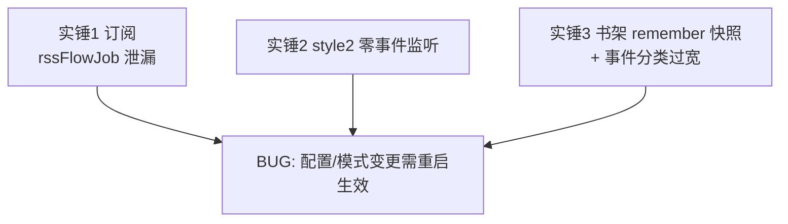
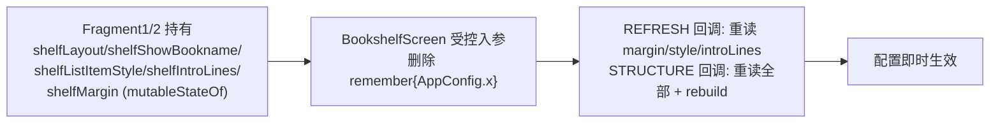
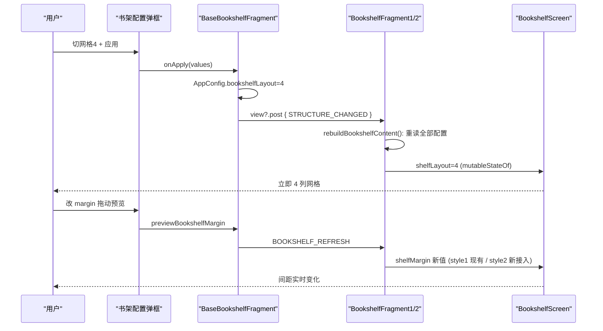

# design.md — 配置修改需重启生效 + 视效对齐 archive（穿透审查修订版）

> 本版为**设计阶段穿透审查修订版**（2026-08-28）：所有根因候选已对照源码实锤，事件分类已按 archive 精确对齐，卡点已列明。

## Technical Approach

### 统一根因模型（三处实锤，全部源码级核实）



#### 实锤 1：订阅 classic 路径 rssFlowJob 泄漏（Bug A 根因，源码级）

[applyModernRssMode](file:///f:/myself/github/WeAgentChat/temp/legado/app/src/main/java/io/legado/app/ui/main/rss/RssFragment.kt#L414-L424) 启动 `observeRssSources` collector（挂 `rssFlowJob`，用 `flowWithLifecycleAndDatabaseChange`）。切 classic 时：
- [applyClassicRssMode](file:///f:/myself/github/WeAgentChat/temp/legado/app/src/main/java/io/legado/app/ui/main/rss/RssFragment.kt#L391-L411) **不取消 rssFlowJob**；仅当 `!isShowingFolder` 时经 upRssFlowJob 间接取消
- **文件夹视图路径（isShowingFolder）只调 upFolderView()，modern collector 完整存活**
- 返回主界面 RESUMED → `flowWithLifecycleAndDatabaseChange` 重新发射 → `renderRssSourceSelector()` 把 modern 源标签重新提交 primaryBar + `selectSource()` 改标题/搜索入口/登录刷新按钮 → **经典顶栏被 modern 收集器覆盖** = 用户所见残留（"还是新版每个订阅源的分类标签"与源标签现象吻合）

**修复**：`resetRssModeState()` 无条件取消 `groupsFlowJob` + `rssFlowJob`（不依赖 upRssFlowJob 调用时机）。诊断日志降级为验证手段。

#### 实锤 2：style2 零事件监听（Bug B 一半根因）

OURS [BookshelfFragment2.kt](file:///f:/myself/github/WeAgentChat/temp/legado/app/src/main/java/io/legado/app/ui/main/bookshelf/style2/BookshelfFragment2.kt) **无任何 observeEvent**——`BOOKSHELF_REFRESH` 仅 style1 监听（[BookshelfFragment1.kt:143](file:///f:/myself/github/WeAgentChat/temp/legado/app/src/main/java/io/legado/app/ui/main/bookshelf/style1/BookshelfFragment1.kt#L143)）。style2 下 margin/样式/布局变更完全无响应（连数据刷新都没有，margin 滑条预览在 style2 也无效）。

**修复**：style2 对齐 archive（[archive Fragment2:607-615](file:///f:/myself/github/WeAgentChat/temp/legado/archive-ref/legado-08172114/app/src/main/java/io/legado/app/ui/main/bookshelf/style2/BookshelfFragment2.kt)）补 REFRESH + STRUCTURE 双监听 + `rebuildBookshelfContent()`。

#### 实锤 3：书架 remember 快照 + OURS 事件分类过宽

- [BookshelfScreen.kt:88-92](file:///f:/myself/github/WeAgentChat/temp/legado/app/src/main/java/io/legado/app/ui/main/bookshelf/BookshelfScreen.kt#L88-L92) 5 项 `remember{AppConfig.x}` + [:214](file:///f:/myself/github/WeAgentChat/temp/legado/app/src/main/java/io/legado/app/ui/main/bookshelf/BookshelfScreen.kt#L214) 直读 → 非 `*CHANGED` 结构重建不重算
- margin/listItemStyle/listIntroLines 在 BookshelfScreen **完全未消费**（网格 padding 12dp/间距 16dp/列表封面 60dp 全硬编码）→ 即使事件通了也不生效，需接入
- **OURS 事件分类过宽**（[BaseBookshelfFragment.kt:312-330](file:///f:/myself/github/WeAgentChat/temp/legado/app/src/main/java/io/legado/app/ui/main/bookshelf/BaseBookshelfFragment.kt#L312-L330)）：showUnread/showLastUpdateTime/showWaitUpCount/showFastScroller/returnToTopAfterRead 全标 `structureChanged=true`。若直接补事件，这些数据类开关会触发全量重建（丢滚动位置/闪屏）。**必须先按 archive 精确重分类再补事件**

### 事件分类权威表（对齐 archive BaseBookshelfFragment:320-400）

| 配置项 | archive 分类 | OURS 现状 | 修正动作 |
|--------|-------------|----------|---------|
| layout | STRUCTURE | STRUCTURE | 保留 |
| showBookname | STRUCTURE | STRUCTURE | 保留 |
| groupStyle | NOTIFY_MAIN | NOTIFY_MAIN | 保留（MainActivity 切 style1/style2） |
| sort | `upSort()` 直查，不发事件 | upSort + 标 structure（冗余） | 去掉 structure 标记 |
| margin | REFRESH（预览拖动同） | STRUCTURE | 改 REFRESH |
| listItemStyle | REFRESH | STRUCTURE | 改 REFRESH |
| listIntroLines | REFRESH | STRUCTURE | 改 REFRESH |
| showUnread | REFRESH | STRUCTURE | 改 REFRESH |
| showLastUpdateTime | REFRESH | STRUCTURE | 改 REFRESH |
| showFastScroller | REFRESH | STRUCTURE | 改 REFRESH |
| showWaitUpCount | `postUpBooksLiveData` | STRUCTURE | **K3 已核：OURS BookshelfViewModel 无 postUpBooksLiveData → 回退 REFRESH** |
| returnToTopAfterRead | 仅存值，无事件 | STRUCTURE | 去掉标记 |

archive 另用 `view?.post { postEvent(STRUCTURE) }` 延迟一帧发布——OURS 跟随。

### BookshelfScreen 参数化设计

OURS BookshelfScreen 已是受控组件（books/loading 由 Fragment 的 mutableStateOf 提供）——参数化与现有架构吻合：



- Fragment1/2 新增 mutableStateOf 配置字段；初始值读 AppConfig
- REFRESH 回调：重读 margin/listItemStyle/introLines（+数据类开关）
- STRUCTURE 回调：重读 layout/showBookname 等 + 触发数据流刷新
- BookshelfScreen 内部 margin 驱动 contentPadding/spacedBy；listItemStyle 驱动列表双样式；introLines 驱动简介行数

### 订阅顶栏修复

1. `resetRssModeState()` 头两行无条件 `groupsFlowJob?.cancel(); rssFlowJob?.cancel()` 并置 null（P0，根因修复）
2. 保留现有 classic 复位链（清空 primary/tagsBar + applyView 提交经典标签）
3. 诊断 tag `RssModeSwitch` 降级为验证手段（验证 collector 不再覆盖）

## Architecture Decisions

### AD-01: 同根因问题整合一个 spec
- **Context**: 订阅顶栏残留与书架布局失效同为「配置变更后渲染层不重算」，用户要求合并（2026-08-28 决策）
- **Decision**: 合并为 `config-needs-restart-fix` 统一设计
- **Goal**: 一套文档覆盖同根因多界面修复
- **Tradeoff**: 修复面跨订阅+书架多文件
- **Status**: Accepted

### AD-02: 结构重建事件对齐全量 archive + 精确事件重分类
- **Context**: OURS 缺 `BOOKSHELF_STRUCTURE_CHANGED`；且现有分类把数据类开关错标 structure（过宽）
- **Decision**: 新增事件；分类严格按 archive 权威表重排（layout/showBookname→STRUCTURE；margin/style/introLines/unread/updateTime/fastScroller→REFRESH；showWaitUpCount→postUpBooksLiveData；sort→upSort；groupStyle→NOTIFY_MAIN）
- **Goal**: 即时生效且数据类开关不引发全量重建（防丢滚动/闪屏）
- **Tradeoff**: 需同时改 BaseBookshelfFragment 分类逻辑
- **Status**: Proposed

### AD-03: 订阅修复 = 无条件取消跨模式 collector（源码级根因）
- **Context**: 实锤 1——classic 路径 modern collector 泄漏，RESUMED 重发覆盖经典顶栏
- **Decision**: resetRssModeState 无条件取消 groupsFlowJob/rssFlowJob
- **Goal**: 切换后旧 collector 不再覆盖顶栏
- **Tradeoff**: 取消时机提前，需确认无其他消费方依赖（已核：groupsFlowJob/rssFlowJob 均模式私有）
- **Status**: Proposed

### AD-04: BookshelfScreen 配置读取改受控入参
- **Context**: remember 快照依赖组合重建；且 margin/style/introLines 根本未消费
- **Decision**: Fragment 持 mutableStateOf 配置传入；BookshelfScreen 删 remember 快照，参数驱动；三配置真正接入渲染
- **Goal**: 配置响应健壮、三配置从"改了无效"转"即时生效"
- **Tradeoff**: BookshelfScreen 签名变更 + 两 Fragment 调用点适配
- **Status**: Proposed

### AD-05: listItemStyle 接入与视效对齐耦合，边界由差异清单定
- **Context**: listItemStyle（RoundedCard/Classic）OURS 未实现——接入=实现双样式=视效工作
- **Decision**: 差异清单（间距/卡片/封面比例/边距）先行，经用户确认边界后一并实施
- **Goal**: 避免功能接入与视效改动二次返工
- **Tradeoff**: 实施前多一轮确认
- **Status**: Proposed

### AD-07: BookshelfScreen 取色全量归位（前端规范对齐评估结论）
- **Context**: 按 ui-standards/architecture.md 铁律 1/2 + color.md M3 派生色禁令逐条评估本次设计：BookshelfScreen 现存 `colorScheme.surfaceContainerHigh`（封面/分组底色）、`outline`（次要文本）、`onSurfaceVariant`（图标 tint）、`primary`（BadgeDot/进度条）、`surfaceVariant`（进度条 track）均为违规取色；本次改造该文件必须顺带归位，否则过不了开发门禁第 5 条（Grep 自查）
- **Decision**: 取色归位映射——封面/分组底色 → `UiCorner.surfaceColor(themeUiPalette.cardColor)`；次要文本/图标 tint → `palette.secondaryText`；BadgeDot/进度条主色 → `context.accentColor`（palette.accent）；进度条 track → `themeUiPalette.mutedColor`；RoundedCard 卡片 → `palette.settings.row` + `palette.border` + `UiCorner.actionRadius`（对齐管理页基线 B / archive appSettingPanelBackground 同源）；书名遮罩 scrim 属 color.md「中性灰浮层/遮罩」登记豁免（保留，登记 migration-registry）；遮罩白字随遮罩豁免
- **Goal**: 修复完成后该文件通过门禁 checklist 第 4/5/6 条，取色随主题设置全量联动
- **Tradeoff**: 改造面小幅扩大（同文件内取色替换，无结构影响）
- **Status**: Proposed

## 前端规范对齐评估记录（2026-08-28，用户指令）

对照 `ui-standards/architecture.md`（总纲门禁 0-8 条）+ `color.md`（§9.2 取色规范）逐条评估：

| 门禁条目 | 评估结果 |
|---------|---------|
| 0 图标语义 | 本次不涉及顶栏/菜单图标变更 → 不适用 |
| 1 顶栏三基线 | 不涉及顶栏改造 → 不适用 |
| 2 菜单基线 | 不涉及 → 不适用 |
| 3 弹框基线 | BookshelfConfigDialog 已是 ComposeDialogFragment 基线 ✅ |
| 4 根背景 page | 书架根背景由宿主（LegadoTheme/容器）承担，本次不动 BookshelfScreen 根背景；如需归位 shelfColor 另行登记（ThemeUiPalette 有专用 shelfColor 面） |
| 5 取色无硬编码 | **不通过 → AD-07 归位**（现存 M3 派生色清单见上） |
| 6 列表/卡片基线 | RoundedCard 方案对齐基线 B（palette.settings.row），合规 ✅ |
| 7 同屏一致性 | RoundedCard 与管理页卡片同源取色 ✅ |
| 8 更新记录 | 收尾时同步 ui-standards + migration-registry ✅（tasks 7.1） |

**结论**：设计按 AD-07 补充后满足前端规范；A3 视效对齐按用户裁决全量对齐 archive（字体走主题注入 uiTypeface/titleTypeface，合规）。

## 卡点与待澄清（设计阶段已核/待用户裁决）

| # | 卡点 | 状态 |
|---|------|------|
| K1 | listItemStyle 接入=实现 RoundedCard/Classic 双样式，与视效对齐耦合 | **已裁决（2026-08-28）：A3 全量对齐 archive**；取色源见 AD-07 |
| K2 | style2 补双监听后，rebuild 时 groupList/currentBooks 状态保留（不丢分组） | 已核：Fragment 状态字段独立于 composition，安全 |
| K3 | showWaitUpCount archive 走 postUpBooksLiveData | **已核：OURS BookshelfViewModel 无该方法（仅 addBookProgressLiveData）→ 回退 REFRESH** |
| K4 | margin 预览（拖动实时）在 style2 生效依赖双监听接入 | 随实锤 2 修复自动解决 |
| K5 | 并发风险：另一会话正跑 ui-style-unify-deep-fix R3 E2E（占用 MEmu + updateLog 有并发写入史） | L2 验证需协调模拟器；updateLog 先 Read 再追加 |
| K6 | 结构重建防闪屏：archive 靠清 scrollPositions+重建，OURS Compose 侧用 key 触发重组 | 实施时用 mutableStateOf 触发，LazyGrid state 保留滚动（GridCells 列数变化时滚动自然重置，可接受） |
| **K7** | **OURS showBookname 弹框/渲染语义错位（新发现 bug）** | **已裁决（2026-08-28）：修映射（隐藏→0/显示→1/遮罩→2）+ 历史存量统一重置为 1（显示）** |
| **K8** | **OURS 列表封面正方形 bug（新发现）** | 已纳入 4A.2 修复（aspectRatio 前置 + 统一 0.75f） |
| K9 | FolderGroupList（文件夹分组封面）也是硬编码 padding，margin 接入需覆盖 | 已纳入 4.3 接入范围（archive 分组与书混排同享 margin，OURS 独立容器同样接入） |
| K10 | A3 视效收敛范围 | **已裁决（2026-08-28）：全量对齐 archive（"分析 Archive 的行为，对齐即可"）**，含布局尺寸类/状态右列/meta 图标行/角标双态色/转圈/字体与投影 |

## 附录 A：书架视效差异清单（OURS vs archive，子代理逐项核实）

> 完整 8 维度对比见任务执行记录；此处浓缩为对齐决策所需条目。archive 基线文件：`compose/BookshelfComposeList.kt`、`BookshelfComposeItems.kt`、`BookshelfComposeCover.kt`、`BookListCardComponents.kt`、`BookCoverImage.kt`。

### A1. 必修（bug/语义类）

| 项 | OURS | archive | 动作 |
|----|------|---------|------|
| 列表封面正方形 bug | size 前置致 aspectRatio 失效 | 宽度制+高=宽/0.75 | 修复（K8） |
| showBookname 语义错位 | 弹框 0=显示 vs 渲染 1=显示 | 弹框与渲染同义（0=显示） | 修映射+存量重置（K7，需裁决） |
| 网格封面比例 | 0.7f | 0.75f 标准书封 | 改 0.75f |
| listItemStyle 值域 | coerceIn(0..2)，值 2 无样式 | Enum{Classic=0, RoundedCard=1}，else→Classic | 无需实现值 2，渲染 else→Classic |

### A2. 功能接入（三配置消费，对齐 archive 行为）

| 项 | archive 消费方式 | OURS 接入方案 |
|----|-----------------|--------------|
| margin | item 级 padding（网格四周 max(2dp)，列表纵向）+ contentPadding top/bottom | OURS 容器级 spacing 换算：网格 contentPadding(horizontal=margin, top/bottom=margin) + spacedBy(margin)；列表行 vertical padding=margin；分组封面同享 |
| listIntroLines | 仅简介 Text maxLines=introMaxLines(0..3)，0=隐藏 | BookListItem 补简介文本行（book.intro 清洗）+ maxLines 参数 |
| listItemStyle | Classic（无背景 clip 2dp）vs RoundedCard（rowColor 填充+描边+actionRadius 圆角） | BookListItem 双样式分支（RoundedCard 用主题 token，无硬编码色） |

### A3. 视效收敛（需用户裁决边界）

| 项 | OURS | archive | 建议 |
|----|------|---------|------|
| 列表行高 | 固定 76/96dp | heightIn(min) Classic 82/112、RoundedCard 112/154 | 改 heightIn(min) 随样式 |
| 列表封面尺寸 | 48/60dp | Classic 58/78、RoundedCard 68/94 | 随样式分档 |
| meta 行 | 纯文本无图标 | author/history/last 三行带 14dp 图标 + compact 合并单行 | 可对齐（增强观感） |
| 状态右列 | 角标挤标题行 | 独立右对齐列（更新中转圈/角标+时间） | 建议对齐 |
| 未读角标 | 主题 primary 单色，>99 截断 "99+" | 双态色（新章 accent/普通黑 α0.55），上限 99999 | 建议对齐 |
| 更新中转圈 | 无 | CircularProgressIndicator | 建议补 |
| 书名遮罩 | scrim 底+白字居中 | 纯白字叠印左下 | 保留 OURS scrim（更易读） |
| 书名遮罩字体 | bodySmall | 12sp titleFontFamily Medium | 对齐字体 |
| 网格 contentPadding | 12/8/12 | 8/含margin/8/含margin+底栏 | 对齐含 margin 联动 |
| 卡片投影 | 无 | 封面 elevation 2f（bookCoverShadow 开关） | 可选 |
| 分组列表封面 | 66×90dp | 随 cardStyle 档位 | 随样式对齐 |
| 分组名 minLines | 无 | minLines=2 | 补齐 |
| 字体体系 | MaterialTheme 默认 | 主题注入 titleTypeface/uiTypeface | 按 ui-standards 取舍 |

### A4. OURS 独有增强（保留，不对齐删除）

- 骨架屏（ShelfGrid/ShelfListSkeleton，archive 无对应）
- 阅读进度条（网格/列表，archive 无）
- 独立文件夹分组容器结构（archive 为混排）

## 附录 B：关键代码级设计

### B1. resetRssModeState（实锤 1 修复）

```kotlin
private fun resetRssModeState() {
    // P0: 无条件取消跨模式 collector（classic 路径原先仅在 upRssFlowJob 时机取消，
    // 文件夹视图路径完全不取消 → modern collector RESUMED 重发覆盖经典顶栏）
    groupsFlowJob?.cancel(); groupsFlowJob = null
    rssFlowJob?.cancel(); rssFlowJob = null
    currentGroup = null
    // ...其余不变
}
```

### B2. applyBookshelfConfig 分类重排（实锤 3 事件侧）

```kotlin
var notifyMain = false; var structureChanged = false; var refreshBookshelf = false
// structure: 仅 layout / showBookname（对齐 archive）
// refresh: margin/listItemStyle/listIntroLines/showUnread/showLastUpdateTime/
//          showFastScroller/showWaitUpCount(K3 回退)
// sort: 仅 upSort() 不标 structure；returnToTopAfterRead: 仅存值
// groupStyle: NOTIFY_MAIN（现状保留）
if (structureChanged) view?.post { postEvent(EventBus.BOOKSHELF_STRUCTURE_CHANGED, "") }
else if (refreshBookshelf) postEvent(EventBus.BOOKSHELF_REFRESH, "")
```

### B3. Fragment1/2 配置状态 + 双监听（实锤 2/3）

```kotlin
// 两 Fragment 各自新增（初始值读 AppConfig）
private var shelfLayout by mutableIntStateOf(AppConfig.bookshelfLayout)
private var shelfShowBookname by mutableIntStateOf(AppConfig.showBookname)
private var shelfListItemStyle by mutableIntStateOf(AppConfig.bookshelfListItemStyle)
private var shelfIntroLines by mutableIntStateOf(AppConfig.bookshelfListIntroLines)
private var shelfMargin by mutableIntStateOf(AppConfig.bookshelfMargin)
// 监听（style1 补 STRUCTURE；style2 补双监听）
observeEvent<String>(EventBus.BOOKSHELF_REFRESH) { refreshShelfRenderConfig() }
observeEvent<String>(EventBus.BOOKSHELF_STRUCTURE_CHANGED) { rebuildBookshelfContent() }
// refreshShelfRenderConfig: 重读 margin/style/introLines + 数据类开关 → 写 mutableStateOf
// rebuildBookshelfContent: 重读全部 + upConnect()
```

### B4. BookshelfScreen 新签名（删 remember 快照）

```kotlin
@Composable
fun BookshelfScreen(
    // 既有: bookGroups/books/loading/error/groupId/isFolder/topScrollTrigger/isRefreshing/回调
    // 新增受控配置参数（调用方 mutableStateOf 传入，替代内部 remember{AppConfig.x}）:
    layout: Int, showBookname: Int, listItemStyle: Int,
    introLines: Int, margin: Int,
)
```
- 内部全部读参数；margin 驱动网格 contentPadding/spacedBy/列表行 padding/分组容器 padding（K9）
- introLines 驱动 BookListItem 简介行（补 book.intro 渲染，0=隐藏）
- listItemStyle 驱动 Classic/RoundedCard 双样式（else→Classic，K1 值 2 兼容）
- showBookname 语义修正随 K7 裁决落地

## Data Flow



## File Changes

| 文件 | 变更 |
|------|------|
| `app/src/main/java/io/legado/app/constant/EventBus.kt` | 新增 `BOOKSHELF_STRUCTURE_CHANGED` |
| `app/src/main/java/io/legado/app/ui/main/rss/RssFragment.kt` | resetRssModeState 无条件取消双 collector；验证日志（临时） |
| `app/src/main/java/io/legado/app/ui/main/bookshelf/BaseBookshelfFragment.kt` | 事件分类按权威表重排；STRUCTURE 事件发布（view?.post） |
| `app/src/main/java/io/legado/app/ui/main/bookshelf/style1/BookshelfFragment1.kt` | 配置 mutableStateOf 化 + STRUCTURE 监听 + rebuild |
| `app/src/main/java/io/legado/app/ui/main/bookshelf/style2/BookshelfFragment2.kt` | 补 REFRESH+STRUCTURE 双监听 + rebuild（对齐 archive） |
| `app/src/main/java/io/legado/app/ui/main/bookshelf/BookshelfScreen.kt` | 删 remember 快照改受控入参；margin/listItemStyle/introLines 接入；:214 直读修 |
| `app/src/main/java/io/legado/app/ui/main/bookshelf/compose/BookshelfComposeList.kt` | 视效对齐（差异清单确认后） |
| `app/src/main/assets/updateLog.md` | 版本交付说明（编译前更新，先读后追加防并发） |
| `docs/specs/config-needs-restart-fix/*.md` | 统一四文档 |
| `docs/project-flow/ui-standards/how-to.md` | 沉淀「渲染层配置快照 + 缺结构重建 = 需重启」禁令 |