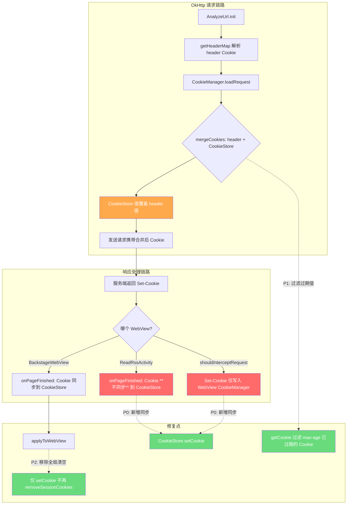
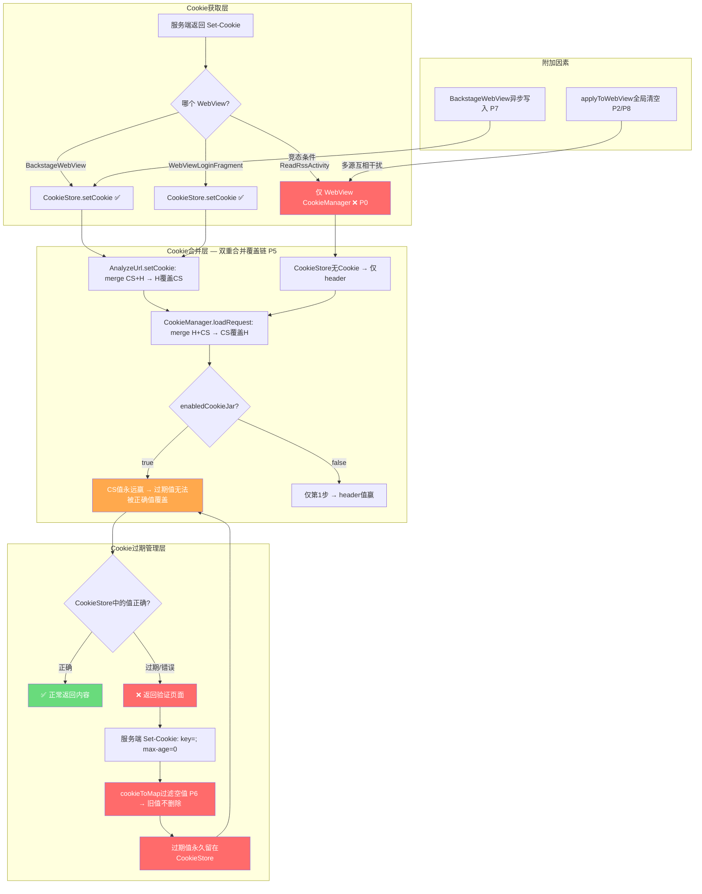
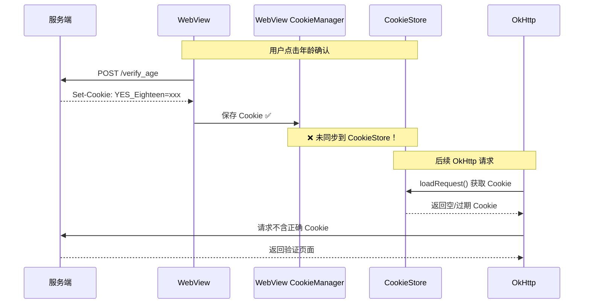
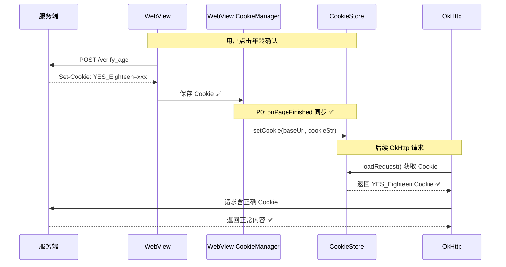

# Cookie 管理链路修复 — 技术设计文档

## Technical Approach

### Cookie 完整数据流（当前 + 修复后）



### 问题定位与修复方案

> 以下分析基于源码逐行精读验证，每个问题都附有源码行号。

#### P0: ReadRssActivity WebView Cookie 不回写 CookieStore（最高优先级）

**源码位置**：ReadRssActivity.kt L678-693（shouldInterceptRequest）+ L723-741（onPageFinished）

**源码验证**：

```kotlin
// ReadRssActivity.kt L691-693 — shouldInterceptRequest 中 Set-Cookie 仅写入 WebView CookieManager
res.headers("Set-Cookie").forEach { setCookie ->
    webCookieManager.setCookie(url, setCookie)  // 仅写入 WebView CookieManager
}

// ReadRssActivity.kt L723-741 — onPageFinished 无任何 CookieStore 回写
override fun onPageFinished(view: WebView, url: String) {
    super.onPageFinished(view, url)
    // ... 仅有 title 更新和 injectJs，无 CookieStore.setCookie 调用
}
```

**对比 BackstageWebView.kt L207-214（正确实现）**：

```kotlin
// BackstageWebView.kt L207-214 — onPageFinished 回写 CookieStore ✅
private fun setCookie(url: String) {
    tag?.let {
        Coroutine.async(executeContext = IO) {
            val cookie = CookieManager.getInstance().getCookie(url)
            CookieStore.setCookie(it, cookie)  // 回写 CookieStore ✅
        }
    }
}

// L234: onPageFinished 中调用
override fun onPageFinished(view: WebView, url: String) {
    setCookie(url)  // ← 每次 onPageFinished 都回写
}
```

**Grep 验证**：ReadRssActivity.kt 中搜索 `CookieStore` / `setCookie` / `CookieManager`，确认没有任何 `CookieStore.setCookie()` 调用。

**影响**：用户在 ReadRssActivity 中通过年龄验证/登录后获得的 Cookie 不会被 OkHttp 使用，后续请求仍可能返回验证页面。这是"时好时不好"的最直接原因。

**修复方案**：在 onPageFinished 中添加 WebView CookieManager → CookieStore 同步（参照 BackstageWebView L234 的实现）

```kotlin
override fun onPageFinished(view: WebView, url: String) {
    super.onPageFinished(view, url)
    // P0: 同步 WebView Cookie 到 CookieStore（参照 BackstageWebView.setCookie）
    viewModel.rssSource?.sourceUrl?.let { sourceUrl ->
        val cookie = android.webkit.CookieManager.getInstance().getCookie(url)
        if (!cookie.isNullOrBlank()) {
            CookieStore.setCookie(sourceUrl, cookie)
        }
    }
    // 原有 title 更新和 injectJs 逻辑...
}
```

**风险评估**：低风险。仅添加同步逻辑，不修改原有逻辑。

#### P1: CookieStore 无过期清理机制（高优先级）

**源码位置**：CookieStore.kt L102-119（getCookie）

**源码验证**：

```kotlin
// CookieStore.kt L102-119 — getCookie 无过期过滤
override fun getCookie(url: String): String {
    val domain = NetworkUtils.getSubDomain(url)
    val cookie = getCookieNoSession(url)         // 读取持久 Cookie
    val sessionCookie = CookieManager.getSessionCookie(domain)  // 读取会话 Cookie
    val cookieMap = mergeCookiesToMap(cookie, sessionCookie)    // 合并（会话覆盖持久）
    var ck = mapToCookie(cookieMap) ?: ""
    while (ck.length > 4096) {
        // 仅有长度淘汰（LRU），无过期淘汰！
        val removeKey = selectCookieKeyToRemove(cookieMap) ?: break
        CookieManager.removeCookie(url, removeKey)
        cookieMap.remove(removeKey)
        ck = mapToCookie(cookieMap) ?: ""
    }
    return ck
}
```

**关键发现**：CookieStore 有 LRU 长度淘汰机制（>4096字符时），但**没有任何过期时间检查**。过期 Cookie 永远留在存储中，直到被新值覆盖或 LRU 淘汰。

**影响**：服务端通过 `Set-Cookie: key=; max-age=0` 标记 Cookie 过期时，CookieStore 不会删除该 Cookie。下次 loadRequest() 时，过期 Cookie 仍会被合并到请求中，可能覆盖 header 中预置的正确值。

**修复方案**：在 CookieStore.getCookie() 中添加 max-age=0 过期过滤

```kotlin
override fun getCookie(url: String): String {
    val domain = NetworkUtils.getSubDomain(url)
    val cookie = getCookieNoSession(url)
    val sessionCookie = CookieManager.getSessionCookie(domain)
    val cookieMap = mergeCookiesToMap(cookie, sessionCookie)
    // P1: 过滤 max-age=0 的即时过期 Cookie
    cookieMap.entries.removeAll { (_, value) ->
        value.isBlank() || value == "null"  // 空值/null 值 Cookie 视为已过期
    }
    var ck = mapToCookie(cookieMap) ?: ""
    // ... 原有 LRU 淘汰逻辑
}
```

**更精确的方案**：解析 Cookie 属性中的 max-age 值，结合写入时间判断是否过期。但需要修改存储结构，风险较高。

#### P2: applyToWebView() 和 setWebCookie() 全局清空会话 Cookie（高优先级）

**源码位置**：CookieManager.kt L145-153 + CookieStore.kt L70-82

**源码验证**：

```kotlin
// CookieManager.kt L145-153
fun applyToWebView(url: String) {
    val baseUrl = NetworkUtils.getBaseUrl(url) ?: return
    val cookies = CookieStore.getCookie(url).splitNotBlank(";")
    val cookieManager = CookieManager.getInstance()
    cookieManager.removeSessionCookies(null)  // ← 全局清空所有源的会话 Cookie！
    cookies.forEach { cookieManager.setCookie(baseUrl, it) }
}

// CookieStore.kt L70-82 — 同样的问题
fun setWebCookie(url: String, cookie: String) {
    val baseUrl = NetworkUtils.getBaseUrl(url) ?: return
    val cookies = cookie.splitNotBlank(";")
    val cookieManager = android.webkit.CookieManager.getInstance()
    cookieManager.removeSessionCookies(null)  // ← 同样全局清空！
    cookies.forEach { cookieManager.setCookie(baseUrl, it) }
}
```

**影响**：当源A在 WebView 中保持登录态（session Cookie），用户切到源B时，源B的 `applyToWebView()` 会清除所有源（包括源A）的会话 Cookie。用户切回源A时需要重新登录。

**修复方案**：移除两处 `removeSessionCookies(null)` 调用

```kotlin
// CookieManager.kt — 移除全局清空
fun applyToWebView(url: String) {
    val baseUrl = NetworkUtils.getBaseUrl(url) ?: return
    val cookies = CookieStore.getCookie(url).splitNotBlank(";")
    val cookieManager = CookieManager.getInstance()
    // P2: 不再全局清空会话 Cookie
    cookies.forEach { cookieManager.setCookie(baseUrl, it) }
}

// CookieStore.kt — 同样移除
fun setWebCookie(url: String, cookie: String) {
    val baseUrl = NetworkUtils.getBaseUrl(url) ?: return
    val cookies = cookie.splitNotBlank(";")
    val cookieManager = android.webkit.CookieManager.getInstance()
    // P2: 不再全局清空会话 Cookie
    cookies.forEach { cookieManager.setCookie(baseUrl, it) }
}
```

#### P3: AnalyzeUrl.saveCookie() 死代码（中优先级）

**源码位置**：AnalyzeUrl.kt L751-762

**源码验证**：

```kotlin
// AnalyzeUrl.kt L749-762
/**
 * 保存cookieJar中的cookie在访问结束时就保存,不等到下次访问
 */
private fun saveCookie() {
    //书源启用保存cookie时 添加内存中的cookie到数据库
    if (enabledCookieJar) {
        val key = "${domain}_cookieJar"
        CacheManager.getFromMemory(key)?.let {
            if (it is String) {
                CookieStore.replaceCookie(domain, it)
                CacheManager.deleteMemory(key)
            }
        }
    }
}
```

**Grep 验证**：搜索 `saveCookie()` 只找到定义 L751，无调用点。**确认是死代码。**

**影响**：本意是在请求结束后立即保存 CookieJar 中的 Cookie，但从未被调用，导致 `cookieJar` 内存缓存中的 Cookie 可能不会被及时持久化。

**修复方案**：在 `getStrResponseAwait()` 返回前调用 `saveCookie()`（激活功能），或直接移除。

#### P4: BackstageWebView Cookie 域名匹配（中优先级）

**源码位置**：BackstageWebView.kt L207-214

**源码验证**：

```kotlin
private fun setCookie(url: String) {
    tag?.let {  // tag = source.getKey()，通常是 sourceUrl
        Coroutine.async(executeContext = IO) {
            val cookie = CookieManager.getInstance().getCookie(url)  // 从请求 URL 读取 Cookie
            CookieStore.setCookie(it, cookie)  // 用 sourceUrl 存储，而非请求 URL 域名
        }
    }
}
```

**分析**：`CookieStore.setCookie(it, cookie)` 中 `it = source.getKey()`，内部调用 `NetworkUtils.getSubDomain(url)` 提取域名。如果 sourceUrl 和请求 URL 的域名一致（大多数情况），则没有问题。但如果有重定向（如 `https://main.com` 重定向到 `https://cdn.main.com`），则：
- `getCookie(url)` 从 `cdn.main.com` 获取 Cookie
- `setCookie(it, cookie)` 存储到 `main.com` 域名下
- 后续 OkHttp 请求 `cdn.main.com` 时，可能无法匹配到 Cookie

**实际影响**：有限。大多数源 URL 和请求 URL 域名一致。只有重定向到不同域名时才有问题。

#### P5: 双重合并覆盖链（新发现，最高影响）

**源码位置**：AnalyzeUrl.kt L724-746 + CookieManager.kt L57-77 + HttpHelper.kt L121-137

**源码验证**：

Cookie 在发往服务端前经过**两次合并**，第二次覆盖了第一次的结果：

```kotlin
// 第1步：AnalyzeUrl.setCookie() L736-739 — 请求发出前合并
// mergeCookies(cookieStore值, header值) → 后者覆盖前者 → header覆盖CookieStore
if (cookie.isNotEmpty()) {
    mergeCookies(cookie, headerMap["Cookie"])?.let {
        headerMap.put("Cookie", it)  // 合并结果存入 headerMap
    }
}

// 第2步：CookieManager.loadRequest() L61-64 — OkHttp拦截器中再次合并
// mergeCookies(header值, cookieStore值) → 后者覆盖前者 → CookieStore覆盖header
val cookie = CookieStore.getCookie(domain)
val requestCookie = request.header("Cookie")  // 来自第1步的headerMap
val newCookie = mergeCookies(requestCookie, cookie)  // CookieStore值覆盖header值！
```

**第2步仅在 enabledCookieJar=true 时执行**（HttpHelper.kt L123-128）：

```kotlin
// HttpHelper.kt L121-137 — OkHttp NetworkInterceptor
addNetworkInterceptor { chain ->
    var request = chain.request()
    val enableCookieJar = request.header(cookieJarHeader) != null  // 检查标志
    if (enableCookieJar) {
        request = CookieManager.loadRequest(requestBuilder.build())  // 第2步合并
    }
    val networkResponse = chain.proceed(request)
    if (enableCookieJar) {
        CookieManager.saveResponse(networkResponse)  // 响应Cookie保存到CookieStore
    }
    networkResponse
}
```

**关键影响**：

| enabledCookieJar | 第1步结果 | 第2步结果 | 最终Cookie | 影响 |
|-----------------|----------|----------|-----------|------|
| true | header覆盖CookieStore | CookieStore覆盖header | **CookieStore值永远赢** | 过期Cookie无法被header正确值覆盖 |
| false | header覆盖CookieStore | 不执行 | header值赢 | 正常行为 |

**这是"时好时不好"的核心放大器**：即使 loginCheckJs 通过 `cookie.setCookie()` 更新了 CookieStore，如果 CookieStore 中有过期值，mergeCookies 的覆盖逻辑会让过期值"复生"。

**修复方案**：统一合并策略，消除双重合并。方案有二：
1. **方案A**：移除 AnalyzeUrl.setCookie()，仅在 CookieManager.loadRequest() 中合并（单一合并点）
2. **方案B**：AnalyzeUrl.setCookie() 仅补充 CookieStore 中有而 header 中没有的 key，不覆盖已有 key

#### P6: cookieToMap() 空值过滤导致过期Cookie无法被删除（新发现）

**源码位置**：CookieStore.kt L136-154

**源码验证**：

```kotlin
// CookieStore.kt L136-154 — cookieToMap()
override fun cookieToMap(cookie: String): MutableMap<String, String> {
    val cookieMap = mutableMapOf<String, String>()
    // ...
    for (pair in pairArray) {
        val pairs = pair.split(equalsRegex, 2)
        // ...
        val value = pairs[1]
        if (value.isNotBlank() || value.trim() == "null") {  // ← 空值不加入map！
            cookieMap[key] = value.trim()
        }
    }
    return cookieMap
}
```

**问题链路**：

1. 服务端发送 `Set-Cookie: key=; max-age=0` 标记Cookie过期
2. OkHttp 解析为 `key=` (空值)
3. `saveCookiesFromHeaders()` → `cookies.filter { it.persistent }.getString()` → `"key="`
4. `CookieStore.replaceCookie()` → `cookieToMap("key=")` → 空值被过滤，不加入map
5. `cookieMap.putAll(emptyMap)` → 无变化，旧值保留
6. **结果：过期Cookie无法被服务端的空值Set-Cookie删除！**

**这是 P1 的具体机制解释**。过期Cookie留在CookieStore中，通过P5的双重合并覆盖链，永远覆盖header中的正确值。

**修复方案**：在 `cookieToMap()` 中，将空值视为删除标记：

```kotlin
if (value.isNotBlank() || value.trim() == "null") {
    cookieMap[key] = value.trim()
} else {
    cookieMap[key] = ""  // 空值也加入map，作为删除标记
}
```

然后在 `replaceCookie()` 合并后，过滤掉空值：

```kotlin
override fun replaceCookie(url: String, cookie: String) {
    // ...
    val cookieMap = cookieToMap(oldCookie)
    cookieMap.putAll(cookieToMap(cookie))  // 新值覆盖旧值（含空值删除标记）
    cookieMap.entries.removeAll { it.value.isBlank() }  // 移除空值=删除
    val newCookie = mapToCookie(cookieMap)
    setCookie(url, newCookie)
}
```

#### P7: BackstageWebView Cookie 异步写入竞态条件（新发现）

**源码位置**：BackstageWebView.kt L207-214

**源码验证**：

```kotlin
// BackstageWebView.kt L207-214
private fun setCookie(url: String) {
    tag?.let {
        Coroutine.async(executeContext = IO) {  // ← 异步非阻塞！
            val cookie = CookieManager.getInstance().getCookie(url)
            CookieStore.setCookie(it, cookie)  // 写入CookieStore
        }
    }
}
```

**问题**：`Coroutine.async(IO)` 是非阻塞的，onPageFinished 调用 setCookie() 后立即返回。如果下一个 OkHttp 请求在异步写入完成前发出，CookieStore 中的 Cookie 仍是旧值。

**场景**：
1. BackstageWebView 加载页面 → onPageFinished → setCookie() 异步启动
2. AnalyzeUrl 立即发起新请求 → setCookie() 读取 CookieStore → 仍是旧值
3. 异步写入完成 → 但请求已发出

**修复方案**：将 BackstageWebView.setCookie() 改为同步写入，或在 BackstageWebView.getStrResponse() 的回调前确保 Cookie 写入完成。

#### P8: ReadRssActivity.applyToWebView() 触发时清空所有源会话Cookie（P2的加剧场景）

**源码位置**：ReadRssActivity.kt L407

**源码验证**：

```kotlin
// ReadRssActivity.kt L407 — 打开RSS文章时触发
CookieManager.applyToWebView(urlState.url)
// 内部调用 cookieManager.removeSessionCookies(null) ← 全局清空！
```

**场景**：
1. 用户在源A的WebView中已登录（会话Cookie在WebView CookieManager中）
2. 用户打开源B的RSS文章 → ReadRssActivity → applyToWebView()
3. `removeSessionCookies(null)` 清空所有源的会话Cookie
4. 用户切回源A → 需要重新登录

**修复方案**：同 P2，移除 `removeSessionCookies(null)` 调用。

#### P9: replaceCookie() 读-改-写竞态条件（新发现）

**源码位置**：CookieStore.kt L84-97

**源码验证**：

```kotlin
// CookieStore.kt L84-97
override fun replaceCookie(url: String, cookie: String) {
    if (TextUtils.isEmpty(url) || TextUtils.isEmpty(cookie)) return
    val oldCookie = getCookieNoSession(url)  // 1. 读旧值
    if (TextUtils.isEmpty(oldCookie)) {
        setCookie(url, cookie)
    } else {
        val cookieMap = cookieToMap(oldCookie)  // 2. 合并
        cookieMap.putAll(cookieToMap(cookie))
        val newCookie = mapToCookie(cookieMap)
        setCookie(url, newCookie)  // 3. 写回
    }
}
```

**问题**：读-改-写三步操作不是原子的。两个并发请求（如多线程同时加载同域名资源）同时调用 replaceCookie() 时：
1. 线程A读到 oldCookie="a=1"
2. 线程B也读到 oldCookie="a=1"
3. 线程A合并 a=1+b=2 → 写回 "a=1;b=2"
4. 线程B合并 a=1+c=3 → 写回 "a=1;c=3" → 线程A的 b=2 丢失！

**影响**：多源并发请求时可能导致Cookie更新丢失。实际频率较低（同域名并发请求不常见）。

**修复方案**：使用 `@Synchronized` 或对 CookieStore 操作加锁。

#### P10: 会话Cookie应用重启后丢失（新发现）

**源码位置**：CookieManager.kt L87-96 + CacheManager.kt L19-25

**源码验证**：

```kotlin
// CookieManager.kt L87-96 — 会话Cookie存储
private fun updateSessionCookie(domain: String, cookies: String) {
    val sessionCookie = getSessionCookie(domain)
    if (sessionCookie.isNullOrEmpty()) {
        CacheManager.putMemory("${domain}_session_cookie", cookies)  // 仅内存！
        return
    }
    val ck = mergeCookies(sessionCookie, cookies) ?: return
    CacheManager.putMemory("${domain}_session_cookie", ck)  // 仅内存！
}

// CacheManager.kt L19-25 — LruCache 内存缓存
private val memoryLruCache = object : LruCache<String, Any>(1024 * 1024 * 50) {
    override fun sizeOf(key: String, value: Any): Int {
        return value.toString().memorySize()
    }
}
```

**问题**：会话Cookie仅存在 `memoryLruCache` 中，应用重启后全部丢失。但持久Cookie在数据库中保留（可能已过期）。

**场景**：
1. 用户登录 → 服务端返回会话Cookie → 存入内存
2. 应用重启 → 会话Cookie丢失 → 持久Cookie仍在（可能过期）
3. 下次请求 → getCookie() 合并空的会话Cookie + 过期持久Cookie → 请求失败

**影响**：用户每次重启应用后，需要重新登录所有使用会话Cookie的源。

**修复方案**：将关键会话Cookie（如年龄验证Cookie）持久化到数据库，或在 CookieStore.getCookie() 中检测持久Cookie的过期时间。

#### P11: CookieStore.getKey() 传URL而非domain给getSessionCookie()（代码Bug）

**源码位置**：CookieStore.kt L121-126

**源码验证**：

```kotlin
// CookieStore.kt L121-126
fun getKey(url: String, key: String): String {
    val cookie = getCookie(url)
    val sessionCookie = CookieManager.getSessionCookie(url)  // ← BUG: 传了URL而非domain！
    val cookieMap = mergeCookiesToMap(cookie, sessionCookie)
    return cookieMap[key] ?: ""
}
```

**问题**：`CookieManager.getSessionCookie(domain)` 期望 domain 参数，用 `${domain}_session_cookie` 构造key查找。但这里传入了完整URL（如 `https://example.com/path`），导致查找key为 `https://example.com/path_session_cookie`，永远匹配不到正确的 `example.com_session_cookie`。

**实际影响**：有限。因为 `getCookie(url)` 已经内部正确合并了持久+会话Cookie，`getKey()` 的第二次getSessionCookie调用是冗余的且返回null，被filterNotNull过滤掉。结果仍然正确（by accident）。

**修复方案**：将 `CookieManager.getSessionCookie(url)` 改为 `CookieManager.getSessionCookie(NetworkUtils.getSubDomain(url))`。

#### P12: ReadRssActivity.shouldInterceptRequest() 绕过CookieStore（P0的另一个侧面）

**源码位置**：ReadRssActivity.kt L678-693

**源码验证**：

```kotlin
// ReadRssActivity.kt L681-693 — shouldInterceptRequest 中创建的OkHttp请求
val res = okHttpClient.newCallResponse {
    url(url)
    method(request.method, null)
    if (!cookie.isNullOrEmpty()) {
        addHeader("Cookie", cookie)  // 直接设置Cookie header
    }
    // 注意：没有 cookieJarHeader！→ 不走 CookieManager.loadRequest()
    request.requestHeaders?.forEach { (key, value) ->
        addHeader(key, value)
    }
}
res.headers("Set-Cookie").forEach { setCookie ->
    webCookieManager.setCookie(url, setCookie)  // 仅写入WebView CookieManager
    // 注意：不走 CookieManager.saveResponse() → CookieStore不更新
}
```

**问题**：shouldInterceptRequest 中的OkHttp请求完全绕过CookieStore：
1. Cookie从WebView CookieManager读取（非CookieStore）
2. 不设cookieJarHeader → 不走CookieManager.loadRequest()
3. Set-Cookie仅写WebView CookieManager → 不走CookieManager.saveResponse()

**影响**：这是P0的具体实现细节——WebView内的请求绕过CookieStore，导致WebView获取的Cookie无法被OkHttp使用。

### "时好时不好"的完整根因链路（更新版）



**"时好时不好"的五种场景**：

1. **首次使用/清除后（好）**：CookieStore 为空 → loadRequest 仅使用 header Cookie → header 中的正确值生效 → 正常
2. **ReadRssActivity登录后（不好）**：WebView获得Cookie但未同步到CookieStore → OkHttp请求无Cookie → 返回验证页面
3. **Cookie过期后（不好）**：CookieStore 中有过期值 → P5双重合并使CS值覆盖header值 → P6空值过滤使过期值无法被删除 → 请求携带过期Cookie → 返回验证页面
4. **loginCheckJs刷新后（时好时不好）**：loginCheckJs通过cookie.setCookie()更新CS → 但当前请求已返回验证页面 → 仅下次请求正常
5. **多源切换后（不好）**：P2/P8的removeSessionCookies清空所有源会话Cookie → 其他源需重新登录

## Architecture Decisions

### AD-01: Cookie 同步策略 — onPageFinished 同步 vs shouldInterceptRequest 同步
- **Context**: WebView 获取 Cookie 有两个时机：shouldInterceptRequest（拦截请求时获取 Set-Cookie）和 onPageFinished（页面加载完成后读取 WebView CookieManager）
- **Concern**: 哪个时机更可靠？
- **Decision**: 采用 onPageFinished 同步（参照 BackstageWebView 的成功实现）
- **Goal**: 确保同步时机与 BackstageWebView 一致，减少回归风险
- **Tradeoff**: onPageFinished 可能比 shouldInterceptRequest 延迟几十毫秒，但更可靠（WebView CookieManager 已完成内部处理）
- **Status**: Proposed

### AD-02: Cookie 过期过滤 — 简单 max-age 检查 vs 完整时间戳追踪
- **Context**: CookieStore 当前不记录 Cookie 的写入时间和过期属性
- **Concern**: 是否需要完整追踪每个 Cookie 的过期时间？
- **Decision**: 第一阶段仅过滤 max-age=0 的 Cookie（即时过期），后续再考虑完整时间戳追踪
- **Goal**: 最小化修改范围，先解决最常见的过期场景
- **Tradeoff**: 无法过滤已有 max-age>0 但已到期的 Cookie，但 max-age=0 是最常见的"服务端标记 Cookie 过期"方式
- **Status**: Proposed

### AD-03: applyToWebView 清空策略 — 移除全局清空 vs 按域清空
- **Context**: 当前 applyToWebView 在设置 Cookie 前全局清空所有会话 Cookie
- **Concern**: 是按域名精确清空还是直接移除清空操作？
- **Decision**: 直接移除 removeSessionCookies() 调用，不做任何清空
- **Goal**: 多源场景下不再互相干扰
- **Tradeoff**: 如果 CookieStore 和 WebView CookieManager 有不一致的 Cookie，不再通过清空来"重置"，而是通过 setCookie 覆盖
- **Status**: Proposed

### AD-04: Cookie 合并策略 — 消除双重合并覆盖链（P5）
- **Context**: AnalyzeUrl.setCookie() 和 CookieManager.loadRequest() 对 Cookie 做了两次 mergeCookies，且参数顺序相反，导致 CookieStore 值永远覆盖 header 值
- **Concern**: 如何统一合并策略？
- **Decision**: 采用方案A — 移除 AnalyzeUrl.setCookie() 中的 mergeCookies 调用，仅在 CookieManager.loadRequest() 中合并
- **Goal**: 消除双重合并，CookieStore 和 header 只合并一次，参数顺序固定为 merge(header, cookieStore)，CookieStore 覆盖 header
- **Tradeoff**: 移除 AnalyzeUrl.setCookie() 的合并后，如果 enabledCookieJar=false，CookieStore 中的 Cookie 不会被添加到 header。但 enabledCookieJar=false 的源本就不走 loadRequest，所以不影响
- **Alternative**: 方案B — AnalyzeUrl.setCookie() 仅补充 CookieStore 中有而 header 中没有的 key
- **Status**: Proposed

### AD-05: Cookie 空值删除机制（P6）
- **Context**: 服务端通过 `Set-Cookie: key=; max-age=0` 标记 Cookie 过期，但 cookieToMap() 过滤空值导致旧值无法被删除
- **Concern**: 如何正确处理空值 Cookie？
- **Decision**: 在 cookieToMap() 中将空值作为删除标记加入 map，在 replaceCookie() 合并后移除空值条目
- **Goal**: 服务端的过期标记能正确传播到 CookieStore，删除过期条目
- **Tradeoff**: cookieToMap() 的行为变更可能影响其他调用点（如 mergeCookiesToMap），需要确保空值在最终 mapToCookie() 前被清理
- **Status**: Proposed

### AD-06: BackstageWebView Cookie 同步时序（P7）
- **Context**: BackstageWebView.setCookie() 使用异步写入，可能导致下一个 OkHttp 请求读到旧 Cookie
- **Concern**: 是改为同步写入还是等待异步完成？
- **Decision**: 在 BackstageWebView.getStrResponse() 的回调（onResult/onError）前，确保 setCookie() 写入完成
- **Goal**: 保证 CookieStore 在下一个请求前已更新
- **Tradeoff**: 同步写入会阻塞 IO 线程几十毫秒，但 Cookie 写入通常很快（内存缓存 + 数据库插入）
- **Status**: Proposed

## Data Flow

### 修复前：Cookie 在 ReadRssActivity 中的断裂



### 修复后：Cookie 完整同步



## File Changes

| 文件 | 修改类型 | 修改内容 | 关联问题 |
|------|---------|---------|---------|
| ReadRssActivity.kt | 修改 | onPageFinished 添加 WebView→CookieStore 同步 | P0 |
| ReadRssActivity.kt | 修改 | shouldInterceptRequest 中 Set-Cookie 同步到 CookieStore | P0/P12 |
| CookieManager.kt | 修改 | applyToWebView 移除 removeSessionCookies | P2/P8 |
| CookieStore.kt | 修改 | setWebCookie 移除 removeSessionCookies | P2 |
| CookieStore.kt | 修改 | getCookie 添加过期 Cookie 过滤 | P1 |
| CookieStore.kt | 修改 | cookieToMap 空值处理 + replaceCookie 空值删除 | P6 |
| CookieStore.kt | 修改 | replaceCookie 添加 @Synchronized | P9 |
| CookieStore.kt | 修改 | getKey 修复 getSessionCookie 参数（URL→domain） | P11 |
| AnalyzeUrl.kt | 修改 | 移除 setCookie() 双重合并或改为补充模式 | P5 |
| AnalyzeUrl.kt | 修改 | 移除 saveCookie() 死代码 | P3 |
| BackstageWebView.kt | 修改 | Cookie 存储使用请求 URL 域名 | P4 |
| BackstageWebView.kt | 修改 | setCookie() 改为同步写入 | P7 |
| CookieManager.kt | 修改 | 会话Cookie持久化（可选） | P10 |
