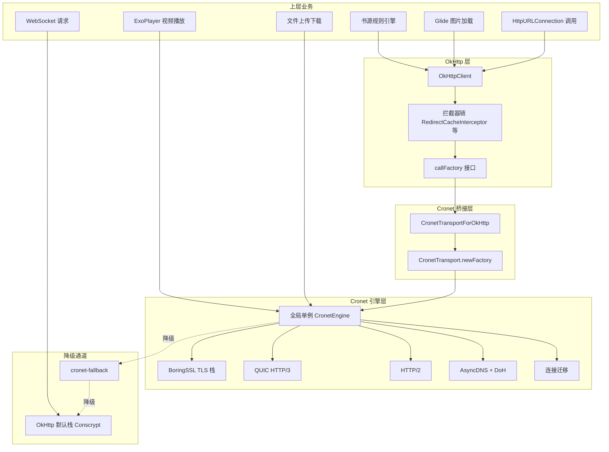
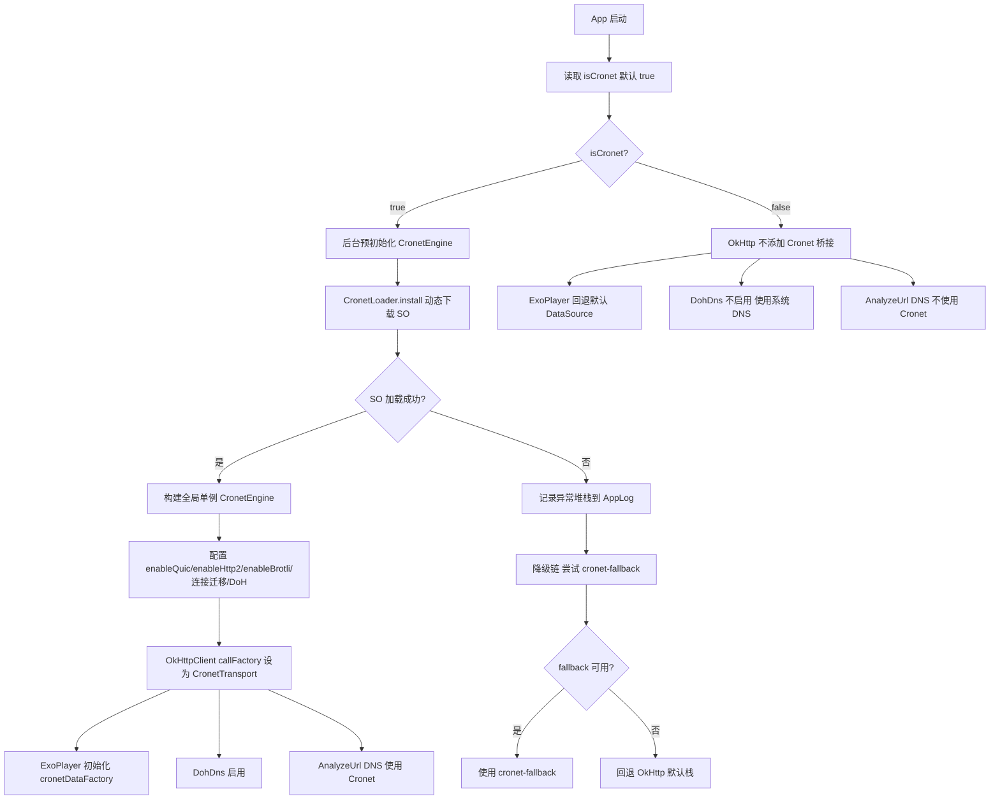
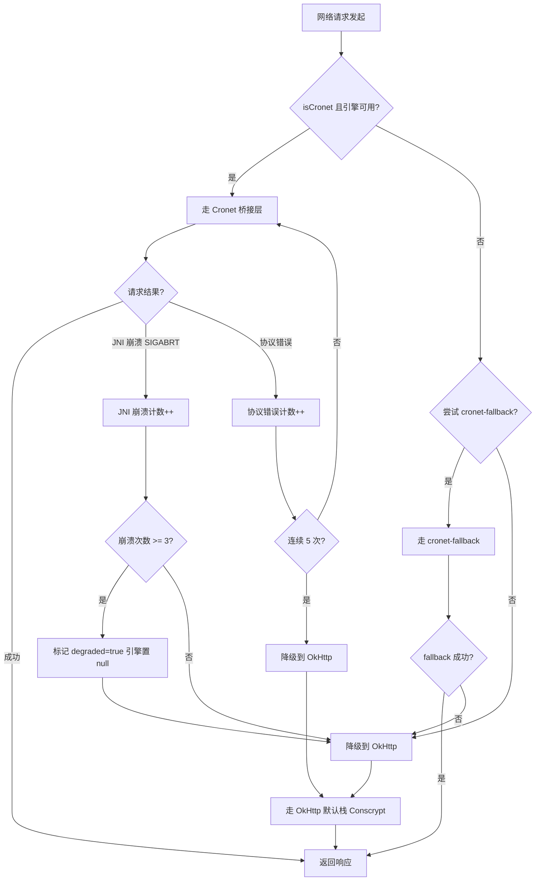
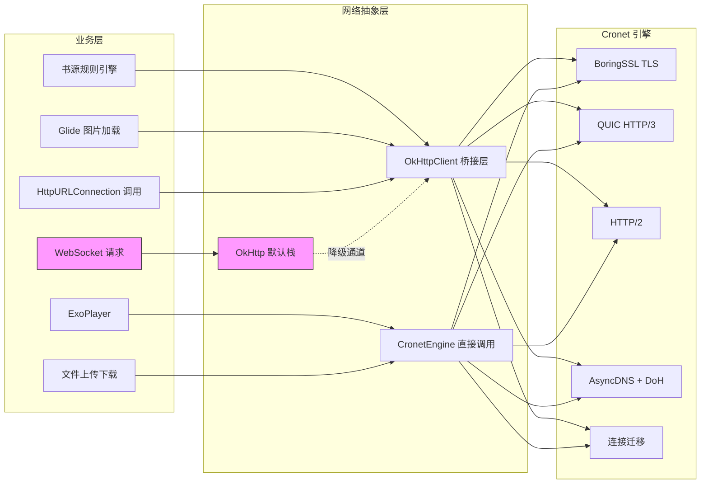

# Cronet 默认启用与扩展使用优化 - 设计文档

**文档状态**: 🔄 设计中（方向调整 v2）
**创建日期**: 2026-07-31
**OpenSpec ID**: cronet-global-enable-20260731
**关联 spec.md**: [spec.md](./spec.md)
**关联研究报告**: [cronet-default-enable-feasibility-report.md](../../research/cronet-default-enable-feasibility-report.md)

## Technical Approach

### 整体方案

本设计围绕"Cronet 默认自动启用 + 桥接层评估 + 分层降级 + 渐进扩展"展开。核心思路是：将 Cronet 作为项目默认网络栈（`isCronet` 默认 `true`），评估 Google 官方 `CronetTransportForOkHttp` 桥接层作为可选优化（源码核实：CronetInterceptor 已获得完整 Cronet 能力，桥接层非必须迁移），扩展使用范围至 HttpURLConnection/Glide/文件上传下载，并完善降级链保障稳定性。

### 当前架构分析（CronetInterceptor 拦截器模式）

#### 项目现状

| 维度 | 现状 | 说明 |
|------|------|------|
| Cronet Provider | 动态下载 SO 方案 | 非 cronet-embedded 也非 play-services-cronet，项目自实现 SO 动态下载 |
| 桥接方式 | `CronetInterceptor` 拦截器模式 | 通过 `addInterceptor` 注入，拦截请求后用 cronetEngine.newUrlRequestBuilder 执行（已获得完整 Cronet 能力） |
| 降级机制 | 连续 5 次协议错误降级 OkHttp | 已存在但未覆盖 JNI 崩溃场景 |
| `isCronet` 默认值 | `false` | `appCtx.getPrefBoolean(PreferKey.cronet)`，用户需手动开启 |
| 已接入模块 | OkHttp 拦截器 / ExoPlayer / DohDns / AnalyzeUrl | 4 大模块 |
| 未接入模块 | WebView（系统限制）/ Glide（间接）/ HttpURLConnection | 3 大模块 |

#### 当前 OkHttp 接入点

**文件**: `app/src/main/java/io/legado/app/help/http/HttpHelper.kt`

```kotlin
// 当前 CronetInterceptor 拦截器模式
if (AppConfig.isCronet) {
    if (Cronet.loader?.install() == true) {
        Cronet.interceptor?.let { builder.addInterceptor(it) }
    }
}
```

**拦截器模式现状（源码核实修正 2026-07-31）**:
1. `CronetInterceptor` 拦截请求后通过 `proceedWithCronet` → `buildRequest` → `cronetEngine.newUrlRequestBuilder` 用 Cronet 引擎执行请求（非 OkHttp 传输层）
2. TLS 握手由 Cronet 的 BoringSSL 完成，JA3/JA4 指纹接近 Chrome，**已获得 Cronet 核心反爬能力**
3. 已支持 QUIC 连接迁移、原生 HTTP/3、0-RTT、AsyncDNS（因请求由 cronetEngine 执行）
4. 与 CronetTransportForOkHttp 的区别：拦截器模式自行管理请求调度/重试/超时，桥接模式让 OkHttp 调度/重试/连接池与 Cronet 深度集成（可选优化，非必须迁移）

> **审查修正说明**：初版 design.md 错误声称"CronetInterceptor 底层仍是 OkHttp Conscrypt，无法获得 Cronet 能力"。源码铁证（CronetInterceptor.kt L290 proceedWithCronet → CronetHelper.kt L162 cronetEngine.newUrlRequestBuilder）证明此判断完全错误，已修正。

### 目标架构（CronetTransportForOkHttp 桥接模式）

#### 目标架构图



#### 目标 OkHttpClient 配置

```kotlin
// 目标：CronetTransportForOkHttp 桥接模式
val cronetEngine = CronetHelper.engine  // 全局单例
val okHttpClient = OkHttpClient.Builder()
    .callFactory(CronetTransport.newFactory(cronetEngine))  // 替换整个传输层
    .addInterceptor(RedirectCacheInterceptor)  // 保留业务拦截器
    .build()
```

**桥接模式优势**:
1. `callFactory` 替换 OkHttp 整个传输层，所有请求由 Cronet 引擎实际执行
2. TLS 握手由 Cronet 的 BoringSSL 完成，JA3/JA4 指纹接近 Chrome
3. 原生支持 QUIC 连接迁移、HTTP/3、0-RTT、AsyncDNS
4. 现有 OkHttp 业务代码（拦截器、Retrofit、CallFactory）零改动

### 架构对比（拦截器 vs 桥接，源码核实修正）

| 维度 | CronetInterceptor 拦截器（当前） | CronetTransportForOkHttp 桥接（可选） |
|------|--------------------------|-------------------------------|
| 介入位置 | OkHttp 拦截器链请求阶段 | OkHttp callFactory 传输层 |
| 请求执行 | cronetEngine.newUrlRequestBuilder | CronetTransport.newFactory(cronetEngine) |
| TLS 握手 | ✅ Cronet BoringSSL（接近 Chrome） | ✅ Cronet BoringSSL（接近 Chrome） |
| HTTP/3 (QUIC) | ✅ 原生支持（cronetEngine 执行） | ✅ 原生支持 |
| 连接迁移 | ✅ 原生支持 | ✅ 原生支持 |
| 0-RTT 复用 | ✅ 原生支持 | ✅ 原生支持 |
| AsyncDNS + DoH | ✅ Cronet 内置 | ✅ Cronet 内置 |
| 反爬成功率 | ✅ 高（BoringSSL 指纹） | ✅ 高（BoringSSL 指纹） |
| 请求调度/重试 | 拦截器自行管理 | OkHttp 调度与 Cronet 深度集成 |
| 连接池管理 | Cronet 独立管理 | OkHttp 连接池与 Cronet 集成 |
| 现有代码改动 | 零（当前方案） | 零（callFactory 替换） |
| 拦截器链兼容 | ✅ 原生兼容 | ⚠️ 需评估（部分拦截器行为可能变化） |
| 迁移成本 | 无 | 中（需评估兼容性 + 真机验证） |

**结论（修正）**: 两者均能获得 Cronet 核心战略价值（BoringSSL 指纹 + QUIC + 连接迁移）。CronetTransportForOkHttp 的优势在于集成度更高（OkHttp 调度/连接池与 Cronet 深度集成），属于**可选优化而非必须迁移**。建议优先实施 isCronet 默认启用（基于现有 CronetInterceptor），CronetTransportForOkHttp 迁移作为 P1 可选优化评估。

### 代码示例（Kotlin）

#### 1. AppConfig 默认值改为 true

```kotlin
// AppConfig.kt
val isCronet: Boolean
    get() = appCtx.getPrefBoolean(PreferKey.cronet, true)  // 默认值改为 true
```

#### 2. CronetHelper 全局单例引擎（含降级链）

```kotlin
// CronetHelper.kt
object CronetHelper {
    @Volatile private var engine: CronetEngine? = null
    @Volatile private var degraded = false  // 是否已降级到 OkHttp
    private var jniCrashCount = 0

    fun getEngine(context: Context): CronetEngine? {
        if (!AppConfig.isCronet || degraded) return null
        engine?.let { return it }
        return synchronized(this) {
            engine ?: runCatching {
                buildEngine(context).also { engine = it }
            }.getOrElse { e ->
                AppLog.put("CronetEngine init failed: ${e.javaClass.simpleName}: ${e.message}", e)
                degraded = true
                null
            }
        }
    }

    private fun buildEngine(context: Context): CronetEngine {
        return CronetEngine.Builder(context)
            .enableQuic(true)
            .enableHttp2(true)
            .enableBrotli(true)
            .enableHttpCache(CronetEngine.Builder.HTTP_CACHE_DISK, 10L * 1024 * 1024)
            .setConnectionMigrationOptions(
                ConnectionMigrationOptions.Builder()
                    .enableDefaultNetworkMigration(true)
                    .enablePathDegradationMigration(true)
                    .build()
            )
            .setDnsOptions(
                DnsOptions.Builder()
                    .enableBuiltInDnsResolver(true)
                    .enablePreconnect(true)
                    .build()
            )
            .build()
    }

    // JNI 崩溃监控方案（修正：SIGABRT 是 native 崩溃，进程已终止，Java 层无法捕获）
    // 方案：下次启动检测崩溃标志 + 自动降级
    // 1. App 启动时检查 SharedPreferences 中的 cronet_crash_count
    // 2. 若 cronet_crash_count >= 3，本次启动自动降级到 OkHttp（degraded=true）
    // 3. 通过 Thread.setDefaultUncaughtExceptionHandler 或 Breakpad 捕获 native 崩溃前写入标志
    // 4. Cronet 正常运行期间，定时清除 cronet_crash_count（如每 10 分钟清零，表示运行稳定）
    fun checkAndApplyCrashDegradation(context: Context) {
        val prefs = context.getSharedPreferences("cronet_safety", Context.MODE_PRIVATE)
        val crashCount = prefs.getInt("cronet_crash_count", 0)
        if (crashCount >= 3) {
            AppLog.put("Cronet JNI crash count=$crashCount on startup, auto degrade to OkHttp")
            degraded = true
            engine = null
        }
    }

    fun recordCrashAndPersist(context: Context) {
        val prefs = context.getSharedPreferences("cronet_safety", Context.MODE_PRIVATE)
        val count = prefs.getInt("cronet_crash_count", 0) + 1
        prefs.edit().putInt("cronet_crash_count", count).apply()
    }

    fun resetCrashCount(context: Context) {
        // Cronet 稳定运行后定期清零，避免历史崩溃累积误降级
        context.getSharedPreferences("cronet_safety", Context.MODE_PRIVATE)
            .edit().putInt("cronet_crash_count", 0).apply()
    }
}
```

#### 3. HttpHelper 桥接层接入

```kotlin
// HttpHelper.kt
fun getHttpClient(): OkHttpClient {
    val builder = OkHttpClient.Builder()
        .addInterceptor(RedirectCacheInterceptor)

    if (AppConfig.isCronet) {
        CronetHelper.getEngine(appCtx)?.let { engine ->
            // 桥接模式：替换整个传输层
            builder.callFactory(CronetTransport.newFactory(engine))
        }
    }
    // isCronet=false 或引擎初始化失败时，使用 OkHttp 默认栈
    return builder.build()
}
```

#### 4. Glide 接入 Cronet（通过 OkHttpUrlLoader）

```kotlin
// GlideAppModule.kt
@GlideModule
class AppGlideModule : AppGlideModule() {
    override fun registerComponents(context: Context, glide: Glide, registry: Registry) {
        if (AppConfig.isCronet) {
            CronetHelper.getEngine(context)?.let { engine ->
                val cronetClient = OkHttpClient.Builder()
                    .callFactory(CronetTransport.newFactory(engine))
                    .build()
                registry.replace(
                    GlideUrl::class.java,
                    InputStream::class.java,
                    OkHttpUrlLoader.Factory(cronetClient)
                )
            }
        }
    }
}
```

#### 5. HttpURLConnection 适配（通过 okhttp-urlconnection）

```kotlin
// 通过 okhttp-urlconnection 适配，上层 API 不变
// URL.openConnection() 返回的 HttpURLConnection 底层走 OkHttp → Cronet
val factory = OkHttpClient.Builder()
    .callFactory(CronetTransport.newFactory(engine))
    .build()
    .urlFactory()  // okhttp-urlconnection 提供
URL.setURLStreamHandlerFactory(factory)
```

## Architecture Decisions

> 采用 ADR Y-Statement 模板：Context / Concern / Decision / Goal / Tradeoff / Status

### AD-01: isCronet 默认值改为 true

- **Context**: 当前 `isCronet` 默认值为 `false`，多数用户未手动开启，无法享受 Cronet 的反爬与弱网收益。项目本质是抓取爬虫类项目，Cronet 的 BoringSSL 指纹对反爬具有不可替代的战略价值。
- **Concern**: 默认 false 导致多数用户抓取成功率低、弱网体验差，且未体现项目"模拟真实浏览器"的核心定位。
- **Decision**: 将 `isCronet` 默认值改为 `true`，Cronet 作为初始化自动启用模式，App 启动后台预初始化 CronetEngine。保留开关用于紧急关闭。
- **Goal**: 让所有用户默认享受 Cronet 反爬与弱网收益，同时保留用户紧急关闭的能力。
- **Tradeoff**: 首次启动需下载/加载 SO（后台进行不阻塞）；JNI 崩溃风险全量暴露（需降级机制兜底）；尊重已存在用户的偏好值不覆盖。
- **Status**: Proposed

### AD-02: 评估 CronetTransportForOkHttp 桥接层作为可选优化（源码核实修正）

- **Context**: 源码核实确认 CronetInterceptor 已通过 `proceedWithCronet` → `cronetEngine.newUrlRequestBuilder` 用 Cronet 引擎执行请求，已获得 BoringSSL TLS 指纹 + QUIC + 连接迁移等完整 Cronet 能力。CronetTransportForOkHttp 桥接层的价值在于让 OkHttp 调度/重试/连接池与 Cronet 深度集成，提升集成度。
- **Concern**: 拦截器模式自行管理请求调度/重试/超时，与 OkHttp 调度机制独立，可能存在连接池未共享、重试逻辑不统一等集成度问题。
- **Decision**: 将 CronetTransportForOkHttp 评估作为 P1 可选优化（非必须迁移）。优先实施 isCronet 默认启用（基于现有 CronetInterceptor 已能提供完整 Cronet 能力）。若评估发现桥接层在连接池共享/重试逻辑/性能监控等方面有显著优势，再考虑渐进迁移。
- **Goal**: 评估桥接层是否能带来集成度提升（OkHttp 调度与 Cronet 深度集成），以及是否值得迁移成本。
- **Tradeoff**: 桥接层可能带来集成度提升，但需评估与现有拦截器链兼容性（部分拦截器行为可能变化）；需真机验证 release 包 ProGuard 规则；迁移存在回归风险。当前 CronetInterceptor 已满足核心反爬需求，不急于迁移。
- **Status**: Proposed（P1 可选优化，待评估）

### AD-03: 降级链设计（Cronet → fallback → OkHttp）

- **Context**: Cronet 通过 JNI 调用 native 层（BoringSSL + QUIC 栈），特定设备/ROM 上可能触发 SIGABRT；Google Play 服务不可用场景需回退；Cronet 不支持 WebSocket 需 OkHttp 兜底。
- **Concern**: Cronet 不可用时若无法自动降级，将导致网络请求全面失败，严重影响用户体验。
- **Decision**: 完善分层降级链：Cronet（动态 SO）→ cronet-fallback → OkHttp。增加 JNI 崩溃监控（SIGABRT），崩溃频发（如 3 次）自动降级到 OkHttp。保留现有"连续 5 次协议错误降级 OkHttp"机制。降级后 WebSocket 仍走 OkHttp。
- **Goal**: 保障网络请求在任何场景下均可用，Cronet 不可用时无缝降级到 OkHttp。
- **Tradeoff**: 降级后失去 Cronet 反爬与弱网收益；降级事件需记录到 AppLog 便于诊断；cronet-fallback 性能较差（Java 实现）。
- **Status**: Proposed

### AD-04: HttpURLConnection 扩展接入（含循环依赖规避）

- **Context**: 当前 HttpURLConnection 走系统默认网络栈（OkHttp 的 Conscrypt），未享受 Cronet 反爬与弱网收益。应用更新检查、WebDav、导入等功能使用 HttpURLConnection。
- **Concern**: HttpURLConnection 模块仍是爬虫指纹，可能被 CDN WAF 识别，影响应用更新检查等功能稳定性。
- **Decision**: 通过 `okhttp-urlconnection` 适配，将 HttpURLConnection 底层传输替换为 Cronet 桥接，保持上层 API 不变。
- **循环依赖规避（关键）**: CronetLoader.kt 的 SO 文件下载必须使用独立的 OkHttpClient（不接入 Cronet 桥接），避免"Cronet 初始化需要下载 SO → 下载 SO 走 Cronet → Cronet 未初始化"的循环依赖。SO 下载保留独立网络栈（HttpURLConnection 或独立 OkHttpClient）。
- **Goal**: 让 HttpURLConnection 调用无感获得 Cronet 能力，提升应用更新检查/WebDav/导入等功能的反爬与弱网表现。
- **Tradeoff**: 需引入 `okhttp-urlconnection` 适配依赖（体积极小）；需验证上层 API 兼容性；优先级 P1（低于核心网络请求）。
- **Status**: Proposed

### AD-05: Glide 图片加载扩展接入

- **Context**: 当前 Glide 通过 `okHttpClientManga` 间接接入 Cronet（继承 okHttpClient 拦截器），已获得完整 Cronet 能力（CronetInterceptor 用 cronetEngine 执行请求）。直接接入 CronetTransportForOkHttp 可提升集成度，但优先级低。
- **Concern**: 图片加载场景下，拦截器模式的 Cronet 收益有限（图片 CDN 通常反爬不严苛），但弱网加载速度仍有提升空间。
- **Decision**: 评估 Glide 通过 `OkHttpUrlLoader` 直接注入 OkHttpClient(callFactory=CronetTransport)，替代当前间接接入方式。
- **Goal**: 让 Glide 图片加载获得 QUIC/Brotli/连接迁移能力，提升弱网下图片加载速度。
- **Tradeoff**: 图片 CDN 场景 TLS 指纹优势不明显（收益主要为弱网速度）；优先级 P2（低于核心网络与 HttpURLConnection）；需验证不破坏现有图片加载功能。
- **Status**: Proposed

### AD-06: WebView 不接入 Cronet（系统限制）

- **Context**: WebView 是 Android 系统组件，内部使用自带 Chromium 网络栈（基于 Chromium net，但由系统 WebView 实现，非应用层可控）。应用层无法注入 CronetEngine 到 WebView。
- **Concern**: WebView 模块（WebViewPool、BackstageWebView、ImageSnifferWebView）无法享受 Cronet 反爬与弱网收益。
- **Decision**: WebView 模块不接入 Cronet，保持系统默认行为。Android 9 (Pie) 起系统 WebView 已默认支持 QUIC，与应用层 Cronet 是独立实例。如需 WebView + Cronet 能力，需自行用 Cronet 拉取 HTML 后注入 WebView（`loadDataWithBaseURL`），但会丢失 JS 执行、Cookie 管理等能力，得不偿失。
- **Goal**: 避免尝试不可行的改造，聚焦可优化模块。
- **Tradeoff**: 视频嗅探、图片嗅探、WebView 模式书源不受 Cronet 保护（受系统 WebView 网络栈限制）。
- **Status**: Accepted

## Data Flow

### 1. Cronet 默认启用流程图



### 2. 降级链决策流程图



### 3. 扩展接入架构图



## File Changes

### 1. AppConfig.kt

- **路径**: `app/src/main/java/io/legado/app/help/config/AppConfig.kt`
- **修改内容**: `isCronet` 的 `getPrefBoolean` 默认值由 `false` 改为 `true`
- **原因**: 实现 REQ-01，Cronet 作为初始化自动启用模式
- **影响范围**: 所有 Cronet 使用点的开关判断
- **回归风险**: 中（需验证已存在用户偏好值不覆盖，首次启动行为变化）
- **优先级**: P0

### 2. HttpHelper.kt

- **路径**: `app/src/main/java/io/legado/app/help/http/HttpHelper.kt`
- **修改内容**: 评估将 `CronetInterceptor` 拦截器模式替换为 `CronetTransportForOkHttp` 桥接模式（`callFactory(CronetTransport.newFactory(cronetEngine))`）
- **原因**: 实现 REQ-02，让 OkHttp 业务代码零改动获得完整 Cronet 传输能力
- **影响范围**: 所有 OkHttp 网络请求
- **回归风险**: 高（需评估与现有拦截器链兼容性，需真机验证）
- **优先级**: P0（评估）/ P1（实施）

### 3. CronetHelper.kt

- **路径**: `app/src/main/java/io/legado/app/lib/cronet/CronetHelper.kt`
- **修改内容**: 完善降级链（Cronet → cronet-fallback → OkHttp），增加 JNI 崩溃监控与自动降级，封装全局单例 CronetEngine 构建（enableQuic/enableHttp2/enableBrotli/连接迁移/DoH）
- **原因**: 实现 REQ-03，保障 Cronet 不可用时自动降级
- **影响范围**: Cronet 引擎初始化与降级流程
- **回归风险**: 中（需验证降级链各节点可用性）
- **优先级**: P0

### 4. build.gradle

- **路径**: `app/build.gradle`
- **修改内容**: 添加 `cronet-okhttp` 桥接依赖（`com.google.net.cronet:cronet-okhttp`），评估是否需要 `okhttp-urlconnection` 适配依赖
- **原因**: 实现 REQ-02/REQ-04，引入桥接层与 HttpURLConnection 适配
- **影响范围**: 依赖管理与 APK 体积
- **回归风险**: 低（依赖增量极小）
- **优先级**: P0

### 5. proguard-rules.pro

- **路径**: `app/proguard-rules.pro`
- **修改内容**: 补充 `cronet-okhttp` 相关 ProGuard keep 规则
- **原因**: 实现 REQ-07，保障 release 包 Cronet 不被混淆破坏
- **影响范围**: release 包构建
- **回归风险**: 高（铁证：Cronet 149+ ProGuard 规则缺失导致 release 包订阅源列表加载失败）
- **优先级**: P0
- **ProGuard 规则示例**（项目 proguard-rules.pro L134-212 已有完整规则）:
  ```
  -keep class org.chromium.** { *; }
  -dontwarn org.chromium.**
  -keep class com.google.net.cronet.** { *; }
  -keepclassmembers class * { native <methods>; }
  # Cronet 150+ JNI 注册新机制（铁证：internal.org.jni_zero.GEN_JNI 被 R8 移除导致 SIGABRT）
  -keep class internal.org.jni_zero.** { *; }
  -dontwarn internal.org.jni_zero.**
  ```

### 6. Glide 相关模块

- **路径**: `app/src/main/java/io/legado/app/help/glide/`（GlideAppModule 或对应 Module）
- **修改内容**: 评估通过 `OkHttpUrlLoader` 注入 OkHttpClient(callFactory=CronetTransport) 到 Glide，替代当前 `okHttpClientManga` 间接接入
- **原因**: 实现 REQ-05，让 Glide 直接获得 Cronet 传输能力
- **影响范围**: 图片加载
- **回归风险**: 中（需验证图片加载功能正常）
- **优先级**: P2

## 性能稳定性评估

### 性能对比表（Cronet vs OkHttp）

| 维度 | Cronet | OkHttp | 差距 | 对项目价值 |
|------|--------|--------|------|-----------|
| **TLS 库** | BoringSSL（Chrome 同源） | Conscrypt/OpenSSL | Cronet 指纹优势 | 反爬核心价值 |
| **JA3/JA4 指纹** | 接近 Chrome | 爬虫特征指纹 | 决定性 | 反爬成功率提升 |
| **反爬实测成功率** | 87.9%（BoringSSL 同源实测） | 12.3%（OpenSSL 实测） | 7 倍 | 抓取成功率显著提升 |
| **HTTP/3 (QUIC)** | ✅ 原生 | ❌ 不支持 | Cronet 独有 | 协议先进性 |
| **弱网延迟（300ms RTT, 2% 丢包）** | 420ms | 850ms | ~50% 降低 | 弱网体验提升 |
| **弱网吞吐量（5% 丢包）** | 1.8MB/s | 1.2MB/s | ~50% 提升 | 弱网下载速度 |
| **0-RTT 连接复用** | ✅ 首包零延迟 | ❌ | 决定性 | TTFB 压缩至 20-50ms |
| **连接迁移（WiFi→4G）** | ✅ 无缝迁移 0ms | ❌ 需重连 ~500ms | 决定性 | 网络切换不断连 |
| **AsyncDNS + DoH** | ✅ 内置 | ❌ 依赖系统 | Cronet 独有 | DNS 解析稳定性 |
| **Brotli 压缩** | ✅ 原生 | ✅ 需配置 | 持平 | 体积优化 |
| **WebSocket** | ❌ 不支持 | ✅ 原生 | OkHttp 胜 | 需保留 OkHttp |
| **APK 体积** | 动态下载 SO（已实现） | ~100KB | OkHttp 轻量 | 可接受 |
| **JNI 风险** | 高（SIGABRT 可能） | 无 | OkHttp 胜 | 需降级机制 |

### 风险评估表

| 风险项 | 等级 | 影响 | 缓解措施 |
|--------|------|------|----------|
| JNI 崩溃（SIGABRT） | 高 | 进程终止，网络请求失败 | 降级机制 + 崩溃监控 + 自动回退 OkHttp（3 次崩溃阈值） |
| ProGuard 规则缺失 | 高 | release 包 Cronet 功能失效（铁证：订阅源列表加载失败） | 完整 keep 规则 + release 包真机验证（用正式包 `io.legado.miss.app.release`） |
| 桥接层兼容性 | 中 | 拦截器链行为变化，可能影响 RedirectCacheInterceptor 等 | 评估兼容性 + 渐进迁移 + 真机回归测试 |
| WebSocket 不可用 | 中 | WebSocket 请求无法走 Cronet | 保留 OkHttp 处理 WebSocket（双栈共存） |
| APK 体积增加 | 低 | cronet-okhttp 依赖增量极小（约几十 KB） | 可接受，SO 已用动态下载方案 |
| 电池消耗 | 低 | QUIC 保活连接持续耗电 | 配置 `idle_connection_timeout_seconds`（如 30s）+ 监控 |
| 连接迁移平台限制 | 低 | Android java 层"打折扣"支持，不能强依赖 | 作为加分项，不强依赖 |
| 首次启动 SO 下载 | 中 | 首次使用需下载 SO，可能延迟 | 后台预初始化不阻塞主线程 + 降级到 OkHttp 兜底 |
| 已存在用户偏好覆盖 | 中 | 升级后强制改变用户既有选择 | 尊重已存在偏好值，仅新安装用户默认 true |

### 测试策略

#### 1. 单元测试
- `AppConfig.isCronet` 默认值验证（新安装为 true，已存在偏好不覆盖）
- `CronetHelper` 引擎单例与降级逻辑（JNI 崩溃计数/降级标记）
- 降级链各节点切换逻辑

#### 2. 集成测试
- OkHttpClient 桥接层接入验证（callFactory 替换后请求正常）
- 拦截器链兼容性验证（RedirectCacheInterceptor 等行为不变）
- HttpURLConnection 适配验证（上层 API 不变）
- Glide 注入验证（图片加载正常）

#### 3. 真机测试（按项目规范）
- **测试包选择**:
  - 代码优化任务：测试包 `io.legado.miss.app.debug`（debug 构建，含调试日志）
  - ProGuard 验证：正式包 `io.legado.miss.app.release`（release 构建，验证混淆规则）
- **测试场景**:
  - 默认启用（新安装）：验证 Cronet 自动初始化、h3/h2 协议协商、反爬成功率
  - 手动关闭开关：验证回退 OkHttp、功能正常
  - 引擎初始化失败：验证降级链、日志记录
  - JNI 崩溃模拟：验证自动降级到 OkHttp
  - 弱网场景（模拟器限速）：验证 QUIC 延迟/吞吐量优势
  - 网络切换（WiFi→4G）：验证连接迁移
- **验证脚本**: 使用 `ai_tests/scripts/` 下固定脚本，禁止 temp/ 临时脚本
- **Python 环境**: 必须使用 `ai_tests\venv\Scripts\python.exe`

#### 4. 性能监控验证
- Cronet vs OkHttp 连接成功率对比
- 延迟分布（P50/P90/P99）
- TLS 握手耗时
- 协议协商结果（h3/h2/h1 占比）
- 指标通过 `AppLog` 查看，不泄露敏感信息

**实现方式**: 使用 Cronet 的 `RequestFinishedInfo.Listener`（CronetEngine.Builder 需 `enableNetworkQualityEstimator(true)` 已配置）。通过 `CronetEngine.addRequestFinishedListener()` 注册监听器，在 `onRequestFinished()` 回调中获取 `RequestFinishedInfo`（含 totalLatencyMs/headersLatencyMs/connectLatencyMs/negotiatedProtocol 等指标）。OkHttp 侧通过 `EventListener` 对应埋点。

#### 5. 回归测试
- 书源/订阅源请求正常
- 视频播放正常（ExoPlayer）
- 搜索/发现/内容获取正常
- WebDav、应用更新检查、导入功能正常
- 图片加载正常（Glide）
- WebSocket 功能正常（保留 OkHttp）

---

**文档状态**: 🔄 设计中（方向调整 v2）
**下一步**: 等待用户确认 → 进入实施阶段（tasks.md + changes.md）
