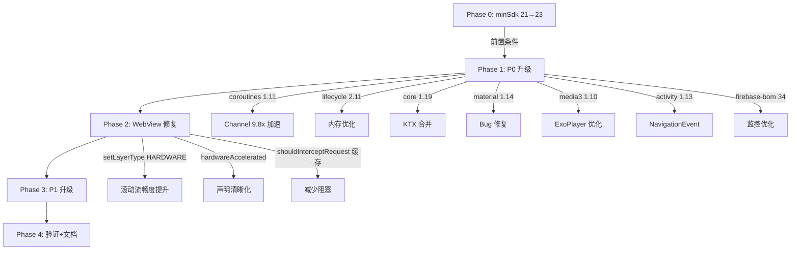

# Design: 依赖升级性能优化 + minSdk 迁移

## Technical Approach

### Phase 0: minSdk 21→23 迁移

#### 用户影响评估

| 指标 | 数据 |
|------|------|
| API 21 (Android 5.0) 用户占比 | < 0.5% |
| API 22 (Android 5.1) 用户占比 | < 0.3% |
| **受影响总用户** | **< 1%**，设备多为 2014-2015 年发布 |
| 影响性质 | 功能性，无法安装新版本 |

#### 需清理的兼容代码

| 文件 | 行号 | 代码 | 操作 |
|------|------|------|------|
| `NetworkUtils.kt` | 28 | `if (Build.VERSION.SDK_INT < 23)` 整个分支 | 移除，只保留 NetworkCapabilities 逻辑 |
| `AudioPlayActivity.kt` | 209 | `if (Build.VERSION.SDK_INT < Build.VERSION_CODES.M)` 隐藏调速按钮 | 移除条件判断，M+ 默认显示 |
| `AppDatabase.kt` | 163 | `if (Build.VERSION.SDK_INT >= Build.VERSION_CODES.M) { db.setLocale() }` | 移除 if 判断，直接调用 |
| `Request.kt` | 69 | `if (Build.VERSION.SDK_INT < Build.VERSION_CODES.M) { toSetting() }` | 移除权限降级逻辑 |
| `ViewExtensions.kt` | 489 | `Build.VERSION.SDK_INT <= Build.VERSION_CODES.M` requestLayoutBroken | 评估是否可简化 |

#### desugar 依赖保留

minSdk=23 仍需 desugaring：`Arrays.setAll`、`Stream`、`Duration` 等 Java 8 API 在 API 23 上无原生支持。**保留 desugar_jdk_libs_nio 依赖**。

### 全量依赖升级矩阵

基于 3 个并行子代理深度源码分析，整理出以下升级矩阵：

#### 🔒 锁定依赖（不可升级）

| 依赖 | 当前版本 | 锁定原因 | 使用文件数 |
|------|----------|----------|-----------|
| org.jsoup:jsoup | 1.16.2 | CSS select() 行为变更（jsoup#2017），破坏 AnalyzeByJSoup + JsoupExtensions 内部 StringUtil API | 19 |
| org.mozilla:rhino | 1.8.1 | VMBridge 反射访问私有字段，升级后部分书源 JS 执行失败 | 36 |
| cn.hutool:hutool-crypto | 5.8.22 | SymmetricCrypto/AsymmetricCrypto/Sign 子类化，书源加解密核心 | 21 |
| com.google.protobuf:protobuf-javalite | 4.26.1 | 显式锁定（libs.versions.toml 注释） | 2 |

#### ⚠️ 待验证锁定

| 依赖 | 当前版本 | 锁定原因 | minSdk→23 后状态 |
|------|----------|----------|-----------------|
| org.apache.commons:commons-text | 1.13.1 | Arrays.setAll 在 API<24 缺失 | ⚠️ desugaring 可能解决，需真机验证 |

#### ✅ P0-立即升级（低风险高收益，minSdk→23 后）

| 依赖 | 当前→目标 | 性能增益 | 升级风险 | 深度验证结论 | 影响文件数 |
|------|-----------|----------|----------|-------------|-----------|
| kotlinx-coroutines | 1.10.2→1.11.0 | Channel 9.8x 加速、SharedFlow 修复、R8 GC 修复 | ✅安全 | 零 breaking changes，项目仅用公共 API | ~100 |
| androidx.lifecycle | 2.9.4→2.11.0 | Bug 修复、内存优化、ViewModel reified 扩展 | ✅安全 | @OnLifecycleEvent 零使用；@EmptySuper 仅注解不破坏；KTX 已空壳 | ~100 |
| androidx.core-ktx | 1.17.0→1.19.0 | Bug 修复、可变字体 API | ✅安全 | KTX 空壳但 import 路径不变；bundleOf 废弃仅警告；dependencyConstraints 保兼容 | ~100 |
| com.google.firebase:firebase-bom | 33.2.0→34.12.0 | 性能监控优化 | ✅安全 | 项目已用非 KTX 模块名；零 Firebase 源码引用 | 少量 |
| com.google.android.material | 1.13.0→1.14.0 | M3 Expressive 主题（可选）、Bug 修复 | ✅安全 | 项目用 AppCompat 主题非 M3；enableEdgeToEdge 零使用；3 处 Widget.M3 样式不受影响 | 多布局 |
| androidx.media3 | 1.8.0→1.10.1 | ExoPlayer 性能优化、StuckPlayer 检测、mute/unmute 稳定版 | ✅安全(minSdk→23) | 核心 API 全兼容；未使用 DRM/Transformer/ActionFactory；DefaultHttpDataSource 仅无用 import | ~20 |
| androidx.activity | 1.11.0→1.13.0 | NavigationEvent、PiP 支持、EdgeToEdge 修复 | ⚠️需适配(minSdk→23) | OnBackPressedDispatcher 延迟初始化需测 12 处；enableEdgeToEdge 零使用；activity-ktx 已空壳 | ~50 |
| androidx.fragment | 1.8.9→1.9.0 | Predictive back 修复 | ✅安全(minSdk→23) | 变更极少；fragment-ktx 空壳；FragmentActivity 仅 2 处类型检查 | ~30 |

#### 🔶 P1-适配升级（中风险高收益）

| 依赖 | 当前→目标 | 性能增益 | 升级风险 | 风险因素 | 影响文件数 |
|------|-----------|----------|----------|----------|-----------|
| com.squareup.okhttp3:okhttp | 5.3.2→5.4.0 | 拦截器增强、性能优化 | 中 | ObsoleteUrlFactory 深度依赖 okio Pipe/Buffer；Cronet 集成 | ~34 |
| androidx.room | 2.7.1→2.7.x 最新 | AutoMigration 改进、Bug 修复 | 中 | 89 版本数据库、38 处 SupportSQLiteDatabase、fallbackToDestructiveMigrationFrom 弃用 | ~47 |
| com.github.bumptech.glide:glide | 5.0.5→5.0.x 最新 | Bug 修复、内存优化 | 中高 | 自定义 ModelLoader（3个）、自定义 BitmapTransformation（3个） | ~36 |
| androidx.appcompat | 1.7.1→1.7.x 最新 | Bug 修复 | 中 | AppCompat 是基础框架，影响面广 | 全局 |

#### ⏸️ P2-观望/阻断

| 依赖 | 当前版本 | 状态 | 原因 |
|------|----------|------|------|
| androidx.webkit | 1.14.0 | 🔴 阻断 | 1.16.0 要求 minSdk≥24，超出本次范围 |
| commons-text | 1.13.1 | ⚠️ 待验证 | desugaring 是否解决 Arrays.setAll 需真机验证 |
| io.noties.markwon | 4.6.2 | 无升级 | 4.x 稳定版，5.x 尚未发布 |
| org.nanohttpd | 2.3.1 | 无升级 | 2.3.1 是最终稳定版 |
| com.google.code.gson | 2.13.2 | 无升级 | JVM 仿真器锁定，性能非瓶颈 |

### 核心性能增益详解

#### 1. Kotlin Coroutines 1.10.2 → 1.11.0（⚡ 最高优先级）

**性能增益**：
- **Channel 实现重构**：基于学术论文新算法，RendezvousChannel 和 BufferedChannel 性能提升 **9.8x**
- **SharedFlow 修复**：修复页面重建时事件重放、订阅时序问题
- **flowOn 修复**：修复线程边界问题
- **R8 GC 修复**：优化 R8 编译后的垃圾回收行为

**深度验证**：
- 使用标准稳定 API（MainScope、launch、withContext、Semaphore、ensureActive、Job、CancellationException）
- 无实验性 API 依赖，无内部 API 反射
- 协程自定义封装 `Coroutine.kt` 仅使用公共 API
- **结论**：✅ 安全，零代码修改

#### 2. Lifecycle 2.9.4 → 2.11.0（⚡ 高优先级）

**关键验证结果**：
- `@OnLifecycleEvent`：项目零使用
- `ViewModel.onCleared` + `@EmptySuper`：9 处 override，`super.onCleared()` 调用不会报错
- `lifecycleScope`/`viewModelScope`：import 路径不变（已移至 lifecycle-common/lifecycle-viewmodel）
- `launchWhenResumed`：2 处已 deprecated（2.6.0 起），但不影响编译
- **结论**：✅ 安全，零代码修改

#### 3. Core-KTX 1.17.0 → 1.19.0

**关键验证结果**：
- `core-ktx` 1.19.0 变为空壳，所有扩展移入 `core` 主模块
- **import 路径完全不变**（`androidx.core.view.*`、`androidx.core.os.*` 等）
- `dependencyConstraints` 机制确保 core:1.19.0 自动拉升 core-ktx 到 1.19.0 空壳版
- `bundleOf` 14 文件使用，仅废弃警告不编译失败
- `BuildCompat.isAtLeastB*` 零命中
- **结论**：✅ 安全，可选将 core-ktx 替换为 core-core

#### 4. Material 1.13.0 → 1.14.0

**关键验证结果**：
- 项目使用 `Theme.AppCompat.DayNight.NoActionBar`，**未使用** Material3 主题
- M3 Expressive 仅在显式设置 `Theme.Material3.Expressive` 时生效
- `enableEdgeToEdge` 零命中
- 仅 3 处 `Widget.Material3.*` 样式引用，仍有效
- BottomSheet enableEdgeToEdge 废弃不影响项目
- **结论**：✅ 安全，需 minSdk≥23

#### 5. Media3 1.8.0 → 1.10.1

**关键验证结果**：
- 核心 API（ExoPlayer.Builder、Player.Listener、seekTo、MediaItem、CacheDataSource）全兼容
- 项目未使用 DRM、Transformer、ChannelMixingMatrix、ActionFactory
- `DefaultHttpDataSource` 在 Exo2MediaPlayer.kt 中仅 import 未使用，删除即可
- compileSdk 36 要求已满足
- **结论**：✅ 安全，需 minSdk≥23

#### 6. Activity 1.11.0 → 1.13.0

**关键验证结果**：
- `OnBackPressedDispatcher` 延迟初始化：12 处使用需回归测试，但不能在 `super.onCreate()` 之前访问
- `enableEdgeToEdge` 零命中
- `activity-ktx` 已在 1.9.0 变为空壳
- 新增 `NavigationEvent` 传递依赖
- **结论**：⚠️ 需适配，回归测试 OnBackPressedDispatcher 12 处

#### 7. Firebase BOM 33.2.0 → 34.12.0

**关键验证结果**：
- BOM 34 移除所有 -ktx 模块
- 项目已使用非 KTX 模块名（`firebase-analytics`、`firebase-perf`）
- 源码中零 `import com.google.firebase.*`
- **结论**：✅ 安全，仅改版本号

### WebView 性能优化方案（代码层）

> 用户反馈 WebView 卡顿，经深度源码分析，卡顿根因是代码配置问题而非依赖版本。

| 优化方案 | 风险 | 收益 | 决策 |
|----------|------|------|------|
| 前台 WebView 设置 `setLayerType(HARDWARE)` | 🟡 中 | 🔴 高（滚动/动画流畅度） | ✅ 实施，仅对前台 WebView |
| WebViewActivity 显式声明 `hardwareAccelerated` | 🟢 低 | 🟢 低（已默认启用） | ✅ 实施，声明清晰化 |
| 移除 `runBlocking` | 🔴 高 | 🟡 中 | ❌ 不可移除（API 限制） |
| VisibleWebView 改正常 visibility | 🔴 极高 | 🟢 无 | ❌ 绝对不能修改（BackstageWebView 完全依赖） |
| shouldInterceptRequest 结果缓存 | 🟢 低 | 🟡 中 | ✅ 实施 |

## Architecture Decisions

### AD-01: 采用分层渐进升级而非全量升级

- **Context**: 项目有 74+ 依赖，4 项硬锁定，部分依赖使用内部 API
- **Decision**: 按 P0/P1/P2 三层分优先级升级，每层独立验证
- **Tradeoff**: P2 项目的性能收益会延后获得
- **Status**: Accepted

### AD-02: 不触碰已锁定的 4 项依赖

- **Context**: jsoup/rhino/hutool/protobuf 已有明确的技术原因锁定
- **Decision**: 本次升级完全排除这 4 项依赖
- **Tradeoff**: 这些依赖的性能改进和安全补丁无法获得
- **Status**: Accepted

### AD-03: minSdk 提升至 23

- **Context**: AndroidX 生态自 2025 年底起统一 minSdk=23；activity 1.12+/fragment 1.9+/media3 1.9+/material 1.14+ 均要求 minSdk≥23
- **Decision**: 将 minSdk 从 21 提升至 23
- **Tradeoff**: 影响 <1% 用户（API 21-22 设备），但解锁 7 组 AndroidX 依赖升级
- **Status**: Accepted（用户已确认）

### AD-04: webkit 保持 1.14.0（不升级到 1.16.0）

- **Context**: webkit 1.16.0 要求 minSdk≥24，超出本次 minSdk=23 的范围
- **Decision**: webkit 保持 1.14.0，后续单独评估是否提升至 minSdk=24
- **Tradeoff**: 无法获得 webkit 1.16.0 的 startUpWebView 稳定版和 Web 性能指标 API
- **Status**: Accepted

### AD-05: Coroutines 1.11.0 作为 P0 最高优先级

- **Context**: Channel 9.8x 性能提升是所有依赖中最大的单一性能增益
- **Decision**: 将 coroutines 升级作为第一个执行项
- **Tradeoff**: 如果有未发现的兼容性问题需要单独回滚
- **Status**: Accepted

### AD-06: OkHttp 升级前需专项验证 ObsoleteUrlFactory

- **Context**: ObsoleteUrlFactory 深度依赖 okio 内部 Pipe/Buffer
- **Decision**: OkHttp 升级前需单独验证 ObsoleteUrlFactory 在 5.4.0 下的正确性
- **Status**: Proposed

### AD-07: Room 升级限于补丁版本，不升级到 2.8.x

- **Context**: Room 2.8.x 引入 KMP 支持和 Kotlin 代码生成；`room.generateKotlin="false"` 表明对 Java 生成代码有依赖
- **Decision**: Room 仅升级到 2.7.x 最新补丁，不升级到 2.8.x
- **Tradeoff**: 无法获得 Kotlin 代码生成和 KMP 支持
- **Status**: Proposed

### AD-08: WebView 硬件加速层仅对前台消费者设置

- **Context**: WebViewPool 创建的 WebView 默认 LAYER_TYPE_NONE
- **Decision**: 在 5 个前台消费者获取 WebView 后设置 `setLayerType(HARDWARE)`，池中和 BackstageWebView 保持默认
- **Tradeoff**: 需要在 5 个消费者处添加 setLayerType 调用
- **Status**: Proposed

### AD-09: VisibleWebView 的 VISIBLE 覆写不可修改

- **Context**: 修改会导致 BackstageWebView 完全失效
- **Decision**: 保持现有行为不变
- **Status**: Accepted

### AD-10: shouldInterceptRequest 的 runBlocking 不可移除

- **Context**: WebView 的 shouldInterceptRequest 是同步 API
- **Decision**: 保持 runBlocking 不变，通过结果缓存减少重复请求
- **Status**: Accepted

### AD-11: desugar 依赖保留

- **Context**: API 23 仍缺少 Arrays.setAll/Stream/Duration 等 Java 8 API 的原生支持
- **Decision**: 保留 desugar_jdk_libs_nio 依赖
- **Tradeoff**: APK 体积略增（~100KB），但保证 Java 8 API 在 API 23 上正确运行
- **Status**: Accepted

### AD-12: KTX 空壳依赖处理策略

- **Context**: core-ktx 1.19、activity-ktx 1.9+、fragment-ktx 1.9+ 均已变为空壳
- **Decision**: 保留现有 KTX 依赖声明（不替换为主模块），因为空壳通过 dependencyConstraints 自动拉升，替换反而增加变更风险
- **Tradeoff**: 多保留几个空壳依赖（不增加 APK 体积），但避免修改 build.gradle 依赖声明
- **Status**: Proposed

## File Changes

| 文件 | 变更类型 | 说明 |
|------|----------|------|
| `app/build.gradle` | 修改 | minSdk 21→23 |
| `gradle/libs.versions.toml` | 修改 | 更新 8 个依赖版本号（coroutines/lifecycle/core/activity/fragment/material/media3/firebaseBom）+ 移除 webkit GradleDependency 注释 |
| `app/src/main/java/io/legado/app/utils/NetworkUtils.kt` | 修改 | 移除 API<23 兼容分支 |
| `app/src/main/java/io/legado/app/ui/audio/AudioPlayActivity.kt` | 修改 | 移除 API<M 调速按钮隐藏 |
| `app/src/main/java/io/legado/app/data/AppDatabase.kt` | 修改 | 移除 setLocale 版本保护 |
| `app/src/main/java/io/legado/app/model/analyzeRule/Request.kt` | 修改 | 移除权限降级逻辑 |
| `app/src/main/AndroidManifest.xml` | 修改 | WebViewActivity 添加 hardwareAccelerated="true" |
| `app/src/main/java/io/legado/app/ui/browser/WebViewActivity.kt` | 修改 | acquire 后设置 setLayerType(HARDWARE) |
| `app/src/main/java/io/legado/app/ui/widget/dialog/BottomWebViewDialog.kt` | 修改 | acquire 后设置 setLayerType(HARDWARE) + shouldInterceptRequest 缓存 |
| `app/src/main/java/io/legado/app/ui/rss/read/ReadRssActivity.kt` | 修改 | acquire 后设置 setLayerType(HARDWARE) + shouldInterceptRequest 缓存 |
| `app/src/main/java/io/legado/app/ui/book/info/BookInfoActivity.kt` | 修改 | acquire 后设置 setLayerType(HARDWARE) |
| `app/src/main/java/io/legado/app/ui/login/WebViewLoginFragment.kt` | 修改 | acquire 后设置 setLayerType(HARDWARE) |
| `app/src/main/java/io/legado/app/help/gsyVideo/Exo2MediaPlayer.kt` | 修改 | 删除未使用的 DefaultHttpDataSource import |
| `app/src/main/assets/updateLog.md` | 修改 | 记录用户可感知的优化 |
| `docs/project-flow/quick-reference.md` | 修改 | 更新版本锁定速查表 |
| `docs/project-flow/architecture/overview.md` | 修改 | 更新关键版本锁定 |
