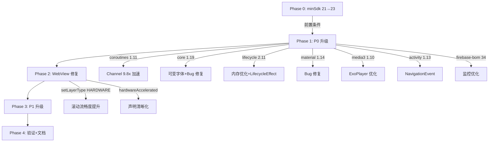

# Design: 依赖升级性能优化 + minSdk 迁移

## Technical Approach

### Phase 0: minSdk 21→23 迁移

#### 用户影响评估

| 指标 | 数据 |
|------|------|
| API 21 (Android 5.0) 用户占比 | < 0.5% |
| API 22 (Android 5.1) 用户占比 | < 0.3% |
| **受影响总用户** | **< 1%**，设备多为 2014-2015 年发布 |
| 影响性质 | 功能性，无法安装新版本 |

#### 需清理的兼容代码

| 文件 | 行号 | 代码 | 操作 |
|------|------|------|------|
| `NetworkUtils.kt` | 28 | `if (Build.VERSION.SDK_INT < 23)` 整个分支 | 移除，只保留 NetworkCapabilities 逻辑 |
| `AudioPlayActivity.kt` | 210 | `if (Build.VERSION.SDK_INT < Build.VERSION_CODES.M)` 隐藏调速按钮 | 移除条件判断，M+ 默认显示 |
| `AppDatabase.kt` | 163 | `if (Build.VERSION.SDK_INT >= Build.VERSION_CODES.M) { db.setLocale() }` | 移除 if 判断，直接调用 |
| `Request.kt` | 69 | `if (Build.VERSION.SDK_INT < Build.VERSION_CODES.M) { toSetting() }` | 移除权限降级逻辑 |
| `ViewExtensions.kt` | 489 | `Build.VERSION.SDK_INT <= Build.VERSION_CODES.M` requestLayoutBroken | 简化为 `== M`（API 23 仍有 bug，不可删除；O..Q 条件独立保留） |
| `WebViewPool.kt` | 84 | `if (Build.VERSION.SDK_INT >= Build.VERSION_CODES.M) setOnScrollChangeListener(null)` | 移除守卫，直接调用（setOnScrollChangeListener 从 API 23 加入） |
| `BottomWebViewDialog.kt` | 348,433 | `if (Build.VERSION.SDK_INT >= Build.VERSION_CODES.M)` | 移除守卫，直接调用 |
| `SystemUtils.kt` | 19 | `if (Build.VERSION.SDK_INT < Build.VERSION_CODES.M) return` | 移除 early return |

#### desugar 依赖保留

minSdk=23 仍需 desugaring：`Stream`、`Duration`、`java.time` 等 Java 8 API 在 API 23 上无原生支持。**保留 desugar_jdk_libs_nio 依赖**。

⚠️ **关键发现**：desugaring **不覆盖** `Arrays.setAll`/`parallelSetAll`（仅覆盖 `spliterator`/`stream`），也不覆盖 `VarHandle`/`MethodHandle`。这意味着 commons-text 和 rhino 的锁定无法通过 desugaring 解除。

### 全量依赖升级矩阵

基于 6+4 个并行子代理深度源码分析 + 多轮交叉审查，整理出以下升级矩阵：

#### 🔒 硬锁定依赖（绝对不可升级）

| 依赖 | 当前版本 | 锁定原因 | 使用文件数 |
|------|----------|----------|-----------|
| org.jsoup:jsoup | 1.16.2 | CSS select() 行为变更（jsoup#2017），破坏 AnalyzeByJSoup + JsoupExtensions 内部 StringUtil API | 19 |
| org.mozilla:rhino | 1.8.1 | 新版本使用了 API 33 以下不可用的 VarHandle 类（desugaring 不覆盖 java.lang.invoke） | 36 |
| cn.hutool:hutool-crypto | 5.8.22 | SymmetricCrypto/AsymmetricCrypto/Sign 子类化，书源加解密核心 | 21 |
| org.apache.commons:commons-text | 1.13.1 | 新版本使用了 API 24 以下不可用的 Arrays.setAll 方法（desugaring 不覆盖此 API，即使 minSdk=23） | 少量 |
| com.google.protobuf:protobuf-javalite | 4.26.1 | 显式锁定 | 2 |

> **注**：rhino 和 commons-text 的原锁定注释不准确（分别写了"Android 8 以下"和"Android 6 以下"），实际应为"API 33 以下"和"API 24 以下"。需修正 libs.versions.toml 注释。

#### ✅ P0-立即升级（有稳定版 + 低风险 + 高收益）

| 依赖 | 当前→目标 | 性能增益 | 升级风险 | 深度验证结论 | 影响文件数 |
|------|-----------|----------|----------|-------------|-----------|
| kotlinx-coroutines | 1.10.2→1.11.0 | Channel 9.8x 加速、SharedFlow 修复、R8 GC 修复 | ✅安全 | 零 breaking changes，项目仅用公共 API | ~100 |
| androidx.core | 1.17.0→1.19.0 | 可变字体 API、Bug 修复、性能改进 | ✅安全 | 1.19.0 已是稳定版（二次审查确认）；core-ktx 变空壳（扩展函数已移入 core 主模块），保留依赖声明即可 | ~100 |
| androidx.lifecycle | 2.9.4→2.11.0 | 内存优化、LifecycleEffect、SavedStateHandle 改进 | ✅安全 | 2.11.0 已是稳定版（二次审查确认）；项目仅用 lifecycle-common-java8 + lifecycle-service | ~50 |
| com.google.firebase:firebase-bom | 33.2.0→34.12.0 | 性能监控优化 | ✅安全 | 项目已用非 KTX 模块名；零 Firebase 源码引用 | 少量 |
| com.google.android.material | 1.13.0→1.14.0 | M3 Expressive（可选）、Bug 修复 | ✅安全(minSdk→23) | AppCompat 主题不受影响；enableEdgeToEdge 零使用；已进入维护模式 | 多布局 |
| androidx.media3 | 1.8.0→1.10.1 | ExoPlayer 优化、StuckPlayer 检测、mute/unmute 稳定版 | ✅安全(minSdk→23) | 核心 API 全兼容；未用 DRM/Transformer/ActionFactory；⚠️ 需验证 gsyVideoPlayer 兼容性 | ~20 |
| androidx.activity | 1.11.0→1.13.0 | NavigationEvent、PiP、EdgeToEdge 修复 | ✅安全(minSdk→23) | OnBackPressedDispatcher 12 处全部在 super.onCreate() 后调用，零 NPE 风险 | ~50 |

#### ⏸️ P0-保持不变

| 依赖 | 当前版本 | 不可升级原因 |
|------|----------|-------------|
| androidx.fragment | 1.8.9 | 1.9.0 仅有 alpha 版，当前即为最新稳定版 |

#### 🔶 P1-适配升级（中风险高收益）

| 依赖 | 当前→目标 | 性能增益 | 升级风险 | 风险因素 | 影响文件数 |
|------|-----------|----------|----------|----------|-----------|
| com.squareup.okhttp3:okhttp | 5.3.2→5.4.0 | 拦截器增强、HTTP/2 头大小限制修复、性能优化 | 🟡需运行时验证 | ObsoleteUrlFactory 使用 okio 公共 API（非 internal），编译兼容但需运行时验证 | ~34 |

#### ⏸️ 保持不变（无升级需求或风险不可控）

| 依赖 | 当前版本 | 状态 | 原因 |
|------|----------|------|------|
| androidx.appcompat | 1.7.1 | ✅ 已最新 | 1.7.1 是 1.7.x 最新稳定版 |
| androidx.room | 2.7.1 | ⏸️ 保持 | 2.7.2 不存在；2.8.4 有 KMP 架构变更风险，需单独评估 |
| com.github.bumptech.glide:glide | 5.0.5 | ✅ 已最新 | 5.0.5 即为 5.0.x 最新版 |
| io.noties.markwon | 4.6.2 | 无升级 | 4.x 稳定版 |
| org.nanohttpd | 2.3.1 | 无升级 | 最终稳定版 |

#### 🔴 P2-观望/阻断/延后

| 依赖 | 当前版本 | 状态 | 原因 |
|------|----------|------|------|
| androidx.webkit | 1.14.0 | 🔴 阻断 | 1.16.0 要求 minSdk≥24 |
| androidx.fragment | 1.8.9 | ⏸️ 观望 | 1.9.0 仅有 alpha |
| shouldInterceptRequest 缓存 | N/A | 🟡 延后 | 风险过高（过滤绕过、缓存一致性、线程阻塞） |
| commons-text 1.13.1 | 1.13.1 | 🔴 硬锁定 | 需 minSdk≥24，desugaring 不覆盖 Arrays.setAll |
| Room 2.8.x | 2.7.1 | ⏸️ 观望 | KMP 架构变更，需单独评估 |

### 核心性能增益详解

#### 1. Kotlin Coroutines 1.10.2 → 1.11.0（⚡ 最高优先级）

- Channel 9.8x 加速、SharedFlow 修复、R8 GC 修复
- 零代码修改，仅改版本号
- **深度验证**：零 breaking changes，项目仅用公共 API

#### 2. Core 1.17.0 → 1.19.0

- 可变字体 API、Bug 修复、性能改进
- **深度验证**：1.19.0 已是稳定版（二次审查确认）；core-ktx 变空壳但保留依赖声明保证兼容性
- **注意**：core-ktx 中的扩展函数已移入 core 主模块，但依赖声明仍需保留（空壳传递依赖兼容性）

#### 3. Lifecycle 2.9.4 → 2.11.0

- 内存优化、LifecycleEffect、SavedStateHandle 改进
- **深度验证**：2.11.0 已是稳定版（二次审查确认，经历了完整 alpha→beta→rc→stable 流程）
- 项目仅用 lifecycle-common-java8 + lifecycle-service，影响面有限

#### 4. Activity 1.11.0 → 1.13.0

- NavigationEvent、PiP 支持、EdgeToEdge 修复
- **深度验证**：12 处 OnBackPressedDispatcher 全部在 `super.onCreate()` 后调用，零 NPE 风险
- 项目架构天然规避延迟初始化问题（BaseActivity.onCreate 模式）

#### 5. Material 1.13.0 → 1.14.0

- Bug 修复、M3 Expressive（可选）
- **深度验证**：AppCompat 主题不受影响；enableEdgeToEdge 零使用
- **传递依赖**：要求 core≥1.18（间接通过 activity 1.13）、appcompat≥1.7.1，均满足

#### 6. Media3 1.8.0 → 1.10.1

- ExoPlayer 优化、StuckPlayer 检测
- **深度验证**：核心 API 全兼容；DefaultHttpDataSource 仅无用 import 可删除
- **⚠️ gsyVideoPlayer 兼容性**：gsyVideoPlayer 11.3.0 的 exo2 适配层可能不兼容 media3 1.10.x，需运行时验证

#### 7. Firebase BOM 33.2.0 → 34.12.0

- 性能监控优化
- **深度验证**：项目已用非 KTX 模块名，零源码引用 Firebase

### WebView 性能优化方案（代码层）

| 优化方案 | 风险 | 收益 | 决策 |
|----------|------|------|------|
| 前台 WebView 设置 `setLayerType(HARDWARE)` | 🟡 中 | 🔴 高 | ✅ 实施，仅对前台 WebView（含 VideoPlayerActivity） |
| WebViewActivity 显式声明 `hardwareAccelerated` | 🟢 低 | 🟢 低 | ✅ 实施 |
| 移除 `runBlocking` | 🔴 高 | 🟡 中 | ❌ 不可移除（同步 API 限制） |
| VisibleWebView 改正常 visibility | 🔴 极高 | 🟢 无 | ❌ 绝对不能修改（BackstageWebView 依赖） |
| shouldInterceptRequest 结果缓存 | 🔴 高 | 🟡 中 | ❌ 降为 P2（过滤绕过/缓存一致性/线程阻塞风险） |

#### setLayerType 实施注意事项

- 在 `WebViewPool.preInitWebView()` 中设置 `LAYER_TYPE_HARDWARE`
- 在 `WebViewPool.release()` 中重置为 `LAYER_TYPE_HARDWARE`（保持池中 WebView layerType 一致）
- **不设置** BackstageWebView（后台不需要 GPU 渲染）
- 低端设备 GPU 内存压力需关注

## Architecture Decisions

### AD-01: 采用分层渐进升级

- **Decision**: 按 P0/P1/P2 三层分优先级升级
- **Status**: Accepted

### AD-02: 不触碰已锁定的 5 项依赖

- **Context**: jsoup/rhino/hutool/commons-text/protobuf
- **Decision**: 完全排除
- **Status**: Accepted

### AD-03: minSdk 提升至 23

- **Context**: AndroidX 生态统一 minSdk=23；activity 1.12+/media3 1.9+/material 1.14+ 均要求 minSdk≥23
- **Tradeoff**: 影响 <1% 用户，解锁 7 组 AndroidX 依赖升级
- **Status**: Accepted（用户已确认）

### AD-04: webkit 保持 1.14.0

- **Context**: webkit 1.16.0 要求 minSdk≥24
- **Status**: Accepted

### AD-05: Coroutines 1.11.0 作为 P0 最高优先级

- **Context**: Channel 9.8x 是最大单一性能增益
- **Status**: Accepted

### AD-06: lifecycle 升级到 2.11.0（修正）

- **Context**: 二次审查确认 2.11.0 已是稳定版（非 beta），经历了完整 alpha→beta→rc→stable 流程
- **Decision**: 升级 lifecycle 2.9.4 → 2.11.0
- **Tradeoff**: 获得内存优化+LifecycleEffect+SavedStateHandle 改进
- **Status**: Accepted（二次审查修正）

### AD-07: core 升级到 1.19.0（修正）

- **Context**: 二次审查确认 1.19.0 已是稳定版（非 alpha）；core-ktx 变空壳（扩展函数已移入 core 主模块）
- **Decision**: 升级 core 1.17.0 → 1.19.0，保留 core-ktx 依赖声明
- **Tradeoff**: 获得可变字体 API 和 bug 修复；需接受 core-ktx 空壳（无需代码修改）
- **Status**: Accepted（二次审查修正）

### AD-08: commons-text 确认硬锁定

- **Context**: Arrays.setAll 需 API 24+ 原生支持，desugaring 不覆盖此 API，即使 minSdk=23 也无法升级
- **Decision**: commons-text 保持 1.13.1 并修正注释
- **Status**: Accepted

### AD-09: OkHttp 升级需运行时验证 ObsoleteUrlFactory

- **Context**: ObsoleteUrlFactory 使用 okio 公共 API（非 internal），编译层面兼容
- **Decision**: P1 层升级，编译后运行 ObsoleteUrlFactory.main() 验证
- **Status**: Accepted

### AD-10: Room 保持 2.7.1（修正）

- **Context**: 2.7.2 不存在；2.8.4 有 KMP 架构变更和 minSdk=23 要求，风险不可控
- **Decision**: Room 保持 2.7.1，2.8.x 后续单独评估
- **Status**: Accepted（二次审查修正）

### AD-11: WebView 硬件加速层仅对前台消费者设置

- **Context**: 含 VideoPlayerActivity（遗漏补充）
- **Status**: Accepted

### AD-12: VisibleWebView/runBlocking 不可修改

- **Status**: Accepted

### AD-13: desugar 依赖保留

- **Context**: API 23 仍需 desugaring；且 desugaring 不覆盖 Arrays.setAll/VarHandle
- **Status**: Accepted

### AD-14: core-ktx 1.19.0 空壳处理

- **Context**: core 1.19.0 中扩展函数已移入 core 主模块，core-ktx 变为空壳
- **Decision**: 保留 core-ktx 依赖声明（保证传递依赖兼容性），无需代码修改
- **Status**: Accepted（二次审查新增）

### AD-15: rhino/commons-text 锁定注释修正

- **Context**: 原注释不准确
- **Decision**: rhino 改为"API 33 以下不可用"，commons-text 改为"API 24 以下不可用，desugaring 不覆盖"
- **Status**: Accepted

### AD-16: shouldInterceptRequest 缓存降为 P2

- **Context**: 风险过高——可能绕过黑名单/白名单过滤、缓存一致性问题、runBlocking 线程上缓存 I/O 进一步阻塞、JS 注入内容变更时缓存过期
- **Decision**: 从 Phase 2 移出，降为 P2 延后
- **Status**: Accepted（二次审查新增）

### AD-17: requestLayoutBroken 简化规则

- **Context**: `<=M` 不可删除（API 23 仍有此 bug），只能改为 `==M`；`O..Q` 条件与 minSdk 无关
- **Decision**: 将 `Build.VERSION.SDK_INT <= Build.VERSION_CODES.M` 改为 `Build.VERSION.SDK_INT == Build.VERSION_CODES.M`，保留 `O..Q` 条件不变
- **Status**: Accepted（二次审查新增）

## File Changes

| 文件 | 变更类型 | 说明 |
|------|----------|------|
| `app/build.gradle` | 修改 | minSdk 21→23 |
| `gradle/libs.versions.toml` | 修改 | 更新 8 个依赖版本号（coroutines/core/activity/material/media3/firebaseBom/lifecycle）+ 移除 #noinspection 注释 + 修正 rhino/commons-text 注释 |
| `app/src/main/java/io/legado/app/utils/NetworkUtils.kt` | 修改 | 移除 API<23 兼容分支 |
| `app/src/main/java/io/legado/app/ui/book/audio/AudioPlayActivity.kt` | 修改 | 移除 API<M 调速按钮隐藏 |
| `app/src/main/java/io/legado/app/data/AppDatabase.kt` | 修改 | 移除 setLocale 版本保护 |
| `app/src/main/java/io/legado/app/lib/permission/Request.kt` | 修改 | 移除权限降级逻辑（实际路径为 lib.permission） |
| `app/src/main/java/io/legado/app/utils/ViewExtensions.kt` | 修改 | requestLayoutBroken `<=M` 简化为 `==M` |
| `app/src/main/java/io/legado/app/help/webView/WebViewPool.kt` | 修改 | 移除 `>=M` 守卫 + preInit 中设置 setLayerType(HARDWARE) + release 中重置 |
| `app/src/main/java/io/legado/app/ui/widget/dialog/BottomWebViewDialog.kt` | 修改 | 移除 `>=M` 守卫 + acquire 后设置 setLayerType(HARDWARE) |
| `app/src/main/java/io/legado/app/utils/SystemUtils.kt` | 修改 | 移除 API<M early return |
| `app/src/main/AndroidManifest.xml` | 修改 | WebViewActivity 添加 hardwareAccelerated="true" |
| `app/src/main/java/io/legado/app/ui/browser/WebViewActivity.kt` | 修改 | acquire 后设置 setLayerType(HARDWARE) |
| `app/src/main/java/io/legado/app/ui/rss/read/ReadRssActivity.kt` | 修改 | acquire 后设置 setLayerType(HARDWARE) |
| `app/src/main/java/io/legado/app/ui/book/info/BookInfoActivity.kt` | 修改 | acquire 后设置 setLayerType(HARDWARE) |
| `app/src/main/java/io/legado/app/ui/login/WebViewLoginFragment.kt` | 修改 | acquire 后设置 setLayerType(HARDWARE) |
| `app/src/main/java/io/legado/app/ui/book/read/VideoPlayerActivity.kt` | 修改 | acquire 后设置 setLayerType(HARDWARE)（遗漏补充） |
| `app/src/main/java/io/legado/app/help/gsyVideo/Exo2MediaPlayer.kt` | 修改 | 删除未使用的 DefaultHttpDataSource import |
| `app/src/main/assets/updateLog.md` | 修改 | 记录用户可感知的优化 |
| `docs/project-flow/quick-reference.md` | 修改 | 更新版本锁定速查表 |
| `docs/project-flow/architecture/overview.md` | 修改 | 更新关键版本锁定 |
