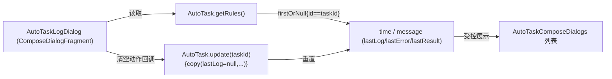
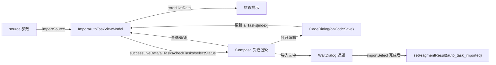
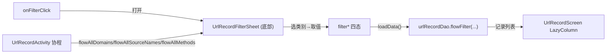

# design.md — 弹框遗留项 Compose 化：autoTask / urlrecord 旧 View 弹框迁移

## Technical Approach

三项卫生弹框迁移统一采用「**ComposeDialogFragment + 复用组件族 + 按复杂度分级**」策略：

1. **基类接入**：三个弹框均改继承 `ComposeDialogFragment`（`dialogTheme=Theme_Legado_ComposeDialog_Center`、`STYLE_NO_TITLE`、可覆写 `dialogSize` / `dialogGravity` / `dialogWindowAnimations`，自动获得墨水屏支持）。
2. **组件复用**：内容一律用 `AppDialogFrame(title,message,scrollContent,content,actions)` + `rememberAppDialogStyle()`（内容块 ≤ 520.dp + imePadding）；纯单选 / 取值场景用 `ComposeChoiceListDialog`；`CodeDialog` / `WaitDialog` 保留原样复用。
3. **复杂度分级**：
   - 低：`AutoTaskLogDialog` — 无状态薄壳，纯展示 + 清空动作。
   - 中高：`ImportAutoTaskDialog` — 保留 `ImportAutoTaskViewModel` 绑定，Compose 仅做受控渲染。
   - 中：urlrecord 详情弹框（`AlertDialog` + 复制回调）与过滤弹框（单套底部选择弹框收敛 6 级 selector）。
4. **迁移顺序**：先日志（验证基类接入路径）→ 再 urlrecord 详情与过滤（验证 DAO→Compose 复流）→ 最后 import（最复杂）。每步独立编译 `assembleAppDebug`。

### 迁移映射表（现状 vs 迁移目标）

| 维度 | AutoTaskLogDialog | ImportAutoTaskDialog | urlrecord 详情 | urlrecord 过滤 |
|------|------------------|---------------------|----------------|----------------|
| 基类 | `BaseDialogFragment`→`ComposeDialogFragment` | `BaseDialogFragment`→`ComposeDialogFragment` | Activity `alert`→Compose | Activity `selector`→Compose |
| 状态源 | 无（`AutoTask.getRules()` 直读） | `ImportAutoTaskViewModel`（保留） | `UrlRecordDisplayItem` 参数 | `filter*` 四态 + DAO flow |
| 工具栏 | `Toolbar` 标题 + `R.menu.app_log`（清空） | `Toolbar` + rotateLoading | — | — |
| 列表 | `RecyclerAdapter<Triple<...>>` 单条 | `SourcesAdapter`（勾选/状态/打开） | — | 分类列表 |
| 尺寸 | `0.9f,WRAP_CONTENT` | `MATCH_PARENT,WRAP_CONTENT` | 常规 | 底部弹框（Gravity.BOTTOM） |

## Architecture Decisions

### AD-01: 日志弹框与导入弹框采用「差异化 state 提升」——薄壳 vs ViewModel 受控渲染

- **Context**: `AutoTaskLogDialog` 无回调、无数据写回，仅读 `AutoTask.getRules()` 展示单条并清空；`ImportAutoTaskDialog` 绑定 `ImportAutoTaskViewModel`，承载解析 / 比对 / upsert 与勾选全选业务。
- **Concern**: 若两者都「推平」到 Compose 状态，import 的复杂业务与配置变更保真性将很难处理；反之若都保留 Fragment 多层回调，则 Compose 化不彻底。
- **Decision**: 差异化处理——日志弹框迁为**无状态薄壳**（`AutoTaskComposeDialogs` 内纯 Compose，状态即参数，清空动作经回调到 Fragment 调 `AutoTask.update`）；导入弹框**保留 ViewModel**，`errorLiveData` / `successLiveData` 与 `allTasks` / `checkTasks` / `selectStatus` 经组合进 Compose 做受控渲染，事件（导入成功 / 打开编辑 / 全选）由 Compose 回调回 Fragment / ViewModel 驱动。
- **Goal**: 各按其复杂度选择 state 提升边界——日志零状态开销，import 复用已验证业务逻辑且配置变更保真。
- **Tradeoff**: import 侧 ViewModel 的 LiveData 与 Compose 仍需桥接（一次性事件要去重），增加少量桥接代码；换取业务逻辑零改动、状态跨配置保真。
- **Status**: Proposed

### AD-02: urlrecord 过滤弹框由 6 级嵌套 selector 收敛为单套 Compose 底部选择弹框（两级合一）

- **Context**: `showFilterDialog()` 现状为「外层类别 selector + 内嵌 4 个值 selector」，共 6 级嵌套；整体收敛进 `ComposeDialogFragment` 底座且组件库有 `ComposeChoiceListDialog` 可用。
- **Concern**: 直接逐层换皮会保留割裂交互；而收敛改动又是交互变化，需防用户取清。
- **Decision**: 新建 `UrlRecordFilterSheet`（`ComposeDialogFragment` + `dialogGravity=BOTTOM`），单弹框内两级切换——先出类别列表（域名 / 来源 / 方法 / 状态 / 清除过滤），选类别后出该类别值列表；DAO 值列表（`flowAllDomains` / `flowAllSourceNames` / `flowAllMethods`）仍在 Activity 协程取，选值后写 `filter*` 并触发 `loadData()`。
- **Goal**: 单套弹框承载四维过滤，交互连续、外观一致，同时需求（FR-5 / FR-6）语义完整保留。
- **Tradeoff**: 从「逐层」改「单弹框切换」是交互变化，需真机确认；换取消除 6 级嵌套的割裂体验并全部 Compose 化。
- **Status**: Proposed
- **Superseded-by**: 无（若真机反馈两级切换不直觉，退回逐层 selector 作为后续 supersede 候选）。

### AD-03: CodeDialog 与 WaitDialog 保留原样复用，不纳入本 spec 迁移

- **Context**: `ImportAutoTaskDialog` 内部用 `CodeDialog`（单条任务 JSON 编辑，`showDialogFragment(CodeDialog(GSON.toJson(task), disableEdit=false, requestId))`）与 `WaitDialog`（导入等待遮罩）自复用；两者均不是本 spec 的三个迁移目标，但被 import 弹框直接依赖。
- **Concern**: 若一并重写，本 spec 爆炸面扩大；若拒绝依赖则 import 迁移被阻塞。
- **Decision**: `CodeDialog` / `WaitDialog` 维持原样，import 弹框继续按 `onCodeSave(code, requestId)` 回调与 `WaitDialog(requireContext()).show()` 逻辑复用；迁移后 import 弹框对这些子弹框的调用方式保持不变。
- **Goal**: 收敛本 spec 边界，只迁移三个目标弹框本身。
- **Tradeoff**: `WaitDialog` 仍是 View 弹框（与整体 Compose 目标并存），属已知边界，留待后续专项；换取本 spec 聚焦可控。
- **Status**: Proposed

### AD-04: 保留 `dialog_recycler_view` 布局，仅替换代码宿主

- **Context**: `AutoTaskLogDialog` / `ImportAutoTaskDialog` 迁移后不再 `BaseDialogFragment(R.layout.dialog_recycler_view)`；但该布局仍被约 8 个其它 View 弹框复用（`EffectiveReplacesDialog` / `ChangeRssArticleSourceDialog` / `AppLogDialog` / `ReadRecordDialog` / `ServersDialog` / `CrashLogsDialog` / `IconListPreference` / `KeyboardAssistsConfig`）。
- **Concern**: 若按「迁移即删布局」思路删除，会大面积破坏其余 View 弹框绑定。
- **Decision**: 本次只替换两个 autoTask 弹框的宿主代码为 Compose，`dialog_recycler_view` 布局**保留不动**；全新组件放 `AutoTaskComposeDialogs.kt` / `UrlRecordFilterSheet.kt`，不新建 XML。
- **Goal**: 消除 autoTask / urlrecord 的三处 View 弹框残留，同时零误伤其它复用者。
- **Tradeoff**: 资源中存在难以避免的 View 布局（供其它弹框用）；属已知边界。
- **Status**: Proposed

### AD-05: 迁移登记与任务清单对齐（migration-registry + tasks + updateLog）

- **Context**: `docs/project-flow/ui-standards/migration-registry.md` 当前将 7.11an / 7.11an2 标为「未完成 / 部分完成」，需随三项弹框落地回填真实状态。
- **Concern**: 规格文档与源代码不同步会导致收尾判断失真（历史上已出现 tasks 勾选超前 / 滞后）。
- **Decision**: 目标弹框迁移完成且编译通过后，按源码实测回填 migration-registry E1 表（7.11an / 7.11an2 行），同步本 spec README 状态由「🔄 设计中」翻「✅ 已完成」，并更新 `docs/INDEX.md` 索引与 `updateLog`。
- **Goal**: 使规格 / 登记 / tasks / updateLog 四者与源码一致。
- **Tradeoff**: 文档维护成本；换取收尾可追溯、防再次出现勾选偏差。
- **Status**: Proposed

## Data Flow

### AutoTaskLogDialog（无状态薄壳）

### ImportAutoTaskDialog（ViewModel 受控渲染）

### urlrecord 过滤（DAO → Compose）

数据回流统一经 Activity 的 `loadData()`（`withContext(IO)` 查询 + 组装 `UrlRecordDisplayItem`）刷新 Compose 列表，过滤状态字段语义与现状一致。

## File Changes

| 文件 | 变更类型 | 说明 |
|------|---------|------|
| `app/src/main/java/io/legado/app/ui/autoTask/AutoTaskLogDialog.kt` | 重写 | `BaseDialogFragment` → `ComposeDialogFragment`，薄壳展示 + 清空动作 |
| `app/src/main/java/io/legado/app/ui/autoTask/ImportAutoTaskDialog.kt` | 重写 | `BaseDialogFragment` → `ComposeDialogFragment`，保留 `ImportAutoTaskViewModel`，受控渲染 |
| `app/src/main/java/io/legado/app/ui/autoTask/ImportAutoTaskViewModel.kt` | 不改（参照） | 观察 `errorLiveData`/`successLiveData` 与状态数组，接 Compose 渲染 |
| `app/src/main/java/io/legado/app/ui/autoTask/AutoTaskComposeDialogs.kt` | 新增 | 日志 / 导入弹框的 Compose `setContent` 内容（或并入各自 Dialog 类） |
| `app/src/main/java/io/legado/app/ui/urlrecord/UrlRecordActivity.kt` | 修改 | `showDetailDialog()` / `showFilterDialog()` 段替换为 Compose 细节与过滤弹框调用 |
| `app/src/main/java/io/legado/app/ui/urlrecord/UrlRecordFilterSheet.kt` | 新增 | 单套 Compose 底部过滤选择弹框（类别 / 值两级合一） |
| `app/src/main/java/io/legado/app/ui/widget/compose/ComposeChoiceListDialog.kt` | 复用（不改） | 取值选择场景直接复用 |
| `app/src/main/java/io/legado/app/ui/widget/dialog/CodeDialog.kt` / `WaitDialog.kt` | 保留原样 | import 弹框内部子弹框复用 |
| `res/layout/dialog_recycler_view.xml` | 保留不动 | 仍有约 8 个其它 View 弹框复用，本次不删 |
| `docs/project-flow/ui-standards/migration-registry.md` | 修改 | E1 表回填 7.11an / 7.11an2 状态 |
| `app/src/main/assets/updateLog.md` | 修改 | 追加本批 Compose 化条目 |
| `docs/specs/` + `docs/INDEX.md` | 修改 | README 状态翻已完成 + 规范索引登记本 spec |

## 深度审查补充（2026-08-25，用户检查点1 追问"遗漏点/阻塞点/主题管理"）

### 遗漏点核查结论（Grep 全量调用方 + 布局/menu 引用）
- **调用方全集**：`AutoTaskLogDialog` 仅 `AutoTaskActivity` L321（`showDialogFragment(AutoTaskLogDialog(item.id, item.name))`）；`ImportAutoTaskDialog` 仅 `AutoTaskActivity` L67（`uri` 文件导入）/ L231（导入源码）/ L201（`RESULT_KEY` 结果监听）；urlrecord 弹框仅 `UrlRecordActivity` 自用。Compose 化后构造器/`showDialogFragment` 接口保持不变，影响面收敛。
- **`dialog_recycler_view` 引用者超 10 处（保留铁证）**：`IconListPreference.IconDialog`、`AppLogDialog`、`CrashLogsDialog`、`ServersDialog`、`EffectiveReplacesDialog`、`KeyboardAssistsConfig`、`ChangeRssArticleSourceDialog`、`ReadRecordDialog` + 本批 2 个 autoTask 弹框 → **布局必须保留**（AD-04 证据强化，仅换宿主代码）。
- **`R.menu.app_log` 共用**：`AppLogDialog`（L44）与 `AutoTaskLogDialog`（L44）共同 inflate → 日志弹框 Compose 化后 **menu XML 不删**（AppLogDialog 仍用，共 2 处引用）。

### 阻塞点清单（无硬阻塞）
| 阻塞点 | 证据 | 影响 | 处理方案 |
|--------|------|------|---------|
| `WaitDialog`/`CodeDialog`（View 弹框）在 Compose 导入弹框之上弹出 | 保留复用（AD-03） | 短暂过渡画面样式走各自主题，极小不一致窗口 | 接受（不列入本次范围），后续独立规格统一 |

### 主题设置管理覆盖结论（用户核心关切）
- **取色统一**：`AutoTaskLogDialog`（薄壳）与 `ImportAutoTaskDialog`（ViewModel 受控渲染）内容均走 `rememberAppDialogStyle()`（读 `AppConfig.isNightTheme`/`dialogAlpha` + `ThemeStore` 派生色 + `UiCorner`），替换 `DialogRecyclerViewBinding` 下默认工具条/列表的静态主题；`UrlRecordFilterSheet` 复用 `ComposeChoiceListDialog`/`AppDialogFrame` 同一动态取色体系。
- **切换即时刷新**：`ThemeSync.bump()`（ThemeSync.kt L19-27）使读 `version` 的 Composable 立即重组；`ComposeDialogFragment` 统一墨水屏处理；urlrecord 详情/过滤弹框经 `UrlRecordScreen` 现有 `ConfirmDialog` 先例接入相同模式。
- **管理能力对比**：旧 `dialog_recycler_view` 用 `shape_card_view` 静态背景 + `?attr` 色 → Compose 化后全量走动态色，主题/夜间/字体管理覆盖增强。