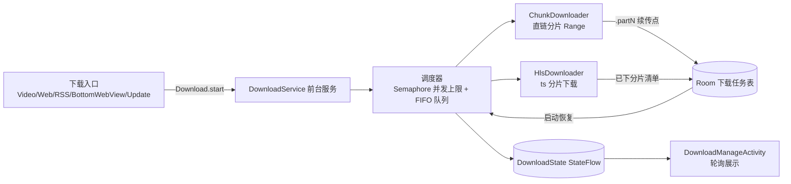
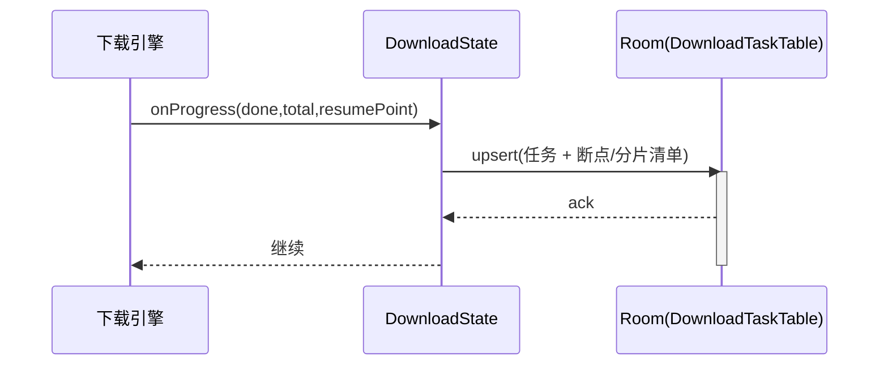
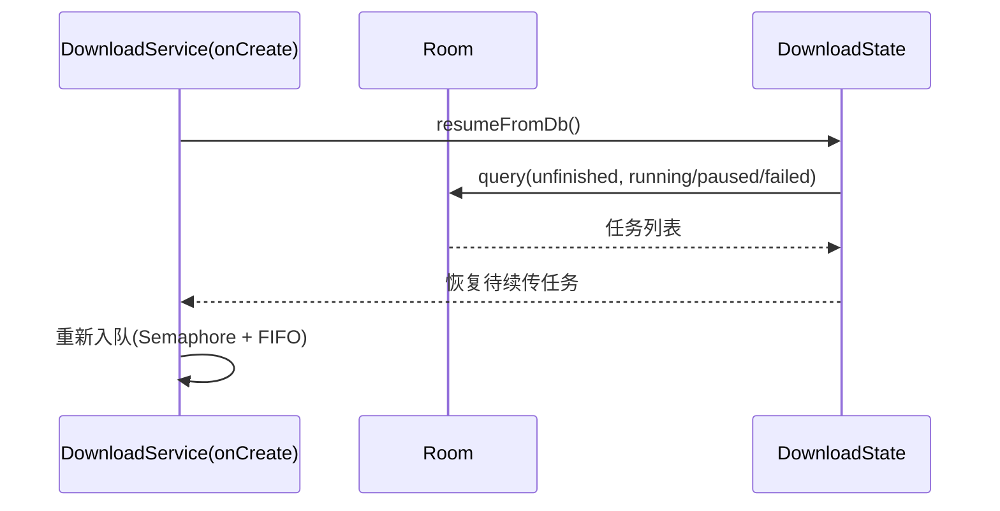
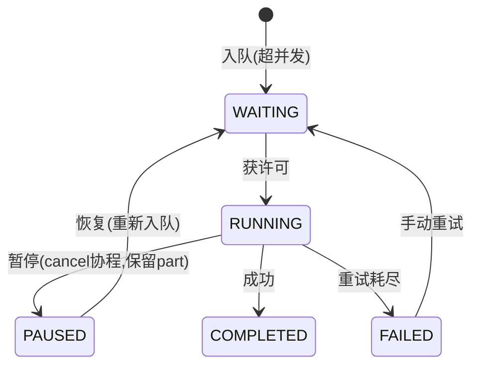

# 下载器成熟化改造技术设计（download-manager-maturity）

## 1. Technical Approach

### 架构概览

在现有模块不动外围 API 的前提下做增量加固，核心改造集中在 `DownloadState`（持久化）与 `DownloadService`（调度），下载引擎 `ChunkDownloader` / `HlsDownloader` 增加"续传点上报"。

### 分层职责

- **Download.kt**（facade 不变）：新增可选参数（如 `autoStart=true`、`retry`），透传。
- **DownloadService**（调度）：启动从 Room 恢复；用 `Semaphore(MAX_CONCURRENT)` + 队列驱动；失败分支触发重试；暂停分支 cancel 协程保留临时文件。
- **DownloadState**（状态源）：Room 为主存 + StateFlow 缓存；新增 `resumeFromDb()`。
- **ChunkDownloader / HlsDownloader**（引擎）：在进度回调基础上增加"续传点上报"，失败返回错误码而非仅 `false`。
- **DownloadManageActivity**（UI）：`Tab.已暂停` 补真实数据；展示错误码；新增"恢复"按钮。

## 2. Architecture Decisions（ADR Y-Statement）

### AD-01: 任务状态用 Room 持久化而非纯内存
- **Context**: 现 `DownloadState` 是 `MutableStateFlow`，进程被杀/崩溃任务即丢。链路：任务完成/失败 → `finally{downloads.remove; isEmpty→stopSelf}` → 前台服务停 → 进程被系统回收 → 静态 `DownloadState` 重置空 map → 管理页 `queryAllTaskStatus()` 返回空 = "进去就没了"。铁证 MP4WtrVidTrkThr SIGABRT 杀进程后"下一半没了"。
- **Concern**: 任务被系统杀掉或应用崩溃后，用户已下载的进度无法恢复。
- **Decision**: 新增 Room 下载任务表（`DownloadTaskEntity`），`DownloadState` 以 Room 为主存、StateFlow 为缓存，服务启动 `resumeFromDb()` 恢复。
- **Goal**: 崩溃/杀进程后任务仍在、可续传，杜绝"任务凭空消失"。
- **Tradeoff**: Room 表 + v89 版本升级迁移成本；状态读写多一层 I/O。
- **Status**: Proposed

### AD-02: 断点续传用「临时文件长度 / 分片清单」精确定位
- **Context**: 直链用 `.partN` 分片（`downloadRange` Range 下载）；m3u8 用 `seg_*` 分片。
- **Concern**: 失败/暂停后要从中断处续传，不能整段重下。
- **Decision**: 直链从 `.partN` 现有字节数推进 Range 起点；m3u8 持久化「已成功分片序号清单」，续传跳过。
- **Goal**: 中断后尽量复用已下数据。
- **Tradeoff**: 需持久化分片元数据；对不支持 Range 或动态 m3u8 清单的场景效果有限。
- **Status**: Proposed

### AD-03: 并发用 Semaphore + FIFO 队列控制
- **Context**: 现每次 `Download.start` 直接 `scope.launch`，无并发上限。
- **Concern**: 大批量添加任务时无限并发抢带宽/内存，且无先后顺序。
- **Decision**: `Semaphore(MAX_CONCURRENT)` 限制同时运行数；未获许可者进入 WAITING 按入队顺序执行（FIFO）。
- **Goal**: 下载数量可控、顺序稳定。
- **Tradeoff**: 需要任务队列状态管理；并发细节移出引擎。
- **Status**: Proposed

### AD-04: 失败用「错误码 + 指数退避重试」
- **Context**: 现 `runCatching` 失败直接置 `FAILED`，无区分原因、无自动重试。
- **Concern**: 网络瞬时抖动不该让长视频任务直接判死。
- **Decision**: 引入 `DownloadError` 枚举；失败按指数退避 `delay(2^n * base)` 重试，超阈值才 FAILED 并记录错误码。
- **Goal**: 提高成功率、失败原因可见。
- **Tradeoff**: 重试机制增加调度复杂度；对永久性错误（如加密不支持）需豁免直判失败。
- **Status**: Proposed

### AD-05: 通知 id 与任务 id 稳定映射
- **Context**: 现 `notificationId = NotificationId.Download + downloads.size`；`downloadJobIdFor` 按 index 从 `downloads.keys` 反查。
- **Concern**: 任务并发/删除/排序变化后，通知点击与任务错位。
- **Decision**: `notificationId = id.toInt()` 直接映射，删除 `size` 计算与 index 反查。
- **Goal**: 通知与任务一一对应稳定。
- **Tradeoff**: 任务 id 增长可能超 Int 范围（Long 截断），理论风险可忽略。
- **Status**: Proposed

### AD-06: native 边界一律前置校验（不依赖 runCatching）
- **Context**: remux 曾触发 MediaMuxer native SIGABRT，runCatching 捕不住 native 崩溃，直接杀进程。
- **Concern**: 任何 native 调用失败都可能杀进程导致任务丢失。
- **Decision**: 所有 native 边界（remux/addTrack/MediaExtractor）前置 csd/数据校验，不合法即回退（如保留 ts），绝不让 native 走到崩溃路径。
- **Goal**: 杜绝 native 崩导致下载任务消失。
- **Tradeoff**: 校验逻辑增加；原生能力可能被低估保守回退。
- **Status**: Accepted（csd 校验已实施，本条固化为纪律）

### AD-07: 下载产物写入用户可访问的公有目录
- **Context**: 现 `resolveTargetDir` 用 `getExternalFilesDir(DIRECTORY_DOWNLOADS)`（app 私有，Android 11+ 文件管理器不可见）。用户反馈"下载目录不在有权限的根目录，找不到文件"。
- **Concern**: 下载产物藏私有目录，用户无法在系统文件管理器查看/重命名/移动，体验非生产级。
- **Decision**: 目标目录改为可选配置，默认公有 Downloads/Legado；Android 11+ 走 MANAGE_EXTERNAL_STORAGE（跳系统设置授权）或 SAF 让用户授权目标目录，落库持久化。
- **Goal**: 文件用户可见可管理，符合成熟下载器预期。
- **Tradeoff**: 需权限申请流程 + 目录配置持久化；旧已在私有目录的存量文件需迁移/提示。
- **Status**: Proposed

### AD-08: 删除区分「仅删任务」与「删任务+清理文件」
- **Context**: 现 `clearCompletedTasks` 仅清记录（保留文件），`cancelTask` 经 `IntentAction.stop` 会连文件一起删，语义不一致且不可选。
- **Concern**: 用户可能只想清列表记录、保留已下文件，也可能想连文件一起清；无二次确认易误删。
- **Decision**: 管理页提供两种删除操作并二次确认：`仅删除任务（保留文件）` 与 `删除任务并清理文件`；删除后同步清 Room 记录与查询列表。
- **Goal**: 删除语义清晰、不误删用户文件。
- **Tradeoff**: 多入口/状态，需在列表项操作菜单显性标注提示语。
- **Status**: Proposed

## 3. Data Flow

### 持久化数据流

### 启动恢复数据流

### 暂停/恢复状态机

## 4. File Changes

| 文件 | 变更 | 说明 |
|------|------|------|
| `app/src/main/java/io/legado/app/service/DownloadState.kt` | 改 | 纯内存 → Room 主存 + StateFlow 缓存；新增 `resumeFromDb()`、错误码字段 |
| `app/src/main/java/io/legado/app/service/DownloadService.kt` | 改 | 调度器（Semaphore+FIFO 队列）、启动恢复、暂停/恢复、重试、通知 id 直映射 |
| `app/src/main/java/io/legado/app/help/download/ChunkDownloader.kt` | 改 | `.partN` 续传点推进、错误码返回 |
| `app/src/main/java/io/legado/app/help/download/HlsDownloader.kt` | 改 | 已下分片清单上报、续传跳过、错误码返回 |
| `app/src/main/java/io/legado/app/model/Download.kt` | 改 | 可选参数（autoStart/retry）透传 |
| `app/src/main/java/io/legado/app/data/AppDatabase.kt` | 改 | 新增下载任务实体 + DAO，版本 v89→v90 |
| `app/schemas/` | 增 | 导出 v90 schema |
| 新增 `DownloadTaskEntity.kt` + `DownloadError.kt` | 增 | 持久化实体 + 错误码枚举 |
| `app/src/main/java/io/legado/app/ui/download/DownloadManageActivity.kt` | 改 | 真实"已暂停"数据、恢复按钮、错误码展示 |
| `app/src/main/assets/updateLog.md` | 改 | 追加用户向 changelog |
| `docs/project-flow/modules/service-layer.md` / `android-services.md` | 改 | 文档同步（下载服务能力说明） |