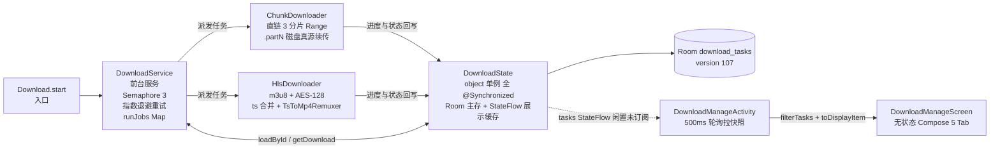
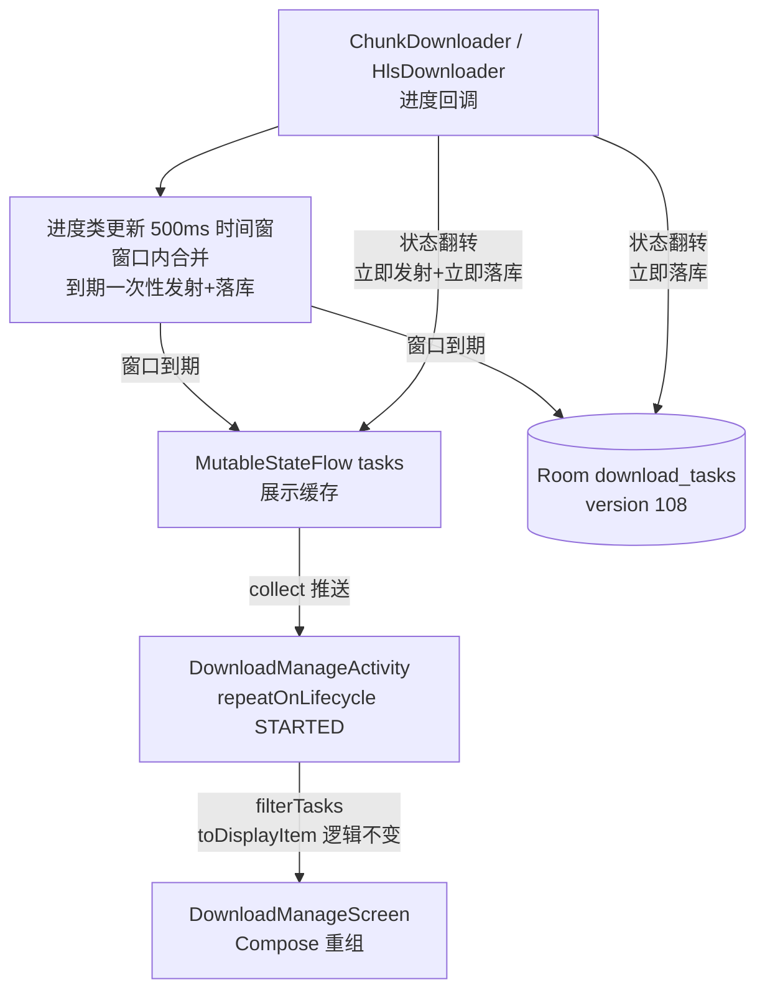
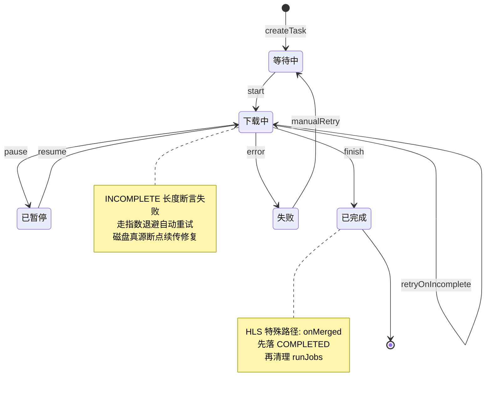
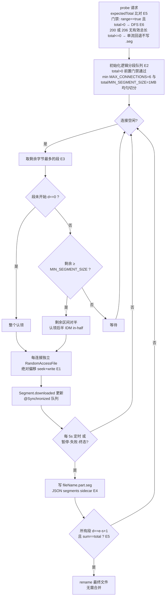

# Design: 下载管理优化（download-manager-optimize）

> 视频 HLS / 直链下载引擎演进式优化，分五批次交付：批次 A（P1 正确性 5 项）、批次 E（IDM 动态分段引擎 6 项）、批次 B（引擎健壮性 11 项）、批次 C（数据一致性与 UI 收口 8 项）、批次 D（UX 增强 6 项），交付顺序 A→E→B→C→D。
>
> 现有架构：`model/Download.kt` 入口 → `DownloadService`（前台服务，Semaphore(3)，指数退避重试，`runJobs: Map<Long, Job>`）→ `DownloadState`（object 单例，Room `download_tasks` 主存 v107 + `MutableStateFlow<Map<Long, DownloadTask>>` 展示缓存，全 `@Synchronized`）→ `ChunkDownloader`（直链 3 分片 Range，`.partN` 磁盘真源续传）/ `HlsDownloader`（m3u8 + AES-128 + ts 合并 + TsToMp4Remuxer）→ `DownloadManageActivity`（500ms 轮询）+ `DownloadManageScreen`（无状态 Compose 5 Tab）。

## Technical Approach

总体原则：演进式优化，不重构、不换引擎（见 AD-06），复用现有指数退避重试链与 `.partN` 磁盘真源续传机制。五个批次互相独立、可独立验证与交付；批次 A 先消除正确性问题，批次 E 升级直链引擎为 IDM 动态分段，批次 B 加固引擎与存储，批次 C 收口数据一致性与 UI，批次 D 做体验增强。

### 批次 A：P1 正确性（A1-A5）

**改什么**：下载产物完整性校验缺失、续传 total 漂移无感知、记录删除时孤儿文件、管理页靠轮询驱动。

**怎么改**：

- **A1/A2 完整性校验**：在 `ChunkDownloader` 两处收口点加长度断言——(1) 合并前逐分片校验 `partFile.length() == rangeLen`（该分片 Range 请求应有长度）；(2) 单线程直链下载完成后校验 `file.length() == total`。断言失败抛 `DownloadException(INCOMPLETE)`，走现有指数退避重试链，重试时磁盘真源（`.partN`）天然支持从断点续传修复短分片。
- **A3 续传 total 比对**：比对依据 = `appDb.downloadTaskDao.loadById(id)?.totalSize`（entity totalSize: Long 已落库，DB 真源）；`totalSize==0` 视为无记录跳过比对。`ChunkDownloader.downloadDirect` 增加 `expectedTotal: Long` 参数，`downloadChunked` 内 probe total 与 expectedTotal 均>0 且不一致时先删全部 .partN 再按新 total 下载。
- **A4 孤儿记录删除**：`removeDownload` 遇到内存 `info == null`（进程重启后 runJobs 清空但 Room 记录仍在）的场景，改用 `appDb.downloadTaskDao.loadById` 取回 entity，用已落库的 `url` / `fileName` / `taskType` 重建 `DownloadInfo` 后走正常删除链路（含产物清理，重建清理直接用 `entity.localPath` 定位）。
- **A4 HLS 产物命名缺口**：未完成任务 `localPath` 为 null（仅 COMPLETED 时写入），`deleteLocalFiles` 按 `fileName` 删不中 HLS 的 `fileName+".mp4"` / `nameWithoutExtension+".ts"` 产物。修正：`executeDirect` / `executeHls` attempt 起始即 `updateTask(localPath = localFile.path)`，让 `localPath` 全程可靠，A4 重建直接用 `entity.localPath` 删除。
- **A5 UI 响应式接线**：`DownloadManageActivity` 删除 500ms 轮询循环，改为：

```kotlin
lifecycleScope.launch {
    repeatOnLifecycle(Lifecycle.State.STARTED) {
        DownloadState.tasks.collect { tasks ->
            // filterTasks / toDisplayItem 逻辑原样保留，仅数据来源由轮询快照改为 Flow 推送
            composeItems(filterTasks(tasks))
        }
    }
}
```

**为什么安全**：A1-A3 全部复用既有异常类型与重试链，只增断言不改流程；A4 重建字段均已落库（DIRECT 论断成立：localPath 经 executeDirect attempt 起始写入后全程可靠；HLS 未完成任务原 localPath 为 null、产物为 fileName+".mp4" / nameWithoutExtension+".ts"，经 executeHls attempt 起始落库 localPath 后同样可用 entity.localPath 精确定位清理），重建 info 与正常运行时构造路径一致；A5 数据源 `DownloadState.tasks` 本就存在且由 `@Synchronized` 方法维护，仅把"拉"改"推"，展示层转换函数零改动。

### 批次 B：引擎健壮性（B1-B11）

**改什么**：进度高频写库放大 IO、实体僵尸字段与类型不一致、m3u8 解析对非标准属性兼容不足。

**怎么改**：

- **B1 进度落库节流**：`DownloadState.updateTask` 拆分为两类写路径——进度类更新（downloaded/progress/speed）的**内存 StateFlow 发射与 DB 写入共用同一 500ms 时间窗**（窗口内合并、到期一次性发射+落库）；状态翻转（status 变化，WAITING/RUNNING/PAUSED/COMPLETED/FAILED）绕过节流**立即发射+立即落库**，终态迁移时强制 flush。内存与 DB 同步不分叉，UI 与落库数据始终一致。
- **B2-B7 单点小修**：每项只触碰一个函数点——B2 `ChunkDownloader` 取消传播补齐；B3 `DownloadState` 合并更新路径；B4 `HlsDownloader` IV 处理修正；B5 `DownloadService` 磁盘空间预检；B6 `DownloadState` 合并更新；B7 恢复 RUNNING 时速度基准处理明确为 `lastBytes[id]=当前 downloadedSize; lastTime[id]=now`（避免 prevBytes=0 瞬时超速）。逐项实施细节以 tasks.md 拆解为准。
- **B8 实体瘦身与迁移**：`DownloadTaskEntity` 删除三个零写入僵尸字段 `resumePointJson` / `segmentsJson` / `errorMsg`（见 AD-05）；`targetDir` 列在 entity 与 DB v107 已存在，B8 实际只删 3 列，"落库"是代码写入行为——`updateTask`/`addTask` 构造 entity 时必须写入并保留 `targetDir` 旧值（`@Update` 全量回写会把漏带字段刷成 null，实施陷阱）；迁移产物需提交 `app/schemas/io.legado.app.data.AppDatabase/108.json`；`AppDatabase` version 107 → 108，`DatabaseMigrations` 新增 `migration_107_108`。SQLite 无法 DROP COLUMN，采用项目既有迁移写法：建新表（目标 schema）→ `INSERT INTO 新表 SELECT 兼容列 FROM 旧表` → DROP 旧表 → RENAME。
- **B9 主键类型统一**：内存 id 本就 `Long`，B9 实际只改 `totalSize`/`downloadedSize`（DownloadState L38-39）+ `DownloadDisplayItem`（Screen L74-75）+ Activity `toDisplayItem` + DownloadService 各 Int 消费点（L325-327/L408/L517-518/L642），消除 >2GB Int 截断。
- **B10 BANDWIDTH 解析修复**：m3u8 解析对 `AVERAGE-BANDWIDTH` 属性的误匹配修复——优先方案：先 `replace("AVERAGE-BANDWIDTH", "BANDWIDTH_FALLBACK")` 剥离再解析；等效方案：正则改 `(?<!AVERAGE-)BANDWIDTH=`。取实现简单且测试可验者。

**为什么安全**：B1 只改落库时机不改数据语义，终态强制 flush 保证崩溃恢复正确性；B8 迁移走项目成熟的新表迁移模式，僵尸字段零写入故无数据丢失面；B10 只影响解析健壮性，误匹配修复后行为只会更正确。

### 批次 C：数据一致性与 UI 收口（C1-C8）

**改什么**：文件已被移动/删除后入口仍可点、暂停恢复入口幂等性、清除记录不清理产物、通知与协程生命周期、Tab/扩展名多处定义。

**怎么改**：

- **C1**：管理页"打开文件"入口执行前加 `File.exists`（按 entity.localPath）校验，缺失时 Toast 提示并提供"重下"引导。
- **C2**：`onResume` 调用 `DownloadState.resumeFromDb`（本身幂等，重复调用安全），修复从外部返回后状态不同步。
- **C3**：清除 FAILED/PAUSED 记录时同步清理磁盘产物——发 Service 清理 intent（走引擎既有清理能力），或直接按 `entity.localPath` / `taskType` 定位产物清理。
- **C4**：Activity/页面对应的通知循环在生命周期结束时 `cancel`，消除残留通知。
- **C5**：涉及 IO 的调用点统一包 `Coroutine.async` / `Dispatchers.IO`，不阻塞主线程。
- **C6**：5 个 Tab 用单一 `enum` 定义（含 `labelRes`），Activity 侧只引用 enum 下传 `DownloadManageScreen`；各处散落的扩展名映射表抽成公共 `const`，单源化。
- **C7/C8**：过期注释清理、死代码删除（DownloadState 侧 C8 与 B 的死代码项合并处置）。

**为什么安全**：均为入口/生命周期/常量单源化改造，不改引擎核心；C3 复用引擎既有产物清理逻辑，只补触发点。

### 批次 D：UX 增强（D1-D5）

**改什么**：列表信息密度与状态记忆、错误可诊断性、TaskRemoved 行为。

**怎么改**：

- **D1**：速度字段已有（`DownloadTask.speed`），新增 ETA 计算：`eta = (total - downloaded) / speed`（speed <= 0 时不展示），文案进 strings.xml。
- **D2**：FAILED 行点击弹出错误详情弹框（复用 AppDialog 基线），展示错误类型与可读文案，文案进 strings.xml。
- **D3**：URL 展示处理——列表中长 URL 截断/仅在详情展示，避免撑爆行布局。
- **D4**：Tab 选中态用 `rememberSaveable` 持久化（进程内旋转/重建恢复；跨 Activity 重建的局限见 AD-03 Tradeoff）。注意 `menuItem` 等持有 `DownloadDisplayItem`（非 Parcelable）不能直接 `rememberSaveable`——布尔旗标可直接 saveable，item 态存任务 id（Long）回查列表。
- **D5**：`stopSelf` 位于基类 `BaseService.kt` 的 `onTaskRemoved`（`@CallSuper`，全部 Service 共享，禁止直接删）。方案：`BaseService` 增 `protected open val stopSelfOnTaskRemoved: Boolean = true`，`onTaskRemoved` 内 `if (stopSelfOnTaskRemoved) stopSelf()`；`DownloadService` 覆写 `stopSelfOnTaskRemoved = false` 并在覆写内保留 `maybeStopSelf()` 判空退场。任务从最近任务划掉后默认继续下载（RUNNING 状态已落库，进程被杀也可由恢复链路接续）。

**为什么安全**：D5 改变行为有 AD-07 决策支撑且状态已可恢复（队列空时服务仍经 `maybeStopSelf()` 正常退场）；其余为纯展示层增强，不触碰引擎。

### 批次 E：IDM 动态分段引擎（E1-E6，用户 2026-08-28 裁决增补）

**改什么**：现有 `ChunkDownloader` 直链路径是静态物理 3 分片（probe 后固定切 3 段 Range 各写 `.partN`），段间负载不均、连接不复用。升级为真 IDM 动态文件分段（DFS）：新连接空闲时找最大段对半分裂、完成的连接免重连认领剩余区间。业界印证：NDM（IDM 平替）同算法 32 连接；Kotlin 生态 KDownloader 实现 "IDM-style dynamic range theft"；Downpour（2026 活跃）自适应并发——动态分段仍是直链最优解，现有静态 3 分片为伪 IDM。

**怎么改**（ChunkDownloader 内重写直链路径，约 300 行）：

- **E1 单文件+绝对偏移写入**：下载产物改为 `{fileName}.part` 单文件，每连接持有独立 `RandomAccessFile` 实例（各协程独立 FD，写入区间互不重叠保证并发安全）按绝对偏移 seek+write；全部完成后 rename 最终文件。.part/.seg 派生基 = uniqueFile 产出的最终路径（含 "(n)" 变体）；localPath 语义不变 = 最终文件路径（非 .part），.part/.seg 为其派生名，rename 前该路径不存在属预期（C1 存在性校验兜底）。
- **E2 逻辑分段队列**：内存 `Segment(start, end, downloaded)` 队列，`@Synchronized` 保护；初始按 `min(maxConnections, total/MIN_SEGMENT)` 段均匀切分；`MAX_CONNECTIONS = 6` 常量、`MIN_SEGMENT_SIZE = 1MB`（剩余小于该值不分裂；连接数设置项列 P3 远期）。Segment 三字段均为 Long（start/end/downloaded，>2GB 偏移安全，与 B9 口径一致）；.seg JSON 数值按 Long 读写（org.json getLong/putLong 或等价 Long 安全解析）。
- **E3 动态分裂与窃取（IDM in-half 规则落地）**：连接空闲时取剩余字节最多的段——该段未开始（downloaded==0）则整个认领；进行中则将其**剩余区间对半**取后半（对半后剩余 < MIN_SEGMENT_SIZE 则等待而非硬拆）；连接完成后免重连直接循环认领（连接复用）。
- **E4 .seg sidecar 断点文件（aria2 控制文件模式）**：JSON 格式 `{"total":..., "segments":[{"s":...,"e":...,"d":...}]}` 写 `{fileName}.part.seg`；保存时机 = 每 5s 定时 + 暂停/失败/终态前强制；恢复流程 = 读 .seg 重建分段队列，各连接从各自段断点偏移续传；.seg 是唯一进度真源——单文件绝对偏移写入中间可能有洞，文件长度不可作进度依据。终态含 COMPLETED：rename 成功后随任务结算删除 .seg（与 .part 一并清理，防孤儿 sidecar）。
- **E5 与批次A 校验联动**：expectedTotal 比对（A3）保留在 probe 处，不一致删 .part + .seg 重下；完整性校验 = 所有段 `d==e-s+1` 且 `sum(d)==total`（A1/A2 在 DFS 语义下自然成立）；最终文件无需合并直接 rename。
- **E6 单流回退与存量兼容**：probe 后仅当 range==true 且 total>0 时进入 DFS；以下情形一律回退单流且不写 .seg：(1) 200 响应（不支持 Range）；(2) 206 但 Content-Range 无有效总长（如 bytes 0-0/*）或 total≤0（chunked/未知长度）。E2 初始切分前置门禁：total>0 才切分，保证 min(maxConnections, total/MIN_SEGMENT_SIZE) ≥ 1。存量未完成任务的 `.partN` 升级后直接删重下（量小可接受，登记）。

**调用路径覆盖说明**：startDownload / resumeDownload / resumeAllFromDb 三入口均经 schedule → runTask → executeAttempt 汇聚于 executeDirect 单漏斗调用 downloadDirect，.seg 恢复与 expectedTotal 比对在 ChunkDownloader 内完成，resumeDownload 本体（L438-447）无需改动；唯一签名影响 = executeDirect 调用点查询 `appDb.downloadTaskDao.loadById(id)?.totalSize ?: 0L` 传入 expectedTotal。

**进度聚合口径**：onProgress 下发的 downloaded = 在 @Synchronized 队列快照上计算的 sum(全部段 downloaded)，与 .seg 落盘共用同一快照读取点；每连接仅更新自身段 downloaded 后触发快照重算，禁止多连接独立累加共享计数器；发射节奏接入 B1 500ms 节流窗口，状态翻转仍立即落库。

不做：不引入 Room chunk 表（aria2 双表模式仍 Out of Scope）；HLS 引擎不动（m3u8 分片天然并行）；自适应并发（Downpour 式吞吐监测调连接数）列远期 Out of Scope；连接数设置项列 P3。

**为什么安全**：写入区间由分段队列统一分配互不重叠，多 FD 并发写同一文件退化为区间隔离的 seek+write 而非竞态；.seg 落盘时机覆盖暂停/失败/终态强制 + 每 5s 定时，强杀丢失回退到最后落盘点丢 ≤5s 数据（可接受）；单流回退保留原路径，不支持 Range 的源行为不变；存量 .partN 删重下只影响升级时点的未完成任务（量小，登记）。多 `RandomAccessFile` 句柄需 ensureActive + finally 关闭防泄漏。决策记录见 AD-08。

## Architecture Decisions

### AD-01 完整性校验策略：磁盘真源 + 长度断言，不引入 hash

- **Context**：分片续传已闭环（`.partN` 磁盘真源 + probe 续传），但分片合并前与单线程完成处均无长度校验。
- **Concern**：短分片或截断文件被静默合并成坏文件，用户看到"下载成功"却播放失败，无可见错误信号。
- **Decision**：合并前逐片校验长度 `== rangeLen` + 单线程完成后 total 比对 + 续传 probe total 与 DB 真源 `appDb.downloadTaskDao.loadById(id)?.totalSize`（entity totalSize: Long 已落库）比对，`totalSize==0` 视为无记录跳过；`downloadDirect` 增加 `expectedTotal: Long` 参数，probe total 与 expectedTotal 均>0 且不一致时清空全部 .partN 按新 total 重下；失败统一抛 `DownloadException(INCOMPLETE)` 走现有重试链；不引入 If-Range / ETag / hash 内容级校验。
- **Goal**：消除静默坏文件，把长度异常转成可重试的显式失败。
- **Tradeoff**：不防内容级损坏（CDN 返回错误内容但长度恰好一致）；该场景现有嗅探播放链路会暴露问题，hash 校验的收益/成本比低，故本期不做。
- **Status**: Proposed

### AD-02 孤儿文件治理：DB 重建 DownloadInfo，不改 DB 存完整路径快照

- **Context**：进程重启后 `runJobs` 清空，Room 记录仍在，删除时内存 `info == null` 无法走含产物清理的删除链路。
- **Concern**：删除记录后磁盘产物成为孤儿文件，占空间且无入口清理。
- **Decision**：`info` 缺失时从 entity（`url` / `fileName` / `taskType` 均已落库；`localPath` 经 executeDirect/executeHls attempt 起始写入后全程可靠）重建 `DownloadInfo` 后走正常删除链路；B8 令 `updateTask`/`addTask` 写入并保留 `targetDir` 旧值（`targetDir` 列在 entity 与 DB v107 已存在，B8 实际只删 3 列，"落库"是代码写入行为）；不改 DB schema 去存完整产物路径快照。存量 `targetDir`=`null` 时回退当前 `resolveTargetDir` 配置目录语义。
- **Goal**：删除记录即删产物，杜绝孤儿。
- **Tradeoff**：`uniqueFile` 生成 "(n)" 变体（重名自动加序号）的场景仍可能漏删产物；`targetDir` 有值后漏删范围可控（限定在目标目录内）。批次窗口说明：A4（批次1）先于 B8（批次2），`targetDir` 落库前 A4 重建清理只能落 `resolveTargetDir` 当前配置目录，改过目录的存量任务存在漏删窗口（正确性大头已修，可接受）；彻底精确清理需未来记录产物路径快照。
- **Status**: Proposed

### AD-03 UI 响应式接线：StateFlow 订阅替代轮询，本期不引入 ViewModel

- **Context**：`DownloadState.tasks`（`MutableStateFlow`）本就存在但管理页未订阅，处于闲置；`DownloadManageActivity` 用 500ms 轮询拉快照。
- **Concern**：轮询耗电且不实时；Activity 直接持有数据转换逻辑，状态归属不清晰。
- **Decision**：本期仅做 `collect` 接线 + `repeatOnLifecycle(STARTED)`（自动处理前后台暂停/恢复订阅），`filterTasks` / `toDisplayItem` 逻辑原样保留；不抽 `DownloadManageViewModel`（改动面控制，ViewModel 引入留待后续演进，已记入待扩展清单）。
- **Goal**：实时响应 + 前后台自动启停订阅，删掉轮询循环。
- **Tradeoff**：不引入 ViewModel 则旋转屏重建时 Tab 状态等仍会丢失（D4 用 `rememberSaveable` 部分缓解），属于现状可接受的已知局限。
- **Status**: Proposed

### AD-04 进度落库节流：500ms 时间窗节流而非 Room 事务批量

- **Context**：进度回调频率高（可达每分片每次读写一次），当前每次进度都触发 Room `@Update` 全量回写。
- **Concern**：高频小事务写库放大 IO 与 WAL 压力，多任务并发时更明显。
- **Decision**：进度类更新（downloaded/progress/speed）的**内存 StateFlow 发射与 DB 写入共用同一 500ms 时间窗**（窗口内合并、到期一次性发射+落库，记录 `lastFlushTime`）；状态翻转（status 变化）绕过节流**立即发射+立即落库**，完成/暂停/失败强制 flush。内存与 DB 同步不分叉。
- **Goal**：进度写库频率压到 ≤2Hz，同时保证崩溃恢复时状态正确；UI 与落库数据一致。
- **Tradeoff**：进程被杀最多丢 ≤1s 的进度数字；分片文件本身是磁盘真源，续传按实际文件大小对账，进度回退无损正确性；UI 刷新频率随节流降至 ≤2Hz，与现状 500ms 轮询相当。
- **Status**: Proposed

### AD-05 僵尸字段处置：删除 resumePointJson / segmentsJson / errorMsg 而非补齐实现

- **Context**：三字段在代码中零写入（仅有 schema 定义与 `@Update` 全量回写），是历史设计残留。
- **Concern**：零写入字段被 `@Update` 全量回写为 null/旧值，存在误用风险（调用方以为有断点位图可读）；字段长期无实现承诺。
- **Decision**：删除三字段；`targetDir` 列在 entity 与 DB v107 已存在，本迁移不增列（实际只删 3 列），但 `updateTask`/`addTask` 构造 entity 时必须写入并保留 `targetDir` 旧值（`@Update` 全量回写会把漏带字段刷成 null，实施陷阱）；DB version 107 → 108，迁移用建新表迁数据模式（SQLite 无法 DROP COLUMN），迁移产物 `app/schemas/io.legado.app.data.AppDatabase/108.json` 需提交。
- **Goal**：schema 与真实使用面一致，消除误用面。
- **Tradeoff**：未来若做分片位图持久化（断点更细粒度）需再做一次迁移；当下按 YAGNI 处置。
- **Status**: Proposed

### AD-06 第三方下载库引入与否：不引入，自研引擎演进

- **Context**：候选库 OkDownload / FileDownloader 已停更，Fetch 存在已知 bug，Media3 定位是播放器而非通用下载管理。
- **Concern**：自研引擎需要长期自维护，存在重复造轮子质疑。
- **Decision**：不引入第三方库，在现有自研引擎上做演进式加固。
- **Goal**：零新依赖债，保持引擎行为完全可控。
- **Tradeoff**：自维护成本；但引擎代码已在仓内且已闭环多个实测铁证坑（续传、合并、重定向等），替换库的迁移与行为回归成本高于继续演进。
- **Status**: Proposed

### AD-07 onTaskRemoved 行为：开关化 stopSelf，划掉默认继续下载

- **Context**：当前 `stopSelf` 调用位于基类 `BaseService.kt` 的 `onTaskRemoved`（`@CallSuper`，全部 Service 共享），用户从最近任务划掉 App 会中断下载。
- **Concern**：继续下载有后台耗电质疑；停止下载则任务频繁被打断、需要用户手动恢复。
- **Decision**：`stopSelf` 在基类 BaseService.kt onTaskRemoved（@CallSuper，全部 Service 共享，禁止直接删）；方案 = BaseService 增 `protected open val stopSelfOnTaskRemoved: Boolean = true`，onTaskRemoved 内 `if (stopSelfOnTaskRemoved) stopSelf()`；DownloadService 覆写 `stopSelfOnTaskRemoved = false` 并在覆写内保留 `maybeStopSelf()` 判空退场（队列为空时仍正常退场）。任务划掉后默认继续下载；RUNNING 状态已落库，即使进程随后被系统回收也可由恢复链路接续；前台服务通知常驻、可感知、可手动暂停。任务级通知 deleteIntent 与前台 summary 通知语义不变。
- **Goal**：对齐主流下载器行为（划掉不中断），保障下载连续性，且不影响其他 Service 的 onTaskRemoved 语义。
- **Tradeoff**：后台耗电换下载连续性；用户可通过通知或管理页主动暂停/取消，耗电可控。
- **Status**: Proposed

### AD-08 直链引擎升级 IDM 动态分段：单文件+逻辑分段+.seg sidecar，不引入 Room chunk 表

- **Context**：现有直链引擎为静态物理 3 分片（probe 后固定切 3 段 Range 各写 .partN），段间负载不均、连接不复用；用户 2026-08-28 裁决增补批次E 升级为真 IDM 动态分段（DFS）。业界印证：NDM（IDM 平替）同算法 32 连接，Kotlin 生态 KDownloader 实现 "IDM-style dynamic range theft"，Downpour（2026 活跃）自适应并发——动态分段仍是直链最优解，现有静态 3 分片为伪 IDM。
- **Concern**：大文件直链吞吐受最慢连接拖尾（静态分段负载不均），已完成的连接闲置不能支援慢段，快慢连接场景总耗时 ≈ 最慢段耗时。
- **Decision**：E1 单文件+绝对偏移写入（产物 `{fileName}.part`，每连接独立 RandomAccessFile FD，写入区间互不重叠）；E2 内存 Segment(start, end, downloaded) 逻辑分段队列（@Synchronized，初始按 min(maxConnections, total/MIN_SEGMENT) 均匀切分，MAX_CONNECTIONS=6、MIN_SEGMENT_SIZE=1MB；Segment 三字段均 Long——start/end/downloaded，>2GB 偏移安全，与 B9 口径一致，.seg JSON 数值按 Long 读写）；E3 IDM in-half 动态分裂与窃取（空闲连接取剩余字节最多的段：未开始整个认领、进行中剩余区间对半取后半、剩余 < MIN_SEGMENT_SIZE 则等待，完成连接免重连循环认领）；E4 .seg sidecar 断点文件（JSON `{"total":..., "segments":[{"s":...,"e":...,"d":...}]}`，每 5s 定时+暂停/失败/终态前强制落盘，恢复读 .seg 重建队列，.seg 为唯一进度真源）；E5 与批次A 校验联动（expectedTotal probe 比对不一致删 .part+.seg 重下，完整性校验=所有段 d==e-s+1 且 sum==total，最终文件直接 rename）；E6 DFS 门禁与单流回退（probe 后仅当 range==true 且 total>0 进入 DFS；200 响应或 206 但 Content-Range 无有效总长（如 bytes 0-0/*）或 total≤0 一律回退单流不写 .seg；E2 切分前置门禁 total>0 才切分，保证 min(maxConnections, total/MIN_SEGMENT_SIZE) ≥ 1）+ 存量 .partN 删重下。不引入 Room chunk 表（aria2 双表模式仍 Out of Scope）；连接数设置项列 P3。
- **Goal**：对齐 IDM/NDM 吞吐模型——快慢连接负载均衡（总耗时接近最快连接）、连接复用免重连、断点恢复细粒度可控。
- **Tradeoff**：.seg 在两次落盘间强杀丢失→回退最后落盘点丢 ≤5s 数据（可接受）；实现复杂度高于静态分片（约 300 行重写+真机多场景验证）；多 RandomAccessFile 句柄需 ensureActive+finally 关闭防泄漏。
- **与 AD-01（磁盘真源）关系**：.seg 接管直链进度真源（单文件绝对偏移写入中间可能有洞，文件长度不可作进度依据）；HLS 引擎不动仍磁盘真源。
- **Status**: Proposed

## Data Flow

### 1. 现状架构图



### 2. 改造后进度数据流（B1 节流 + A5 响应式接线）



### 3. 任务状态机

> 说明：stateDiagram-v2 的边标签语法不支持引号包裹中文（引号会被原样渲染），故边标签用英文标识；状态的中文含义见引号别名。



### 4. 批次E 动态分段认领/分裂流程（IDM DFS）



## File Changes

| 文件 | 变更 | 批次 |
|------|------|------|
| `app/src/main/java/io/legado/app/help/download/ChunkDownloader.kt` | A1 A2 A3 B2 E1-E6｜完整性校验 + 续传 total 比对（downloadDirect 加参 expectedTotal）+ 取消传播 + 批次E IDM 动态分段重写（单文件绝对偏移写入/逻辑分段队列/动态分裂窃取/.seg sidecar/expectedTotal 联动/单流回退，约 300 行） | A / B / E |
| `app/src/main/java/io/legado/app/help/download/HlsDownloader.kt` | B4 B10 A4｜IV 修正 + BANDWIDTH 解析修复 + executeHls attempt 起始落库 localPath | A / B |
| `app/src/main/java/io/legado/app/base/BaseService.kt` | D5｜onTaskRemoved 增 stopSelfOnTaskRemoved 开关（默认 true，DownloadService 覆写 false） | D |
| `app/src/main/java/io/legado/app/service/DownloadService.kt` | A3 A4 B5 B9 B11 C3 D5 E｜expectedTotal 调用点传参（executeDirect 查 loadById(id)?.totalSize ?: 0L）+ 孤儿治理 + 空间预检 + Int 消费点改 Long（L325-327/L408/L517-518/L642）+ onTaskRemoved 覆写开关 + 产物清理入口 + deleteLocalFiles 增清理 .part/.seg（.partN 循环保留兼容存量） | A / B / C / D / E |
| `app/src/main/java/io/legado/app/service/DownloadState.kt` | B1 B3 B6 B7 B9 C8｜进度节流 + 合并更新 + totalSize/downloadedSize Int→Long（L38-39）+ 死代码 | B / C |
| `app/src/main/java/io/legado/app/data/entities/DownloadTaskEntity.kt` | B8｜删 resumePointJson / segmentsJson / errorMsg（targetDir 列已存在，updateTask/addTask 保留旧值） | B |
| `app/src/main/java/io/legado/app/data/AppDatabase.kt` | B8｜version 107 → 108 | B |
| `app/src/main/java/io/legado/app/data/DatabaseMigrations.kt` | B8｜migration_107_108（建新表迁数据模式） | B |
| `app/schemas/io.legado.app.data.AppDatabase/108.json` | B8｜迁移后 schema 导出产物（需提交） | B |
| `app/src/main/java/io/legado/app/ui/download/DownloadManageActivity.kt` | A5 B9 C1 C2 C4 C5 C6 C7｜StateFlow 接线删轮询 + toDisplayItem Int→Long + 存在性校验 + 幂等恢复 + 通知清理 + enum 单源化 | A / B / C |
| `app/src/main/java/io/legado/app/ui/download/DownloadManageScreen.kt` | B9 C6 D1 D2 D3 D4｜DownloadDisplayItem Int→Long（L74-75）+ Tab enum 下传 + ETA / 错误弹框 / URL 展示 / rememberSaveable | B / C / D |
| `app/src/main/res/values-zh/strings.xml`（及 `values/strings.xml`；另有 values-zh-rHK/rTW/vi/pt-rBR/ja/es 6 个语言变体按惯例同步） | C7 D1 D2｜新增文案 | C / D |
| `app/src/main/assets/updateLog.md` | 全批次完成后｜版本交付同步（编译前更新，追加在 `## cronet版本:` 之后） | 交付门禁 |
