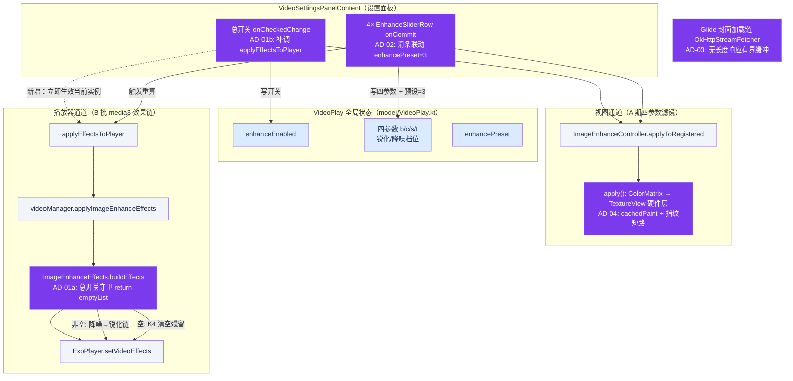
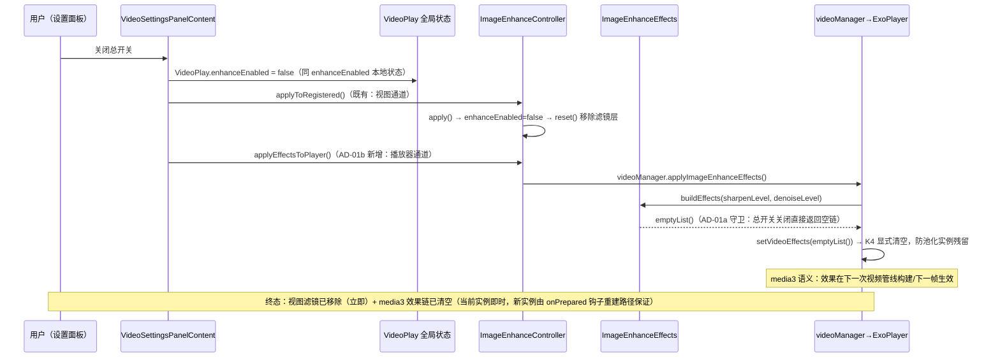

# design.md — 画质增强总开关治理与解码兜底修复

> OpenSpec 变更：`enhance-switch-governance-fix`
> 来源：commit `6bc9fd98f` 交付后的 4 项代码审查问题（1 major + 3 minor）
> 关联 spec：`docs/specs/enhance-switch-governance-fix/spec.md`（如未创建，本文即设计权威源）

## 1. Technical Approach

本次修复 4 项审查问题，围绕**画质增强双通道治理**与**封面解码小内存兜底**两条主线：

| # | 级别 | 问题 | 修复点 |
|---|------|------|--------|
| 1 | major | 画质增强总开关关不掉 B 批 media3 锐化/降噪链（`buildEffects()` 只看四参数/档位，不看 `VideoPlay.enhanceEnabled`） | **AD-01** 双管齐下：`ImageEnhanceEffects.buildEffects()` 开头加总开关守卫（单点防御，所有调用路径收敛）+ `VideoSettingsPanelContent.kt` 总开关 `onCheckedChange` 补调 `ImageEnhanceController.applyEffectsToPlayer()`（立即生效当前播放实例） |
| 2 | minor | 滑条（亮度/对比度/饱和度/色温）调节后预设标签不联动为「自定义」 | **AD-02** 4 个 `EnhanceSliderRow` 的 `onCommit` 内补 `if (enhancePreset != 3) { enhancePreset = 3; VideoPlay.enhancePreset = 3 }` |
| 3 | minor | `OkHttpStreamFetcher.kt` 封面解密分支中，响应无 `contentLength`（-1）时绕过小内存跳过解密守卫，直接走 `ImageUtils.decode` 全量 `readBytes()`，小内存设备可能 OOM | **AD-03** `isSmallHeap && contentLength < 0` 时增量读入 `ByteArrayOutputStream`，读到 `SKIP_DECODE_SIZE_BYTES + 1` 上限：超限 → `SequenceInputStream(缓冲 + responseBody.byteStream())` 透传不解密；未超限 → `toByteArray()` 走 `ImageUtils.decode` 解密。内存峰值与现状 `readBytes` 等价（≤ 阈值量级），但超限时不再持有全量字节 |
| 4 | minor | `ImageEnhanceController.apply()`（L99-111）每次执行都 `new Paint()` + `setLayerType` 重建硬件层，滑条拖动时高频触发，开销浪费且可能闪烁 | **AD-04** `object` 内增加 `private var cachedPaint: Paint?` 与 `private var lastParams: Long`（亮度/对比度/饱和度/色温四参数打包指纹）；`apply()` 先算指纹，未变直接 `return`；变化时复用 `cachedPaint` 只更新 `colorFilter` 再 `setLayerType` |

核心数据流与 4 个改动点（紫色高亮节点，`fill` + `color` 均显式指定，保证明暗主题可读）：

> 说明：AD-03 不在画质增强双通道内，属 Glide 封面解码链路（RSS 图片二次解密），图中独立节点呈现，避免与总开关治理语义混淆。

## 2. Architecture Decisions

> 模板：Y-Statement（Context / Concern / Decision / Goal / Tradeoff / Status）

### AD-01 总开关收敛为单点守卫 + 面板立即生效双保险

- **Context**：B 批锐化/降噪经 `ImageEnhanceEffects.buildEffects(sharpenLevel, denoiseLevel)` 组装效果链注入 ExoPlayer；`buildEffects` 现只依据两个档位参数决定链内容，不感知总开关 `VideoPlay.enhanceEnabled`。总开关关闭后：视图通道（A 期滤镜）会清掉，但播放器通道（B 批效果链）残留。
- **Concern**：总开关语义应是「画质增强全链路的唯一权威源」；当前出现总开关关不掉 B 批链的治理漏洞，且任何未来新增的 `buildEffects` 调用点都可能重现该漏洞。
- **Decision**：两层修复——(a) `buildEffects()` 开头加 `if (!VideoPlay.enhanceEnabled) return emptyList()`（单点守卫，所有调用路径收敛于工厂函数本身）；(b) 面板总开关 `onCheckedChange` 补调 `applyEffectsToPlayer()`，使**当前已创建的播放实例**立即应用空链（media3 语义下 `setVideoEffects` 需主动触发，仅改状态不触发不会生效）。
- **Goal**：总开关关闭后视图滤镜与 media3 效果链**双通道同时归零**，且防御纵深不依赖调用方自觉。
- **Tradeoff**：`buildEffects` 由纯参数函数变为依赖全局状态的函数，可测性略降（单测需先写 `VideoPlay.enhanceEnabled`）；权衡收益是杜绝所有调用路径的漏网，比在每个调用点重复判断更不易腐化。K4 语义保持：空列表 → `setVideoEffects(emptyList())` 显式清空防池化实例残留。
- **Status**: Proposed

### AD-02 滑条调节联动「自定义」预设

- **Context**：预设（`enhancePreset`：0 关/1 柔和/2 标准/3 自定义 等）本质是四参数的快照；用户拖动任一滑条后四参数已偏离预设值，但 `enhancePreset` 状态未更新，面板标签与实际参数不一致。
- **Concern**：状态一致性——预设标签必须忠实反映「当前四参数是否等于某预设快照」。
- **Decision**：4 个 `EnhanceSliderRow` 的 `onCommit` 内各加 `if (enhancePreset != 3) { enhancePreset = 3; VideoPlay.enhancePreset = 3 }`（自定义档 id=3）。仅在预设不为自定义时写入，避免拖动过程中重复写状态。
- **Goal**：任何手动调节立即把预设标签切到「自定义」，重进面板选中项正确。
- **Tradeoff**：没有做「反查四参数匹配预设则自动纠正回预设」的反向推导（实现复杂、边界模糊，如多个预设参数重合时）；权衡收益是实现极简、语义直观——「手动动过就是自定义」。预设档位本身的选择流程不受影响。
- **Status**: Proposed

### AD-03 无长度响应的小内存有界缓冲兜底

- **Context**：`OkHttpStreamFetcher.kt` L182-191 现守卫为 `MemoryPressure.isSmallHeap && contentLength > SKIP_DECODE_SIZE_BYTES`（`SKIP_DECODE_SIZE_BYTES = 10MB`，L62）。HTTP chunked / 某些源不回 `Content-Length` 时 `contentLength == -1`，条件恒假，小内存设备直接走 `ImageUtils.decode`，内部 `readBytes()` 全量读入，解密期间原始字节 + 解码结果双份存活，256MB heap 多图并发易 OOM。
- **Concern**：守卫必须覆盖「长度未知」这一现实场景，且兜底本身不能引入更大的内存峰值。
- **Decision**：`isSmallHeap && contentLength < 0` 时增量读入 `ByteArrayOutputStream`，读到 `SKIP_DECODE_SIZE_BYTES + 1` 上限即停：超限 → `SequenceInputStream(缓冲流 + responseBody.byteStream())` 透传不解密（超大图加密概率极低，沿用原 H3 结论）；未超限 → `toByteArray()` 走 `ImageUtils.decode(url, bytes, ...)` 正常解密。
- **Goal**：小内存设备对无长度响应获得与有长度响应**同等的跳过解密保护**，且超限时内存峰值受 10MB 阈值约束。
- **Tradeoff**：未知长度且 ≤ 阈值时多一次缓冲拷贝（峰值 ≈ 图片体积 + 拷贝，与现状 `readBytes` 同量级，不劣化）；未知长度且超限时先读满 10MB 才判定透传（多读 10MB 后截断，`SequenceInputStream` 拼接保证数据不丢）。未缓冲边界下「边读边判加密头」的流式方案更优但改动面大，本次不做。
- **Status**: Proposed

### AD-04 Paint 复用 + 四参数指纹短路

- **Context**：`ImageEnhanceController.apply()`（L99-111）每次执行 `Paint()` 新建 + `setLayerType(LAYER_TYPE_HARDWARE, ...)` 重建硬件层。该函数由播放事件钩子（onPrepared/全屏切换/切集数）与滑条 `onCommit` 高频调用，拖动时逐帧重建。
- **Concern**：重复构造不可变对象 + 重复重建硬件层带来无谓开销，滑条拖动场景可能表现为闪烁/掉帧。
- **Decision**：`object` 内增加 `private var cachedPaint: Paint?` 与 `private var lastParams: Long`（四参数打包指纹：亮度/对比度/饱和度/色温各取量化后 bit 段）。`apply()` 先算指纹：与 `lastParams` 相同直接 `return`；不同则复用 `cachedPaint`（空则创建一次）仅更新 `colorFilter`，再 `setLayerType`。
- **Goal**：参数未变时零开销短路；参数变化时只换 `colorFilter` 不新建对象，硬件层重建开销最小化。
- **Tradeoff**：`object` 内新增两处可变缓存状态（单线程视图钩子内访问，无并发问题，遵循项目 `object` 单例约束不引入锁）；`reset()` 后 `cachedPaint` 保留（惰性复用，内存占用仅一个 Paint 对象，可接受）。`lastParams` 用 `Long` 打包而非 `data class` 比较，避免为一次性比较创建对象。
- **Status**: Proposed

## 3. Data Flow

### 3.1 总开关关闭 → 效果链清空时序（AD-01 修复后）

### 3.2 关键语义补充

- **空列表即清空（K4）**：`buildEffects` 返回空列表时调用方执行 `setVideoEffects(emptyList())`，显式清空防播放器池化实例携带旧效果链换集数复用。
- **onPrepared 兜底路径（T3 场景）**：播放器事件钩子每次 `onPrepared` 都会重走 `apply()` + 效果链注入；总开关关闭后，守卫保证任何时机的重建路径都得到空链，覆盖「关开关后重新播放」场景。
- **滑条联动（AD-02）与指纹短路（AD-04）同面板触发链**：滑条 `onCommit` → 写四参数 →（AD-02）预设切自定义 → `applyToRegistered()`（AD-04 短路判定）+ 效果链重算。拖动过程中 `onCommit` 高频触发，AD-04 指纹未变即 `return`，收敛重建开销。
- **AD-03 独立数据流**：Glide 封面加载 → `OkHttpStreamFetcher` → 判 `isSmallHeap`：有长度且 >10MB 直接透传（现状）；无长度增量缓冲判定（新增）；其余正常解密。与画质增强开关无耦合。

## 4. File Changes

| 文件 | 变更类型 | 变更摘要 |
|------|----------|----------|
| `app/src/main/java/io/legado/app/help/exoplayer/ImageEnhanceEffects.kt` | 修改 | `buildEffects()` 开头加总开关守卫 `if (!VideoPlay.enhanceEnabled) return emptyList()`，约 +3 行 |
| `app/src/main/java/io/legado/app/ui/video/VideoSettingsPanelContent.kt` | 修改 | 总开关 `onCheckedChange`（L316-320）补调 `ImageEnhanceController.applyEffectsToPlayer()`，+1 行；4 处 `EnhanceSliderRow` `onCommit`（L327-361）各补预设联动 `if (enhancePreset != 3) { enhancePreset = 3; VideoPlay.enhancePreset = 3 }`，+2 行 ×4 |
| `app/src/main/java/io/legado/app/help/glide/OkHttpStreamFetcher.kt` | 修改 | 无 `contentLength` 时小内存有界缓冲分支（`ByteArrayOutputStream` 增量读至 `SKIP_DECODE_SIZE_BYTES + 1` 上限；超限 `SequenceInputStream` 拼接透传，未超限 `toByteArray()` 解密），约 +20 行 |
| `app/src/main/java/io/legado/app/ui/video/ImageEnhanceController.kt` | 修改 | `object` 内增加 `cachedPaint: Paint?` + `lastParams: Long` 四参数指纹；`apply()` 指纹短路 + 复用 `cachedPaint` 更新 `colorFilter`，约 +15 行 |
| `app/src/main/assets/updateLog.md` | 修改 | 编译前基于 `git diff` 逐文件对照更新交付说明（强制规则 §1，追加在 `## cronet版本:` 之后） |
| `ai_tests/scripts/l2_verify_image_enhance_governance.py` | 新增（可选） | L2 真机验证脚本，入口风格参照 `ai_tests/scripts/` 固化脚本（`quick_build_install.py` / `l2_verify_video_player.py`），覆盖 tasks §4 场景 T1~T7 |

> 约束：全部为既有文件内改动或测试脚本新增，无数据库变更（无 Room migration）、无新增依赖、无 `AndroidManifest` 变更。`compileAppDebugKotlin` 为最低编译门禁，完整 L2 验证见 tasks.md §4。
