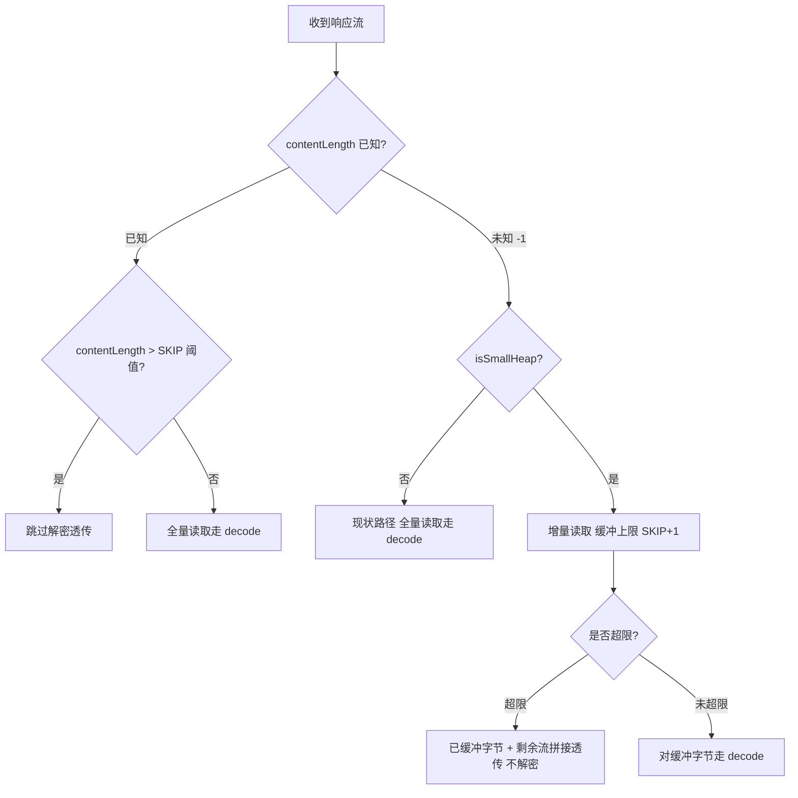

# Spec：画质增强治理修复（总开关失灵 / 预设脱节 / 无长度响应 OOM / 滑条帧级开销）

> 状态：🔄 设计中（2026-08-30）

## Intent

画质增强总开关的用户语义是「关闭时完全回退原画渲染」（`VideoPlay.kt` L106 注释承诺），但 commit `6bc9fd98f` 落地 A/B 两期画质增强后，B 批效果链脱离了总开关治理；同时代码审查发现 3 项伴生缺陷。4 项证据如下：

### [major] #1 总开关关不掉 B 批锐化/降噪

治理链自上而下断裂：

| 环节 | 位置 | 现状 |
|------|------|------|
| 总开关切换 | `VideoSettingsPanelContent.kt` L316-320 | `onCheckedChange` 只调 `ImageEnhanceController.applyToRegistered()`（A 期 TextureView Paint 滤镜），不触达 B 批效果链 |
| 效果链构建 | `ImageEnhanceEffects.kt` L43-54 | `buildEffects(sharpenLevel, denoiseLevel)` 只按档位构建，不读 `VideoPlay.enhanceEnabled` |
| 运行时注入 | `ExoVideoManager.kt` L120-134 | `applyImageEnhanceEffects()` 直接 `setVideoEffects(效果)`，无开关检查 |
| 重新注入 | `VideoPlayer.kt` L337 | `onPrepared` 每次 `post { applyEffectsToPlayer() }`，关闭开关后重播/切集仍重新注入 |
| 档位复位通道 | `VideoSettingsPanelContent.kt` L322 / L369-378 | 总开关关闭后 B 批设置行被 `if (enhanceEnabled)` 隐藏，用户无法改档位复位 |

结果：总开关关闭后锐化/降噪仍然生效，且用户失去唯一复位入口，与 `VideoPlay.kt` L106「关闭时完全回退原画渲染」承诺直接矛盾。

### [minor] #2 滑条调节后预设标签与实际参数永久脱节

`VideoSettingsPanelContent.kt` L323-362 四个画质滑条（亮度/对比度/饱和度/色温）`onCommit` 只写四参数 + `applyToRegistered()`，不联动 `enhancePreset = 3`（自定义）；预设弹框 `selectedIndex = enhancePreset`（L510）→ 参数已偏离预设但标签仍显示原预设名，且永久无法自愈。

### [minor] #3 无长度响应绕过 OOM 守卫（防护未闭环）

`OkHttpStreamFetcher.kt` L183 小内存跳过解密守卫：`contentLength > SKIP_DECODE_SIZE_BYTES` 才跳过 decode。chunked/无长度响应 `contentLength = -1` 绕过守卫仍全量 decode——L178-181 注释声称的 OOM 防护目标对无长度响应完全失效。

### [minor] #4 滑条拖动帧级开销（低端机卡顿/闪烁风险）

`EnhanceSliderRow.onValueChange`（L692-696）每帧触发 `onCommit` → ① `VideoPlay.xxx = 值`（每帧 SharedPreferences 写）→ ② `applyToRegistered()` → `ImageEnhanceController.apply()` L99-111 每次 `new Paint` + `setLayerType(HARDWARE)` → 拖动过程硬件层反复重建。

## Scope

**做什么**（4 项修复）：

| 编号 | 修复 | 设计决策 |
|------|------|---------|
| #1 | 总开关治理 B 批效果链（单点守卫 + 当前播放实例立即生效） | AD-01 |
| #2 | 四个画质滑条 onCommit 联动自定义预设 | AD-02 |
| #3 | 无长度响应有界缓冲（OOM 防护闭环） | AD-03 |
| #4 | Paint 缓存 + 参数指纹短路（消除拖动帧级重建） | AD-04 |

**不做什么**（登记缓修）：

- **#5 ExploreFragment observeEvent 观察者跨视图重建累积**：共享扩展改动影响面大，登记缓修
- **manga 分支 L172 `bytes()` 无长度全量读**：既有路径，非本任务引入，登记缓修
- **UI 样式调整**：设置面板布局/样式不动（本任务仅改行为逻辑）

## Approach

### Selected Approach

**AD-01 效果链总开关治理单点化**

- `ImageEnhanceEffects.buildEffects()` 开头加 `if (!VideoPlay.enhanceEnabled) return emptyList()` —— 单点守卫覆盖 onPrepared 重注入 / 弹框 / 未来所有调用方；`setVideoEffects(emptyList())` 即 K4 清空语义
- 总开关 `onCheckedChange` 补调 `ImageEnhanceController.applyEffectsToPlayer()` —— 立即生效当前播放实例，无需重播

**AD-02 滑条联动自定义预设**

- 4 个 `onCommit` 内加 `if (enhancePreset != 3) { enhancePreset = 3; VideoPlay.enhancePreset = 3 }`

**AD-03 无长度响应有界缓冲**

- contentLength 未知（-1）且 isSmallHeap 时：增量读取至 `SKIP_DECODE_SIZE_BYTES + 1` 上限缓冲；超限 → 已缓冲字节 + 剩余流拼接透传（不解密）；未超限 → 对缓冲字节走 decode。内存峰值 ≤ SKIP 阈值，与现状 decode 等价。

**AD-04 Paint 缓存 + 参数指纹短路**

- `ImageEnhanceController` 增加单例缓存 Paint 与最近一次四参数指纹（b/c/s/t）
- 参数未变 → 跳过重建与 `setLayerType`；参数变化 → 复用同一 Paint 更新 colorFilter 内容

### Alternatives Considered

| 编号 | 备选方案 | 结论 | 理由 |
|------|---------|------|------|
| A1 | 仅在总开关 `onCheckedChange` 补 `applyEffectsToPlayer()`，不动 `buildEffects()` | ❌ 否决 | 单点治理缺失：onPrepared 重注入路径与未来调用方仍会复发 |
| A2 | 无长度响应直接跳过解密 | ❌ 否决 | 合法加密图可能永不显示，回归风险 |
| A3 | 滑条改 `onValueChangeFinished` 落盘 + 不实时预览 | ❌ 否决 | 违背前置 spec RA2「参数拖动即时生效（实时预览）」规格 |
| A4 | 每次 `apply()` 后全局 invalidate 硬件层 | ❌ 否决 | 治标不治本：仍每帧分配 Paint，硬件层重建未消除 |

### Drawbacks（均接受）

| 缺陷 | 接受理由 |
|------|---------|
| `buildEffects()` 读 `VideoPlay` 引入效果链对 model 层耦合 | B 批档位参数本就从 `VideoPlay` 读取，耦合增量最小；换取未来调用方免维护的单点治理 |
| 有界缓冲在无长度 + 小内存时多一次 ≤10MB 拷贝（缓冲+拼接） | 内存峰值 ≤ SKIP 阈值，与现状 decode 等价；仅在无长度 + 超限透传路径发生 |
| Paint 指纹判断在极端频繁参数变化时收益趋零 | 正常拖动为连续微变，指纹命中率高；即使未命中也退化为现状重建行为，无负收益 |

### Prior Art

| 来源 | 沿用点 |
|------|--------|
| [video-player-image-enhance](../video-player-image-enhance/spec.md) | K4 清空语义（池化实例显式清空 effects）——AD-01 将清空语义从「实例生命周期」扩展到「开关语义」，`buildEffects()` 返回空列表与 K4 清空动作等价；RA2 拖动即时生效——A3 否决依据 |
| [sniff-regression-rss-image-crash](../sniff-regression-rss-image-crash/spec.md) | H3 守卫（小内存设备 >10MB 跳过解密透传，`OkHttpStreamFetcher`）——AD-03 补齐其 `contentLength = -1` 绕过分支，防护闭环 |

## Requirements

| 编号 | 需求 | 来源 |
|------|------|------|
| R1 | 总开关关闭后，当前正在播放的实例立即无锐化/降噪效果（无需重新播放） | #1 / AD-01 |
| R2 | 总开关关闭后，重新播放（onPrepared 重注入）仍为原画渲染（无锐化/降噪） | #1 / AD-01 |
| R3 | 滑条拖动调节后预设标签变「自定义」（enhancePreset=3），重进面板预设弹框选中项正确 | #2 / AD-02 |
| R4 | 小内存设备 + 无长度大图（>SKIP 阈值）不触发全量 decode OOM | #3 / AD-03 |
| R5 | 滑条拖动流畅，无明显掉帧/闪烁（拖动过程无硬件层反复重建） | #4 / AD-04 |
| R6 | 编译门禁通过 + 既有画质增强功能（A 期滤镜 / B 批效果 / 预设 / 档位）无回归 | 任务门禁 |

## Scenarios

### 正常

| 场景 | 操作 | 预期 |
|------|------|------|
| 开关切换-关 | 播放中关总开关 | 当前播放立即无锐化/降噪（R1）；重播仍原画（R2）；B 批设置行隐藏 |
| 开关切换-开 | 重新开总开关 | 效果链按档位恢复，无需重播 |
| 滑条调节 | 拖动任一画质滑条 | 参数即时生效 + `enhancePreset` 联动为 3（自定义），预设标签正确（R3） |
| 预设选择 | 预设弹框选择任意预设 | 参数套用 + 选中项与实际参数一致 |
| 无长度小图 | 小内存 + 无长度响应 ≤SKIP 阈值 | 增量缓冲后正常走 decode，图片正常显示 |

### 异常

| 场景 | 预期 |
|------|------|
| 无长度超限 | 小内存 + 无长度响应 >SKIP 阈值：已缓冲字节 + 剩余流拼接透传（不解密），不 OOM（R4） |
| 效果链注入失败兜底 | `setVideoEffects` 异常 / 引擎降级：播放不中断，回退原画渲染（既有兜底行为不变） |
| 增量读取 IO 异常 | 流中断/超时：走既有 fetch 异常路径，无新增吞异常 |

### 边界

| 场景 | 预期 |
|------|------|
| contentLength = -1（chunked） | 小内存走有界缓冲分支；非小内存走现状 decode |
| 恰好等于 SKIP 阈值 | 未超限 → 走 decode（`+1` 上限保证「恰好等于」进 decode，与已知长度行为一致） |
| 全关档位（锐化=0 / 降噪=0） | `buildEffects` 返回空列表，`setVideoEffects(emptyList())` 即 K4 清空，等价原画 |
| enhancePreset 已是 3 时再拖滑条 | 不重复写（`if (enhancePreset != 3)` 短路） |
