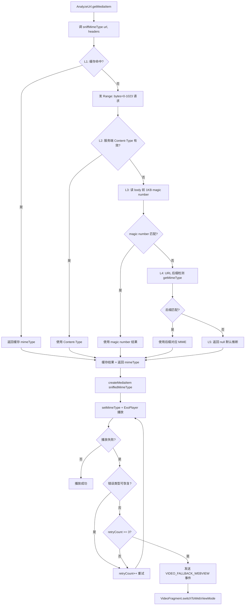
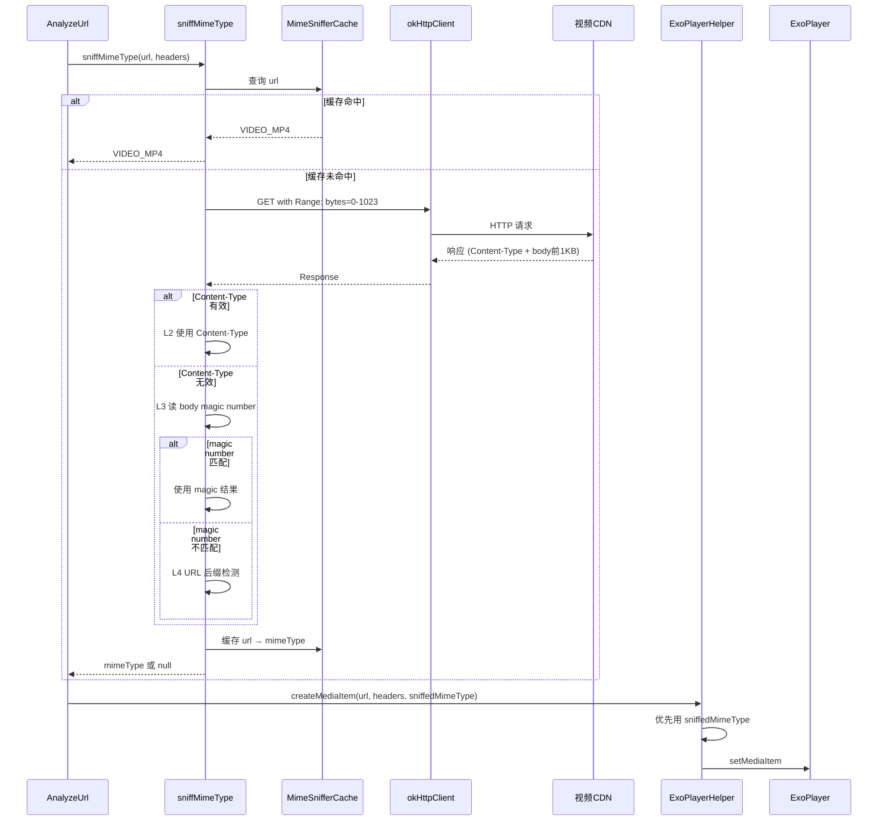
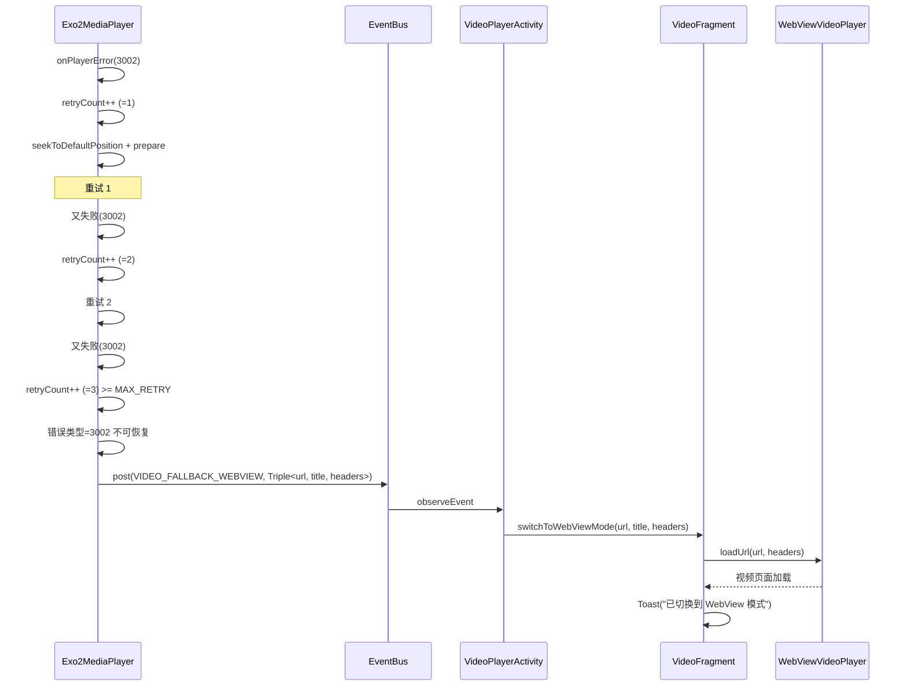

# ExoPlayer 韧性优化 - 技术设计

> 状态：🔄 设计中（R2 修订：基于业界调研改为预嗅探+缓存+多级识别方案）

## Technical Approach（技术方案）

### 整体架构：5 级识别优先级链 + 自动 WebView 降级

**优先级链**：`缓存命中 > 服务端 Content-Type > magic number 检测 > URL 后缀检测 > 默认推断`



### 核心组件实现要点

#### 组件 1：MimeSniffer（magic number 匹配工具）

- **职责**：输入 ByteArray，输出 mimeType 或 null
- **magic number 表**（参考 Chromium + Go 规范）：
  ```
  mp4:     "ftyp" at offset 4              → video/mp4
  m3u8:    "#EXTM3U" at offset 0 (跳过BOM) → application/x-mpegURL
  flv:     "FLV\x01" at offset 0            → video/x-flv
  ts:      "\x47" 重复≥10次 (前1KB)         → video/mp2t
  mkv/webm: "\x1A\x45\xDF\xA3" at offset 0 → video/x-matroska
  mpd:     "<?xml" + "<MPD"                 → application/dash+xml
  ```
- **独立可测试**：单元测试覆盖各格式 magic number 输入

#### 组件 2：MimeSnifferCache（URL → mimeType LRU 缓存）

- **职责**：缓存 URL → mimeType 映射，避免重复嗅探
- **实现**：`android.util.LruCache<String, String>(100)`（参考项目内 customIp LruCache 模式）
- **TTL**：1 小时（避免长缓存导致源切换格式后误判）
- **key**：URL 去除 query 参数后的 path（避免 query 变化导致缓存失效）

#### 组件 3：sniffMimeType（预嗅探 suspend 函数）

- **职责**：异步预嗅探，返回 mimeType 或 null
- **实现位置**：`ExoPlayerHelper.kt` 新增 `suspend fun sniffMimeType(url, headers): String?`
- **流程**：
  1. 查 MimeSnifferCache，命中直接返回
  2. 用 okHttpClient 发 `Range: bytes=0-1023` 请求
  3. 检查响应头 Content-Type（L2）
  4. 读取响应 body 前 1KB，用 MimeSniffer 匹配 magic number（L3）
  5. 缓存结果
  6. 失败返回 null（不抛异常）
- **超时控制**：3 秒超时，避免阻塞 UI
- **协程调度**：在 Dispatchers.IO 执行网络请求

#### 组件 4：自动 WebView 降级

- **触发位置**：`Exo2MediaPlayer.onPlayerError`
- **触发条件**：`retryCount >= MAX_RETRY(3)` + 不可恢复错误类型
- **不可恢复错误类型**：
  - `ERROR_CODE_PARSING_CONTAINER_MALFORMED (3002)`
  - `ERROR_CODE_PARSING_BITSTREAM_MALFORMED (3003)`
  - `ERROR_CODE_PARSING_MANIFEST_MALFORMED (3004)`
  - `ERROR_CODE_DECODER_INIT_FAILED`
  - `ERROR_CODE_DECODING_FAILED`
- **传递机制**：EventBus 新增 `VIDEO_FALLBACK_WEBVIEW` 事件，载荷为 `Triple<url, title, headers>`
- **接收处理**：`VideoPlayerActivity` 接收事件 → 调用 `VideoFragment.switchToWebViewMode`
- **UI 提示**：Toast "ExoPlayer 多次失败，已切换到 WebView 模式"

## Architecture Decisions（ADR Y-Statement）

### AD-01：预嗅探 vs 拦截器方案

- **Context**: ExoPlayer URL 后缀不可靠，服务端返回非视频内容时无法识别。OkHttp 拦截器方案被否决（ThreadLocal 跨线程问题），HttpDataSource.Factory 拦截也无法修改 mimeType。
- **Concern**: 如何在 setMimeType 之前完成嗅探？
- **Decision**: 用 `Range: bytes=0-1023` 预请求 + MimeSniffer + LRU 缓存。
- **Goal**: 在 createMediaItem 之前同步完成嗅探，结果作为 sniffedMimeType 参数传入。
- **Tradeoff**: 首次播放增加 200-500ms 延迟，但通过缓存二次播放 0 延迟；预请求增加一次网络调用，但仅 1KB 流量。
- **Status**: Proposed

### AD-02：多级识别优先级链

- **Context**: 单一识别方式都不可靠（Content-Type 可能错误、magic number 可能漏判、URL 后缀可能缺失）。
- **Concern**: 如何最大化识别准确率？
- **Decision**: 5 级识别链（缓存→Content-Type→magic number→URL后缀→默认推断），任一级命中即返回。
- **Goal**: 参考 Chromium 多级识别策略，最大化兼容性。
- **Tradeoff**: 调试时需明确哪一级触发的 mimeType，需增加分层日志。
- **Status**: Proposed

### AD-03：自动 WebView 降级触发条件

- **Context**: 已有 `switchToWebViewMode` 函数（手动触发），需接入 `onPlayerError` 实现自动降级。
- **Concern**: 何时触发自动降级？失败次数？错误类型？
- **Decision**: 失败次数累计 ≥3 次 + 不可恢复错误类型（3002/3003/3004/decoder 类）时自动降级。可恢复错误（2001/2002/416）只重试不降级。
- **Goal**: 区分"临时网络抖动"（重试即可）和"格式不兼容"（必须降级），避免无意义重试。
- **Tradeoff**: 用户感知"播放器闪烁"是负面体验，但比"黑屏错误弹窗"好；阈值 3 次是经验值，可能某些场景需要 5 次。
- **Status**: Proposed

### AD-04：缓存策略

- **Context**: 预嗅探增加首次延迟，但二次播放同一 URL 无需重复嗅探。
- **Concern**: 缓存大小？TTL？key 选择？
- **Decision**: LruCache(100) + 1 小时 TTL，key 用 URL 去除 query 后的 path。
- **Goal**: 平衡内存占用与缓存命中率。
- **Tradeoff**: 1 小时 TTL 可能导致源切换格式后误判，但源切换罕见；URL path 作为 key 可能导致不同 query 的同 path URL 误用缓存，但视频 URL 通常 path 唯一。
- **Status**: Proposed

### AD-05：是否新增 RssSource.videoType 字段（R1 否决）

- **Context**: 原方案设计在 RssSource 新增 videoType 字段，让源作者显式声明视频格式。
- **Concern**: 字段类型？默认值？数据库迁移？
- **Decision**: **R1 修订否决**，不新增 videoType 字段。
- **Goal**: 用户反馈"一个网站如果列表的视频是多种类型呢？声明个屁"，单字段无法表达多类型混合源。
- **Tradeoff**: 失去源作者显式声明的优化路径，但内容嗅探 + URL 后缀检测已能覆盖大部分场景；不增加源作者负担，不需要 DB 迁移。
- **Status**: Deprecated（被用户否决）

### AD-06：OkHttp 拦截器 + ThreadLocal 方案（R2 否决）

- **Context**: 原方案在 OkHttp 拦截器层嗅探，通过 ThreadLocal 传递给 createMediaItem。
- **Concern**: ExoPlayer 在自己线程加载数据，ThreadLocal 跨线程会丢失吗？
- **Decision**: **R2 修订否决**，改用预嗅探方案。
- **Goal**: 避免 ThreadLocal 跨线程丢失问题。
- **Tradeoff**: 预嗅探增加首次延迟，但通过缓存可缓解；OkHttp 拦截器无法修改 MediaItem mimeType。
- **Status**: Deprecated（被业界调研否决）

## Data Flow（数据流）

### 数据流 1：预嗅探 + 多级识别



### 数据流 2：自动 WebView 降级



## File Changes（文件变更清单）

### 新增文件

| 文件 | 说明 |
|------|------|
| `app/src/main/java/io/legado/app/help/exoplayer/MimeSniffer.kt` | magic number 匹配工具类（独立可测试） |
| `app/src/main/java/io/legado/app/help/exoplayer/MimeSnifferCache.kt` | URL → mimeType LRU 缓存（LruCache(100) + 1小时 TTL） |

### 修改文件

| 文件 | 变更内容 |
|------|---------|
| `app/src/main/java/io/legado/app/help/exoplayer/ExoPlayerHelper.kt` | 新增 `suspend fun sniffMimeType(url, headers): String?`；createMediaItem 新增 `sniffedMimeType` 参数；getMimeType else 返回 null（已临时修复） |
| `app/src/main/java/io/legado/app/model/analyzeRule/AnalyzeUrl.kt` | `getMediaItem()` 改为 suspend，先调 sniffMimeType 再 createMediaItem |
| `app/src/main/java/io/legado/app/help/gsyVideo/Exo2MediaPlayer.kt` | `onPlayerError` 中区分可恢复 vs 不可恢复错误；失败达阈值发 VIDEO_FALLBACK_WEBVIEW 事件 |
| `app/src/main/java/io/legado/app/constant/EventBus.kt` | 新增 `VIDEO_FALLBACK_WEBVIEW = "videoFallbackWebview"` |
| `app/src/main/java/io/legado/app/ui/video/VideoPlayerActivity.kt` | observeEvent(VIDEO_FALLBACK_WEBVIEW) → 调用 VideoFragment.switchToWebViewMode |
| `app/src/main/java/io/legado/app/ui/video/VideoFragment.kt` | switchToWebViewMode 增加 Toast 提示（已有函数，仅加提示） |

### 不修改文件

- `RssSource.kt`：R1 修订，不新增 videoType 字段
- `AppDatabase.kt` / `DatabaseMigrations.kt`：R1 修订，不需要 DB 迁移
- `ExoPlayerHelper.cacheDataSourceFactory`：缓存架构不变
- `CronetHelper.kt` / `CronetInterceptor.kt`：Cronet 降级机制不变
- `WebViewVideoPlayer.kt`：WebView 播放器实现不变（已稳定）
- `BookSource.kt`：与本次无关
- `HttpHelper.kt`：不注册 OkHttp 拦截器（R2 修订，改用预嗅探）

## 调研依据（R2 修订）

### 业界调研发现

| 调研对象 | 关键发现 | 影响 |
|---------|---------|------|
| ExoPlayer Extractor 接口 | 实现 `sniff(extractorInput)` 方法读头部判断格式 | 确认 ExoPlayer 内置 sniff，但需先选对 MediaSourceFactory |
| setMimeType 作用 | 告诉 ExoPlayer 走哪个 MediaSourceFactory（Hls/Progressive） | 确认必须在 createMediaItem 前确定 mimeType |
| ResolvingDataSource | 能修改 DataSpec.uri，但不能修改 MediaItem.mimeType | 否决方案：无法动态修改 mimeType |
| HttpDataSource.Factory 拦截 | 包装 OkHttpDataSource.Factory，在 open() 时 peek | 否决方案：mimeType 在 createMediaItem 时已固定 |
| OkHttp Range 请求 | 原生支持 `Range: bytes=0-1023` | 采纳：预嗅探用 Range 请求读前 1KB |
| Chromium 多级识别 | Content-Type → URL 模式 → 内容特征 → 兜底 | 采纳：5 级识别优先级链 |
| Go DetectContentType | 512 字节检测 + 完整 magic number 表 | 参考：magic number 表设计 |
