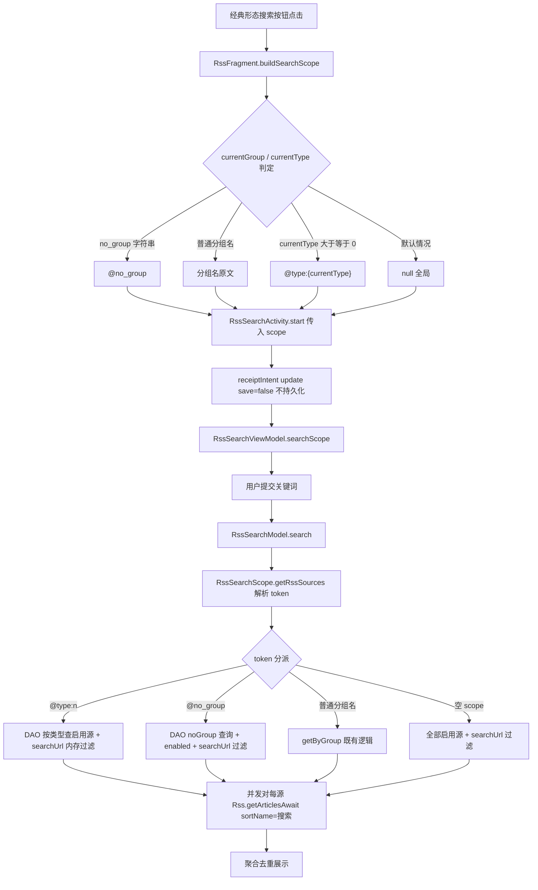

# 订阅搜索范围上下文修复 design

> 需求：订阅页（RssFragment 经典形态）头部搜索按钮进入搜索后，应限定当前分组/类型范围内的订阅源文章聚合搜索，而非全局搜索。功能名 `fix-rss-search-scope`。

## Technical Approach

### 1. scope 计算层（RssFragment）

RssFragment 经典形态新增私有函数 `buildSearchScope()`，基于既有状态字段计算搜索范围字符串：

| 状态字段 | 取值 | 产出 scope |
|---------|------|-----------|
| currentGroup | `no_group` 字符串 | `@no_group` |
| currentGroup | 普通分组名 | 分组名原文 |
| currentType | `>= 0`（0/1/2） | `@type:{currentType}` |
| 默认 | 其余情况 | `null`（不传，保持全局搜索） |

实现要点：

- `buildSearchScope()` 为纯计算函数，不修改 currentGroup/currentType 状态，只做读取与映射。
- 计算过程整体用 `kotlin.runCatching` 包裹，任何异常时回退返回 `null`（遵循项目 `kotlin.runCatching` 规范，保证搜索入口永不因 scope 计算失败而不可用）。
- 判定优先级：currentGroup 与 currentType 绝大多数写点互斥（onFolderClick L1308-1323 / tagSelectedListener L265-269 互设互清；返回键 L300-301 / resetRssModeState L372-373 / 文件夹配置变更 L1108-1109 均正确重置），唯一并存路径为更多菜单分组跳转（L955-960 仅设 currentGroup 不清 currentType）——按「currentGroup 未分组 → currentGroup 普通分组 → currentType 类型」顺序判定即可正确兜底（与列表查询 upRssFlowJob 的 currentGroup 优先分支一致），命中即返回。
- 搜索按钮 onClick 由原 `RssSearchActivity.start(context, null, null)`（L929-931 传 null，修复目标）改为传入 `buildSearchScope()` 的结果。

### 2. scope 解析层（RssSearchScope）

新增 token 判定规则：scope 字符串以 `@type:` 开头，或整体等于 `@no_group`，视为 token 形态；否则按既有分组名语义处理。

`getRssSources()`（现 L87-116）重构为「先解析 token，再分派 DAO」的单一入口：

1. **类型 token（`@type:0` / `@type:1` / `@type:2`）**：新增 DAO 按类型查询启用源（SQL `where type = :type and enabled = 1`），查询结果在内存再过滤 `searchUrl` 非空（对齐既有风格：空 scope 分支先取全部启用源、再过滤 searchUrl 非空）。
2. **未分组 token（`@no_group`）**：复用既有 `RssSourceDao` noGroup 查询（L171-174 已存在，@Query 细节实施时核实），叠加 `enabled = 1` 与 `searchUrl` 非空过滤。
3. **普通分组名**：既有 `getByGroup` 查询（like 粗筛）基础上，对结果追加 `RssSource.hasGroup(group)` 精确过滤（splitGroupRegex 切分判定），消除 like 子串误匹配（分组"A"不再混入分组"AB"的源）；多分组源（sourceGroup="A,B"）正确命中。
4. **空 scope**：全部启用源 + searchUrl 非空，行为不变。
5. token 解析结果无有效源时，与既有非空 scope 分支一致回退全部（保持回退语义统一，避免范围过窄导致空结果不可解释）。

持久化防御：

- `save()`（现 L122-129，写入 AppConfig.rssSearchScope/rssSearchGroup）对 token 形态 scope 直接短路，不调用 AppConfig 持久化，避免 token 字符串污染配置项。
- `receiptIntent`（RssSearchActivity L352-356）以 `update(searchScope, postValue = false, save = false)` 接参，本身不触发持久化，与 save() 短路构成双保险。
- `update()/remove()` 对 token 无需特判：只要 save() 短路，token 永远不会落盘。

展示映射：

- `display()/displayNames()`（现 L62-80）对 token 统一翻译为字符串资源：
  - `@no_group` → 「未分组源」
  - `@type:0` → 「网页源」
  - `@type:1` → 「图片源」
  - `@type:2` → 「视频源」
- 新增 4 条 strings 资源，实施前核实是否已有可复用文案，能复用则不新增。

### 3. 展示层

- 搜索页展示当前范围时一律经 `display()/displayNames()` 输出，token 被翻译为友好文案，用户不感知 token 原文。
- 范围选择器（如展示分组列表供切换）仅列普通分组名，token 不进入可选列表，防止用户选中 token 后触发保存语义歧义。
- 现代形态 `RssFragment`（L897 openRssSearch 传 source.sourceGroup）与 `MySettingsData`（L283 设置入口）行为保持不变，本次改动不触及。

## Architecture Decisions

> 模板：ADR Y-Statement。状态均为 Proposed（待评审确认）。

### AD-01 范围承载：token 扩展 RssSearchScope 而非 Intent 新参数直通 VM

- **Context**：在搜索范围需要表达「分组名 / 未分组 / 类型」三类语义、且 RssSearchScope 已是范围解析/展示/持久化单点的背景下。
- **Concern**：我们关心范围语义在 Activity → ViewModel → Model 链路上的传递方式与既有代码的耦合程度。
- **Decision**：我们决定在 RssSearchScope 的 scope 字符串上扩展 token 语法，而非为 Intent/ViewModel 新增独立参数直通。
- **Goal**：为了保持范围语义单一承载点，改动集中在单文件，链路各层无感知透传。
- **Tradeoff**：token 语法是字符串约定，展示层需要映射为友好文案；接受该代价（逻辑集中在单文件，映射点唯一）。
- **Status**：Proposed

### AD-02 token 前缀：选 @ 前缀

- **Context**：在需要与真实分组名区分的背景下，分组名可包含用户自定义的任意字符。
- **Concern**：我们关心前缀字符与真实分组名冲突的概率及误判后果。
- **Decision**：我们决定使用 `@` 作为 token 前缀（`@type:` / `@no_group`）。
- **Goal**：为了用最短、可读的标记实现与分组名的无歧义区分。
- **Tradeoff**：以 `@` 开头的真分组名会被误判为 token；概率极低，接受（误判后果仅为该分组搜索回退全部源，不产生数据问题）。
- **Status**：Proposed

### AD-03 类型过滤实现：新增 DAO 按类型查询而非全量内存过滤

- **Context**：在类型 token 需要筛出「启用且具备搜索能力」的源的背景下，既有 DAO 没有按类型查询的入口。
- **Concern**：我们关心类型过滤发生在 SQL 层还是内存层的性能与代码一致性。
- **Decision**：我们决定新增 DAO 方法，SQL 直接 `where type = :type and enabled = 1`。
- **Goal**：为了缩小返回结果集、复用 Room 查询能力，并与既有 DAO 查询风格保持一致。
- **Tradeoff**：新增一个 DAO 方法；接受。
- **Status**：Proposed

### AD-04 未分组复用现有 noGroup DAO 查询

- **Context**：在 `@no_group` token 需要查询未分组源的背景下，RssSourceDao 已存在 noGroup 查询（L171-174）。
- **Concern**：我们关心是否需要为未分组新增专用查询方法。
- **Decision**：我们决定复用现有 noGroup 查询，叠加 enabled 与 searchUrl 非空内存过滤，不新建方法。
- **Goal**：为了不扩大 DAO 面积，沿用已验证的查询路径。
- **Tradeoff**：无。
- **Status**：Proposed

### AD-05 持久化边界：token scope 不持久化

- **Context**：在 token scope 仅由页面上下文即时计算产生、而 AppConfig.rssSearchScope/rssSearchGroup 为持久化配置项的背景下。
- **Concern**：我们关心 token 字符串一旦写入配置，下次冷启动会恢复出无效范围。
- **Decision**：我们决定 `save()` 对 token 形态直接短路不持久化；receiptIntent 传参本身 save=false，构成双保险。
- **Goal**：为了保证 token 是纯运行时语义，不污染用户配置。
- **Tradeoff**：搜索页若把 token 范围切换成普通分组后保存，仅保存普通分组，行为可预期；接受。
- **Status**：Proposed

## Data Flow

## File Changes

| 文件 | 变更类型 | 变更内容 |
|------|---------|---------|
| `app/src/main/java/io/legado/app/ui/main/rss/RssFragment.kt` | 修改 | 经典形态搜索按钮 onClick 改传 `buildSearchScope()`；新增私有函数 `buildSearchScope()`（runCatching 防御，按 currentGroup/currentType 计算 scope，异常回退 null） |
| `app/src/main/java/io/legado/app/model/rss/RssSearchScope.kt` | 修改 | 新增 token 判定（`@type:` 前缀 / `@no_group`）；`getRssSources()` 重构为先解析 token 再分派 DAO；`display()/displayNames()` token→友好文案映射；`save()` 对 token 短路不持久化 |
| `app/src/main/java/io/legado/app/data/dao/RssSourceDao.kt` | 修改 | 新增按类型查询启用源方法（`where type = :type and enabled = 1`） |
| `app/src/main/res/values/strings.xml` | 修改 | 新增范围文案 4 条（未分组源/网页源/图片源/视频源；实施前核实是否已有可复用文案，能复用则不新增） |
