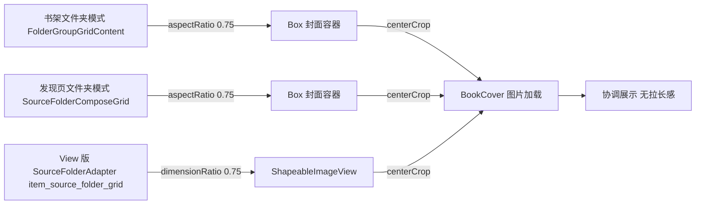

# 文件夹封面比例对齐 Archive — design

## Technical Approach
根因：当前 fork 文件夹封面容器用 `aspectRatio(0.7f)`（W/H=0.7，7:10 瘦高竖版），而用户自定义封面多为方形/横版。配合 centerCrop，方形图会被竖向放大仅展示中部竖条，观感"被拉长"。阅读Archive/原版的 `CoverImageView` 强制高 = 宽×4/3，即 W/H = **0.75** 的封面比例，更接近方形、裁剪放大感更弱。

修复：把三处文件夹封面容器目标宽高比从 0.7 改为 0.75，仅改参数，不动加载/裁剪链路。

改动点：
1. 书架文件夹网格封面：`BookshelfScreen.kt` → `FolderGroupGridContent` 内封面 `Box` 的 `Modifier.aspectRatio(0.7f)` → `0.75f`。
2. 发现页文件夹网格封面：`SourceFolderComposeGrid.kt` → `SourceFolderCover` 外层 `Box` 的 `Modifier.aspectRatio(0.7f)` → `0.75f`。
3. View 版文件夹卡片封面：`item_source_folder_grid.xml` → `iv_folder_cover` 的 `app:layout_constraintDimensionRatio="0.7"` → `"0.75"`。

比例语义统一说明：Compose `aspectRatio(x)` 的 x 即 W/H；ConstraintLayout 单浮点 `dimensionRatio` 亦为 W/H（`layout_constraintDimensionRatio="0.75"`）。两者一致，与 Archive `width*4/3` 对应的 W/H=0.75 完全对齐。

## Architecture Decisions

### AD-01: 文件夹封面比例统一为 0.75 并对齐 Archive
- **Context**: 当前书架/发现页文件夹封面容器为 0.7（7:10 瘦高），自定义方形/横版封面被竖向放大裁剪显"拉长"；Archive/原版 `CoverImageView` 固定 W/H=0.75。
- **Concern**: 如何在不大改的前提下让文件夹封面协调、不"拉长"。
- **Decision**: 将三处文件夹封面容器目标比例 0.7 → 0.75，保持 centerCrop。
- **Goal**: 封面呈现与 Archive 观感一致，消除明显"拉长/不协调"。
- **Tradeoff**: 极端超宽图仍会被 centerCrop 裁两侧（Archive 同款固有行为）；0.75 与 Archive 完全一致。
- **Status**: Proposed
- **Superseded-by**: 无

### AD-02: 不改书籍封面比例（0.7 保持不变）
- **Context**: 书籍封面本身为书形竖版，0.7 适配良好，且不在本次用户诉求内。
- **Concern**: 避免误改影响书籍网格观感。
- **Decision**: 只改文件夹封面容器（`FolderGroupGridContent`/`SourceFolderComposeGrid`/View 版文件夹），`BookGrid` 与列表书籍封面 0.7 保持不变。
- **Goal**: 精准修复，最小回归面。
- **Tradeoff**: 书籍封面比例维持原状，不影响。
- **Status**: Proposed

## Data Flow

## File Changes
| 文件 | 变更 |
|------|------|
| `app/src/main/java/io/legado/app/ui/main/bookshelf/BookshelfScreen.kt` | `FolderGroupGridContent` 封面 `aspectRatio(0.7f)` → `0.75f`（仅 235 行附近，不动 BookGrid/列表书籍封面） |
| `app/src/main/java/io/legado/app/ui/adapter/SourceFolderComposeGrid.kt` | 封面 `aspectRatio(0.7f)` → `0.75f`（L78） |
| `app/src/main/res/layout/item_source_folder_grid.xml` | `iv_folder_cover` 的 `layout_constraintDimensionRatio="0.7"` → `"0.75"`（L42） |
| `docs/INDEX.md` | 注册本次功能 |